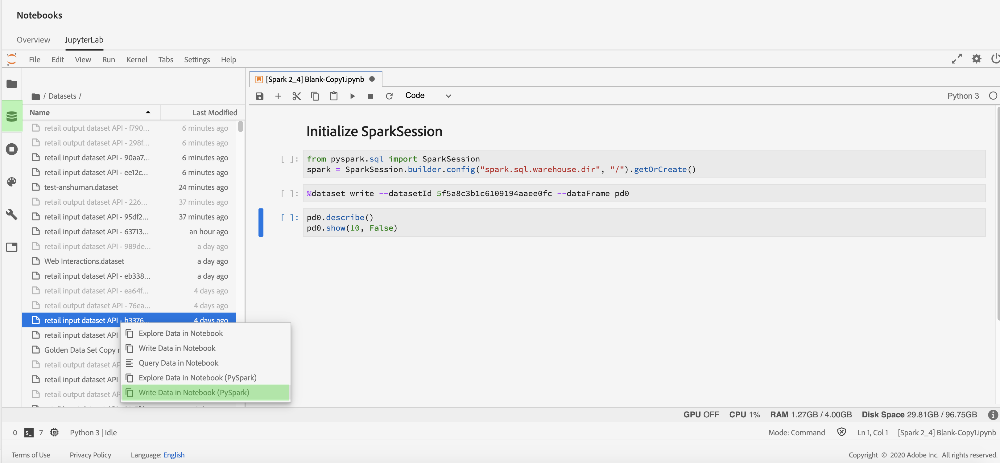

# Datenzugriff in [!DNL Jupyterlab] Notebooks

Jeder unterstützte Kernel bietet native Funktionen, mit denen Sie Platform-Daten aus einem Datensatz in einem Notebook lesen können. Derzeit unterstützt JupyterLab in Adobe Experience Platform Data Science Workspace Notebooks für [!DNL Python], R, PySpark und Scala. Die Unterstützung für die Paginierung von Daten ist jedoch auf [!DNL Python] und R Notebooks. In diesem Handbuch wird beschrieben, wie Sie mit JupyterLab-Notebooks auf Ihre Daten zugreifen können.

## Erste Schritte

Bevor Sie dieses Handbuch lesen, lesen Sie bitte die [[!DNL JupyterLab] Benutzerhandbuch](./overview.md) für eine Einführung auf hoher Ebene in [!DNL JupyterLab] und seiner Rolle in Data Science Workspace.

## Einschränkungen für Notebook-Daten {#notebook-data-limits}

>[!IMPORTANT]
>
>Bei PySpark- und Scala-Notebooks, wenn Sie einen Fehler mit dem Grund &quot;Remote RPC Client getrennt&quot;erhalten. Dies bedeutet normalerweise, dass dem Treiber oder einem Executor der Speicher ausgeht. Versuchen Sie, zu wechseln [Batch-Modus](#mode) um diesen Fehler zu beheben.

Die folgenden Informationen definieren die maximale Datenmenge, die gelesen werden kann, welche Art von Daten verwendet wurde und den geschätzten Zeitrahmen, in dem die Daten gelesen werden.

Für [!DNL Python] und R, ein mit 40 GB RAM konfigurierter Notebook-Server, wurde für die Benchmarks verwendet. Für PySpark und Scala wurde ein mit 64 GB RAM, 8 Kernen und 2 DBU konfigurierter Datenbank-Cluster mit maximal 4 Workern für die unten beschriebenen Benchmarks verwendet.

Die verwendeten ExperienceEvent-Schemadaten variierten in ihrer Größe von 1.000 Zeilen (1.000) bis zu einer Milliarde (1.000) Zeilen. Beachten Sie Folgendes für den PySpark und [!DNL Spark] Metriken wurde für die XDM-Daten ein Datumsbereich von 10 Tagen verwendet.

Die Ad-hoc-Schemadaten wurden mit [!DNL Query Service] Erstellen Sie eine Tabelle als &quot;Select&quot;(CTAS). Diese Daten variierten auch von 100 (1.000) Zeilen bis zu einer Milliarde (1.000) Zeilen.

### Verwendung des Batch-Modus im Vergleich zum interaktiven Modus {#mode}

Beim Lesen von Datensätzen mit PySpark- und Scala-Notebooks haben Sie die Möglichkeit, den interaktiven Modus oder Batch-Modus zu verwenden, um den Datensatz zu lesen. Interaktiv erfolgt für schnelle Ergebnisse, während der Batch-Modus für große Datensätze verwendet wird.

- Bei PySpark- und Scala-Notebooks sollte der Batch-Modus verwendet werden, wenn mindestens 5 Millionen Datenzeilen gelesen werden. Weitere Informationen zur Effizienz der einzelnen Modi finden Sie in der [PySpark](#pyspark-data-limits) oder [Scala](#scala-data-limits) Datenbegrenzungstabellen unten.

### [!DNL Python] Datenbeschränkungen für Notebooks

**XDM ExperienceEvent-Schema:** Sie sollten maximal 2 Millionen Zeilen (~6,1 GB Daten auf der Festplatte) von XDM-Daten in weniger als 22 Minuten lesen können. Das Hinzufügen zusätzlicher Zeilen kann zu Fehlern führen.

| Anzahl Zeilen | 1K | 10K | 100.000 | 1 M | 2 M |
| ----------------------- | ------ | ------ | ----- | ----- | ----- |
| Größe auf Festplatte (MB) | 18.73 | 187.5 | 308 | 3000 | 6050 |
| SDK (in Sekunden) | 20.3 | 86.8 | 63 | 659 | 1315 |

**Ad-hoc-Schema:** Sie sollten maximal 5 Millionen Zeilen (~5,6 GB Daten auf der Festplatte) von Nicht-XDM-Daten (Ad-hoc-Daten) in weniger als 14 Minuten lesen können. Das Hinzufügen zusätzlicher Zeilen kann zu Fehlern führen.

| Zeilenanzahl | 1K | 10K | 100.000 | 1M | 2M | 3 M | 5 M |
| ----------------------- | ------- | ------- | ----- | ----- | ----- | ----- | ------ |
| Größe auf Festplatte (in MB) | 1.21 | 11.72 | 115 | 1120 | 2250 | 3380 | 5630 |
| SDK (in Sekunden) | 7.27 | 9.04 | 27.3 | 180 | 346 | 487 | 819 |

### R Notebook-Datenbeschränkungen

**XDM ExperienceEvent-Schema:** Sie sollten maximal 1 Million Zeilen XDM-Daten (3 GB Daten auf der Festplatte) in weniger als 13 Minuten lesen können.

| Zeilenanzahl | 1K | 10K | 100.000 | 1M |
| ----------------------- | ------ | ------ | ----- | ----- |
| Größe auf Festplatte (MB) | 18.73 | 187.5 | 308 | 3000 |
| R-Kernel (in Sekunden) | 14.03 | 69.6 | 86.8 | 775 |

**Ad-hoc-Schema:** Sie sollten maximal 3 Millionen Zeilen Ad-hoc-Daten (293 MB Daten auf der Festplatte) in etwa 10 Minuten lesen können.

| Zeilenanzahl | 1K | 10K | 100.000 | 1M | 2M | 3M |
| ----------------------- | ------- | ------- | ----- | ----- | ----- | ----- |
| Größe auf Festplatte (in MB) | 0.082 | 0.612 | 9.0 | 91 | 188 | 293 |
| R SDK (in Sek.) | 7.7 | 4.58 | 35.9 | 233 | 470.5 | 603 |

### PySpark ([!DNL Python] Kernel) Notebook-Datenbeschränkungen: {#pyspark-data-limits}

**XDM ExperienceEvent-Schema:** Im interaktiven Modus sollten Sie maximal 5 Millionen Zeilen (~13,42 GB Daten auf der Festplatte) von XDM-Daten in etwa 20 Minuten lesen können. Der interaktive Modus unterstützt nur bis zu 5 Millionen Zeilen. Wenn Sie größere Datensätze lesen möchten, wird empfohlen, in den Batch-Modus zu wechseln. Im Batch-Modus sollten Sie in der Lage sein, maximal 500 Millionen Zeilen (~1,31 TB-Daten auf der Festplatte) von XDM-Daten in etwa 14 Stunden zu lesen.

| Zeilenanzahl | 1K | 10K | 100.000 | 1M | 2M | 3M | 5M | 10 M | 50M | 100M | 500M |
|-------------------------|--------|--------|-------|-------|-------|-------|---------|---------|----------|--------|--------|
| Größe auf der Festplatte | 2.93 MB | 4.38 MB | 29.02 | 2.69 GB | 5.39 GB | 8.09 GB | 13.42 GB | 26.82 GB | 134.24 GB | 268.39 GB | 1.31TB |
| SDK (interaktiver Modus) | 33 Sek. | 32.4 Sek. | 55.1 Sek. | 253.5 Sek. | 489.2 Sek. | 729.6 Sek. | 1206.8 Sek. | – | – | – | – |
| SDK (Batch-Modus) | 815.8 Sek. | 492.8 Sek. | 379.1 Sek. | 637.4 Sek. | 624.5 Sek. | 869.2 Sek. | 1104.1 Sek. | 1786 Sek. | 5387.2 Sek. | 10624.6 Sek. | 50547 Sek. |

**Ad-hoc-Schema:** Im interaktiven Modus sollten Sie maximal 5 Millionen Zeilen (~5,36 GB Daten auf der Festplatte) von Nicht-XDM-Daten in weniger als 3 Minuten lesen können. Im Batch-Modus sollten Sie in der Lage sein, maximal 1 Milliarde Zeilen (~1,05 TB Daten auf der Festplatte) von Nicht-XDM-Daten in etwa 18 Minuten zu lesen.

| Zeilenanzahl | 1K | 10K | 100.000 | 1M | 2M | 3M | 5M | 10M | 50M | 100M | 500M | 1B |
|--------------|--------|---------|---------|-------|-------|-------|--------|--------|---------|--------|---------|-------|
| Größe der Festplatte | 1.12 MB | 11.24 MB | 109.48 MB | 2.69 GB | 2.14 GB | 3.21 GB | 5.36 GB | 10.71 GB | 53.58 GB | 107.52 GB | 535.88 GB | 1.05TB |
| Interaktiver SDK-Modus (in Sekunden) | 28.2 Sek. | 18.6 Sek. | 20.8 Sek. | 20.9 Sek. | 23.8 Sek. | 21.7 Sek. | 24.7 Sek. | – | – | – | – | – |
| SDK-Batch-Modus (in Sekunden) | 428.8 Sek. | 578.8 Sek. | 641.4 Sek. | 538.5 Sek. | 630.9 Sek. | 467.3 Sek. | 411 Sek. | 675 Sek. | 702 Sek. | 719.2 Sek. | 1022.1 Sek. | 1122.3 Sek. |

### [!DNL Spark] (Scala-Kernel) Notebook-Datenbeschränkungen: {#scala-data-limits}

**XDM ExperienceEvent-Schema:** Im interaktiven Modus sollten Sie maximal 5 Millionen Zeilen (~13,42 GB Daten auf der Festplatte) von XDM-Daten in etwa 18 Minuten lesen können. Der interaktive Modus unterstützt nur bis zu 5 Millionen Zeilen. Wenn Sie größere Datensätze lesen möchten, wird empfohlen, in den Batch-Modus zu wechseln. Im Batch-Modus sollten Sie in der Lage sein, maximal 500 Millionen Zeilen (~1,31 TB-Daten auf der Festplatte) von XDM-Daten in etwa 14 Stunden zu lesen.

| Zeilenanzahl | 1K | 10K | 100.000 | 1M | 2M | 3M | 5M | 10M | 50M | 100M | 500M |
|---------------|--------|--------|-------|-------|-------|-------|---------|---------|----------|--------|--------|
| Größe der Festplatte | 2.93 MB | 4.38 MB | 29.02 | 2.69 GB | 5.39 GB | 8.09 GB | 13.42 GB | 26.82 GB | 134.24 GB | 268.39 GB | 1.31TB |
| Interaktiver SDK-Modus (in Sekunden) | 37.9 Sek. | 22.7 Sek. | 45.6 Sek. | 231.7 Sek. | 444.7 Sek. | 660.6 Sek. | 1100 Sek. | – | – | – | – |
| SDK-Batch-Modus (in Sekunden) | 374.4 Sek. | 398.5 Sek. | 527 Sek. | 487.9 Sek. | 588.9 Sek. | 829 Sek. | 939.1 Sek. | 1441 Sek. | 5473.2 Sek. | 10118.8 | 49207.6 |

**Ad-hoc-Schema:** Im interaktiven Modus sollten Sie maximal 5 Millionen Zeilen (~5,36 GB Daten auf der Festplatte) von Nicht-XDM-Daten in weniger als 3 Minuten lesen können. Im Batch-Modus sollten Sie in der Lage sein, maximal 1 Milliarde Zeilen (~1,05 TB Daten auf der Festplatte) von Nicht-XDM-Daten in etwa 16 Minuten zu lesen.

| Zeilenanzahl | 1K | 10K | 100.000 | 1M | 2M | 3M | 5M | 10M | 50M | 100M | 500M | 1B |
|--------------|--------|---------|---------|-------|-------|-------|---------|---------|---------|--------|---------|-------|
| Größe der Festplatte | 1.12 MB | 11.24 MB | 109.48 MB | 2.69 GB | 2.14 GB | 3.21 GB | 5.36 GB | 10.71 GB | 53.58 GB | 107.52 GB | 535.88 GB | 1.05TB |
| Interaktiver SDK-Modus (in Sekunden) | 35.7 Sek. | 31 Sek. | 19.5 Sek. | 25.3 Sek. | 23 Sek. | 33.2 Sek. | 25.5 Sek. | – | – | – | – | – |
| SDK-Batch-Modus (in Sekunden) | 448.8 Sek. | 459.7 Sek. | 519 Sek. | 475.8 Sek. | 599.9 Sek. | 347.6 Sek. | 407.8 Sek. | 397 Sek. | 518.8 Sek. | 487.9 Sek. | 760.2 Sek. | 975.4 Sek. |

## Python Notebooks {#python-notebook}

[!DNL Python] Mit Notebooks können Sie Daten beim Zugriff auf Datensätze paginieren. Nachstehend finden Sie Beispiel-Code zum Lesen von Daten mit und ohne Paginierung. Weitere Informationen zu den verfügbaren Start-Python-Notebooks finden Sie im [[!DNL JupyterLab] Starter](./overview.md#launcher) im JupyterLab-Benutzerhandbuch.

In der folgenden Python-Dokumentation werden die folgenden Konzepte beschrieben:

- [Aus einem Datensatz lesen](#python-read-dataset)
- [Schreiben in einen Datensatz](#write-python)
- [Abfragedaten](#query-data-python)
- [ExperienceEvent-Daten filtern](#python-filter)

### Aus einem Datensatz in Python lesen {#python-read-dataset}

**Ohne Paginierung:**

Wenn Sie den folgenden Code ausführen, wird der gesamte Datensatz gelesen. Bei erfolgreicher Ausführung werden die Daten als Pandas-Dataframe gespeichert, auf den die Variable `df` verweist.

```python
# Python

from platform_sdk.dataset_reader import DatasetReader
dataset_reader = DatasetReader(get_platform_sdk_client_context(), dataset_id="{DATASET_ID}")
df = dataset_reader.read()
df.head()
```

**Mit Paginierung:**

Wenn Sie folgenden Code ausführen, werden Daten aus dem angegebenen Datensatz gelesen. Paginierung wird erreicht, indem Daten über die Funktion `limit()` bzw. `offset()` begrenzt und versetzt werden. Datenbegrenzung bezieht sich auf die maximale Anzahl der zu lesenden Datenpunkte, während Versatz auf die Anzahl der Datenpunkte verweist, die vor dem Lesen von Daten übersprungen werden. Wenn der Lesevorgang erfolgreich ausgeführt wird, werden die Daten als Pandas-Dataframe gespeichert, auf den die Variable `df` verweist.

```python
# Python

from platform_sdk.dataset_reader import DatasetReader

dataset_reader = DatasetReader(get_platform_sdk_client_context(), dataset_id="{DATASET_ID}")
df = dataset_reader.limit(100).offset(10).read()
```

### Schreiben in einen Datensatz in Python {#write-python}

Um in einen Datensatz in Ihrem JupyterLab-Notebook zu schreiben, wählen Sie im linken Navigationsbereich von JupyterLab die Registerkarte Datensymbol (unten hervorgehoben). Die **[!UICONTROL Datensätze]** und **[!UICONTROL Schemas]** -Verzeichnissen angezeigt. Auswählen **[!UICONTROL Datensätze]** Klicken Sie mit der rechten Maustaste und wählen Sie dann die **[!UICONTROL Daten in Notebook schreiben]** im Dropdown-Menü des Datensatzes, den Sie verwenden möchten. Unten im Notebook wird ein ausführbarer Code-Eintrag angezeigt.


- Verwendung **[!UICONTROL Daten in Notebook schreiben]** , um eine Schreibzelle mit dem ausgewählten Datensatz zu generieren.
- Verwendung **[!UICONTROL Daten in Notebook erkunden]** , um eine Lesezelle mit dem ausgewählten Datensatz zu generieren.
- Verwendung **[!UICONTROL Abfragedaten in Notebook]** , um eine einfache Abfragezelle mit Ihrem ausgewählten Datensatz zu generieren.

Alternativ können Sie die folgende Code-Zelle kopieren und einfügen. Ersetzen Sie beide `{DATASET_ID}` und `{PANDA_DATAFRAME}`.

```python
from platform_sdk.models import Dataset
from platform_sdk.dataset_writer import DatasetWriter

dataset = Dataset(get_platform_sdk_client_context()).get_by_id(dataset_id="{DATASET_ID}")
dataset_writer = DatasetWriter(get_platform_sdk_client_context(), dataset)
write_tracker = dataset_writer.write({PANDA_DATAFRAME}, file_format='json')
```

### Abfragedaten verwenden [!DNL Query Service] in [!DNL Python] {#query-data-python}

[!DNL JupyterLab] on [!DNL Platform] ermöglicht Ihnen die Verwendung von SQL in einer [!DNL Python] Notebook für den Datenzugriff über [Adobe Experience Platform Query Service](https://docs.adobe.com/content/help/de-DE/experience-platform/query/home.html). Zugriff auf Daten über [!DNL Query Service] kann aufgrund der kürzeren Ausführungszeiten bei der Verarbeitung großer Datensätze nützlich sein. Beachten Sie, dass die Datenabfrage mithilfe von [!DNL Query Service] hat eine Verarbeitungszeitbeschränkung von zehn Minuten.

Vor der Verwendung von [!DNL Query Service] in [!DNL JupyterLab], stellen Sie sicher, dass Sie ein Verständnis der [[!DNL Query Service] SQL-Syntax](https://docs.adobe.com/content/help/de-DE/experience-platform/query/home.html#!api-specification/markdown/narrative/technical_overview/query-service/sql/syntax.md).

Abfrage von Daten mit [!DNL Query Service] erfordert, dass Sie den Namen des Zieldatensatzes angeben. Sie können die erforderlichen Code-Zellen generieren, indem Sie den gewünschten Datensatz mit dem **[!UICONTROL Data Explorer]** suchen. Klicken Sie mit der rechten Maustaste auf die Datensatzliste und klicken Sie auf **[!UICONTROL Abfragedaten in Notebook]** , um zwei Code-Zellen in Ihrem Notebook zu generieren. Diese beiden Zellen werden nachfolgend detaillierter beschrieben.


Um [!DNL Query Service] in [!DNL JupyterLab], müssen Sie zunächst eine Verbindung zwischen Ihrer Arbeit erstellen [!DNL Python] Notebook und [!DNL Query Service]. Dies kann durch Ausführen der ersten generierten Zelle erreicht werden.

```python
qs_connect()
```

In der zweiten generierten Zelle muss die erste Zeile vor der SQL-Abfrage definiert werden. Standardmäßig definiert die generierte Zelle eine optionale Variable (`df0`), mit der die Abfrageergebnisse als Pandas-Dataframe gespeichert werden. <br>Die `-c QS_CONNECTION` -Argument ist obligatorisch und weist den Kernel an, die SQL-Abfrage für auszuführen [!DNL Query Service]. Eine Liste weiterer Argumente finden Sie im [Anhang](#optional-sql-flags-for-query-service).

```python
%%read_sql df0 -c QS_CONNECTION
SELECT *
FROM name_of_the_dataset
LIMIT 10
/* Querying table "name_of_the_dataset" (datasetId: {DATASET_ID})*/
```

Python-Variablen können in einer SQL-Abfrage direkt referenziert werden, indem Sie eine im Zeichenfolgenformat formatierte Syntax verwenden und die Variablen in geschweifte Klammern (`{}`) setzen (siehe folgendes Beispiel):

```python
table_name = 'name_of_the_dataset'
table_columns = ','.join(['col_1','col_2','col_3'])
```

```python
%%read_sql demo -c QS_CONNECTION
SELECT {table_columns}
FROM {table_name}
```

### Filter [!DNL ExperienceEvent] data {#python-filter}

Um auf eine [!DNL ExperienceEvent] Datensatz in einem [!DNL Python] Notebook müssen Sie die Kennung des Datensatzes (`{DATASET_ID}`) zusammen mit den Filterregeln, die mithilfe logischer Operatoren einen bestimmten Zeitraum definieren. Wenn ein Zeitraum definiert ist, wird jede angegebene Paginierung ignoriert und der gesamte Datensatz berücksichtigt.

Eine Liste der Filteroperatoren finden Sie nachfolgend:

- `eq()`: Gleich
- `gt()`: Größer als
- `ge()`: Größer oder gleich
- `lt()`: Niedriger als
- `le()`: Kleiner oder gleich
- `And()`: Logischer UND-Operator
- `Or()`: Logischer ODER-Operator

Die folgende Zelle filtert eine [!DNL ExperienceEvent] Datensatz zu Daten, die ausschließlich zwischen dem 1. Januar 2019 und dem 31. Dezember 2019 existieren.

```python
# Python

from platform_sdk.dataset_reader import DatasetReader

dataset_reader = DatasetReader(get_platform_sdk_client_context(), dataset_id="{DATASET_ID}")
df = dataset_reader.\
    where(dataset_reader["timestamp"].gt("2019-01-01 00:00:00").\
    And(dataset_reader["timestamp"].lt("2019-12-31 23:59:59"))\
).read()
```

## R Notebooks {#r-notebooks}

Mit R-Notebooks können Sie Daten beim Zugriff auf Datensätze paginieren. Nachstehend finden Sie Beispiel-Code zum Lesen von Daten mit und ohne Paginierung. Weitere Informationen zu den verfügbaren Start-R-Notebooks finden Sie im [[!DNL JupyterLab] Starter](./overview.md#launcher) im JupyterLab-Benutzerhandbuch.

In der folgenden R-Dokumentation werden die folgenden Konzepte beschrieben:

- [Aus einem Datensatz lesen](#r-read-dataset)
- [Schreiben in einen Datensatz](#write-r)
- [ExperienceEvent-Daten filtern](#r-filter)

### Aus einem Datensatz in R lesen {#r-read-dataset}

**Ohne Paginierung:**

Wenn Sie den folgenden Code ausführen, wird der gesamte Datensatz gelesen. Bei erfolgreicher Ausführung werden die Daten als Pandas-Dataframe gespeichert, auf den die Variable `df0` verweist.

```R
# R

library(reticulate)
use_python("/usr/local/bin/ipython")
psdk <- import("platform_sdk")
datetime <- import("datetime", convert = FALSE)
py_run_file("~/.ipython/profile_default/startup/platform_sdk_context.py")
DatasetReader <- psdk$dataset_reader$DatasetReader
dataset_reader <- DatasetReader(py$get_platform_sdk_client_context(), dataset_id="{DATASET_ID}")
df0 <- dataset_reader$read()
head(df0)
```

**Mit Paginierung:**

Wenn Sie folgenden Code ausführen, werden Daten aus dem angegebenen Datensatz gelesen. Paginierung wird erreicht, indem Daten über die Funktion `limit()` bzw. `offset()` begrenzt und versetzt werden. Datenbegrenzung bezieht sich auf die maximale Anzahl der zu lesenden Datenpunkte, während Versatz auf die Anzahl der Datenpunkte verweist, die vor dem Lesen von Daten übersprungen werden. Wenn der Lesevorgang erfolgreich ausgeführt wird, werden die Daten als Pandas-Dataframe gespeichert, auf den die Variable `df0` verweist.

```R
# R

library(reticulate)
use_python("/usr/local/bin/ipython")
psdk <- import("platform_sdk")
datetime <- import("datetime", convert = FALSE)
py_run_file("~/.ipython/profile_default/startup/platform_sdk_context.py")

DatasetReader <- psdk$dataset_reader$DatasetReader
dataset_reader <- DatasetReader(py$get_platform_sdk_client_context(), dataset_id="{DATASET_ID}") 
df0 <- dataset_reader$limit(100L)$offset(10L)$read()
```

### Schreiben in einen Datensatz in R {#write-r}

Um in einen Datensatz in Ihrem JupyterLab-Notebook zu schreiben, wählen Sie im linken Navigationsbereich von JupyterLab die Registerkarte Datensymbol (unten hervorgehoben). Die **[!UICONTROL Datensätze]** und **[!UICONTROL Schemas]** -Verzeichnissen angezeigt. Auswählen **[!UICONTROL Datensätze]** Klicken Sie mit der rechten Maustaste und wählen Sie dann die **[!UICONTROL Daten in Notebook schreiben]** im Dropdown-Menü des Datensatzes, den Sie verwenden möchten. Unten im Notebook wird ein ausführbarer Code-Eintrag angezeigt.


- Verwendung **[!UICONTROL Daten in Notebook schreiben]** , um eine Schreibzelle mit dem ausgewählten Datensatz zu generieren.
- Verwendung **[!UICONTROL Daten in Notebook erkunden]** , um eine Lesezelle mit dem ausgewählten Datensatz zu generieren.

Alternativ können Sie die folgende Code-Zelle kopieren und einfügen:

```R
psdk <- import("platform_sdk")
dataset <- psdk$models$Dataset(py$get_platform_sdk_client_context())$get_by_id(dataset_id="{DATASET_ID}")
dataset_writer <- psdk$dataset_writer$DatasetWriter(py$get_platform_sdk_client_context(), dataset)
write_tracker <- dataset_writer$write(df, file_format='json')
```

### Filter [!DNL ExperienceEvent] data {#r-filter}

Um auf eine [!DNL ExperienceEvent] -Datensatz in einem R-Notebook verwenden, müssen Sie die Kennung des Datensatzes (`{DATASET_ID}`) zusammen mit den Filterregeln, die mithilfe logischer Operatoren einen bestimmten Zeitraum definieren. Wenn ein Zeitraum definiert ist, wird jede angegebene Paginierung ignoriert und der gesamte Datensatz berücksichtigt.

Eine Liste der Filteroperatoren finden Sie nachfolgend:

- `eq()`: Gleich
- `gt()`: Größer als
- `ge()`: Größer oder gleich
- `lt()`: Niedriger als
- `le()`: Kleiner oder gleich
- `And()`: Logischer UND-Operator
- `Or()`: Logischer ODER-Operator

Die folgende Zelle filtert eine [!DNL ExperienceEvent] Datensatz zu Daten, die ausschließlich zwischen dem 1. Januar 2019 und dem 31. Dezember 2019 existieren.

```R
# R

library(reticulate)
use_python("/usr/local/bin/ipython")
psdk <- import("platform_sdk")
datetime <- import("datetime", convert = FALSE)
py_run_file("~/.ipython/profile_default/startup/platform_sdk_context.py")

client_context <- py$PLATFORM_SDK_CLIENT_CONTEXT
DatasetReader <- psdk$dataset_reader$DatasetReader
dataset_reader <- DatasetReader(py$get_platform_sdk_client_context(), dataset_id="{DATASET_ID}") 

df0 <- dataset_reader$
    where(dataset_reader["timestamp"]$gt("2019-01-01 00:00:00")$
    And(dataset_reader["timestamp"]$lt("2019-12-31 23:59:59"))
)$read()
```

## PySpark 3 Notebooks {#pyspark-notebook}

In der folgenden PySpark-Dokumentation werden die folgenden Konzepte beschrieben:

- [Initialisieren von sparkSession](#spark-initialize)
- [Daten lesen und schreiben](#magic)
- [Lokalen Dataframe erstellen](#pyspark-create-dataframe)
- [ExperienceEvent-Daten filtern](#pyspark-filter-experienceevent)

### Initialisieren von sparkSession {#spark-initialize}

Alle [!DNL Spark] 2.4 Notebooks erfordern, dass Sie die Sitzung mit dem folgenden Textbausteincode initialisieren.

```scala
from pyspark.sql import SparkSession
spark = SparkSession.builder.getOrCreate()
```

### Verwenden von %dataset zum Lesen und Schreiben mit einem PySpark 3-Notebook {#magic}

Mit der Einführung von [!DNL Spark] 2.4. `%dataset` Benutzerdefinierte Magie wird für die Verwendung in PySpark 3 bereitgestellt ([!DNL Spark] 2.4) Notebooks. Weitere Informationen zu magischen Befehlen, die im IPython-Kernel verfügbar sind, finden Sie im [Dokumentation zur IPython-Magie](https://ipython.readthedocs.io/en/stable/interactive/magics.html).


**Verwendung**

```scala
%dataset {action} --datasetId {id} --dataFrame {df} --mode batch
```

**Beschreibung**

Benutzerdefiniert [!DNL Data Science Workspace] Zauberbefehl zum Lesen oder Schreiben eines Datensatzes aus einem [!DNL PySpark] Notebook ([!DNL Python] 3 Kernel).

| Name | Beschreibung | Erforderlich |
| --- | --- | --- |
| `{action}` | Der Aktionstyp, der für den Datensatz ausgeführt werden soll. Zwei Aktionen sind verfügbar: &quot;Lesen&quot;oder &quot;Schreiben&quot;. | Ja |
| `--datasetId {id}` | Wird verwendet, um die ID des zu lese- oder schreibenden Datensatzes anzugeben. | Ja |
| `--dataFrame {df}` | Der pandas-Dataframe. <ul><li> Wenn die Aktion &quot;read&quot;lautet, ist {df} die Variable, in der Ergebnisse des Datensatzlesevorgangs verfügbar sind (z. B. ein Dataframe). </li><li> Wenn die Aktion &quot;write&quot;lautet, wird dieser Dataframe {df} in den Datensatz geschrieben. </li></ul> | Ja |
| `--mode` | Ein zusätzlicher Parameter, der die Art des Lesens von Daten ändert. Zulässige Parameter sind &quot;batch&quot;und &quot;interaktiv&quot;. Standardmäßig ist der Modus auf &quot;batch&quot;eingestellt.<br> Es wird empfohlen, den &quot;interaktiven&quot;Modus zu verwenden, um die Abfrageleistung bei kleineren Datensätzen zu verbessern. | Ja |

>[!TIP]
>
>Überprüfen Sie die PySpark-Tabellen innerhalb der [Datenbeschränkungen für Notebooks](#notebook-data-limits) zu ermitteln, ob `mode` auf `interactive` oder `batch`.

**Beispiele**

- **Beispiel lesen**: `%dataset read --datasetId 5e68141134492718af974841 --dataFrame pd0 --mode batch`
- **Beispiel schreiben**: `%dataset write --datasetId 5e68141134492718af974842 --dataFrame pd0 --mode batch`

>[!IMPORTANT]
>
> Zwischenspeichern von Daten mithilfe von `df.cache()` vor dem Schreiben von Daten kann die Notebook-Leistung erheblich verbessern. Dies kann hilfreich sein, wenn Sie einen der folgenden Fehler erhalten:
> 
> - Vorgang aufgrund von Staging-Fehler abgebrochen ... Kann nur RDDs mit derselben Anzahl von Elementen in jeder Partition komprimieren.
> - Remote RPC Client getrennt und andere Speicherfehler.
> - Schlechte Leistung beim Lesen und Schreiben von Datensätzen.
> 
> Siehe [Handbuch zur Fehlerbehebung](../troubleshooting-guide.md) für weitere Informationen.

Sie können die oben genannten Beispiele automatisch im JupyterLab-Buy mit der folgenden Methode generieren:

Wählen Sie im linken Navigationsbereich von JupyterLab die Registerkarte Datensymbol (unten hervorgehoben). Die **[!UICONTROL Datensätze]** und **[!UICONTROL Schemas]** -Verzeichnissen angezeigt. Auswählen **[!UICONTROL Datensätze]** Klicken Sie mit der rechten Maustaste und wählen Sie dann die **[!UICONTROL Daten in Notebook schreiben]** im Dropdown-Menü des Datensatzes, den Sie verwenden möchten. Unten im Notebook wird ein ausführbarer Code-Eintrag angezeigt.

- Verwendung **[!UICONTROL Daten in Notebook erkunden]** , um eine Lese-Zelle zu generieren.
- Verwendung **[!UICONTROL Daten in Notebook schreiben]** , um eine Schreibzelle zu erstellen.



### Lokalen Dataframe erstellen {#pyspark-create-dataframe}

Verwenden Sie SQL-Abfragen, um einen lokalen Dataframe mit PySpark 3 zu erstellen. Beispiel:

```scala
date_aggregation.createOrReplaceTempView("temp_df")

df = spark.sql('''
  SELECT *
  FROM sparkdf
''')

local_df
```

```scala
df = spark.sql('''
  SELECT *
  FROM sparkdf
  LIMIT limit
''')
```

```scala
sample_df = df.sample(fraction)
```

>[!TIP]
>
>Sie können auch ein optionales Seed-Beispiel angeben, z. B. einen booleschen withReplacement-, Double-Bruch- oder Long-Seed-Wert.

### Filter [!DNL ExperienceEvent] data {#pyspark-filter-experienceevent}

Zugreifen auf und Filtern von [!DNL ExperienceEvent] -Datensatz in einem PySpark-Notebook erfordert, dass Sie die Datensatz-Identität angeben (`{DATASET_ID}`), die IMS-Identität Ihres Unternehmens und die Filterregeln, die einen bestimmten Zeitraum definieren. Ein Filterzeitbereich wird mithilfe der Funktion `spark.sql()`, wobei der Funktionsparameter eine SQL-Abfragezeichenfolge ist.

Die folgenden Zellen filtern eine [!DNL ExperienceEvent] Datensatz zu Daten, die ausschließlich zwischen dem 1. Januar 2019 und dem 31. Dezember 2019 existieren.

```python
# PySpark 3 (Spark 2.4)

from pyspark.sql import SparkSession
spark = SparkSession.builder.getOrCreate()

%dataset read --datasetId {DATASET_ID} --dataFrame df --mode batch

df.createOrReplaceTempView("event")
timepd = spark.sql("""
    SELECT *
    FROM event
    WHERE timestamp > CAST('2019-01-01 00:00:00.0' AS TIMESTAMP)
    AND timestamp < CAST('2019-12-31 23:59:59.9' AS TIMESTAMP)
""")
timepd.show()
```

## Scala Notebooks {#scala-notebook}

Die folgende Dokumentation enthält Beispiele für die folgenden Konzepte:

- [Initialisieren von sparkSession](#scala-initialize)
- [Datensatz lesen](#read-scala-dataset)
- [Schreiben in einen Datensatz](#scala-write-dataset)
- [Lokalen Dataframe erstellen](#scala-create-dataframe)
- [ExperienceEvent-Daten filtern](#scala-experienceevent)

### Initialisieren von SparkSession {#scala-initialize}

Bei allen Scala-Notebooks müssen Sie die Sitzung mit dem folgenden Textbausteincode initialisieren:

```scala
import org.apache.spark.sql.{ SparkSession }
val spark = SparkSession
  .builder()
  .master("local")
  .getOrCreate()
```

### Datensatz lesen {#read-scala-dataset}

In Scala können Sie `clientContext` Um Platform-Werte abzurufen und zurückzugeben, entfällt dadurch die Notwendigkeit, Variablen wie `var userToken`. Im folgenden Scala-Beispiel: `clientContext` wird verwendet, um alle zum Lesen eines Datensatzes erforderlichen Werte abzurufen und zurückzugeben.

>[!IMPORTANT]
>
> Zwischenspeichern von Daten mithilfe von `df.cache()` vor dem Schreiben von Daten kann die Notebook-Leistung erheblich verbessern. Dies kann hilfreich sein, wenn Sie einen der folgenden Fehler erhalten:
> 
> - Vorgang aufgrund von Staging-Fehler abgebrochen ... Kann nur RDDs mit derselben Anzahl von Elementen in jeder Partition komprimieren.
> - Remote RPC Client getrennt und andere Speicherfehler.
> - Schlechte Leistung beim Lesen und Schreiben von Datensätzen.
> 
> Siehe [Handbuch zur Fehlerbehebung](../troubleshooting-guide.md) für weitere Informationen.

```scala
import org.apache.spark.sql.{Dataset, SparkSession}
import com.adobe.platform.token.ClientContext
val spark = SparkSession.builder().master("local").config("spark.sql.warehouse.dir", "/").getOrCreate()

val clientContext = ClientContext.getClientContext()
val df1 = spark.read.format("com.adobe.platform.query")
  .option("user-token", clientContext.getUserToken())
  .option("ims-org", clientContext.getOrgId())
  .option("api-key", clientContext.getApiKey())
  .option("service-token", clientContext.getServiceToken())
  .option("sandbox-name", clientContext.getSandboxName())
  .option("mode", "batch")
  .option("dataset-id", "5e68141134492718af974844")
  .load()

df1.printSchema()
df1.show(10)
```

| Element | Beschreibung |
| ------- | ----------- |
| df1 | Eine Variable, die den Pandas-Dataframe darstellt, der zum Lesen und Schreiben von Daten verwendet wird. |
| user-token | Ihr Benutzertoken, das automatisch mit `clientContext.getUserToken()`. |
| service-token | Ihr Service-Token, das automatisch mit `clientContext.getServiceToken()`. |
| ims-org | Ihre IMS-Organisations-ID, die automatisch mithilfe von `clientContext.getOrgId()`. |
| api-key | Ihr API-Schlüssel, der automatisch mit `clientContext.getApiKey()`. |

>[!TIP]
>
>Überprüfen Sie die Scala-Tabellen im [Datenbeschränkungen für Notebooks](#notebook-data-limits) zu ermitteln, ob `mode` auf `interactive` oder `batch`.

Sie können das obige Beispiel automatisch im JupyterLab-Buy mit der folgenden Methode generieren:

Wählen Sie im linken Navigationsbereich von JupyterLab die Registerkarte Datensymbol (unten hervorgehoben). Die **[!UICONTROL Datensätze]** und **[!UICONTROL Schemas]** -Verzeichnissen angezeigt. Auswählen **[!UICONTROL Datensätze]** Klicken Sie mit der rechten Maustaste und wählen Sie dann die **[!UICONTROL Daten in Notebook erkunden]** im Dropdown-Menü des Datensatzes, den Sie verwenden möchten. Unten im Notebook wird ein ausführbarer Code-Eintrag angezeigt.
Und
- Verwendung **[!UICONTROL Daten in Notebook erkunden]** , um eine Lese-Zelle zu generieren.
- Verwendung **[!UICONTROL Daten in Notebook schreiben]** , um eine Schreibzelle zu erstellen.


### Schreiben in einen Datensatz {#scala-write-dataset}

In Scala können Sie `clientContext` Um Platform-Werte abzurufen und zurückzugeben, entfällt dadurch die Notwendigkeit, Variablen wie `var userToken`. Im folgenden Scala-Beispiel: `clientContext` wird verwendet, um alle erforderlichen Werte zu definieren und in einen Datensatz zu schreiben.

>[!IMPORTANT]
>
> Zwischenspeichern von Daten mithilfe von `df.cache()` vor dem Schreiben von Daten kann die Notebook-Leistung erheblich verbessern. Dies kann hilfreich sein, wenn Sie einen der folgenden Fehler erhalten:
> 
> - Vorgang aufgrund von Staging-Fehler abgebrochen ... Kann nur RDDs mit derselben Anzahl von Elementen in jeder Partition komprimieren.
> - Remote RPC Client getrennt und andere Speicherfehler.
> - Schlechte Leistung beim Lesen und Schreiben von Datensätzen.
> 
> Siehe [Handbuch zur Fehlerbehebung](../troubleshooting-guide.md) für weitere Informationen.

```scala
import org.apache.spark.sql.{Dataset, SparkSession}
import com.adobe.platform.token.ClientContext
val spark = SparkSession.builder().master("local").config("spark.sql.warehouse.dir", "/").getOrCreate()

val clientContext = ClientContext.getClientContext()
df1.write.format("com.adobe.platform.query")
  .option("user-token", clientContext.getUserToken())
  .option("service-token", clientContext.getServiceToken())
  .option("ims-org", clientContext.getOrgId())
  .option("api-key", clientContext.getApiKey())
  .option("sandbox-name", clientContext.getSandboxName())
  .option("mode", "batch")
  .option("dataset-id", "5e68141134492718af974844")
  .save()
```

| element  | description |
| ------- | ----------- |
| df1 | Eine Variable, die den Pandas-Dataframe darstellt, der zum Lesen und Schreiben von Daten verwendet wird. |
| user-token | Ihr Benutzertoken, das automatisch mit `clientContext.getUserToken()`. |
| service-token | Ihr Service-Token, das automatisch mit `clientContext.getServiceToken()`. |
| ims-org | Ihre IMS-Organisations-ID, die automatisch mithilfe von `clientContext.getOrgId()`. |
| api-key | Ihr API-Schlüssel, der automatisch mit `clientContext.getApiKey()`. |

>[!TIP]
>
>Überprüfen Sie die Scala-Tabellen im [Datenbeschränkungen für Notebooks](#notebook-data-limits) zu ermitteln, ob `mode` auf `interactive` oder `batch`.

### Erstellen eines lokalen Dataframes {#scala-create-dataframe}

Um einen lokalen Dataframe mit Scala zu erstellen, sind SQL-Abfragen erforderlich. Beispiel:

```scala
sparkdf.createOrReplaceTempView("sparkdf")

val localdf = spark.sql("SELECT * FROM sparkdf LIMIT 1)
```

### Filter [!DNL ExperienceEvent] data {#scala-experienceevent}

Zugreifen auf und Filtern von [!DNL ExperienceEvent] -Datensatz in einem Scala-Notebook erfordert, dass Sie die Datensatz-Identität angeben (`{DATASET_ID}`), die IMS-Identität Ihres Unternehmens und die Filterregeln, die einen bestimmten Zeitraum definieren. Ein Filterzeitbereich wird mithilfe der Funktion `spark.sql()` definiert, wobei der Funktionsparameter eine SQL-Abfragezeichenfolge ist.

Die folgenden Zellen filtern eine [!DNL ExperienceEvent] Datensatz zu Daten, die ausschließlich zwischen dem 1. Januar 2019 und dem 31. Dezember 2019 existieren.

```scala
// Spark (Spark 2.4)

// Turn off extra logging
import org.apache.log4j.{Level, Logger}
Logger.getLogger("org").setLevel(Level.OFF)
Logger.getLogger("com").setLevel(Level.OFF)

import org.apache.spark.sql.{Dataset, SparkSession}
val spark = org.apache.spark.sql.SparkSession.builder().appName("Notebook")
  .master("local")
  .getOrCreate()

// Stage Exploratory
val dataSetId: String = "{DATASET_ID}"
val orgId: String = sys.env("IMS_ORG_ID")
val clientId: String = sys.env("PYDASDK_IMS_CLIENT_ID")
val userToken: String = sys.env("PYDASDK_IMS_USER_TOKEN")
val serviceToken: String = sys.env("PYDASDK_IMS_SERVICE_TOKEN")
val mode: String = "batch"

var df = spark.read.format("com.adobe.platform.query")
  .option("user-token", userToken)
  .option("ims-org", orgId)
  .option("api-key", clientId)
  .option("mode", mode)
  .option("dataset-id", dataSetId)
  .option("service-token", serviceToken)
  .load()
df.createOrReplaceTempView("event")
val timedf = spark.sql("""
    SELECT * 
    FROM event 
    WHERE timestamp > CAST('2019-01-01 00:00:00.0' AS TIMESTAMP)
    AND timestamp < CAST('2019-12-31 23:59:59.9' AS TIMESTAMP)
""")
timedf.show()
```

## Nächste Schritte

In diesem Dokument wurden die allgemeinen Richtlinien für den Zugriff auf Datensätze mit JupyterLab-Notebooks erläutert. Ausführlichere Beispiele zum Abfragen von Datensätzen finden Sie unter [Query Service in JupyterLab Notebooks](./query-service.md) Dokumentation. Weitere Informationen zur Erforschung und Visualisierung Ihrer Datensätze finden Sie im Dokument unter [Daten mithilfe von Notebooks analysieren](./analyze-your-data.md).

## Optionale SQL-Flags für [!DNL Query Service] {#optional-sql-flags-for-query-service}

In dieser Tabelle sind die optionalen SQL-Flags aufgeführt, die für [!DNL Query Service].

| **Markierung** | **Beschreibung** |
| --- | --- |
| `-h`, `--help` | Hilfemeldung anzeigen und beenden. |
| `-n`, `--notify` | Umschaltoption für das Benachrichtigen bei Abfrageergebnissen. |
| `-a`, `--async` | Bei Verwendung dieser Markierung wird die Abfrage asynchron ausgeführt und kann der Kernel freigeben werden, während die Abfrage ausgeführt wird. Seien Sie vorsichtig, wenn Sie Abfrageergebnisse Variablen zuweisen, da sie möglicherweise undefiniert sind, wenn die Abfrage noch nicht abgeschlossen ist. |
| `-d`, `--display` | Die Verwendung dieser Markierung verhindert, dass Ergebnisse angezeigt werden. |
