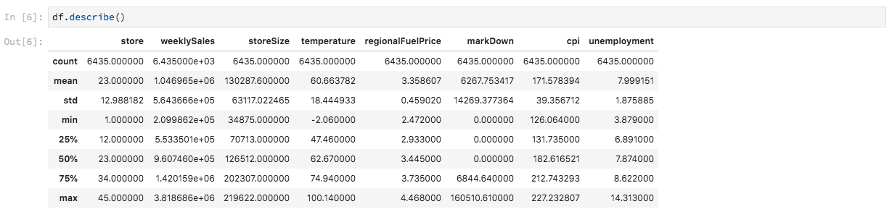

# Daten mithilfe von Notebooks analysieren

In diesem Tutorial wird beschrieben, wie Sie mit Jupyter Notebooks, die in Data Science Workspace erstellt wurden, auf Ihre Daten zugreifen, sie untersuchen und visualisieren können. Am Ende dieses Tutorials sollten Sie einige der Funktionen von Jupyter Notebooks kennen, die Ihnen ein besseres Verständnis Ihrer Daten bieten.

Die folgenden Konzepte werden vorgestellt:

- **[!DNL JupyterLab]:** [[!DNL JupyterLab]](https://blog.jupyter.org/jupyterlab-is-ready-for-users-5a6f039b8906) ist die webbasierte Benutzeroberfläche der nächsten Generation für Project Jupyter und ist eng in [!DNL Adobe Experience Platform].
- **Batches:** Datensätze bestehen aus Stapeln. Ein Batch ist ein Datensatz, der über einen bestimmten Zeitraum erfasst und als Einheit verarbeitet wird. Beim Hinzufügen von Daten zu einem Datensatz werden neue Batches erstellt.
- **Data Access SDK (nicht mehr unterstützt):** Das Data Access SDK wird jetzt nicht mehr unterstützt. Bitte verwenden Sie [[!DNL Platform SDK]](../authoring/platform-sdk.md) Handbuch.

## Notebooks in Data Science Workspace

In diesem Abschnitt werden Daten untersucht, die zuvor im Einzelhandelsschema erfasst wurden.

Data Science Workspace ermöglicht Benutzern das Erstellen von [!DNL Jupyter Notebooks] durch [!DNL JupyterLab] Plattform, auf der sie Workflows für maschinelles Lernen erstellen und bearbeiten können. [!DNL JupyterLab] ist ein Tool zur Zusammenarbeit zwischen Server und Client, mit dem Benutzer Notebook-Dokumente über einen Webbrowser bearbeiten können. Diese Notebooks können sowohl ausführbaren Code als auch Rich-Text-Elemente enthalten. Zu unserem Zweck verwenden wir Markdown für die Analysebeschreibung und ausführbare Datei [!DNL Python] Code zur Datenexploration und -analyse.

### Arbeitsbereich auswählen

Beim Start [!DNL JupyterLab]erhalten wir eine webbasierte Oberfläche für Jupyter Notebooks. Je nach ausgewähltem Notebook wird ein entsprechender Kernel gestartet.

Beim Vergleich der zu verwendenden Umgebung müssen die Einschränkungen der einzelnen Dienste berücksichtigt werden. Wenn wir beispielsweise die Variable [pandas](https://pandas.pydata.org/) Bibliothek mit [!DNL Python]als normaler Benutzer beträgt die RAM-Grenze 2 GB. Selbst als Power User wären wir auf 20 GB RAM beschränkt. Bei größeren Berechnungen wäre es sinnvoll, [!DNL Spark] bietet 1,5 TB, die für alle Notebook-Instanzen freigegeben ist.

Standardmäßig funktioniert das TensorFlow-Rezept in einem GPU-Cluster und Python wird in einem CPU-Cluster ausgeführt.

### Erstellen eines neuen Notebooks

Im [!DNL Adobe Experience Platform] Benutzeroberfläche, auswählen [!UICONTROL Datenwissenschaften] im oberen Menü, um Sie zum Data Science Workspace zu bringen. Wählen Sie auf dieser Seite [!DNL JupyterLab] , um [!DNL JupyterLab] Starter. Sie sollten eine Seite sehen, die der folgenden ähnelt.


In unserem Tutorial werden wir [!DNL Python] 3 im Jupyter Notebook , um zu zeigen, wie Sie auf die Daten zugreifen und sie untersuchen können. Auf der Starter-Seite stehen Beispiel-Notebooks zur Verfügung. Wir verwenden das Rezept für Einzelhandelsumsätze für [!DNL Python] 3.


Das Rezept &quot;Einzelhandelsumsätze&quot;ist ein eigenständiges Beispiel, in dem derselbe Datensatz für Einzelhandelsumsätze verwendet wird, um zu zeigen, wie Daten im Jupyter-Notebook untersucht und visualisiert werden können. Darüber hinaus geht das Notebook mit Schulungen und Verifizierung weiter. Weitere Informationen zu diesem speziellen Notebook finden Sie in diesem [exemplarische Vorgehensweise](../walkthrough.md).

### Auf Daten zugreifen

>[!NOTE]
>
>Die `data_access_sdk_python` ist veraltet und wird nicht mehr empfohlen. Weitere Informationen finden Sie unter [Konvertieren des Data Access SDK in das Platform SDK](../authoring/platform-sdk.md) Tutorial zur Konvertierung Ihres Codes. Die folgenden Schritte gelten auch für dieses Tutorial.

Wir werden intern auf Daten zugreifen von [!DNL Adobe Experience Platform] und Daten extern. Wir werden die `data_access_sdk_python` -Bibliothek, um auf interne Daten wie Datensätze und XDM-Schemas zuzugreifen. Für externe Daten verwenden wir die pandas [!DNL Python] -Bibliothek.

#### Externe Daten

Wenn das Notebook &quot;Einzelhandelsumsätze&quot;geöffnet ist, suchen Sie die Kopfzeile &quot;Daten laden&quot;. Folgendes [!DNL Python] -Code verwendet pandas&#39; `DataFrame` Datenstruktur und [read_csv()](https://pandas.pydata.org/pandas-docs/stable/generated/pandas.read_csv.html#pandas.read_csv) Funktion zum Lesen der CSV-Datei, die auf gehostet wird [!DNL Github] in den DataFrame ein:


Die DataFrame-Datenstruktur von Pandas ist eine zweidimensionale beschriftete Datenstruktur. Um die Dimensionen unserer Daten schnell anzuzeigen, können wir die `df.shape`. Dadurch wird ein Tupel zurückgegeben, das die Dimensionalität des DataFrame darstellt:


Schließlich können wir einen Blick darauf werfen, wie unsere Daten aussehen. Wir können `df.head(n)` nutzen, um die ersten `n` Zeilen des DataFrame anzuzeigen:


#### [!DNL Experience Platform] data

Jetzt geht es weiter zum Zugriff [!DNL Experience Platform] Daten.

##### Nach Datensatz-ID

Für diesen Abschnitt verwenden wir den Datensatz Einzelhandelsumsätze , der dem Datensatz entspricht, der im Beispiel-Notebook für Einzelhandelsumsätze verwendet wird.

Im Jupyter Notebook können Sie auf Ihre Daten aus dem **Daten** tab  auf der linken Seite. Nach Auswahl der Registerkarte werden zwei Ordner bereitgestellt. Wählen Sie die **[!UICONTROL Datensätze]** Ordner.


Im Ordner &quot;Datensätze&quot;können Sie nun alle erfassten Datensätze sehen. Beachten Sie, dass es eine Minute dauern kann, alle Einträge zu laden, wenn Ihr Verzeichnis stark mit Datensätzen gefüllt ist.

Da der Datensatz derselbe ist, möchten wir die Ladedaten aus dem vorherigen Abschnitt ersetzen, der externe Daten verwendet. Wählen Sie den Codeblock unter **Daten laden** und drücken Sie die **&#39;d&#39;** drücken Sie zweimal auf der Tastatur. Achten Sie darauf, dass der Fokus auf den Block und nicht auf den Text gerichtet ist. Sie können **&quot;esc&quot;** , um den Textfokus vor dem Drücken der **&#39;d&#39;** zweimal.

Jetzt können wir mit der rechten Maustaste auf die `Retail-Training-<your-alias>` Datensatz und wählen Sie die Option &quot;Daten in Notebook untersuchen&quot;in der Dropdown-Liste aus. Ein ausführbarer Code-Eintrag wird in Ihrem Notebook angezeigt.

>[!TIP]
>
>Siehe Abschnitt [[!DNL Platform SDK]](../authoring/platform-sdk.md) Anleitung zum Konvertieren Ihres Codes.

```PYTHON
from data_access_sdk_python.reader import DataSetReader
from datetime import date
reader = DataSetReader()
df = reader.load(data_set_id="xxxxxxxx", ims_org="xxxxxxxx@AdobeOrg")
df.head()
```

Wenn Sie an anderen Kernels als [!DNL Python], siehe [diese Seite](https://github.com/adobe/acp-data-services-dsw-reference/wiki/Accessing-Data-on-the-Platform) für den Zugriff auf Daten in [!DNL Adobe Experience Platform].

Wenn Sie die ausführbare Zelle auswählen und dann auf die Wiedergabeschaltfläche in der Symbolleiste klicken, wird der ausführbare Code ausgeführt. Die Ausgabe für `head()` ist eine Tabelle mit den Schlüsseln Ihres Datensatzes als Spalten und den ersten n Zeilen im Datensatz. `head()` akzeptiert ein integer -Argument, um anzugeben, wie viele Zeilen ausgegeben werden sollen. Standardmäßig ist dies 5.


Wenn Sie Ihren Kernel neu starten und alle Zellen erneut ausführen, sollten Sie dieselben Ausgaben wie zuvor erhalten.


### Daten durchsuchen

Da wir nun auf Ihre Daten zugreifen können, konzentrieren wir uns auf die Daten selbst, indem wir Statistiken und Visualisierungen verwenden. Der von uns verwendete Datensatz ist ein Einzelhandelsdatensatz, der verschiedene Informationen über 45 verschiedene Stores an einem bestimmten Tag liefert. Einige Merkmale für eine bestimmte `date` und `store` umfassen Folgendes:
- `storeType`
- `weeklySales`
- `storeSize`
- `temperature`
- `regionalFuelPrice`
- `markDown`
- `cpi`
- `unemployment`
- `isHoliday`

#### Statistische Zusammenfassung

Wir können [!DNL Python's] pandas-Bibliothek, um den Datentyp jedes Attributs abzurufen. Die Ausgabe des folgenden Aufrufs liefert uns Informationen über die Anzahl der Einträge und den Datentyp für die einzelnen Spalten:

```PYTHON
df.info()
```


Diese Informationen sind hilfreich, da wir durch Kenntnis des Datentyps der einzelnen Spalten wissen, wie die Daten zu behandeln sind.

Sehen wir uns nun die statistische Zusammenfassung an. Es werden nur die numerischen Datentypen angezeigt. `date`, `storeType`und `isHoliday` wird nicht ausgegeben:

```PYTHON
df.describe()
```



Damit können wir sehen, dass für jedes Merkmal 6.435 Instanzen vorhanden sind. Zudem werden statistische Daten wie Mittelwert, Standardabweichung (std), Minimum, Maximum und Interquartile angegeben. So erfahren wir mehr über die Abweichung der Daten. Im nächsten Abschnitt werden wir uns mit der Visualisierung befassen, die mit diesen Informationen zusammenarbeitet, um ein gutes Verständnis unserer Daten zu ermöglichen.

Wenn wir uns die Mindest- und Maximalwerte für `store` ansehen, können wir feststellen, dass die Daten 45 verschiedene Geschäfte repräsentieren. Es gibt auch `storeTypes`, die unterscheiden, was ein Geschäft ist. Außerdem können wir die Verteilung von `storeTypes` anzeigen, indem wir Folgendes tun:


Das bedeutet, dass 22 Geschäfte `storeType` `A`, sind 17 `storeType` `B`und 6 sind `storeType` `C`.

#### Datenvisualisierung

Da wir unsere Dataframe-Werte nun kennen, möchten wir sie um Visualisierungen ergänzen, damit sich Muster leichter erkennen lassen. Diagramme sind auch nützlich, wenn Ergebnisse an eine Zielgruppe übermittelt werden. Einige [!DNL Python] Zu den für die Visualisierung nützlichen Bibliotheken gehören:
- [Matplotlib](https://matplotlib.org/)
- [pandas](https://pandas.pydata.org/)
- [seaborn](https://seaborn.pydata.org/)
- [ggplot](https://ggplot2.tidyverse.org/)

In diesem Abschnitt werden wir kurz einige Vorteile für die Verwendung der einzelnen Bibliotheken erläutern.

[Matplotlib](https://matplotlib.org/) ist der älteste [!DNL Python] Visualisierungspaket. Ihr Ziel ist es, &quot;einfache Dinge einfach und schwierige Dinge möglich zu machen&quot;. Dies trifft in der Regel zu, da das Paket sehr leistungsstark ist, aber auch mit Komplexität verbunden ist. Es ist nicht immer einfach, ein vernünftiges und aussehendes Diagramm zu erhalten, ohne viel Zeit und Mühe in Anspruch zu nehmen.

[Pandas](https://pandas.pydata.org/) wird hauptsächlich für sein DataFrame-Objekt verwendet, das Datenmanipulationen mit integrierter Indizierung ermöglicht. Pandas umfasst jedoch auch eine integrierte Plotting-Funktion, die auf matplotlib basiert.

[seaborn](https://seaborn.pydata.org/) ist ein Paket-Build auf matplotlib. Ihr Hauptziel besteht darin, Standardgrafiken visueller ansprechender zu gestalten und die Erstellung komplexer Diagramme zu vereinfachen.

[ggplot](https://ggplot2.tidyverse.org/) ist ein Paket auch auf matplotlib gebaut. Der Hauptunterschied besteht jedoch darin, dass das Tool ein Port von ggplot2 für R ist. Ähnlich wie bei seaborn ist das Ziel, die matplotlib zu verbessern. Benutzer, die mit ggplot2 for R vertraut sind, sollten diese Bibliothek berücksichtigen.


##### Eindimensionale Diagramme

Eindimensionale Diagramme sind Diagramme mit einer einzelnen Variablen. Zur Visualisierung Ihrer Daten wird ein gängiges Univariate-Diagramm verwendet, das das Box- und Whisker-Diagramm darstellt.

Mit unserem Datensatz für Einzelhandelsumsätze von oben können wir ein Box- und Whisker-Diagramm für jedes der 45 Geschäfte und ihre wöchentlichen Umsätze generieren. Das Diagramm wird mithilfe der `seaborn.boxplot`-Funktion erstellt.


Ein Box- und Whisker-Diagramm dient dazu, die Verteilung von Daten anzuzeigen. Die äußeren Linien des Diagramms zeigen die oberen und unteren Quartile an, während das Feld den Interquartilbereich umfasst. Die Linie im Kasten markiert den Median. Alle Datenpunkte, die mehr als das 1,5-Fache des oberen oder unteren Quartils betragen, werden als Kreis markiert. Diese Punkte werden als Ausreißer betrachtet.

##### Mehrdimensionale Diagramme

Mehrdimensionale Diagramme dienen dazu, die Interaktion zwischen Variablen anzuzeigen. Dank der Visualisierung können Datenwissenschaftler erkennen, ob Korrelationen oder Muster zwischen den Variablen bestehen. Ein häufig verwendetes mehrdimensionales Diagramm ist eine Korrelationsmatrix. Bei einer Korrelationsmatrix werden Abhängigkeiten zwischen verschiedenen Variablen mit dem Korrelationskoeffizienten quantifiziert.

Mit demselben Einzelhandelsdatensatz können wir die Korrelationsmatrix generieren.


Beachten Sie die Diagonale von 1 ist in der Mitte. Das bedeutet, dass eine Variable beim Vergleich mit sich selbst eine vollständige positive Korrelation aufweist. Eine starke positive Korrelation wird näher bei 1 liegen, während eine schwache Korrelation näher bei 0 liegt. Negative Korrelation wird durch einen negativen Koeffizienten angezeigt, der auf einen gegenläufigen Trend hinweist.


## Nächste Schritte

In diesem Tutorial wurde erläutert, wie ein neues Jupyter-Notebook in Data Science Workspace erstellt wird und wie Daten extern sowie aus [!DNL Adobe Experience Platform]. Im Einzelnen haben wir die folgenden Schritte ausgeführt:
- Erstellen eines neuen Jupyter-Notebooks
- Auf Datensätze und Schemas zugreifen
- Datensätze durchsuchen

Jetzt können Sie zum [nächster Abschnitt](../models-recipes/package-source-files-recipe.md) , um ein Rezept zu verpacken und in Data Science Workspace zu importieren.
