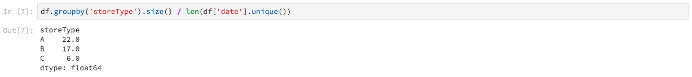

# Analysieren Ihrer Daten mithilfe von Notebooks

Dieses Lernprogramm konzentriert sich auf die Verwendung von in Data Science Workspace integrierten Jupyter-Notebooks, um auf Ihre Daten zuzugreifen, sie zu untersuchen und sie zu visualisieren. Am Ende dieses Lernprogramms sollten Sie einige der Funktionen von Jupyter Notebooks Angebot kennen, um Ihre Daten besser zu verstehen.

Die folgenden Konzepte werden eingeführt:

- **[!DNL JupyterLab]:** [[!DNL JupyterLab]](https://blog.jupyter.org/jupyterlab-is-ready-for-users-5a6f039b8906) ist die webbasierte Schnittstelle der nächsten Generation für Project Jupyter und ist eng in  [!DNL Adobe Experience Platform]integriert.
- **Stapel:** Datensätze bestehen aus Stapeln. Ein Stapel ist ein Datensatz, der über einen bestimmten Zeitraum erfasst und als eine Einheit verarbeitet wird. Beim Hinzufügen von Daten zu einem Datensatz werden neue Stapel erstellt.
- **Datenzugriff-SDK (nicht mehr unterstützt):** Das Datenzugriff-SDK wird jetzt nicht mehr unterstützt. Bitte verwenden Sie das Handbuch [[!DNL Platform SDK]](../authoring/platform-sdk.md).

## Notebooks im Data Science Workspace

In diesem Abschnitt werden Daten untersucht, die zuvor in das Schema für den Einzelhandel aufgenommen wurden.

Mit Data Science Workspace können Benutzer [!DNL Jupyter Notebooks] über die [!DNL JupyterLab]-Plattform erstellen, auf der sie Workflows für maschinelles Lernen erstellen und bearbeiten können. [!DNL JupyterLab] ist ein Tool zur Zusammenarbeit zwischen Server und Client, das es Benutzern ermöglicht, Notebook-Dokumente über einen Webbrowser zu bearbeiten. Diese Notebooks können sowohl ausführbaren Code als auch Rich-Text-Elemente enthalten. Zu unseren Zwecken verwenden wir Markdown für die Analyse und ausführbaren [!DNL Python]-Code, um Daten zu untersuchen und Analysen durchzuführen.

### Arbeitsbereich auswählen

Beim Start von [!DNL JupyterLab] wird eine webbasierte Schnittstelle für Jupyter-Notebooks vorgestellt. Je nachdem, welchen Typ von Notebook wir wählen, wird ein entsprechender Kernel gestartet.

Beim Vergleich der zu verwendenden Umgebung müssen wir die jeweiligen Einschränkungen berücksichtigen. Wenn wir z. B. die Bibliothek [pandas](https://pandas.pydata.org/) mit [!DNL Python] verwenden, beträgt die RAM-Beschränkung als normaler Benutzer 2 GB. Auch als Strombenutzer wären wir auf 20 GB RAM beschränkt. Bei größeren Berechnungen ist es sinnvoll, [!DNL Spark] zu verwenden, welche Angebot 1,5 TB für alle Notebook-Instanzen freigegeben sind.

Standardmäßig funktioniert Tensorflow-Rezeptur in einem GPU-Cluster und Python wird in einem CPU-Cluster ausgeführt.

### Erstellen eines neuen Notebooks

Klicken Sie in der Benutzeroberfläche [!DNL Adobe Experience Platform] auf die Registerkarte &quot;Datenwissenschaft&quot;im oberen Menü, um Sie zum Data Science Workspace zu führen. Klicken Sie auf dieser Seite auf die Registerkarte [!DNL JupyterLab], um den [!DNL JupyterLab]-Starter zu öffnen. Sie sollten eine Seite sehen, die der folgenden ähnelt.


In unserem Tutorial werden wir [!DNL Python] 3 im Jupyter-Notebook verwenden, um zu zeigen, wie Sie auf die Daten zugreifen und sie untersuchen können. Auf der Startseite stehen Beispielnotizen zur Verfügung. Wir werden das Retail Sales-Rezept für [!DNL Python] 3 verwenden.


Das Rezept für den Einzelhandel ist ein eigenständiges Beispiel, das mit demselben Datensatz für den Einzelhandel zeigt, wie Daten im Jupyter-Notebook erforscht und visualisiert werden können. Darüber hinaus geht das Notebook mit Schulung und Verifizierung noch weiter. Weitere Informationen zu diesem bestimmten Notebook finden Sie in dieser [exemplarischen Vorgehensweise](../walkthrough.md).

### Zugriffsdaten

>[!NOTE]
>
>Das `data_access_sdk_python` wird nicht mehr unterstützt und nicht mehr empfohlen. Informationen zum Konvertieren Ihres Codes finden Sie im Tutorial [Datenzugriffs-SDK in Platform SDK](../authoring/platform-sdk.md) konvertieren. Für dieses Lernprogramm gelten weiterhin die folgenden Schritte.

Wir gehen weiter auf Daten intern von [!DNL Adobe Experience Platform] und Daten extern. Wir werden die `data_access_sdk_python`-Bibliothek verwenden, um auf interne Daten wie Datensätze und XDM-Schema zuzugreifen. Für externe Daten verwenden wir die Pandas [!DNL Python]-Bibliothek.

#### Externe Daten

Wenn das Notebook für den Einzelhandel geöffnet ist, finden Sie die Kopfzeile &quot;Daten laden&quot;. Der folgende [!DNL Python]-Code verwendet pandas&#39; `DataFrame`-Datenstruktur und die [read_csv()](https://pandas.pydata.org/pandas-docs/stable/generated/pandas.read_csv.html#pandas.read_csv)-Funktion, um das auf [!DNL Github] gehostete CSV in das DataFrame zu lesen:


Die DataFrame-Datenstruktur von Pandas ist eine zweidimensionale beschriftete Datenstruktur. Um die Dimensionen unserer Daten schnell zu sehen, können wir das `df.shape` verwenden. Dadurch wird ein Tupel zurückgegeben, das die Dimensionalität des DataFrame darstellt:


Schließlich können wir einen Blick darauf werfen, wie unsere Daten aussehen. Wir können `df.head(n)` nutzen, um die ersten `n` Zeilen des DataFrame anzuzeigen:


#### [!DNL Experience Platform] data

Jetzt gehen wir weiter zum Zugriff auf [!DNL Experience Platform]-Daten.

##### Nach Datenbestand-ID

Für diesen Abschnitt verwenden wir den Datensatz Einzelhandelsverkäufe, der mit dem Datensatz für Einzelhandelsverkäufe identisch ist.

Im Jupyter-Notebook können Sie auf Ihre Daten über die Registerkarte **Daten**  Bei Auswahl der Registerkarte werden zwei Ordner bereitgestellt. Wählen Sie den Ordner **[!UICONTROL Datasets]**.


Im Ordner &quot;Datasets&quot;können Sie nun alle erfassten Datensätze anzeigen. Beachten Sie, dass es möglicherweise eine Minute dauern kann, alle Einträge zu laden, wenn Ihr Ordner stark mit Datensätzen gefüllt ist.

Da der Datensatz identisch ist, möchten wir die Daten des vorherigen Abschnitts ersetzen, der externe Daten verwendet. Wählen Sie den Codeblock unter **Daten laden** aus und drücken Sie zweimal die Taste **&#39;d&#39;** auf Ihrer Tastatur. Achten Sie darauf, dass der Fokus auf den Block und nicht auf den Text gelegt wird. Sie können **&#39;esc&#39;** drücken, um den Textfokus zu entfernen, bevor Sie die Taste **&#39;d&#39;** zweimal drücken.

Jetzt können wir mit der rechten Maustaste auf den `Retail-Training-<your-alias>` Datensatz klicken und die Option &quot;Daten im Notebook untersuchen&quot;in der Dropdown-Liste auswählen. Ein ausführbarer Code-Eintrag wird in Ihrem Notebook angezeigt.

>[!TIP]
>
>Informationen zum Konvertieren des Codes finden Sie im Handbuch [[!DNL Platform SDK]](../authoring/platform-sdk.md).

```PYTHON
from data_access_sdk_python.reader import DataSetReader
from datetime import date
reader = DataSetReader()
df = reader.load(data_set_id="xxxxxxxx", ims_org="xxxxxxxx@AdobeOrg")
df.head()
```

Wenn Sie mit anderen Kerneln als [!DNL Python] arbeiten, lesen Sie [diese Seite ](https://github.com/adobe/acp-data-services-dsw-reference/wiki/Accessing-Data-on-the-Platform), um auf Daten auf der [!DNL Adobe Experience Platform] zuzugreifen.

Wenn Sie die ausführbare Zelle auswählen und dann auf die Wiedergabeschaltfläche in der Symbolleiste klicken, wird der ausführbare Code ausgeführt. Die Ausgabe für `head()` ist eine Tabelle mit den Schlüsseln Ihres Datensatzes als Spalten und den ersten n Zeilen im Datensatz. `head()` akzeptiert ein ganzzahliges Argument, um anzugeben, wie viele Zeilen ausgegeben werden sollen. Standardmäßig ist dies 5.


Wenn Sie Ihren Kernel neu starten und alle Zellen erneut ausführen, sollten Sie dieselben Ausgaben erhalten wie zuvor.


### Daten

Da wir nun auf Ihre Daten zugreifen können, konzentrieren wir uns auf die Daten selbst, indem wir Statistiken und Visualisierung verwenden. Der Datensatz, den wir verwenden, ist ein Retail-Datensatz, der verschiedene Informationen über 45 verschiedene Stores an einem bestimmten Tag liefert. Einige Eigenschaften für ein bestimmtes `date` und `store` umfassen Folgendes:
- `storeType`
- `weeklySales`
- `storeSize`
- `temperature`
- `regionalFuelPrice`
- `markDown`
- `cpi`
- `unemployment`
- `isHoliday`

#### Statistische Zusammenfassung

Wir können die Pandas-Bibliothek [!DNL Python's] nutzen, um den Datentyp der einzelnen Attribute abzurufen. Die Ausgabe des folgenden Aufrufs liefert uns Informationen über die Anzahl der Einträge und den Datentyp für die einzelnen Spalten:

```PYTHON
df.info()
```


Diese Informationen sind hilfreich, da wir durch Kenntnis des Datentyps der einzelnen Spalten wissen, wie die Daten zu behandeln sind.

Sehen wir uns nun die statistische Zusammenfassung an. Es werden nur die numerischen Datentypen angezeigt. `date`, `storeType` und `isHoliday` werden daher nicht ausgegeben:

```PYTHON
df.describe()
```


Damit können wir sehen, dass für jedes Merkmal 6.435 Instanzen vorhanden sind. Außerdem werden statistische Daten wie Mittelwert, Standardabweichung (std), Min., Max. und Interquartilen angegeben. So erfahren wir mehr über die Abweichung der Daten. Im nächsten Abschnitt werden wir über Visualisierung gehen, die mit diesen Informationen zusammenarbeitet, um uns ein gutes Verständnis unserer Daten zu verschaffen.

Wenn wir uns die Mindest- und Maximalwerte für `store` ansehen, können wir feststellen, dass die Daten 45 verschiedene Geschäfte repräsentieren. Es gibt auch `storeTypes`, die unterscheiden, was ein Geschäft ist. Außerdem können wir die Verteilung von `storeTypes` anzeigen, indem wir Folgendes tun:



Das bedeutet, dass 22 Stores von `storeType` `A`, 17 `storeType` `B` und 6 `storeType` `C` sind.

#### Datenvisualisierung

Da wir unsere Dataframe-Werte nun kennen, möchten wir sie um Visualisierungen ergänzen, damit sich Muster leichter erkennen lassen. Diagramme sind auch nützlich, wenn Ergebnisse an eine Audience übermittelt werden. Einige [!DNL Python]-Bibliotheken, die für die Visualisierung nützlich sind, sind:
- [Matplotlib](https://matplotlib.org/)
- [pandas](https://pandas.pydata.org/)
- [seaborn](https://seaborn.pydata.org/)
- [ggplot](https://ggplot2.tidyverse.org/)

In diesem Abschnitt werden wir schnell über einige Vorteile für die Verwendung der einzelnen Bibliotheken gehen.

[](https://matplotlib.org/) Matplotlibis ist das älteste  [!DNL Python] Visualisierungspaket. Ihr Ziel ist es, &quot;einfache Dinge einfach und schwierige Dinge möglich zu machen&quot;. Dies ist eher wahr, da das Paket extrem mächtig ist, aber auch mit Komplexität. Es ist nicht immer einfach, eine vernünftige Grafik zu bekommen, ohne viel Zeit und Mühe zu verlieren.

[Die ](https://pandas.pydata.org/) Pandasis wird hauptsächlich für das DataFrame-Objekt verwendet, das die Datenbearbeitung mit integrierter Indexierung ermöglicht. Pandas verfügen jedoch auch über eine integrierte Plotfunktion, die auf matplotlib basiert.

[](https://seaborn.pydata.org/) seabornis ein Paket auf matplotlib gebaut. Sein Hauptziel ist es, Standardgrafiken optisch ansprechender zu gestalten und die Erstellung komplizierter Diagramme zu vereinfachen.

[](https://ggplot2.tidyverse.org/) ggplotis ein Paket auch auf matplotlib gebaut. Der Hauptunterschied ist jedoch, dass das Tool ein Port von ggplot2 für R ist. Ähnlich wie beim Seeschleppen besteht das Ziel darin, sich bei matplotlib zu verbessern. Benutzer, die mit &quot;ggplot2 for R&quot;vertraut sind, sollten diese Bibliothek in Betracht ziehen.


##### Eindimensionale Diagramme

Eindimensionale Diagramme sind Diagramme mit einer einzelnen Variablen. Ein gemeinsames univariatives Diagramm wird verwendet, um Ihre Daten zu visualisieren ist die Box und Whisker-Plot.

Mit unserem Datensatz für Einzelhandelsumsätze von oben können wir ein Box- und Whisker-Diagramm für jedes der 45 Geschäfte und ihre wöchentlichen Umsätze generieren. Das Diagramm wird mithilfe der `seaborn.boxplot`-Funktion erstellt.


Ein Box- und Whisker-Diagramm dient dazu, die Verteilung von Daten anzuzeigen. Die äußeren Linien des Grundstücks zeigen den oberen und unteren Quartil, während der Rahmen den interquartilen Bereich umfasst. Die Linie im Kasten markiert den Median. Alle Datenpunkte, die mehr als das 1,5-Fache des oberen oder unteren Quartils betragen, werden als Kreis markiert. Diese Punkte werden als Ausreißer betrachtet.

##### Mehrdimensionale Diagramme

Mehrdimensionale Diagramme dienen dazu, die Interaktion zwischen Variablen anzuzeigen. Dank der Visualisierung können Datenwissenschaftler erkennen, ob Korrelationen oder Muster zwischen den Variablen bestehen. Ein häufig verwendetes mehrdimensionales Diagramm ist eine Korrelationsmatrix. Bei einer Korrelationsmatrix werden Abhängigkeiten zwischen verschiedenen Variablen mit dem Korrelationskoeffizienten quantifiziert.

Mit demselben Einzelhandelsdatensatz können wir die Korrelationsmatrix generieren.


Beachten Sie, dass die Diagonale von 1 in der Mitte unten ist. Das bedeutet, dass eine Variable beim Vergleich mit sich selbst eine vollständige positive Korrelation aufweist. Eine starke positive Korrelation wird näher bei 1 liegen, während eine schwache Korrelation näher bei 0 liegt. Negative Korrelation wird durch einen negativen Koeffizienten angezeigt, der auf einen gegenläufigen Trend hinweist.


## Nächste Schritte

In diesem Tutorial wurde erläutert, wie ein neues Jupyter-Notebook im Data Science Workspace erstellt und wie Daten extern sowie von [!DNL Adobe Experience Platform] aufgerufen werden können. Im Einzelnen haben wir die folgenden Schritte ausgeführt:
- Neues Jupyter-Notebook erstellen
- Zugriff auf Daten und Schema
- Datasets erkunden

Nun können Sie zum nächsten Abschnitt [wechseln, um ein Rezept zu verpacken und in Data Science Workspace zu importieren.](../models-recipes/package-source-files-recipe.md)
