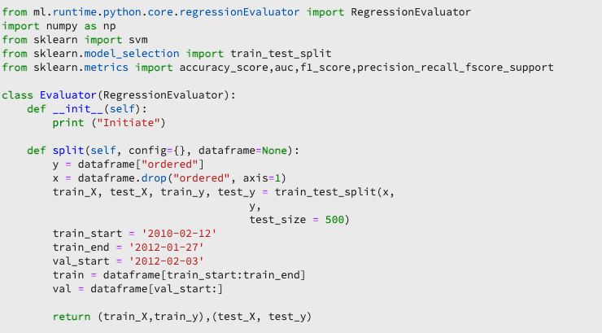

# Erstellen eines Modells mit JupyterLab-Notebooks

>[!NOTE]
>
>Data Science Workspace ist nicht mehr erhältlich.
>
>Diese Dokumentation richtet sich an Bestandskunden mit vorherigen Berechtigungen für Data Science Workspace.

Dieses Tutorial führt Sie durch die erforderlichen Schritte zum Erstellen eines Modells mithilfe der JupyterLab Notebook-Rezept-Builder-Vorlage.

## Vorgestellte Konzepte:

- **Rezepte:** Ein Rezept ist Adobes Begriff für eine Modellspezifikation und ein Container der obersten Ebene, der einen bestimmten Algorithmus für maschinelles Lernen, einen KI-Algorithmus oder eine Gruppe von Algorithmen, eine Verarbeitungslogik und eine Konfiguration darstellt, die zum Erstellen und Ausführen eines trainierten Modells erforderlich sind.
- **Modell:** Ein Modell ist eine Instanz eines maschinellen Lernrezepts, das mithilfe von historischen Daten und Konfigurationen zur Lösung eines geschäftlichen Anwendungsfalls trainiert wird.
- **Training:** Ein Training besteht aus dem Erlernen von Mustern und Insights auf Grundlage gekennzeichneter Daten.
- **Scoring:** Beim Scoring werden mithilfe eines trainierten Modells Insights aus Daten generiert.

## Herunterladen der erforderlichen Assets {#assets}

Bevor Sie mit diesem Tutorial fortfahren, müssen Sie die erforderlichen Schemata und Datensätze erstellen. Besuchen Sie das Tutorial zum [Erstellen von Luma-Tendenzmodell-Schemata und -Datensätzen](../models-recipes/create-luma-data.md), um die erforderlichen Assets herunterzuladen und die Voraussetzungen einzurichten.

## Erste Schritte mit der [!DNL JupyterLab] Notebook-Umgebung

Ein Rezept kann in [!DNL Data Science Workspace] von Grund auf neu erstellt werden. Navigieren Sie zunächst zu [Adobe Experience Platform](https://platform.adobe.com) und wählen Sie links die Registerkarte **[!UICONTROL Notebooks]** aus. Um ein neues Notebook zu erstellen, wählen Sie die Rezept-Builder -Vorlage aus der [!DNL JupyterLab Launcher] aus.

Mit dem [!UICONTROL Recipe Builder]-Notebook können Sie Trainings- und Bewertungsdurchgänge im Notebook ausführen. So können Sie zwischen laufenden Experimenten für Trainings- und Scoring-Daten flexibel Änderungen an den `train()`- und `score()`-Methoden vorzunehmen. Sobald Sie mit den Ergebnissen des Trainings und der Bewertung zufrieden sind, können Sie das Rezept erstellen und es außerdem als Modell veröffentlichen, indem Sie die Funktion Rezept zum Modellieren verwenden.

>[!NOTE]
>
>Das [!UICONTROL Recipe Builder]-Notebook unterstützt die Arbeit mit allen Dateiformaten, aber derzeit unterstützt die Funktion „Rezept erstellen“ nur [!DNL Python].


Wenn Sie das Notebook [!UICONTROL Recipe Builder] aus dem Starter auswählen, wird das Notebook in einer neuen Registerkarte geöffnet.

Auf der neuen Notebook-Registerkarte oben wird eine Symbolleiste geladen, die drei zusätzliche Aktionen enthält: **&#x200B;**, **[!UICONTROL Ergebnis]** und **[!UICONTROL Rezept erstellen]**. Diese Symbole erscheinen nur im [!UICONTROL Recipe Builder]-Notebook. Weitere Informationen zu diesen Aktionen finden Sie [&#x200B; Abschnitt „Training und Bewertung](#training-and-scoring) nachdem Sie Ihr Rezept im Notebook erstellt haben.


## Erste Schritte mit dem [!UICONTROL Recipe Builder]-Notebook

Im bereitgestellten Asset-Ordner befindet sich ein Luma-`propensity_model.ipynb`. Laden Sie mithilfe der Option Notebook hochladen in JupyterLab das bereitgestellte Modell hoch und öffnen Sie das Notebook.


Der Rest dieses Tutorials behandelt die folgenden Dateien, die im Notebook für das Tendenzmodell vordefiniert sind:

- [Anforderungsdatei](#requirements-file)
- [Konfigurationsdateien](#configuration-files)
- [Ladeprogramm für Trainings-Daten](#training-data-loader)
- [Ladeprogramm für Scoring-Daten](#scoring-data-loader)
- [Pipeline-Datei](#pipeline-file)
- [Evaluator-Datei](#evaluator-file)
- [Data Saver-Datei](#data-saver-file)

Im folgenden Video-Tutorial wird das Luma-Tendenzmodell-Notebook erläutert:

>[!VIDEO](https://video.tv.adobe.com/v/3452501?captions=ger)

### Anforderungsdatei {#requirements-file}

Die Anforderungsdatei wird verwendet, um zusätzliche Bibliotheken zu deklarieren, die Sie im Modell verwenden möchten. Sie können die Versionsnummer angeben, wenn eine Abhängigkeit vorliegt. Weitere Bibliotheken finden Sie unter ([.org](https://anaconda.org). Informationen zum Formatieren der Anforderungsdatei finden Sie unter [Conda](https://docs.conda.io/projects/conda/en/latest/user-guide/tasks/manage-environments.html#creating-an-environment-file-manually). Die Liste der bereits verwendeten Hauptbibliotheken umfasst:

```JSON
python=3.6.7
scikit-learn
pandas
numpy
data_access_sdk_python
```

>[!NOTE]
>
>Bibliotheken oder bestimmte Versionen, die Sie hinzufügen, sind möglicherweise nicht mit den oben genannten Bibliotheken kompatibel. Wenn Sie sich außerdem dafür entscheiden, eine Umgebungsdatei manuell zu erstellen, darf das `name`-Feld nicht überschrieben werden.

Für das Luma-Tendenzmodell-Notebook müssen die Anforderungen nicht aktualisiert werden.

### Konfigurationsdateien {#configuration-files}

Mit den Konfigurationsdateien `training.conf` und `scoring.conf` werden die Datensätze angegeben, die Sie für das Training und Scoring sowie das Hinzufügen von Hyperparametern nutzen möchten. Es gibt separate Konfigurationen für Training und Scoring.

Damit ein Modell das Training ausführen kann, müssen Sie die `trainingDataSetId`, die `ACP_DSW_TRAINING_XDM_SCHEMA` und die `tenantId` angeben. Zur Bewertung müssen Sie außerdem die `scoringDataSetId`, die `tenantId` und die `scoringResultsDataSetId ` angeben.

Um die Datensatz- und Schema-IDs zu finden, wechseln Sie in Notebooks in der linken Navigationsleiste  (unter dem Ordnersymbol). Es müssen drei verschiedene Datensatz-IDs angegeben werden. Der `scoringResultsDataSetId` wird zum Speichern der Modellbewertungsergebnisse verwendet und sollte ein leerer Datensatz sein. Diese Datensätze wurden zuvor im Schritt [Erforderliche Assets](#assets) erstellt.


Dieselben Daten finden Sie in [Adobe Experience Platform](https://platform.adobe.com/) unter den Registerkarten **[Schema](https://platform.adobe.com/schema)** und **[Datensätze](https://platform.adobe.com/dataset/overview)**.

Nach Abschluss der Schulung sollte Ihre Trainings- und Bewertungskonfiguration dem folgenden Screenshot ähneln:


Standardmäßig sind für das Trainieren und Bewerten von Daten die folgenden Konfigurationsparameter festgelegt:

- `ML_FRAMEWORK_IMS_USER_CLIENT_ID`
- `ML_FRAMEWORK_IMS_TOKEN`
- `ML_FRAMEWORK_IMS_ML_TOKEN`
- `ML_FRAMEWORK_IMS_TENANT_ID`

## Grundlegendes zum Trainings-Datenlader {#training-data-loader}

Der Zweck des Ladeprogramms für Trainings-Daten besteht darin, Daten zu instanziieren, die zum Erstellen des maschinellen Lernmodells verwendet werden. In der Regel gibt es zwei Aufgaben, die der Trainings-Datenlader ausführt:

- Daten aus [!DNL Experience Platform] werden geladen
- Datenvorbereitung und Funktionsentwicklung

Die folgenden beiden Abschnitte liefern Informationen über das Laden und Vorbereiten von Daten.

### Laden von Daten {#loading-data}

In diesem Schritt wird der [pandas-Dataframe](https://pandas.pydata.org/pandas-docs/stable/generated/pandas.DataFrame.html) verwendet. Daten können aus Dateien in [!DNL Adobe Experience Platform] entweder mit dem [!DNL Experience Platform] SDK (`platform_sdk`) oder aus externen Quellen mithilfe der `read_csv()`- oder `read_json()` von Pandas geladen werden.

- [[!DNL Experience Platform SDK]](#platform-sdk)
- [Externe Quellen](#external-sources)

>[!NOTE]
>
>Im Recipe Builder-Notebook werden Daten über das `platform_sdk`-Ladeprogramm geladen.

### [!DNL Experience Platform] SDK {#platform-sdk}

Ein ausführliches Tutorial zur Verwendung des `platform_sdk` Data Loaders finden Sie im [Handbuch zu Experience Platform SDK](../authoring/platform-sdk.md). Dieses Tutorial enthält Informationen zur Build-Authentifizierung, zum grundlegenden Lesen von Daten sowie zum grundlegenden Schreiben von Daten.

### Externe Quellen {#external-sources}

Dieser Abschnitt veranschaulicht, wie Sie eine JSON- oder CSV-Datei in ein pandas-Objekt importieren können. Die offizielle Dokumentation der pandas-Bibliothek finden Sie hier:
- [read_csv](https://pandas.pydata.org/pandas-docs/stable/generated/pandas.read_csv.html)
- [read_json](https://pandas.pydata.org/pandas-docs/stable/generated/pandas.read_json.html)

Zunächst finden Sie hier ein Beispiel für den Import einer CSV-Datei. Das `data`-Argument ist der Pfad zur CSV-Datei. Diese Variable wurde aus den `configProperties` im [vorherigen Abschnitt](#configuration-files) importiert.

```PYTHON
df = pd.read_csv(data)
```

Sie können auch aus einer JSON-Datei importieren. Das `data`-Argument ist der Pfad zur CSV-Datei. Diese Variable wurde aus den `configProperties` im [vorherigen Abschnitt](#configuration-files) importiert.

```PYTHON
df = pd.read_json(data)
```

Jetzt befinden sich Ihre Daten im Dataframe-Objekt und können im [nächsten Abschnitt](#data-preparation-and-feature-engineering) analysiert und bearbeitet werden.

## Trainings-Datenladerdatei

In diesem Beispiel werden Daten mit der Experience Platform SDK geladen. Die Bibliothek kann oben auf der Seite importiert werden, indem die folgende Zeile eingefügt wird:

`from platform_sdk.dataset_reader import DatasetReader`

Anschließend können Sie die `load()`-Methode verwenden, um den Trainings-Datensatz aus dem `trainingDataSetId` abzurufen, der in der Konfigurationsdatei (`recipe.conf`) festgelegt ist.

```PYTHON
def load(config_properties):
    print("Training Data Load Start")

    #########################################
    # Load Data
    #########################################    
    client_context = get_client_context(config_properties)
    dataset_reader = DatasetReader(client_context, dataset_id=config_properties['trainingDataSetId'])
```

>[!NOTE]
>
>Wie im Abschnitt [Konfigurationsdatei](#configuration-files) erwähnt, werden die folgenden Konfigurationsparameter für den Zugriff auf Daten aus Experience Platform mithilfe von `client_context = get_client_context(config_properties)` festgelegt:
> - `ML_FRAMEWORK_IMS_USER_CLIENT_ID`
> - `ML_FRAMEWORK_IMS_TOKEN`
> - `ML_FRAMEWORK_IMS_ML_TOKEN`
> - `ML_FRAMEWORK_IMS_TENANT_ID`

Jetzt, da Sie über Ihre Daten verfügen, können Sie mit der Datenvorbereitung und Funktionsentwicklung beginnen.

### Datenvorbereitung und Funktionsentwicklung {#data-preparation-and-feature-engineering}

Nach dem Laden der Daten müssen diese bereinigt und einer Datenvorbereitung unterzogen werden. In diesem Beispiel besteht das Ziel des Modells darin, vorherzusagen, ob ein Kunde ein Produkt bestellt oder nicht. Da das Modell nicht auf bestimmte Produkte abzielt, ist keine `productListItems` erforderlich, weshalb die Spalte entfernt wird. Als Nächstes werden zusätzliche Spalten abgelegt, die nur einen einzigen Wert oder zwei Werte in einer einzigen Spalte enthalten. Beim Trainieren eines Modells ist es wichtig, nur nützliche Daten zu behalten, die bei der Prognose des Ziels hilfreich sind.


Nachdem Sie unnötige Daten gelöscht haben, können Sie mit dem Feature Engineering beginnen. Die für dieses Beispiel verwendeten Demodaten enthalten keine Sitzungsinformationen. Normalerweise möchten Sie Daten zu aktuellen und vergangenen Sitzungen für einen bestimmten Kunden haben. Aufgrund fehlender Sitzungsinformationen ahmt dieses Beispiel stattdessen aktuelle und vergangene Sitzungen über die Journey-Demarkation nach.

Abgrenzung von 

Nach Abschluss der Markierung werden die Daten gekennzeichnet und eine Journey erstellt.


Als Nächstes werden die Funktionen erstellt und in Vergangenheit und Gegenwart unterteilt. Anschließend werden alle unnötigen Spalten entfernt, sodass Sie für Luma-Kundinnen und -Kunden sowohl die bisherigen als auch die aktuellen Journey erhalten. Diese Journey enthalten Informationen, z. B. ob ein Kunde einen Artikel gekauft hat, und die Journey, die er vor dem Kauf erhalten hat.


## Ladeprogramm für Scoring-Daten {#scoring-data-loader}

Das Verfahren zum Laden von Daten für die Bewertung ähnelt dem Laden von Schulungsdaten. Wenn Sie sich den Code genau ansehen, können Sie sehen, dass alles gleich ist, mit Ausnahme der `scoringDataSetId` im `dataset_reader`. Dies liegt daran, dass dieselbe Luma-Datenquelle sowohl für das Training als auch für die Bewertung verwendet wird.

Falls Sie verschiedene Datendateien für das Training und die Bewertung verwenden möchten, ist der Lader für Schulungs- und Bewertungsdaten getrennt. Auf diese Weise können Sie bei Bedarf zusätzliche Vorab-Bearbeitungen durchführen, wie z. B. die Zuordnung Ihrer Trainings-Daten zu Ihren Scoring-Daten.

## Pipeline-Datei {#pipeline-file}

Die `pipeline.py`-Datei enthält Logik für Training und Bewertung.

Der Zweck des Trainings besteht darin, ein Modell mit Funktionen und Beschriftungen in Ihrem Trainings-Datensatz zu erstellen. Nachdem Sie Ihr Trainings-Modell ausgewählt haben, müssen Sie Ihren X- und Y-Trainings-Datensatz an das Modell anpassen, und die Funktion gibt das trainierte Modell zurück.

>[!NOTE]
> 
>Funktionen beziehen sich auf die Eingabevariable, die vom Modell des maschinellen Lernens zum Prognostizieren der Beschriftungen verwendet wird.


Die `score()`-Funktion sollte den Scoring-Algorithmus enthalten und einen Messwert zurückgeben, der angibt, wie gut das Modell funktioniert. Die `score()`-Funktion nutzt die Bezeichnungen des Scoring-Datensatzes und das trainierte Modell, um eine Reihe von prognostizierten Funktionen zu generieren. Die prognostizierten Werte werden dann mit den tatsächlichen Funktionen im Scoring-Datensatz abgeglichen. In diesem Beispiel verwendet die Funktion `score()` das trainierte Modell, um Funktionen mithilfe der Bezeichnungen aus dem Scoring-Datensatz vorherzusagen. Die prognostizierten Funktionen werden zurückgegeben.


## Evaluator-Datei {#evaluator-file}

Die Datei `evaluator.py` enthält Logiken dazu, wie Sie Ihr trainiertes Rezept bewerten möchten, und dazu, wie Ihre Trainingsdaten aufgeteilt werden sollten.

### Datensatz aufteilen {#split-the-dataset}

Die Vorbereitung der Daten für das Training erfordert eine Aufteilung des Datensatzes, damit er sich für Training und Tests verwenden lässt. Diese `val` Daten werden implizit zur Auswertung des Modells verwendet, nachdem es trainiert wurde. Dieser Prozess erfolgt getrennt vom Scoring.

In diesem Abschnitt wird die `split()` angezeigt, die Daten in das Notebook lädt und dann die Daten bereinigt, indem nicht verwandte Spalten im Datensatz entfernt werden. Dort können Sie KE-Engineering durchführen, um zusätzliche relevante KEs aus vorhandenen RohKEs in den Daten zu erstellen.



### Trainiertes Modell auswerten {#evaluate-the-trained-model}

Die `evaluate()` wird ausgeführt, nachdem das Modell trainiert wurde, und gibt eine Metrik zurück, die angibt, wie erfolgreich das Modell arbeitet. Die `evaluate()` verwendet die Beschriftungen der Testdatensätze und das trainierte Modell, um einen Satz von Funktionen vorherzusagen. Die prognostizierten Werte werden dann mit den tatsächlichen Funktionen im Testdatensatz abgeglichen. In diesem Beispiel werden `precision`, `recall`, `f1` und `accuracy` verwendet. Beachten Sie, dass die Funktion ein `metric`-Objekt zurückgibt, das eine Gruppe von Auswertungsmetriken enthält. Diese Metriken werden verwendet, um zu bewerten, wie gut das trainierte Modell funktioniert.


Durch Hinzufügen von `print(metric)` können Sie die Ergebnisse der Metrik anzeigen.


## Data Saver-Datei {#data-saver-file}

Die `datasaver.py`-Datei enthält die `save()` Funktion und wird verwendet, um Ihre Prognose beim Testen der Bewertung zu speichern. Die `save()`-Funktion nimmt Ihre Prognose und schreibt mithilfe [!DNL Experience Platform Catalog] APIs die Daten in den `scoringResultsDataSetId`, den Sie in Ihrer `scoring.conf` angegeben haben. Sie können


## Training und Scoring {#training-and-scoring}

Wenn Sie Ihre Änderungen am Notebook vorgenommen haben und Ihr Rezept trainieren möchten, können Sie die zugehörigen Schaltflächen oben in der Leiste auswählen, um einen Trainings-Lauf in der Zelle zu erstellen. Nach Auswahl der Schaltfläche wird ein Protokoll mit Befehlen und Ausgaben aus dem Trainings-Skript im Notebook (unter der `evaluator.py`) angezeigt. Conda installiert zunächst alle Abhängigkeiten, dann wird das Training initiiert.

Beachten Sie, dass Sie ein Training mindestens einmal ausführen müssen, bevor Sie mit dem Scoring fortfahren können. Durch Auswahl der Schaltfläche **[!UICONTROL Bewertung ausführen]** wird die Bewertung für das trainierte Modell ausgeführt, das während des Trainings generiert wurde. Das Bewertungsskript wird unter `datasaver.py` angezeigt.

Wenn Sie zum Debuggen die ausgeblendete Ausgabe anzeigen möchten, fügen Sie `debug` am Ende der Ausgabenzelle hinzu und führen Sie das Scoring erneut aus.


## Rezept erstellen {#create-recipe}

Wenn Sie das Bearbeiten des Rezepts abgeschlossen und mit der Trainings-/Bewertungsausgabe zufrieden sind, können Sie ein Rezept aus dem Notebook erstellen, indem Sie oben rechts **[!UICONTROL Rezept erstellen]** auswählen.


Nachdem Sie **[!UICONTROL Rezept erstellen]** ausgewählt haben, werden Sie aufgefordert, einen Rezeptnamen einzugeben. Dieser Name stellt das eigentliche Rezept dar, das auf [!DNL Experience Platform] erstellt wurde.


Sobald Sie **[!UICONTROL OK]** auswählen, beginnt der Prozess der Rezepterstellung. Dies kann einige Zeit dauern, und anstelle der Schaltfläche Rezept erstellen wird eine Fortschrittsleiste angezeigt. Nachdem Sie fertig sind, können Sie die Schaltfläche **[!UICONTROL Rezepte anzeigen]** auswählen, um zur Registerkarte **[!UICONTROL Rezepte]** unter **[!UICONTROL ML-Modelle zu gelangen]**


>[!CAUTION]
>
> - Löschen Sie keine der Dateizellen.
> - Bearbeiten Sie nicht die `%%writefile`-Zeile oben in den Dateizellen.
> - Erstellen Sie nicht gleichzeitig Rezepte in verschiedenen Notebooks.

## Nächste Schritte {#next-steps}

Durch Abschluss dieses Tutorials haben Sie gelernt, wie Sie ein Modell für maschinelles Lernen im [!UICONTROL Recipe Builder“-] erstellen. Sie haben auch gelernt, wie Sie den Workflow Notebook-Rezepte trainieren.

Um weiterhin zu lernen, wie Sie mit Ressourcen in [!DNL Data Science Workspace] arbeiten, besuchen Sie die Dropdown-Liste [!DNL Data Science Workspace] Rezepte und Modelle .