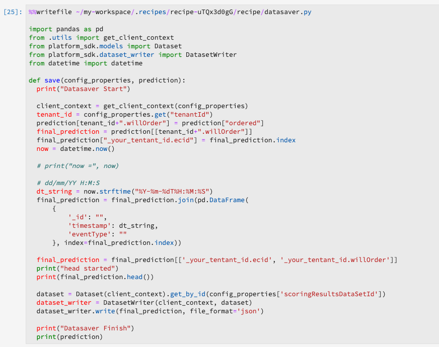
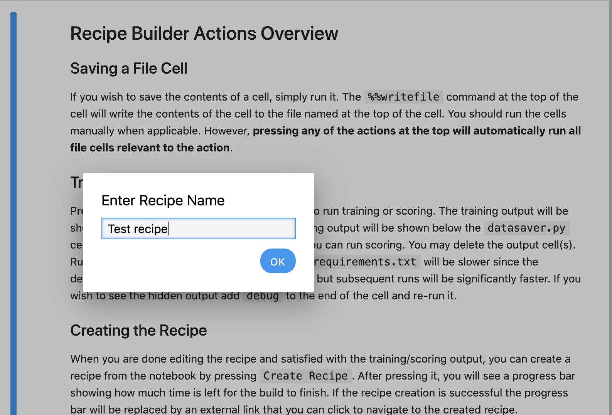

# Erstellen eines Modells mit JupyterLab Notebooks

Dieses Tutorial führt Sie durch die erforderlichen Schritte zum Erstellen eines Modells mithilfe der JupyterLab Notebook-Rezept-Builder-Vorlage.

## Vorgestellte Konzepte:

- **Rezepte:** Ein Rezept ist der Begriff der Adobe für eine Modellspezifikation und ist ein Container auf oberster Ebene, der einen bestimmten maschinellen Lernprozess, einen AI-Algorithmus oder eine Gruppe von Algorithmen, eine Verarbeitungslogik und eine Konfiguration darstellt, die zum Erstellen und Ausführen eines trainierten Modells erforderlich sind.
- **Modell:** Ein Modell ist eine Instanz eines maschinellen Lernrezepts, das mithilfe von historischen Daten und Konfigurationen zur Lösung eines geschäftlichen Anwendungsfalls trainiert wird.
- **Training:** Ein Training besteht aus dem Erlernen von Mustern und Insights auf Grundlage gekennzeichneter Daten.
- **Scoring:** Beim Scoring werden mithilfe eines trainierten Modells Insights aus Daten generiert.

## Herunterladen der erforderlichen Assets {#assets}

Bevor Sie mit diesem Tutorial fortfahren, müssen Sie die erforderlichen Schemata und Datensätze erstellen. Besuchen Sie das Tutorial für [Erstellen von Luma-Propensity-Modellschemata und -Datensätzen](../models-recipes/create-luma-data.md) , um die erforderlichen Assets herunterzuladen und die Voraussetzungen einzurichten.

## Erste Schritte mit [!DNL JupyterLab] Notebook-Umgebung

Das Erstellen eines neuen Rezepts kann in [!DNL Data Science Workspace]. Navigieren Sie zum Starten zu [Adobe Experience Platform](https://platform.adobe.com) und wählen Sie die **[!UICONTROL Notebooks]** auf der linken Seite. Um ein neues Notebook zu erstellen, wählen Sie die Vorlage &quot;Recipe Builder&quot;aus dem [!DNL JupyterLab Launcher].

Die [!UICONTROL Rezept Builder] Mit Notebook können Sie Trainings- und Scoring-Läufe innerhalb des Notebooks ausführen. So können Sie zwischen laufenden Experimenten für Trainings- und Scoring-Daten flexibel Änderungen an den `train()`- und `score()`-Methoden vorzunehmen. Sobald Sie mit den Trainings- und Scoring-Ergebnissen zufrieden sind, können Sie ein Rezept erstellen und es außerdem als Modell veröffentlichen, indem Sie das Rezept zur Modellfunktionalität verwenden.

>[!NOTE]
>
>Die [!UICONTROL Rezept Builder] Notebook unterstützt die Arbeit mit allen Dateiformaten, derzeit unterstützt die Funktion &quot;Rezept erstellen&quot;jedoch nur [!DNL Python].


Wenn Sie die [!UICONTROL Rezept Builder] Notebook vom Starter aus, wird das Notebook in einer neuen Registerkarte geöffnet.

Im neuen Notebook-Tab oben wird eine Symbolleiste geladen, die drei zusätzliche Aktionen enthält: **[!UICONTROL Zug]**, **[!UICONTROL Ergebnis]** und **[!UICONTROL Rezept erstellen]**. Diese Symbole werden nur im [!UICONTROL Rezept Builder] Notebook. Weitere Informationen zu diesen Aktionen erhalten Sie [im Abschnitt Training und Scoring](#training-and-scoring) nach dem Erstellen Ihres Rezepts im Notebook.


## Erste Schritte mit [!UICONTROL Rezept Builder] Notebook

Im bereitgestellten Asset-Ordner ist ein Luma-Tendenzmodell `propensity_model.ipynb`. Laden Sie über die Option zum Hochladen von Notebooks in JupyterLab das bereitgestellte Modell hoch und öffnen Sie das Notebook.


Der Rest dieses Tutorials umfasst die folgenden Dateien, die im Propensity Model Notebook vordefiniert sind:

- [Anforderungsdatei](#requirements-file)
- [Konfigurationsdateien](#configuration-files)
- [Ladeprogramm für Trainings-Daten](#training-data-loader)
- [Ladeprogramm für Scoring-Daten](#scoring-data-loader)
- [Pipeline-Datei](#pipeline-file)
- [Evaluator-Datei](#evaluator-file)
- [Data Saver-Datei](#data-saver-file)

Im folgenden Video-Tutorial wird das Modell-Notebook &quot;Luma-Neigung&quot;erläutert:

>[!VIDEO](https://video.tv.adobe.com/v/333570)

### Anforderungsdatei {#requirements-file}

Die Anforderungsdatei wird verwendet, um zusätzliche Bibliotheken zu deklarieren, die Sie im Modell verwenden möchten. Sie können die Versionsnummer angeben, wenn eine Abhängigkeit vorliegt. Weitere Bibliotheken finden Sie unter [anaconda.org](https://anaconda.org). Informationen zum Formatieren der Anforderungsdatei finden Sie unter [Conda](https://docs.conda.io/projects/conda/en/latest/user-guide/tasks/manage-environments.html#creating-an-environment-file-manually). Die Liste der bereits verwendeten Hauptbibliotheken umfasst:

```JSON
python=3.6.7
scikit-learn
pandas
numpy
data_access_sdk_python
```

>[!NOTE]
>
>Bibliotheken oder spezifische Versionen, die Sie hinzufügen, sind möglicherweise nicht mit den oben genannten Bibliotheken kompatibel. Wenn Sie außerdem eine Umgebungsdatei manuell erstellen, wird die `name` -Feld darf nicht überschrieben werden.

Für das Luma Propensity Model Notebook müssen die Anforderungen nicht aktualisiert werden.

### Konfigurationsdateien {#configuration-files}

Mit den Konfigurationsdateien `training.conf` und `scoring.conf` werden die Datensätze angegeben, die Sie für das Training und Scoring sowie das Hinzufügen von Hyperparametern nutzen möchten. Es gibt separate Konfigurationen für Training und Scoring.

Damit ein Modell eine Schulung ausführen kann, müssen Sie die Variable `trainingDataSetId`, `ACP_DSW_TRAINING_XDM_SCHEMA`und `tenantId`. Außerdem müssen Sie für die Auswertung die Variable `scoringDataSetId`, `tenantId`und `scoringResultsDataSetId `.

Um die Datensatz- und Schema-IDs zu finden, gehen Sie zur Registerkarte &quot;Daten&quot;  in Notebooks auf der linken Navigationsleiste (unter dem Ordnersymbol). Es müssen drei verschiedene Datensatz-IDs angegeben werden. Die `scoringResultsDataSetId` wird verwendet, um die Modellauswertungsergebnisse zu speichern, und sollte ein leerer Datensatz sein. Diese Datensätze wurden zuvor in der Variablen [Erforderliche Assets](#assets) Schritt.


Dieselben Daten finden Sie in [Adobe Experience Platform](https://platform.adobe.com/) unter den Registerkarten **[Schema](https://platform.adobe.com/schema)** und **[Datensätze](https://platform.adobe.com/dataset/overview)**.

Nach dem Abschluss sollte Ihre Trainings- und Scoring-Konfiguration dem folgenden Screenshot ähneln:


Standardmäßig werden die folgenden Konfigurationsparameter für Sie festgelegt, wenn Sie Daten trainieren und bewerten:

- `ML_FRAMEWORK_IMS_USER_CLIENT_ID`
- `ML_FRAMEWORK_IMS_TOKEN`
- `ML_FRAMEWORK_IMS_ML_TOKEN`
- `ML_FRAMEWORK_IMS_TENANT_ID`

## Grundlegendes zum Ladeprogramm für Schulungsdaten {#training-data-loader}

Der Zweck des Ladeprogramms für Trainings-Daten besteht darin, Daten zu instanziieren, die zum Erstellen des maschinellen Lernmodells verwendet werden. In der Regel führt der Ladeprogramm für Trainings-Daten zwei Aufgaben aus:

- Laden von Daten aus [!DNL Platform]
- Datenvorbereitung und Funktionsentwicklung

Die folgenden beiden Abschnitte liefern Informationen über das Laden und Vorbereiten von Daten.

### Laden von Daten {#loading-data}

In diesem Schritt wird der [pandas-Dataframe](https://pandas.pydata.org/pandas-docs/stable/generated/pandas.DataFrame.html) verwendet. Daten können aus Dateien in [!DNL Adobe Experience Platform] entweder die [!DNL Platform] SDK (`platform_sdk`) oder aus externen Quellen mithilfe von pandas&#39; `read_csv()` oder `read_json()` Funktionen.

- [[!DNL Platform SDK]](#platform-sdk)
- [Externe Quellen](#external-sources)

>[!NOTE]
>
>Im Recipe Builder-Notebook werden Daten über das Datenladeprogramm `platform_sdk` geladen.

### [!DNL Platform] SDK {#platform-sdk}

Eine ausführliche Anleitung zur Verwendung des Datenladeprogramms `platform_sdk` finden Sie im [Handbuch zum Platform-SDK](../authoring/platform-sdk.md). Dieses Tutorial enthält Informationen zur Build-Authentifizierung, zum grundlegenden Lesen von Daten sowie zum grundlegenden Schreiben von Daten.

### Externe Quellen {#external-sources}

Dieser Abschnitt veranschaulicht, wie Sie eine JSON- oder CSV-Datei in ein pandas-Objekt importieren können. Die offizielle Dokumentation der pandas-Bibliothek finden Sie hier:
- [read_csv](https://pandas.pydata.org/pandas-docs/stable/generated/pandas.read_csv.html)
- [read_json](https://pandas.pydata.org/pandas-docs/stable/generated/pandas.read_json.html)

Zunächst finden Sie hier ein Beispiel für den Import einer CSV-Datei. Das `data`-Argument ist der Pfad zur CSV-Datei. Diese Variable wurde aus den `configProperties` im [vorherigen Abschnitt](#configuration-files) importiert.

```PYTHON
df = pd.read_csv(data)
```

Sie können auch aus einer JSON-Datei importieren. Das `data`-Argument ist der Pfad zur CSV-Datei. Diese Variable wurde aus den `configProperties` im [vorherigen Abschnitt](#configuration-files) importiert.

```PYTHON
df = pd.read_json(data)
```

Jetzt befinden sich Ihre Daten im Dataframe-Objekt und können im [nächsten Abschnitt](#data-preparation-and-feature-engineering) analysiert und bearbeitet werden.

## Datei für Trainings-Datenladeprogramm

In diesem Beispiel werden Daten mit dem Platform SDK geladen. Die Bibliothek kann oben auf der Seite importiert werden, indem die folgende Zeile eingefügt wird:

`from platform_sdk.dataset_reader import DatasetReader`

Anschließend können Sie die `load()` -Methode zum Abrufen des Trainings-Datensatzes aus der `trainingDataSetId` wie in der Konfiguration festgelegt (`recipe.conf`).

```PYTHON
def load(config_properties):
    print("Training Data Load Start")

    #########################################
    # Load Data
    #########################################    
    client_context = get_client_context(config_properties)
    dataset_reader = DatasetReader(client_context, dataset_id=config_properties['trainingDataSetId'])
```

>[!NOTE]
>
>Wie in [Abschnitt &quot;Konfigurationsdatei&quot;](#configuration-files)festgelegt sind, werden die folgenden Konfigurationsparameter für Sie festgelegt, wenn Sie auf Daten aus der Experience Platform mit `client_context = get_client_context(config_properties)`:
> - `ML_FRAMEWORK_IMS_USER_CLIENT_ID`
> - `ML_FRAMEWORK_IMS_TOKEN`
> - `ML_FRAMEWORK_IMS_ML_TOKEN`
> - `ML_FRAMEWORK_IMS_TENANT_ID`


Jetzt, da Sie über Ihre Daten verfügen, können Sie mit der Datenvorbereitung und Funktionsentwicklung beginnen.

### Datenvorbereitung und Funktionsentwicklung {#data-preparation-and-feature-engineering}

Nach dem Laden der Daten müssen die Daten bereinigt und einer Datenvorbereitung unterzogen werden. In diesem Beispiel besteht das Ziel des Modells darin, vorherzusagen, ob ein Kunde ein Produkt bestellen wird oder nicht. Da das Modell keine bestimmten Produkte betrachtet, müssen Sie `productListItems` und daher wird die Spalte entfernt. Als Nächstes werden zusätzliche Spalten abgelegt, die nur einen oder zwei Werte in einer Spalte enthalten. Beim Trainieren eines Modells ist es wichtig, nur nützliche Daten beizubehalten, die bei der Vorhersage Ihres Ziels hilfreich sind.


Sobald Sie unnötige Daten gelöscht haben, können Sie mit der Funktionsentwicklung beginnen. Die für dieses Beispiel verwendeten Demodaten enthalten keine Sitzungsinformationen. Normalerweise möchten Sie Daten zu aktuellen und vorherigen Sitzungen für einen bestimmten Kunden haben. Aufgrund fehlender Sitzungsinformationen imitiert dieses Beispiel stattdessen aktuelle und vergangene Sitzungen über die Journey-Abgrenzung.


Nach Abschluss der Abgrenzung werden die Daten beschriftet und eine Journey erstellt.


Anschließend werden die Funktionen erstellt und in Vergangenheit und Gegenwart unterteilt. Dann werden unnötige Spalten entfernt, sodass Sie sowohl über die bisherigen als auch über die aktuellen Journey verfügen. Diese Journey enthalten Informationen, wie z. B. ob ein Kunde einen Artikel gekauft hat und die Journey, die er bis zum Kauf durchgeführt hat.


## Ladeprogramm für Scoring-Daten {#scoring-data-loader}

Das Laden von Daten für das Scoring ähnelt dem Laden von Trainings-Daten. Wenn Sie sich den Code genau ansehen, können Sie sehen, dass alles mit Ausnahme des `scoringDataSetId` im `dataset_reader`. Dies liegt daran, dass dieselbe Luma-Datenquelle sowohl für Schulungen als auch für Auswertungen verwendet wird.

Falls Sie verschiedene Datendateien für Training und Scoring verwenden möchten, ist der Ladeprogramm für Trainings- und Scoring-Daten separat. Auf diese Weise können Sie zusätzliche Vorab-Bearbeitungsvorgänge durchführen, z. B. bei Bedarf Ihre Trainings-Daten Ihren Scoring-Daten zuordnen.

## Pipeline-Datei {#pipeline-file}

Die `pipeline.py`-Datei enthält Logiken für Training und Scoring.

Der Zweck von Training besteht darin, mithilfe von Funktionen und Bezeichnungen in Ihrem Trainings-Datensatz ein Modell zu erstellen. Nachdem Sie Ihr Trainings-Modell ausgewählt haben, müssen Sie Ihren x- und y-Trainings-Datensatz an das Modell anpassen und die Funktion gibt das trainierte Modell zurück.

>[!NOTE]
> 
>Funktionen bezieht sich auf die Eingabevariable, die vom maschinellen Lernmodell zur Vorhersage der Bezeichnungen verwendet wird.


Die `score()`-Funktion sollte den Scoring-Algorithmus enthalten und einen Messwert zurückgeben, der angibt, wie gut das Modell funktioniert. Die `score()`-Funktion nutzt die Bezeichnungen des Scoring-Datensatzes und das trainierte Modell, um eine Reihe von prognostizierten Funktionen zu generieren. Die prognostizierten Werte werden dann mit den tatsächlichen Funktionen im Scoring-Datensatz abgeglichen. In diesem Beispiel verwendet die Funktion `score()` das trainierte Modell, um Funktionen mithilfe der Bezeichnungen aus dem Scoring-Datensatz vorherzusagen. Die prognostizierten Funktionen werden zurückgegeben.


## Evaluator-Datei {#evaluator-file}

Die `evaluator.py`-Datei enthält eine Logik dafür, wie Sie Ihr trainiertes Rezept bewerten und die Trainings-Daten aufteilen wollen.

### Datensatz aufteilen {#split-the-dataset}

Die Vorbereitung der Daten für das Training erfordert eine Aufteilung des Datensatzes, damit er sich für Training und Tests verwenden lässt. Diese `val` -Daten implizit verwendet werden, um das Modell nach dem Trainieren zu bewerten. Dieser Prozess erfolgt getrennt vom Scoring.

In diesem Abschnitt wird die `split()` -Funktion, die Daten in das Notebook lädt und dann die Daten bereinigt, indem nicht verwandte Spalten im Datensatz entfernt werden. Von dort aus können Sie Funktionsentwicklung durchführen, um zusätzliche relevante Funktionen aus vorhandenen Rohfunktionen in den Daten zu erstellen.


### Trainiertes Modell bewerten {#evaluate-the-trained-model}

Die `evaluate()` -Funktion ausgeführt, nachdem das Modell trainiert wurde, und gibt eine Metrik zurück, die angibt, wie erfolgreich das Modell funktioniert. Die `evaluate()` verwendet die Testdatensatzbezeichnungen und das trainierte Modell, um eine Reihe von Funktionen vorherzusagen. Die prognostizierten Werte werden dann mit den tatsächlichen Funktionen im Testdatensatz abgeglichen. In diesem Beispiel werden folgende Metriken verwendet: `precision`, `recall`, `f1`und `accuracy`. Beachten Sie, dass die Funktion ein `metric`-Objekt zurückgibt, das eine Gruppe von Bewertungsmetriken enthält. Diese Metriken werden verwendet, um zu bewerten, wie gut das trainierte Modell funktioniert.


Hinzufügen `print(metric)` können Sie die Metrikergebnisse anzeigen.


## Data Saver-Datei {#data-saver-file}

Die `datasaver.py` -Datei enthält `save()` und wird zum Speichern Ihrer Prognose beim Testen der Auswertung verwendet. Die `save()` -Funktion nutzt Ihre Vorhersage und verwendet [!DNL Experience Platform Catalog] APIs schreibt die Daten in die `scoringResultsDataSetId` Sie in `scoring.conf` -Datei. Sie können



## Training und Scoring {#training-and-scoring}

Wenn Sie die Änderungen an Ihrem Notebook abgeschlossen haben und Ihr Rezept trainieren möchten, können Sie die zugehörigen Schaltflächen oben in der Leiste auswählen, um einen Trainings-Lauf in der Zelle zu erstellen. Nach Auswahl der Schaltfläche wird ein Protokoll mit Befehlen und Ausgaben aus dem Trainings-Skript im Notebook angezeigt (unter der `evaluator.py` -Zelle). Conda installiert zunächst alle Abhängigkeiten, dann wird das Training initiiert.

Beachten Sie, dass Sie ein Training mindestens einmal ausführen müssen, bevor Sie mit dem Scoring fortfahren können. Auswählen der **[!UICONTROL Scoring ausführen]** -Schaltfläche wird auf dem trainierten Modell bewertet, das während des Trainings generiert wurde. Das Scoring-Skript wird unter `datasaver.py`.

Wenn Sie zum Debuggen die ausgeblendete Ausgabe anzeigen möchten, fügen Sie `debug` am Ende der Ausgabenzelle hinzu und führen Sie das Scoring erneut aus.


## Rezept erstellen {#create-recipe}

Wenn Sie die Bearbeitung des Rezepts abgeschlossen haben und mit der Trainings-/Scoring-Ausgabe zufrieden sind, können Sie ein Rezept aus dem Notebook erstellen, indem Sie **[!UICONTROL Rezept erstellen]** oben rechts.


Nach Auswahl **[!UICONTROL Rezept erstellen]** eingeben, werden Sie aufgefordert, einen Rezeptnamen einzugeben. Dieser Name stellt das eigentliche Rezept dar, das am [!DNL Platform].



Nachdem Sie **[!UICONTROL Ok]**, beginnt der Prozess zur Rezepterstellung. Dies kann einige Zeit dauern und anstelle der Schaltfläche Rezept erstellen wird eine Fortschrittsleiste angezeigt. Nach Abschluss können Sie die **[!UICONTROL Rezepte anzeigen]** -Schaltfläche, mit der Sie zum **[!UICONTROL Rezepte]** Registerkarte unter **[!UICONTROL ML-Modelle]**


>[!CAUTION]
>
> - Löschen Sie keine der Dateizellen.
> - Bearbeiten Sie nicht die `%%writefile`-Zeile oben in den Dateizellen.
> - Erstellen Sie nicht gleichzeitig Rezepte in verschiedenen Notebooks.


## Nächste Schritte {#next-steps}

In diesem Tutorial haben Sie gelernt, wie Sie ein Modell für maschinelles Lernen im [!UICONTROL Rezept Builder] Notebook. Sie haben auch gelernt, wie Sie den Workflow Notebook an Rezept ausführen können.

So lernen Sie weiter, wie Sie mit Ressourcen in [!DNL Data Science Workspace], besuchen Sie bitte die [!DNL Data Science Workspace] Dropdown-Liste &quot;Rezepte und Modelle&quot;.