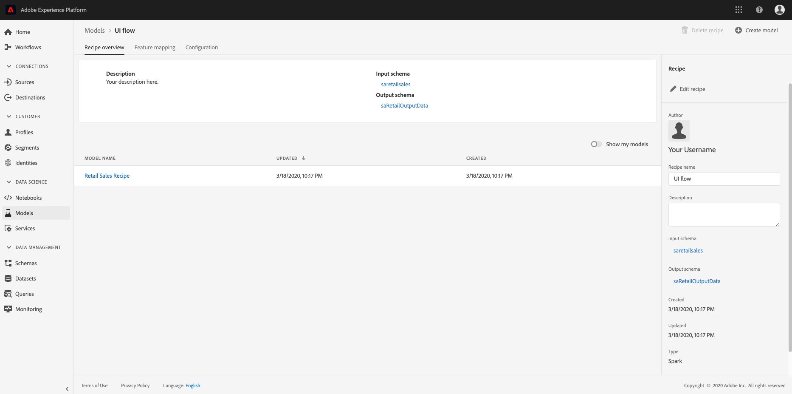

# Erstellen eines Skripts mit Jupyter-Notebooks

Dieses Tutorial umfasst zwei Hauptabschnitte. Zuerst erstellen Sie ein maschinelles Lernmodell mit einer Vorlage innerhalb von [!DNL JupyterLab Notebook]. Als Nächstes führen Sie den Workflow für die Rezeptur des Notebooks innerhalb von [!DNL JupyterLab] aus, um ein Rezept innerhalb von [!DNL Data Science Workspace] zu erstellen.

## Vorgestellte Konzepte:

- **Rezepte:** Ein Rezept ist ein von Adobe verwendeter Begriff für eine Modellspezifikation. Es handelt sich dabei um einen Container auf oberster Ebene, der einen bestimmten Algorithmus für maschinelles Lernen, einen KI-Algorithmus oder eine Gruppe von Algorithmen, eine Verarbeitungslogik und eine Konfiguration darstellt, die für die Einrichtung und Ausführung eines trainierten Modells und somit zur Lösung spezifischer geschäftlicher Probleme erforderlich sind.
- **Modell:** Ein Modell ist eine Instanz eines maschinellen Lernrezepts, das mithilfe von historischen Daten und Konfigurationen zur Lösung eines geschäftlichen Anwendungsfalls trainiert wird.
- **Training:** Ein Training besteht aus dem Erlernen von Mustern und Insights auf Grundlage gekennzeichneter Daten.
- **Scoring:** Beim Scoring werden mithilfe eines trainierten Modells Insights aus Daten generiert.

## Erste Schritte mit der [!DNL JupyterLab] Notebook-Umgebung

Das Erstellen eines Rezepts von Grund auf kann innerhalb von [!DNL Data Science Workspace] erfolgen. Navigieren Sie zum Beginn zu [Adobe Experience Platform](https://platform.adobe.com) und klicken Sie auf der linken Seite auf die Registerkarte **[!UICONTROL Notebooks]**. Erstellen Sie ein neues Notebook, indem Sie die Vorlage Rezept Builder aus dem [!DNL JupyterLab Launcher] auswählen.

Mit dem [!UICONTROL Rezept Builder] Notebook können Sie Schulungen und Bewertungsläufe im Notebook ausführen. So können Sie zwischen laufenden Experimenten für Trainings- und Scoring-Daten flexibel Änderungen an den `train()`- und `score()`-Methoden vorzunehmen. Sobald Sie mit den Ausgaben der Schulung und Bewertung zufrieden sind, können Sie ein Rezept erstellen, das in [!DNL Data Science Workspace] verwendet werden kann, indem Sie die Funktionen des Notebooks nutzen, die in das Rezept Builder-Notebook integriert sind.

>[!NOTE]
>
>Das Recipe Builder-Notebook erlaubt ein Arbeiten mit allen Dateiformaten, die Funktion „Rezept erstellen“ unterstützt derzeit jedoch nur [!DNL Python].


Wenn Sie vom Starter auf das Rezept Builder-Notebook klicken, wird das Notebook in der Registerkarte geöffnet. Die im Notebook verwendete Vorlage ist das Rezept „Python Retail Sales Forecasting“, das auch in [diesem öffentlichen Repository](https://github.com/adobe/experience-platform-dsw-reference/tree/master/recipes/python/retail/) zu finden ist.

Beachten Sie, dass es in der Symbolleiste drei weitere Aktionen gibt: **[!UICONTROL Zug]**, **[!UICONTROL Ergebnis]** und **[!UICONTROL Rezept erstellen]**. Diese Symbole werden nur im Notebook [!UICONTROL Rezept Builder] angezeigt. Weiterführende Informationen zu diesen Aktionen erhalten Sie im Abschnitt [Training und Scoring](#training-and-scoring), nachdem Sie Ihr Rezept im Notebook erstellt haben.


## Rezeptdateien bearbeiten

Um Änderungen an den Rezeptdateien vorzunehmen, navigieren Sie in Jupyter zu der Zelle, die dem Dateipfad entspricht. Wenn Sie zum Beispiel Änderungen an `evaluator.py` vornehmen möchten, suchen Sie nach `%%writefile demo-recipe/evaluator.py`.

Nehmen Sie die erforderlichen Änderungen in der Zelle vor und führen Sie die Zelle dann einfach aus. Der `%%writefile filename.py`-Befehl schreibt den Inhalt der Zelle in die Datei `filename.py`. Sie müssen die Zelle für jede Datei mit Änderungen manuell ausführen.

>[!NOTE]
>
>Sie sollten die Zellen gegebenenfalls manuell ausführen.

## Erste Schritte mit dem Recipe Builder-Notebook

Nachdem Sie die Grundlagen für die [!DNL JupyterLab] Notebook-Umgebung kennen, können Sie sich die Dateien ansehen, aus denen ein Rezept für ein maschinelles Lernmodell besteht. Die Dateien, über die wir reden werden, sind hier dargestellt:

- [Anforderungsdatei](#requirements-file)
- [Konfigurationsdateien](#configuration-files)
- [Ladeprogramm für Trainings-Daten](#training-data-loader)
- [Ladeprogramm für Scoring-Daten](#scoring-data-loader)
- [Pipeline-Datei](#pipeline-file)
- [Evaluator-Datei](#evaluator-file)
- [Data Saver-Datei](#data-saver-file)

### Anforderungsdatei {#requirements-file}

Die Anforderungsdatei dient zum Deklarieren zusätzlicher Bibliotheken, die Sie im Rezept verwenden möchten. Sie können die Versionsnummer angeben, wenn eine Abhängigkeit vorliegt. Weitere Bibliotheken finden Sie unter [anaconda.org](https://anaconda.org). Informationen zum Formatieren der Anforderungsdatei finden Sie unter [Conda](https://docs.conda.io/projects/conda/en/latest/user-guide/tasks/manage-environments.html#creating-an-environment-file-manually). Die Liste der bereits verwendeten Hauptbibliotheken umfasst:

```JSON
python=3.6.7
scikit-learn
pandas
numpy
data_access_sdk_python
```

>[!NOTE]
>
>Bibliotheken oder spezifische Versionen, die Sie hinzufügen, sind möglicherweise nicht mit den oben genannten Bibliotheken kompatibel. Wenn Sie außerdem festlegen, dass eine Umgebung manuell erstellt werden soll, darf das Feld `name` nicht überschrieben werden.

### Konfigurationsdateien {#configuration-files}

Mit den Konfigurationsdateien `training.conf` und `scoring.conf` werden die Datensätze angegeben, die Sie für das Training und Scoring sowie das Hinzufügen von Hyperparametern nutzen möchten. Es gibt separate Konfigurationen für Training und Scoring.

Benutzer müssen die folgenden Variablen ausfüllen, bevor sie ein Training und Scoring durchführen können:
- `trainingDataSetId`
- `ACP_DSW_TRAINING_XDM_SCHEMA`
- `scoringDataSetId`
- `ACP_DSW_SCORING_RESULTS_XDM_SCHEMA`
- `scoringResultsDataSetId`

Um die Dataset- und Schema-IDs zu finden, gehen Sie in Notebooks auf der linken Navigationsleiste (unter dem Ordnersymbol) zur Registerkarte &quot;Daten&quot;.


Dieselben Daten finden Sie in [Adobe Experience Platform](https://platform.adobe.com/) unter den Registerkarten **[Schema](https://platform.adobe.com/schema)** und **[Datensätze](https://platform.adobe.com/dataset/overview)**.

Standardmäßig sind für den Zugriff auf Daten die folgenden Konfigurationsparameter festgelegt:

- `ML_FRAMEWORK_IMS_USER_CLIENT_ID`
- `ML_FRAMEWORK_IMS_TOKEN`
- `ML_FRAMEWORK_IMS_ML_TOKEN`
- `ML_FRAMEWORK_IMS_TENANT_ID`

## Ladeprogramm für Trainings-Daten  {#training-data-loader}

Der Zweck des Ladeprogramms für Trainings-Daten besteht darin, Daten zu instanziieren, die zum Erstellen des maschinellen Lernmodells verwendet werden. In der Regel gibt es zwei Aufgaben, die das Ladeprogramm für Trainings-Daten erledigen wird:
- Daten von [!DNL Platform] laden
- Datenvorbereitung und Funktionsentwicklung

Die folgenden beiden Abschnitte liefern Informationen über das Laden und Vorbereiten von Daten.

### Laden von Daten  {#loading-data}

In diesem Schritt wird der [pandas-Dataframe](https://pandas.pydata.org/pandas-docs/stable/generated/pandas.DataFrame.html) verwendet. Daten können entweder mit dem SDK [!DNL Platform] (`platform_sdk`) oder mit den Pandas-Funktionen `read_csv()` oder `read_json()` aus externen Quellen geladen werden.[!DNL Adobe Experience Platform]

- [[!DNL Platform SDK]](#platform-sdk)
- [Externe Quellen](#external-sources)

>[!NOTE]
>
>Im Recipe Builder-Notebook werden Daten über das Datenladeprogramm `platform_sdk` geladen.

### [!DNL Platform] SDK {#platform-sdk}

Eine ausführliche Anleitung zur Verwendung des Datenladeprogramms `platform_sdk` finden Sie im [Handbuch zum Platform-SDK](../authoring/platform-sdk.md). Dieses Tutorial enthält Informationen zur Build-Authentifizierung, zum grundlegenden Lesen von Daten sowie zum grundlegenden Schreiben von Daten.

### Externe Quellen  {#external-sources}

Dieser Abschnitt veranschaulicht, wie Sie eine JSON- oder CSV-Datei in ein pandas-Objekt importieren können. Die offizielle Dokumentation der pandas-Bibliothek finden Sie hier:
- [read_csv](https://pandas.pydata.org/pandas-docs/stable/generated/pandas.read_csv.html)
- [read_json](https://pandas.pydata.org/pandas-docs/stable/generated/pandas.read_json.html)

Zunächst finden Sie hier ein Beispiel für den Import einer CSV-Datei. Das `data`-Argument ist der Pfad zur CSV-Datei. Diese Variable wurde aus den `configProperties` im [vorherigen Abschnitt](#configuration-files) importiert.

```PYTHON
df = pd.read_csv(data)
```

Sie können auch aus einer JSON-Datei importieren. Das `data`-Argument ist der Pfad zur CSV-Datei. Diese Variable wurde aus den `configProperties` im [vorherigen Abschnitt](#configuration-files) importiert.

```PYTHON
df = pd.read_json(data)
```

Jetzt befinden sich Ihre Daten im Dataframe-Objekt und können im [nächsten Abschnitt](#data-preparation-and-feature-engineering) analysiert und bearbeitet werden.

### Von Plattform-SDK

Sie können Daten mit dem Plattform-SDK laden. Die Bibliothek kann oben auf der Seite importiert werden, indem die folgende Zeile eingefügt wird:

`from platform_sdk.dataset_reader import DatasetReader`

Anschließend nutzen wir die `load()`-Methode, um den Trainings-Datensatz aus der `trainingDataSetId` wie in unserer Konfiguration (`recipe.conf`) festgelegt zu erfassen.

```PYTHON
def load(config_properties):
    print("Training Data Load Start")

    #########################################
    # Load Data
    #########################################    
    client_context = get_client_context(config_properties)
    
    dataset_reader = DatasetReader(client_context, config_properties['trainingDataSetId'])
    
    timeframe = config_properties.get("timeframe")
    tenant_id = config_properties.get("tenant_id")
```

>[!NOTE]
>
>Wie im Abschnitt [Konfigurationsdatei](#configuration-files) erwähnt, werden die folgenden Konfigurationsparameter für Sie eingestellt, wenn Sie mit `client_context` auf Daten aus der Experience Platform zugreifen:
> - `ML_FRAMEWORK_IMS_USER_CLIENT_ID`
> - `ML_FRAMEWORK_IMS_TOKEN`
> - `ML_FRAMEWORK_IMS_ML_TOKEN`
> - `ML_FRAMEWORK_IMS_TENANT_ID`


Jetzt, da Sie über Ihre Daten verfügen, können Sie mit der Datenvorbereitung und Funktionsentwicklung beginnen.

### Datenvorbereitung und Funktionsentwicklung  {#data-preparation-and-feature-engineering}

Nach dem Laden werden die Daten vorbereitet und auf die Datensätze `train` und `val` aufgeteilt. Betrachten Sie folgenden Beispiel-Code:

```PYTHON
#########################################
# Data Preparation/Feature Engineering
#########################################
dataframe.date = pd.to_datetime(dataframe.date)
dataframe['week'] = dataframe.date.dt.week
dataframe['year'] = dataframe.date.dt.year

dataframe = pd.concat([dataframe, pd.get_dummies(dataframe['storeType'])], axis=1)
dataframe.drop('storeType', axis=1, inplace=True)
dataframe['isHoliday'] = dataframe['isHoliday'].astype(int)

dataframe['weeklySalesAhead'] = dataframe.shift(-45)['weeklySales']
dataframe['weeklySalesLag'] = dataframe.shift(45)['weeklySales']
dataframe['weeklySalesDiff'] = (dataframe['weeklySales'] - dataframe['weeklySalesLag']) / dataframe['weeklySalesLag']
dataframe.dropna(0, inplace=True)

dataframe = dataframe.set_index(dataframe.date)
dataframe.drop('date', axis=1, inplace=True) 
```

In diesem Beispiel werden auf den ursprünglichen Datensatz fünf Aktionen angewendet:
- Hinzufügen der Spalten `week` und `year`
- Konvertieren von `storeType` in eine Indikatorvariable
- Konvertieren von `isHoliday` in eine numerische Variable
- Versetzen von `weeklySales` für zukünftige und vorherige Umsatzwerte
- Aufteilen von Daten anhand des Datums in die Datensätze `train` und `val`

Zuerst werden die Spalten `week` und `year` erstellt und die ursprüngliche Spalte `date` in [!DNL Python] [datetime](https://pandas.pydata.org/pandas-docs/stable/generated/pandas.to_datetime.html) konvertiert. Wochen- und Jahreswerte werden aus dem datetime-Objekt extrahiert.

Dann wird `storeType` in drei Spalten konvertiert, die die drei verschiedenen Speichertypen (`A`, `B` und `C`) darstellen. Jede wird einen booleschen Wert für den Status enthalten, wobei `storeType` „true“ lautet. Die `storeType`-Spalte wird verworfen.

Gleichermaßen ändert `weeklySales` den booleschen Wert `isHoliday` in eine numerische Darstellung (eins oder null).

Diese Daten werden auf die Datensätze `train` und `val` aufgeteilt.

Die `load()`-Funktion sollte mit den Datensätzen `train` und `val` als Ausgabe abgeschlossen werden.

### Ladeprogramm für Scoring-Daten  {#scoring-data-loader}

Das Laden von Daten zum Scoring ähnelt dem Laden von Trainings-Daten in der `split()`-Funktion. Wir verwenden das Data Access-SDK, um Daten aus der `scoringDataSetId` in unserer `recipe.conf`-Datei zu laden.

```PYTHON
def load(config_properties):

    print("Scoring Data Load Start")

    #########################################
    # Load Data
    #########################################
    client_context = get_client_context(config_properties)

    dataset_reader = DatasetReader(client_context, config_properties['scoringDataSetId'])
    timeframe = config_properties.get("timeframe")
    tenant_id = config_properties.get("tenant_id")
```

Nach dem Laden der Daten erfolgen die Datenvorbereitung und Funktionsentwicklung.

```PYTHON
    #########################################
    # Data Preparation/Feature Engineering
    #########################################
    if '_id' in dataframe.columns:
        #Rename columns to strip tenantId
        dataframe = dataframe.rename(columns = lambda x : str(x)[str(x).find('.')+1:])
        #Drop id, eventType and timestamp
        dataframe.drop(['_id', 'eventType', 'timestamp'], axis=1, inplace=True)

    dataframe.date = pd.to_datetime(dataframe.date)
    dataframe['week'] = dataframe.date.dt.week
    dataframe['year'] = dataframe.date.dt.year

    dataframe = pd.concat([dataframe, pd.get_dummies(dataframe['storeType'])], axis=1)
    dataframe.drop('storeType', axis=1, inplace=True)
    dataframe['isHoliday'] = dataframe['isHoliday'].astype(int)

    dataframe['weeklySalesAhead'] = dataframe.shift(-45)['weeklySales']
    dataframe['weeklySalesLag'] = dataframe.shift(45)['weeklySales']
    dataframe['weeklySalesDiff'] = (dataframe['weeklySales'] - dataframe['weeklySalesLag']) / dataframe['weeklySalesLag']
    dataframe.dropna(0, inplace=True)

    dataframe = dataframe.set_index(dataframe.date)
    dataframe.drop('date', axis=1, inplace=True)

    print("Scoring Data Load Finish")

    return dataframe
```

Da der Zweck unseres Modells darin besteht, zukünftige Wochenumsätze vorherzusagen, müssen Sie einen Scoring-Datensatz erstellen, um zu bewerten, wie gut die Prognosen des Modells funktionieren.

Dieses Recipe Builder-Notebook erlaubt das, indem unser Wochenumsatz (weeklySales) um 7 Tage nach vorne versetzt wird. Beachten Sie, dass es wöchentliche Messwerte für 45 Filialen gibt, sodass Sie die `weeklySales`-Werte in einer neuen Spalte namens `weeklySalesAhead` um 45 Datensätze nach vorne verschieben können.

```PYTHON
df['weeklySalesAhead'] = df.shift(-45)['weeklySales']
```

Auf ähnliche Weise können Sie eine Spalte `weeklySalesLag` erstellen, indem Sie eine Verschiebung um 45 nach hinten vornehmen. So können Sie auch den Unterschied bei Wochenumsätzen berechnen und in der Spalte `weeklySalesDiff` speichern.

```PYTHON
df['weeklySalesLag'] = df.shift(45)['weeklySales']
df['weeklySalesDiff'] = (df['weeklySales'] - df['weeklySalesLag']) / df['weeklySalesLag']
```

Da Sie die `weeklySales`-Datenpunkte um 45 Datensätze nach vorne und 45 Datensätze nach hinten versetzen, um neue Spalten zu erstellen, weisen die ersten und letzten 45 Datenpunkte NaN-Werte auf. Sie können diese Punkte aus unserem Datensatz entfernen, indem Sie die `df.dropna()`-Funktion verwenden, um alle Zeilen mit NaN-Werten zu entfernen.

```PYTHON
df.dropna(0, inplace=True)
```

Die `load()`-Funktion in Ihrem Ladeprogramm für Scoring-Daten sollte mit dem Scoring-Datensatz als Ausgabe abschließen.

### Pipeline-Datei  {#pipeline-file}

Die `pipeline.py`-Datei enthält Logiken für Training und Scoring.

### Training {#training}

Der Zweck von Training besteht darin, mithilfe von Funktionen und Bezeichnungen in Ihrem Trainings-Datensatz ein Modell zu erstellen.

>[!NOTE]
> 
>Funktionen bezieht sich auf die Eingabevariable, die vom maschinellen Lernmodell zur Vorhersage der Bezeichnungen verwendet wird.

Die `train()`-Funktion sollte das Trainings-Modell enthalten und das trainierte Modell zurückgeben. Beispiele für verschiedene Modelle finden Sie in der Dokumentation [Benutzerhandbuch zu scikit-learn](https://scikit-learn.org/stable/user_guide.html).

Nach der Auswahl Ihres Trainings-Modells passen Sie Ihren x- und y-Trainings-Datensatz an das Modell an und die Funktion gibt das trainierte Modell zurück. Folgendes Beispiel veranschaulicht zeigt dies:

```PYTHON
def train(configProperties, data):

    print("Train Start")

    #########################################
    # Extract fields from configProperties
    #########################################
    learning_rate = float(configProperties['learning_rate'])
    n_estimators = int(configProperties['n_estimators'])
    max_depth = int(configProperties['max_depth'])


    #########################################
    # Fit model
    #########################################
    X_train = data.drop('weeklySalesAhead', axis=1).values
    y_train = data['weeklySalesAhead'].values

    seed = 1234
    model = GradientBoostingRegressor(learning_rate=learning_rate,
                                      n_estimators=n_estimators,
                                      max_depth=max_depth,
                                      random_state=seed)

    model.fit(X_train, y_train)

    print("Train Complete")

    return model
```

Beachten Sie, dass je nach Anwendung Argumente in Ihrer `GradientBoostingRegressor()`-Funktion vorhanden sind. `xTrainingDataset` sollte Ihre für das Training genutzten Funktionen enthalten, während `yTrainingDataset` die Bezeichnungen beinhalten sollte.

### Scoring  {#scoring}

Die `score()`-Funktion sollte den Scoring-Algorithmus enthalten und einen Messwert zurückgeben, der angibt, wie gut das Modell funktioniert. Die `score()`-Funktion nutzt die Bezeichnungen des Scoring-Datensatzes und das trainierte Modell, um eine Reihe von prognostizierten Funktionen zu generieren. Die prognostizierten Werte werden dann mit den tatsächlichen Funktionen im Scoring-Datensatz abgeglichen. In diesem Beispiel verwendet die Funktion `score()` das trainierte Modell, um Funktionen mithilfe der Bezeichnungen aus dem Scoring-Datensatz vorherzusagen. Die prognostizierten Funktionen werden zurückgegeben.

```PYTHON
def score(configProperties, data, model):

    print("Score Start")

    X_test = data.drop('weeklySalesAhead', axis=1).values
    y_test = data['weeklySalesAhead'].values
    y_pred = model.predict(X_test)

    data['prediction'] = y_pred
    data = data[['store', 'prediction']].reset_index()
    data['date'] = data['date'].astype(str)

    print("Score Complete")

    return data
```

### Evaluator-Datei  {#evaluator-file}

Die `evaluator.py`-Datei enthält eine Logik dafür, wie Sie Ihr trainiertes Rezept bewerten und die Trainings-Daten aufteilen wollen. Für das Einzelhandelsbeispiel wird die Logik zum Laden und Vorbereiten der Trainings-Daten einbezogen. Wir sehen uns die beiden folgenden Abschnitte an.

### Datensatz aufteilen  {#split-the-dataset}

Die Vorbereitung der Daten für das Training erfordert eine Aufteilung des Datensatzes, damit er sich für Training und Tests verwenden lässt. Diese `val`-Daten dienen implizit dazu, das Modell nach dem Trainieren zu bewerten. Dieser Prozess erfolgt getrennt vom Scoring.

Dieser Abschnitt veranschaulicht die `split()`-Funktion, die zuerst Daten in das Notebook lädt und dann bereinigt, indem nicht verwandte Spalten im Datensatz entfernt werden. Nun können Sie mit der Funktionsentwicklung fortfahren; sie erlaubt die Erstellung zusätzlicher relevanter Funktionen aus vorhandenen Rohfunktionen in den Daten. Ein Beispiel für diesen Vorgang sowie eine entsprechende Erklärung finden Sie im Folgenden.

Die `split()`-Funktion ist unten dargestellt. Der im Argument bereitgestellte Dataframe wird in die zurückzugebenden Variablen `train` und `val` aufgeteilt.

```PYTHON
def split(self, configProperties={}, dataframe=None):
    train_start = '2010-02-12'
    train_end = '2012-01-27'
    val_start = '2012-02-03'
    train = dataframe[train_start:train_end]
    val = dataframe[val_start:]

    return train, val
```

### Trainiertes Modell bewerten  {#evaluate-the-trained-model}

Die `evaluate()`-Funktion wird ausgeführt, nachdem das Modell trainiert wurde, und gibt einen Messwert zurück, der angibt, wie gut das Modell funktioniert. Die `evaluate()`-Funktion nutzt die Testdatensatzbezeichnungen und das trainierte Modell, um eine Reihe von Funktionen vorherzusagen. Die prognostizierten Werte werden dann mit den tatsächlichen Funktionen im Testdatensatz abgeglichen. Häufige Scoring-Algorithmen sind:
- [Mittlerer absoluter prozentualer Fehler (MAPE)](https://en.wikipedia.org/wiki/Mean_absolute_percentage_error)
- [Mittlerer absoluter Fehler (MAE)](https://en.wikipedia.org/wiki/Mean_absolute_error)
- [Wurzel aus dem gemittelten Fehlerquadrat (RMSE)](https://en.wikipedia.org/wiki/Root-mean-square_deviation)


Die `evaluate()`-Funktion im Beispiel für Einzelhandelsumsätze ist unten dargestellt:

```PYTHON
def evaluate(self, data=[], model={}, configProperties={}):
    print ("Evaluation evaluate triggered")
    val = data.drop('weeklySalesAhead', axis=1)
    y_pred = model.predict(val)
    y_actual = data['weeklySalesAhead'].values
    mape = np.mean(np.abs((y_actual - y_pred) / y_actual))
    mae = np.mean(np.abs(y_actual - y_pred))
    rmse = np.sqrt(np.mean((y_actual - y_pred) ** 2))

    metric = [{"name": "MAPE", "value": mape, "valueType": "double"},
                {"name": "MAE", "value": mae, "valueType": "double"},
                {"name": "RMSE", "value": rmse, "valueType": "double"}]

    return metric
```

Beachten Sie, dass die Funktion ein `metric`-Objekt zurückgibt, das eine Gruppe von Bewertungsmetriken enthält. Anhand dieser Metriken lässt sich bewerten, wie gut das trainierte Modell funktioniert.

### Data Saver-Datei  {#data-saver-file}

Die `datasaver.py`-Datei enthält die `save()`-Funktion zum Speichern Ihrer Prognose beim Testen des Scoring. Die Funktion `save()` nimmt Ihre Prognose auf und schreibt mithilfe von [!DNL Experience Platform Catalog]-APIs die Daten in die `scoringResultsDataSetId`, die Sie in Ihrer `scoring.conf`-Datei angegeben haben.

Das Beispiel, das im Rezept für Einzelhandelsumsätze verwendet wird, ist hier dargestellt. Beachten Sie den Einsatz der `DataSetWriter`-Bibliothek zum Schreiben von Daten in Platform:

```PYTHON
from data_access_sdk_python.writer import DataSetWriter

def save(configProperties, prediction):
    print("Datasaver Start")
    print("Setting up Writer")

    catalog_url = "https://platform.adobe.io/data/foundation/catalog"
    ingestion_url = "https://platform.adobe.io/data/foundation/import"

    writer = DataSetWriter(catalog_url=catalog_url,
                           ingestion_url=ingestion_url,
                           client_id=configProperties['ML_FRAMEWORK_IMS_USER_CLIENT_ID'],
                           user_token=configProperties['ML_FRAMEWORK_IMS_TOKEN'],
                           service_token=configProperties['ML_FRAMEWORK_IMS_ML_TOKEN'])

    print("Writer Configured")

    writer.write(data_set_id=configProperties['scoringResultsDataSetId'],
                 dataframe=prediction,
                 ims_org=configProperties['ML_FRAMEWORK_IMS_TENANT_ID'])

    print("Write Done")
    print("Datasaver Finish")
    print(prediction)
```

## Training und Scoring  {#training-and-scoring}

Wenn Sie die Änderungen an Ihrem Notebook abgeschlossen haben und Ihr Rezept trainieren möchten, können Sie oben in der Leiste auf die entsprechenden Schaltflächen klicken, um einen Trainings-Lauf in der Zelle zu erstellen. Nach dem Klicken auf die Schaltfläche wird ein Protokoll mit Befehlen und Ausgaben aus dem Trainings-Skript im Notebook angezeigt (unter der Zelle `evaluator.py`). Conda installiert zunächst alle Abhängigkeiten, dann wird das Training initiiert.

Beachten Sie, dass Sie ein Training mindestens einmal ausführen müssen, bevor Sie mit dem Scoring fortfahren können. Wenn Sie auf die Schaltfläche **[!UICONTROL Scoring ausführen]** klicken, wird das trainierte Modell, das beim Trainieren erzeugt wurde, bewertet. Das Scoring-Skript wird unter `datasaver.py` angezeigt.

Wenn Sie zum Debuggen die ausgeblendete Ausgabe anzeigen möchten, fügen Sie `debug` am Ende der Ausgabenzelle hinzu und führen Sie das Scoring erneut aus.

## Rezept erstellen  {#create-recipe}

Wenn Sie die Bearbeitung des Rezepts abgeschlossen haben und mit der Schulungs-/Bewertungsausgabe zufrieden sind, können Sie ein Rezept aus dem Notebook erstellen, indem Sie in der Navigation oben rechts auf **[!UICONTROL Rezept erstellen]** drücken.


Nach dem Klicken auf die Schaltfläche werden Sie aufgefordert, einen Rezeptnamen einzugeben. Dieser Name stellt das eigentliche Rezept dar, das auf [!DNL Platform] erstellt wurde.


Wenn Sie auf **[!UICONTROL OK]** klicken, können Sie in [Adobe Experience Platform](https://platform.adobe.com/) zum neuen Rezept navigieren. Sie können auf die Schaltfläche **[!UICONTROL Rezepte anzeigen]** klicken, um zur Registerkarte **[!UICONTROL Rezepte]** unter **[!UICONTROL ML-Modelle]** zu gelangen.


Sobald der Prozess abgeschlossen ist, sieht das Rezept in etwa wie folgt aus:



>[!CAUTION]
>
> - Löschen Sie keine der Dateizellen.
> - Bearbeiten Sie nicht die `%%writefile`-Zeile oben in den Dateizellen.
> - Erstellen Sie nicht gleichzeitig Rezepte in verschiedenen Notebooks.


## Nächste Schritte  {#next-steps}

In diesem Tutorial haben Sie gelernt, wie Sie im Recipe Builder-Notebook ein Modell für maschinelles Lernen einrichten können. Sie haben auch gelernt, wie Sie das Notebook mit dem Rezept-Arbeitsablauf im Notebook ausüben können, um ein Rezept innerhalb von [!DNL Data Science Workspace] zu erstellen.

Um weiterhin zu lernen, wie mit Ressourcen innerhalb von [!DNL Data Science Workspace] gearbeitet wird, besuchen Sie bitte die Dropdownliste [!DNL Data Science Workspace] Rezepte und Modelle.

## Zusätzliche Ressourcen {#additional-resources}

Das folgende Video hilft Ihnen beim Einrichten und Bereitstellen von Modellen.

>[!VIDEO](https://video.tv.adobe.com/v/30575?quality=12&enable10seconds=on&speedcontrol=on)
