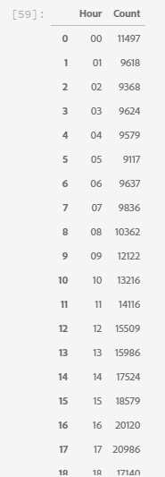

# Webbasierte Daten für Prognosemodelle mithilfe des EDA-Notebooks (Exploratory Data Analyse)

Das EDA-Notizbuch (Exploratory Data Analyse) hilft Ihnen bei der Erkennung von Datenmustern, der Überprüfung der Datensicherheit und der Zusammenfassung der relevanten Daten für Prognosemodelle.

Das EDA Notebook-Beispiel wurde mit Blick auf webbasierte Daten optimiert und besteht aus zwei Teilen. Teil 1: Beginn mit Abfrage Service zur Ansicht von Trends und Daten-Snapshots. Als Nächstes werden die Daten mit Blick auf die Analyse der Forschungsdaten auf der Ebene des Profils und des Besuchers aggregiert.

Teil zwei Beginn durch die Durchführung beschreibender Analysen über aggregierte Daten mit Python-Bibliotheken. Dieses Notebook zeigt Visualisierungen wie Histogramme, Streudiagramme, Box-Diagramme und eine Korrelationsmatrix, um umsetzbare Einblicke zu gewinnen, mit denen bestimmt wird, welche Funktionen bei der Vorhersage eines Ziels am ehesten hilfreich sind.

## Erste Schritte

Bevor Sie dieses Handbuch lesen, lesen Sie bitte das [[!DNL JupyterLab] Benutzerhandbuch](./overview.md), um eine allgemeine Einführung zu [!DNL JupyterLab] und dessen Rolle innerhalb des Data Science Workspace zu erhalten. Wenn Sie Ihre eigenen Daten verwenden, lesen Sie bitte die Dokumentation für [Datenzugriff in [!DNL Jupyterlab] Notebooks](./access-notebook-data.md). Dieser Leitfaden enthält wichtige Informationen zu den Beschränkungen für Notebooks.

Dieses Notebook verwendet einen Midvalues-Datensatz in Form von Adobe Analytics Experience Ereignisses-Daten, die im Analytics Analysis Workspace gefunden werden. Zur Verwendung des EDA-Notebooks müssen Sie Ihre Datentabelle mit den folgenden Werten definieren: `target_table` und `target_table_id`. Es können alle Midvalues-Datensätze verwendet werden.

Um diese Werte zu finden, führen Sie die Schritte aus, die im Abschnitt [Schreiben in einen Datensatz in Python](./access-notebook-data.md#write-python) des JupyterLab-Datenzugriffshandbuchs beschrieben sind. Der Dataset-Name (`target_table`) befindet sich im Ordner &quot;dataset&quot;. Wenn Sie mit der rechten Maustaste auf den Datensatz klicken, um Daten in ein Notebook zu untersuchen oder zu schreiben, wird eine Dataset-ID (`target_table_id`) im Eintrag für den ausführbaren Code angegeben.

## Datenerfassung

Dieser Abschnitt enthält Konfigurationsschritte und Beispielprodukte, die zur Ansicht von Trends verwendet werden, z. B. &quot;Top Ten Cities by user Aktivität&quot;oder &quot;Top Ten Viewers&quot;.

### Bibliothekskonfiguration

JupyterLab unterstützt mehrere Bibliotheken. Der folgende Code kann eingefügt und in eine Codezelle ausgeführt werden, um alle in diesem Beispiel verwendeten erforderlichen Pakete zu erfassen und zu installieren. Sie können zusätzliche oder alternative Analysen außerhalb dieses Beispiels für Ihre eigene Datendatei verwenden. Für eine Liste der unterstützten Pakete kopieren Sie `!pip list --format=columns` in eine neue Zelle.

```python
!pip install colorama
import chart_studio.plotly as py
import plotly.graph_objs as go
from plotly.offline import iplot
from scipy import stats
import numpy as np
import warnings
warnings.filterwarnings('ignore')
from scipy.stats import pearsonr
import matplotlib.pyplot as plt
from scipy.stats import pearsonr
import pandas as pd
import math
import re
import seaborn as sns
from datetime import datetime
import colorama
from colorama import Fore, Style
pd.set_option('display.max_columns', None)
pd.set_option('display.max_rows', None)
pd.set_option('display.width', 1000)
pd.set_option('display.expand_frame_repr', False)
pd.set_option('display.max_colwidth', -1)
```

### Verbinden mit Adobe Experience Platform [!DNL Query Service]

[!DNL JupyterLab] auf Plattform können Sie SQL in einem  [!DNL Python] Notebook verwenden, um über den  [Abfrage Service](https://docs.adobe.com/content/help/de-DE/experience-platform/query/home.html) auf Daten zuzugreifen. Der Zugriff auf Daten über [!DNL Query Service] kann aufgrund der höheren Laufzeiten für die Behandlung großer Datensätze nützlich sein. Beachten Sie, dass die Datenabfrage mit [!DNL Query Service] eine Verarbeitungszeit von 10 Minuten hat.

Bevor Sie [!DNL Query Service] in [!DNL JupyterLab] verwenden, sollten Sie sich mit der [[!DNL Query Service] SQL-Syntax](https://docs.adobe.com/content/help/de-DE/experience-platform/query/home.html#!api-specification/markdown/narrative/technical_overview/query-service/sql/syntax.md) vertraut machen.

Um Query Service in JupyterLab zu nutzen, müssen Sie zunächst eine Verbindung zwischen Ihrem ausgeführten Python-Notebook und Query Service herstellen. Dies kann durch Ausführen der folgenden Zelle erreicht werden.

```python
qs_connect()
```

### Definieren des Datenbestands für die Ermittlung von Mittelwerten

Um Daten abfragen und überprüfen zu können, muss eine Tabelle mit dem Datensatz für Zwischenwerte bereitgestellt werden. Kopieren Sie die Werte `table_name` und `table_id` und ersetzen Sie sie durch Ihre eigenen Datentabellenwerte.

```python
target_table = "table_name"
target_table_id = "table_id"
```

Nach Abschluss sollte diese Zelle dem folgenden Beispiel ähneln:

```python
target_table = "cross_industry_demo_midvalues"
target_table_id = "5f7c40ef488de5194ba0157a"
```

### Den Datensatz für verfügbare Daten entdecken

Mithilfe der unten angegebenen Zelle können Sie den Datumsbereich, der in der Tabelle behandelt wird, Ansicht werden. Die Untersuchung der Anzahl der Tage, des ersten und des letzten Datums dient der Auswahl eines Datumsbereichs für die weitere Analyse.

```python
%%read_sql -c QS_CONNECTION
SELECT distinct Year(timestamp) as Year, Month(timestamp) as Month, count(distinct DAY(timestamp)) as Count_days, min(DAY(timestamp)) as First_date, max(DAY(timestamp)) as Last_date, count(timestamp) as Count_hits
from {target_table}
group by Month(timestamp), Year(timestamp)
order by Year, Month;
```

Beim Ausführen der Zelle wird die folgende Ausgabe erzeugt:


### Datumsangaben für die Datensatzerkennung konfigurieren

Nach der Bestimmung der verfügbaren Daten für die Datensatzerkennung müssen die folgenden Parameter aktualisiert werden. Die in dieser Zelle konfigurierten Daten werden nur zur Datenerkennung in Form von Abfragen verwendet. Die Daten werden später in diesem Handbuch erneut auf geeignete Bereiche für die Analyse von Forschungsdaten aktualisiert.

```python
target_year = "2020" ## The target year
target_month = "02" ## The target month
target_day = "(01,02,03)" ## The target days
```

### Dataset-Erkennung

Nachdem Sie alle Parameter konfiguriert haben, [!DNL Query Service] gestartet haben und einen Datumsbereich haben, können Sie mit dem Lesen von Datenzeilen beginnen. Sie sollten die Anzahl der Zeilen, die Sie lesen, begrenzen.

```python
from platform_sdk.dataset_reader import DatasetReader
from datetime import date
dataset_reader = DatasetReader(PLATFORM_SDK_CLIENT_CONTEXT, dataset_id=target_table_id)
# If you do not see any data or would like to expand the default date range, change the following query
Table = dataset_reader.limit(5).read()
```

Um die Anzahl der im Datensatz verfügbaren Spalten Ansicht, verwenden Sie die folgende Zelle:

```python
print("\nNumber of columns:",len(Table.columns))
```

Um die Zeilen des Datensatzes Ansicht, verwenden Sie die folgende Zelle. In diesem Beispiel ist die Anzahl der Zeilen auf fünf begrenzt.

```python
Table.head(5)
```


Sobald Sie wissen, welche Daten im Datensatz enthalten sind, können Sie den Datensatz weiter unterteilen. In diesem Beispiel werden die Spaltennamen und Datentypen für jede der Spalten aufgelistet, während die Ausgabe verwendet wird, um zu prüfen, ob der Datentyp korrekt ist oder nicht.

```python
ColumnNames_Types = pd.DataFrame(Table.dtypes)
ColumnNames_Types = ColumnNames_Types.reset_index()
ColumnNames_Types.columns = ["Column_Name", "Data_Type"]
ColumnNames_Types
```


### Trendforschung im Datenbestand

Der folgende Abschnitt enthält vier Beispieldaten, mit denen Trends und Datenmuster untersucht werden. Die folgenden Beispiele sind nicht erschöpfend, decken aber einige der am häufigsten untersuchten Funktionen ab.

**Stündliche Aktivität für einen bestimmten Tag**

Diese Abfrage analysiert die tägliche Anzahl von Aktionen und Klicks. Die Ausgabe wird in Form einer Tabelle mit Metriken zur Anzahl der Aktivitäten pro Tagesstunde dargestellt.

```sql
%%read_sql query_2_df -c QS_CONNECTION

SELECT Substring(timestamp, 12, 2)                        AS Hour, 
       Count(enduserids._experience.aaid.id) AS Count 
FROM   {target_table}
WHERE  Year(timestamp) = {target_year} 
       AND Month(timestamp) = {target_month}  
       AND Day(timestamp) in {target_day}
GROUP  BY Hour
ORDER  BY Hour;
```



Nach der Bestätigung der Abfrage können die Daten in einem einheitlichen Plot-Histogramm dargestellt werden, um die Visualisierung zu gewährleisten.

```python
trace = go.Bar(
    x = query_2_df['Hour'],
    y = query_2_df['Count'],
    name = "Activity Count"
)

layout = go.Layout(
    title = 'Activity Count by Hour of Day',
    width = 1200,
    height = 600,
    xaxis = dict(title = 'Hour of Day'),
    yaxis = dict(title = 'Count')
)

fig = go.Figure(data = [trace], layout = layout)
iplot(fig)
```


**Top 10 der angezeigten Seiten für einen bestimmten Tag**

Diese Abfrage analysiert, welche Seiten an einem bestimmten Tag am häufigsten angezeigt werden. Die Ausgabe wird in Form einer Tabelle dargestellt, die Metriken zum Seitennamen und zur Seitenanzahl enthält.

```sql
%%read_sql query_4_df -c QS_CONNECTION

SELECT web.webpagedetails.name                 AS Page_Name, 
       Sum(web.webpagedetails.pageviews.value) AS Page_Views 
FROM   {target_table}
WHERE  Year(timestamp) = {target_year}
       AND Month(timestamp) = {target_month}
       AND Day(timestamp) in {target_day}
GROUP  BY web.webpagedetails.name 
ORDER  BY page_views DESC 
LIMIT  10;
```

Nach der Bestätigung der Abfrage können die Daten in einem einheitlichen Plot-Histogramm dargestellt werden, um die Visualisierung zu gewährleisten.

```python
trace = go.Bar(
    x = query_4_df['Page_Name'],
    y = query_4_df['Page_Views'],
    name = "Page Views"
)

layout = go.Layout(
    title = 'Top Ten Viewed Pages For a Given Day',
    width = 1000,
    height = 600,
    xaxis = dict(title = 'Page_Name'),
    yaxis = dict(title = 'Page_Views')
)

fig = go.Figure(data = [trace], layout = layout)
iplot(fig)
```


**Die zehn beliebtesten Städte gruppiert nach Aktivität der Benutzer**

Diese Abfrage analysiert, aus welchen Städten die Daten stammen.

```sql
%%read_sql query_6_df -c QS_CONNECTION

SELECT concat(placeContext.geo.stateProvince, ' - ', placeContext.geo.city) AS state_city, 
       Count(timestamp)                                                     AS Count
FROM   {target_table}
WHERE  Year(timestamp) = {target_year}
       AND Month(timestamp) = {target_month}
       AND Day(timestamp) in {target_day}
GROUP  BY state_city
ORDER  BY Count DESC
LIMIT  10;
```

Nach der Bestätigung der Abfrage können die Daten in einem einheitlichen Plot-Histogramm dargestellt werden, um die Visualisierung zu gewährleisten.

```python
trace = go.Bar(
    x = query_6_df['state_city'],
    y = query_6_df['Count'],
    name = "Activity by City"
)

layout = go.Layout(
    title = 'Top Ten Cities by User Activity',
    width = 1200,
    height = 600,
    xaxis = dict(title = 'City'),
    yaxis = dict(title = 'Count')
)

fig = go.Figure(data = [trace], layout = layout)
iplot(fig)
```


**Die zehn beliebtesten Produkte**

Diese Abfrage bietet eine Liste der zehn am häufigsten angezeigten Produkte. Im folgenden Beispiel wird die Funktion `Explode()` verwendet, um jedes Produkt im `productlistitems`-Objekt in eine eigene Zeile zurückzugeben. Dadurch können Sie eine verschachtelte Abfrage zum Aggregat von Ansichten für verschiedene SKUs durchführen.

```sql
%%read_sql query_7_df -c QS_CONNECTION

SELECT Product_List_Items.sku AS Product_SKU,
       Sum(Product_Views) AS Total_Product_Views
FROM  (SELECT Explode(productlistitems) AS Product_List_Items, 
              commerce.productviews.value   AS Product_Views 
       FROM   {target_table}
       WHERE  Year(timestamp) = {target_year}
              AND Month(timestamp) = {target_month}
              AND Day(timestamp) in {target_day}
              AND commerce.productviews.value IS NOT NULL) 
GROUP BY Product_SKU 
ORDER BY Total_Product_Views DESC
LIMIT  10;
```

Nach der Bestätigung der Abfrage können die Daten in einem einheitlichen Plot-Histogramm dargestellt werden, um die Visualisierung zu gewährleisten.

```python
trace = go.Bar(
    x = "SKU-" + query_7_df['Product_SKU'],
    y = query_7_df['Total_Product_Views'],
    name = "Product View"
)

layout = go.Layout(
    title = 'Top Ten Viewed Products',
    width = 1200,
    height = 600,
    xaxis = dict(title = 'SKU'),
    yaxis = dict(title = 'Product View Count')
)

fig = go.Figure(data = [trace], layout = layout)
iplot(fig)
```


Nachdem Sie die Trends und Muster der Daten untersucht haben, sollten Sie wissen, welche Funktionen Sie für die Prognose eines Ziels erstellen möchten. Durch Tabellen blättern können Sie schnell die Form der einzelnen Datenattribute, offensichtliche Fehldarstellungen und große Ausreißer in Werten und Beginn hervorheben, um Beziehungen zwischen Attributen anzudeuten.

## Analyse der Sondierungsdaten

Mithilfe der Analyse von Forschungsdaten können Sie Ihr Verständnis der Daten verfeinern und eine Intuition für ansprechende Fragen entwickeln, die als Grundlage für Ihre Modellierung verwendet werden können.

Nachdem Sie den Schritt zur Datenerkennung abgeschlossen haben, haben Sie die Daten auf Ereignis-Ebene mit einigen Aggregationen auf Ereignis-, Stadt- oder Benutzer-ID-Ebene untersucht, um Trends für einen Tag zu sehen. Obwohl diese Daten wichtig sind, geben sie kein vollständiges Bild. Sie verstehen immer noch nicht, was zu einem Kauf auf Ihrer Website führt.

Um dies zu verstehen, müssen Sie Daten auf Profil-/Besucher-Ebene Aggregat, ein Kaufziel definieren und statistische Konzepte wie Korrelationen, Box-Diagramme und Streudiagramme anwenden. Diese Methoden werden verwendet, um Muster von Aktivitäten für Käufer und Nicht-Käufer im von Ihnen definierten Prognosefenster zu vergleichen.

Die folgenden Funktionen werden in diesem Abschnitt erstellt und untersucht:

- `COUNT_UNIQUE_PRODUCTS_PURCHASED`: Die Anzahl der erworbenen Einzelprodukte.
- `COUNT_CHECK_OUTS`: Die Anzahl der Kassengänge.
- `COUNT_PURCHASES`: Die Anzahl der Käufe.
- `COUNT_INSTANCE_PRODUCTADDS`: Die Anzahl der Produktzusatzinstanzen.
- `NUMBER_VISITS` : Die Anzahl der Besuche.
- `COUNT_PAID_SEARCHES`: Die Anzahl der gebührenpflichtigen Suchen.
- `DAYS_SINCE_VISIT`: Die Anzahl der Tage seit dem letzten Besuch.
- `TOTAL_ORDER_REVENUE`: Der Gesamtumsatz der Bestellung.
- `DAYS_SINCE_PURCHASE`: Die Anzahl der Tage seit dem vorherigen Kauf.
- `AVG_GAP_BETWEEN_ORDERS_DAYS`: Die durchschnittliche Lücke zwischen Käufen in Tagen.
- `STATE_CITY`: Enthält Staat und Stadt.

Bevor Sie mit der Datenaggregation fortfahren, müssen Sie die Parameter für die Vorhersagevariable definieren, die bei der Analyse von Forschungsdaten verwendet wird. Mit anderen Worten, was möchten Sie von Ihrem Datenwissenschaftsmodell? Zu den gebräuchlichsten Parametern gehören ein Ziel, ein Prognosezeitraum und ein Zeitraum für die Analyse.

Wenn Sie das EDA-Notebook verwenden, müssen Sie die unten stehenden Werte ersetzen, bevor Sie fortfahren.

```python
goal = "commerce.`order`.purchaseID" #### prediction variable
goal_column_type = "numerical" #### choose either "categorical" or "numerical"
prediction_window_day_start = "2020-01-01" #### YYYY-MM-DD
prediction_window_day_end = "2020-01-31" #### YYYY-MM-DD
analysis_period_day_start = "2020-02-01" #### YYYY-MM-DD
analysis_period_day_end = "2020-02-28" #### YYYY-MM-DD

### If the goal is a categorical goal then select threshold for the defining category and creating bins. 0 is no order placed, and 1 is at least one order placed:
threshold = 1
```

### Datenaggregation für Feature- und Zielerstellung

Um mit der Analyse zu beginnen, müssen Sie ein Ziel auf der Ebene des Profils erstellen und anschließend Ihren Datensatz aggregieren. In diesem Beispiel werden zwei Abfragen bereitgestellt. Die erste Abfrage enthält die Erstellung eines Ziels. Die zweite Abfrage muss aktualisiert werden, um andere Variablen als die in der ersten Abfrage einzuschließen. Möglicherweise möchten Sie das `limit` für Ihre Abfrage aktualisieren. Nach der Durchführung der folgenden Abfragen stehen nun aggregierte Daten zur Erforschung zur Verfügung.

```sql
%%read_sql target_df -d -c QS_CONNECTION

SELECT DISTINCT endUserIDs._experience.aaid.id                  AS ID,
       Count({goal})                                            AS TARGET
FROM   {target_table}
WHERE DATE(TIMESTAMP) BETWEEN '{prediction_window_day_start}' AND '{prediction_window_day_end}'
GROUP BY endUserIDs._experience.aaid.id;
```

```sql
%%read_sql agg_data -d -c QS_CONNECTION

SELECT z.*, z1.state_city as STATE_CITY
from
((SELECT y.*,a2.AVG_GAP_BETWEEN_ORDERS_DAYS as AVG_GAP_BETWEEN_ORDERS_DAYS
from
(select a1.*, f.DAYS_SINCE_PURCHASE as DAYS_SINCE_PURCHASE
from
(SELECT DISTINCT a.ID  AS ID,
COUNT(DISTINCT Product_Items.SKU) as COUNT_UNIQUE_PRODUCTS_PURCHASED,
COUNT(a.check_out) as COUNT_CHECK_OUTS,
COUNT(a.purchases) as COUNT_PURCHASES, 
COUNT(a.product_list_adds) as COUNT_INSTANCE_PRODUCTADDS,
sum(CASE WHEN a.search_paid = 'TRUE' THEN 1 ELSE 0 END) as COUNT_PAID_SEARCHES,
DATEDIFF('{analysis_period_day_end}', MAX(a.date_a)) as DAYS_SINCE_VISIT,
ROUND(SUM(Product_Items.priceTotal * Product_Items.quantity), 2) AS TOTAL_ORDER_REVENUE
from 
(SELECT endUserIDs._experience.aaid.id as ID,
commerce.`checkouts`.value as check_out,
commerce.`order`.purchaseID as purchases, 
commerce.`productListAdds`.value as product_list_adds,
search.isPaid as search_paid,
DATE(TIMESTAMP) as date_a,
Explode(productlistitems) AS Product_Items
from {target_table}
Where DATE(TIMESTAMP) BETWEEN '{analysis_period_day_start}' AND '{analysis_period_day_end}') as a
group by a.ID) as a1
left join 
(SELECT DISTINCT endUserIDs._experience.aaid.id as ID,
DATEDIFF('{analysis_period_day_end}', max(DATE(TIMESTAMP))) as DAYS_SINCE_PURCHASE
from {target_table}
where DATE(TIMESTAMP) BETWEEN '{analysis_period_day_start}' AND '{analysis_period_day_end}'
and commerce.`order`.purchaseid is not null
GROUP BY endUserIDs._experience.aaid.id) as f
on f.ID = a1.ID
where a1.COUNT_PURCHASES>0) as y
left join
(select ab.ID, avg(DATEDIFF(ab.ORDER_DATES, ab.PriorDate)) as AVG_GAP_BETWEEN_ORDERS_DAYS
from
(SELECT distinct endUserIDs._experience.aaid.id as ID, TO_DATE(DATE(TIMESTAMP)) as ORDER_DATES, 
TO_DATE(LAG(DATE(TIMESTAMP),1) OVER (PARTITION BY endUserIDs._experience.aaid.id ORDER BY DATE(TIMESTAMP))) as PriorDate
FROM {target_table}
where DATE(TIMESTAMP) BETWEEN '{analysis_period_day_start}' AND '{analysis_period_day_end}'
AND commerce.`order`.purchaseid is not null) AS ab
where ab.PriorDate is not null
GROUP BY ab.ID) as a2
on a2.ID = y.ID) z    
left join
(select t.ID, t.state_city from
(
SELECT DISTINCT endUserIDs._experience.aaid.id as ID,
concat(placeContext.geo.stateProvince, ' - ', placeContext.geo.city) as state_city, 
ROW_NUMBER() OVER(PARTITION BY endUserIDs._experience.aaid.id ORDER BY DATE(TIMESTAMP) DESC) AS ROWNUMBER
FROM   {target_table}
WHERE  DATE(TIMESTAMP) BETWEEN '{analysis_period_day_start}' AND '{analysis_period_day_end}') as t
where t.ROWNUMBER = 1) z1
on z.ID = z1.ID)
limit 500000;
```

### Zusammenführen der Funktionen im aggregierten Datensatz mit einem Ziel

Die folgende Zelle wird verwendet, um die Funktionen im aggregierten Datensatz, der im vorherigen Beispiel erläutert wurde, mit Ihrem Prognoseziel zusammenzuführen.

```python
Data = pd.merge(agg_data,target_df, on='ID',how='left')
Data['TARGET'].fillna(0, inplace=True)
```

Die nächsten drei Beispielzellen werden verwendet, um sicherzustellen, dass die Zusammenführung erfolgreich war.

`Data.shape` gibt die Anzahl der Spalten gefolgt von der Anzahl der Zeilen zurück, z. B.: (1913, 12).

```python
Data.shape
```

`Data.head(5)` gibt eine Tabelle mit 5 Datenzeilen zurück. Die zurückgegebene Tabelle enthält alle 12 Spalten aggregierter Daten, die einer Profil-ID zugeordnet sind.

```python
Data.head(5)
```


Diese Zelle gibt die Anzahl der eindeutigen Profil aus.

```python
print("Count of unique profiles :", (len(Data)))
```

### Erkennen fehlender Werte und Ausreißer

Nachdem Sie die Datenaggregation abgeschlossen und sie mit Ihrem Ziel zusammengeführt haben, müssen Sie die Daten überprüfen, die gelegentlich als Datengesundheitsüberprüfung bezeichnet werden.

Dieser Prozess umfasst die Identifizierung fehlender Werte und Ausreißer. Wenn Probleme festgestellt werden, wird die nächste Aufgabe konkrete Strategien für ihre Behandlung entwickeln.

>[!NOTE]
>
>Während dieses Schritts können Sie Fehler in den Werten erkennen, die einen Fehler bei der Datenprotokollierung signalisieren können.

```python
Missing = pd.DataFrame(round(Data.isnull().sum()*100/len(Data),2))
Missing.columns =['Percentage_missing_values'] 
Missing['Features'] = Missing.index
```

Die folgende Zelle dient zur Visualisierung der fehlenden Werte.

```python
trace = go.Bar(
    x = Missing['Features'],
    y = Missing['Percentage_missing_values'],
    name = "Percentage_missing_values")

layout = go.Layout(
    title = 'Missing values',
    width = 1200,
    height = 600,
    xaxis = dict(title = 'Features'),
    yaxis = dict(title = 'Percentage of missing values')
)

fig = go.Figure(data = [trace], layout = layout)
iplot(fig)
```


Nach Erkennung fehlender Werte ist es wichtig, Ausreißer zu identifizieren. Parametrische Statistiken wie Mittelwert, Standardabweichung und Korrelation sind hochgradig anfällig für Ausreißer. Darüber hinaus basieren die Annahmen gemeinsamer statistischer Verfahren wie etwa linearer Regressionen ebenfalls auf diesen Statistiken. Das bedeutet, dass Ausreißer eine Analyse wirklich zerschlagen können.

Zur Identifizierung von Ausreißern verwendet dieses Beispiel den Bereich zwischen Quartilen. Der Interquartilbereich (IQR) ist der Bereich zwischen dem ersten und dem dritten Quartil (25. und 75. Perzentil). In diesem Beispiel werden alle Datenpunkte erfasst, die entweder unter das 1,5-fache des IQR unter das 25. Perzentil oder unter das 1,5-fache des IQR über das 75. Perzentil fallen. Werte, die unter einen dieser Werte fallen, werden in der folgenden Zelle als Ausreißer definiert.

>[!TIP]
>
>Um Ausreißer zu korrigieren, müssen Sie wissen, in welchem Geschäft und in welcher Branche Sie arbeiten. Manchmal kann man eine Beobachtung nicht einfach deshalb fallen lassen, weil es sich um einen Ausreißer handelt. Ausreißer können legitime Beobachtungen sein und sind oft die interessantesten. Weitere Informationen zum Ablegen von Ausreißern finden Sie im Schritt [optionale Datenbereinigung](#optional-data-clean).

```python
TARGET = Data.TARGET

Data_numerical = Data.select_dtypes(include=['float64', 'int64'])
Data_numerical.drop(['TARGET'],axis = 1,inplace = True)
Data_numerical1 = Data_numerical

for i in range(0,len(Data_numerical1.columns)):
    Q1 = Data_numerical1.iloc[:,i].quantile(0.25)
    Q3 = Data_numerical1.iloc[:,i].quantile(0.75)
    IQR = Q3 - Q1
    Data_numerical1.iloc[:,i] = np.where(Data_numerical1.iloc[:,i]<(Q1 - 1.5 * IQR),np.nan, np.where(Data_numerical1.iloc[:,i]>(Q3 + 1.5 * IQR),
                                                                                                    np.nan,Data_numerical1.iloc[:,i]))
    
Outlier = pd.DataFrame(round(Data_numerical1.isnull().sum()*100/len(Data),2))
Outlier.columns =['Percentage_outliers'] 
Outlier['Features'] = Outlier.index   
```

Wie immer ist es wichtig, die Ergebnisse zu visualisieren.

```python
trace = go.Bar(
    x = Outlier['Features'],
    y = Outlier['Percentage_outliers'],
    name = "Percentage_outlier")

layout = go.Layout(
    title = 'Outliers',
    width = 1200,
    height = 600,
    xaxis = dict(title = 'Features'),
    yaxis = dict(title = 'Percentage of outliers')
)

fig = go.Figure(data = [trace], layout = layout)
iplot(fig)
```


### Einheitliche Analyse

Sobald Ihre Daten auf fehlende Werte und Ausreißer korrigiert wurden, können Sie Ihre Analyse Beginn haben. Es gibt drei Arten von Analysen: univariate, bivariate und multivariate Analyse. Bei der Analyse &quot;Univariate&quot;werden Daten erfasst, Zusammenfassungen vorgenommen und Muster in den Daten mithilfe einzelner Variablenbeziehungen gefunden. Bivariate-Analysen betrachten mehrere Variablen gleichzeitig, während die Multivarianz-Analyse drei oder mehr Variablen gleichzeitig betrachtet.

Im folgenden Beispiel wird eine Tabelle zur Darstellung der Verteilung der Funktionen erstellt.

```python
Data_numerical = Data.select_dtypes(include=['float64', 'int64'])
distribution = pd.DataFrame([Data_numerical.count(),Data_numerical.mean(),Data_numerical.quantile(0), Data_numerical.quantile(0.01),
                             Data_numerical.quantile(0.05),Data_numerical.quantile(0.25), Data_numerical.quantile(0.5),
                        Data_numerical.quantile(0.75),  Data_numerical.quantile(0.95),Data_numerical.quantile(0.99), Data_numerical.max()])
distribution = distribution.T
distribution.columns = ['Count', 'Mean', 'Min', '1st_perc','5th_perc','25th_perc', '50th_perc','75th_perc','95th_perc','99th_perc','Max']
distribution
```


Sobald Sie über eine Verteilung der Funktionen verfügen, können Sie visuelle Datendiagramme mit einem Array erstellen. Die folgenden Zellen werden zur Visualisierung der oben stehenden Tabelle mit numerischen Daten verwendet.

```python
A = sns.palplot(sns.color_palette("Blues"))
```

```python
for column in Data_numerical.columns[0:]:
    plt.figure(figsize=(5, 4))
    plt.ticklabel_format(style='plain', axis='y')
    sns.distplot(Data_numerical[column], color = A, kde=False, bins=6, hist_kws={'alpha': 0.4});
```


### Kategorische Daten

Die Gruppierung kategorischer Daten wird verwendet, um die Werte zu verstehen, die in den einzelnen Spalten aggregierter Daten und deren Verteilung enthalten sind. In diesem Beispiel werden die 10 wichtigsten Kategorien verwendet, um die Darstellung der Distributionen zu unterstützen. Beachten Sie, dass eine Spalte Tausende von eindeutigen Werten enthalten kann. Sie wollen keine überfüllte Plotte machen, die sie unleserlich macht. Mit Blick auf Ihr Geschäftsziel erzielen Sie mit der Gruppierung von Daten aussagekräftigere Ergebnisse.

```python
Data_categorical = Data.select_dtypes(include='object')
Data_categorical.drop(['ID'], axis = 1, inplace = True, errors = 'ignore')
```

```python
for column in Data_categorical.columns[0:]:
    if (len(Data_categorical[column].value_counts())>10):
        plt.figure(figsize=(12, 8))
        sns.countplot(x=column, data = Data_categorical, order = Data_categorical[column].value_counts().iloc[:10].index, palette="Set2");
    else:
        plt.figure(figsize=(12, 8))
        sns.countplot(x=column, data = Data_categorical, palette="Set2");
```


### Entfernen von Spalten mit nur einem eindeutigen Wert

Spalten, die nur den Wert 1 aufweisen, fügen der Analyse keine Informationen hinzu und können entfernt werden.

```python
for col in Data.columns:
    if len(Data[col].unique()) == 1:
        if col == 'TARGET':
            print(Fore.RED + '\033[1m' + 'WARNING : TARGET HAS A SINGLE UNIQUE VALUE, ANY BIVARIATE ANALYSIS (NEXT STEP IN THIS NOTEBOOK) OR PREDICTION WILL BE MEANINGLESS' + Fore.RESET + '\x1b[21m')
        elif col == 'ID':
            print(Fore.RED + '\033[1m' + 'WARNING : THERE IS ONLY ONE PROFILE IN THE DATA, ANY BIVARIATE ANALYSIS (NEXT STEP IN THIS NOTEBOOK) OR PREDICTION WILL BE MEANINGLESS' + Fore.RESET + '\x1b[21m')
        else:
            print('Dropped column :',col)
            Data.drop(col,inplace=True,axis=1)
```

Nachdem Sie Spalten mit einem Wert entfernt haben, überprüfen Sie die verbleibenden Spalten auf Fehler mit dem Befehl `Data.columns` in einer neuen Zelle.

### Für fehlende Werte korrigieren

Der folgende Abschnitt enthält einige Beispielansätze zur Korrektur fehlender Werte. Ereignis: In den obigen Daten fehlte nur eine Spalte, die Beispielzellen darunter stimmen für alle Datentypen. Dazu gehören:

- Numerische Datentypen: input 0 oder max.
- Kategorische Datentypen: Eingabemodalwert

```python
#### Select only numerical data
Data_numerical = Data.select_dtypes(include=['float64', 'int64'])

#### For columns that contain days we impute max days of history for null values, for rest all we impute 0

# Imputing days with max days of history
Days_cols = [col for col in Data_numerical.columns if 'DAYS_' in col]
d1 = datetime.strptime(analysis_period_day_start, "%Y-%m-%d")
d2 = datetime.strptime(analysis_period_day_end, "%Y-%m-%d")
A = abs((d2 - d1).days)

for column in Days_cols:
    Data[column].fillna(A, inplace=True)

# Imputing 0
Data_numerical = Data.select_dtypes(include=['float64', 'int64'])
Missing_numerical = Data_numerical.columns[Data_numerical.isnull().any()].tolist()

for column in Missing_numerical:
    Data[column].fillna(0, inplace=True)
```

```python
#### Correct for missing values in categorical columns (Replace with mode)
Data_categorical = Data.select_dtypes(include='object')
Missing_cat = Data_categorical.columns[Data_categorical.isnull().any()].tolist() 
for column in Missing_cat:
    Data[column].fillna(Data[column].mode()[0], inplace=True)
```

Nach Abschluss des Vorgangs können die sauberen Daten bivariabel Analyse werden.

### Bivariate-Analyse

Bivariate-Analyse wird verwendet, um die Beziehung zwischen zwei Wertesätzen zu verstehen, z. B. Ihren Funktionen und einer Zielgruppe-Variablen. Da verschiedene Diagramme zu kategorischen und numerischen Datentypen passen, sollte diese Analyse für jeden Datentyp separat erfolgen. Die folgenden Diagramme werden für die Bivariate-Analyse empfohlen:

- **Korrelation**: Ein Korrelationskoeffizient ist der Messwert der Stärke eines Verhältnisses zwischen zwei Merkmalen. Korrelation hat Werte zwischen -1 und 1, wobei: 1 bedeutet eine starke positive Beziehung, -1 bedeutet eine starke negative Beziehung, und ein Ergebnis von Null deutet überhaupt auf keine Beziehung hin.
- **Paardiagramm**: Pair-Plots sind eine einfache Möglichkeit, Beziehungen zwischen den einzelnen Variablen zu visualisieren. Es wird eine Matrix der Beziehungen zwischen den einzelnen Variablen in den Daten erstellt.
- **Heatmap**: Heatmaps sind der Korrelationskoeffizient für alle Variablen im Datensatz.
- **Boxplotten**: Box-Parzellen sind eine standardisierte Methode zur Anzeige der Datenverteilung, die auf einer Fünf-Zahlen-Zusammenfassung (Minimum, First Quartile (Q1), Median, drittes Quartil (Q3) und Maximum) basiert.
- **Zählerdiagramm**: Ein Zähldiagramm ist wie ein Histogramm oder ein Balkendiagramm für einige kategorische Merkmale. Er zeigt die Anzahl der Vorkommen eines Elements auf Grundlage einer bestimmten Kategorie an.

Um die Beziehung zwischen der &quot;target&quot;-Variablen und den Prädiktoren/Funktionen zu verstehen, werden Diagramme basierend auf Datentypen verwendet. Für numerische Funktionen sollten Sie einen Box-Plot verwenden, wenn die &#39;target&#39;-Variable kategorisch ist, sowie einen Pairplot und eine Heatmap, wenn die &#39;target&#39;-Variable numerisch ist.

Für kategorische Merkmale sollten Sie einen Zählerplan verwenden, wenn die Variable &#39;target&#39; kategorisch ist, sowie einen Box-Plot, wenn die Variable &#39;target&#39; numerisch ist. Die Verwendung dieser Methoden hilft, Beziehungen zu verstehen. Diese Beziehungen können in Form von Funktionen, oder Predictors und ein Ziel sein.

**Numerische Prognosen**

```python
if len(Data) == 1:
    print(Fore.RED + '\033[1m' + 'THERE IS ONLY ONE PROFILE IN THE DATA, BIVARIATE ANALYSIS IS NOT APPLICABLE, PLEASE INCLUDE AT LEAST ONE MORE PROFILE TO DO BIVARIATE ANALYSIS')
elif len(Data['TARGET'].unique()) == 1:
    print(Fore.RED + '\033[1m' + 'TARGET HAS A SINGLE UNIQUE VALUE, BIVARIATE ANALYSIS IS NOT APPLICABLE, PLEASE INCLUDE PROFILES WITH ATLEAST ONE DIFFERENT VALUE OF TARGET TO DO BIVARIATE ANALYSIS')
else:
    if (goal_column_type == "categorical"):
        TARGET_categorical = pd.DataFrame(np.where(TARGET>=threshold,"1","0"))
        TARGET_categorical.rename(columns={TARGET_categorical.columns[0]: "TARGET_categorical" }, inplace = True)
        Data_numerical = Data.select_dtypes(include=['float64', 'int64'])
        Data_numerical.drop(['TARGET'],inplace=True,axis=1)
        Data_numerical = pd.concat([Data_numerical, TARGET_categorical.astype(int)], axis = 1)
        ncols_for_charts = len(Data_numerical.columns)-1
        nrows_for_charts = math.ceil(ncols_for_charts/4)
        fig, axes = plt.subplots(nrows=nrows_for_charts, ncols=4, figsize=(18, 15))
        for idx, feat in enumerate(Data_numerical.columns[:-1]):
            ax = axes[int(idx // 4), idx % 4]
            sns.boxplot(x='TARGET_categorical', y=feat, data=Data_numerical, ax=ax)
            ax.set_xlabel('')
            ax.set_ylabel(feat)
            fig.tight_layout();
    else:
        Data_numerical = Data.select_dtypes(include=['float64', 'int64'])
        TARGET = pd.DataFrame(Data_numerical.TARGET)
        Data_numerical = Data.select_dtypes(include=['float64', 'int64'])
        Data_numerical.drop(['TARGET'],inplace=True,axis=1)
        Data_numerical = pd.concat([Data_numerical, TARGET.astype(int)], axis = 1)
        for i in Data_numerical.columns[:-1]:
            sns.pairplot(x_vars=i, y_vars=['TARGET'], data=Data_numerical, height = 4)
        f, ax = plt.subplots(figsize = (10,8))
        corr = Data_numerical.corr()
```

Wenn Sie die Zelle ausführen, werden die folgenden Ausgaben generiert:


**Kategorische Prognosen**

Im folgenden Beispiel werden die Häufigkeitsdiagramme für die 10 Kategorien der obersten Kategorienvariablen grafisch dargestellt und Ansicht.

```python
if len(Data) == 1:
    print(Fore.RED + '\033[1m' + 'THERE IS ONLY ONE PROFILE IN THE DATA, BIVARIATE ANALYSIS IS NOT APPLICABLE, PLEASE INCLUDE AT LEAST ONE MORE PROFILE TO DO BIVARIATE ANALYSIS')
elif len(Data['TARGET'].unique()) == 1:
    print(Fore.RED + '\033[1m' + 'TARGET HAS A SINGLE UNIQUE VALUE, BIVARIATE ANALYSIS IS NOT APPLICABLE, PLEASE INCLUDE PROFILES WITH ATLEAST ONE DIFFERENT VALUE OF TARGET TO DO BIVARIATE ANALYSIS')
else:
    if (goal_column_type == "categorical"):
        TARGET_categorical = pd.DataFrame(np.where(TARGET>=threshold,"1","0"))
        TARGET_categorical.rename(columns={TARGET_categorical.columns[0]: "TARGET_categorical" }, inplace = True)
        Data_categorical = Data.select_dtypes(include='object')
        Data_categorical.drop(["ID"], axis =1, inplace = True)
        Cat_columns = Data_categorical
        Data_categorical = pd.concat([TARGET_categorical,Data_categorical], axis =1)
        for column in Cat_columns.columns:
            A = Data_categorical[column].value_counts().iloc[:10].index
            Data_categorical1 = Data_categorical[Data_categorical[column].isin(A)]
            plt.figure(figsize=(12, 8))
            sns.countplot(x="TARGET_categorical",hue=column, data = Data_categorical1, palette = 'Blues')
            plt.xlabel("GOAL")
            plt.ylabel("COUNT")
            plt.show();
    else:
        Data_categorical = Data.select_dtypes(include='object')
        Data_categorical.drop(["ID"], axis =1, inplace = True)
        Target = Data.TARGET
        Data_categorical = pd.concat([Data_categorical,Target], axis =1)
        for column in Data_categorical.columns[:-1]:
            A = Data_categorical[column].value_counts().iloc[:10].index
            Data_categorical1 = Data_categorical[Data_categorical[column].isin(A)]
            sns.catplot(x=column, y="TARGET", kind = "boxen", data =Data_categorical1, height=5, aspect=13/5);
```

Beim Ausführen der Zelle wird die folgende Ausgabe erzeugt:


### Wichtige numerische Funktionen

Mithilfe der Korrelationsmethode können Sie eine Liste der zehn wichtigsten numerischen Merkmale erstellen. Diese Funktionen können alle verwendet werden, um die Funktion &#39;target&#39; vorherzusagen. Diese Liste kann als Feature-Liste verwendet werden, wenn Sie mit dem Erstellen des Beginns beginnen.

```python
if len(Data) == 1:
    print(Fore.RED + '\033[1m' + 'THERE IS ONLY ONE PROFILE IN THE DATA, BIVARIATE ANALYSIS IS NOT APPLICABLE, PLEASE INCLUDE AT LEAST ONE MORE PROFILE TO FIND IMPORTANT VARIABLES')
elif len(Data['TARGET'].unique()) == 1:
    print(Fore.RED + '\033[1m' + 'TARGET HAS A SINGLE UNIQUE VALUE, BIVARIATE ANALYSIS IS NOT APPLICABLE, PLEASE INCLUDE PROFILES WITH ATLEAST ONE DIFFERENT VALUE OF TARGET TO FIND IMPORTANT VARIABLES')
else:
    Data_numerical = Data.select_dtypes(include=['float64', 'int64'])
    Correlation = pd.DataFrame(Data_numerical.drop("TARGET", axis=1).apply(lambda x: x.corr(Data_numerical.TARGET)))
    Correlation['Corr_abs'] = abs(Correlation)
    Correlation = Correlation.sort_values(by = 'Corr_abs', ascending = False)
    Imp_features = pd.DataFrame(Correlation.index[0:10])
    Imp_features.rename(columns={0:'Important Feature'}, inplace=True)
    print(Imp_features)
```


### Beispielinhalt

Während Sie Ihre Daten analysieren, ist es nicht ungewöhnlich, Erkenntnisse zu entdecken. Das folgende Beispiel zeigt eine Einsicht, die die Neuigkeit und den Geldwert für ein Zielgruppe-Ereignis zuordnet.

```python
# Proxy for monetary value is TOTAL_ORDER_REVENUE and proxy for frequency is NUMBER_VISITS
if len(Data) == 1:
    print(Fore.RED + '\033[1m' + 'THERE IS ONLY ONE PROFILE IN THE DATA, INSIGHTS ANALYSIS IS NOT APPLICABLE, PLEASE INCLUDE AT LEAST ONE MORE PROFILE TO FIND IMPORTANT VARIABLES')
elif len(Data['TARGET'].unique()) == 1:
    print(Fore.RED + '\033[1m' + 'TARGET HAS A SINGLE UNIQUE VALUE, INSIGHTS ANALYSIS IS NOT APPLICABLE, PLEASE INCLUDE PROFILES WITH ATLEAST ONE DIFFERENT VALUE OF TARGET TO FIND IMPORTANT VARIABLES')
else:
    sns.lmplot("DAYS_SINCE_VISIT", "TOTAL_ORDER_REVENUE", Data, hue="TARGET", fit_reg=False);
```


## Optionaler Datenbereinigungsschritt {#optional-data-clean}

Um Ausreißer zu korrigieren, müssen Sie wissen, in welchem Geschäft und in welcher Branche Sie arbeiten. Manchmal kann man eine Beobachtung nicht einfach deshalb fallen lassen, weil es sich um einen Ausreißer handelt. Ausreißer können legitime Beobachtungen sein und sind oft die interessantesten.

Weitere Informationen zu Ausreißern und dazu, ob sie abgelegt werden sollen oder nicht, finden Sie in diesem Eintrag unter [Analyse factor](https://www.theanalysisfactor.com/outliers-to-drop-or-not-to-drop/).

Im folgenden Beispiel werden Datenpunkte für Zellkappen und Fußböden, die Ausreißer sind, mithilfe von [interquartilen Bereich](https://www.thoughtco.com/what-is-the-interquartile-range-rule-3126244) platziert.

```python
TARGET = Data.TARGET

Data_numerical = Data.select_dtypes(include=['float64', 'int64'])
Data_numerical.drop(['TARGET'],axis = 1,inplace = True)

for i in range(0,len(Data_numerical.columns)):
    Q1 = Data_numerical.iloc[:,i].quantile(0.25)
    Q3 = Data_numerical.iloc[:,i].quantile(0.75)
    IQR = Q3 - Q1
    Data_numerical.iloc[:,i] = np.where(Data_numerical.iloc[:,i]<(Q1 - 1.5 * IQR), (Q1 - 1.5 * IQR), np.where(Data_numerical.iloc[:,i]>(Q3 + 1.5 * IQR),
                                                                                                     (Q3 + 1.5 * IQR),Data_numerical.iloc[:,i]))
Data_categorical = Data.select_dtypes(include='object')
Data = pd.concat([Data_categorical, Data_numerical, TARGET], axis = 1)
```

## Nächste Schritte

Nachdem Sie die Analyse der Forschungsdaten abgeschlossen haben, können Sie mit der Erstellung eines Modells beginnen. Alternativ können Sie die abgeleiteten Daten und Erkenntnisse verwenden, um ein Dashboard mit Tools wie Power BI zu erstellen.

Adobe Experience Platform trennt den Modellerstellungsprozess in zwei verschiedene Phasen, Rezepte (eine Modellinstanz) und Modelle. Um mit der Rezepterstellung zu beginnen, lesen Sie die Dokumentation für [Erstellen eines Skripts in JupyerLab-Notebooks](./create-a-recipe.md). Dieses Dokument enthält Informationen und Beispiele zum Erstellen, Training und Scoring eines Skripts in &lt; a0/>-Notebooks.[!DNL JupyterLab]
