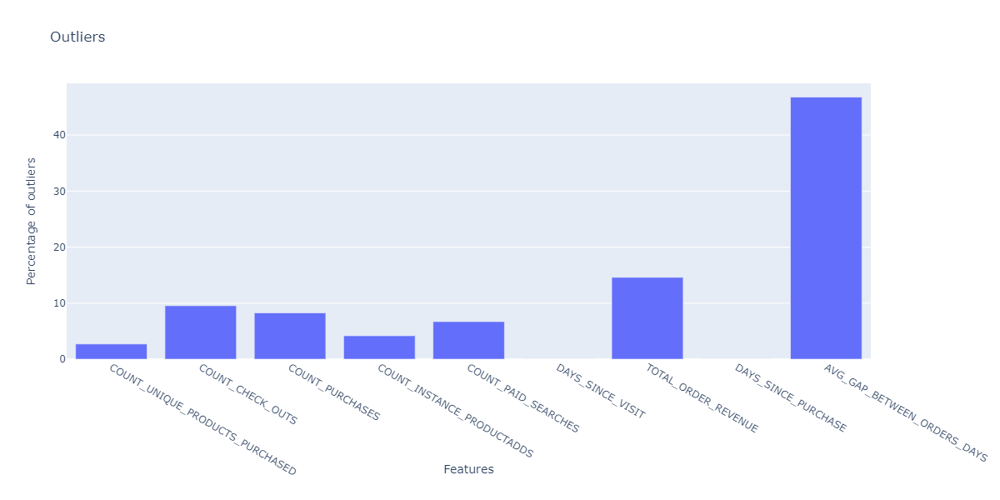
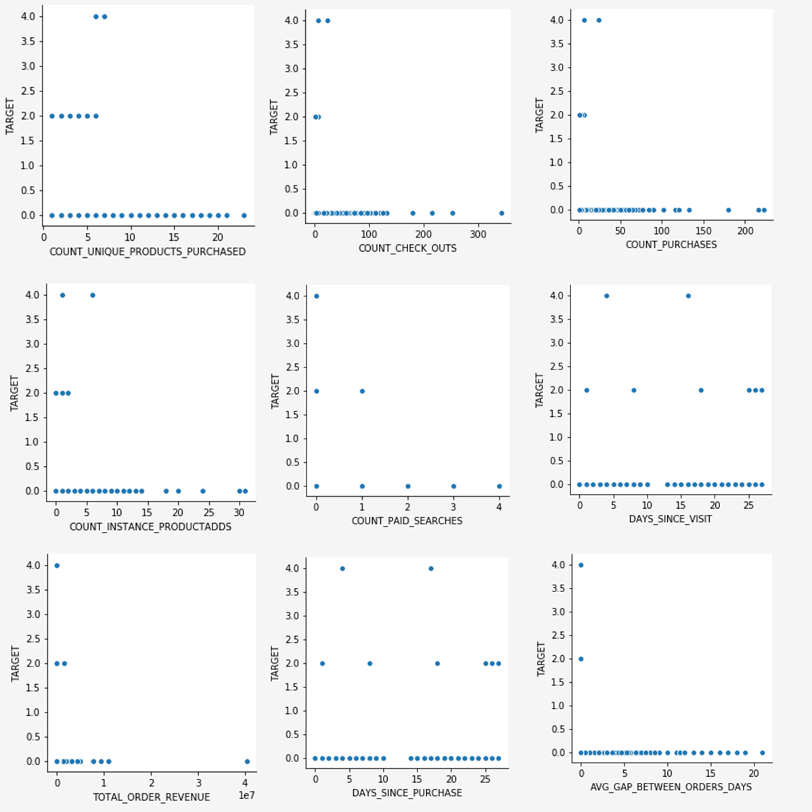

# Webbasierte Daten für Vorhersagemodelle mithilfe des Notebooks zur Datenanalyse (EDA)

Das Notebook &quot;Exploratory Data Analysis&quot;(EDA) soll Ihnen dabei helfen, Datenmuster zu erkennen, die Datensicherheit zu überprüfen und die relevanten Daten für Vorhersagemodelle zusammenzufassen.

Das EDA Notebook-Beispiel wurde mit Blick auf webbasierte Daten optimiert und besteht aus zwei Teilen. Teil 1 beginnt mit der Verwendung von Query Service zum Anzeigen von Trends und Daten-Momentaufnahmen. Als Nächstes werden die Daten mit dem Ziel der explorativen Datenanalyse auf Profil- und Besucherebene aggregiert.

Teil 2 beginnt mit der deskriptiven Analyse aggregierter Daten mithilfe von Python-Bibliotheken. Dieses Notebook enthält Visualisierungen wie Histogramme, Streudiagramme, Box-Diagramme und eine Korrelationsmatrix, um praktische Einblicke zu erhalten, mit denen bestimmt wird, welche Funktionen bei der Vorhersage eines Ziels am ehesten hilfreich sein dürften.

## Erste Schritte

Bevor Sie dieses Handbuch lesen, lesen Sie bitte die [[!DNL JupyterLab] Benutzerhandbuch](./overview.md) für eine Einführung auf hoher Ebene in [!DNL JupyterLab] und seiner Rolle in Data Science Workspace. Wenn Sie außerdem Ihre eigenen Daten verwenden, lesen Sie bitte die Dokumentation für [Datenzugriff in [!DNL Jupyterlab] Notebooks](./access-notebook-data.md). Dieses Handbuch enthält wichtige Informationen zu Einschränkungen für Notebook-Daten.

Dieses Notebook verwendet einen Midvalues-Datensatz in Form von Adobe Analytics-Erlebnisereignisdaten aus Analytics Analysis Workspace. Um das EDA-Notebook zu verwenden, müssen Sie Ihre Datentabelle mit den folgenden Werten definieren `target_table` und `target_table_id`. Es können beliebige Midvalues-Datensätze verwendet werden.

Um diese Werte zu finden, führen Sie die Schritte aus, die im Abschnitt [Schreiben in einen Datensatz in Python](./access-notebook-data.md#write-python) Abschnitt des JupyterLab-Datenzugriffshandbuchs. Der Datensatzname (`target_table`) befindet sich im Datensatzverzeichnis. Sobald Sie mit der rechten Maustaste auf den Datensatz klicken, um Daten in ein Notebook zu untersuchen oder zu schreiben, wird eine Datensatz-ID (`target_table_id`) wird im ausführbaren Code-Eintrag bereitgestellt.

## Datenerkennung

Dieser Abschnitt enthält Konfigurationsschritte und Beispielabfragen, mit denen Trends wie die &quot;Top zehn Städte nach Benutzeraktivität&quot;oder &quot;Top zehn angezeigte Produkte&quot;angezeigt werden.

### Konfiguration von Bibliotheken

JupyterLab unterstützt mehrere Bibliotheken. Der folgende Code kann eingefügt und in eine Code-Zelle ausgeführt werden, um alle in diesem Beispiel verwendeten erforderlichen Pakete zu erfassen und zu installieren. Sie können außerhalb dieses Beispiels zusätzliche oder alternative Packages für Ihre eigene Datenanalyse verwenden. Für eine Liste der unterstützten Pakete kopieren und einfügen `!pip list --format=columns` in eine neue Zelle ein.

```python
!pip install colorama
import chart_studio.plotly as py
import plotly.graph_objs as go
from plotly.offline import iplot
from scipy import stats
import numpy as np
import warnings
warnings.filterwarnings('ignore')
from scipy.stats import pearsonr
import matplotlib.pyplot as plt
from scipy.stats import pearsonr
import pandas as pd
import math
import re
import seaborn as sns
from datetime import datetime
import colorama
from colorama import Fore, Style
pd.set_option('display.max_columns', None)
pd.set_option('display.max_rows', None)
pd.set_option('display.width', 1000)
pd.set_option('display.expand_frame_repr', False)
pd.set_option('display.max_colwidth', -1)
```

### Verbindung zu Adobe Experience Platform herstellen [!DNL Query Service]

[!DNL JupyterLab] In Platform können Sie SQL in einer [!DNL Python] Notebook für den Datenzugriff über [Query Service](https://docs.adobe.com/content/help/de-DE/experience-platform/query/home.html). Zugriff auf Daten über [!DNL Query Service] kann aufgrund der kürzeren Ausführungszeiten bei der Verarbeitung großer Datensätze nützlich sein. Beachten Sie, dass die Datenabfrage mithilfe von [!DNL Query Service] hat eine Verarbeitungszeitbeschränkung von zehn Minuten.

Vor der Verwendung von [!DNL Query Service] in [!DNL JupyterLab], stellen Sie sicher, dass Sie ein Verständnis der [[!DNL Query Service] SQL-Syntax](https://docs.adobe.com/content/help/de-DE/experience-platform/query/home.html#!api-specification/markdown/narrative/technical_overview/query-service/sql/syntax.md).

Um Query Service in JupyterLab zu nutzen, müssen Sie zunächst eine Verbindung zwischen Ihrem ausgeführten Python-Notebook und Query Service herstellen. Dies kann durch Ausführen der folgenden Zelle erreicht werden.

```python
qs_connect()
```

### Datensatz mit Mittelwerten für die Exploration definieren

Um Daten abfragen und analysieren zu können, muss eine Tabelle mit midvalues-Datensätzen bereitgestellt werden. Kopieren und ersetzen Sie die `table_name` und `table_id` -Werte mit Ihren eigenen Datentabellenwerten.

```python
target_table = "table_name"
target_table_id = "table_id"
```

Nach Abschluss sollte diese Zelle dem folgenden Beispiel ähneln:

```python
target_table = "cross_industry_demo_midvalues"
target_table_id = "5f7c40ef488de5194ba0157a"
```

### Datensatz für verfügbare Daten durchsuchen

Mithilfe der unten angegebenen Zelle können Sie den in der Tabelle erfassten Datumsbereich anzeigen. Die Untersuchung der Anzahl der Tage, des ersten Datums und des letzten Datums dient der Auswahl eines Datumsbereichs für die weitere Analyse.

```python
%%read_sql -c QS_CONNECTION
SELECT distinct Year(timestamp) as Year, Month(timestamp) as Month, count(distinct DAY(timestamp)) as Count_days, min(DAY(timestamp)) as First_date, max(DAY(timestamp)) as Last_date, count(timestamp) as Count_hits
from {target_table}
group by Month(timestamp), Year(timestamp)
order by Year, Month;
```

Beim Ausführen der Zelle wird die folgende Ausgabe erzeugt:


### Datum für die Erkennung von Datensätzen konfigurieren

Nachdem Sie die verfügbaren Daten für die Datensatzerkennung ermittelt haben, müssen die folgenden Parameter aktualisiert werden. Die in dieser Zelle konfigurierten Daten werden nur zur Datenerkennung in Form von Abfragen verwendet. Die Daten werden später in diesem Handbuch erneut in geeignete Bereiche für die Analyse von Forschungsdaten aktualisiert.

```python
target_year = "2020" ## The target year
target_month = "02" ## The target month
target_day = "(01,02,03)" ## The target days
```

### Datensatz-Erkennung

Nachdem Sie alle Parameter konfiguriert haben, starten Sie [!DNL Query Service]und über einen Datumsbereich verfügen, können Sie mit dem Lesen von Datenzeilen beginnen. Sie sollten die Anzahl der Zeilen begrenzen, die Sie lesen.

```python
from platform_sdk.dataset_reader import DatasetReader
from datetime import date
dataset_reader = DatasetReader(PLATFORM_SDK_CLIENT_CONTEXT, dataset_id=target_table_id)
# If you do not see any data or would like to expand the default date range, change the following query
Table = dataset_reader.limit(5).read()
```

Verwenden Sie die folgende Zelle, um die Anzahl der im Datensatz verfügbaren Spalten anzuzeigen:

```python
print("\nNumber of columns:",len(Table.columns))
```

Verwenden Sie die folgende Zelle, um die Zeilen des Datensatzes anzuzeigen. In diesem Beispiel ist die Anzahl der Zeilen auf fünf begrenzt.

```python
Table.head(5)
```


Sobald Sie wissen, welche Daten im Datensatz enthalten sind, kann es nützlich sein, den Datensatz weiter aufzuschlüsseln. In diesem Beispiel werden die Spaltennamen und Datentypen für jede Spalte aufgelistet, während die Ausgabe verwendet wird, um zu überprüfen, ob der Datentyp korrekt ist oder nicht.

```python
ColumnNames_Types = pd.DataFrame(Table.dtypes)
ColumnNames_Types = ColumnNames_Types.reset_index()
ColumnNames_Types.columns = ["Column_Name", "Data_Type"]
ColumnNames_Types
```


### Dataset-Trendforschung

Der folgende Abschnitt enthält vier Beispielabfragen, mit denen Trends und Muster in Daten untersucht werden. Die folgenden Beispiele sind nicht vollständig, decken jedoch einige der am häufigsten betrachteten Funktionen ab.

**Stündliche Aktivitätsanzahl für einen bestimmten Tag**

Diese Abfrage analysiert die Anzahl der Aktionen und Klicks über den ganzen Tag. Die Ausgabe wird in Form einer Tabelle mit Metriken zur Aktivitätsanzahl für jede Stunde des Tages dargestellt.

```sql
%%read_sql query_2_df -c QS_CONNECTION

SELECT Substring(timestamp, 12, 2)                        AS Hour, 
       Count(enduserids._experience.aaid.id) AS Count 
FROM   {target_table}
WHERE  Year(timestamp) = {target_year} 
       AND Month(timestamp) = {target_month}  
       AND Day(timestamp) in {target_day}
GROUP  BY Hour
ORDER  BY Hour;
```


Nach Bestätigung der Funktion der Abfrage können die Daten in einem einheitlichen Zeichensatz-Histogramm dargestellt werden, um die visuelle Klarheit zu verbessern.

```python
trace = go.Bar(
    x = query_2_df['Hour'],
    y = query_2_df['Count'],
    name = "Activity Count"
)

layout = go.Layout(
    title = 'Activity Count by Hour of Day',
    width = 1200,
    height = 600,
    xaxis = dict(title = 'Hour of Day'),
    yaxis = dict(title = 'Count')
)

fig = go.Figure(data = [trace], layout = layout)
iplot(fig)
```


**Top 10 der angezeigten Seiten für einen bestimmten Tag**

Diese Abfrage analysiert, welche Seiten an einem bestimmten Tag am häufigsten angezeigt wurden. Die Ausgabe wird in Form einer Tabelle dargestellt, die Metriken zum Seitennamen und zur Anzahl der Seitenansichten enthält.

```sql
%%read_sql query_4_df -c QS_CONNECTION

SELECT web.webpagedetails.name                 AS Page_Name, 
       Sum(web.webpagedetails.pageviews.value) AS Page_Views 
FROM   {target_table}
WHERE  Year(timestamp) = {target_year}
       AND Month(timestamp) = {target_month}
       AND Day(timestamp) in {target_day}
GROUP  BY web.webpagedetails.name 
ORDER  BY page_views DESC 
LIMIT  10;
```

Nach Bestätigung der Funktion der Abfrage können die Daten in einem einheitlichen Zeichensatz-Histogramm dargestellt werden, um die visuelle Klarheit zu verbessern.

```python
trace = go.Bar(
    x = query_4_df['Page_Name'],
    y = query_4_df['Page_Views'],
    name = "Page Views"
)

layout = go.Layout(
    title = 'Top Ten Viewed Pages For a Given Day',
    width = 1000,
    height = 600,
    xaxis = dict(title = 'Page_Name'),
    yaxis = dict(title = 'Page_Views')
)

fig = go.Figure(data = [trace], layout = layout)
iplot(fig)
```


**Top 10 Städte nach Benutzeraktivität gruppiert**

Diese Abfrage analysiert, aus welchen Städten die Daten stammen.

```sql
%%read_sql query_6_df -c QS_CONNECTION

SELECT concat(placeContext.geo.stateProvince, ' - ', placeContext.geo.city) AS state_city, 
       Count(timestamp)                                                     AS Count
FROM   {target_table}
WHERE  Year(timestamp) = {target_year}
       AND Month(timestamp) = {target_month}
       AND Day(timestamp) in {target_day}
GROUP  BY state_city
ORDER  BY Count DESC
LIMIT  10;
```

Nach Bestätigung der Funktion der Abfrage können die Daten in einem einheitlichen Zeichensatz-Histogramm dargestellt werden, um die visuelle Klarheit zu verbessern.

```python
trace = go.Bar(
    x = query_6_df['state_city'],
    y = query_6_df['Count'],
    name = "Activity by City"
)

layout = go.Layout(
    title = 'Top Ten Cities by User Activity',
    width = 1200,
    height = 600,
    xaxis = dict(title = 'City'),
    yaxis = dict(title = 'Count')
)

fig = go.Figure(data = [trace], layout = layout)
iplot(fig)
```


**Die zehn häufigsten angezeigten Produkte**

Diese Abfrage enthält eine Liste der zehn am häufigsten angezeigten Produkte. Im folgenden Beispiel wird die Variable `Explode()` -Funktion wird verwendet, um jedes Produkt im `productlistitems` -Objekt in eine eigene Zeile. Auf diese Weise können Sie eine verschachtelte Abfrage ausführen, um Produktansichten für verschiedene SKUs zu aggregieren.

```sql
%%read_sql query_7_df -c QS_CONNECTION

SELECT Product_List_Items.sku AS Product_SKU,
       Sum(Product_Views) AS Total_Product_Views
FROM  (SELECT Explode(productlistitems) AS Product_List_Items, 
              commerce.productviews.value   AS Product_Views 
       FROM   {target_table}
       WHERE  Year(timestamp) = {target_year}
              AND Month(timestamp) = {target_month}
              AND Day(timestamp) in {target_day}
              AND commerce.productviews.value IS NOT NULL) 
GROUP BY Product_SKU 
ORDER BY Total_Product_Views DESC
LIMIT  10;
```

Nach Bestätigung der Funktion der Abfrage können die Daten in einem einheitlichen Zeichensatz-Histogramm dargestellt werden, um die visuelle Klarheit zu verbessern.

```python
trace = go.Bar(
    x = "SKU-" + query_7_df['Product_SKU'],
    y = query_7_df['Total_Product_Views'],
    name = "Product View"
)

layout = go.Layout(
    title = 'Top Ten Viewed Products',
    width = 1200,
    height = 600,
    xaxis = dict(title = 'SKU'),
    yaxis = dict(title = 'Product View Count')
)

fig = go.Figure(data = [trace], layout = layout)
iplot(fig)
```


Nachdem Sie die Trends und Muster der Daten untersucht haben, sollten Sie eine gute Vorstellung davon haben, welche Funktionen Sie für die Vorhersage eines Ziels erstellen möchten. Beim Durchblättern von Tabellen kann die Form jedes Datenattributs, offensichtliche Fehldarstellungen und große Ausreißer in den Werten schnell hervorgehoben werden. Außerdem können Sie damit beginnen, Beziehungen zwischen den Attributen vorzuschlagen, um diese zu untersuchen.

## Analyse der Versuchsdaten

Die Analyse von Explorationsdaten wird verwendet, um Ihr Verständnis der Daten zu verfeinern und eine Intuition für überzeugende Fragen zu erstellen, die als Grundlage für Ihre Modellierung verwendet werden können.

Nachdem Sie den Schritt zur Datenerkennung abgeschlossen haben, haben Sie auf Ereignisebene Daten mit einigen Aggregationen auf Ereignis-, Stadt- oder Benutzer-ID-Ebene untersucht, um Trends für einen Tag anzuzeigen. Diese Daten sind zwar wichtig, geben aber kein vollständiges Bild. Sie verstehen immer noch nicht, was einen Kauf auf Ihrer Website auslöst.

Um dies zu verstehen, müssen Sie Daten auf Profil-/Besucherebene aggregieren, ein Kaufziel definieren und statistische Konzepte wie Korrelation, Box-Diagramme und Streudiagramme anwenden. Diese Methoden werden verwendet, um die Aktivitätsmuster von Käufern und Nicht-Käufern im von Ihnen definierten Prognosefenster zu vergleichen.

Die folgenden Funktionen werden in diesem Abschnitt erstellt und untersucht:

- `COUNT_UNIQUE_PRODUCTS_PURCHASED`: Die Anzahl der gekauften Einzelprodukte.
- `COUNT_CHECK_OUTS`: Die Anzahl der Kassengänge.
- `COUNT_PURCHASES`: Die Anzahl der Käufe.
- `COUNT_INSTANCE_PRODUCTADDS`: Die Anzahl der Produktadd-Instanzen.
- `NUMBER_VISITS`: Die Anzahl der Besuche.
- `COUNT_PAID_SEARCHES`: Die Anzahl der gebührenpflichtigen Suchvorgänge.
- `DAYS_SINCE_VISIT`: Die Anzahl der Tage seit dem letzten Besuch.
- `TOTAL_ORDER_REVENUE`: Der Gesamtbestellumsatz.
- `DAYS_SINCE_PURCHASE`: Die Anzahl der Tage seit dem vorherigen Kauf.
- `AVG_GAP_BETWEEN_ORDERS_DAYS`: Die durchschnittliche Lücke zwischen Käufen in Tagen.
- `STATE_CITY`: Enthält den Staat und die Stadt.

Bevor Sie mit der Datenaggregation fortfahren, müssen Sie die Parameter für die Vorhersagevariable definieren, die in der explorativen Datenanalyse verwendet wird. Mit anderen Worten, was möchten Sie von Ihrem Datenwissenschaftsmodell? Zu den gebräuchlichen Parametern gehören ein Ziel, ein Prognosezeitraum und ein Analysezeitraum.

Wenn Sie das EDA-Notebook verwenden, müssen Sie die unten stehenden Werte ersetzen, bevor Sie fortfahren.

```python
goal = "commerce.`order`.purchaseID" #### prediction variable
goal_column_type = "numerical" #### choose either "categorical" or "numerical"
prediction_window_day_start = "2020-01-01" #### YYYY-MM-DD
prediction_window_day_end = "2020-01-31" #### YYYY-MM-DD
analysis_period_day_start = "2020-02-01" #### YYYY-MM-DD
analysis_period_day_end = "2020-02-28" #### YYYY-MM-DD

### If the goal is a categorical goal then select threshold for the defining category and creating bins. 0 is no order placed, and 1 is at least one order placed:
threshold = 1
```

### Datenaggregation für die Erstellung von Funktionen und Zielen

Um mit der explorativen Analyse zu beginnen, müssen Sie ein Ziel auf Profilebene erstellen und dann Ihren Datensatz aggregieren. In diesem Beispiel werden zwei Abfragen bereitgestellt. Die erste Abfrage enthält die Erstellung eines Ziels. Die zweite Abfrage muss dahingehend aktualisiert werden, dass sie alle anderen Variablen als die in der ersten Abfrage enthält. Sie können die `limit` für Ihre Abfrage. Nach Durchführung der folgenden Abfragen stehen nun aggregierte Daten zur Exploration zur Verfügung.

```sql
%%read_sql target_df -d -c QS_CONNECTION

SELECT DISTINCT endUserIDs._experience.aaid.id                  AS ID,
       Count({goal})                                            AS TARGET
FROM   {target_table}
WHERE DATE(TIMESTAMP) BETWEEN '{prediction_window_day_start}' AND '{prediction_window_day_end}'
GROUP BY endUserIDs._experience.aaid.id;
```

```sql
%%read_sql agg_data -d -c QS_CONNECTION

SELECT z.*, z1.state_city as STATE_CITY
from
((SELECT y.*,a2.AVG_GAP_BETWEEN_ORDERS_DAYS as AVG_GAP_BETWEEN_ORDERS_DAYS
from
(select a1.*, f.DAYS_SINCE_PURCHASE as DAYS_SINCE_PURCHASE
from
(SELECT DISTINCT a.ID  AS ID,
COUNT(DISTINCT Product_Items.SKU) as COUNT_UNIQUE_PRODUCTS_PURCHASED,
COUNT(a.check_out) as COUNT_CHECK_OUTS,
COUNT(a.purchases) as COUNT_PURCHASES, 
COUNT(a.product_list_adds) as COUNT_INSTANCE_PRODUCTADDS,
sum(CASE WHEN a.search_paid = 'TRUE' THEN 1 ELSE 0 END) as COUNT_PAID_SEARCHES,
DATEDIFF('{analysis_period_day_end}', MAX(a.date_a)) as DAYS_SINCE_VISIT,
ROUND(SUM(Product_Items.priceTotal * Product_Items.quantity), 2) AS TOTAL_ORDER_REVENUE
from 
(SELECT endUserIDs._experience.aaid.id as ID,
commerce.`checkouts`.value as check_out,
commerce.`order`.purchaseID as purchases, 
commerce.`productListAdds`.value as product_list_adds,
search.isPaid as search_paid,
DATE(TIMESTAMP) as date_a,
Explode(productlistitems) AS Product_Items
from {target_table}
Where DATE(TIMESTAMP) BETWEEN '{analysis_period_day_start}' AND '{analysis_period_day_end}') as a
group by a.ID) as a1
left join 
(SELECT DISTINCT endUserIDs._experience.aaid.id as ID,
DATEDIFF('{analysis_period_day_end}', max(DATE(TIMESTAMP))) as DAYS_SINCE_PURCHASE
from {target_table}
where DATE(TIMESTAMP) BETWEEN '{analysis_period_day_start}' AND '{analysis_period_day_end}'
and commerce.`order`.purchaseid is not null
GROUP BY endUserIDs._experience.aaid.id) as f
on f.ID = a1.ID
where a1.COUNT_PURCHASES>0) as y
left join
(select ab.ID, avg(DATEDIFF(ab.ORDER_DATES, ab.PriorDate)) as AVG_GAP_BETWEEN_ORDERS_DAYS
from
(SELECT distinct endUserIDs._experience.aaid.id as ID, TO_DATE(DATE(TIMESTAMP)) as ORDER_DATES, 
TO_DATE(LAG(DATE(TIMESTAMP),1) OVER (PARTITION BY endUserIDs._experience.aaid.id ORDER BY DATE(TIMESTAMP))) as PriorDate
FROM {target_table}
where DATE(TIMESTAMP) BETWEEN '{analysis_period_day_start}' AND '{analysis_period_day_end}'
AND commerce.`order`.purchaseid is not null) AS ab
where ab.PriorDate is not null
GROUP BY ab.ID) as a2
on a2.ID = y.ID) z    
left join
(select t.ID, t.state_city from
(
SELECT DISTINCT endUserIDs._experience.aaid.id as ID,
concat(placeContext.geo.stateProvince, ' - ', placeContext.geo.city) as state_city, 
ROW_NUMBER() OVER(PARTITION BY endUserIDs._experience.aaid.id ORDER BY DATE(TIMESTAMP) DESC) AS ROWNUMBER
FROM   {target_table}
WHERE  DATE(TIMESTAMP) BETWEEN '{analysis_period_day_start}' AND '{analysis_period_day_end}') as t
where t.ROWNUMBER = 1) z1
on z.ID = z1.ID)
limit 500000;
```

### Zusammenführen der Funktionen im aggregierten Datensatz mit einem Ziel

Die folgende Zelle wird verwendet, um die im vorherigen Beispiel beschriebenen Funktionen im aggregierten Datensatz mit Ihrem Prognoseziel zusammenzuführen.

```python
Data = pd.merge(agg_data,target_df, on='ID',how='left')
Data['TARGET'].fillna(0, inplace=True)
```

Die nächsten drei Beispielzellen werden verwendet, um sicherzustellen, dass die Zusammenführung erfolgreich war.

`Data.shape` gibt die Anzahl der Spalten gefolgt von der Anzahl der Zeilen zurück, z. B.: (11913, 12).

```python
Data.shape
```

`Data.head(5)` gibt eine Tabelle mit 5 Datenzeilen zurück. Die zurückgegebene Tabelle enthält alle 12 Spalten aggregierter Daten, die einer Profil-ID zugeordnet sind.

```python
Data.head(5)
```


In dieser Zelle wird die Anzahl der eindeutigen Profile gedruckt.

```python
print("Count of unique profiles:", (len(Data)))
```

### Erkennen fehlender Werte und Ausreißer

Nachdem Sie Ihre Datenaggregation abgeschlossen und mit Ihrem Ziel zusammengeführt haben, müssen Sie die Daten überprüfen, die manchmal auch als Konsistenzprüfung bezeichnet werden.

Dieser Prozess umfasst die Identifizierung fehlender Werte und Ausreißer. Wenn Probleme erkannt werden, besteht die nächste Aufgabe darin, spezifische Strategien für deren Bewältigung zu entwickeln.

>[!NOTE]
>
>Während dieses Schritts können Sie Beschädigungen der Werte feststellen, die auf einen Fehler im Datenprotokollierungsprozess hinweisen können.

```python
Missing = pd.DataFrame(round(Data.isnull().sum()*100/len(Data),2))
Missing.columns =['Percentage_missing_values'] 
Missing['Features'] = Missing.index
```

Die folgende Zelle wird verwendet, um die fehlenden Werte zu visualisieren.

```python
trace = go.Bar(
    x = Missing['Features'],
    y = Missing['Percentage_missing_values'],
    name = "Percentage_missing_values")

layout = go.Layout(
    title = 'Missing values',
    width = 1200,
    height = 600,
    xaxis = dict(title = 'Features'),
    yaxis = dict(title = 'Percentage of missing values')
)

fig = go.Figure(data = [trace], layout = layout)
iplot(fig)
```


Nach Erkennung fehlender Werte ist es wichtig, Ausreißer zu identifizieren. Parametrische Statistiken wie Mittelwert, Standardabweichung und Korrelation sind äußerst empfindlich gegenüber Ausreißern. Darüber hinaus basieren die Annahmen gemeinsamer statistischer Verfahren wie etwa linearen Regressionen ebenfalls auf diesen Statistiken. Das bedeutet, dass Ausreißer eine Analyse wirklich vermissen können.

Um Ausreißer zu identifizieren, verwendet dieses Beispiel den Bereich zwischen Quartilen. Der Interquartilbereich (IQR) ist der Bereich zwischen dem ersten und dritten Quartil (25. und 75. Perzentil). In diesem Beispiel werden alle Datenpunkte erfasst, die entweder unter das 1,5-fache der IQR unter das 25. Perzentil fallen, oder 1,5-fache der IQR über dem 75. Perzentil. Werte, die unter diese Werte fallen, werden in der folgenden Zelle als Ausreißer definiert.

>[!TIP]
>
>Die Korrektur von Ausreißern erfordert ein Verständnis des Geschäfts und der Branche, in der Sie arbeiten. Manchmal kann man eine Beobachtung nicht fallen lassen, nur weil sie ausreißender ist. Ausreißer können legitime Beobachtungen sein und sind oft die interessantesten. Weitere Informationen zum Ablegen von Ausreißern finden Sie unter [optionaler Datenbereinigungsschritt](#optional-data-clean).

```python
TARGET = Data.TARGET

Data_numerical = Data.select_dtypes(include=['float64', 'int64'])
Data_numerical.drop(['TARGET'],axis = 1,inplace = True)
Data_numerical1 = Data_numerical

for i in range(0,len(Data_numerical1.columns)):
    Q1 = Data_numerical1.iloc[:,i].quantile(0.25)
    Q3 = Data_numerical1.iloc[:,i].quantile(0.75)
    IQR = Q3 - Q1
    Data_numerical1.iloc[:,i] = np.where(Data_numerical1.iloc[:,i]<(Q1 - 1.5 * IQR),np.nan, np.where(Data_numerical1.iloc[:,i]>(Q3 + 1.5 * IQR),
                                                                                                    np.nan,Data_numerical1.iloc[:,i]))
    
Outlier = pd.DataFrame(round(Data_numerical1.isnull().sum()*100/len(Data),2))
Outlier.columns =['Percentage_outliers'] 
Outlier['Features'] = Outlier.index   
```

Wie immer ist es wichtig, die Ergebnisse zu visualisieren.

```python
trace = go.Bar(
    x = Outlier['Features'],
    y = Outlier['Percentage_outliers'],
    name = "Percentage_outlier")

layout = go.Layout(
    title = 'Outliers',
    width = 1200,
    height = 600,
    xaxis = dict(title = 'Features'),
    yaxis = dict(title = 'Percentage of outliers')
)

fig = go.Figure(data = [trace], layout = layout)
iplot(fig)
```



### Einheitliche Analyse

Nachdem Ihre Daten auf fehlende Werte und Ausreißer korrigiert wurden, können Sie Ihre Analyse starten. Es gibt drei Arten von Analysen: Univariate-, Bivariate- und Multivarianzanalyse. Die Univariate-Analyse nimmt Daten auf, fasst sie zusammen und findet Muster in den Daten anhand einzelner Variablenbeziehungen. Die Bivariate-Analyse betrachtet mehrere Variablen auf einmal, während die Multivarianz-Analyse drei oder mehr Variablen auf einmal betrachtet.

Im folgenden Beispiel wird eine Tabelle erstellt, um die Verteilung der Funktionen zu visualisieren.

```python
Data_numerical = Data.select_dtypes(include=['float64', 'int64'])
distribution = pd.DataFrame([Data_numerical.count(),Data_numerical.mean(),Data_numerical.quantile(0), Data_numerical.quantile(0.01),
                             Data_numerical.quantile(0.05),Data_numerical.quantile(0.25), Data_numerical.quantile(0.5),
                        Data_numerical.quantile(0.75),  Data_numerical.quantile(0.95),Data_numerical.quantile(0.99), Data_numerical.max()])
distribution = distribution.T
distribution.columns = ['Count', 'Mean', 'Min', '1st_perc','5th_perc','25th_perc', '50th_perc','75th_perc','95th_perc','99th_perc','Max']
distribution
```


Sobald Sie über eine Verteilung der Funktionen verfügen, können Sie visualisierte Datendiagramme mithilfe eines Arrays erstellen. Die folgenden Zellen werden verwendet, um die obige Tabelle mit numerischen Daten zu visualisieren.

```python
A = sns.palplot(sns.color_palette("Blues"))
```

```python
for column in Data_numerical.columns[0:]:
    plt.figure(figsize=(5, 4))
    plt.ticklabel_format(style='plain', axis='y')
    sns.distplot(Data_numerical[column], color = A, kde=False, bins=6, hist_kws={'alpha': 0.4});
```


### Kategorische Daten

Kategorische Gruppierungsdaten werden verwendet, um die in den einzelnen Spalten aggregierter Daten enthaltenen Werte und deren Verteilung zu verstehen. In diesem Beispiel werden die Top-10-Kategorien verwendet, um bei der Erstellung der Verteilungen zu helfen. Beachten Sie, dass in einer Spalte Tausende einmaliger Werte enthalten sein können. Sie wollen kein überfülltes Diagramm machen, das es unleserlich macht. Mit Blick auf Ihr Geschäftsziel liefert die Gruppierung von Daten aussagekräftigere Ergebnisse.

```python
Data_categorical = Data.select_dtypes(include='object')
Data_categorical.drop(['ID'], axis = 1, inplace = True, errors = 'ignore')
```

```python
for column in Data_categorical.columns[0:]:
    if (len(Data_categorical[column].value_counts())>10):
        plt.figure(figsize=(12, 8))
        sns.countplot(x=column, data = Data_categorical, order = Data_categorical[column].value_counts().iloc[:10].index, palette="Set2");
    else:
        plt.figure(figsize=(12, 8))
        sns.countplot(x=column, data = Data_categorical, palette="Set2");
```


### Entfernen von Spalten mit nur einem eindeutigen Wert

Spalten, die nur den Wert eins aufweisen, fügen der Analyse keine Informationen hinzu und können entfernt werden.

```python
for col in Data.columns:
    if len(Data[col].unique()) == 1:
        if col == 'TARGET':
            print(Fore.RED + '\033[1m' + 'WARNING: TARGET HAS A SINGLE UNIQUE VALUE, ANY BIVARIATE ANALYSIS (NEXT STEP IN THIS NOTEBOOK) OR PREDICTION WILL BE MEANINGLESS' + Fore.RESET + '\x1b[21m')
        elif col == 'ID':
            print(Fore.RED + '\033[1m' + 'WARNING: THERE IS ONLY ONE PROFILE IN THE DATA, ANY BIVARIATE ANALYSIS (NEXT STEP IN THIS NOTEBOOK) OR PREDICTION WILL BE MEANINGLESS' + Fore.RESET + '\x1b[21m')
        else:
            print('Dropped column:',col)
            Data.drop(col,inplace=True,axis=1)
```

Nachdem Sie Einzelwertspalten entfernt haben, überprüfen Sie die übrigen Spalten auf Fehler, indem Sie die `Data.columns` in einer neuen Zelle.

### Richtig für fehlende Werte

Im folgenden Abschnitt finden Sie einige Beispielansätze zur Korrektur fehlender Werte. Ereignis obwohl in den oben genannten Daten nur eine Spalte einen fehlenden Wert enthielt, die nachfolgenden Beispielzellen korrekte Werte für alle Datentypen. Dazu gehören:

- Numerische Datentypen: Eingabe 0 oder max.
- Kategorische Datentypen: Modaleingabewert

```python
#### Select only numerical data
Data_numerical = Data.select_dtypes(include=['float64', 'int64'])

#### For columns that contain days we impute max days of history for null values, for rest all we impute 0

# Imputing days with max days of history
Days_cols = [col for col in Data_numerical.columns if 'DAYS_' in col]
d1 = datetime.strptime(analysis_period_day_start, "%Y-%m-%d")
d2 = datetime.strptime(analysis_period_day_end, "%Y-%m-%d")
A = abs((d2 - d1).days)

for column in Days_cols:
    Data[column].fillna(A, inplace=True)

# Imputing 0
Data_numerical = Data.select_dtypes(include=['float64', 'int64'])
Missing_numerical = Data_numerical.columns[Data_numerical.isnull().any()].tolist()

for column in Missing_numerical:
    Data[column].fillna(0, inplace=True)
```

```python
#### Correct for missing values in categorical columns (Replace with mode)
Data_categorical = Data.select_dtypes(include='object')
Missing_cat = Data_categorical.columns[Data_categorical.isnull().any()].tolist() 
for column in Missing_cat:
    Data[column].fillna(Data[column].mode()[0], inplace=True)
```

Sobald die sauberen Daten fertig sind, können sie analysiert werden.

### Bivariate-Analyse

Die Bivariate-Analyse wird verwendet, um die Beziehung zwischen zwei Wertesätzen zu verstehen, z. B. Ihren Funktionen und einer Zielvariablen. Da verschiedene Diagramme kategorischen und numerischen Datentypen entsprechen, sollte diese Analyse für jeden Datentyp separat durchgeführt werden. Die folgenden Diagramme werden für die bivariate-Analyse empfohlen:

- **Korrelation**: Ein Korrelationskoeffizient ist der Messwert der Stärke einer Beziehung zwischen zwei Eigenschaften. Die Korrelation weist Werte zwischen -1 und 1 auf, wobei: 1 steht für eine starke positive Beziehung, -1 für eine starke negative Beziehung und ein Ergebnis von null zeigt überhaupt keine Beziehung an.
- **Peildiagramm**: Paardiagramme sind eine einfache Möglichkeit, Beziehungen zwischen den einzelnen Variablen zu visualisieren. Es erzeugt eine Matrix von Beziehungen zwischen den einzelnen Variablen in den Daten.
- **Heatmap**: Heatmaps sind der Korrelationskoeffizient für alle Variablen im Datensatz.
- **Feldflächen**: Box-Diagramme sind eine standardisierte Methode zur Anzeige der Datenverteilung basierend auf einer Fünf-Zahlen-Zusammenfassung (Minimum, First Quartile (Q1), Median, drittes Quartil (Q3) und Maximum).
- **Zählung**: Ein Zähldiagramm ist wie ein Histogramm oder ein Balkendiagramm für einige kategorische Merkmale. Sie zeigt die Anzahl der Vorkommnisse eines Elements basierend auf einem bestimmten Typ von Kategorie an.

Um die Beziehung zwischen der &quot;Ziel&quot;-Variablen und den Prädiktoren/Funktionen zu verstehen, werden Diagramme basierend auf Datentypen verwendet. Für numerische Merkmale sollten Sie ein Box-Diagramm verwenden, wenn die &#39;Ziel&#39;-Variable kategorisch ist, sowie ein paarweise und heatmap , wenn die &#39;Ziel&#39;-Variable numerisch ist.

Für kategorische Merkmale sollten Sie einen Countplot verwenden, wenn die &#39;Ziel&#39;-Variable kategorisch ist, sowie einen Box-Diagramm, wenn die &#39;Ziel&#39;-Variable numerisch ist. Die Verwendung dieser Methoden hilft beim Verständnis von Beziehungen. Diese Beziehungen können in Form von Funktionen, Prognosen und Zielen erfolgen.

**Numerische Eigenschaften**

```python
if len(Data) == 1:
    print(Fore.RED + '\033[1m' + 'THERE IS ONLY ONE PROFILE IN THE DATA, BIVARIATE ANALYSIS IS NOT APPLICABLE, PLEASE INCLUDE AT LEAST ONE MORE PROFILE TO DO BIVARIATE ANALYSIS')
elif len(Data['TARGET'].unique()) == 1:
    print(Fore.RED + '\033[1m' + 'TARGET HAS A SINGLE UNIQUE VALUE, BIVARIATE ANALYSIS IS NOT APPLICABLE, PLEASE INCLUDE PROFILES WITH ATLEAST ONE DIFFERENT VALUE OF TARGET TO DO BIVARIATE ANALYSIS')
else:
    if (goal_column_type == "categorical"):
        TARGET_categorical = pd.DataFrame(np.where(TARGET>=threshold,"1","0"))
        TARGET_categorical.rename(columns={TARGET_categorical.columns[0]: "TARGET_categorical" }, inplace = True)
        Data_numerical = Data.select_dtypes(include=['float64', 'int64'])
        Data_numerical.drop(['TARGET'],inplace=True,axis=1)
        Data_numerical = pd.concat([Data_numerical, TARGET_categorical.astype(int)], axis = 1)
        ncols_for_charts = len(Data_numerical.columns)-1
        nrows_for_charts = math.ceil(ncols_for_charts/4)
        fig, axes = plt.subplots(nrows=nrows_for_charts, ncols=4, figsize=(18, 15))
        for idx, feat in enumerate(Data_numerical.columns[:-1]):
            ax = axes[int(idx // 4), idx % 4]
            sns.boxplot(x='TARGET_categorical', y=feat, data=Data_numerical, ax=ax)
            ax.set_xlabel('')
            ax.set_ylabel(feat)
            fig.tight_layout();
    else:
        Data_numerical = Data.select_dtypes(include=['float64', 'int64'])
        TARGET = pd.DataFrame(Data_numerical.TARGET)
        Data_numerical = Data.select_dtypes(include=['float64', 'int64'])
        Data_numerical.drop(['TARGET'],inplace=True,axis=1)
        Data_numerical = pd.concat([Data_numerical, TARGET.astype(int)], axis = 1)
        for i in Data_numerical.columns[:-1]:
            sns.pairplot(x_vars=i, y_vars=['TARGET'], data=Data_numerical, height = 4)
        f, ax = plt.subplots(figsize = (10,8))
        corr = Data_numerical.corr()
```

Das Ausführen der Zelle erzeugt die folgenden Ausgaben:




**Kategorische Eigenschaften**

Das folgende Beispiel wird verwendet, um die Häufigkeitsangaben für die 10 wichtigsten Kategorien jeder kategorischen Variablen darzustellen und anzuzeigen.

```python
if len(Data) == 1:
    print(Fore.RED + '\033[1m' + 'THERE IS ONLY ONE PROFILE IN THE DATA, BIVARIATE ANALYSIS IS NOT APPLICABLE, PLEASE INCLUDE AT LEAST ONE MORE PROFILE TO DO BIVARIATE ANALYSIS')
elif len(Data['TARGET'].unique()) == 1:
    print(Fore.RED + '\033[1m' + 'TARGET HAS A SINGLE UNIQUE VALUE, BIVARIATE ANALYSIS IS NOT APPLICABLE, PLEASE INCLUDE PROFILES WITH ATLEAST ONE DIFFERENT VALUE OF TARGET TO DO BIVARIATE ANALYSIS')
else:
    if (goal_column_type == "categorical"):
        TARGET_categorical = pd.DataFrame(np.where(TARGET>=threshold,"1","0"))
        TARGET_categorical.rename(columns={TARGET_categorical.columns[0]: "TARGET_categorical" }, inplace = True)
        Data_categorical = Data.select_dtypes(include='object')
        Data_categorical.drop(["ID"], axis =1, inplace = True)
        Cat_columns = Data_categorical
        Data_categorical = pd.concat([TARGET_categorical,Data_categorical], axis =1)
        for column in Cat_columns.columns:
            A = Data_categorical[column].value_counts().iloc[:10].index
            Data_categorical1 = Data_categorical[Data_categorical[column].isin(A)]
            plt.figure(figsize=(12, 8))
            sns.countplot(x="TARGET_categorical",hue=column, data = Data_categorical1, palette = 'Blues')
            plt.xlabel("GOAL")
            plt.ylabel("COUNT")
            plt.show();
    else:
        Data_categorical = Data.select_dtypes(include='object')
        Data_categorical.drop(["ID"], axis =1, inplace = True)
        Target = Data.TARGET
        Data_categorical = pd.concat([Data_categorical,Target], axis =1)
        for column in Data_categorical.columns[:-1]:
            A = Data_categorical[column].value_counts().iloc[:10].index
            Data_categorical1 = Data_categorical[Data_categorical[column].isin(A)]
            sns.catplot(x=column, y="TARGET", kind = "boxen", data =Data_categorical1, height=5, aspect=13/5);
```

Beim Ausführen der Zelle wird die folgende Ausgabe erzeugt:


### Wichtige numerische Funktionen

Mithilfe der Korrelationsanalyse können Sie eine Liste der zehn wichtigsten numerischen Merkmale erstellen. Diese Funktionen können alle verwendet werden, um die Funktion &quot;Ziel&quot;vorherzusagen. Diese Liste kann als Funktionsliste für verwendet werden, wenn Sie mit der Erstellung Ihres Modells beginnen.

```python
if len(Data) == 1:
    print(Fore.RED + '\033[1m' + 'THERE IS ONLY ONE PROFILE IN THE DATA, BIVARIATE ANALYSIS IS NOT APPLICABLE, PLEASE INCLUDE AT LEAST ONE MORE PROFILE TO FIND IMPORTANT VARIABLES')
elif len(Data['TARGET'].unique()) == 1:
    print(Fore.RED + '\033[1m' + 'TARGET HAS A SINGLE UNIQUE VALUE, BIVARIATE ANALYSIS IS NOT APPLICABLE, PLEASE INCLUDE PROFILES WITH ATLEAST ONE DIFFERENT VALUE OF TARGET TO FIND IMPORTANT VARIABLES')
else:
    Data_numerical = Data.select_dtypes(include=['float64', 'int64'])
    Correlation = pd.DataFrame(Data_numerical.drop("TARGET", axis=1).apply(lambda x: x.corr(Data_numerical.TARGET)))
    Correlation['Corr_abs'] = abs(Correlation)
    Correlation = Correlation.sort_values(by = 'Corr_abs', ascending = False)
    Imp_features = pd.DataFrame(Correlation.index[0:10])
    Imp_features.rename(columns={0:'Important Feature'}, inplace=True)
    print(Imp_features)
```


### Beispielinhalt

Während Sie Ihre Daten analysieren, ist es nicht ungewöhnlich, Einblicke zu finden. Das folgende Beispiel zeigt einen Einblick, der die Neuigkeit und den Geldwert für ein Zielereignis zuordnet.

```python
# Proxy for monetary value is TOTAL_ORDER_REVENUE and proxy for frequency is NUMBER_VISITS
if len(Data) == 1:
    print(Fore.RED + '\033[1m' + 'THERE IS ONLY ONE PROFILE IN THE DATA, INSIGHTS ANALYSIS IS NOT APPLICABLE, PLEASE INCLUDE AT LEAST ONE MORE PROFILE TO FIND IMPORTANT VARIABLES')
elif len(Data['TARGET'].unique()) == 1:
    print(Fore.RED + '\033[1m' + 'TARGET HAS A SINGLE UNIQUE VALUE, INSIGHTS ANALYSIS IS NOT APPLICABLE, PLEASE INCLUDE PROFILES WITH ATLEAST ONE DIFFERENT VALUE OF TARGET TO FIND IMPORTANT VARIABLES')
else:
    sns.lmplot("DAYS_SINCE_VISIT", "TOTAL_ORDER_REVENUE", Data, hue="TARGET", fit_reg=False);
```


## Optionaler Datenbereinigungsschritt {#optional-data-clean}

Die Korrektur von Ausreißern erfordert ein Verständnis des Geschäfts und der Branche, in der Sie arbeiten. Manchmal kann man eine Beobachtung nicht fallen lassen, nur weil sie ausreißender ist. Ausreißer können legitime Beobachtungen sein und sind oft die interessantesten.

Weitere Informationen zu Ausreißern und dazu, ob sie abgelegt werden sollen oder nicht, finden Sie in diesem Eintrag im [Analysefaktor](https://www.theanalysisfactor.com/outliers-to-drop-or-not-to-drop/).

Im folgenden Beispiel werden Datenpunkte in Zellen, die Ausreißer sind, mithilfe von [Interquartilbereich](https://www.thoughtco.com/what-is-the-interquartile-range-rule-3126244).

```python
TARGET = Data.TARGET

Data_numerical = Data.select_dtypes(include=['float64', 'int64'])
Data_numerical.drop(['TARGET'],axis = 1,inplace = True)

for i in range(0,len(Data_numerical.columns)):
    Q1 = Data_numerical.iloc[:,i].quantile(0.25)
    Q3 = Data_numerical.iloc[:,i].quantile(0.75)
    IQR = Q3 - Q1
    Data_numerical.iloc[:,i] = np.where(Data_numerical.iloc[:,i]<(Q1 - 1.5 * IQR), (Q1 - 1.5 * IQR), np.where(Data_numerical.iloc[:,i]>(Q3 + 1.5 * IQR),
                                                                                                     (Q3 + 1.5 * IQR),Data_numerical.iloc[:,i]))
Data_categorical = Data.select_dtypes(include='object')
Data = pd.concat([Data_categorical, Data_numerical, TARGET], axis = 1)
```

## Nächste Schritte

Nachdem Sie die explorative Datenanalyse abgeschlossen haben, können Sie mit der Erstellung eines Modells beginnen. Alternativ können Sie die von Ihnen abgeleiteten Daten und Erkenntnisse verwenden, um ein Dashboard mit Tools wie Power BI zu erstellen.

Adobe Experience Platform unterteilt den Modellerstellungsprozess in zwei unterschiedliche Phasen: Rezepte (eine Modellinstanz) und Modelle. Um mit der Rezepterstellung zu beginnen, lesen Sie die Dokumentation für [Erstellen eines Rezepts in JupyerLab Notebooks](./create-a-model.md). Dieses Dokument enthält Informationen und Beispiele zum Erstellen, Trainieren und Scoring, einem Rezept in [!DNL JupyterLab] Notebooks.
