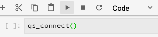

# Abfrage-Service für Jupyter-Notebooks

Mit Adobe Experience Platform können Sie SQL (Structured Abfrage Language) in Data Science Workspace verwenden, indem Sie Abfrage Service als Standardfunktion in JupyterLab integrieren.

In diesem Lernprogramm werden Beispiele von SQL-Abfragen für gängige Anwendungsfälle zur Untersuchung, Transformation und Analyse von Adobe Analytics-Daten vorgestellt.

## Erste Schritte

Bevor Sie dieses Lernprogramm starten, müssen Sie über die folgenden Voraussetzungen verfügen:

- Zugriff auf Adobe Experience Platform Wenn Sie keinen Zugriff auf eine IMS-Organisation in Experience Platform haben, wenden Sie sich an Ihren Systemadministrator, bevor Sie fortfahren

- Ein Adobe Analytics-Datensatz

- Ein Arbeitsverständnis mit den folgenden Schlüsselkonzepten, die in diesem Lernprogramm verwendet werden:
   - [Erlebnis-Datenmodell (XDM) und XDM-System](../../xdm/home.md)
   - [Abfrage](../../query-service/home.md)
   - [SQL-Syntax von Abfrage Service](../../query-service/sql/overview.md)
   - Adobe Analytics

## Zugriff auf JupyterLab und Abfrage {#access-jupyterlab-and-query-service}

1. Navigieren Sie in [Experience Platform](https://platform.adobe.com)in der linken Navigationsspalte zu **[!UICONTROL Notebooks]** . Warten Sie einen Moment, bis JupyterLab geladen ist.

   

   > [!NOTE] Wenn nicht automatisch eine neue Registerkarte &quot;Starter&quot;angezeigt wird, öffnen Sie eine neue Registerkarte &quot;Starter&quot;, indem Sie auf **[!UICONTROL Datei]** klicken und dann **[!UICONTROL Neuer Starter]** auswählen.

2. Klicken Sie auf der Registerkarte Starter auf das Symbol **[!UICONTROL Leer]** in einer Python 3-Umgebung, um ein leeres Notebook zu öffnen.

   

   > [!NOTE] Python 3 ist derzeit die einzige unterstützte Umgebung für Abfrage Service in Notebooks.

3. Klicken Sie in der linken Auswahlleiste auf das Symbol &quot; **[!UICONTROL Daten]** &quot;und Dublette auf das Verzeichnis &quot; **[!UICONTROL Datensätze]** &quot;, um alle Datensätze Liste.

   

4. Suchen Sie nach einem Adobe Analytics-Datensatz, um ihn zu untersuchen, und klicken Sie mit der rechten Maustaste auf die Liste, klicken Sie auf **[!UICONTROL Abfrage Daten im Notebook]** , um SQL-Abfragen im leeren Notebook zu generieren.

5. Klicken Sie auf die erste generierte Zelle, die die Funktion enthält, `qs_connect()` und führen Sie sie durch Klicken auf die Wiedergabeschaltfläche aus. Diese Funktion erstellt eine Verbindung zwischen der Notebook-Instanz und dem Abfrage Service.

   

6. Kopieren Sie den Adobe Analytics-Dataset-Namen aus der zweiten generierten SQL-Abfrage herunter. Dieser Wert ist der Wert nach `FROM`.

   

7. Fügen Sie eine neue Notebook-Zelle ein, indem Sie auf die **+** -Schaltfläche klicken.

   

8. Kopieren Sie die folgenden Importanweisungen, fügen Sie sie ein und führen Sie sie in einer neuen Zelle aus. Diese Anweisungen werden zur Visualisierung Ihrer Daten verwendet:

   ```python
   import plotly.plotly as py
   import plotly.graph_objs as go
   from plotly.offline import iplot
   ```

9. Kopieren Sie anschließend die folgenden Variablen und fügen Sie sie in eine neue Zelle ein. Ändern Sie die Werte nach Bedarf und führen Sie sie dann aus.

   ```python
   target_table = "your Adobe Analytics dataset name"
   target_year = "2019"
   target_month = "04"
   target_day = "01"
   ```

   - `target_table` : Name des Adobe Analytics-Datensatzes.
   - `target_year` : Bestimmtes Jahr, aus dem die Daten der Zielgruppe stammen.
   - `target_month` : Bestimmter Monat, aus dem die Zielgruppe stammt.
   - `target_day` : Bestimmter Tag, von dem die Daten der Zielgruppe stammen.
   >[!NOTE] Sie können diese Werte jederzeit ändern. Führen Sie dabei die Variablenzelle aus, damit die Änderungen angewendet werden.

## Abfrage der Daten {#query-your-data}

Geben Sie die folgenden SQL-Abfragen in die einzelnen Notebook-Zellen ein. Führen Sie eine Abfrage aus, indem Sie auf ihre Zelle klicken und dann auf die Schaltfläche **[!UICONTROL Abspielen]** klicken. Erfolgreiche Abfragen oder Fehlerprotokolle werden unterhalb der ausgeführten Zelle angezeigt.

Wenn ein Notebook über einen längeren Zeitraum inaktiv ist, kann die Verbindung zwischen dem Notebook und dem Abfrage Service unterbrochen werden. Starten Sie in solchen Fällen JupyterLab neu, indem Sie auf die **[!UICONTROL Power]** -Schaltfläche oben rechts klicken.


Der Notebook-Kernel wird zurückgesetzt, aber die Zellen bleiben, **[!UICONTROL alle]** Zellen erneut ausführen, um dort weiterzumachen, wo Sie aufgehört haben.

### Stündliche Besucher {#hourly-visitor-count}

Die folgende Abfrage gibt die stündliche Besucher-Anzahl für ein bestimmtes Datum zurück:

#### Abfrage

```sql
%%read_sql hourly_visitor -c QS_CONNECTION
SELECT Substring(timestamp, 1, 10)                               AS Day,
       Substring(timestamp, 12, 2)                               AS Hour, 
       Count(DISTINCT concat(enduserids._experience.aaid.id, 
                             _experience.analytics.session.num)) AS Visit_Count 
FROM   {target_table}
WHERE _acp_year = {target_year} 
      AND _acp_month = {target_month}  
      AND _acp_day = {target_day}
GROUP  BY Day, Hour
ORDER  BY Hour;
```

In der obigen Abfrage ist die Zielgruppe `_acp_year` in der `WHERE` Klausel auf den Wert von `target_year`. Fügen Sie Variablen in SQL-Abfragen ein, indem Sie sie in geschweifte Klammern setzen (`{}`).

Die erste Zeile der Abfrage enthält die optionale Variable `hourly_visitor`. Die Ergebnisse der Abfrage werden in dieser Variablen als Pandas-Dataframe gespeichert. Das Speichern von Ergebnissen in einem Datenrame ermöglicht es Ihnen, die Ergebnisse der Abfrage später mit einem gewünschten Python-Paket zu visualisieren. Führen Sie den folgenden Python-Code in einer neuen Zelle aus, um ein Balkendiagramm zu generieren:

```python
trace = go.Bar(
    x = hourly_visitor['Hour'],
    y = hourly_visitor['Visit_Count'],
    name = "Visitor Count"
)
layout = go.Layout(
    title = 'Visit Count by Hour of Day',
    width = 1200,
    height = 600,
    xaxis = dict(title = 'Hour of Day'),
    yaxis = dict(title = 'Count')
)
fig = go.Figure(data = [trace], layout = layout)
iplot(fig)
```

### stündliche Aktivität {#hourly-activity-count}

Die folgende Abfrage gibt die Anzahl der stündlichen Aktionen für ein bestimmtes Datum zurück:

#### Abfrage <!-- omit in toc -->

```sql
%%read_sql hourly_actions -d -c QS_CONNECTION
SELECT Substring(timestamp, 1, 10)                        AS Day,
       Substring(timestamp, 12, 2)                        AS Hour, 
       Count(concat(enduserids._experience.aaid.id, 
                    _experience.analytics.session.num,
                    _experience.analytics.session.depth)) AS Count 
FROM   {target_table}
WHERE  _acp_year = {target_year} 
       AND _acp_month = {target_month}  
       AND _acp_day = {target_day}
GROUP  BY Day, Hour
ORDER  BY Hour;
```

Die Ausführung der oben genannten Abfrage speichert die Ergebnisse `hourly_actions` als Dataframe. Führen Sie die folgende Funktion in einer neuen Zelle aus, um die Ergebnisse Vorschau:

```python
hourly_actions.head()
```

Die obige Abfrage kann geändert werden, um die Anzahl der stündlichen Aktionen für einen bestimmten Datumsbereich zurückzugeben, indem logische Operatoren in der **WO** -Klausel verwendet werden:

#### Abfrage <!-- omit in toc -->

```sql
%%read_sql hourly_actions_date_range -d -c QS_CONNECTION
SELECT Substring(timestamp, 1, 10)                        AS Day,
       Substring(timestamp, 12, 2)                        AS Hour, 
       Count(concat(enduserids._experience.aaid.id, 
                    _experience.analytics.session.num,
                    _experience.analytics.session.depth)) AS Count 
FROM   {target_table}
WHERE  timestamp >= TO_TIMESTAMP('2019-06-01 00', 'YYYY-MM-DD HH')
       AND timestamp <= TO_TIMESTAMP('2019-06-02 23', 'YYYY-MM-DD HH')
GROUP  BY Day, Hour
ORDER  BY Hour;
```

Die Ausführung der geänderten Abfrage speichert die Ergebnisse `hourly_actions_date_range` als Datenformat. Führen Sie die folgende Funktion in einer neuen Zelle aus, um die Ergebnisse Vorschau:

```python
hourly_actions_date_rage.head()
```

### Anzahl der Ereignis pro Besucher-Sitzung {#number-of-events-per-visitor-session}

Die folgende Abfrage gibt die Anzahl der Ereignis pro Besucher-Sitzung für ein bestimmtes Datum zurück:

#### Abfrage <!-- omit in toc -->

```sql
%%read_sql events_per_session -c QS_CONNECTION
SELECT concat(enduserids._experience.aaid.id, 
              '-#', 
              _experience.analytics.session.num) AS aaid_sess_key, 
       Count(timestamp)                          AS Count 
FROM   {target_table}
WHERE  _acp_year = {target_year} 
       AND _acp_month = {target_month}  
       AND _acp_day = {target_day}
GROUP BY aaid_sess_key
ORDER BY Count DESC;
```

Führen Sie den folgenden Python-Code aus, um ein Histogramm für die Anzahl der Ereignis pro Besuchssitzung zu generieren:

```python
data = [go.Histogram(x = events_per_session['Count'])]

layout = go.Layout(
    title = 'Histogram of Number of Events per Visit Session',
    xaxis = dict(title = 'Number of Events'),
    yaxis = dict(title = 'Count')
)

fig = go.Figure(data = data, layout = layout)
iplot(fig)
```

### Beliebte Seiten für einen bestimmten Tag {#popular-pages-for-a-given-day}

Die folgende Abfrage gibt die zehn bevorzugten Seiten für ein bestimmtes Datum zurück:

#### Abfrage <!-- omit in toc -->

```sql
%%read_sql popular_pages -c QS_CONNECTION
SELECT web.webpagedetails.name                 AS Page_Name, 
       Sum(web.webpagedetails.pageviews.value) AS Page_Views 
FROM   {target_table}
WHERE  _acp_year = {target_year}
       AND _acp_month = {target_month}
       AND _acp_day = {target_day}
GROUP  BY web.webpagedetails.name 
ORDER  BY page_views DESC 
LIMIT  10;
```

### Aktive Benutzer für einen bestimmten Tag {#active-users-for-a-given-day}

In der folgenden Abfrage werden die zehn aktivsten Benutzer für ein bestimmtes Datum zurückgegeben:

#### Abfrage <!-- omit in toc -->

```sql
%%read_sql active_users -c QS_CONNECTION
SELECT enduserids._experience.aaid.id AS aaid, 
       Count(timestamp)               AS Count
FROM   {target_table}
WHERE  _acp_year = {target_year}
       AND _acp_month = {target_month}
       AND _acp_day = {target_day}
GROUP  BY aaid
ORDER  BY Count DESC
LIMIT  10;
```

### Aktive Städte nach Aktivität des Benutzers {#active-cities-by-user-activity}

In der folgenden Abfrage werden die zehn Städte zurückgegeben, in denen die meisten Aktivitäten für ein bestimmtes Datum generiert werden:

#### Abfrage <!-- omit in toc -->

```sql
%%read_sql active_cities -c QS_CONNECTION
SELECT concat(placeContext.geo.stateProvince, ' - ', placeContext.geo.city) AS state_city, 
       Count(timestamp)                                                     AS Count
FROM   {target_table}
WHERE  _acp_year = {target_year}
       AND _acp_month = {target_month}
       AND _acp_day = {target_day}
GROUP  BY state_city
ORDER  BY Count DESC
LIMIT  10;
```

## Nächste Schritte <!-- omit in toc -->

In diesem Lernprogramm wurden einige Beispielverwendungsfälle für die Verwendung von Abfrage Service in Jupyter-Notebooks erläutert. Folgen Sie dem Lernprogramm [Analysieren Ihrer Daten mithilfe von Jupyter-Notebooks](./analyze-your-data.md) , um zu sehen, wie ähnliche Vorgänge mit dem Data Access-SDK ausgeführt werden.