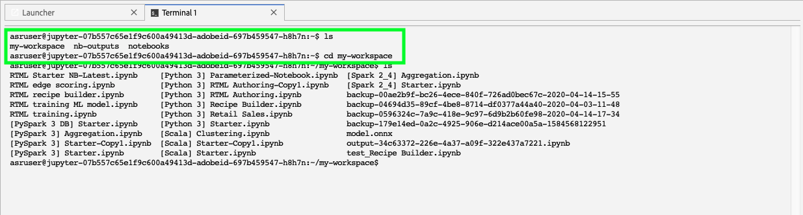

# Zusammenarbeit in [!DNL JupyterLab] using [!DNL Git]

[!DNL Git] ist ein verteiltes Versionskontrollsystem zur Verfolgung von Änderungen im Quellcode während der Softwareentwicklung. Git wird im [!DNL Data Science Workspace JupyterLab] Umgebung.

## Voraussetzungen

>[!NOTE]
>
> Der Git-Server, den Sie verwenden möchten, muss über das Internet zugänglich sein.

Die [!DNL Data Science Workspace JupyterLab] -Umgebung ist eine gehostete Umgebung und nicht in Ihrer Unternehmens-Firewall bereitgestellt. Daher muss der Git-Server, zu dem Sie eine Verbindung herstellen, über das öffentliche Internet zugänglich sein. Dies kann ein öffentliches oder privates Repository in [GitHub](https://github.com/) oder einer anderen Instanz eines [!DNL Git] -Server, den Sie selbst hosten möchten.

## Verbinden [!DNL Git] der [!DNL Data Science Workspace JupyterLab Notebooks] Umgebung

Starten durch Starten [!DNL Adobe Experience Platform] und zur [[!DNL JupyterLabs Notebooks]](https://platform.adobe.com/notebooks/jupyterLab) Umgebung.

Within [!DNL JupyterLab]auswählen **[!UICONTROL Datei]** dann den Mauszeiger darüber bewegen **[!UICONTROL Neu]**. Wählen Sie aus dem angezeigten Dropdown-Menü **[!UICONTROL Terminal]**.

Weiter, innerhalb *Terminal* Navigieren Sie mit dem folgenden Befehl zu Ihrem Arbeitsbereich: `cd my-workspace`.

>[!TIP]
>
> Um eine Liste der verfügbaren Git-Befehle anzuzeigen, geben Sie den Befehl aus: `git -help` in Ihrem Terminal.

Klonen Sie anschließend das Repository, das Sie mit dem `git clone` Befehl. Projekt mithilfe eines `https://` URL anstelle von `ssh://`.

**Beispiel**:

`git clone https://github.com/adobe/experience-platform-dsw-reference.git`

>[!NOTE]
>
> Um alle Schreibvorgänge durchzuführen (`git push` Beispielsweise müssen die folgenden Konfigurationsbefehle für jede neue Sitzung ausgeführt werden. Beachten Sie außerdem, dass bei jedem Push-Befehl ein Benutzername und ein Kennwort angezeigt werden.
>
>`git config --global user.email "you@example.com"`
>
>`git config --global user.name "Your Name"`

## Nächste Schritte

Nachdem Sie das Klonen Ihres Repositorys abgeschlossen haben, können Sie Git wie gewohnt auf Ihrem lokalen Computer verwenden, um mit anderen an Notebooks zusammenzuarbeiten. Weitere Informationen dazu, was Sie in [!DNL JupyterLab], siehe [[!DNL JupyterLab user guide]](./overview.md).
