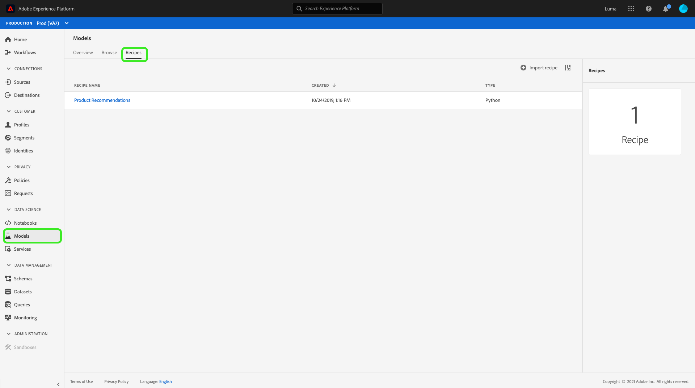
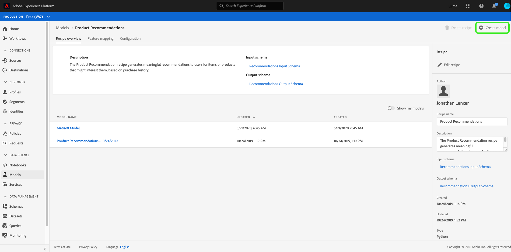
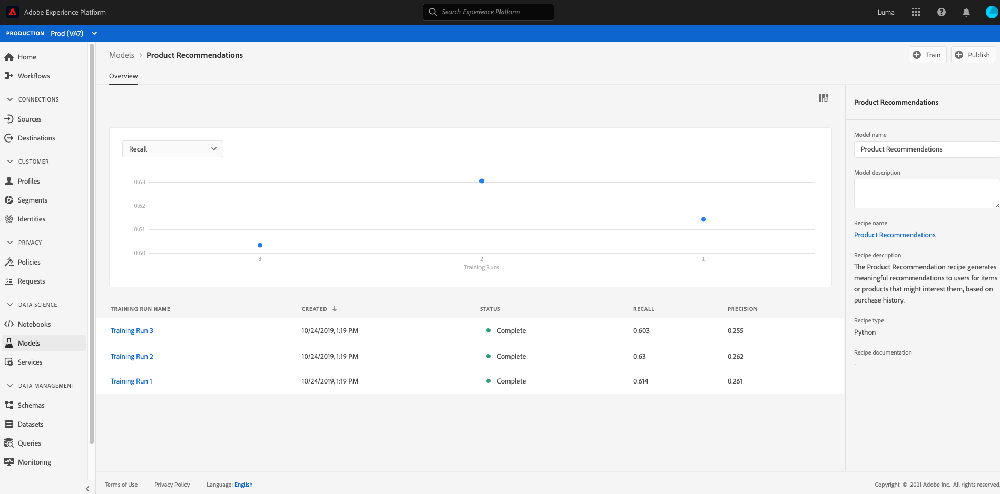

# Erstellen und Veröffentlichen eines Modells für maschinelles Lernen

Geben Sie an, dass Sie eine Online-Einzelhandelswebsite besitzen. Wenn Ihre Kunden auf Ihrer Retail-Website einkaufen, möchten Sie ihnen personalisierte Produktempfehlungen präsentieren, um eine Vielzahl anderer Produkte für Ihre Geschäftangebote verfügbar zu machen. Während der Existenz Ihrer Website haben Sie kontinuierlich Kundendaten gesammelt und möchten diese Daten irgendwie zur Generierung personalisierter Produktempfehlungen verwenden.

[!DNL Adobe Experience Platform] [!DNL Data Science Workspace] stellt die Mittel bereit, um Ihr Ziel mit dem vordefinierten  [Produkt-Recommendations-Rezept](../pre-built-recipes/product-recommendations.md) zu erreichen. In diesem Tutorial erfahren Sie, wie Sie auf Ihre Einzelhandelsdaten zugreifen und diese verstehen, ein Modell für maschinelles Lernen erstellen und optimieren und Einblicke in [!DNL Data Science Workspace] generieren können.

Dieses Tutorial spiegelt den Workflow von [!DNL Data Science Workspace] wider und behandelt die folgenden Schritte zum Erstellen eines Modells für maschinelles Lernen:

1. [Daten vorbereiten](#prepare-your-data)
2. [Modell erstellen](#author-your-model)
3. [Trainieren und Auswerten Ihres Modells](#train-and-evaluate-your-model)
4. [Modell operationalisieren](#operationalize-your-model)

## Erste Schritte

Bevor Sie mit diesem Tutorial beginnen, müssen Sie folgende Voraussetzungen erfüllen:

- Zugriff auf [!DNL Adobe Experience Platform]. Wenn Sie keinen Zugriff auf eine IMS-Organisation in [!DNL Experience Platform] haben, wenden Sie sich an Ihren Systemadministrator, bevor Sie fortfahren.

- Aktivieren von Assets. Wenden Sie sich an Ihren Kundenbetreuer, um die folgenden Informationen für Sie bereitstellen zu lassen.
   - Recommendations-Rezept
   - Recommendations-Eingabedatensatz
   - Recommendations-Eingabeschema
   - Recommendations-Ausgabedatensatz
   - Recommendations Output Schema
   - Golden Data Set postValues
   - Golden Data Set-Schema

- Laden Sie die drei erforderlichen [!DNL Jupyter Notebook]-Dateien aus der [Adobe public [!DNL Git] repository](https://github.com/adobe/experience-platform-dsw-reference/tree/master/Summit/2019/resources/Notebooks-Thurs) herunter. Diese werden verwendet, um den [!DNL JupyterLab]-Workflow in [!DNL Data Science Workspace] zu demonstrieren.

Ein Verständnis der folgenden Schlüsselkonzepte, die in diesem Tutorial verwendet werden:
- [[!DNL Experience Data Model]](../../xdm/home.md): Der von der Adobe geleitete Standardisierungsaufwand zur Definition von Standardschemata wie  [!DNL Profile] und ExperienceEvent für Customer Experience Management.
- Datensätze: Ein Speicher- und Verwaltungskonstrukt für tatsächliche Daten. Eine physische instanziierte Instanz eines [XDM-Schemas](../../xdm/schema/field-dictionary.md).
- Batches: Datensätze bestehen aus Stapeln. Ein Batch ist ein Datensatz, der über einen bestimmten Zeitraum erfasst und als Einheit verarbeitet wird.
- [!DNL JupyterLab]:  [[!DNL JupyterLab]](https://blog.jupyter.org/jupyterlab-is-ready-for-users-5a6f039b8906) ist eine Open-Source-Web-basierte Schnittstelle für Projekt  [!DNL Jupyter] und ist eng in  [!DNL Experience Platform]integriert.

## Daten vorbereiten {#prepare-your-data}

Um ein Modell für maschinelles Lernen zu erstellen, das Ihren Kunden personalisierte Produktempfehlungen unterbreitet, müssen frühere Käufe auf Ihrer Website analysiert werden. In diesem Abschnitt wird untersucht, wie diese Daten in [!DNL Platform] bis [!DNL Adobe Analytics] erfasst werden und wie diese Daten in einen Funktionsdatensatz umgewandelt werden, der von Ihrem maschinellen Lernmodell verwendet werden kann.

### Daten durchsuchen und Schemata verstehen

Melden Sie sich bei [Adobe Experience Platform](https://platform.adobe.com/) an und wählen Sie **[!UICONTROL Datensätze]** aus, um alle vorhandenen Datensätze aufzulisten und den Datensatz auszuwählen, den Sie untersuchen möchten. In diesem Fall der [!DNL Analytics]-Datensatz **Goldener Datensatz postValues**.

Die Seite mit der Datensatzaktivität wird geöffnet und listet Informationen zu Ihrem Datensatz auf. Sie können oben rechts **[!UICONTROL Datensatz-Vorschau]** auswählen, um Beispieldatensätze zu untersuchen. Sie können auch das Schema für den ausgewählten Datensatz anzeigen. Wählen Sie in der rechten Leiste den Schema-Link aus. Ein Popup wird angezeigt. Wenn Sie den Link unter **[!UICONTROL Schemaname]** auswählen, wird das Schema in einer neuen Registerkarte geöffnet.

Die anderen Datensätze wurden zur Vorschau vorab mit Batches gefüllt. Sie können diese Datensätze anzeigen, indem Sie die oben genannten Schritte wiederholen.

| Datensatzname | Schema | Beschreibung |
| ----- | ----- | ----- |
| Golden Data Set postValues | Golden Data Set-Schema | [!DNL Analytics] Quelldaten von Ihrer Website |
| Recommendations-Eingabedatensatz | Recommendations-Eingabeschema | Die [!DNL Analytics]-Daten werden mithilfe einer Funktions-Pipeline in einen Trainings-Datensatz umgewandelt. Diese Daten werden zum Trainieren des maschinellen Lernmodells für Produkt-Recommendations verwendet. `itemid` und  `userid` entsprechen einem von diesem Kunden erworbenen Produkt. |
| Recommendations-Ausgabedatensatz | Recommendations Output Schema | Der Datensatz, für den Scoring-Ergebnisse gespeichert werden, enthält die Liste der empfohlenen Produkte für jeden Kunden. |

## Modell erstellen {#author-your-model}

Die zweite Komponente des Lebenszyklus [!DNL Data Science Workspace] umfasst das Erstellen von Rezepten und Modellen. Das Produkt Recommendations Rezept wurde entwickelt, um unter Verwendung von bisherigen Kaufdaten und maschinellem Lernen maßstabsgetreue Produktempfehlungen zu generieren.

Rezepte bilden die Grundlage für ein Modell, da sie Algorithmen für maschinelles Lernen und Logik zur Lösung spezifischer Probleme enthalten. Wichtiger noch: Rezepte ermöglichen es Ihnen, das maschinelle Lernen in Ihrer Organisation zu demokratisieren, sodass andere Benutzer für unterschiedliche Anwendungsfälle auf ein Modell zugreifen können, ohne Code schreiben zu müssen.

### Recommendations-Rezept durchsuchen

Navigieren Sie in Experience Platform in der linken Navigationsspalte zu **[!UICONTROL Modelle]** und wählen Sie dann **[!UICONTROL Rezepte]** in der oberen Navigationsleiste aus, um eine Liste der für Ihr Unternehmen verfügbaren Rezepte anzuzeigen.

Suchen und öffnen Sie anschließend das bereitgestellte **[!UICONTROL Recommendations-Rezept]**, indem Sie seinen Namen auswählen. Die Seite mit der Rezeptübersicht wird angezeigt.

Wählen Sie dann in der rechten Leiste **[!UICONTROL Recommendations Input Schema]** aus, um das Schema anzuzeigen, das das Rezept steuert. Die Schemafelder &quot;[!UICONTROL itemId]&quot;und &quot;[!UICONTROL userId]&quot;entsprechen einem Produkt, das von diesem Kunden zu einem bestimmten Zeitpunkt ([!UICONTROL timestamp[!UICONTROL interactionType]) gekauft wurde (timestamp]). Führen Sie die gleichen Schritte aus, um die Felder für das **[!UICONTROL Recommendations Output Schema]** zu überprüfen.

Sie haben jetzt die Eingabe- und Ausgabeschemata überprüft, die für das Produkt-Recommendations-Rezept erforderlich sind. Fahren Sie mit dem nächsten Abschnitt fort, um zu erfahren, wie Sie ein Produkt-Recommendations-Modell erstellen, trainieren und bewerten.

## Trainieren und Auswerten Ihres Modells {#train-and-evaluate-your-model}

Nachdem Ihre Daten vorbereitet wurden und das Rezept bereit ist, können Sie Ihr maschinelles Lernmodell erstellen, trainieren und bewerten.

### Modell erstellen

Ein Modell ist eine Instanz eines Rezepts, mit dem Sie mit skalierten Daten trainieren und bewerten können.

Navigieren Sie in Experience Platform in der linken Navigationsspalte zu **[!UICONTROL Modelle]** und wählen Sie dann **[!UICONTROL Rezepte]** in der oberen Navigationsleiste aus. Dadurch wird eine Liste der für Ihr Unternehmen verfügbaren Rezepte angezeigt. Wählen Sie das Rezept für Produktempfehlungen aus.

Wählen Sie auf der Rezeptseite **[!UICONTROL Modell erstellen]** aus.

Der Workflow zum Erstellen eines Modells beginnt mit der Auswahl eines Rezepts. Wählen Sie das **[!UICONTROL Recommendations-Rezept]** aus und klicken Sie dann oben rechts auf **[!UICONTROL Weiter]** .

Geben Sie als Nächstes einen Modellnamen an. Die verfügbaren Konfigurationen für das Modell sind mit Einstellungen für das standardmäßige Trainings- und Scoring-Verhalten des Modells aufgeführt. Überprüfen Sie die Konfigurationen und wählen Sie **[!UICONTROL Finish]** aus.

Sie werden mit einem neu erstellten Trainings-Lauf auf Ihre Modellübersichtsseite umgeleitet. Ein Trainings-Lauf wird standardmäßig generiert, wenn ein Modell erstellt wird.

Sie können auf den Abschluss des Trainings-Laufs warten oder im folgenden Abschnitt mit der Erstellung eines neuen Trainings-Laufs fortfahren.

### Modell mithilfe benutzerdefinierter Hyperparameter trainieren

Wählen Sie auf der Seite **Modellübersicht** **[!UICONTROL Trainieren]** oben rechts aus, um einen neuen Trainings-Lauf zu erstellen. Wählen Sie denselben Eingabedatensatz aus, den Sie beim Erstellen des Modells verwendet haben, und wählen Sie **[!UICONTROL Next]** aus.

Die Seite **[!UICONTROL Configuration]** wird angezeigt. Hier können Sie den Wert `num_recommendations` für die Trainings-Läufe konfigurieren, der auch als Hyperparameter bezeichnet wird. Ein trainiertes und optimiertes Modell verwendet die leistungsstärksten Hyperparameter basierend auf den Ergebnissen des Trainings-Laufs.

Hyperparameter können nicht erlernt werden. Daher müssen sie vor Trainings-Läufen zugewiesen werden. Die Anpassung von Hyperparametern kann die Genauigkeit des trainierten Modells ändern. Da die Optimierung eines Modells ein iterativer Prozess ist, können mehrere Trainings-Läufe erforderlich sein, bevor eine zufriedenstellende Bewertung erreicht wird.

>[!TIP]
>
>Setzen Sie `num_recommendations` auf 10.

Zusätzliche Datenpunkte werden im Modellbewertungsdiagramm angezeigt. Es kann bis zu mehrere Minuten dauern, bis dies angezeigt wird, sobald eine Ausführung abgeschlossen ist.

### Modell bewerten

Jedes Mal, wenn ein Trainings-Lauf abgeschlossen wird, können Sie die resultierenden Bewertungsmetriken anzeigen, um festzustellen, wie gut das Modell funktioniert hat.

Um die Auswertungsmetriken (Präzision und Rückruf) für jeden abgeschlossenen Trainings-Lauf zu überprüfen, wählen Sie den Trainings-Lauf aus.

Sie können die für die einzelnen Bewertungsmetriken bereitgestellten Informationen untersuchen. Je höher diese Metriken sind, desto besser hat das Modell funktioniert.

Sie können den Datensatz, das Schema und die Konfigurationsparameter anzeigen, die für jeden Trainings-Lauf in der rechten Leiste verwendet werden. Navigieren Sie zurück zur Modellseite und ermitteln Sie die leistungsfähigsten Schulungsabläufe, indem Sie deren Auswertungsmetriken beobachten.

## Modell operationalisieren {#operationalize-your-model}

Der letzte Schritt im Data Science-Arbeitsablauf besteht darin, Ihr Modell zu operationalisieren, um Erkenntnisse aus Ihrem Datenspeicher zu bewerten und zu nutzen.

### Bewerten und Generieren von Einblicken

Wählen Sie auf der Übersichtsseite des Produktempfehlungsmodells den Namen des Trainings-Laufs mit der besten Leistung mit den höchsten Rückruf- und Genauigkeitswerten aus.

Wählen Sie dann oben rechts auf der Detailseite für Trainings-Läufe **[!UICONTROL Score]** aus.

Wählen Sie als Nächstes den **[!UICONTROL Recommendations-Eingabedatensatz]** als Scoring-Eingabedatensatz aus, der mit dem Datensatz übereinstimmt, den Sie beim Erstellen des Modells und Ausführen der Trainings-Läufe verwendet haben. Wählen Sie dann **[!UICONTROL Weiter]** aus.

Sobald Sie Ihren Eingabedatensatz haben, wählen Sie den **[!UICONTROL Recommendations Output-Datensatz]** als Scoring-Ausgabedatensatz aus. Scoring-Ergebnisse werden in diesem Datensatz als Batch gespeichert.

Überprüfen Sie abschließend die Scoring-Konfigurationen. Diese Parameter enthalten die zuvor ausgewählten Eingabe- und Ausgabedatensätze zusammen mit den entsprechenden Schemata. Wählen Sie **[!UICONTROL Beenden]** aus, um den Scoring-Lauf zu starten. Die Ausführung kann mehrere Minuten dauern.

### Anzeigen bewerteter Einblicke

Sobald der Scoring-Lauf erfolgreich abgeschlossen wurde, können Sie die Ergebnisse in der Vorschau anzeigen und die erstellten Einblicke anzeigen.

Wählen Sie auf der Seite mit den Scoring-Läufen den abgeschlossenen Scoring-Lauf und dann **[!UICONTROL Vorschau des Datensatzes mit den Scoring-Ergebnissen]** in der rechten Leiste aus.

In der Vorschautabelle enthält jede Zeile Produktempfehlungen für einen bestimmten Kunden mit der Bezeichnung [!UICONTROL recommendations] bzw. [!UICONTROL userId]. Da der Hyperparameter [!UICONTROL num_recommendations] in den Beispiel-Screenshots auf 10 gesetzt wurde, kann jede Empfehlungszeile bis zu 10 Produktidentitäten enthalten, die durch ein Nummernzeichen (#) getrennt sind.

## Nächste Schritte {#next-steps}

In diesem Tutorial haben Sie den Workflow von [!DNL Data Science Workspace] vorgestellt, der zeigt, wie unverarbeitete Rohdaten durch maschinelles Lernen in nützliche Informationen umgewandelt werden können. Weiterführende Informationen zur Verwendung von [!DNL Data Science Workspace] finden Sie im nächsten Handbuch zum Erstellen des Einzelhandelsschemas und -datensatzes ](./create-retails-sales-dataset.md).[
