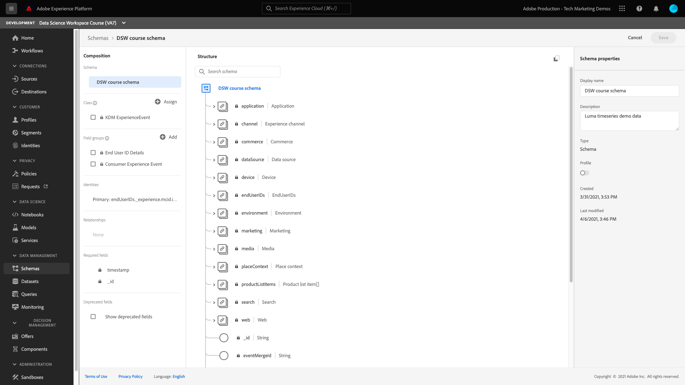

# Erstellen und Veröffentlichen eines Modells für maschinelles Lernen

Im folgenden Handbuch werden die Schritte beschrieben, die zum Erstellen und Veröffentlichen eines Modells für maschinelles Lernen erforderlich sind. Jeder Abschnitt enthält eine Beschreibung Ihrer Aktionen sowie einen Link zur Benutzeroberfläche und API-Dokumentation, um den beschriebenen Schritt durchzuführen.

## Erste Schritte

Bevor Sie mit diesem Tutorial beginnen, müssen Sie folgende Voraussetzungen erfüllen:

- Zugriff auf [!DNL Adobe Experience Platform]. Wenn Sie keinen Zugriff auf eine IMS-Organisation in [!DNL Experience Platform]Wenden Sie sich an Ihren Systemadministrator, bevor Sie fortfahren.

- Alle Data Science Workspace-Tutorials verwenden das Luma-Tendenzmodell. Um fortfahren zu können, müssen Sie die [Luma-Eigenschaftenmodellschemata und -datensätze](./create-luma-data.md).

### Daten durchsuchen und Schemata verstehen

Anmelden bei [Adobe Experience Platform](https://platform.adobe.com/) und wählen Sie **[!UICONTROL Datensätze]** , um alle vorhandenen Datensätze aufzulisten und den Datensatz auszuwählen, den Sie untersuchen möchten. In diesem Fall sollten Sie die **Luma-Webdaten** Datensatz.

Die Seite mit der Datensatzaktivität wird geöffnet und listet Informationen zu Ihrem Datensatz auf. Sie können **[!UICONTROL Vorschau eines Datensatzes anzeigen]** oben rechts, um die Beispieldatensätze zu untersuchen. Sie können auch das Schema für den ausgewählten Datensatz anzeigen.

Wählen Sie in der rechten Leiste den Schema-Link aus. Es wird ein Popup angezeigt, in dem Sie den Link unter **[!UICONTROL Schemaname]** öffnet das Schema in einer neuen Registerkarte.

Sie können die Daten mithilfe des bereitgestellten Notebooks Exploratory Data Analysis (EDA) weiter untersuchen. Dieses Notebook kann verwendet werden, um Muster in den Luma-Daten zu verstehen, die Datensaniertheit zu überprüfen und die relevanten Daten für das prädiktive Tendenzmodell zusammenzufassen. Weitere Informationen zur Explorationsdatenanalyse finden Sie unter [EDA-Dokumentation](../jupyterlab/eda-notebook.md).

## Erstellen des Luma-Tendenzrezepts {#author-your-model}

Eine Hauptkomponente der [!DNL Data Science Workspace] Der Lebenszyklus umfasst die Erstellung von Rezepten und Modellen. Das Luma-Tendenzmodell wurde entwickelt, um eine Vorhersage darüber zu generieren, ob Kunden eine hohe Tendenz haben, ein Produkt von Luma zu kaufen.

Zum Erstellen des Luma-Tendenzmodells wird die Vorlage &quot;Rezept-Builder&quot;verwendet. Rezepte bilden die Grundlage für ein Modell, da sie Algorithmen für maschinelles Lernen und Logik zur Lösung spezifischer Probleme enthalten. Wichtiger noch: Rezepte ermöglichen es Ihnen, das maschinelle Lernen in Ihrer Organisation zu demokratisieren, sodass andere Benutzer für unterschiedliche Anwendungsfälle auf ein Modell zugreifen können, ohne Code schreiben zu müssen.

Befolgen Sie die [ein Modell mit JupyterLab Notebooks erstellen](../jupyterlab/create-a-model.md) Tutorial zum Erstellen des Rezepts für das Luma-Tendenzmodell, das in nachfolgenden Tutorials verwendet wird.

## Importieren und verpacken Sie ein Rezept aus externen Quellen (*optional*)

Wenn Sie ein Rezept zur Verwendung in Data Science Workspace importieren und verpacken möchten, müssen Sie Ihre Quelldateien in einer Archivdatei verpacken. Befolgen Sie die [Quelldateien in ein Rezept verpacken](./package-source-files-recipe.md) Tutorial. In diesem Tutorial erfahren Sie, wie Sie Quelldateien in einem Rezept verpacken können. Dies ist die Voraussetzung für den Import eines Rezepts in Data Science Workspace. Sobald das Tutorial abgeschlossen ist, erhalten Sie ein Docker-Bild in einer Azure Container Registry sowie die entsprechende Bild-URL, d. h. eine Archivdatei.

Diese Archivdatei kann verwendet werden, um ein Rezept in Data Science Workspace zu erstellen, indem Sie dem Workflow zum Importieren von Rezepten mit dem [UI-Workflow](./import-packaged-recipe-ui.md) oder [API-Workflow](./import-packaged-recipe-api.md).

## Trainieren und Auswerten eines Modells {#train-and-evaluate-your-model}

Nachdem Ihre Daten vorbereitet wurden und ein Rezept bereit ist, können Sie Ihr maschinelles Lernmodell weiter erstellen, trainieren und bewerten. Bei Verwendung des Recipe Builder sollten Sie Ihr Modell bereits trainiert, bewertet und bewertet haben, bevor Sie es in ein Rezept verpacken.

Mit der Data Science Workspace-Benutzeroberfläche und -API können Sie Ihr Rezept als Modell veröffentlichen. Darüber hinaus können Sie bestimmte Aspekte Ihres Modells weiter anpassen, z. B. das Hinzufügen, Entfernen und Ändern von Hyperparametern.

### Modell erstellen

Weitere Informationen zum Erstellen eines Modells mithilfe der Benutzeroberfläche finden Sie im Abschnitt zum Trainieren und Auswerten eines Modells in Data Science Workspace [UI-Tutorial](./train-evaluate-model-ui.md) oder [API-Tutorial](./train-evaluate-model-api.md). Dieses Tutorial bietet ein Beispiel für das Erstellen, Trainieren und Aktualisieren von Hyperparametern zur Feinabstimmung Ihres Modells.

>[!NOTE]
>
> Hyperparameter können nicht erlernt werden. Daher müssen sie vor Trainings-Läufen zugewiesen werden. Die Anpassung von Hyperparametern kann die Genauigkeit Ihres trainierten Modells ändern. Da die Optimierung eines Modells ein iterativer Prozess ist, können mehrere Trainings-Läufe erforderlich sein, bevor eine zufriedenstellende Bewertung erreicht wird.

## Modell bewerten {#score-a-model}

Der nächste Schritt bei der Erstellung und Veröffentlichung eines Modells besteht darin, Ihr Modell zu operationalisieren, um Einblicke aus dem Data Lake und dem Echtzeit-Kundenprofil zu gewinnen und zu nutzen.

Scoring in Data Science Workspace kann durch Einspeisung von Eingabedaten in ein vorhandenes trainiertes Modell erreicht werden. Scoring-Ergebnisse werden dann als neuer Batch in einem angegebenen Ausgabedatensatz gespeichert und angezeigt.

Um zu erfahren, wie Sie Ihr Modell bewerten, besuchen Sie die Bewertung eines Modells. [UI-Tutorial](./score-model-ui.md) oder [API-Tutorial](./score-model-api.md).

## Veröffentlichen eines bewerteten Modells als Dienst

Mit Data Science Workspace können Sie Ihr trainiertes Modell als Dienst veröffentlichen. Dadurch können Benutzer in Ihrer IMS-Organisation Daten bewerten, ohne eigene Modelle erstellen zu müssen.

Informationen zum Veröffentlichen eines Modells als Dienst finden Sie unter [UI-Tutorial](./publish-model-service-ui.md) oder [API-Tutorial](./publish-model-service-api.md).

### Planen automatisierter Schulungen für einen Dienst

Nachdem Sie ein Modell als Dienst veröffentlicht haben, können Sie geplante Scoring- und Trainings-Läufe für Ihren maschinellen Lerndienst einrichten. Die Automatisierung des Trainings- und Scoring-Prozesses kann dazu beitragen, die Effizienz eines Dienstes im Laufe der Zeit zu erhalten und zu verbessern, indem Sie mit den Mustern in Ihren Daten Schritt halten. Besuchen Sie die [Planen eines Modells in der Benutzeroberfläche von Data Science Workspace](./schedule-models-ui.md) Tutorial.

>[!NOTE]
>
> Sie können ein Modell nur für automatisierte Schulungen und Auswertungen über die Benutzeroberfläche planen.

## Nächste Schritte {#next-steps}

Adobe Experience Platform [!DNL Data Science Workspace] bietet die Tools und Ressourcen zum Erstellen, Auswerten und Verwenden maschineller Lernmodelle, um Datenprognosen und -einblicke zu generieren. Wenn Einblicke aus maschinellem Lernen in eine [!DNL Profile]-aktivierter Datensatz, der dieselben Daten auch als [!DNL Profile] Datensätze, die dann mithilfe von [!DNL Adobe Experience Platform Segmentation Service].

Da Profil- und Zeitreihendaten erfasst werden, entscheidet das Echtzeit-Kundenprofil automatisch, diese Daten über einen kontinuierlichen Prozess, der Streaming-Segmentierung genannt wird, ein- oder auszuschließen, bevor sie mit vorhandenen Daten zusammengeführt und die Vereinigungsansicht aktualisiert wird. Das Ergebnis: Berechnungen und Entscheidungen dazu, wie Sie Ihren Kunden herausragende, individuell auf sie abgestimmte Erlebnisse liefern, lassen sich direkt während ihrer Interaktion mit Ihrer Marke anstellen bzw. treffen.

Besuchen Sie das Tutorial für [Anreicherung des Echtzeit-Kundenprofils mit Einblicken aus maschinellem Lernen](./enrich-profile.md) , um mehr darüber zu erfahren, wie Sie Einblicke aus maschinellem Lernen nutzen können.
