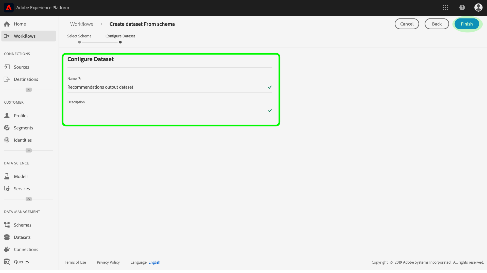

# Steigerung des Echtzeit-Profils von Kunden durch Einblicke in das maschinelle Lernen

Der Adobe Experience Platform Data Science Workspace bietet die Werkzeuge und Ressourcen zum Erstellen, Auswerten und Verwenden von maschinellen Lernmodellen, um Datenprognosen und -einblicke zu generieren. Wenn Einblicke in das maschinelle Lernen in einen Profil-aktivierten Datensatz aufgenommen werden, werden dieselben Daten auch als Profil-Datensätze erfasst, die dann mithilfe des Experience Platform-Segmentierungsdiensts in Untergruppen verwandter Elemente segmentiert werden können.

Dieses Dokument bietet eine schrittweise Anleitung zur Verbesserung des Echtzeit-Profils durch maschinelles Lernen. Die Schritte sind in die folgenden Abschnitte unterteilt:

1. [Schema und Datensatz für die Ausgabe erstellen](#create-an-output-schema-and-dataset)
2. [Schema und Datensatz für die Ausgabe konfigurieren](#configure-an-output-schema-and-dataset)
3. [Erstellen von Segmenten mit dem Segmentaufbau](#create-segments-using-the-segment-builder)

## Erste Schritte

Dieses Lernprogramm erfordert ein Verständnis der verschiedenen Aspekte der Adobe Experience Platform beim Erfassen von Profil-Daten und Erstellen von Segmenten. Bevor Sie mit diesem Lernprogramm beginnen, lesen Sie bitte die Dokumentation für die folgenden Dienste:

* [Echtzeit-Profil](../../rtcdp/overview.md): Bietet ein einheitliches, Echtzeit-Profil für Kunden, das auf aggregierten Daten aus mehreren Quellen basiert.
* [Identitätsdienst](../../identity-service/home.md): Ermöglicht Kunden-Profil in Echtzeit durch Überbrückung von Identitäten aus unterschiedlichen Datenquellen, die in Plattform integriert werden.
* [Erlebnisdatenmodell (XDM)](../../xdm/home.md): Das standardisierte Framework, mit dem Plattform Kundenerlebnisdaten organisiert.

Neben den oben genannten Dokumenten sollten Sie auch die folgenden Leitfäden zu Schemas und dem Schema-Editor lesen:

* [Grundlagen der Zusammensetzung](../../xdm/schema/composition.md)des Schemas: Beschreibt XDM-Schema, Bausteine, Grundsätze und Best Practices zum Erstellen von Schemas, die in Experience Platform verwendet werden sollen.
* [Schema-Editor-Lernprogramm](../../xdm/tutorials/create-schema-ui.md): Enthält ausführliche Anleitungen zum Erstellen von Schemas mit dem Schema-Editor in Experience Platform.

## Schema und Datensatz für die Ausgabe erstellen {#create-an-output-schema-and-dataset}

Der erste Schritt zur Bereicherung des Echtzeit-Kundenobjekts mit bewerteten Einblicken ist das Wissen, welches Echtzeit-Profil (z. B. eine Person) Ihre Daten definieren. Wenn Sie Ihre Daten verstehen, können Sie eine Struktur beschreiben und entwerfen, die für Ihre Daten von Bedeutung ist, ähnlich wie beim Entwerfen einer relationalen Datenbank.

Das Erstellen eines Schemas beginnt mit dem Zuweisen einer Klasse. Klassen definieren die Verhaltensaspekte der Daten, die das Schema enthalten soll (Datensatz oder Zeitreihen). Dieser Abschnitt enthält grundlegende Anweisungen zum Erstellen eines Schemas mit dem Schema Builder. Ein ausführlicheres Tutorial zum [Erstellen eines Schemas mit dem Schema-Editor](../../xdm/tutorials/create-schema-ui.md)finden Sie im Tutorial.

1. Klicken Sie in Adobe Experience Platform auf die Registerkarte **[!UICONTROL Schema]** , um auf den Schema-Browser zuzugreifen. Klicken Sie auf Schema **** erstellen, um auf den *Schema-Editor*zuzugreifen, in dem Sie interaktiv Schemas erstellen und erstellen können.
   

2. Klicken Sie im Fenster &quot; *Komposition* &quot;auf **[!UICONTROL Zuweisen]** , um die verfügbaren Klassen zu durchsuchen.
   * Um eine vorhandene Klasse zuzuweisen, markieren Sie die gewünschte Klasse und klicken Sie auf **[!UICONTROL Klasse]**zuweisen.
      

   * Um eine benutzerdefinierte Klasse zu erstellen, klicken Sie auf Neue Klasse **** erstellen, die sich in der Mitte des Browserfensters befindet. Geben Sie einen Klassennamen und eine Beschreibung ein und wählen Sie das Verhalten der Klasse aus. Klicken Sie auf Klasse **[!UICONTROL zuweisen]** , sobald Sie fertig sind.
      
   An diesem Punkt sollte die Struktur Ihres Schemas einige Klassenfelder enthalten und Sie können Mixins zuweisen. Ein Mixin ist eine Gruppe aus einem oder mehreren Feldern, die ein bestimmtes Konzept beschreiben.

3. Klicken Sie im Fenster &quot; *Komposition* &quot;im Unterabschnitt &quot; **[!UICONTROL Mixins]** &quot;auf *Hinzufügen* .
   * Um ein vorhandenes Mixin zuzuweisen, markieren Sie das gewünschte Mixin und klicken Sie dann auf **[!UICONTROL Hinzufügen Mixin]**. Im Gegensatz zu Klassen können einem einzelnen Schema mehrere Mixins zugewiesen werden, sofern dies angemessen ist.
      

   * Um ein neues Mixin zu erstellen, klicken Sie auf Neues Mixin **** erstellen, das sich in der Mitte des Browserfensters befindet. Geben Sie einen Namen und eine Beschreibung für das Mixin ein und klicken Sie dann auf Mixin **[!UICONTROL zuweisen]** , sobald Sie fertig sind.
      

   * Um Mixin-Felder hinzuzufügen, klicken Sie im Fenster &quot; *Komposition* &quot;auf den Namen des Mixins. Sie erhalten dann die Möglichkeit, Mixin-Felder hinzuzufügen, indem Sie im Fenster &quot; **[!UICONTROL Struktur]** &quot;auf *Hinzufügen Feld* klicken. Stellen Sie sicher, dass die mixin-Eigenschaften entsprechend bereitgestellt werden.
      

4. Nachdem Sie das Schema erstellt haben, klicken Sie im Fenster &quot; *Struktur* &quot;auf das Feld auf der obersten Ebene des Schemas, um die Eigenschaften des Schemas im rechten Eigenschaftenfenster anzuzeigen. Geben Sie einen Namen und eine Beschreibung ein und klicken Sie auf **[!UICONTROL Speichern]** , um das Schema zu erstellen.
   

5. Erstellen Sie ein Ausgabedataset mit Ihrem neu erstellten Schema, indem Sie in der linken Navigationsspalte auf **[!UICONTROL Datensätze]** klicken und dann auf Datensatz **[!UICONTROL erstellen]** klicken. Wählen Sie im nächsten Bildschirm &quot;Datensatz aus Schema **[!UICONTROL erstellen&quot;]**.
   

6. Suchen und wählen Sie im Schema-Browser das neu erstellte Schema aus und klicken Sie dann auf **[!UICONTROL Weiter]**.
   

7. Geben Sie einen Namen und eine optionale Beschreibung ein und klicken Sie dann auf **[!UICONTROL Fertig stellen]** , um den Datensatz zu erstellen.
   

Nachdem Sie einen Output Schema-Datensatz erstellt haben, fahren Sie mit dem nächsten Abschnitt fort, um ihn für die Anreicherung des Profils zu konfigurieren und zu aktivieren.

## Schema und Datensatz für die Ausgabe konfigurieren {#configure-an-output-schema-and-dataset}

Bevor Sie einen Datensatz zum Profil aktivieren können, müssen Sie das Schema des Datensatzes so konfigurieren, dass ein primäres Identitätsfeld vorhanden ist, und das Schema dann zum Profil aktivieren. Wenn Sie ein neues Schema erstellen und aktivieren möchten, finden Sie Informationen zum [Erstellen eines Schemas mit dem Schema-Editor](../../xdm/tutorials/create-schema-ui.md)im Lernprogramm. Befolgen Sie andernfalls die unten stehenden Anweisungen, um ein vorhandenes Schema und einen vorhandenen Datensatz zu aktivieren.

1. Verwenden Sie auf der Adobe Experience Platform den Schema-Browser, um das Output-Schema zu finden, auf dem Sie Profil aktivieren möchten, und klicken Sie auf dessen Namen, um die Komposition Ansicht.
   

2. Erweitern Sie die Schema-Struktur und suchen Sie ein geeignetes Feld, das als primärer Bezeichner festgelegt werden soll. Klicken Sie auf das gewünschte Feld, um dessen Eigenschaften anzuzeigen.
   

3. Legen Sie das Feld als primäre Identität fest, indem Sie die **[!UICONTROL Identity]** -Eigenschaft des Felds und die **[!UICONTROL Primary Identity]** -Eigenschaft aktivieren und dann einen entsprechenden **[!UICONTROL Identity-Namensraum]** auswählen. Klicken Sie auf **[!UICONTROL Übernehmen]** , nachdem Sie Ihre Änderungen vorgenommen haben.
   

4. Klicken Sie auf das Objekt auf der obersten Ebene Ihrer Schema-Struktur, um die Schema-Eigenschaften anzuzeigen und das Schema zum Profil zu aktivieren, indem Sie den **[!UICONTROL Profil]** -Schalter aktivieren. Klicken Sie auf **[!UICONTROL Speichern]** , um die Änderungen abzuschließen. Dataset, die mit diesem Schema erstellt wurden, kann jetzt zum Profil aktiviert werden.
   

5. Verwenden Sie den DataSet-Browser, um den Datensatz zu finden, auf dem Sie Profil aktivieren möchten, und klicken Sie auf dessen Namen, um auf dessen Details zuzugreifen.
   

6. Aktivieren Sie den Datensatz zum Profil, indem Sie den in der rechten Informationsspalte angezeigten **[!UICONTROL Profil]** -Schalter umschalten.
   

Wenn Daten in einen Profil-aktivierten Datensatz aufgenommen werden, werden dieselben Daten auch als Profil-Datensätze erfasst. Nachdem Ihr Schema und Ihr Datensatz vorbereitet wurden, generieren Sie einige Daten in den Datensatz, indem Sie mit einem geeigneten Modell Bewertungsläufe durchführen, und fahren Sie mit diesem Lernprogramm fort, um mithilfe des Segmentaufbaus Insight-Segmente zu erstellen.

## Erstellen von Segmenten mit dem Segmentaufbau {#create-segments-using-the-segment-builder}

Nachdem Sie nun Einblicke in Ihren Profil-aktivierten Datensatz generiert und gesammelt haben, können Sie diese Daten verwalten, indem Sie mithilfe des Segmentaufbaus Untergruppen verwandter Elemente identifizieren. Gehen Sie wie folgt vor, um eigene Segmente zu erstellen.

1. Klicken Sie auf der Adobe Experience Platform auf die Registerkarte **[!UICONTROL Segmente]** und anschließend auf Segment **[!UICONTROL erstellen]** , um auf den Segmentaufbau zuzugreifen.
   

2. Im Segmentaufbau bietet die linke Leiste Zugriff auf die wichtigsten Segmentbausteine: Attribute, Ereignis und vorhandene Segmente. Jeder Baustein erscheint auf seiner eigenen Registerkarte. Wählen Sie die Profil-aktivierte Segmentklasse aus, und suchen Sie dann nach den Segmentbausteinen.
   

3. Ziehen Sie Bausteine per Drag &amp; Drop auf die Arbeitsfläche des Rule Builder und ergänzen Sie sie durch Angabe vergleichender Anweisungen.
   

4. Während Sie Ihr Segment erstellen, können Sie geschätzte Segmentergebnisse unter Beachtung des Bereichs *Segmenteigenschaften* Vorschau haben.
   

5. Wählen Sie eine entsprechende **[!UICONTROL Merge Policy]**, geben Sie einen Namen und eine optionale Beschreibung ein und klicken Sie dann auf **[!UICONTROL Speichern]** , um Ihr neues Segment abzuschließen.
   

## Nächste Schritte {#next-steps}

Dieses Dokument führte Sie durch die Schritte, die erforderlich sind, um ein Schema und einen Datensatz zum Profil zu aktivieren, und demonstrierte kurz den Arbeitsablauf zum Erstellen von Insight-Segmenten mit dem Segmentaufbau. Weitere Informationen zu Segmenten und zum Segmentaufbau finden Sie in der Übersicht über den [Segmentdienst](../../segmentation/home.md).