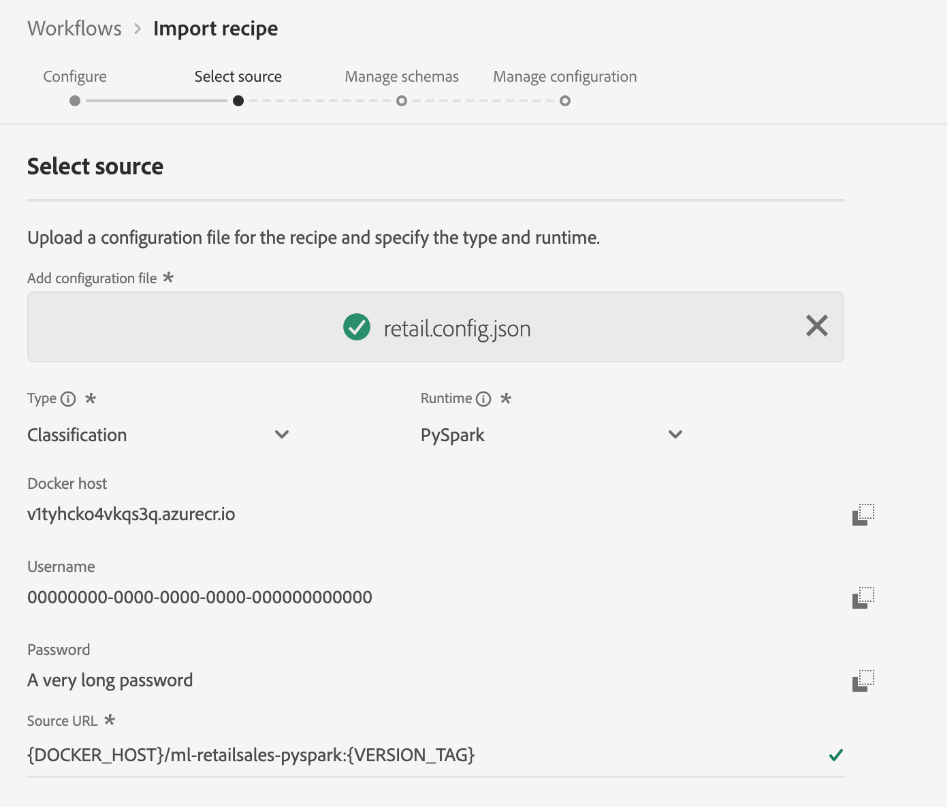

# Importieren eines gepackten Rezepts in die Benutzeroberfläche von Data Science Workspace

Dieses Tutorial bietet Einblicke in das Konfigurieren und Importieren eines gepackten Rezepts mit dem bereitgestellten Beispiel für Einzelhandelsumsätze. Am Ende dieses Tutorials können Sie ein Modell in Adobe Experience Platform erstellen, trainieren und bewerten [!DNL Data Science Workspace].

## Voraussetzungen

Für dieses Tutorial ist ein gepacktes Rezept in Form einer Docker-Bild-URL erforderlich. Weiterführende Informationen finden Sie im Tutorial zum [Verpacken von Quelldateien in einem Rezept](./package-source-files-recipe.md).

## Workflow in der Benutzeroberfläche

Importieren eines gepackten Rezepts in [!DNL Data Science Workspace] erfordert spezifische Rezeptkonfigurationen, die in einer einzelnen JSON-Datei (JavaScript Object Notation) kompiliert sind. Diese Kompilierung von Rezeptkonfigurationen wird als Konfigurationsdatei bezeichnet. Ein gepacktes Rezept mit einem bestimmten Satz von Konfigurationen wird als Rezeptinstanz bezeichnet. Ein Rezept kann verwendet werden, um viele Rezeptinstanzen in [!DNL Data Science Workspace].

Der Workflow zum Importieren eines gepackten Rezepts umfasst folgende Schritte:
- [Rezept konfigurieren](#configure)
- [Docker-basiertes Rezept importieren – Python](#python)
- [Docker-basiertes Rezept importieren – R](#r)
- [Docker-basiertes Rezept importieren - PySpark](#pyspark)
- [Docker-basiertes Rezept importieren - Scala](#scala)

### Rezept konfigurieren {#configure}

Jede Rezeptinstanz in [!DNL Data Science Workspace] wird mit einer Reihe von Konfigurationen ergänzt, die die Rezeptinstanz an einen bestimmten Anwendungsfall anpassen. Konfigurationsdateien definieren das standardmäßige Trainings- und Scoring-Verhalten eines mit dieser Rezeptinstanz erstellten Modells.

>[!NOTE]
>
>Konfigurationsdateien sind rezept- und fallspezifisch.

Im Folgenden finden Sie eine Beispielkonfigurationsdatei mit standardmäßigem Trainings- und Scoring-Verhalten für das Rezept „Einzelhandelsumsätze“.

```json
[
    {
        "name": "train",
        "parameters": [
            {
                "key": "learning_rate",
                "value": "0.1"  
            },
            {
                "key": "n_estimators",
                "value": "100"
            },
            {
                "key": "max_depth",
                "value": "3"
            },
            {
                "key": "ACP_DSW_INPUT_FEATURES",
                "value": "date,store,storeType,storeSize,temperature,regionalFuelPrice,markdown,cpi,unemployment,isHoliday"
            },
            {
                "key": "ACP_DSW_TARGET_FEATURES",
                "value": "weeklySales"
            },
            {
                "key": "ACP_DSW_FEATURE_UPDATE_SUPPORT",
                "value": false
            },
            {
                "key": "tenantId",
                "value": "_{TENANT_ID}"
            },
            {
                "key": "ACP_DSW_TRAINING_XDM_SCHEMA",
                "value": "{SEE BELOW FOR DETAILS}"
            },
            {
                "key": "evaluation.labelColumn",
                "value": "weeklySalesAhead"
            },
            {
                "key": "evaluation.metrics",
                "value": "MAPE,MAE,RMSE,MASE"
            }
        ]
    },
    {
        "name": "score",
        "parameters": [
            {
                "key": "tenantId",
                "value": "_{TENANT_ID}"
            },
            {
                "key":"ACP_DSW_SCORING_RESULTS_XDM_SCHEMA",
                "value":"{SEE BELOW FOR DETAILS}"
            }
        ]
    }
]
```

| Parameterschlüssel | Typ | Beschreibung |
| ----- | ----- | ----- |
| `learning_rate` | Zahl | Skalar für graduelle Multiplikation. |
| `n_estimators` | Zahl | Zahl der Bäume im Wald für Random Forest Classifier. |
| `max_depth` | Zahl | Maximale Tiefe eines Baums in Random Forest Classifier. |
| `ACP_DSW_INPUT_FEATURES` | Zeichenfolge | Liste mit kommagetrennten Eingabeschemaattributen. |
| `ACP_DSW_TARGET_FEATURES` | Zeichenfolge | Liste mit kommagetrennten Ausgabeschemaattributen. |
| `ACP_DSW_FEATURE_UPDATE_SUPPORT` | Boolesch | Legt fest, ob Eingabe- und Ausgabefunktionen geändert werden können. |
| `tenantId` | Zeichenfolge | Diese Kennung stellt sicher, dass die von Ihnen erstellten Ressourcen den richtigen Namespace erhalten und in Ihrer IMS-Organisation enthalten sind. [Gehen Sie wie folgt vor](../../xdm/api/getting-started.md#know-your-tenant_id), um Ihre Mandantenkennung zu suchen. |
| `ACP_DSW_TRAINING_XDM_SCHEMA` | Zeichenfolge | Das zum Trainieren eines Modells verwendete Eingabeschema. Lassen Sie es beim Importieren in der Benutzeroberfläche leer; ersetzen Sie es beim Importieren mit der API durch die Trainings-SchemaID. |
| `evaluation.labelColumn` | Zeichenfolge | Spaltenbezeichnung für Bewertungsvisualisierungen. |
| `evaluation.metrics` | Zeichenfolge | Kommagetrennte Liste mit Bewertungsmetriken, die zur Bewertung eines Modells verwendet werden. |
| `ACP_DSW_SCORING_RESULTS_XDM_SCHEMA` | Zeichenfolge | Das zum Scoring eines Modells verwendete Ausgabeschema. Lassen Sie es beim Importieren in der Benutzeroberfläche leer; ersetzen Sie es beim Importieren mit der API durch die Scoring-SchemaID. |

Für diese Anleitung können Sie die Standardkonfigurationsdateien für das Rezept &quot;Einzelhandelsumsätze&quot;im [!DNL Data Science Workspace] Verweisen Sie auf ihre Art.

### Docker-basiertes Rezept importieren - [!DNL Python] {#python}

Beginnen durch Navigieren und Auswählen **[!UICONTROL Workflows]** oben links im [!DNL Platform] Benutzeroberfläche. Wählen Sie als Nächstes **Rezept importieren** und wählen Sie **[!UICONTROL Launch]**.


Die **Konfigurieren** Seite für die **Rezept importieren** Workflow angezeigt. Geben Sie einen Namen und eine Beschreibung für das Rezept ein und wählen Sie **[!UICONTROL Nächste]** in der oberen rechten Ecke.


>[!NOTE]
>
> Im Tutorial [Quelldateien in einem Rezept verpacken](./package-source-files-recipe.md) wurde nach der Erstellung des Rezepts für Einzelhandelsumsätze mit Python-Quelldateien eine Docker-URL bereitgestellt.

Sobald Sie auf dem **Quelle auswählen** Fügen Sie die Docker-URL ein, die dem gepackten Rezept entspricht, das mit [!DNL Python] Quelldateien in der **[!UICONTROL Quell-URL]** -Feld. Importieren Sie anschließend die bereitgestellte Konfigurationsdatei per Drag-and-Drop oder mit dem **Browser** des Dateisystems. Die bereitgestellte Konfigurationsdatei finden Sie unter `experience-platform-dsw-reference/recipes/python/retail/retail.config.json`. Auswählen **[!UICONTROL Python]** im **Laufzeit** und **[!UICONTROL Klassifizierung]** im **Typ** angezeigt. Nachdem alles ausgefüllt wurde, wählen Sie **[!UICONTROL Nächste]** in der oberen rechten Ecke, um fortzufahren **Schemata verwalten**.

>[!NOTE]
>
> Typ unterstützt **[!UICONTROL Klassifizierung]** und **[!UICONTROL Regression]**. Wenn Ihr Modell nicht unter einen dieser Typen fällt, wählen Sie **[!UICONTROL Benutzerdefiniert]**.


Wählen Sie als Nächstes die Eingabe- und Ausgabeschemata für Einzelhandelsumsätze im Abschnitt aus. **Verwalten von Schemas**, wurden sie mit dem bereitgestellten Bootstrap-Skript im [Schema und Datensatz für Einzelhandelsumsätze erstellen](../models-recipes/create-retails-sales-dataset.md) Tutorial.


Unter dem **Funktionsverwaltung** Wählen Sie in der Schema-Ansicht Ihrer Mandantenkennung aus, um das Eingabeschema für Einzelhandelsumsätze zu erweitern. Wählen Sie die Ein- und Ausgabefunktionen aus, indem Sie die gewünschte Funktion markieren und entweder die Option **[!UICONTROL Eingabefunktion]** oder **[!UICONTROL Zielfunktion]** im rechten Fenster **[!UICONTROL Feldeigenschaften]** auswählen. Legen Sie in diesem Tutorial **[!UICONTROL weeklySales]** als **[!UICONTROL Zielfunktion]** und alles andere als **[!UICONTROL Eingabefunktion]** fest. Auswählen **[!UICONTROL Nächste]** , um Ihr neues konfiguriertes Rezept zu überprüfen.

Prüfen Sie das Rezept und fügen Sie je nach Bedarf Konfigurationen hinzu bzw. ändern oder entfernen Sie sie. Auswählen **[!UICONTROL Beenden]** , um das Rezept zu erstellen.


Fahren Sie mit dem [Nächste Schritte](#next-steps) , um zu erfahren, wie Sie ein Modell in [!DNL Data Science Workspace] unter Verwendung des neu erstellten Rezepts für Einzelhandelsumsätze.

### Docker-basiertes Rezept importieren – R {#r}

Beginnen durch Navigieren und Auswählen **[!UICONTROL Workflows]** oben links im [!DNL Platform] Benutzeroberfläche. Wählen Sie als Nächstes **Rezept importieren** und wählen Sie **[!UICONTROL Launch]**.


Die **Konfigurieren** Seite für die **Rezept importieren** Workflow angezeigt. Geben Sie einen Namen und eine Beschreibung für das Rezept ein und wählen Sie **[!UICONTROL Nächste]** in der oberen rechten Ecke.


>[!NOTE]
>
> Im Tutorial [Quelldateien in einem Rezept verpacken](./package-source-files-recipe.md) wurde nach der Erstellung des Rezepts für Einzelhandelsumsätze mit R-Quelldateien eine Docker-URL bereitgestellt.

Sobald Sie auf dem **Quelle auswählen** Fügen Sie die Docker-URL, die dem mit R-Quelldateien erstellten gepackten Rezept entspricht, in die **[!UICONTROL Quell-URL]** -Feld. Importieren Sie anschließend die bereitgestellte Konfigurationsdatei per Drag-and-Drop oder mit dem **Browser** des Dateisystems. Die bereitgestellte Konfigurationsdatei finden Sie unter `experience-platform-dsw-reference/recipes/R/Retail\ -\ GradientBoosting/retail.config.json`. Auswählen **[!UICONTROL R]** im **Laufzeit** und **[!UICONTROL Klassifizierung]** im **Typ** angezeigt. Nachdem alles ausgefüllt wurde, wählen Sie **[!UICONTROL Nächste]** in der oberen rechten Ecke, um fortzufahren **Schemata verwalten**.

>[!NOTE]
>
> *Typ* unterstützt **[!UICONTROL Klassifizierung]** und **[!UICONTROL Regression]**. Wenn Ihr Modell nicht unter einen dieser Typen fällt, wählen Sie **[!UICONTROL Benutzerdefiniert]**.


Wählen Sie als Nächstes die Eingabe- und Ausgabeschemata für Einzelhandelsumsätze im Abschnitt aus. **Verwalten von Schemas**, wurden sie mit dem bereitgestellten Bootstrap-Skript im [Schema und Datensatz für Einzelhandelsumsätze erstellen](../models-recipes/create-retails-sales-dataset.md) Tutorial.


Unter dem *Funktionsverwaltung* Wählen Sie in der Schema-Ansicht Ihrer Mandantenkennung aus, um das Eingabeschema für Einzelhandelsumsätze zu erweitern. Wählen Sie die Ein- und Ausgabefunktionen aus, indem Sie die gewünschte Funktion markieren und entweder die Option **[!UICONTROL Eingabefunktion]** oder **[!UICONTROL Zielfunktion]** im rechten Fenster **[!UICONTROL Feldeigenschaften]** auswählen. Legen Sie in diesem Tutorial **[!UICONTROL weeklySales]** als **[!UICONTROL Zielfunktion]** und alles andere als **[!UICONTROL Eingabefunktion]** fest. Auswählen **[!UICONTROL Nächste]** , um Ihr neues konfiguriertes Rezept zu überprüfen.

Prüfen Sie das Rezept und fügen Sie je nach Bedarf Konfigurationen hinzu bzw. ändern oder entfernen Sie sie. Auswählen **Beenden** , um das Rezept zu erstellen.


Fahren Sie mit dem [Nächste Schritte](#next-steps) , um zu erfahren, wie Sie ein Modell in [!DNL Data Science Workspace] unter Verwendung des neu erstellten Rezepts für Einzelhandelsumsätze.

### Docker-basiertes Rezept importieren - PySpark {#pyspark}

Beginnen durch Navigieren und Auswählen **[!UICONTROL Workflows]** oben links im [!DNL Platform] Benutzeroberfläche. Wählen Sie als Nächstes **Rezept importieren** und wählen Sie **[!UICONTROL Launch]**.


Die **Konfigurieren** Seite für die **Rezept importieren** Workflow angezeigt. Geben Sie einen Namen und eine Beschreibung für das Rezept ein und wählen Sie **[!UICONTROL Nächste]** in der oberen rechten Ecke, um fortzufahren.


>[!NOTE]
>
> Im [Quelldateien in einem Rezept verpacken](./package-source-files-recipe.md) Tutorial wurde nach der Erstellung des Rezepts für Einzelhandelsumsätze mit PySpark-Quelldateien eine Docker-URL bereitgestellt.

Sobald Sie auf dem **Quelle auswählen** Fügen Sie die Docker-URL, die dem mit PySpark-Quelldateien erstellten gepackten Rezept entspricht, in die **[!UICONTROL Quell-URL]** -Feld. Importieren Sie anschließend die bereitgestellte Konfigurationsdatei per Drag-and-Drop oder mit dem **Browser** des Dateisystems. Die bereitgestellte Konfigurationsdatei finden Sie unter `experience-platform-dsw-reference/recipes/pyspark/retail/pipeline.json`. Auswählen **[!UICONTROL PySpark]** im **Laufzeit** angezeigt. Sobald die PySpark-Laufzeit ausgewählt ist, wird das standardmäßige Artefakt automatisch in **[!UICONTROL Docker]**. Wählen Sie als Nächstes **[!UICONTROL Klassifizierung]** im **Typ** angezeigt. Nachdem alles ausgefüllt wurde, wählen Sie **[!UICONTROL Nächste]** in der oberen rechten Ecke, um fortzufahren **Schemata verwalten**.

>[!NOTE]
>
> *Typ* unterstützt **[!UICONTROL Klassifizierung]** und **[!UICONTROL Regression]**. Wenn Ihr Modell nicht unter einen dieser Typen fällt, wählen Sie **[!UICONTROL Benutzerdefiniert]**.



Wählen Sie als Nächstes die Eingabe- und Ausgabeschemata für Einzelhandelsumsätze mit der **Verwalten von Schemas** -Selektor, wurden die Schemas mit dem bereitgestellten Bootstrap-Skript im [Schema und Datensatz für Einzelhandelsumsätze erstellen](../models-recipes/create-retails-sales-dataset.md) Tutorial.


Unter dem **Funktionsverwaltung** Wählen Sie in der Schema-Ansicht Ihrer Mandantenkennung aus, um das Eingabeschema für Einzelhandelsumsätze zu erweitern. Wählen Sie die Ein- und Ausgabefunktionen aus, indem Sie die gewünschte Funktion markieren und entweder die Option **[!UICONTROL Eingabefunktion]** oder **[!UICONTROL Zielfunktion]** im rechten Fenster **[!UICONTROL Feldeigenschaften]** auswählen. Legen Sie in diesem Tutorial **[!UICONTROL weeklySales]** als **[!UICONTROL Zielfunktion]** und alles andere als **[!UICONTROL Eingabefunktion]** fest. Auswählen **[!UICONTROL Nächste]** , um Ihr neues konfiguriertes Rezept zu überprüfen.


Prüfen Sie das Rezept und fügen Sie je nach Bedarf Konfigurationen hinzu bzw. ändern oder entfernen Sie sie. Auswählen **[!UICONTROL Beenden]** , um das Rezept zu erstellen.


Fahren Sie mit dem [Nächste Schritte](#next-steps) , um zu erfahren, wie Sie ein Modell in [!DNL Data Science Workspace] unter Verwendung des neu erstellten Rezepts für Einzelhandelsumsätze.

### Docker-basiertes Rezept importieren - Scala {#scala}

Beginnen durch Navigieren und Auswählen **[!UICONTROL Workflows]** oben links im [!DNL Platform] Benutzeroberfläche. Wählen Sie als Nächstes **Rezept importieren** und wählen Sie **[!UICONTROL Launch]**.


Die **Konfigurieren** Seite für die **Rezept importieren** Workflow angezeigt. Geben Sie einen Namen und eine Beschreibung für das Rezept ein und wählen Sie **[!UICONTROL Nächste]** in der oberen rechten Ecke, um fortzufahren.


>[!NOTE]
>
> Im [Quelldateien in einem Rezept verpacken](./package-source-files-recipe.md) Tutorial wurde eine Docker-URL am Ende der Erstellung des Rezepts für Einzelhandelsumsätze mit Scala bereitgestellt ([!DNL Spark]) Quelldateien.

Sobald Sie auf dem **Quelle auswählen** Fügen Sie die Docker-URL, die dem mit Scala-Quelldateien erstellten gepackten Rezept entspricht, in das Feld Quell-URL ein. Importieren Sie anschließend die bereitgestellte Konfigurationsdatei per Drag-and-Drop oder mit dem Browser des Dateisystems. Die bereitgestellte Konfigurationsdatei finden Sie unter `experience-platform-dsw-reference/recipes/scala/retail/pipelineservice.json`. Auswählen **[!UICONTROL Spark]** im **Laufzeit** angezeigt. Einmal [!DNL Spark] Laufzeit ausgewählt ist, wird das standardmäßige Artefakt automatisch in **[!UICONTROL Docker]**. Wählen Sie als Nächstes **[!UICONTROL Regression]** von **Typ** angezeigt. Nachdem alles ausgefüllt wurde, wählen Sie **[!UICONTROL Nächste]** in der oberen rechten Ecke, um fortzufahren **Schemata verwalten**.

>[!NOTE]
>
> Typ unterstützt **[!UICONTROL Klassifizierung]** und **[!UICONTROL Regression]**. Wenn Ihr Modell nicht unter einen dieser Typen fällt, wählen Sie **[!UICONTROL Benutzerdefiniert]**.


Wählen Sie als Nächstes die Eingabe- und Ausgabeschemata für Einzelhandelsumsätze mit der **Verwalten von Schemas** -Selektor, wurden die Schemas mit dem bereitgestellten Bootstrap-Skript im [Schema und Datensatz für Einzelhandelsumsätze erstellen](../models-recipes/create-retails-sales-dataset.md) Tutorial.


Unter dem **Funktionsverwaltung** Wählen Sie in der Schema-Ansicht Ihrer Mandantenkennung aus, um das Eingabeschema für Einzelhandelsumsätze zu erweitern. Wählen Sie die Ein- und Ausgabefunktionen aus, indem Sie die gewünschte Funktion markieren und entweder die Option **[!UICONTROL Eingabefunktion]** oder **[!UICONTROL Zielfunktion]** im rechten Fenster **[!UICONTROL Feldeigenschaften]** auswählen. Legen Sie für diese Anleitung Folgendes fest:[!UICONTROL weeklySales]&quot; als  **[!UICONTROL Target-Funktion]** und alles andere als **[!UICONTROL Eingabefunktion]**. Auswählen **[!UICONTROL Nächste]** , um Ihr neues konfiguriertes Rezept zu überprüfen.


Prüfen Sie das Rezept und fügen Sie je nach Bedarf Konfigurationen hinzu bzw. ändern oder entfernen Sie sie. Auswählen **[!UICONTROL Beenden]** , um das Rezept zu erstellen.


Fahren Sie mit dem [Nächste Schritte](#next-steps) , um zu erfahren, wie Sie ein Modell in [!DNL Data Science Workspace] unter Verwendung des neu erstellten Rezepts für Einzelhandelsumsätze.

## Nächste Schritte {#next-steps}

Dieses Tutorial bietet Einblicke in die Konfiguration und den Import eines Rezepts in [!DNL Data Science Workspace]. Jetzt können Sie mit dem neu erstellten Rezept ein Modell erstellen, trainieren und bewerten.

- [Modell in der Benutzeroberfläche trainieren und bewerten](./train-evaluate-model-ui.md)
- [Modell mithilfe der API trainieren und bewerten](./train-evaluate-model-api.md)
