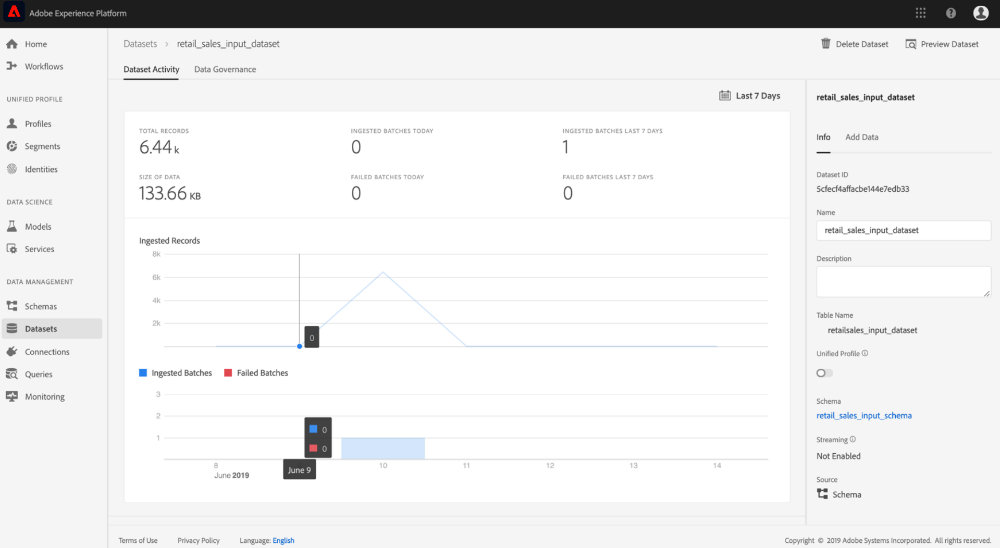
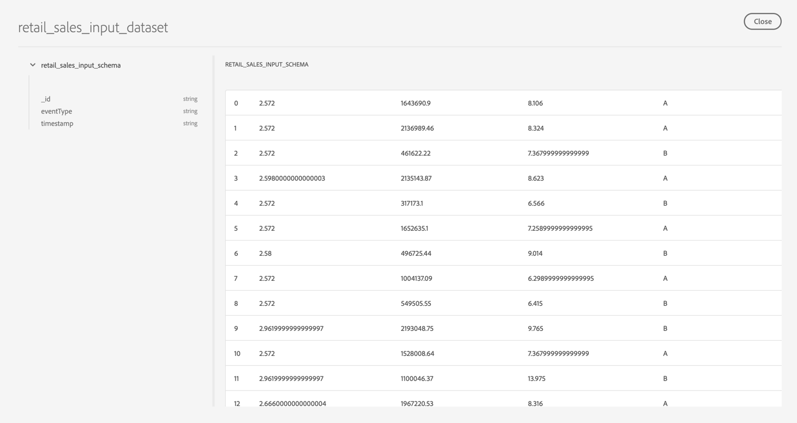

# Schema und Datensätze zu Vorschauen

Nach erfolgreichem Abschluss des Bootstrap-Skripts aus der Übung zum [Erstellen des Retail-Sales-Schemas und des Datasets](./create-retails-sales-dataset.md) . Output-Schema und -Datensätze können auf Experience Platform angezeigt werden. Gehen Sie zur Ansicht der Schema und Datensätze wie folgt vor:

1. Klicken Sie in der linken Navigationsspalte auf den Link &quot; **[!UICONTROL Schema]** &quot;und suchen Sie das vom Bootstrap-Schema erstellte Eingabedatum. Der Name des Schemas entspricht dem, was im vorherigen Schritt `config.yaml` definiert wurde. Ansicht der Schema-Details und die Komposition durch Klicken darauf.

   

2. Klicken Sie in der linken Navigationsspalte auf den Link **[!UICONTROL Datasets]** und öffnen Sie das Eingabedataset, das durch Klicken auf den Namen der Auflistung erstellt wurde. Der Name des Datensatzes entspricht dem, was im vorherigen Schritt `config.yaml` definiert wurde.

   

3. Klicken Sie oben rechts in der Vorschau auf **[!UICONTROL Vorschau Dataset]** , eine Untergruppe des Datensatzes.

   

## Nächste Schritte

Sie haben jetzt mit dem bereitgestellten Bootstrap-Skript erfolgreich Musterdaten zum Einzelhandelsverkauf in Experience Platform erfasst.

So arbeiten Sie weiter mit den erfassten Daten:
- [Analysieren Ihrer Daten mit Jupyter-Notebooks](../jupyterlab/analyze-your-data.md)
   - Verwenden Sie Jupyter-Notebooks in Data Science Workspace, um auf Ihre Daten zuzugreifen, sie zu untersuchen, sie zu visualisieren und zu verstehen.
- [Verpacken von Quelldateien in einem Rezept](./package-source-files-recipe.md)
   - In diesem Lernprogramm erfahren Sie, wie Sie Ihr eigenes Modell in den Data Science Workspace bringen, indem Sie Quelldateien in einer wichtigen Recipe-Datei verpacken.