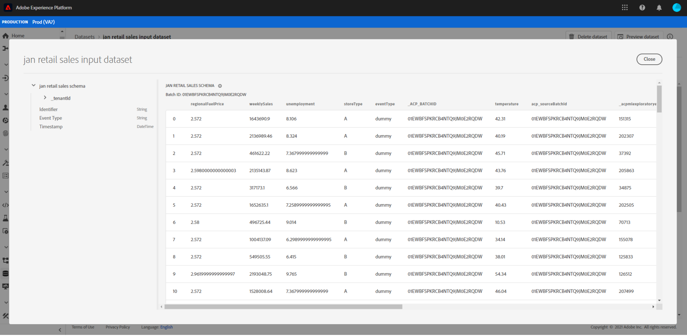

# Vorschau des Einzelhandelsschemas und -datensatzes

>[!NOTE]
>
>Data Science Workspace ist nicht mehr erhältlich.
>
>Diese Dokumentation richtet sich an Bestandskunden mit vorherigen Berechtigungen für Data Science Workspace.

Nach erfolgreichem Abschluss des Bootstrap-Skripts aus dem Tutorial zum [Einzelhandelsschema und -datensatz](./create-retails-sales-dataset.md). Ausgabeschemas und -datensätze können auf [!DNL Experience Platform] angezeigt werden. Gehen Sie zur Anzeige der Schemata und Datensätze wie folgt vor:

Wählen Sie im linken Navigationsbereich die Registerkarte **[!UICONTROL Schemas]** aus und suchen Sie das vom Bootstrap-Skript erstellte Eingabeschema. Der Name des Schemas entspricht dem, der im vorherigen Schritt unter `config.yaml` definiert wurde. Zeigen Sie die Schemadetails und deren Komposition an, indem Sie darauf klicken.

Wählen Sie im linken Navigationsbereich die Registerkarte **[!UICONTROL Datensätze]** aus und öffnen Sie den Eingabedatensatz, der durch Auswahl des Datensatznamens erstellt wurde. Der Name des Datensatzes entspricht dem, der im vorherigen Schritt in `config.yaml` definiert wurde.

Wählen Sie oben rechts **[!UICONTROL Datensatz-Vorschau anzeigen]** aus, um eine Teilmenge des Datensatzes in der Vorschau anzuzeigen.

## Nächste Schritte

Sie haben jetzt mit dem bereitgestellten Bootstrap-Skript erfolgreich Beispieldaten für Einzelhandelsumsätze in [!DNL Experience Platform] erfasst.

So arbeiten Sie weiter mit den aufgenommenen Daten:
- [Daten mit Jupyter Notebooks analysieren](../jupyterlab/analyze-your-data.md)
   - Verwenden Sie Jupyter Notebooks in [!DNL Data Science Workspace] , um auf Ihre Daten zuzugreifen, sie zu untersuchen, sie zu visualisieren und zu verstehen.
- [Quelldateien in einem Rezept verpacken](./package-source-files-recipe.md)
   - In diesem Tutorial erfahren Sie, wie Sie Ihr eigenes Modell in [!DNL Data Science Workspace] bringen, indem Sie Quelldateien in einer wichtigen Rezeptdatei verpacken.
