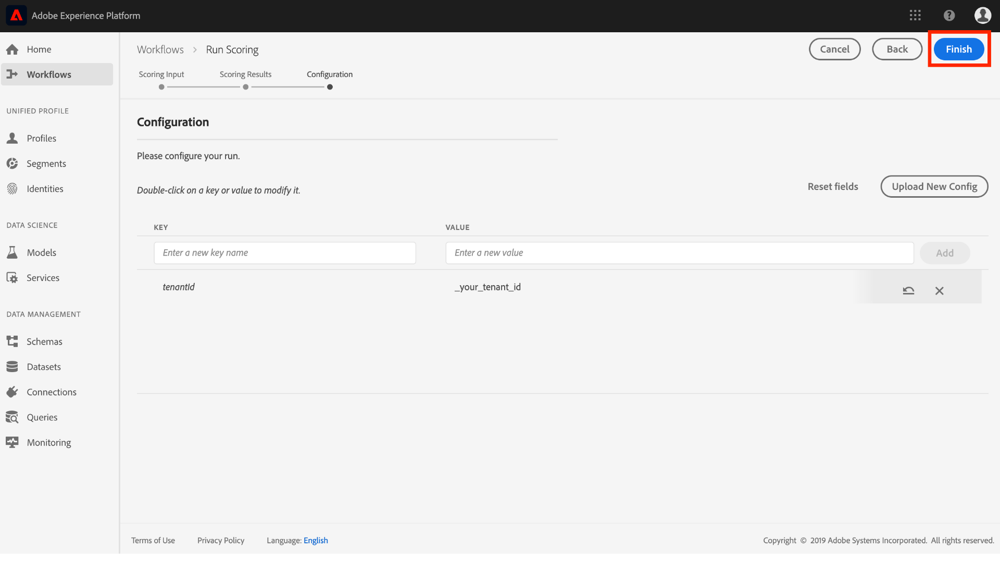

# Veröffentlichen eines Modells als Dienst (Benutzeroberfläche)

Mit dem Data Science Workspace der Adobe Experience Platform können Sie Ihr geschultes und ausgewertetes Modell als Service veröffentlichen, sodass Benutzer innerhalb Ihrer IMS-Organisation Daten bewerten können, ohne eigene Modelle erstellen zu müssen.

Dieses Lernprogramm führt Sie durch die Schritte, um ein Modell als Dienst zu veröffentlichen und Daten mithilfe eines Dienstes in der *Service Gallery* zu bewerten. Er ist in die folgenden Hauptabschnitte unterteilt:

- [Veröffentlichen eines Modells](#publish-a-model)
- [Ergebnis mit einem Dienst](#access-a-service)

## Erste Schritte

Um dieses Lernprogramm abzuschließen, müssen Sie Zugriff auf die Erlebnisplattform haben. Wenn Sie keinen Zugriff auf eine IMS-Organisation in Experience Platform haben, wenden Sie sich an Ihren Systemadministrator, bevor Sie fortfahren.

Dieses Lernprogramm erfordert ein vorhandenes Modell mit einem erfolgreichen Schulungslauf. Wenn Sie über kein publizierbares Modell verfügen, führen Sie den [Zug aus und bewerten Sie ein Modell im UI](./train-evaluate-model-ui.md) -Lernprogramm, bevor Sie fortfahren.

Wenn Sie ein Modell mithilfe von Sensei Machine Learning APIs veröffentlichen möchten, lesen Sie das [API-Lernprogramm](./publish-model-service-api.md).

## Veröffentlichen eines Modells {#publish-a-model}

1. Klicken Sie in Adobe Experience Platform auf den Link **[!UICONTROL Modelle]** in der linken Navigationsspalte, um alle vorhandenen Modelle Liste. Suchen Sie nach dem Namen des Modells, das als Dienst veröffentlicht werden soll, und klicken Sie darauf.
   
2. Klicken Sie auf **[!UICONTROL Veröffentlichen]** oben rechts auf der Modellübersichtsseite, um einen Diensterstellungsprozess Beginn.
   
3. Geben Sie einen gewünschten Namen für den Dienst ein und geben Sie optional eine Dienstbeschreibung ein. Klicken Sie nach Abschluss des Vorgangs auf **[!UICONTROL Weiter]** .
   
4. Alle erfolgreichen Schulungen zum Modell werden aufgelistet. Der neue Dienst übernimmt die Trainings- und Bewertungskonfigurationen aus dem ausgewählten Schulungslauf.
   
5. Klicken Sie auf **[!UICONTROL Fertig stellen]** , um den Dienst zu erstellen und zur **[!UICONTROL Dienstgalerie]** umzuleiten, um alle verfügbaren Dienste einschließlich des neu erstellten Dienstes anzuzeigen.
   

## Ergebnis mit einem Dienst {#access-a-service}

1. Klicken Sie in Adobe Experience Platform auf die Registerkarte **[!UICONTROL Dienste]** in der linken Navigationsspalte, um auf die *Dienstgalerie* zuzugreifen. Suchen Sie den gewünschten Dienst und klicken Sie auf **[!UICONTROL Ergebnis]**.
   
2. Wählen Sie einen entsprechenden Eingabedatensatz für die Bewertungsausführung und klicken Sie dann auf **[!UICONTROL Weiter]**.
   
3. Wählen Sie einen entsprechenden Ausgabedatensatz für die Bewertungsergebnisse und klicken Sie dann auf **[!UICONTROL Weiter]**.
   
4. Wenn ein Dienst erstellt wird, übernimmt er die standardmäßigen Scoring-Konfigurationen. Sie können diese Konfigurationen überprüfen und nach Bedarf anpassen, indem Sie mit der Dublette auf die Werte klicken. Wenn Sie mit den Konfigurationen zufrieden sind, klicken Sie auf **[!UICONTROL Fertig stellen]** , um den Bewertungsvorgang zu starten.
   
5. Auf der Seite &quot; *Übersicht* &quot;des Dienstes werden Details zum neuen Bewertungsauftrag und dessen Fortschritt angezeigt. Nach Abschluss des Auftrags wird der **[!UICONTROL letzte]** Bewertungsauftrag aktualisiert.
   

## Nächste Schritte {#next-steps}

In diesem Tutorial haben Sie erfolgreich ein Modell als barrierefreier Dienst veröffentlicht und Daten mithilfe des neuen Dienstes über die *Service Gallery* erfasst. Fahren Sie mit dem nächsten Lernprogramm fort, um zu erfahren, wie Sie automatisierte Schulungs- und Bewertungsläufe für einen Dienst [planen können](./schedule-models-ui.md).
