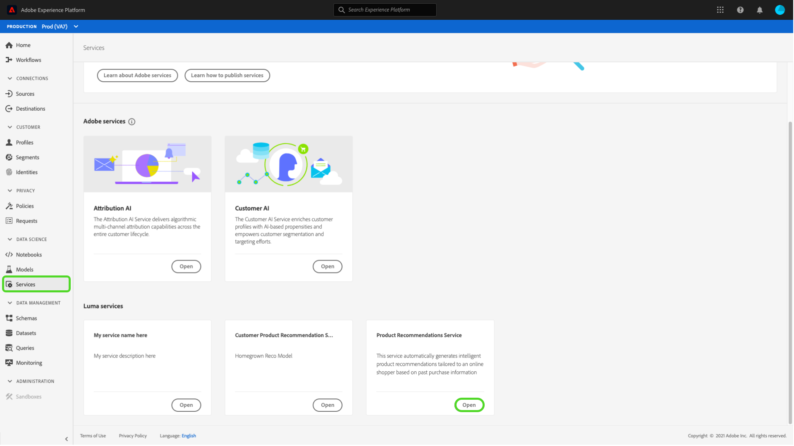

# Veröffentlichen eines Modells als Dienst in der Benutzeroberfläche von Data Science Workspace

Mit dem Adobe Experience Platform Data Science Workspace können Sie Ihr trainiertes und bewertetes Modell als Service veröffentlichen, damit Benutzer in Ihrer IMS-Organisation Daten bewerten können, ohne eigene Modelle erstellen zu müssen.

## Erste Schritte

Um dieses Tutorial abzuschließen, benötigen Sie Zugriff auf [!DNL Experience Platform]. Wenn Sie keinen Zugriff auf eine IMS-Organisation in [!DNL Experience Platform] haben, wenden Sie sich bitte an Ihren Systemadministrator, bevor Sie fortfahren.

Diese Anleitung setzt ein vorhandenes Modell mit einem erfolgreichen Trainings-Lauf voraus. Wenn Sie über kein veröffentlichungsfähiges Modell verfügen, führen Sie die Anleitung [Modell in der Benutzeroberfläche trainieren und bewerten](./train-evaluate-model-ui.md) aus, bevor Sie fortfahren.

Wenn Sie ein Modell lieber mithilfe von Sensei Machine Learning-APIs veröffentlichen möchten, lesen Sie die [API-Anleitung](./publish-model-service-api.md).

## Modell veröffentlichen {#publish-a-model}

Wählen Sie in Adobe Experience Platform **[!UICONTROL Modelle]** in der linken Navigationsspalte aus und wählen Sie dann die Registerkarte **[!UICONTROL Durchsuchen]**, um alle vorhandenen Modelle Liste. Wählen Sie den Namen des Modells aus, das als Dienst veröffentlicht werden soll.

Wählen Sie **[!UICONTROL Publish]** oben rechts auf der Modellübersichtsseite aus, um einen Diensterstellungsprozess Beginn.

Geben Sie einen gewünschten Namen für den Dienst ein und geben Sie optional eine Dienstbeschreibung ein. Wählen Sie danach **[!UICONTROL Weiter]** aus.

Alle erfolgreichen Trainings-Läufe für das Modell werden aufgelistet. Der neue Service übernimmt die Trainings- und Scoring-Konfigurationen aus dem ausgewählten Trainings-Lauf.

Wählen Sie **[!UICONTROL Fertig stellen]**, um den Dienst zu erstellen und zur **[!UICONTROL Dienstgalerie]** umzuleiten, um alle verfügbaren Dienste einschließlich des neu erstellten Dienstes anzuzeigen.

## Mit einem Service bewerten {#access-a-service}

Wählen Sie in Adobe Experience Platform in der linken Navigationsspalte die Registerkarte **[!UICONTROL Dienste]**, um auf die **[!UICONTROL Dienstgalerie]** zuzugreifen. Suchen Sie den gewünschten Dienst und wählen Sie **[!UICONTROL Öffnen]**.

Wählen Sie auf der Übersichtsseite des Dienstes **[!UICONTROL Ergebnis]**.

Wählen Sie einen entsprechenden Eingabedatensatz für die Bewertungsausführung und dann **[!UICONTROL Weiter]**. Sie werden aufgefordert, denselben Schritt für den Bewertungsdatensatz zu tun. Nachdem Sie den Eingabe- und Ausgabedatensatz ausgewählt haben, können Sie die Konfigurationen aktualisieren.

Wenn ein Service erstellt wird, übernimmt er die standardmäßigen Scoring-Konfigurationen. Sie können diese Konfigurationen überprüfen und nach Bedarf anpassen, indem Sie auf die Werte doppelklicken. Wenn Sie mit den Konfigurationen zufrieden sind, wählen Sie **[!UICONTROL Fertig stellen]**, um den Bewertungsvorgang zu starten.

Auf der Seite **Übersicht** des Services werden Details zum neuen Scoring-Auftrag und zu dessen Fortschritt angezeigt. Nach Abschluss des Auftrags wird die Kopfzeile **[!UICONTROL Zuletzt verwendet]** im Container **[!UICONTROL Punktwertung]** aktualisiert.

## Nächste Schritte {#next-steps}

In diesem Tutorial haben Sie erfolgreich ein Modell als aufrufbaren Service veröffentlicht und mithilfe des neuen Services Daten über die [!UICONTROL Service Gallery] bewertet. Fahren Sie mit der nächsten Anleitung fort, um zu erfahren, wie Sie [automatisierte Trainings- und Scoring-Läufe für einem Service planen](./schedule-models-ui.md) können.
