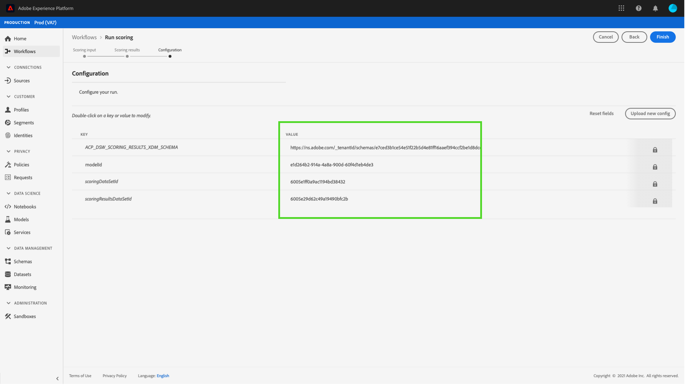

# Veröffentlichen eines Modells als Service in der Benutzeroberfläche des Datenwissenschafts-Arbeitsbereichs {#publish-a-model-as-a-service}

>[!NOTE]
>
>Data Science Workspace ist nicht mehr erhältlich.
>
>Diese Dokumentation richtet sich an Bestandskunden mit vorherigen Berechtigungen für Data Science Workspace.

>[!CONTEXTUALHELP]
>id="platform_intelligentservices_publishmodel"
>title="Veröffentlichen eines Modells als Service"
>abstract=""

Mit Adobe Experience Platform Data Science Workspace können Sie Ihr trainiertes und evaluiertes Modell als Service veröffentlichen, sodass Benutzende in Ihrem Unternehmen Daten bewerten können, ohne eigene Modelle erstellen zu müssen.

## Erste Schritte

Um dieses Tutorial abzuschließen, benötigen Sie Zugriff auf [!DNL Experience Platform]. Wenn Sie in [!DNL Experience Platform] keinen Zugriff auf eine Organisation haben, wenden Sie sich an Ihren Systemadministrator, bevor Sie fortfahren.

Diese Anleitung setzt ein vorhandenes Modell mit einem erfolgreichen Trainings-Lauf voraus. Wenn Sie über kein veröffentlichungsfähiges Modell verfügen, führen Sie die Anleitung [Modell in der Benutzeroberfläche trainieren und auswerten](./train-evaluate-model-ui.md) aus, bevor Sie fortfahren.

Wenn Sie ein Modell lieber mithilfe von Sensei Machine Learning-APIs veröffentlichen möchten, lesen Sie die [API-Anleitung](./publish-model-service-api.md).

## Modell veröffentlichen {#publish-a-model}

Wählen Sie in Adobe Experience Platform **[!UICONTROL Modelle]** in der linken Navigationsspalte und wählen Sie dann die Registerkarte **[!UICONTROL Durchsuchen]**, um alle vorhandenen Modelle aufzulisten. Wählen Sie den Namen des Modells aus, das als Service veröffentlicht werden soll.

Wählen Sie **[!UICONTROL Veröffentlichen]** oben rechts auf der Seite Modellübersicht aus, um einen Service-Erstellungsprozess zu starten.

Geben Sie einen gewünschten Namen für den Service ein und geben Sie optional eine Service-Beschreibung ein. Wählen Sie **[!UICONTROL Weiter]** wenn Sie fertig sind.

Alle erfolgreichen Trainings-Läufe für das Modell werden aufgelistet. Der neue Service übernimmt die Trainings- und Scoring-Konfigurationen aus dem ausgewählten Trainings-Lauf.

Wählen Sie **[!UICONTROL Beenden]** aus, um den Service zu erstellen, und leiten Sie ihn zur **[!UICONTROL Service-Galerie]** um, um alle verfügbaren Services anzuzeigen, einschließlich des neu erstellten Services.

## Mit einem Service bewerten {#access-a-service}

Wählen Sie in Adobe Experience Platform die Registerkarte **[!UICONTROL Services]** in der linken Navigationsspalte aus, um auf die **[!UICONTROL Service-Galerie]** zuzugreifen. Suchen Sie den Service, den Sie verwenden möchten, und wählen Sie **[!UICONTROL Öffnen]**.

Wählen Sie auf der Seite „Service-Übersicht **[!UICONTROL die Option „Score]** aus.

Wählen Sie einen entsprechenden Eingabedatensatz für den Scoring-Durchgang aus und klicken Sie dann auf **[!UICONTROL Weiter]**. Sie werden aufgefordert, denselben Schritt für den Bewertungsdatensatz auszuführen. Nachdem Sie den Eingabe- und Ausgabedatensatz ausgewählt haben, können Sie die Konfigurationen aktualisieren.

Wenn ein Service erstellt wird, übernimmt er die standardmäßigen Scoring-Konfigurationen. Sie können diese Konfigurationen überprüfen und nach Bedarf anpassen, indem Sie auf die Werte doppelklicken. Wenn Sie mit den Konfigurationen zufrieden sind, wählen Sie **[!UICONTROL Beenden]**, um den Scoring-Durchgang zu starten.

Auf der Seite **Übersicht** des Services werden Details zum neuen Scoring-Auftrag und zu dessen Fortschritt angezeigt. Sobald der Auftrag abgeschlossen ist **[!UICONTROL wird die]** „Zuletzt verwendet“ im **[!UICONTROL Scoring]**-Container aktualisiert.

## Nächste Schritte {#next-steps}

In diesem Tutorial haben Sie erfolgreich ein Modell als aufrufbaren Service veröffentlicht und mithilfe des neuen Services Daten über die [!UICONTROL Service Gallery] bewertet. Fahren Sie mit der nächsten Anleitung fort, um zu erfahren, wie Sie [automatisierte Trainings- und Scoring-Läufe für einem Service planen](./schedule-models-ui.md) können.
