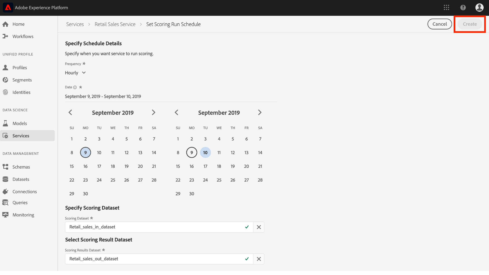

# Planen eines Modells (Benutzeroberfläche)

Mit der Adobe Experience Platform [!DNL Data Science Workspace] können Sie geplante Scoring- und Schulungsläufe auf einem maschinellen Lerndienst einrichten. Die Automatisierung des Schulungs- und Bewertungsvorgangs kann dazu beitragen, die Effizienz eines Dienstes im Laufe der Zeit zu erhalten und zu verbessern, indem Sie die Muster in Ihren Daten beibehalten.

Dieses Tutorial führt Sie durch die Schritte, um Schulungs- und Bewertungszeitpläne für einen vorhandenen Dienst zu konfigurieren, durch die *[!UICONTROL Service Gallery]*. Er ist in die folgenden Hauptabschnitte unterteilt:

- [Geplante Bewertung konfigurieren](#configure-scheduled-scoring)
- [Planmäßige Schulungen konfigurieren](#configure-scheduled-training)

## Erste Schritte

Um dieses Lernprogramm abzuschließen, müssen Sie Zugriff auf [!DNL Experience Platform]. Wenn Sie keinen Zugriff auf eine IMS-Organisation in haben, wenden Sie sich an Ihren Systemadministrator, [!DNL Experience Platform]bevor Sie fortfahren.

Für dieses Lernprogramm ist ein bestehender Dienst erforderlich. Wenn Sie keinen verfügbaren Dienst haben, mit dem Sie arbeiten können, können Sie einen Dienst erstellen, indem Sie im Tutorial &quot;Benutzeroberfläche [&quot;auf &quot;Modell als Dienst](./publish-model-service-ui.md) veröffentlichen&quot;folgen.

## Geplante Bewertung konfigurieren {#configure-scheduled-scoring}

Modellauswertung kann als automatisierter Prozess auf geplanter Basis konfiguriert werden. Nachdem ein Dienst erstellt wurde, können Sie die folgenden Schritte ausführen, um einen Bewertungszeitplan zu konfigurieren und anzuwenden:

1. Klicken Sie in Adobe Experience Platform auf die Registerkarte **[!UICONTROL Dienste]** in der linken Navigationsspalte, um auf die *[!DNL Service Gallery]*. Suchen Sie den Dienst, auf dem Sie die Bewertung planen möchten, und klicken Sie auf **[!UICONTROL Öffnen]** , um die zugehörige *Übersichtsseite* Ansicht.
   

2. Auf der Seite Überblick werden die Bewertungsinformationen des Dienstes angezeigt. Klicken Sie auf den Link Plan **[!UICONTROL aktualisieren]** , um einen Bewertungszeitplan zu konfigurieren.
   

3. Konfigurieren Sie Häufigkeit, Beginn, Enddatum, Eingabedatensatz und Ausgabedatensatz für den Bewertungszeitplan. Wenn Sie mit den Konfigurationen zufrieden sind, klicken Sie auf **[!UICONTROL Erstellen]** , um den Zeitplan für die Bewertung des Dienstes zu aktualisieren.
   

4. Ihr aktualisierter Bewertungszeitplan wird auf der Seite *Übersicht* des Dienstes angezeigt.
   

## Planmäßige Schulungen konfigurieren {#configure-scheduled-training}

Die Konfiguration geplanter Schulungen wird auf einem Dienst ausgeführt, um sicherzustellen, dass das Modell für maschinelles Lernen auf die neuesten Datenmuster aktualisiert wird. Bei jedem Abschluss eines geplanten Schulungslaufs wird das resultierende trainierte Modell verwendet, um den Dienst bis zum nächsten geplanten Schulungslauf zu aktivieren.

Nachdem ein Dienst erstellt wurde, können Sie die folgenden Schritte ausführen, um einen Schulungsplan zu konfigurieren und anzuwenden:

1. Klicken Sie in Adobe Experience Platform auf die Registerkarte **[!UICONTROL Dienste]** in der linken Navigationsspalte, um auf die *[!UICONTROL Dienstgalerie]* zuzugreifen. Suchen Sie den Dienst, auf dem Sie Schulungen planen möchten, und klicken Sie auf **[!UICONTROL Öffnen]** , um die zugehörige *Übersichtsseite* Ansicht.
   

2. Auf der Seite Überblick werden die Schulungsinformationen des Dienstes angezeigt. Klicken Sie auf den Link &quot;Zeitplan **[!UICONTROL aktualisieren&quot;]** , um einen Schulungsplan zu konfigurieren.
   

3. Konfigurieren Sie die Häufigkeit, das Beginn, das Enddatum und den Eingabedatensatz, die für den Schulungsplan verwendet werden. Wenn Sie mit den Konfigurationen zufrieden sind, klicken Sie auf **[!UICONTROL Erstellen]** , um den Schulungsplan des Dienstes zu aktualisieren.
   

4. Ihr aktualisierter Schulungsplan wird auf der Seite *Übersicht* des Dienstes angezeigt.
   

## Nächste Schritte

Durch Befolgen dieses Lernprogramms haben Sie die automatische Schulung und Auswertung für einen Dienst erfolgreich geplant und den Arbeitsablauf für die Benutzeroberfläche des [!DNL Data Science Workspace] Lernprogramms abgeschlossen. Wenn Sie dies noch nicht getan haben, können Sie das Lernprogramm [neu starten](./create-retails-sales-dataset.md) und dem API-Arbeitsablauf folgen, um ein Modell zu erstellen, auszubilden, zu bewerten und zu veröffentlichen.
