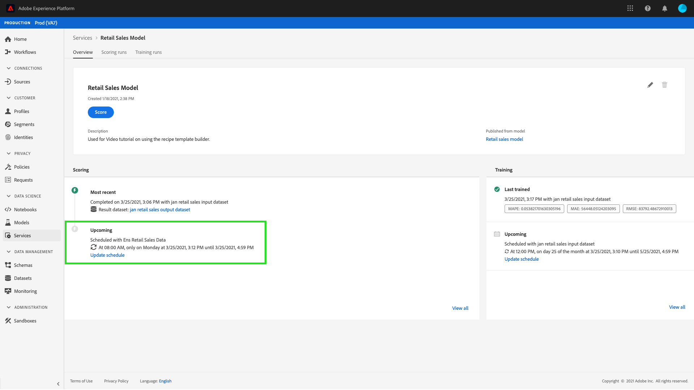
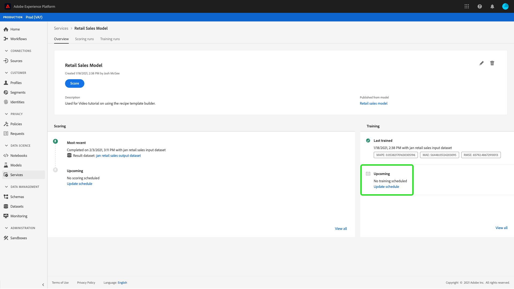

# Planen eines Modells in der Benutzeroberfläche von Data Science Workspace

Adobe Experience Platform [!DNL Data Science Workspace] können Sie geplante Scoring- und Trainings-Läufe für einen Dienst für maschinelles Lernen einrichten. Die Automatisierung des Trainings- und Scoring-Prozesses kann dazu beitragen, die Effizienz eines Dienstes im Laufe der Zeit zu erhalten und zu verbessern, indem Sie mit den Mustern in Ihren Daten Schritt halten.

In diesem Tutorial werden die Schritte zum Konfigurieren von Trainings- und Scoring-Zeitplänen für einen vorhandenen Dienst durch die [!UICONTROL Service Gallery]. Es ist in die folgenden Hauptabschnitte unterteilt:

- [Geplantes Scoring konfigurieren](#configure-scheduled-scoring)
- [Geplantes Training konfigurieren](#configure-scheduled-training)

## Erste Schritte

Um dieses Tutorial abzuschließen, benötigen Sie Zugriff auf [!DNL Experience Platform]. Wenn Sie keinen Zugriff auf eine IMS-Organisation in [!DNL Experience Platform]Wenden Sie sich an Ihren Systemadministrator, bevor Sie fortfahren.

Für dieses Tutorial ist ein vorhandener Dienst erforderlich. Wenn Sie keinen barrierefreien Dienst haben, mit dem Sie arbeiten können, können Sie einen erstellen, indem Sie dem Tutorial für [Veröffentlichen eines Modells als Dienst](./publish-model-service-ui.md).

## Geplantes Scoring konfigurieren {#configure-scheduled-scoring}

Das Modell-Scoring kann als automatisierter Prozess auf geplanter Basis konfiguriert werden. Nachdem ein Dienst erstellt wurde, können Sie die folgenden Schritte ausführen, um einen Scoring-Zeitplan zu konfigurieren und anzuwenden:

Wählen Sie in Adobe Experience Platform die **[!UICONTROL Dienste]** in der linken Navigationsspalte, um auf die **[!DNL Service Gallery]**. Suchen Sie den Dienst, für den Sie Scoring-Läufe planen möchten, und wählen Sie **[!UICONTROL Öffnen]** um **[!UICONTROL Übersicht]** Seite.

Auf der Übersichtsseite werden die Scoring-Informationen des Diensts angezeigt. Wählen Sie die **[!UICONTROL Zeitplan aktualisieren]** -Link, um einen Scoring-Zeitplan zu konfigurieren.

Konfigurieren Sie die Häufigkeit, das Anfangsdatum, das Enddatum, den Eingabedatensatz und den Ausgabedatensatz für den Scoring-Zeitplan. Wenn Sie mit den Konfigurationen zufrieden sind, wählen Sie **[!UICONTROL Erstellen]** , um den Scoring-Zeitplan des Dienstes zu aktualisieren.

Ihr aktualisierter Scoring-Zeitplan wird im Dienst angezeigt. **[!UICONTROL Übersicht]** Seite.

## Geplantes Training konfigurieren {#configure-scheduled-training}

Durch die Konfiguration geplanter Trainings-Läufe für einen Dienst wird sichergestellt, dass das Modell für maschinelles Lernen auf die neuesten Datenmuster aktualisiert wird. Bei jedem Abschluss eines geplanten Trainings-Laufs wird das resultierende trainierte Modell verwendet, um den Dienst bis zum nächsten geplanten Trainings-Lauf zu unterstützen.

Nachdem ein Dienst erstellt wurde, können Sie die folgenden Schritte ausführen, um einen Trainings-Zeitplan zu konfigurieren und anzuwenden:

Wählen Sie in Adobe Experience Platform die **[!UICONTROL Dienste]** in der linken Navigationsspalte, um auf die **[!UICONTROL Service Gallery]**. Suchen Sie den Dienst, für den Sie Trainings-Läufe planen möchten, und wählen Sie **[!UICONTROL Öffnen]** um **[!UICONTROL Übersicht]** Seite.

Auf der Seite Übersicht werden die Trainings-Informationen des Dienstes angezeigt. Wählen Sie die **[!UICONTROL Zeitplan aktualisieren]** Link zum Konfigurieren eines Trainings-Zeitplans.

Konfigurieren Sie die Häufigkeit, das Anfangsdatum, das Enddatum und den Eingabedatensatz, die für den Trainings-Zeitplan verwendet werden sollen. Wenn Sie mit den Konfigurationen zufrieden sind, wählen Sie **[!UICONTROL Erstellen]** , um den Trainings-Zeitplan des Dienstes zu aktualisieren.

Ihr aktualisierter Trainings-Zeitplan wird im Abschnitt **[!UICONTROL Übersicht]** Seite.

## Nächste Schritte

In diesem Tutorial haben Sie erfolgreich automatisierte Trainings- und Scoring-Läufe für einen Dienst geplant und die [!DNL Data Science Workspace] Tutorial-UI-Arbeitsablauf. Wenn Sie dies noch nicht getan haben, sollten Sie [Neustarten des Tutorials](./create-retails-sales-dataset.md) und folgen Sie dem API-Workflow, um ein Modell zu erstellen, zu trainieren, zu bewerten und zu veröffentlichen.
