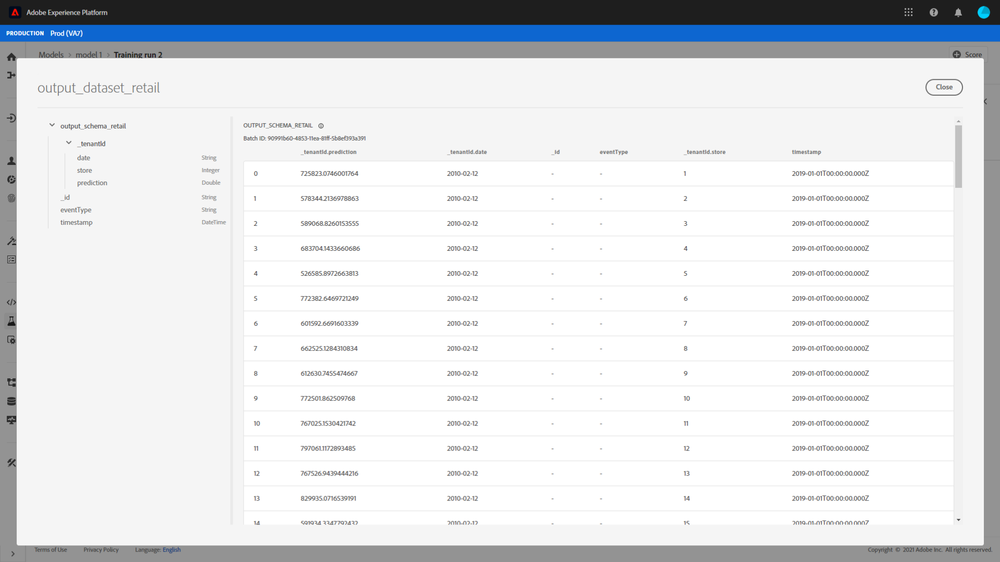

# Modellbewertung in der Benutzeroberfläche von Data Science Workspace

Die Punktzahl in Adobe Experience Platform [!DNL Data Science Workspace] lässt sich erreichen, indem Eingabedaten in ein vorhandenes geschultes Modell eingespeist werden. Scoring-Ergebnisse werden dann als neuer Batch in einem angegebenen Ausgabedatensatz gespeichert und angezeigt.

In diesem Lernprogramm werden die Schritte erläutert, die erforderlich sind, um ein Modell in der [!DNL Data Science Workspace]-Benutzeroberfläche zu bewerten.

## Erste Schritte

Um dieses Tutorial abzuschließen, benötigen Sie Zugriff auf [!DNL Experience Platform]. Wenn Sie keinen Zugriff auf eine IMS-Organisation in [!DNL Experience Platform] haben, wenden Sie sich bitte an Ihren Systemadministrator, bevor Sie fortfahren.

Diese Anleitung setzt ein trainiertes Modell voraus. Wenn Sie noch kein trainiertes Modell haben, folgen Sie der Anleitung zum [Trainieren und Bewerten eines Modells in der Benutzeroberfläche](./train-evaluate-model-ui.md), bevor Sie fortfahren.

## Neuen Scoring-Lauf erstellen

Ein Scoring-Lauf wird mithilfe optimierter Konfigurationen aus einem zuvor abgeschlossenen und ausgewerteten Trainings-Lauf erstellt. Der Satz optimaler Konfigurationen für ein Modell wird in der Regel durch Überprüfen der Auswertungsmetriken für Trainings-Läufe bestimmt.

Finden Sie den optimalen Training-Lauf, um dessen Konfigurationen für das Scoring zu nutzen. Öffnen Sie dann die gewünschte Schulung, indem Sie den Hyperlink zum Namen auswählen.

Wählen Sie auf der Registerkarte **[!UICONTROL Evaluierung]** die Option **[!UICONTROL Ergebnis]** oben rechts im Bildschirm aus. Ein neuer Bewertungsarbeitsablauf beginnt.

Wählen Sie den Eingabesortierungsdataset aus und wählen Sie **[!UICONTROL Weiter]**.

Wählen Sie den Ergebnis-Scoring-Datensatz aus. Hierbei handelt es sich um den dedizierten Ausgabedatensatz, in dem die Scoring-Ergebnisse gespeichert werden. Bestätigen Sie Ihre Auswahl und wählen Sie **[!UICONTROL Weiter]**.

Im letzten Schritt des Workflows werden Sie aufgefordert, Ihren Scoring-Lauf zu konfigurieren. Diese Konfigurationen werden vom Modell für die Bewertungsausführung verwendet.
Beachten Sie, dass Sie geerbte Parameter, die bei der Modellerstellung festgelegt wurden, nicht entfernen können. Sie können nicht geerbte Parameter bearbeiten oder wiederherstellen, indem Sie die Dublette auf den Wert klicken oder das Symbol zum Zurücksetzen auswählen, während Sie den Mauszeiger über den Eintrag halten.

Überprüfen Sie die Bewertungskonfigurationen und bestätigen Sie sie und wählen Sie **[!UICONTROL Fertigstellen]**, um die Bewertungsausführung zu erstellen und auszuführen. Sie werden zum Register **[!UICONTROL Scoring Runs]** weitergeleitet und die neue Scoring-Ausführung mit dem Status **[!UICONTROL Ausstehend]** wird angezeigt.

Eine Bewertungsausführung kann mit einem der folgenden Status angezeigt werden:
- Ausstehend
- Abgeschlossen
- Fehlgeschlagen
- Wird ausgeführt

Status werden automatisch aktualisiert. Fahren Sie mit dem nächsten Schritt fort, wenn der Status **[!UICONTROL Complete]** oder **[!UICONTROL Fehlgeschlagen]** ist.

## Scoring-Ergebnisse anzeigen

Zur Ansicht der Bewertungsergebnisse wählen Sie einen Beginn aus.

Sie werden zu der Seite **[!UICONTROL Evaluierung]** umgeleitet. Wählen Sie oben auf der Seite zur Evaluierung der Schulungslaufausführung die Registerkarte **[!UICONTROL Bewertungsläufe]** aus, um eine Liste der vorhandenen Testläufe Ansicht.

Wählen Sie anschließend einen Bewertungslauf aus, um die Ausführungsdetails Ansicht.

Wenn der ausgewählte Bewertungslauf entweder den Status &quot;Complete&quot;oder &quot;Failure&quot;hat, wird der Link **[!UICONTROL Ansicht Aktivität Logs]** verfügbar gemacht. Wenn eine Bewertungsausführung fehlschlägt, können die Ausführungsprotokolle nützliche Informationen zur Bestimmung des Fehlerursprungs liefern. Um die Ausführungsprotokolle herunterzuladen, wählen Sie **[!UICONTROL Ansicht Aktivität Logs]**.

Das Popup **[!UICONTROL Ansicht Aktivität logs]** wird angezeigt. Wählen Sie eine URL aus, um die zugehörigen Protokolle automatisch herunterzuladen.

Sie haben auch die Möglichkeit, Ihre Bewertungsergebnisse Ansicht, indem Sie **[!UICONTROL Vorschau Scoring results dataset]** auswählen.

Eine Vorschau des Ausgabedatasets wird bereitgestellt.

Wählen Sie für den vollständigen Satz der Bewertungsergebnisse den Link **[!UICONTROL Bewertungsergebnis-Datensatz]** in der rechten Spalte.

## Nächste Schritte

Dieses Lernprogramm begleitet Sie durch die Schritte, um Daten mit einem trainierten Modell in [!DNL Data Science Workspace] zu bewerten. Befolgen Sie die Anleitung zum [Publizieren eines Modells als Dienst in der Benutzeroberfläche](./publish-model-service-ui.md), damit Benutzer in Ihrer Organisation Daten bewerten können, indem sie einfachen Zugriff auf einen maschinellen Lerndienst erhalten.
