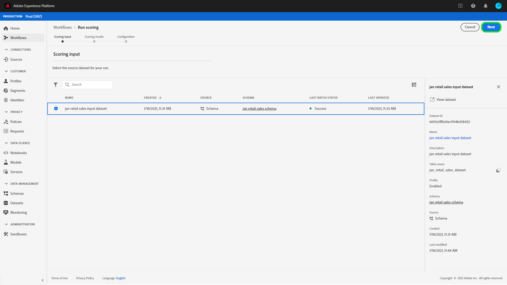

# Modellbewertung (UI)

Die Bewertung in der Adobe Experience Platform [!DNL Data Science Workspace] lässt sich durch die Einspeisung von Eingabedaten in ein vorhandenes geschultes Modell erzielen. Die Bewertungsergebnisse werden dann als neuer Stapel in einem angegebenen Ausgabedataset gespeichert und angezeigt.

In diesem Lernprogramm werden die Schritte erläutert, die erforderlich sind, um ein Modell in der [!DNL Data Science Workspace] Benutzeroberfläche zu bewerten.

## Erste Schritte

Um dieses Lernprogramm abzuschließen, müssen Sie Zugriff auf [!DNL Experience Platform]. Wenn Sie keinen Zugriff auf eine IMS-Organisation in haben, wenden Sie sich an Ihren Systemadministrator, [!DNL Experience Platform]bevor Sie fortfahren.

Dieses Lernprogramm erfordert ein geschultes Modell. Wenn Sie kein ausgebildetes Modell haben, folgen Sie dem [Zug und bewerten Sie ein Modell im UI](./train-evaluate-model-ui.md) -Lernprogramm, bevor Sie fortfahren.

## Erstellen eines neuen Bewertungslaufs

Eine Bewertungsausführung wird mithilfe optimierter Konfigurationen aus einem zuvor abgeschlossenen und ausgewerteten Schulungslauf erstellt. Der Satz der optimalen Konfigurationen für ein Modell wird in der Regel durch Überprüfen der Evaluierungsmetriken für Schulungsabbrüche bestimmt.

1. Finden Sie den optimalen Schulungsablauf, um seine Konfigurationen für die Bewertung zu verwenden. Öffnen Sie den gewünschten Schulungslauf, indem Sie auf dessen Namen klicken.

2. Klicken Sie auf der Registerkarte **[!UICONTROL Evaluierung]** der Schulungsausführung auf die Schaltfläche **[!UICONTROL Ergebnis]** oben rechts im Bildschirm. Dadurch wird ein neuer Arbeitsablauf *zum Ausführen der* Auswertung initiiert.
   

3. Wählen Sie den Eingabesortierungsdatensatz aus und klicken Sie auf **[!UICONTROL Weiter]**.
   

4. Wählen Sie den Ergebnisbewertungsdatensatz aus. Hierbei handelt es sich um den dedizierten Ausgabedatensatz, in dem die Bewertungsergebnisse gespeichert werden. Bestätigen Sie Ihre Auswahl und klicken Sie auf **[!UICONTROL Weiter]**.
   

5. Im letzten Schritt im Workflow werden Sie aufgefordert, Ihre Bewertungsausführung zu konfigurieren. Diese Konfigurationen werden vom Modell für die Bewertungsausführung verwendet.
Beachten Sie, dass Sie geerbte Parameter, die bei der Modellerstellung festgelegt wurden, nicht entfernen können. Sie können nicht geerbte Parameter bearbeiten oder wiederherstellen, indem Sie die Dublette auf den Wert klicken oder auf das Symbol zum Zurücksetzen klicken, während Sie den Mauszeiger über den Eintrag halten.
   
Überprüfen Sie die Bewertungskonfigurationen und bestätigen Sie sie und klicken Sie auf **[!UICONTROL Fertig stellen]** , um die Bewertungsausführung zu erstellen und auszuführen. Sie werden auf die Registerkarte *Scoring Runs* weitergeleitet, und der neue Scoring Run zeigt den Status an.
   
Bei einer Bewertungsausführung wird einer der vier folgenden Status angezeigt: Ausstehend, Abgeschlossen, Fehlgeschlagen oder Wird ausgeführt und werden automatisch aktualisiert. Fahren Sie mit dem nächsten Schritt fort, wenn der Status &quot;Abgeschlossen&quot;oder &quot;Fehlgeschlagen&quot;lautet.

## Ansichten-Bewertungsergebnisse

1. Suchen Sie nach dem Schulungslauf, der für die Bewertungsausführung verwendet wurde, und klicken Sie auf den Namen, um die **[!UICONTROL Evaluierungsseite]** Ansicht.

2. Klicken Sie oben auf der Seite zur Evaluierung der **[!UICONTROL Bewertungslaufzeit auf die Registerkarte &quot;Bewertungsläufe]** &quot;, um eine Liste der vorhandenen Testläufe Ansicht. Klicken Sie auf die Punktliste, um die Ansicht in der rechten Spalte zu erhalten.
   

3. Wenn der ausgewählte Bewertungslauf entweder den Status &quot;Abgeschlossen&quot;oder &quot;Fehlgeschlagen&quot;hat, ist der Link &quot;Protokolle **[!UICONTROL zur]** Ansicht&quot;in der rechten Spalte aktiv. Klicken Sie auf den Link zur Ansicht oder laden Sie die Ausführungsprotokolle herunter. Wenn eine Bewertungsausführung fehlgeschlagen ist, können die Ausführungsprotokolle nützliche Informationen zur Ermittlung des Fehlerursprungs liefern.
   

4. Klicken Sie in der rechten Spalte auf den Link **[!UICONTROL Vorschau Scoring Results Dataset]** . Sie können eine Vorschau des Ausgabedatasets aus der Bewertungsausführung sehen.
   

5. Klicken Sie für den vollständigen Satz der Bewertungsergebnisse auf den Link **[!UICONTROL Ergebnisdatensatz]** in der rechten Spalte.

## Nächste Schritte

Dieses Tutorial begleitet Sie durch die Schritte, um Daten mit einem geschulten Modell in zu bewerten [!DNL Data Science Workspace]. Befolgen Sie das Lernprogramm zum [Veröffentlichen eines Modells als Dienst in der Benutzeroberfläche](./publish-model-service-ui.md) , damit Benutzer in Ihrem Unternehmen Daten bewerten können, indem sie einfachen Zugriff auf einen maschinellen Lerndienst bieten.
