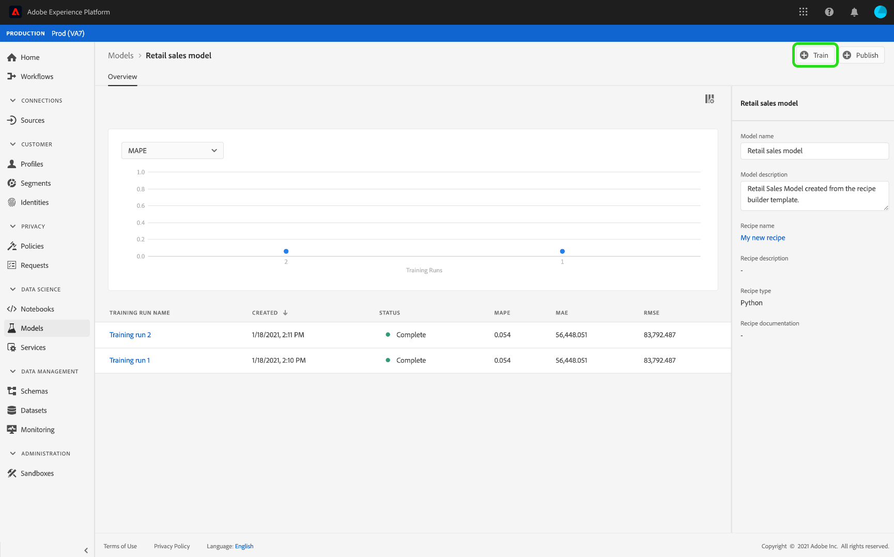

# Erstellen und Auswerten eines Modells in der Benutzeroberfläche von Data Science Workspace

In Adobe Experience Platform Data Science Workspace können Sie ein Modell für maschinelles Lernen einrichten, indem Sie ein vorhandenes Rezept einbinden, das für den Zweck des Modells geeignet ist. Anschließend wird das Modell trainiert und bewertet, um seine Effizienz und Wirksamkeit zu erhöhen; dazu werden die entsprechenden Hyperparameter fein abgestimmt. Rezepte sind wiederverwendbar; mit einem Rezept können also verschiedene Modelle erstellt und auf individuelle Zwecke zugeschnitten werden.

Dieses Tutorial leitet Sie durch die Schritte zum Erstellen, Trainieren und Bewerten eines Modells.

## Erste Schritte

Um dieses Tutorial abzuschließen, benötigen Sie Zugriff auf [!DNL Experience Platform]. Wenn Sie keinen Zugriff auf eine IMS-Organisation in [!DNL Experience Platform] haben, wenden Sie sich bitte an Ihren Systemadministrator, bevor Sie fortfahren.

Das Tutorial setzt ein vorhandenes Rezept voraus. Wenn Sie kein Rezept haben, befolgen Sie die Anweisungen im Tutorial zum [Importieren eines gepackten Rezepts in der UI](./import-packaged-recipe-ui.md), bevor Sie fortfahren.

## Modell erstellen

Wählen Sie in der Experience Platform im linken Navigationsbereich die Registerkarte **[!UICONTROL Modelle]** und wählen Sie dann die Registerkarte &quot;Durchsuchen&quot;, um Ihre vorhandenen Modelle Ansicht. Wählen Sie **[!UICONTROL Modell erstellen]** oben rechts auf der Seite aus, um einen Modellerstellungsprozess zu starten.

Durchsuchen Sie die Liste der vorhandenen Rezepte, suchen Sie das Rezept, das zum Erstellen des Modells verwendet werden soll, und wählen Sie **[!UICONTROL Weiter]**.

Wählen Sie einen entsprechenden Eingabedatensatz und wählen Sie **[!UICONTROL Weiter]**. Dadurch wird der standardmäßige Eingabedatensatz zum Trainieren des Modells festgelegt.

Geben Sie einen Namen für das Modell ein und überprüfen Sie die standardmäßigen Modellkonfigurationen. Bei der Rezepterstellung wurden Standardkonfigurationen angewendet; um die Konfigurationswerte zu prüfen und zu ändern, doppelklicken Sie auf die jeweiligen Werte.

Um einen neuen Konfigurationssatz bereitzustellen, wählen Sie **[!UICONTROL Neue Konfiguration hochladen]** und ziehen Sie eine JSON-Datei mit Modellkonfigurationen in das Browserfenster. Wählen Sie **[!UICONTROL Fertig stellen]**, um das Modell zu erstellen.

>[!NOTE]
>
>Konfigurationen sind für das beabsichtigte Rezept eindeutig und spezifisch. Das heißt, dass Konfigurationen für das Rezept „Einzelhandelsumsätze“ für das Rezept „Produktempfehlungen“ nicht funktionieren. Eine Liste der Rezeptkonfigurationen für „Einzelhandelsumsätze“ finden Sie im Abschnitt [Referenz](#reference).

## Trainings-Lauf erstellen

Wählen Sie in der Experience Platform im linken Navigationsbereich die Registerkarte **[!UICONTROL Modelle]** und wählen Sie dann die Registerkarte &quot;Durchsuchen&quot;, um Ihre vorhandenen Modelle Ansicht. Suchen Sie den Hyperlink zum Namen des Modells, das Sie trainieren möchten, und wählen Sie ihn aus.

Alle vorhandenen Trainings-Läufe werden mit ihrem aktuellen Trainings-Status aufgeführt. Bei Modellen, die mit der [!DNL Data Science Workspace]-Benutzeroberfläche erstellt wurden, wird automatisch ein Schulungslauf mit den Standardkonfigurationen und dem Eingabeteilschulungsdatensatz generiert und ausgeführt.

Erstellen Sie eine neue Schulung, indem Sie **[!UICONTROL Zug]** rechts oben auf der Modellübersichtsseite auswählen.

Wählen Sie den für die Schulung erforderlichen Eingabedatensatz und dann **[!UICONTROL Weiter]**.

Bei der Modellerstellung angegebene Standardkonfigurationen werden angezeigt; ändern Sie sie nach Bedarf, indem Sie auf die Werte doppelklicken. Wählen Sie **[!UICONTROL Fertig stellen]**, um den Schulungslauf zu erstellen und auszuführen.

>[!NOTE]
>
>Konfigurationen sind für das beabsichtigte Rezept eindeutig und spezifisch. Das heißt, dass Konfigurationen für das Rezept „Einzelhandelsumsätze“ für das Rezept „Produktempfehlungen“ nicht funktionieren. Eine Liste der Rezeptkonfigurationen für „Einzelhandelsumsätze“ finden Sie im Abschnitt [Referenz](#reference).

## Modell bewerten

Wählen Sie in der Experience Platform im linken Navigationsbereich die Registerkarte **[!UICONTROL Modelle]** und wählen Sie dann die Registerkarte &quot;Durchsuchen&quot;, um Ihre vorhandenen Modelle Ansicht. Suchen Sie den Hyperlink, der an den Namen des Modells angehängt ist, das Sie auswerten möchten, und wählen Sie ihn aus.

Alle vorhandenen Trainings-Läufe werden mit ihrem aktuellen Trainings-Status aufgeführt. Bei mehreren abgeschlossenen Schulungen können Bewertungsmetriken über verschiedene Schulungsläufe im Modellbewertungsdiagramm verglichen werden. Wählen Sie mithilfe der Dropdown-Liste über dem Diagramm eine Bewertungsmetrik aus.

Die Metrik „Mean Absolute Percent Error (MAPE)“ drückt die Genauigkeit als Fehlerprozentwert aus. So lässt sich das am besten geeignete Experiment ermitteln. Dabei gilt: Je niedriger der MAPE-Wert, desto besser.

Die Metrik „Präzision“ beschreibt den Prozentwert relevanter Instanzen im Vergleich zu den insgesamt *abgerufenen* Instanzen. Präzision kann als Wahrscheinlichkeit verstanden werden, mit der ein zufällig ausgewähltes Ergebnis richtig ist.

Wenn Sie einen bestimmten Schulungslauf auswählen, erhalten Sie die Details zu diesem Ablauf, indem Sie die Bewertungsseite öffnen. Das können Sie bereits vor Abschluss des Laufs tun. Auf der Seite &quot;Evaluierung&quot;können Sie weitere Evaluierungsmetriken, Konfigurationsparameter und Visualisierungen sehen, die spezifisch für den Schulungsablauf sind.

Außerdem können Sie Aktivitätsprotokolle herunterladen, um die Details zum Lauf anzuzeigen. Protokolle sind besonders bei fehlgeschlagenen Läufen nützlich: Mit ihrer Hilfe können Sie herausfinden, was falsch gelaufen ist.

Hyperparameter können nicht trainiert werden und ein Modell muss durch Testen verschiedener Kombinationen von Hyperparametern optimiert werden. Wiederholen Sie dieses Trainings- und Bewertungsverfahren, bis Sie zu einem optimierten Modell gelangt sind.

## Nächste Schritte

Dieses Lernprogramm führte Sie durch das Erstellen, Training und Evaluieren eines Modells in [!DNL Data Science Workspace]. Sobald Sie ein optimiertes Modell erreicht haben, können Sie das trainierte Modell nutzen, um Einblicke zu generieren; folgen Sie dazu dem Tutorial [Modell in der UI bewerten](./score-model-ui.md).

## Referenz {#reference}

### Konfigurationen für das Rezept „Einzelhandelsumsätze“

Hyperparameter bestimmen über das Trainings-Verhalten des Modells. Eine Änderung von Hyperparametern wirkt sich auf die Genauigkeit und Präzision des Modells aus:

| Hyperparameter | Beschreibung | Empfohlener Bereich |
--- | --- | ---
| learning_rate | Die Lernrate verkleinert den Beitrag der einzelnen Baumstrukturen um learning_rate. Dabei gibt es einen Kompromiss zwischen learning_rate und n_estimators. | 0,1 | [2 - 10] /Anzahl der Schätzer |
| n_estimators | Die Zahl der auszuführenden Boosting-Phasen. Gradient Boosting ist relativ stabil, was Überanpassung angeht, sodass eine große Zahl in der Regel bessere Ergebnisse liefert. | 100 | 100 - 1.000 |
| max_depth | Maximale Tiefe der einzelnen Regressionsschätzer. Die maximale Tiefe begrenzt die Zahl der Knoten in der Baumstruktur. Passen Sie den Parameter für optimale Leistung an; der optimale Wert hängt von der Interaktion der Eingabevariablen ab. | 3 | 4 - 10 |

Zusätzliche Parameter bestimmen die technischen Eigenschaften des Modells:

| Parameterschlüssel | Typ | Beschreibung |
| ----- | ----- | ----- |
| `ACP_DSW_INPUT_FEATURES` | Zeichenfolge | Liste mit kommagetrennten Eingabeschemaattributen. |
| `ACP_DSW_TARGET_FEATURES` | Zeichenfolge | Liste mit kommagetrennten Ausgabeschemaattributen. |
| `ACP_DSW_FEATURE_UPDATE_SUPPORT` | Boolesch | Legt fest, ob Eingabe- und Ausgabefunktionen geändert werden können. |
| `tenantId` | Zeichenfolge | Diese Kennung stellt sicher, dass die von Ihnen erstellten Ressourcen den richtigen Namespace erhalten und in Ihrer IMS-Organisation enthalten sind. [Gehen Sie wie folgt vor](../../xdm/api/getting-started.md#know-your-tenant_id), um Ihre Mandantenkennung zu suchen. |
| `ACP_DSW_TRAINING_XDM_SCHEMA` | Zeichenfolge | Das zum Trainieren eines Modells verwendete Eingabeschema. |
| `evaluation.labelColumn` | Zeichenfolge | Spaltenbezeichnung für Bewertungsvisualisierungen. |
| `evaluation.metrics` | Zeichenfolge | Kommagetrennte Liste mit Bewertungsmetriken, die zur Bewertung eines Modells verwendet werden. |
| `ACP_DSW_SCORING_RESULTS_XDM_SCHEMA` | Zeichenfolge | Das zum Scoring eines Modells verwendete Ausgabeschema. |