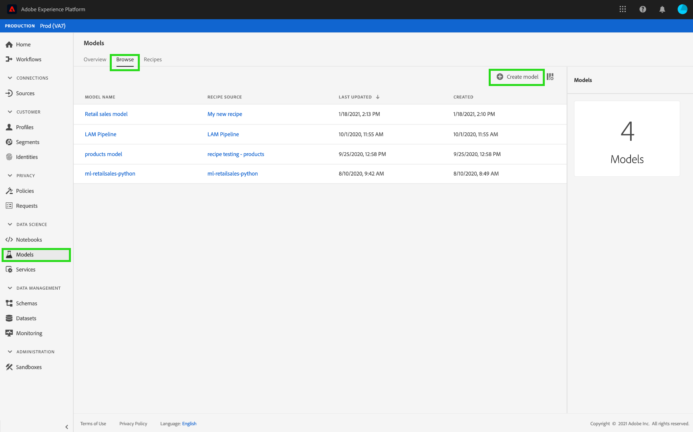

# Modell in der Data Science Workspace-Benutzeroberfläche trainieren und bewerten

>[!NOTE]
>
>Data Science Workspace ist nicht mehr erhältlich.
>
>Diese Dokumentation richtet sich an Bestandskunden mit vorherigen Berechtigungen für Data Science Workspace.

In Adobe Experience Platform Data Science Workspace können Sie ein Modell für maschinelles Lernen einrichten, indem Sie ein vorhandenes Rezept einbinden, das für den Zweck des Modells geeignet ist. Anschließend wird das Modell trainiert und ausgewertet, um seine Effizienz und Wirksamkeit zu erhöhen; dazu werden die entsprechenden Hyperparameter fein abgestimmt. Rezepte sind wiederverwendbar; mit einem Rezept können also verschiedene Modelle erstellt und auf individuelle Zwecke zugeschnitten werden.

Dieses Tutorial leitet Sie durch die Schritte zum Erstellen, Trainieren und Auswerten eines Modells.

## Erste Schritte

Um dieses Tutorial abzuschließen, müssen Sie Zugriff auf [!DNL Experience Platform] haben. Wenn Sie keinen Zugriff auf eine Organisation in [!DNL Experience Platform] haben, wenden Sie sich an Ihren Systemadministrator, bevor Sie fortfahren.

Das Tutorial setzt ein vorhandenes Rezept voraus. Wenn Sie kein Rezept haben, befolgen Sie die Anweisungen im Tutorial zum [Importieren eines gepackten Rezepts in der UI](./import-packaged-recipe-ui.md), bevor Sie fortfahren.

## Modell erstellen

Wählen Sie unter Experience Platform die Registerkarte **[!UICONTROL Modelle]** im linken Navigationsbereich und dann die Registerkarte Durchsuchen aus, um Ihre vorhandenen Modelle anzuzeigen. Wählen Sie oben rechts auf der Seite die Option **[!UICONTROL Modell erstellen]** aus, um mit der Modellerstellung zu beginnen.

Durchsuchen Sie die Liste der vorhandenen Rezepte, wählen Sie das Rezept aus, das zum Erstellen des Modells verwendet werden soll, und wählen Sie **[!UICONTROL Weiter]** aus.

Wählen Sie einen entsprechenden Eingabedatensatz und dann **[!UICONTROL Weiter]** aus. Dadurch wird der standardmäßige Eingabe-Trainings-Datensatz für das Modell festgelegt.

Geben Sie einen Namen für das Modell ein und überprüfen Sie die standardmäßigen Modellkonfigurationen. Bei der Rezepterstellung wurden Standardkonfigurationen angewendet, um die Konfigurationswerte zu überprüfen und zu ändern, indem auf die Werte doppelgeklickt wird.

Um einen neuen Konfigurationssatz bereitzustellen, wählen Sie **[!UICONTROL Neue Konfiguration hochladen]** und ziehen Sie eine JSON-Datei mit Modellkonfigurationen in das Browserfenster. Wählen Sie **[!UICONTROL Beenden]** aus, um das Modell zu erstellen.

>[!NOTE]
>
>Konfigurationen sind für das beabsichtigte Rezept eindeutig und spezifisch. Das bedeutet, dass Konfigurationen für das Rezept &quot;Einzelhandelsumsätze&quot;für das Recommendations-Rezept &quot;Produkt&quot;nicht funktionieren. Eine Liste der Rezeptkonfigurationen für „Einzelhandelsumsätze“ finden Sie im Abschnitt [Referenz](#reference).

## Trainings-Lauf erstellen

Wählen Sie unter Experience Platform die Registerkarte **[!UICONTROL Modelle]** im linken Navigationsbereich und dann die Registerkarte Durchsuchen aus, um Ihre vorhandenen Modelle anzuzeigen. Suchen und wählen Sie den Hyperlink aus, der an den Namen des Modells angehängt ist, das Sie trainieren möchten.

Alle vorhandenen Trainings-Läufe werden mit ihrem aktuellen Trainings-Status aufgeführt. Bei Modellen, die mit der Benutzeroberfläche [!DNL Data Science Workspace] erstellt wurden, wird automatisch ein Trainings-Lauf generiert und mit den Standardkonfigurationen und dem Eingabedatensatz für das Trainieren ausgeführt.

Erstellen Sie einen neuen Trainings-Lauf, indem Sie oben rechts auf der Modellübersichtsseite die Option **[!UICONTROL Trainieren]** auswählen.

Wählen Sie den Eingabedatensatz für die Schulung für den Trainings-Lauf und dann **[!UICONTROL Weiter]** aus.

Bei der Modellerstellung angegebene Standardkonfigurationen werden angezeigt; ändern Sie sie nach Bedarf, indem Sie auf die Werte doppelklicken. Wählen Sie **[!UICONTROL Beenden]** aus, um den Trainings-Lauf zu erstellen und auszuführen.

>[!NOTE]
>
>Konfigurationen sind für das beabsichtigte Rezept eindeutig und spezifisch. Das bedeutet, dass Konfigurationen für das Rezept &quot;Einzelhandelsumsätze&quot;für das Recommendations-Rezept &quot;Produkt&quot;nicht funktionieren. Eine Liste der Rezeptkonfigurationen für „Einzelhandelsumsätze“ finden Sie im Abschnitt [Referenz](#reference).

## Modell auswerten

Wählen Sie unter Experience Platform die Registerkarte **[!UICONTROL Modelle]** im linken Navigationsbereich und dann die Registerkarte Durchsuchen aus, um Ihre vorhandenen Modelle anzuzeigen. Suchen und wählen Sie den Hyperlink aus, der an den Namen des Modells angehängt ist, das Sie auswerten möchten.

Alle vorhandenen Trainings-Läufe werden mit ihrem aktuellen Trainings-Status aufgeführt. Bei mehreren abgeschlossenen Trainings-Läufen können Bewertungsmetriken über verschiedene Trainings-Läufe im Modellbewertungsdiagramm hinweg verglichen werden. Wählen Sie mithilfe der Dropdown-Liste über dem Diagramm eine Auswertungsmetrik aus.

Die Metrik „Mean Absolute Percent Error (MAPE)“ drückt die Genauigkeit als Fehlerprozentwert aus. So lässt sich das am besten geeignete Experiment ermitteln. Dabei gilt: Je niedriger der MAPE-Wert, desto besser.

Die Metrik „Präzision“ beschreibt den Prozentwert relevanter Instanzen im Vergleich zu den insgesamt *abgerufenen* Instanzen. Präzision kann als Wahrscheinlichkeit verstanden werden, mit der ein zufällig ausgewähltes Ergebnis richtig ist.

Wenn Sie einen bestimmten Trainings-Lauf auswählen, erhalten Sie die Details zu diesem Lauf, indem Sie die Auswertungsseite öffnen. Das können Sie bereits vor Abschluss des Laufs tun. Auf der Auswertungsseite können Sie weitere Auswertungsmetriken, Konfigurationsparameter und Visualisierungen sehen, die spezifisch für den Trainings-Lauf sind.

Außerdem können Sie Aktivitätsprotokolle herunterladen, um die Details zum Lauf anzuzeigen. Protokolle sind besonders bei fehlgeschlagenen Läufen nützlich: Mit ihrer Hilfe können Sie herausfinden, was falsch gelaufen ist.

Hyperparameter können nicht trainiert werden und ein Modell muss durch Testen verschiedener Kombinationen von Hyperparametern optimiert werden. Wiederholen Sie dieses Trainings- und Auswertungsverfahren, bis Sie zu einem optimierten Modell gelangt sind.

## Nächste Schritte

Dieses Tutorial hat Sie durch das Erstellen, Trainieren und Bewerten eines Modells in [!DNL Data Science Workspace] geführt. Sobald Sie ein optimiertes Modell erreicht haben, können Sie das trainierte Modell nutzen, um Einblicke zu generieren; folgen Sie dazu dem Tutorial [Modell in der UI bewerten](./score-model-ui.md).

## Referenz {#reference}

### Konfigurationen für das Rezept „Einzelhandelsumsätze“

Hyperparameter bestimmen über das Trainings-Verhalten des Modells. Eine Änderung von Hyperparametern wirkt sich auf die Genauigkeit und Präzision des Modells aus:

| Hyperparameter | Beschreibung | Empfohlener Bereich |
| --- | --- | --- |
| learning_rate | Die Lernrate verkleinert den Beitrag der einzelnen Baumstrukturen um learning_rate. Dabei gibt es einen Kompromiss zwischen learning_rate und n_estimators. | 0,1 |
| n_estimators | Die Zahl der auszuführenden Boosting-Phasen. Gradient Boosting ist relativ stabil, was Überanpassung angeht, sodass eine große Zahl in der Regel bessere Ergebnisse liefert. | 100 |
| max_depth | Maximale Tiefe der einzelnen Regressionsschätzer. Die maximale Tiefe begrenzt die Zahl der Knoten in der Baumstruktur. Passen Sie den Parameter für optimale Performance an; der optimale Wert hängt von der Interaktion der Eingabevariablen ab. | 3 |

Zusätzliche Parameter bestimmen die technischen Eigenschaften des Modells:

| Parameterschlüssel | Typ | Beschreibung |
| ----- | ----- | ----- |
| `ACP_DSW_INPUT_FEATURES` | Zeichenfolge | Liste mit kommagetrennten Eingabeschemaattributen. |
| `ACP_DSW_TARGET_FEATURES` | Zeichenfolge | Liste mit kommagetrennten Ausgabeschemaattributen. |
| `ACP_DSW_FEATURE_UPDATE_SUPPORT` | Boolesch | Legt fest, ob Eingabe- und Ausgabefunktionen geändert werden können. |
| `tenantId` | Zeichenfolge | Diese ID stellt sicher, dass die von Ihnen erstellten Ressourcen den richtigen Namespace aufweisen und in Ihrem Unternehmen enthalten sind. [Gehen Sie wie folgt vor](../../xdm/api/getting-started.md#know-your-tenant_id), um Ihre Mandantenkennung zu suchen. |
| `ACP_DSW_TRAINING_XDM_SCHEMA` | Zeichenfolge | Das zum Trainieren eines Modells verwendete Eingabeschema. |
| `evaluation.labelColumn` | Zeichenfolge | Spaltenbezeichnung für Auswertungsvisualisierungen. |
| `evaluation.metrics` | Zeichenfolge | Kommagetrennte Liste mit Auswertungsmetriken, die zur Auswertung eines Modells verwendet werden. |
| `ACP_DSW_SCORING_RESULTS_XDM_SCHEMA` | Zeichenfolge | Das zum Scoring eines Modells verwendete Ausgabeschema. |
