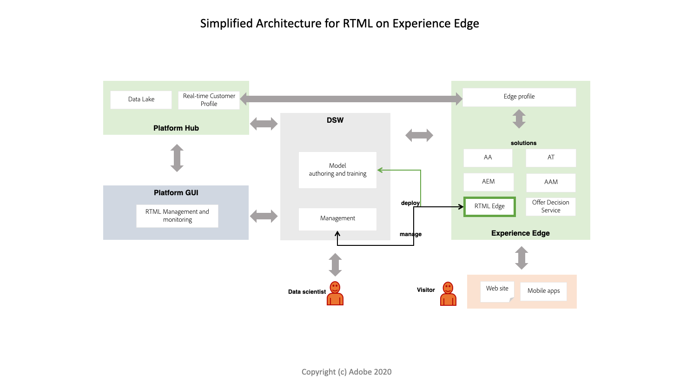

# Übersicht über maschinelles Lernen in Echtzeit

>[!IMPORTANT]
>Das maschinelle Lernen in Echtzeit steht noch nicht allen Benutzern zur Verfügung. Diese Funktion ist alphanumerisch und wird noch getestet. Dieses Dokument kann sich ändern.

Mit dem Echtzeit-Framework für maschinelles Lernen von Adobe Experience Platform können Sie mithilfe des maschinellen Lernens den richtigen Endbenutzern die richtigen Erlebnisse zum richtigen Zeitpunkt in den richtigen Kanälen mit einem Zeitrahmen unterhalb einer Sekunde bereitstellen.

## Vorteile

Echtzeit-maschinelles Lernen kann die Relevanz Ihrer digitalen Erlebnisinhalte für Ihre Endbenutzer dramatisch erhöhen. Dies wird durch die Nutzung von Echtzeit-Inferencing und kontinuierlichem Lernen im Experience Edge ermöglicht.

Eine Kombination aus nahtloser Berechnung auf dem Hub und dem Edge verringert die Latenz, die traditionell bei der Bereitstellung übermäßig personalisierter Erlebnisse, die sowohl relevant als auch reaktionsfähig sind, eine entscheidende Rolle spielt. Das maschinelle Lernen in Echtzeit bietet somit eine unglaublich niedrige Latenz für synchrone Entscheidungen. Beispiele sind das Rendern personalisierter Webseiteninhalte oder das Aufdecken eines Angebots oder Rabatt, um die Umrechnung in einem Webstore zu reduzieren und zu erhöhen.

## Architektur für maschinelles Lernen in Echtzeit

Das folgende Diagramm gibt einen Überblick über die Architektur des maschinellen Lernens in Echtzeit.

## Arbeitsablauf für maschinelles Lernen in Echtzeit (Alpha)

Im folgenden Arbeitsablauf werden die typischen Schritte und Ergebnisse beim Erstellen und Verwenden eines Echtzeit-maschinellen Lernmodells erläutert.

### Datenerfassung und -vorbereitung

Daten werden mit dem Experience Data Model (XDM) auf der Adobe Experience Platform erfasst und transformiert. Diese Daten werden für Modellschulungen verwendet. Weitere Informationen zu XDM finden Sie in der [XDM-Übersicht](../../xdm/home.md).

### Authoring – 

Erstellen Sie ein Echtzeit-Modell für maschinelles Lernen, indem Sie es von Grund auf bearbeiten oder als vorab geschultes serialisiertes ONNX-Modell in Adobe Experience Platform Jupyter-Notebooks einführen.

### Bereitstellung

Stellen Sie Ihr Modell für Experience Edge bereit, um einen Service für maschinelles Lernen in Echtzeit in der Service Gallery mithilfe des Prediction API-Endpunkts zu erstellen.

### Folgerung   

Verwenden Sie den REST API-Endpunkt &quot;Prognose&quot;, um Einblicke in das maschinelle Lernen in Echtzeit zu generieren.

### Bereitstellung

Marketingexperten können dann Segmente und Regeln definieren, die Echtzeit-maschinelle Lernergebnisse Erlebnissen mit Adobe-Zielgruppe zuordnen. Dadurch können Besucher der Website Ihrer Marke in Echtzeit (unter 100 ms) mit demselben oder einem auf der nächsten Seite vorhandenen, hyperpersonalisierten Erlebnis versehen werden.

## Entwicklungsplan

Das maschinelle Lernen in Echtzeit befindet sich derzeit in der Alpha-Phase. In der folgenden Tabelle werden einige Funktionen und Aktualisierungen erläutert, die voraussichtlich in der zukünftigen Beta-Iteration veröffentlicht werden.

<table>
    <th></th>
    <th>Alpha (Mai)</th>
    <th>Beta</th>
    <tr>
        <td>
            <strong>Funktionen</strong>
        </td>
        <td>
            <li>Data Science Workspace bringt Ihr eigenes Modell und Ihren Autor über die Integration von Notebook-Startern.</li>
            <li>Startsatz der Authoring-Operatoren.</li>
            <li>Auf Hub bereitstellen</li>
            <li>Scikit Lerne-basierte Modelle.</li>
        </td>
        <td>
            <li>Integration der Data Science Workspace Service Gallery</li>
            <li>Optimieren Sie das Echtzeit-Profil des Kunden automatisch mit den Ergebnissen.</li>
            <li>Deep-Learning-Modelle.</li>
            <li>Erweiterter Satz von Authoring-Operatoren einschließlich benutzerdefinierter Operatoren.</li>
        </td>
    </tr>
    <tr>
        <td>
            <strong>Verfügbarkeit</strong>
        </td>
        <td>
            Nordamerika
        </td>
        <td>
            <li>Nordamerika</li>
            <li>Europa und Naher Osten (EMEA)</li>
            <li>Asien-Pazifik (APAC)</li>
        </td>
    </tr>
    <tr>
        <td>
            <strong>Authoring – </strong>
        </td>
        <td>
            <li>Python-Unterstützung</li>
            <li>Echtzeit-SDK für maschinelles Lernen</li>
            <li>Python-Authoring-Knoten: Pandas, ScikitLearn, ONNXNode, Split, ModelUpload, OneHotEncoder.</li>
        </td>
        <td>
            <li>Tensorflow-Unterstützung.</li>
            <li>Weitere Python-Authoring-Knoten: Reader für Kundendaten in Echtzeit, Customer Profil Writer in Echtzeit, NummernArrays, XDM2Frame, Frame2XDM. </li>
        </td>
    </tr>
    <tr>
        <td>
            <strong>Laufzeit bewerten</strong>
        </td>
        <td>
            ONNX
        </td>
        <td>
            ONNX
        </td>
    </tr>
</table>

## Nächste Schritte

Beginnen Sie mit der Befolgung des Handbuchs [zu den ersten Schritten](./getting-started.md) . Dieser Leitfaden führt Sie durch die Einrichtung aller erforderlichen Voraussetzungen für die Erstellung eines maschinellen Lernmodells in Echtzeit.

