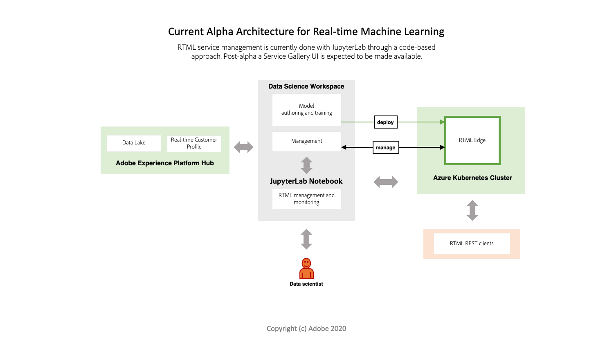

# Übersicht über maschinelles Lernen in Echtzeit (Alpha)

>[!IMPORTANT]
>Das maschinelle Lernen in Echtzeit steht noch nicht allen Benutzern zur Verfügung. Diese Funktion ist alphanumerisch und wird noch getestet. Dieses Dokument kann sich ändern.

Echtzeit-maschinelles Lernen kann die Relevanz Ihrer digitalen Erlebnisinhalte für Ihre Endbenutzer dramatisch erhöhen. Dies wird durch die Nutzung von Echtzeit-Inferencing und kontinuierlichem Lernen im Experience Edge ermöglicht.

Eine Kombination aus nahtloser Berechnung auf dem Hub und dem Edge verringert die Latenz, die traditionell bei der Bereitstellung übermäßig personalisierter Erlebnisse, die sowohl relevant als auch reaktionsfähig sind, eine entscheidende Rolle spielt. Das maschinelle Lernen in Echtzeit bietet somit eine unglaublich niedrige Latenz für synchrone Entscheidungen. Beispiele sind das Rendern personalisierter Webseiteninhalte oder das Aufdecken eines Angebots oder Rabatt, um die Umrechnung in einem Webstore zu reduzieren und zu erhöhen.

## Architektur für maschinelles Lernen in Echtzeit {#architecture}

Die folgenden Diagramme geben einen Überblick über die Architektur des maschinellen Lernens in Echtzeit. Derzeit hat alpha eine vereinfachtere Version.

## Arbeitsablauf für maschinelles Lernen in Echtzeit

Im folgenden Arbeitsablauf werden die typischen Schritte und Ergebnisse beim Erstellen und Verwenden eines Echtzeit-maschinellen Lernmodells erläutert.

### Datenerfassung und -vorbereitung

Daten werden mit dem Experience Data Model (XDM) auf der Adobe Experience Platform erfasst und transformiert. Diese Daten werden für Modellschulungen verwendet. Weitere Informationen zu XDM finden Sie in der [XDM-Übersicht](../../xdm/home.md).

### Authoring – 

Erstellen Sie ein Echtzeit-Modell für maschinelles Lernen, indem Sie es von Grund auf bearbeiten oder als vorab geschultes serialisiertes ONNX-Modell in Adobe Experience Platform Jupyter-Notebooks einführen.

### Implemenierung

Stellen Sie Ihr Modell für Experience Edge bereit, um einen Service für maschinelles Lernen in Echtzeit in der Service Gallery mithilfe des Prediction API-Endpunkts zu erstellen.

### Folgerung   

Verwenden Sie den REST API-Endpunkt &quot;Prognose&quot;, um Einblicke in das maschinelle Lernen in Echtzeit zu generieren.

### Bereitstellung

Marketingexperten können dann Segmente und Regeln definieren, die Echtzeit-maschinelle Lernergebnisse Erlebnissen mit Adobe-Zielgruppe zuordnen. Dadurch können Besucher der Website Ihrer Marke in Echtzeit mit einem hyper-personalisierten Erlebnis versehen werden.

## Aktuelle Funktion

Das maschinelle Lernen in Echtzeit befindet sich derzeit in der Alpha-Phase. Die unten beschriebene Funktionalität kann sich ändern, da weitere Funktionen und Knoten verfügbar sind.

>[!NOTE]
> Alpha-Beschränkungen:
> - Derzeit werden nur ONNX-basierte Modelle unterstützt.
> - Funktionen, die in Knoten verwendet werden, können nicht serialisiert werden. Beispielsweise eine Lambda-Funktion, die in einem Pandas-Knoten verwendet wird.
> - Nach der manuellen Bereitstellung von Edge wird eine 60-Sekunden-Unterbrechung ausgeführt.
> - Für tiefes Lernen müssen Ihre Daten so gesendet werden, dass, wenn sie genannt `df.values` werden, ein Array zurückgegeben wird, das von Ihrem DL-Modell akzeptiert werden kann. Dies liegt daran, dass der ONNX Modell-Scoring-Knoten verwendet `df.values` und sendet die Ausgabe zu Ergebnis mit dem Modell.

### Funktionen:

|  | Alpha (Mai) |
| --- | --- |
| **Funktionen** | - Verwenden der RTML-Notebook-Vorlage, Erstellen, Testen und Bereitstellen eines benutzerdefinierten maschinellen Lernmodells.   - Unterstützung für den Import vorab ausgebildeter Modelle für maschinelles Lernen.   - SDK für maschinelles Lernen in Echtzeit.   - Startersatz von Authoring-Knoten.   - In Adobe Experience Platform Hub bereitgestellt. |
| **Verfügbarkeit** | Nordamerika |
| **Authoring-Knoten** | - Pandas   - ScikitLearn   - ONNXNode   - Split   - ModelUpload   - OneHotEncoder |
| **Laufzeit bewerten** | ONNX |

## Nächste Schritte

Beginnen Sie mit der Befolgung des Handbuchs [zu den ersten Schritten](./getting-started.md) . Dieser Leitfaden führt Sie durch die Einrichtung aller erforderlichen Voraussetzungen für die Erstellung eines maschinellen Lernmodells in Echtzeit.

