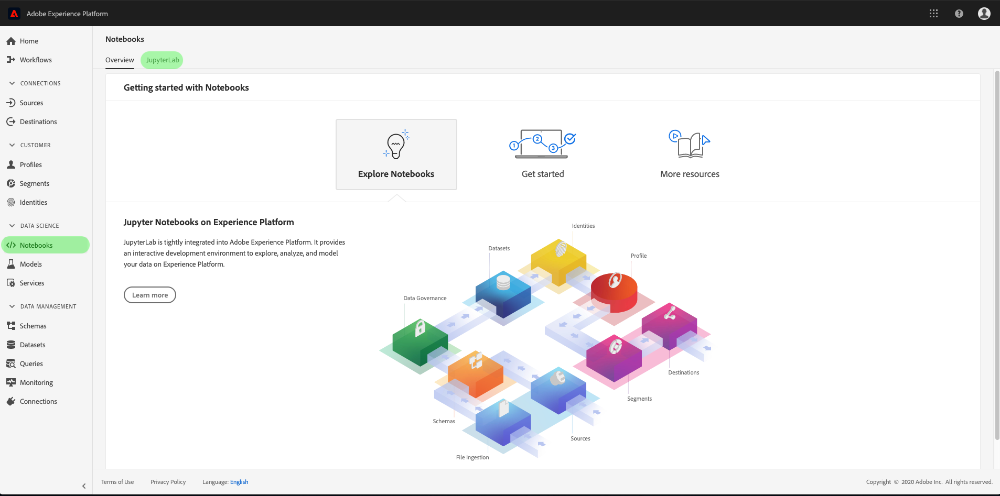
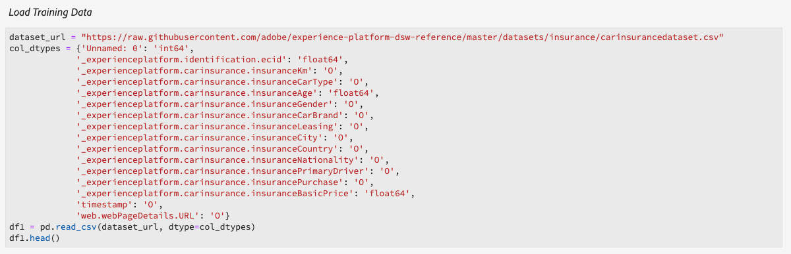
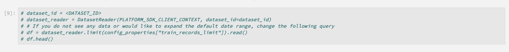
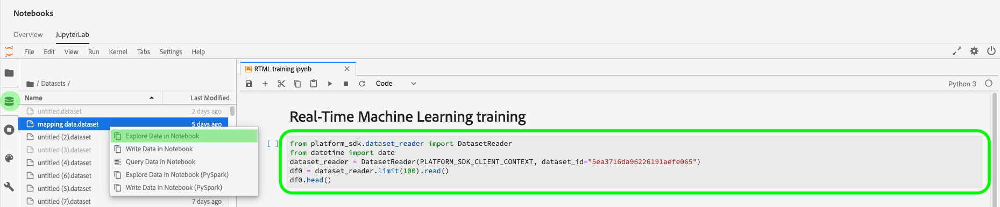
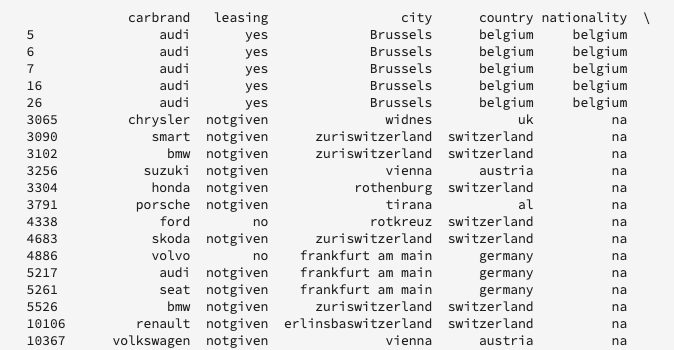
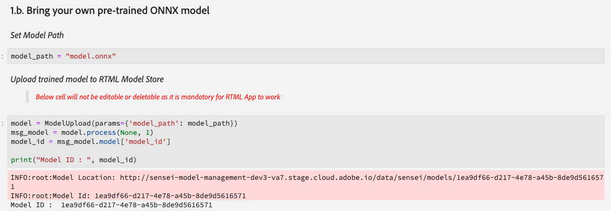

# Verwalten von Notebooks für maschinelles Lernen in Echtzeit (Alpha)

>[!IMPORTANT]
>
>Das maschinelle Lernen in Echtzeit steht noch nicht allen Benutzern zur Verfügung. Diese Funktion befindet sich in der Alpha-Phase und wird noch getestet. Dieses Dokument kann sich ändern.

Im folgenden Handbuch werden die Schritte beschrieben, die zum Erstellen einer Anwendung für maschinelles Lernen in Echtzeit erforderlich sind. Verwenden der bereitgestellten Adobe **[!UICONTROL Echtzeit-ML]** Python Notebook-Vorlage. Dieses Handbuch behandelt das Trainieren eines Modells, das Erstellen einer DSL, das Veröffentlichen der DSL in Edge und das Scoring der Anforderung. Wenn Sie mit der Implementierung Ihres maschinellen Lernmodells in Echtzeit fortfahren, wird erwartet, dass Sie die Vorlage entsprechend den Anforderungen Ihres Datensatzes ändern.

## Erstellen eines Notebooks für maschinelles Lernen in Echtzeit

Wählen Sie in der Adobe Experience Platform-Benutzeroberfläche die Option **[!UICONTROL Notebooks]** von **Datenwissenschaften**. Wählen Sie als Nächstes **[!UICONTROL JupyterLab]** und lassen etwas Zeit für das Laden der Umgebung zu.



Die [!DNL JupyterLab] wird angezeigt. Scrollen Sie nach unten zu *Echtzeit-maschinelles Lernen* und wählen Sie die **[!UICONTROL Echtzeit-ML]** Notebook. Eine Vorlage wird geöffnet, die Beispiel-Notebook-Zellen mit einem Beispieldatensatz enthält.


## Importieren und Erkennen von Knoten

Importieren Sie zunächst alle erforderlichen Pakete für Ihr Modell. Stellen Sie sicher, dass alle Pakete, die Sie für die Knotenbearbeitung verwenden möchten, importiert werden.

>[!NOTE]
>
>Die Importliste kann je nach gewünschtem Modell unterschiedlich sein. Diese Liste wird sich ändern, wenn neue Knoten im Laufe der Zeit hinzugefügt werden. Weitere Informationen finden Sie unter [Knotenreferenzhandbuch](./node-reference.md) für eine vollständige Liste der verfügbaren Knoten.

```python
from pprint import pprint
import pandas as pd
import numpy as np
import json
import uuid
from shutil import copyfile
from pathlib import Path
from datetime import date, datetime, timedelta
from platform_sdk.dataset_reader import DatasetReader

from rtml_nodelibs.nodes.standard.preprocessing.json_to_df import JsonToDataframe
from rtml_sdk.edge.utils import EdgeUtils
from rtml_sdk.graph.utils import GraphBuilder
from rtml_nodelibs.nodes.standard.ml.onnx import ONNXNode
from rtml_nodelibs.core.nodefactory import NodeFactory as nf
from rtml_nodelibs.nodes.standard.preprocessing.pandasnode import Pandas
from rtml_nodelibs.nodes.standard.preprocessing.one_hot_encoder import OneHotEncoder
from rtml_nodelibs.nodes.standard.ml.artifact_utils import ModelUpload
from rtml_nodelibs.core.nodefactory import NodeFactory as nf
from rtml_nodelibs.core.datamsg import DataMsg
```

Die folgende Codezelle druckt eine Liste der verfügbaren Knoten.

```python
# Discover Nodes
pprint(nf.discover_nodes())
```


## Training eines Modells für maschinelles Lernen in Echtzeit

Mit einer der folgenden Optionen schreiben Sie [!DNL Python] Code zum Lesen, Vorverarbeiten und Analysieren von Daten. Als Nächstes müssen Sie Ihr eigenes ML-Modell trainieren, es in das ONNX-Format serialisieren und dann in den Modellspeicher für maschinelles Lernen in Echtzeit hochladen.

- [Trainieren Ihres eigenen Modells in JupyterLab-Notebooks](#training-your-own-model)
- [Hochladen Ihres eigenen vortrainierten ONNX-Modells auf JupyterLab-Notebooks](#pre-trained-model-upload)

### Trainieren Ihres eigenen Modells {#training-your-own-model}

Laden Sie zunächst Ihre Schulungsdaten.

>[!NOTE]
>
>Im **Echtzeit-ML** Vorlage, die [CSV-Datensatz für Kfz-Versicherungen](https://github.com/adobe/experience-platform-dsw-reference/tree/master/datasets/insurance) erfasst von [!DNL Github].



Wenn Sie einen Datensatz aus Adobe Experience Platform verwenden möchten, heben Sie die Auskommentierung der Zelle unten auf. Als Nächstes müssen Sie `DATASET_ID` mit dem entsprechenden Wert.



So greifen Sie auf einen Datensatz in Ihrem [!DNL JupyterLab] Notebook, wählen Sie die **Daten** im linken Navigationsbereich von [!DNL JupyterLab]. Die **[!UICONTROL Datensätze]** und **[!UICONTROL Schemas]** -Verzeichnissen angezeigt. Auswählen **[!UICONTROL Datensätze]** Klicken Sie mit der rechten Maustaste und wählen Sie dann die **[!UICONTROL Daten in Notebook erkunden]** im Dropdown-Menü des Datensatzes, den Sie verwenden möchten. Unten im Notebook wird ein ausführbarer Code-Eintrag angezeigt. Diese Zelle enthält `dataset_id`.



Klicken Sie nach dem Abschluss mit der rechten Maustaste auf die Zelle, die Sie unten im Notebook generiert haben, und löschen Sie sie.

### Trainings-Eigenschaften

Ändern Sie mithilfe der bereitgestellten Vorlage eine der Trainings-Eigenschaften in `config_properties`.

```python
config_properties = {
    "train_records_limit":1000000,
    "n_estimators": "80",
    "max_depth": "5",
    "ten_id": "_experienceplatform"  
}
```

### Vorbereiten des Modells

Verwenden der **[!UICONTROL Echtzeit-ML]** -Vorlage verwenden, müssen Sie Ihr ML-Modell analysieren, vorverarbeiten, trainieren und bewerten. Dies geschieht durch Anwenden von Datenumwandlungen und Erstellen einer Trainings-Pipeline.

**Datenumwandlungen**

Die **[!UICONTROL Echtzeit-ML]** templates **Datenumwandlungen** -Zelle muss so geändert werden, dass sie mit Ihrem eigenen Datensatz funktioniert. Normalerweise umfasst dies das Umbenennen von Spalten, die Datenaggregation und die Datenvorbereitung/Funktionsentwicklung.

>[!NOTE]
>
>Das folgende Beispiel wurde aus Gründen der Lesbarkeit mit `[ ... ]`. Zeigen Sie die *Echtzeit-ML* Vorlagen für Datenumwandlungen für die gesamte Code-Zelle.

```python
df1.rename(columns = {config_properties['ten_id']+'.identification.ecid': 'ecid',
                     [ ... ]}, inplace=True)
df1 = df1[['ecid', 'km', 'cartype', 'age', 'gender', 'carbrand', 'leasing', 'city', 
       'country', 'nationality', 'primaryuser', 'purchase', 'pricequote', 'timestamp']]
print("df1 shape 1", df1.shape)
#########################################
# Data Rollup
######################################### 
df1['timestamp'] = pd.to_datetime(df1.timestamp)
df1['hour'] = df1['timestamp'].dt.hour.astype(int)
df1['dayofweek'] = df1['timestamp'].dt.dayofweek

df1.loc[(df1['purchase'] == 'yes'), 'purchase'] = 1
df1.purchase.fillna(0, inplace=True)
df1['purchase'] = df1['purchase'].astype(int)

[ ... ]

print("df1 shape 2", df1.shape)

#########################################
# Data Preparation/Feature Engineering
#########################################      

df1['carbrand'] = df1['carbrand'].str.lower()
df1['country'] = df1['country'].str.lower()
df1.loc[(df1['carbrand'] == 'vw'), 'carbrand'] = 'volkswagen'

[ ... ]

df1['age'].fillna(df1['age'].median(), inplace=True)
df1['gender'].fillna('notgiven', inplace=True)

[ ... ]

df1['city'] = df1.groupby('country')['city'].transform(lambda x: x.fillna(x.mode()))
df1.dropna(subset = ['pricequote'], inplace=True)
print("df1 shape 3", df1.shape)
print(df1)

#grouping
grouping_cols = ['carbrand', 'cartype', 'city', 'country']

for col in grouping_cols:
    df_idx = pd.DataFrame(df1[col].value_counts().head(6))

    def grouping(x):
        if x in df_idx.index:
            return x
        else:
            return "Others"
    df1[col] = df1[col].apply(lambda x: grouping(x))

def age(x):
    if x < 20:
        return "u20"
    elif x > 19 and x < 29:
    [ ... ]
    else: 
        return "Others"

df1['age'] = df1['age'].astype(int)
df1['age_bucket'] = df1['age'].apply(lambda x: age(x))

df_final = df1[['hour', 'dayofweek','age_bucket', 'gender', 'city',  
   'country', 'carbrand', 'cartype', 'leasing', 'pricequote', 'purchase']]
print("df final", df_final.shape)

cat_cols = ['age_bucket', 'gender', 'city', 'dayofweek', 'country', 'carbrand', 'cartype', 'leasing']
df_final = pd.get_dummies(df_final, columns = cat_cols)
```

Führen Sie die bereitgestellte Zelle aus, um ein Beispielergebnis anzuzeigen. Die von der `carinsurancedataset.csv` -Datensatz gibt die von Ihnen definierten Änderungen zurück.



**Schulungspipeline**

Als Nächstes müssen Sie die Schulungs-Pipeline erstellen. Dies ähnelt jeder anderen Schulungs-Pipeline-Datei, mit der Ausnahme, dass Sie eine ONNX-Datei konvertieren und generieren müssen.

Passen Sie mithilfe der in Ihrer vorherigen Zelle definierten Datenumwandlungen die Vorlage an. Der folgende unten hervorgehobene Code wird zum Generieren einer ONNX-Datei in Ihrer Feature Pipeline verwendet. Bitte sehen Sie sich die *Echtzeit-ML* Vorlage für die vollständige Pipeline-Code-Zelle.

```python
#for generating onnx
def generate_onnx_resources(self):        
    install_dir = os.path.expanduser('~/my-workspace')
    print("Generating Onnx")
        
    from skl2onnx import convert_sklearn
    from skl2onnx.common.data_types import FloatTensorType
        
    # ONNX-ification
    initial_type = [('float_input', FloatTensorType([None, self.feature_len]))]

    print("Converting Model to Onnx")
    onx = convert_sklearn(self.model, initial_types=initial_type)
             
    with open("model.onnx", "wb") as f:
        f.write(onx.SerializeToString())
            
    print("Model onnx created")
```

Nachdem Sie Ihre Schulungs-Pipeline abgeschlossen und Ihre Daten durch Datentransformationen geändert haben, führen Sie das Training mit der folgenden Zelle durch.

```python
model = train(config_properties, df_final)
```

### Erstellen und Hochladen eines ONNX-Modells

Nachdem Sie einen erfolgreichen Trainings-Lauf abgeschlossen haben, müssen Sie ein ONNX-Modell generieren und das trainierte Modell in den Modellspeicher für maschinelles Lernen in Echtzeit hochladen. Nachdem Sie die folgenden Zellen ausgeführt haben, wird Ihr ONNX-Modell in der linken Leiste neben allen anderen Notebooks angezeigt.

```python
import os
import skl2onnx, subprocess

model.generate_onnx_resources()
```

>[!NOTE]
>
>Ändern Sie die `model_path` string -Wert (`model.onnx`), um den Namen Ihres Modells zu ändern.

```python
model_path = "model.onnx"
```

>[!NOTE]
>
>Die folgende Zelle kann nicht bearbeitet oder gelöscht werden und ist erforderlich, damit Ihre Anwendung für maschinelles Lernen in Echtzeit funktioniert.

```python
model = ModelUpload(params={'model_path': model_path})
msg_model = model.process(None, 1)
model_id = msg_model.model['model_id']
 
print("Model ID: ", model_id)
```


### Hochladen Ihres eigenen vortrainierten ONNX-Modells {#pre-trained-model-upload}

Verwenden der Upload-Schaltfläche unter [!DNL JupyterLab] Notebooks, laden Sie Ihr vortrainiertes ONNX-Modell in die [!DNL Data Science Workspace] Notebook-Umgebung.


Ändern Sie anschließend die `model_path` Zeichenfolgenwert im *Echtzeit-ML* Notebook an Ihren ONNX-Modellnamen angepasst. Führen Sie nach Abschluss die *Modellpfad festlegen* und führen Sie dann die *Laden Sie Ihr Modell in den RTML-Modellspeicher hoch.* Zelle. Ihr Modellort und Ihre Modell-ID werden bei Erfolg in der Antwort zurückgegeben.



## DSL-Erstellung (Domain specific language)

In diesem Abschnitt wird die Erstellung einer DSL beschrieben. Sie werden die Knoten erstellen, die eine Vorverarbeitung von Daten zusammen mit dem ONNX-Knoten enthalten. Als Nächstes wird ein DSL-Diagramm mit Knoten und Kanten erstellt. Kanten verbinden Knoten im Tupel-basierten Format (node_1, node_2). Das Diagramm sollte keine Zyklen aufweisen.

>[!IMPORTANT]
>
>Die Verwendung des ONNX-Knotens ist obligatorisch. Ohne den ONNX-Knoten ist die Anwendung nicht erfolgreich.

### Node Authoring

>[!NOTE]
>
> Je nach verwendetem Datentyp verfügen Sie wahrscheinlich über mehrere Knoten. Im folgenden Beispiel wird nur ein einzelner Knoten im *Echtzeit-ML* Vorlage. Bitte sehen Sie sich die *Echtzeit-ML* templates *Node Authoring* -Abschnitt für die vollständige Code-Zelle.

Der nachstehende Knoten pandas verwendet `"import": "map"` , um den Methodennamen als Zeichenfolge in die Parameter zu importieren, gefolgt von der Eingabe der Parameter als Zuordnungsfunktion. Im folgenden Beispiel wird dazu Folgendes verwendet: `{'arg': {'dataLayerNull': 'notgiven', 'no': 'no', 'yes': 'yes', 'notgiven': 'notgiven'}}`. Nachdem Sie die Zuordnung eingerichtet haben, haben Sie die Möglichkeit, `inplace` as `True` oder `False`. Satz `inplace` as `True` oder `False` je nachdem, ob Sie die Transformation anwenden möchten oder nicht. Standardmäßig `"inplace": False` erstellt eine neue Spalte. Die Unterstützung für die Bereitstellung eines neuen Spaltennamens ist so eingestellt, dass er in einer nachfolgenden Version hinzugefügt wird. Die letzte Zeile `cols` kann ein einzelner Spaltenname oder eine Spaltenliste sein. Geben Sie die Spalten an, auf die Sie die Transformation anwenden möchten. In diesem Beispiel `leasing` festgelegt ist. Weitere Informationen zu den verfügbaren Knoten und deren Verwendung finden Sie unter [Knotenreferenzhandbuch](./node-reference.md).

```python
# Renaming leasing column using Pandas Node
leasing_mapper_node = Pandas(params={'import': 'map',
                                'kwargs': {'arg': {
                                    'dataLayerNull': 'notgiven', 
                                    'no': 'no', 
                                    'yes': 'yes', 
                                    'notgiven': 'notgiven'}},
                                'inplace': True,
                                'cols': 'leasing'})
```

### DSL-Diagramm erstellen

Wenn Ihre Knoten erstellt wurden, besteht der nächste Schritt darin, die Knoten zu ketten, um ein Diagramm zu erstellen.

Erstellen Sie zunächst alle Knoten, die Teil des Diagramms sind, indem Sie ein Array erstellen.

```python
nodes = [json_df_node, 
        to_datetime_node,
        hour_node,
        dayofweek_node,
        age_fillna_node,
        carbrand_fillna_node,
        country_fillna_node,
        cartype_primary_nationality_km_fillna_node,
        carbrand_mapper_node,
        cartype_mapper_node,
        country_mapper_node,
        gender_mapper_node,
        leasing_mapper_node,
        age_to_int_node,
        age_bins_node,
        dummies_node, 
        onnx_node]
```

Verbinden Sie dann die Knoten mit den Kanten. Jeder Tupel ist ein [!DNL Edge] Verbindung.

>[!TIP]
>
> Da die Knoten linear voneinander abhängig sind (jeder Knoten hängt von der Ausgabe des vorherigen Knotens ab), können Sie Links mit einem einfachen Verständnis der Python-Liste erstellen. Fügen Sie Ihre eigenen Verbindungen hinzu, wenn ein Knoten von mehreren Eingaben abhängig ist.

```python
edges = [(nodes[i], nodes[i+1]) for i in range(len(nodes)-1)]
```

Sobald Ihre Knoten verbunden sind, erstellen Sie das Diagramm. Die nachstehende Zelle ist obligatorisch und kann weder bearbeitet noch gelöscht werden.

```python
dsl = GraphBuilder.generate_dsl(nodes=nodes, edges=edges)
pprint(json.loads(dsl))
```

Sobald die `edge` -Objekt zurückgegeben, das alle Knoten und die ihnen zugeordneten Parameter enthält.


## In Edge veröffentlichen (Hub)

>[!NOTE]
>
>Das maschinelle Lernen in Echtzeit wird vorübergehend auf dem Adobe Experience Platform Hub bereitgestellt und von diesem verwaltet. Weitere Informationen finden Sie im Abschnitt Übersicht unter [Architektur des maschinellen Lernens in Echtzeit](./home.md#architecture).

Nachdem Sie ein DSL-Diagramm erstellt haben, können Sie Ihr Diagramm für die [!DNL Edge].

>[!IMPORTANT]
>
>Veröffentlichen Sie nicht in [!DNL Edge] häufig kann dies die [!DNL Edge] Knoten. Es wird nicht empfohlen, dasselbe Modell mehrmals zu veröffentlichen.

```python
edge_utils = EdgeUtils()
(edge_location, service_id) = edge_utils.publish_to_edge(dsl=dsl)
print(f'Edge Location: {edge_location}')
print(f'Service ID: {service_id}')
```

### DSL aktualisieren und auf Edge erneut veröffentlichen (optional)

Wenn Sie Ihre DSL nicht aktualisieren müssen, können Sie zu [Scoring](#scoring).

>[!NOTE]
>
>Die folgenden Zellen sind nur erforderlich, wenn Sie eine vorhandene DSL aktualisieren möchten, die in Edge veröffentlicht wurde.

Ihre Modelle werden sich wahrscheinlich weiter entwickeln. Anstatt einen völlig neuen Dienst zu erstellen, ist es möglich, einen vorhandenen Dienst mit Ihrem neuen Modell zu aktualisieren. Sie können einen Knoten definieren, den Sie aktualisieren möchten, ihm eine neue ID zuweisen und dann den neuen DSL erneut in den [!DNL Edge].

Im folgenden Beispiel wird Knoten 0 mit einer neuen ID aktualisiert.

```python
# Update the id of Node 0 with a random uuid.

dsl_dict = json.loads(dsl)
print(f"ID of Node 0 in current DSL: {dsl_dict['edge']['applicationDsl']['nodes'][0]['id']}")

new_node_id = str(uuid.uuid4())
print(f'Updated Node ID: {new_node_id}')

dsl_dict['edge']['applicationDsl']['nodes'][0]['id'] = new_node_id
```


Nach dem Aktualisieren der Knoten-ID können Sie eine aktualisierte DSL erneut in Edge veröffentlichen.

```python
# Republish the updated DSL to Edge
(edge_location_ret, service_id, updated_dsl) = edge_utils.update_deployment(dsl=json.dumps(dsl_dict), service_id=service_id)
print(f'Updated dsl: {updated_dsl}')
```

Sie erhalten die aktualisierte DSL zurückgegeben.


## Scoring {#scoring}

Nach der Veröffentlichung in [!DNL Edge], erfolgt die Auswertung durch eine POST-Anfrage eines Clients. Normalerweise kann dies über eine Client-Anwendung erfolgen, die ML-Bewertungen benötigt. Sie können dies auch über Postman tun. Die **[!UICONTROL Echtzeit-ML]** -Vorlage verwendet EdgeUtils, um diesen Prozess zu demonstrieren.

>[!NOTE]
>
>Vor dem Start der Auswertung ist eine kleine Verarbeitungszeit erforderlich.

```python
# Wait for the app to come up
import time
time.sleep(20)
```

Unter Verwendung desselben Schemas, das für das Training verwendet wurde, werden Scoring-Beispieldaten generiert. Diese Daten werden zum Erstellen eines Scoring-Dataframes verwendet, der dann in ein Scoring-Wörterbuch konvertiert wird. Bitte sehen Sie sich die *Echtzeit-ML* Vorlage für die vollständige Code-Zelle.


### Gegen den Edge-Endpunkt bewerten

Verwenden Sie die folgende Zelle im *Echtzeit-ML* Vorlage, die mit Ihrer [!DNL Edge] Dienst.


Sobald die Auswertung abgeschlossen ist, wird die [!DNL Edge] URL, Nutzlast und Ergebnisausgabe aus der [!DNL Edge] zurückgegeben.

## Auflisten der bereitgestellten Apps über [!DNL Edge]

So generieren Sie eine Liste Ihrer derzeit bereitgestellten Apps auf der [!DNL Edge]führen Sie die folgende Code-Zelle aus. Diese Zelle kann nicht bearbeitet oder gelöscht werden.

```python
services = edge_utils.list_deployed_services()
print(services)
```

Die zurückgegebene Antwort ist ein Array Ihrer bereitgestellten Dienste.

```json
[
    {
        "created": "2020-05-25T19:18:52.731Z",
        "deprecated": false,
        "id": "40eq76c0-1c6f-427a-8f8f-54y9cdf041b7",
        "type": "edge",
        "updated": "2020-05-25T19:18:52.731Z"
    }
]
```

## Löschen Sie die bereitgestellte App- oder Dienst-ID aus der [!DNL Edge] (optional)

>[!CAUTION]
>
>Diese Zelle wird zum Löschen Ihrer bereitgestellten Edge-Anwendung verwendet. Verwenden Sie die folgende Zelle nur, wenn Sie eine bereitgestellte [!DNL Edge] Anwendung.

```python
if edge_utils.delete_from_edge(service_id=service_id):
    print(f"Deleted service id {service_id} successfully")
else:
    print(f"Failed to delete service id {service_id}")
```

## Nächste Schritte

Durch Befolgung des oben stehenden Tutorials haben Sie erfolgreich ein ONNX-Modell in den Modellspeicher für maschinelles Lernen in Echtzeit trainiert und hochgeladen. Darüber hinaus haben Sie Ihr Modell für maschinelles Lernen in Echtzeit bewertet und bereitgestellt. Wenn Sie mehr über die Knoten erfahren möchten, die für die Modellbearbeitung verfügbar sind, besuchen Sie die [Knotenreferenzhandbuch](./node-reference.md).
