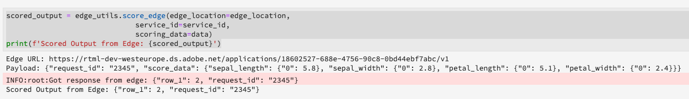

# Bewertung eines Echtzeit-maschinellen Lernmodells

>[!IMPORTANT]
>Das maschinelle Lernen in Echtzeit steht noch nicht allen Benutzern zur Verfügung. Diese Funktion ist alphanumerisch und wird noch getestet. Dieses Dokument kann sich ändern.

Dieses Lernprogramm zeigt Ihnen, wie Sie mit Echtzeit-Knoten für maschinelles Lernen eingehende Daten vorbereiten und diese mit Ihrem ONNX-Modell abgleichen können.

>[!IMPORTANT]
> - Funktionen, die in Knoten verwendet werden, können nicht serialisiert werden. Beispielsweise eine Lambda-Funktion, die in einem pandas-Knoten verwendet wird.
> - Nach der manuellen Bereitstellung der Edge-Daten wird ein 60-Sekunden-Ruhezustand ausgeführt. Dies kann auf die Methode score_edge von EdgeUtils übertragen werden.


>[!NOTE]
>Um ein Modell für maschinelles Lernen in Echtzeit zu bewerten, müssen Sie das vorherige Lernprogramm zur [Ausbildung eines Modells für maschinelles Lernen in Echtzeit abgeschlossen haben](./training-ml-model.md)

## Erstellen eines neuen Notebooks

Wählen Sie in der Benutzeroberfläche der Adobe Experience Platform **[!UICONTROL Notebooks]** in der *Datenwissenschaft* aus. Wählen Sie als Nächstes &quot; **[!UICONTROL JupyterLab]** &quot;aus und lassen Sie die Umgebung etwas länger laden.


Beginn durch Auswahl des **leeren Python 3 Notebooks** im JupyterLab-Starter.


## Importieren und Auffinden von Knoten

Beginn durch Importieren aller erforderlichen Pakete für Ihr Modell. Stellen Sie sicher, dass alle Pakete, die Sie für das Node Authoring verwenden möchten, importiert werden.

>[!NOTE]
>Die Liste der Importe kann je nach Modell unterschiedlich ausfallen.

```python
from pprint import pprint
import json
from rtml_nodelibs.core.nodefactory import NodeFactory as nf
from rtml_sdk.graph.utils import GraphBuilder
from rtml_sdk.edge.utils import EdgeUtils

from rtml_nodelibs.nodes.standard.preprocessing.pandasnode import Pandas
from rtml_nodelibs.nodes.standard.ml.onnx import ONNXNode
from rtml_nodelibs.nodes.standard.preprocessing.json_to_df import JsonToDataframe
from rtml_nodelibs.core.datamsg import DataMsg
import uuid
```

Um die Liste der verfügbaren Knoten anzuzeigen, kopieren Sie das folgende Beispiel und fügen Sie es in Ihr Notebook ein.

```python
# Discover Nodes
pprint(nf.discover_nodes())
```

Die erhaltene Antwort ist eine Liste von Knoten.


## Node-Authoring für Edge-Scoring

Als Nächstes müssen Sie einen Knoten für die Kantenauswertung definieren und erstellen. Ersetzen Sie die Beispieldatei `model_id` durch Ihre Modell-ID, die Sie nach Abschluss der Schulung im [vorherigen Lernprogramm](./training-ml-model.md)erhalten haben. In diesem Beispiel wird der Knoten Pandas verwendet, um eine pd.DataDrame-Methode oder eine allgemeine Funktion der obersten Ebene von Pandas zu importieren. Die Funktion &quot;Map&quot;wird importiert und zum Erstellen von zwei Knoten verwendet. Weitere Informationen zu den verfügbaren Knoten und deren Verwendung finden Sie im [Node Reference Guide](./node-reference.md).

```python
model_id = '{your_model_id}' # Get Model ID from Training Notebook.

data = {'sepal_length': {0: 5.8},
        'sepal_width': {0: 2.8},
        'petal_length': {0: 5.1},
        'petal_width': {0: 2.4}}

json2DF_node = JsonToDataframe(params={"json_payload":json.dumps(data)})
fill_na_node = Pandas(params={"import": "fillna", "kwargs":{"value":0}})
model_score_node = ONNXNode(params={"features": ['sepal_length', 'sepal_width', 'petal_length', 'petal_width'],
                                    "model_id": model_id})
```

## DSL des Builddiagramms

Bei der Erstellung der Knoten besteht der nächste Schritt darin, die Knoten zu verketten, um ein Diagramm zu erstellen.

Beginn durch Auflistung aller Knoten, die Teil des Diagramms sind.

```python
nodes = [node_device_apply, node_browser_apply, node_model_score]
```

Verbinden Sie dann die Knoten mit Kanten. Jeder Tupel ist eine Kantenverbindung.

```python
edges = [ (node_device_apply, node_browser_apply), (node_browser_apply, node_model_score)]
```

Sobald Ihre Knoten verbunden sind, erstellen Sie das Diagramm.

```python
dsl = GraphBuilder.generate_dsl(nodes=nodes, edges=edges)
```

## Auf Kante veröffentlichen

Nachdem Sie ein Diagramm erstellt haben, können Sie das Diagramm an der Kante bereitstellen.

>[!IMPORTANT]
>Veröffentlichen Sie nicht oft an der Kante, dies kann die Edge-Knoten überladen. Es wird nicht empfohlen, dasselbe Modell mehrmals zu veröffentlichen.

```python
edge_utils = EdgeUtils()
(edge_location, service_id) = edge_utils.publish_to_edge(dsl=dsl)
```

## Edge Client

Nach dem Veröffentlichen auf Edge erfolgt die Bewertung durch eine POST-Anforderung eines Clients. Normalerweise kann dies über eine Client-Anwendung erfolgen, die ML-Ergebnisse benötigt. Sie können es auch von Postman aus tun. Hier wird der Prozess mit EdgeUtils veranschaulicht.

```python
import time
time.sleep(600)
```

```python
data = {"sepal_length": {0: 5.8}, "sepal_width": {0: 2.8}, "petal_length": {0: 5.1}, "petal_width": {0: 2.4}}
```

```python
scored_output = edge_utils.score_edge(edge_location=edge_location,
                              service_id=service_id,
                              scoring_data=data)
print(f'Scored Output from Edge: {scored_output}')
```

Sobald die Bewertung abgeschlossen ist, werden die Edge-URL, die Nutzlast und die ausgewertete Ausgabe von der Kante zurückgegeben.



## Löschen einer bereitgestellten App von der Kante (optional)

>!![CAUTION]
Diese Zelle wird zum Löschen der bereitgestellten Edge-Anwendung verwendet. Verwenden Sie die folgende Zelle nur, wenn Sie eine bereitgestellte Edge-Anwendung löschen müssen.

```python
if edge_utils.delete_from_edge(service_id=service_id):
    print(f"Deleted service id {service_id} successfully")
else:
    print(f"Failed to delete service id {service_id}")
```

## Nächste Schritte

Indem Sie dem oben stehenden Lernprogramm folgen, haben Sie Ihr Echtzeit-Modell für maschinelles Lernen erfolgreich bewertet und bereitgestellt. Wenn Sie mehr über die Knoten erfahren möchten, die für die Modellerstellung verfügbar sind, besuchen Sie das [Node Reference Guide](./node-reference.md).


