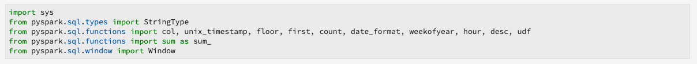
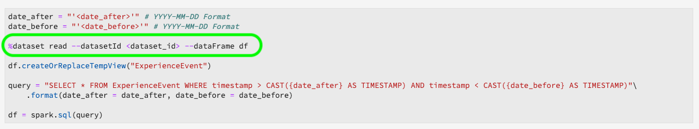
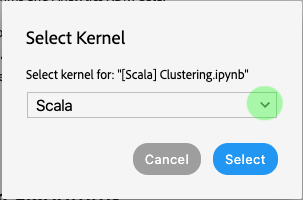
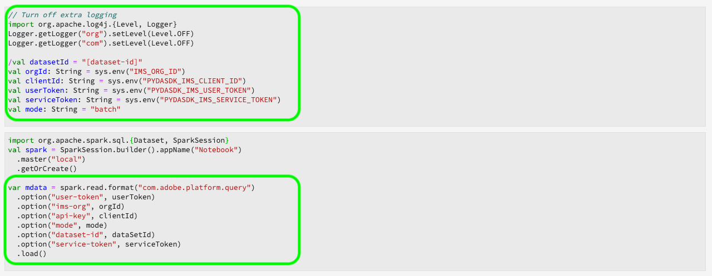

# Migrationshandbücher für Rezept und Notebooks

>[!NOTE]
>Notebooks und Rezepte mit Python/R bleiben davon unberührt. Die Migration gilt nur für bestehende PySpark/Spark Rezepte und Notebooks.

In den folgenden Handbüchern werden die Schritte und Informationen erläutert, die für die Migration vorhandener Rezepte und Notebooks erforderlich sind.

- [Migrationshandbücher für Rezessionen](#recipe-migration)
- [Migrationshandbücher für Notebooks](#notebook-migration)

## Migrationshandbücher für Rezessionen {#recipe-migration}

Jüngste Änderungen am Data Science Workspace erfordern, dass vorhandene Spark- und PySpark-Rezepte aktualisiert werden. Verwenden Sie die folgende Workflows, um den Übergang Ihrer Rezepte zu erleichtern.

- [Spark-Migrationshandbuch](#spark-migration-guide)
   - [Lesen und Schreiben von Datensätzen ändern](#read-write-recipe-spark)
   - [Beispielrezept herunterladen](#download-sample-spark)
   - [Hinzufügen der Dockerdatei](#add-dockerfile-spark)
   - [Abhängigkeiten überprüfen](#change-dependencies-spark)
   - [Vorbereiten von Dockerskripten](#prepare-docker-spark)
   - [Rezept mit Docker erstellen](#create-recipe-spark)
- [Migrationshandbuch für PySpark](#pyspark-migration-guide)
   - [Lesen und Schreiben von Datensätzen ändern](#pyspark-read-write)
   - [Beispielrezept herunterladen](#pyspark-download-sample)
   - [Hinzufügen der Dockerdatei](#pyspark-add-dockerfile)
   - [Vorbereiten von Dockerskripten](#pyspark-prepare-docker)
   - [Rezept mit Docker erstellen](#pyspark-create-recipe)

## Spark-Migrationshandbuch {#spark-migration-guide}

Das Skript-Artefakt, das durch die Buildschritte generiert wird, ist jetzt ein Docker-Bild, das Ihre JAR-Binärdatei enthält. Darüber hinaus hat sich die Syntax zum Lesen und Schreiben von Datensätzen mit dem Plattform-SDK geändert und erfordert die Änderung des Rezeptcodes.

Das folgende Video soll Ihnen helfen, die für Spark-Rezepte erforderlichen Änderungen besser zu verstehen:

>[!VIDEO](https://video.tv.adobe.com/v/33243)

### Datensätze lesen und schreiben (Spark) {#read-write-recipe-spark}

Bevor Sie das Docker-Bild erstellen, überprüfen Sie die Beispiele zum Lesen und Schreiben von Datensätzen im Plattform-SDK, die in den folgenden Abschnitten aufgeführt sind. Wenn Sie vorhandene Rezepte konvertieren, muss Ihr Plattform-SDK-Code aktualisiert werden.

#### Datensatz lesen

In diesem Abschnitt werden die zum Lesen eines Datensatzes erforderlichen Änderungen beschrieben und das von Adobe bereitgestellte [Beispiel helper.scala](https://github.com/adobe/experience-platform-dsw-reference/blob/master/recipes/scala/src/main/scala/com/adobe/platform/ml/helper/Helper.scala) verwendet.

Mit den Aktualisierungen der Spark-Rezepte müssen eine Reihe von Werten hinzugefügt und geändert werden. Erstens `DataSetOptions` wird sie nicht mehr verwendet. Replace `DataSetOptions` with `QSOption`. Darüber hinaus sind neue `option` Parameter erforderlich. Es sind sowohl `QSOption.mode` als auch `QSOption.datasetId` nötig. Schließlich `orgId` und `serviceApiKey` müssen geändert werden in `imsOrg` und `apiKey`. In der folgenden Tabelle finden Sie einen Vergleich zum Lesen von Datensätzen:

<table>
  <th>Alte Methode zum Lesen eines Datensatzes</th>
  <th>Neue Methode zum Lesen eines Datensatzes</th>
  <tr>
  <td>
  <pre class="JSON language-JSON hljs">
  var df = sparkSession.read.format("com.adobe.platform.dataset") .option(DataSetOptions.orgId, orgId) .option(DataSetOptions.serviceToken, serviceToken) .option(DataSetOptions.userToken, userToken) .option(DataSetOptions.serviceApiKey apiKey) .load(dataSetId)
</pre>
  </td>
  <td>
<pre class="JSON language-JSON hljs">
import com.adobe.platform.Abfrage.QSOption

var df = sparkSession.read.format(&quot;com.adobe.platform.Abfrage&quot;).option(QSOption.userToken&quot;, {userToken}).option(QSOption.serviceToken, {serviceToken}).option(QSOption.imsOrg, {orgId}).option(QSOption.apiKey, {apiKey}).option(QSOption.mode, &quot;interactive&quot;).option(QSOption.datasetId, {dataSetId}).load()
</pre>
</td>
  </tr>
</table>

>[!TIP]
> Im interaktiven Modus wird eine Zeitüberschreitung angezeigt, wenn die Abfragen länger als 10 Minuten laufen. Wenn Sie mehr als ein paar Gigabyte Daten eingeben, wird empfohlen, zum Stapelmodus zu wechseln. Der Stapelmodus dauert zwar länger, kann aber größere Datensätze verarbeiten.

#### Schreiben in einen Datensatz

In diesem Abschnitt werden die zum Schreiben eines Datensatzes erforderlichen Änderungen mithilfe des von Adobe bereitgestellten [Beispiels ScoringDataSaver.scala](https://github.com/adobe/experience-platform-dsw-reference/blob/master/recipes/scala/src/main/scala/com/adobe/platform/ml/ScoringDataSaver.scala) beschrieben.

Mit den Aktualisierungen der Spark-Rezepte müssen eine Reihe von Werten hinzugefügt und geändert werden. Erstens `DataSetOptions` wird sie nicht mehr verwendet. Replace `DataSetOptions` with `QSOption`. Darüber hinaus sind neue `option` Parameter erforderlich. `QSOption.datasetId` benötigt und ersetzt die Notwendigkeit, die `{dataSetId}` Eingabe zu laden `.save()`. Schließlich `orgId` und `serviceApiKey` müssen geändert werden in `imsOrg` und `apiKey`. In der folgenden Tabelle finden Sie einen Vergleich zum Schreiben von Datensätzen:

<table>
  <th>Alte Art, einen Datensatz zu schreiben</th>
  <th>Neue Methode zum Schreiben eines Datensatzes</th>
  <tr>
  <td>
  <pre class="JSON language-JSON hljs">
  df.write.format("com.adobe.platform.dataset") .option(DataSetOptions.orgId, orgId) .option(DataSetOptions.serviceToken, serviceToken) .option(DataSetOptions.userToken, userToken) .option(DataSetOptions.serviceApiKey, apiKey) .save (scoringResultsDataSetId)
</pre>
  </td>
  <td>
<pre class="JSON language-JSON hljs">
import com.adobe.platform.Abfrage.QSOption

df.write.format(&quot;com.adobe.platform.Abfrage&quot;).option(QSOption.userToken&quot;, {userToken}).option(QSOption.serviceToken, {serviceToken}).option(QSOption.imsOrg, {orgId}).option(QSOption.apiKey, {apiKey}).option(QSOption.datasetId, {dataSetId}).save()
</pre>
</td>
  </tr>
</table>

### Paketdockerbasierte Quelldateien (Spark) {#package-docker-spark}

Beginn, indem Sie zu dem Ordner navigieren, in dem sich Ihr Rezept befindet.

Die folgenden Abschnitte verwenden das neue Scala Retail Sales-Rezept, das im öffentlichen Github-Repository von [Data Science Workspace gefunden werden kann](https://github.com/adobe/experience-platform-dsw-reference).

### Beispielrezept herunterladen (Spark) {#download-sample-spark}

Das Beispielrezept enthält Dateien, die in Ihr bestehendes Rezept kopiert werden müssen. Um den öffentlichen Github zu klonen, der alle Beispielrezepte enthält, geben Sie Folgendes in Terminal ein:

```BASH
git clone https://github.com/adobe/experience-platform-dsw-reference.git
```

Das Scala-Rezept befindet sich im folgenden Verzeichnis `experience-platform-dsw-reference/recipes/scala/retail`.

### Hinzufügen der Dockerfile (Spark) {#add-dockerfile-spark}

Eine neue Datei wird im Skriptordner benötigt, um den dockerbasierten Workflow verwenden zu können. Kopieren Sie die Dockerdatei aus dem Ordner recipes unter `experience-platform-dsw-reference/recipes/scala/Dockerfile`. Optional können Sie auch den unten stehenden Code kopieren und in eine neue Datei namens `Dockerfile`.

>[!IMPORTANT]
> Die Beispieldatei JAR, die unten gezeigt wird, `ml-retail-sample-spark-*-jar-with-dependencies.jar` sollte durch den Namen der JAR-Datei Ihres Rezepts ersetzt werden.

```scala
FROM adobe/acp-dsw-ml-runtime-spark:0.0.1

COPY target/ml-retail-sample-spark-*-jar-with-dependencies.jar /application.jar
```

### Abhängigkeiten ändern (Spark) {#change-dependencies-spark}

Wenn Sie ein vorhandenes Rezept verwenden, sind Änderungen in der Datei &quot;pom.xml&quot;für Abhängigkeiten erforderlich. Ändern Sie die Abhängigkeitsversion model-authoring-sdk in 1.0.0. Aktualisieren Sie dann die Spark-Version in der Pom-Datei auf 2.4.3 und die Scala-Version auf 2.11.12.

```json
<groupId>com.adobe.platform.ml</groupId>
<artifactId>authoring-sdk_2.11</artifactId>
<version>1.0.0</version>
<classifier>jar-with-dependencies</classifier>
```

### Vorbereiten der Docker-Skripten (Spark) {#prepare-docker-spark}

Spark-Rezepte verwenden keine binären Artefakte mehr und erfordern stattdessen das Erstellen eines Dockerbilds. Wenn Sie dies noch nicht getan haben, [laden Sie Docker herunter und installieren Sie Docker](https://www.docker.com/products/docker-desktop).

In dem bereitgestellten Scala-Beispielrezept finden Sie die Skripte `login.sh` und `build.sh` befinden sich unter `experience-platform-dsw-reference/recipes/scala/` . Kopieren Sie diese Dateien und fügen Sie sie in Ihr bestehendes Rezept ein.

Die Ordnerstruktur sollte nun dem folgenden Beispiel ähneln (neu hinzugefügte Dateien werden hervorgehoben):


Der nächste Schritt besteht darin, die Quelldateien des [Pakets in ein Rezept](./models-recipes/package-source-files-recipe.md) -Tutorial zu übernehmen. Dieses Lernprogramm enthält einen Abschnitt, in dem das Erstellen eines Dockerbilds für ein Scala-(Spark-)Rezept skizziert wird. Nach Abschluss des Vorgangs erhalten Sie das Docker-Container in einer Azurblauer Bildregistrierung zusammen mit der entsprechenden Bild-URL.

### Erstellen eines Rezepts (Spark) {#create-recipe-spark}

Um ein Rezept zu erstellen, müssen Sie zunächst das Tutorial zu [Quelldateien](./models-recipes/package-source-files-recipe.md) für das Paket abschließen und die URL Ihres Dockerbilds bereitstellen. Sie können ein Rezept mit der Benutzeroberfläche oder der API erstellen.

Um Ihr Rezept mithilfe der Benutzeroberfläche zu erstellen, folgen Sie dem Lernprogramm zum [Importieren eines zusammengestellten Skripts (UI)](./models-recipes/import-packaged-recipe-ui.md) für Scala.

Um Ihr Rezept mit der API zu erstellen, folgen Sie dem Lernprogramm zum [Importieren eines zusammengestellten Skripts (API)](./models-recipes/import-packaged-recipe-api.md) für Scala.

## Migrationshandbuch für PySpark {#pyspark-migration-guide}

Das Rezept-Artefakt, das durch die Build-Schritte generiert wird, ist jetzt ein Docker-Bild, das Ihre binäre Datei &quot;.egg&quot;enthält. Darüber hinaus hat sich die Syntax zum Lesen und Schreiben von Datensätzen mit dem Plattform-SDK geändert und erfordert die Änderung des Rezeptcodes.

Das folgende Video soll Ihnen helfen, die für PySpark-Rezepte erforderlichen Änderungen besser zu verstehen:

>[!VIDEO](https://video.tv.adobe.com/v/33048?learn=on&quality=12)

### Datensätze lesen und schreiben (PySpark) {#pyspark-read-write}

Bevor Sie das Docker-Bild erstellen, überprüfen Sie die Beispiele zum Lesen und Schreiben von Datensätzen im Plattform-SDK, die in den folgenden Abschnitten aufgeführt sind. Wenn Sie vorhandene Rezepte konvertieren, muss Ihr Plattform-SDK-Code aktualisiert werden.

#### Datensatz lesen

In diesem Abschnitt werden die zum Lesen eines Datensatzes erforderlichen Änderungen mithilfe des von Adobe bereitgestellten [Beispiels helper.py](https://github.com/adobe/experience-platform-dsw-reference/blob/master/recipes/pyspark/pysparkretailapp/helper.py) beschrieben.

Mit den Aktualisierungen der Spark-Rezepte müssen eine Reihe von Werten hinzugefügt und geändert werden. Erstens `DataSetOptions` wird sie nicht mehr verwendet. Replace `DataSetOptions` with `qs_option`. Darüber hinaus sind neue `option` Parameter erforderlich. Es sind sowohl `qs_option.mode` als auch `qs_option.datasetId` nötig. Schließlich `orgId` und `serviceApiKey` müssen geändert werden in `imsOrg` und `apiKey`. In der folgenden Tabelle finden Sie einen Vergleich zum Lesen von Datensätzen:

<table>
  <th>Alte Methode zum Lesen eines Datensatzes</th>
  <th>Neue Methode zum Lesen eines Datensatzes</th>
  <tr>
  <td>
  <pre class="JSON language-JSON hljs">
dataset_options = get_dataset_options(spark.sparkContext)

pd = spark.read.format(&quot;com.adobe.platform.dataset&quot;).option(dataset_options.serviceToken(), service_token).option(dataset_options.userToken(), user_token).option(dataset_options.orgId(), org_id).option(dataset_options.serviceApi Key(), api_key).load(dataset_id)
</pre>
</td>
  <td>
<pre class="JSON language-JSON hljs">
qs_option = spark_context._jvm.com.adobe.platform.Abfrage.QSOption

pd = sparkSession.read.format(&quot;com.adobe.platform.Abfrage&quot;).option(qs_option.userToken, {userToken}).option(qs_option.serviceToken, {serviceToken}).option(qs_option.imsOrg, {orgId}).option(qs_option.apiKey, iKey}).option(qs_option.mode, &quot;interactive&quot;).option(qs_option.datasetId, {dataSetId}).load()
</pre>
</td>
  </tr>
</table>

>[!TIP]
> Im interaktiven Modus wird eine Zeitüberschreitung angezeigt, wenn die Abfragen länger als 10 Minuten laufen. Wenn Sie mehr als ein paar Gigabyte Daten eingeben, wird empfohlen, zum Stapelmodus zu wechseln. Der Stapelmodus dauert zwar länger, kann aber größere Datensätze verarbeiten.

#### Schreiben in einen Datensatz

In diesem Abschnitt werden die zum Schreiben eines Datensatzes erforderlichen Änderungen mithilfe des von Adobe bereitgestellten [Beispiels data_save.py](https://github.com/adobe/experience-platform-dsw-reference/blob/master/recipes/pyspark/pysparkretailapp/data_saver.py) beschrieben.

Mit den Aktualisierungen der PySpark-Rezepte müssen eine Reihe von Werten hinzugefügt und geändert werden. Erstens `DataSetOptions` wird sie nicht mehr verwendet. Replace `DataSetOptions` with `qs_option`. Darüber hinaus sind neue `option` Parameter erforderlich.  `qs_option.datasetId` ist erforderlich und ersetzt die Notwendigkeit, das `{dataSetId}` in zu laden `.save()` . Schließlich `orgId` und `serviceApiKey` müssen geändert werden in `imsOrg` und `apiKey`. In der folgenden Tabelle finden Sie einen Vergleich zum Lesen von Datensätzen:

<table>
  <th>Alte Art, einen Datensatz zu schreiben</th>
  <th>Neue Methode zum Schreiben eines Datensatzes</th>
  <tr>
  <td>
  <pre class="JSON language-JSON hljs">
df.write.format("com.adobe.platform.dataset") .option(DataSetOptions.orgId, orgId) .option(DataSetOptions.serviceToken, serviceToken) .option(DataSetOptions.userToken, userToken) .option(DataSetOptions.serviceApiKey, apiKey) .save (scoringResultsDataSetId)
</pre>
  </td>
  <td>
<pre class="JSON language-JSON hljs">
qs_option = spark_context._jvm.com.adobe.platform.Abfrage.QSOption

scored_df.write.format(&quot;com.adobe.platform.Abfrage&quot;).option(qs_option.userToken, {userToken}).option(qs_option.serviceToken, {serviceToken}).option(qs_option.imsOrg, {orgId}).option(qs_option.apiKey, {api Schlüssel}).option(qs_option.datasetId, {dataSetId}).save()
</pre>
</td>
  </tr>
</table>

### Verpacken von Docker-basierten Quelldateien (PySpark) {#pyspark-package-docker}

Beginn, indem Sie zu dem Ordner navigieren, in dem sich Ihr Rezept befindet.

In diesem Beispiel wird das neue PySpark Retail Sales-Rezept verwendet und befindet sich im öffentlichen Github-Repository von [Data Science Workspace](https://github.com/adobe/experience-platform-dsw-reference).

### Beispielrezept herunterladen (PySpark) {#pyspark-download-sample}

Das Beispielrezept enthält Dateien, die in Ihr bestehendes Rezept kopiert werden müssen. Um den öffentlichen Github zu klonen, der alle Beispielrezepte enthält, geben Sie Folgendes in Terminal ein.

```BASH
git clone https://github.com/adobe/experience-platform-dsw-reference.git
```

Das PySpark-Rezept befindet sich im folgenden Verzeichnis `experience-platform-dsw-reference/recipes/pyspark`.

### Hinzufügen der Dockerfile (PySpark) {#pyspark-add-dockerfile}

Eine neue Datei wird im Skriptordner benötigt, um den dockerbasierten Workflow verwenden zu können. Kopieren Sie die Dockerdatei aus dem Ordner recipes unter `experience-platform-dsw-reference/recipes/pyspark/Dockerfile`. Optional können Sie auch den unten stehenden Code kopieren und einfügen und eine neue Datei namens `Dockerfile`.

>[!IMPORTANT]
> Die Beispieldatei für das Ei `pysparkretailapp-*.egg` sollte durch den Namen der Eizelldatei ersetzt werden.

```scala
FROM adobe/acp-dsw-ml-runtime-pyspark:0.0.1
RUN mkdir /recipe

COPY . /recipe

RUN cd /recipe && \
    ${PYTHON} setup.py clean install && \
    rm -rf /recipe

RUN cp /databricks/conda/envs/${DEFAULT_DATABRICKS_ROOT_CONDA_ENV}/lib/python3.6/site-packages/pysparkretailapp-*.egg /application.egg
```

### Bereiten Sie Ihre Docker-Skripten vor (PySpark) {#pyspark-prepare-docker}

PySpark-Rezepte verwenden keine binären Artefakte mehr und müssen stattdessen ein Docker-Bild erstellen. Falls nicht, laden Sie [Docker](https://www.docker.com/products/docker-desktop)herunter und installieren Sie es.

In dem bereitgestellten PySpark-Beispielrezept finden Sie die Skripte `login.sh` und `build.sh` finden Sie unter `experience-platform-dsw-reference/recipes/pyspark` . Kopieren Sie diese Dateien und fügen Sie sie in Ihr bestehendes Rezept ein.

Die Ordnerstruktur sollte nun dem folgenden Beispiel ähneln (neu hinzugefügte Dateien werden hervorgehoben):


Ihr Rezept kann jetzt mit einem Docker-Bild erstellt werden. Der nächste Schritt besteht darin, die Quelldateien des [Pakets in ein Rezept](./models-recipes/package-source-files-recipe.md) -Tutorial zu übernehmen. Dieses Lernprogramm enthält einen Abschnitt, in dem das Erstellen eines Dockerbilds für ein PySpark-Rezept (Spark 2.4) umrissen wird. Nach Abschluss des Vorgangs erhalten Sie das Docker-Container in einer Azurblauer Bildregistrierung zusammen mit der entsprechenden Bild-URL.

### Erstellen eines Rezepts (PySpark) {#pyspark-create-recipe}

Um ein Rezept zu erstellen, müssen Sie zunächst das Tutorial zu [Quelldateien](./models-recipes/package-source-files-recipe.md) für das Paket abschließen und die URL Ihres Dockerbilds bereitstellen. Sie können ein Rezept mit der Benutzeroberfläche oder der API erstellen.

Um Ihr Rezept mithilfe der Benutzeroberfläche zu erstellen, folgen Sie dem Lernprogramm zum [Importieren eines zusammengestellten Skripts (UI)](./models-recipes/import-packaged-recipe-ui.md) für PySpark.

Um Ihr Rezept mit der API zu erstellen, folgen Sie dem [Importieren eines zusammengestellten Skript-(API)](./models-recipes/import-packaged-recipe-api.md) -Lernprogramms für PySpark.

## Migrationshandbücher für Notebooks {#notebook-migration}

Jüngste Änderungen an JupyterLab-Notebooks erfordern, dass Sie Ihre bestehenden PySpark- und Spark 2.3-Notebooks auf 2.4 aktualisieren. Mit dieser Änderung wurde JupyterLab Launcher um neue Starter-Notebooks erweitert. Eine schrittweise Anleitung zum Konvertieren von Notebooks finden Sie in den folgenden Handbüchern:

- [Migrationshandbuch für PySpark 2.3 bis 2.4](#pyspark-notebook-migration)
- [Migrationshandbuch Spark 2.3 bis Spark 2.4 (Scala)](#spark-notebook-migration)

## Migrationshandbuch für PySpark 2.3 bis 2.4 {#pyspark-notebook-migration}

Mit der Einführung von PySpark 2.4 auf JupyterLab Notebooks verwenden neue Python Notebooks mit PySpark 2.4 jetzt den Python 3 Kernel anstelle des PySpark 3 Kernels. Dies bedeutet, dass vorhandener Code, der auf PySpark 2.3 ausgeführt wird, in PySpark 2.4 nicht unterstützt wird.

>[!IMPORTANT] PySpark 2.3 ist veraltet und soll in einer folgenden Version entfernt werden. Alle vorhandenen Beispiele werden durch PySpark 2.4-Beispiele ersetzt.

Gehen Sie wie folgt vor, um Ihre vorhandenen PySpark 3-Notebooks (Spark 2.3) in Spark 2.4 zu konvertieren:

### Kernel

PySpark 3 (Spark 2.4) Notebooks verwenden den Python 3 Kernel anstelle des veralteten PySpark Kernels, der in PySpark 3 (Spark 2.3 - nicht mehr unterstützt) Notebooks verwendet wird.

Um den Kernel in der JupyterLab-Benutzeroberfläche zu bestätigen oder zu ändern, wählen Sie die Kernelschaltfläche in der oberen rechten Navigationsleiste Ihres Notebooks. Wenn Sie ein vordefiniertes Starter-Notebook verwenden, ist der Kernel vorausgewählt. Im folgenden Beispiel wird der PySpark 3 (Spark 2.4) *Aggregation* Notebook-Starter verwendet.


Wenn Sie das Dropdown-Menü auswählen, wird eine Liste der verfügbaren Kernel geöffnet.


Für PySpark 3 (Spark 2.4) Notebooks, wählen Sie den Python 3 Kernel und bestätigen Sie durch Klicken auf die **Schaltfläche Auswählen** .


## Initialisieren von sparkSession

Alle Spark 2.4 Notebooks erfordern, dass Sie die Sitzung mit dem neuen Textbausteincode initialisieren.

<table>
  <th>Notebook</th>
  <th>PySpark 3 (Spark 2.3 - nicht mehr unterstützt)</th>
  <th>PySpark 3 (Spark 2.4)</th>
  <tr>
  <th>Kernel</th>
  <td align="center">PySpark 3</td>
  <td align="center">Python 3</td>
  </tr>
  <tr>
  <th>Code</th>
  <td>
  <pre class="JSON language-JSON hljs">
  spark
</pre>
  </td>
  <td>
  <pre class="JSON language-JSON hljs">
von pyspark.sql import SparkSessionspark = SparkSession.builder.getOrCreate()
</pre>
  </td>
  </tr>
</table>

Die folgenden Abbildungen zeigen die Unterschiede in der Konfiguration von PySpark 2.3 und PySpark 2.4. In diesem Beispiel werden die in JupyterLab Launcher bereitgestellten *Aggregation* -Starterchipsätze verwendet.

**Konfigurationsbeispiel für 2.3 (nicht mehr unterstützt)**



**Konfigurationsbeispiel für 2.4**


## Verwenden von %dataset magic {#magic}

Mit der Einführung von Spark 2.4 wird `%dataset` benutzerdefinierte Magie für den Einsatz in neuen PySpark 3 (Spark 2.4) Notebooks (Python 3 Kernel) geliefert.

**Nutzung**

`%dataset {action} --datasetId {id} --dataFrame {df}`

**Beschreibung**

Ein benutzerdefinierter Data Science Workspace magischer Befehl zum Lesen oder Schreiben eines Datensatzes von einem Python-Notebook (Python 3-Kernel).

- **{action}**: Der Aktionstyp, der für den Datensatz ausgeführt werden soll. Es stehen zwei Aktionen zur Verfügung: &quot;Lesen&quot;oder &quot;Schreiben&quot;.
- **—datasetId {id}**: Dient zum Bereitstellen der ID des zu lesenden oder zu schreibenden Datensatzes. Dies ist ein erforderliches Argument.
- **—dataFrame {df}**: Das Pandas-Datenblatt. Dies ist ein erforderliches Argument.
   - Wenn die Aktion &quot;gelesen&quot;ist, ist {df} die Variable, in der Ergebnisse des Datensatzlesevorgangs verfügbar sind.
   - Wenn die Aktion &quot;schreiben&quot;lautet, wird dieser Datenraum {df} in den Datensatz geschrieben.
- **—mode (optional)**: Zulässige Parameter sind &quot;batch&quot;und &quot;interaktiv&quot;. Standardmäßig ist der Modus auf &quot;interaktiv&quot;eingestellt. Es wird empfohlen, beim Lesen großer Datenmengen den Stapelmodus zu verwenden.

**Beispiele**

- **Beispiel** lesen: `%dataset read --datasetId 5e68141134492718af974841 --dataFrame pd0`
- **Beispiel** schreiben: `%dataset write --datasetId 5e68141134492718af974842 --dataFrame pd0`

## In ein Datenformat in LocalContext laden

Mit der Einführung von Spark 2.4 wird [`%dataset`](#magic) maßgeschneiderte Magie geliefert. In der folgenden Tabelle werden die wichtigsten Unterschiede beim Laden von Datenblättern in PySpark-Notebooks (Spark 2.3) und PySpark-Notebooks (Spark 2.4) hervorgehoben:

<table>
  <th>Notebook</th>
  <th>PySpark 3 (Spark 2.3 - nicht mehr unterstützt)</th>
  <th>PySpark 3 (Spark 2.4)</th>
  <tr>
  <th>Kernel</th>
  <td align="center">PySpark 3</td>
  <td align="center">Python 3</td>
  </tr>
  <tr>
  <th>Code</th>
  <td>
  <pre class="JSON language-JSON hljs">
dataset_options = sc._jvm.com.adobe.platform.dataset.DataSetOptions

pd0 = spark.read.format(&quot;com.adobe.platform.dataset&quot;).option(dataset_options.orgId(), &quot;310C6D375BA5248F0A494212@AdobeOrg&quot;).load(&quot;5e68141134492718af974844&quot;)
</pre>
</td>
  <td>
  <pre class="JSON language-JSON hljs">
%dataset read —datasetId 5e68141134492718af974844 —dataFrame pd0
</pre>
  </td>
  </tr>
</table>

| Element | Beschreibung |
| ------- | ----------- |
| pd0 | Name des zu verwendenden oder zu erstellenden Pandas-Dataframe-Objekts. |
| [%dataset](#magic) | Benutzerdefinierte Magie für Datenzugriff im Python3 Kernel. |

Die folgenden Abbildungen zeigen die wichtigsten Unterschiede beim Laden von Daten für PySpark 2.3 und PySpark 2.4. In diesem Beispiel werden die in JupyterLab Launcher bereitgestellten *Aggregation* -Starterchipsätze verwendet.

**Laden von Daten in PySpark 2.3 (Luma-Datensatz) - veraltet**


**Laden von Daten in PySpark 2.4 (Luma-Datensatz)**

Mit PySpark 3 (Spark 2.4) `sc = spark.sparkContext` ist beim Laden definiert.


**Laden von Experience Cloud-Plattformdaten in PySpark 2.3 - nicht mehr unterstützt**


**Laden von Experience Cloud-Plattformdaten in PySpark 2.4**

Mit PySpark 3 (Spark 2.4) müssen die `org_id` und `dataset_id` nicht mehr definiert werden. Außerdem `df = spark.read.format` wurde eine benutzerdefinierte Magie ersetzt, [`%dataset`](#magic) um das Lesen und Schreiben von Datensätzen zu vereinfachen.



| Element | Beschreibung |
| ------- | ----------- |
| [%dataset](#magic) | Benutzerdefinierte Magie für Datenzugriff im Python3 Kernel. |

>[!TIP] —mode kann auf `interactive` oder `batch`eingestellt werden. Die Standardeinstellung für —mode ist `interactive`. Es wird empfohlen, beim Lesen großer Datenmengen den `batch` Modus zu verwenden.

## Erstellen eines lokalen Datenspeichers

Mit PySpark 3 (Spark 2.4) wird `%%` sparkmagic nicht mehr unterstützt. Die folgenden Vorgänge können nicht mehr verwendet werden:

- `%%help`
- `%%info`
- `%%cleanup`
- `%%delete`
- `%%configure`
- `%%local`

In der folgenden Tabelle sind die Änderungen aufgeführt, die zum Konvertieren `%%sql` sparkmagischer Abfragen erforderlich sind:

<table>
  <th>Notebook</th>
  <th>PySpark 3 (Spark 2.3 - nicht mehr unterstützt)</th>
  <th>PySpark 3 (Spark 2.4)</th>
  <tr>
  <th>Kernel</th>
  <td align="center">PySpark 3</td>
  <td align="center">Python 3</td>
  </tr>
  <tr>
  <th>Code</th>
      <td>
         <pre class="JSON language-JSON hljs">%%sql -o dfselect * from sparkdf
</pre>
         <pre class="JSON language-JSON hljs"> %%sql -o df -n limitselect * from sparkdf
</pre>
         <pre class="JSON language-JSON hljs">%%sql -o df -qselect * from sparkdf
</pre>
         <pre class="JSON language-JSON hljs"> %%sql -o df -r fractionselect * from sparkdf
</pre>
      </td>
      <td>
         <pre class="JSON language-JSON hljs">
df = spark.sql(''' SELECT * From sparkdf''')
</pre>
         <pre class="JSON language-JSON hljs">
df = spark.sql(''' SELECT * From sparkdf LIMIT limit''')
</pre>
         <pre class="JSON language-JSON hljs">
df = spark.sql(''' SELECT * From sparkdf LIMIT limit''')
</pre>
         <pre class="JSON language-JSON hljs">
sample_df = df.sample(fraction)
</pre>
      </td>
   </tr>
</table>

>[!TIP] Sie können auch ein optionales Seed-Beispiel angeben, z. B. einen booleschen withReplacement, einen Dublette-Anteil oder einen langen Samen.

Die folgenden Abbildungen verdeutlichen die wichtigsten Unterschiede bei der Erstellung eines lokalen Dataframs in PySpark 2.3 und PySpark 2.4. In diesem Beispiel werden die in JupyterLab Launcher bereitgestellten *Aggregation* -Starterchipsätze verwendet.

**Lokale Datendatei erstellen PySpark 2.3 - nicht mehr unterstützt**


**Lokale Datenspeicherung PySpark 2.4 erstellen**

Mit PySpark 3 (Spark 2.4) wird `%%sql` Sparkmagic nicht mehr unterstützt und wurde durch Folgendes ersetzt:


## Schreiben in einen Datensatz

Mit der Einführung von Spark 2.4 wird [`%dataset`](#magic) maßgeschneiderte Magie geliefert, die das Schreiben von Datensätzen sauberer macht. Verwenden Sie zum Schreiben in einen Datensatz das folgende Spark 2.4-Beispiel:

<table>
  <th>Notebook</th>
  <th>PySpark 3 (Spark 2.3 - nicht mehr unterstützt)</th>
  <th>PySpark 3 (Spark 2.4)</th>
  <tr>
  <th>Kernel</th>
  <td align="center">PySpark 3</td>
  <td align="center">Python 3</td>
  </tr>
  <tr>
  <th>Code</th>
  <td>
  <pre class="JSON language-JSON hljs">
userToken = spark.sparkContext.getConf().get("spark.garn.appMasterEnv.USER_TOKEN")serviceToken = spark.sparkContext.getConf().get("spark.garn.appMasterEnv.SERVICE_TOKEN")serviceApiKey = spark.spark Context.getConf().get("spark.garn.appMasterEnv.SERVICE_API_KEY")

dataset_options = sc._jvm.com.adobe.platform.dataset.DataSetOptions

pd0.write.format(&quot;com.adobe.platform.dataset&quot;).option(dataset_options.orgId(), &quot;310C6D375BA5248F0A494212@AdobeOrg&quot;).option(dataset_options.userToken(), userToken).option(dataset_options.serviceToken(), serviceToken).option(dataset_options.serviceApiKey(), serviceApiKey).save(&quot;5e68141134492718af974844&quot;)
</pre>
</td>
  <td>
  <pre class="JSON language-JSON hljs">
%dataset write —datasetId 5e68141134492718af974844 —dataFrame pd0

pd0.description()pd0.show(10, False)
</pre>
</td>
  </tr>
</table>

| Element | Beschreibung |
| ------- | ----------- |
| pd0 | Name des zu verwendenden oder zu erstellenden Pandas-Dataframe-Objekts. |
| [%dataset](#magic) | Benutzerdefinierte Magie für Datenzugriff im Python3 Kernel. |

>[!TIP] —mode kann auf `interactive` oder `batch`eingestellt werden. Die Standardeinstellung für —mode ist `interactive`. Es wird empfohlen, beim Lesen großer Datenmengen den `batch` Modus zu verwenden.

Die folgenden Abbildungen verdeutlichen die wichtigsten Unterschiede beim Zurückschreiben von Daten an Platform in PySpark 2.3 und PySpark 2.4. In diesem Beispiel werden die in JupyterLab Launcher bereitgestellten *Aggregation* -Starterchipsätze verwendet.

**Daten zurück in Platform PySpark 2.3 schreiben - veraltet**


**Daten zurück in Platform PySpark 2.4 schreiben**

Mit PySpark 3 (Spark 2.4) entfällt die Notwendigkeit, Werte wie `%dataset` , `userToken`, `serviceToken`und `serviceApiKey``.option`zu definieren. Darüber hinaus müssen keine `orgId` Definitionen mehr definiert werden.


## Migrationshandbuch für Spark 2.3 bis Spark 2.4 (Scala) {#spark-notebook-migration}

Mit der Einführung von Spark 2.4 auf JupyterLab Notebooks verwenden bestehende Spark-Notebooks (Spark 2.3) jetzt den Scala-Kernel anstelle des Spark-Kernels. Das bedeutet, dass vorhandener Code, der auf Spark (Spark 2.3) ausgeführt wird, in Scala (Spark 2.4) nicht unterstützt wird. Außerdem sollten alle neuen Spark-Notebooks Scala (Spark 2.4) im JupyterLab-Launcher verwenden.

>[!IMPORTANT] Spark (Spark 2.3) ist veraltet und soll in einer folgenden Version entfernt werden. Alle vorhandenen Beispiele werden durch Scala-Beispiele (Spark 2.4) ersetzt.

Gehen Sie wie folgt vor, um Ihre vorhandenen Spark-Notebooks (Spark 2.3) in Scala (Spark 2.4) zu konvertieren:

## Kernel

Scala (Spark 2.4) Notebooks verwenden den Scala Kernel anstelle des veralteten Spark Kernels, der in Spark (Spark 2.3 - nicht mehr unterstützt) Notebooks verwendet wird.

Um den Kernel in der JupyterLab-Benutzeroberfläche zu bestätigen oder zu ändern, wählen Sie die Kernelschaltfläche in der oberen rechten Navigationsleiste Ihres Notebooks. Das Popup *Kernel* auswählen wird angezeigt. Wenn Sie eines der vordefinierten Starter-Notebooks verwenden, ist der Kernel vorausgewählt. Im folgenden Beispiel wird das Scala *Clustering* -Notebook in JupyterLab Launcher verwendet.


Wenn Sie das Dropdown-Menü auswählen, wird eine Liste der verfügbaren Kernel geöffnet.




Wählen Sie bei Scala (Spark 2.4) Notebooks den Scala-Kernel aus und bestätigen Sie, indem Sie auf die Schaltfläche **Auswählen** klicken.


## Initialisieren von SparkSession {#initialize-sparksession-scala}

Für alle Scala-Notebooks (Spark 2.4) müssen Sie die Sitzung mit dem folgenden Textbausteincode initialisieren:

<table>
  <th>Notebook</th>
  <th>Spark (Spark 2.3 - nicht mehr unterstützt)</th>
  <th>Scala (Spark 2.4)</th>
  <tr>
  <th>Kernel</th>
  <td align="center">Spark</td>
  <td align="center">Scala</td>
  </tr>
  <tr>
  <th>code</th>
  <td align="center">
  kein Code erforderlich
  </td>
  <td>
  <pre class="JSON language-JSON hljs">
import org.apache.spark.sql.{ SparkSession}val spark = SparkSession .builder() .master("local") .getOrCreate()
</pre>
  </td>
  </tr>
</table>

Das unten stehende Scala-Bild (Spark 2.4) hebt den wichtigen Unterschied bei der Initialisierung von sparkSession mit dem Spark 2.3 Spark-Kernel und Spark 2.4 Scala-Kernel hervor. In diesem Beispiel werden die *Clustering* -Starter-Notebooks verwendet, die in JupyterLab Launcher bereitgestellt werden.

**Spark (Spark 2.3 - nicht mehr unterstützt)**

Spark (Spark 2.3 - nicht mehr unterstützt) verwendet den Spark-Kernel, und deshalb mussten Sie Spark nicht definieren.

**Scala (Spark 2.4)**

Spark 2.4 mit dem Scala-Kernel zu verwenden erfordert, dass Sie definieren `val spark` und importieren, `SparkSesson` um Folgendes lesen oder schreiben zu können:


## Abfragen

Mit Scala (Spark 2.4) wird `%%` sparkmagic nicht mehr unterstützt. Die folgenden Vorgänge können nicht mehr verwendet werden:

- `%%help`
- `%%info`
- `%%cleanup`
- `%%delete`
- `%%configure`
- `%%local`

In der folgenden Tabelle sind die Änderungen aufgeführt, die zum Konvertieren `%%sql` sparkmagischer Abfragen erforderlich sind:

<table>
  <th>Notebook</th>
  <th>Spark (Spark 2.3 - nicht mehr unterstützt)</th>
  <th>Scala (Spark 2.4)</th>
  <tr>
  <th>Kernel</th>
  <td align="center">Spark</td>
  <td align="center">Scala</td>
  </tr>
  <tr>
  <th>code</th>
    <td>
       <pre class="JSON language-JSON hljs">
%%sql -o dfselect * from sparkdf
</pre>
         <pre class="JSON language-JSON hljs">
%%sql -o df -n limitselect * from sparkdf
</pre>
         <pre class="JSON language-JSON hljs">
%%sql -o df -qselect * from sparkdf
</pre>
         <pre class="JSON language-JSON hljs">
%%sql -o df -r fractionselect * from sparkdf
</pre>
      </td>
      <td>
         <pre class="JSON language-JSON hljs">
val df = spark.sql(''' SELECT * From sparkdf''')
</pre>
         <pre class="JSON language-JSON hljs">
val df = spark.sql(''' SELECT * From sparkdf LIMIT limit''')
</pre>
         <pre class="JSON language-JSON hljs">
val df = spark.sql(''' SELECT * From sparkdf LIMIT limit''')
</pre>
         <pre class="JSON language-JSON hljs">
val sample_df = df.sample(fraction) </pre>
      </td>
   </tr>
</table>

Das unten stehende Scala-Image (Spark 2.4) hebt die wesentlichen Unterschiede bei der Abfrage mit dem Spark 2.3 Spark-Kernel und dem Spark 2.4 Scala-Kernel hervor. In diesem Beispiel werden die *Clustering* -Starter-Notebooks verwendet, die in JupyterLab Launcher bereitgestellt werden.

**Spark (Spark 2.3 - nicht mehr unterstützt)**

Das Spark-Notebook (Spark 2.3 - nicht mehr unterstützt) verwendet den Spark-Kernel. Der Spark-Kernel unterstützt und verwendet `%%sql` sparkmagic.


**Scala (Spark 2.4)**

Der Scala-Kernel unterstützt nicht mehr `%%sql` sparkmagisches Licht. Bestehender sparkmagischer Code muss konvertiert werden.


## Datensatz lesen {#notebook-read-dataset-spark}

In Spark 2.3 mussten Sie Variablen für `option` Werte definieren, die zum Lesen von Daten oder zur Verwendung der Rohwerte in der Codezelle verwendet werden. In Scala können Sie einen Wert deklarieren und zurückgeben, sodass Variablen wie `sys.env("PYDASDK_IMS_USER_TOKEN")` `var userToken`z. B. nicht definiert werden müssen. Im Beispiel Scala (Spark 2.4) unten werden alle erforderlichen Werte zum Lesen eines Datensatzes definiert und zurückgegeben. `sys.env`

<table>
  <th>Notebook</th>
  <th>Spark (Spark 2.3 - nicht mehr unterstützt)</th>
  <th>Scala (Spark 2.4)</th>
  <tr>
  <th>Kernel</th>
  <td align="center">Spark</td>
  <td align="center">Scala</td>
  </tr>
  <tr>
  <th>code</th>
  <td>
  <pre class="JSON language-JSON hljs">

import com.adobe.platform.dataset.DataSetOptions

var df1 = spark.read.format(&quot;com.adobe.platform.dataset&quot;).option(DataSetOptions.orgId, &quot;310C6D375BA5248F0A494212@AdobeOrg&quot;).option(DataSetOptions.batchId, &quot;dbe154d3-197a-4e6c-80f8-9b7025eea b9&quot;).load(&quot;5e68141134492718af974844&quot;)
</pre>
</td>
  <td>
  <pre class="JSON language-JSON hljs">

import org.apache.spark.sql.{Dataset, SparkSession}val spark = SparkSession.builder().master(&quot;local&quot;).getOrCreate()

val df1 = spark.read.format(&quot;com.adobe.platform.Abfrage&quot;).option(&quot;user-token&quot;, sys.env(&quot;PYDASDK_IMS_TOKEN&quot;)).option(&quot;ims-org&quot;, sys.env(&quot;IMS_ORG_ID&quot;).option(&quot;api-key&quot;, sys.js env(&quot;PYDASDK_IMS_CLIENT_ID&quot;).option(&quot;service-token&quot;, sys.env(&quot;PYDASDK_IMS_SERVICE_TOKEN&quot;)).option(&quot;mode&quot;, &quot;interactive&quot;).option(&quot;dataset-id&quot;, &quot;5e68141134444 92718af974844&quot;).load()
</pre>
</td>
  </tr>
</table>

| element  | Beschreibung |
| ------- | ----------- |
| df1 | Eine Variable, die den Pandas-Dataframe darstellt, mit dem Daten gelesen und geschrieben werden. |
| user-token | Ihr Benutzertoken, das automatisch mit `sys.env("PYDASDK_IMS_USER_TOKEN")`abgerufen wird. |
| service-token | Ihr Service-Token, das automatisch mit `sys.env("PYDASDK_IMS_SERVICE_TOKEN")`abgerufen wird. |
| ims-org | Ihre ims-org-ID, die automatisch mit `sys.env("IMS_ORG_ID")`abgerufen wird. |
| api-key | Ihr API-Schlüssel, der automatisch mit `sys.env("PYDASDK_IMS_CLIENT_ID")`abgerufen wird. |

Die folgenden Bilder zeigen die wichtigsten Unterschiede beim Laden von Daten mit Spark 2.3 und Spark 2.4. In diesem Beispiel werden die *Clustering* -Starter-Notebooks verwendet, die in JupyterLab Launcher bereitgestellt werden.

**Spark (Spark 2.3 - nicht mehr unterstützt)**

Das Spark-Notebook (Spark 2.3 - nicht mehr unterstützt) verwendet den Spark-Kernel. Die folgenden beiden Zellen zeigen ein Beispiel für das Laden des Datensatzes mit einer angegebenen Datensatz-ID im Datumsbereich (2019-3-21, 2019-3-29).


**Scala (Spark 2.4)**

Das Scala-Notebook (Spark 2.4) verwendet den Scala-Kernel, der bei der Einrichtung mehr Werte benötigt, wie in der ersten Codezelle hervorgehoben. Darüber hinaus `var mdata` müssen mehr `option` Werte ausgefüllt werden. In diesem Notebook ist der zuvor erwähnte Code für die [Initialisierung von SparkSession](#initialize-sparksession-scala) in der `var mdata` Codemelle enthalten.



>[!TIP] In Scala können Sie einen Wert deklarieren und `sys.env()` von innen zurückgeben `option`. Dadurch müssen Variablen nicht mehr definiert werden, wenn Sie wissen, dass sie nur einmal verwendet werden. Das folgende Beispiel nimmt `val userToken` das oben stehende Beispiel und deklariert es in Zeile `option`:
> 
```scala
> .option("user-token", sys.env("PYDASDK_IMS_USER_TOKEN"))
> ```

## Schreiben in einen Datensatz

Ähnlich wie beim [Lesen eines Datensatzes](#notebook-read-dataset-spark)erfordert das Schreiben in einen Datensatz zusätzliche `option` Werte, die in der unten stehenden Tabelle aufgeführt sind. In Scala können Sie einen Wert deklarieren und zurückgeben, sodass Variablen wie `sys.env("PYDASDK_IMS_USER_TOKEN")` `var userToken`z. B. nicht definiert werden müssen. Im unten stehenden Beispiel zur Skala `sys.env` werden alle erforderlichen Werte definiert und an einen Datensatz zurückgegeben.

<table>
  <th>Notebook</th>
  <th>Spark (Spark 2.3 - nicht mehr unterstützt)</th>
  <th>Scala (Spark 2.4)</th>
  <tr>
  <th>Kernel</th>
  <td align="center">Spark</td>
  <td align="center">Scala</td>
  </tr>
  <tr>
  <th>code</th>
  <td>
  <pre class="JSON language-JSON hljs">

import com.adobe.platform.dataset.DataSetOptions

var userToken = spark.sparkContext.getConf.getOption(&quot;spark.garn.appMasterEnv.USER_TOKEN&quot;).getvar serviceToken = spark.sparkContext.getConf.getOption(&quot;spark.garn.appMasterEnv.SERVICE_TOKEN&quot;).getvar service ApiKey = spark.sparkContext.getConf.getOption(&quot;spark.garn.appMasterEnv.SERVICE_API_KEY&quot;).get

df1.write.format(&quot;com.adobe.platform.dataset&quot;).option(DataSetOptions.orgId, &quot;310C6D375BA5248F0A494212@AdobeOrg&quot;).option(DataSetOptions.userToken, userToken).option(DataSetOptions.serviceToken, serviceToken).option(DataSetOptions.serviceApiKey, serviceApiKey).save(&quot;5e68141134492718af974844&quot;)
</pre>
</td>
  <td>
  <pre class="JSON language-JSON hljs">

import org.apache.spark.sql.{Dataset, SparkSession}val spark = SparkSession.builder().master(&quot;local&quot;).getOrCreate()

df1.write.format(&quot;com.adobe.platform.Abfrage&quot;).option(&quot;user-token&quot;, sys.env(&quot;PYDASDK_IMS_USER_TOKEN&quot;)).option(&quot;service-token&quot;, sys.env(&quot;PYDASDK_IMS_SERVICE_TOKEN&quot;).option(&quot;ims-org&quot;, sys.env(&quot;IMS_ORG_ID&quot;).option(&quot;api-key&quot;, sys.env(&quot;PYDASDK_IMS_CLIENT_ID&quot;)).option(&quot;mode&quot;, &quot;interactive&quot;).option(&quot;dataset-id&quot;, &quot;5e681411344922 718af974844&quot;).save()
</pre>
</td>
  </tr>
</table>

| element  | Beschreibung |
| ------- | ----------- |
| df1 | Eine Variable, die den Pandas-Dataframe darstellt, mit dem Daten gelesen und geschrieben werden. |
| user-token | Ihr Benutzertoken, das automatisch mit `sys.env("PYDASDK_IMS_USER_TOKEN")`abgerufen wird. |
| service-token | Ihr Service-Token, das automatisch mit `sys.env("PYDASDK_IMS_SERVICE_TOKEN")`abgerufen wird. |
| ims-org | Ihre ims-org-ID, die automatisch mit `sys.env("IMS_ORG_ID")`abgerufen wird. |
| api-key | Ihr API-Schlüssel, der automatisch mit `sys.env("PYDASDK_IMS_CLIENT_ID")`abgerufen wird. |