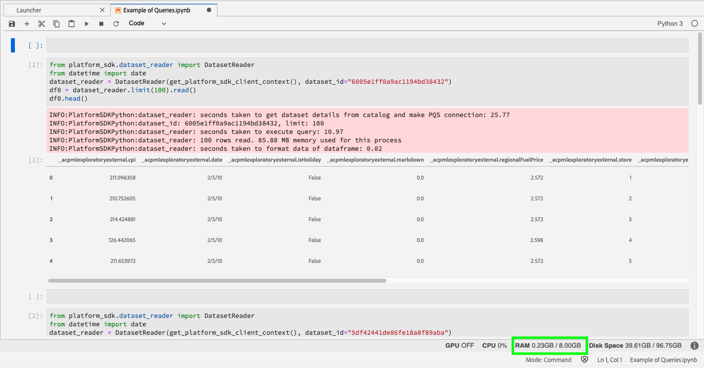
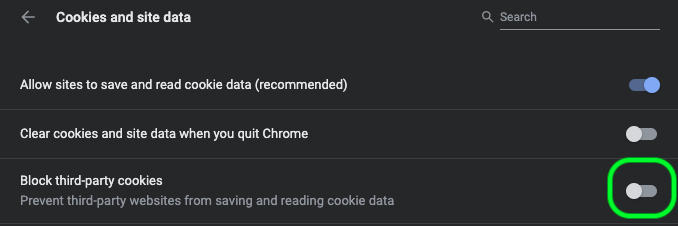

# [!DNL Data Science Workspace] – Handbuch zur Fehlerbehebung

Dieses Dokument enthält Antworten auf häufig gestellte Fragen zu Adobe Experience Platform [!DNL Data Science Workspace]. Antworten zu Fragen und allgemeine Informationen zur Fehlerbehebung bei [!DNL Platform]-APIs finden Sie im [Handbuch zur Fehlerbehebung bei Adobe Experience Platform-APIs](../landing/troubleshooting.md).

## Abfragestatus von JupyterLab Notebook bleibt im Ausführungsstatus stecken

Ein JupyterLab-Notebook zeigt möglicherweise im Falle von unzureichendem Arbeitsspeicher an, dass sich eine Zelle im Ausführungsstatus befindet, und zwar auf unbestimmte Zeit. Wenn Sie beispielsweise einen großen Datensatz abfragen oder mehrere nachfolgende Abfragen ausführen, kann dem JupyterLab-Notebook der verfügbare Speicher zum Speichern des resultierenden Datenrahmenobjekts ausgehen. Für eine solche Situation gibt es bestimmte Anzeichen. Zunächst wechselt der Kernel in den Leerlauf-Status, obwohl die Zelle als „Wird ausgeführt“ angezeigt wird, wie durch das Symbol [`*`] neben der Zelle angegeben. Darüber hinaus wird in der unteren Leiste die Menge des verwendeten/verfügbaren Arbeitsspeichers (RAM) angegeben.



Während des Lesens der Daten kann der Arbeitsspeicher anwachsen, bis er die maximale Menge an zugewiesenem Speicher erreicht. Der Arbeitsspeicher wird freigegeben, sobald der maximale Arbeitsspeicher erreicht ist und der Kernel neu gestartet wird. Dies bedeutet, dass der Arbeitsspeicher in diesem Szenario aufgrund des Kernel-Neustarts sehr knapp sein kann, während der Arbeitsspeicher kurz vor dem Neustart sehr nahe am maximal zugewiesenen RAM gewesen ist.

Zur Problembehebung wählen Sie oben rechts in JupyterLab das Zahnradsymbol aus, schieben Sie den Regler nach rechts und wählen Sie dann die Option zum **[!UICONTROL Aktualisieren der Konfigurationen]** aus, um mehr RAM zuzuweisen. Wenn Sie mehrere Abfragen ausführen und sich der RAM-Wert der maximal zugewiesenen Menge nähert, starten Sie außerdem den Kernel neu, um den verfügbaren RAM-Wert zurückzusetzen, es sei denn, Sie benötigen die Ergebnisse früherer Abfragen. Dadurch wird sichergestellt, dass die maximale RAM-Menge für die aktuelle Abfrage verfügbar ist.


Wenn Sie die maximale Arbeitsspeicherkapazität (RAM) zuweisen und dieses Problem weiterhin auftritt, können Sie Ihre Abfrage so ändern, dass sie mit einer kleineren Datensatzgröße arbeitet, indem Sie die Spalten oder den Datenbereich reduzieren. Um die gesamte Datenmenge zu nutzen, wird empfohlen, ein Spark-Notebook zu verwenden.

## [!DNL JupyterLab]-Umgebung wird nicht in [!DNL Google Chrome] geladen 

>[!IMPORTANT]
>
>Dieses Problem wurde behoben, könnte jedoch im Browser Google Chrome 80.x noch vorhanden sein. Stellen Sie sicher, dass Ihr Chrome-Browser auf dem aktuellen Stand ist.

Bei der Version 80.x des [!DNL Google Chrome]-Browsers sind alle Drittanbieter-Cookies standardmäßig blockiert. Diese Richtlinie kann verhindern, dass [!DNL JupyterLab] aus Adobe Experience Platform heraus geladen wird.

Gehen Sie wie folgt vor, um dieses Problem zu beheben:

Navigieren Sie in Ihrem [!DNL Chrome]-Browser nach oben rechts und wählen Sie **Einstellungen** aus. (Sie können auch „chrome://settings/“ kopieren und in die Adressleiste einfügen.) Scrollen Sie dann auf der Seite nach unten und klicken Sie auf das Dropdown-Menü **Erweitert**.


Der Abschnitt **Datenschutz und Sicherheit** wird angezeigt. Klicken Sie anschließend auf **Site-Einstellungen** und dann auf **Cookies und Site-Daten**.


Schalten Sie abschließend „Drittanbieter-Cookies blockieren“ auf „AUS“.



>[!NOTE]
>
>Als Alternative können Sie Drittanbieter-Cookies deaktivieren und [*.]ds.adobe.net zur Zulassungsliste hinzufügen.

Navigieren Sie in Ihrer Adressleiste zu „chrome://flags/“. Suchen und deaktivieren Sie über das Dropdown-Menü auf der rechten Seite das Flag für *Standard-Cookies von SameSite*.


Nach Schritt 2 werden Sie aufgefordert, Ihren Browser neu zu starten. Nach dem Neustart sollte [!DNL Jupyterlab] zugänglich sein.

## Warum kann ich in Safari nicht auf [!DNL JupyterLab] zugreifen?

In Safari werden vor der Safari-Version 12 standardmäßig Drittanbieter-Cookies deaktiviert. Da sich Ihre VM-Instanz von [!DNL Jupyter] in einer anderen Domain als der übergeordnete Frame befindet, ist für Adobe Experience Platform derzeit die Aktivierung von Drittanbieter-Cookies erforderlich. Aktivieren Sie Drittanbieter-Cookies oder wechseln Sie zu einem anderen Browser, z. B. [!DNL Google Chrome].

Für Safari 12 müssen Sie den Benutzeragenten auf „[!DNL Chrome]“ oder „[!DNL Firefox]“ umschalten. Um Ihren Benutzeragenten zu wechseln, öffnen Sie zunächst das *Safari*-Menü und wählen Sie **Voreinstellungen** aus. Das Fenster „Voreinstellungen“ wird angezeigt.


Wählen Sie im Fenster der Safari-Voreinstellungen die Option **Erweitert** aus. Aktivieren Sie dann das Kontrollkästchen *Entwicklungsmenü in Menüleiste anzeigen*. Sie können das Fenster mit den Voreinstellungen schließen, nachdem dieser Schritt abgeschlossen ist.


Wählen Sie als Nächstes in der oberen Navigationsleiste das Menü **Entwickeln** aus. Bewegen Sie den Mauszeiger innerhalb des Dropdown-Menüs **Entwickeln** über **Benutzeragent**. Sie können die **[!DNL Chrome]**- oder **[!DNL Firefox]**-Benutzeragenten-Zeichenfolge auswählen, die Sie verwenden möchten.


## Warum wird mir beim Versuch, eine Datei in [!DNL JupyterLab] hochzuladen oder zu löschen, die Meldung „403 Verboten“ angezeigt?

Wenn Ihr Browser einen Werbeblocker wie [!DNL Ghostery] oder [!DNL AdBlock] Plus nutzt, muss die Domain „\*.adobe.net“ in jedem Werbeblocker für [!DNL JupyterLab] zugelassen werden, um normal zu funktionieren. Dies liegt daran, dass virtuelle [!DNL JupyterLab]-Maschinen in einer anderen Domain als der [!DNL Experience Platform]-Domain ausgeführt werden.

## Warum sehen bestimmte Teile meines [!DNL Jupyter Notebook] verschlüsselt aus bzw. warum werden sie nicht als Code gerendert?

Dies kann vorkommen, wenn die betreffende Zelle versehentlich von „Code“ in „Markdown“ geändert wird. Während eine Code-Zelle fokussiert ist, wird durch Drücken der Tastenkombination **Esc+M** der Zellentyp in „Markdown“ geändert. Der Zellentyp kann durch die Dropdown-Anzeige oben im Notebook für die ausgewählten Zellen geändert werden. Um einen Zellentyp in „Code“ zu ändern, wählen Sie zunächst die Zelle aus, die Sie ändern möchten. Klicken Sie anschließend auf das Dropdown-Menü, das den aktuellen Zellentyp angibt, und wählen Sie dann „Code“ aus.


## Wie installiere ich benutzerdefinierte [!DNL Python]-Bibliotheken?

Im [!DNL Python]-Kernel sind viele gängige Bibliotheken für maschinelles Lernen vorinstalliert. Sie können jedoch zusätzliche benutzerdefinierte Bibliotheken installieren, indem Sie den folgenden Befehl in einer Code-Zelle ausführen:

```shell
!pip install {LIBRARY_NAME}
```

Eine vollständige Liste der vorinstallierten [!DNL Python]-Bibliotheken finden Sie im [Anhang des JupyterLab-Benutzerhandbuchs](./jupyterlab/overview.md#supported-libraries).

## Kann ich benutzerdefinierte PySpark-Bibliotheken installieren?

Leider können Sie selbst keine zusätzlichen Bibliotheken für den PySpark-Kernel installieren. Sie können sich jedoch an den Adobe-Kundendienst wenden, um benutzerdefinierte PySpark-Bibliotheken installieren zu lassen.

Eine Liste der vorinstallierten PySpark-Bibliotheken finden Sie im [Anhang des JupyterLab-Benutzerhandbuchs](./jupyterlab/overview.md#supported-libraries).

## Ist es möglich, [!DNL Spark]-Cluster-Ressourcen für den [!DNL JupyterLab] [!DNL Spark]- oder PySpark-Kernel zu konfigurieren?

Sie können Ressourcen konfigurieren, indem Sie der ersten Zelle Ihres Notebooks den folgenden Block hinzufügen:

```python
%%configure -f 
{
    "numExecutors": 10,
    "executorMemory": "8G",
    "executorCores":4,
    "driverMemory":"2G",
    "driverCores":2,
    "conf": {
        "spark.cores.max": "40"
    }
}
```

Weitere Informationen zum Konfigurieren von [!DNL Spark]-Cluster-Ressourcen, einschließlich der vollständigen Liste der konfigurierbaren Eigenschaften, finden Sie im [JupyterLab-Benutzerhandbuch](./jupyterlab/overview.md#kernels).

## Warum erhalte ich eine Fehlermeldung, wenn ich versuche, bestimmte Aufgaben für größere Datensätze auszuführen?

Wenn Sie einen Fehler aus einem Grund wie `Reason: Remote RPC client disassociated. Likely due to containers exceeding thresholds, or network issues.` erhalten, bedeutet dies normalerweise, dass dem Treiber oder einem Executor nicht mehr genügend Speicher zur Verfügung steht. Weiterführende Informationen zu Datenbeschränkungen und zur Ausführung von Aufgaben für große Datensätze finden Sie in der JupyterLab-Notebooks-Dokumentation zu [Datenzugriff](./jupyterlab/access-notebook-data.md). Normalerweise lässt sich dieser Fehler beheben, indem `mode` von `interactive` zu `batch` geändert wird.

Außerdem sollten Sie beim Schreiben großer Spark-/PySpark-Datensätze Ihre Daten zwischenspeichern (`df.cache()`), bevor Sie den Schreib-Code ausführen. Dies kann nämlich die Leistung erheblich verbessern.

<!-- remove this paragraph at a later date once the sdk is updated -->

Wenn beim Lesen von Daten Probleme auftreten und Sie Umwandlungen auf die Daten anwenden, versuchen Sie, Ihre Daten vor den Umwandlungen zwischenzuspeichern. Das Zwischenspeichern Ihrer Daten verhindert mehrfache Lesevorgänge über das Netzwerk hinweg. Lesen Sie zunächst die Daten. Speichern Sie als Nächstes die Daten zwischen (`df.cache()`). Führen Sie abschließend Ihre Umwandlungen durch.

## Warum brauchen meine Spark-/PySpark-Notebooks so lange, um Daten zu lesen und zu schreiben?

Wenn Sie Umwandlungen an Daten durchführen, wie beispielsweise mithilfe von `fit()`, werden die Umwandlungen möglicherweise mehrfach ausgeführt. Um die Leistung zu steigern, speichern Sie Ihre Daten mit `df.cache()` vor dem Ausführen von `fit()` zwischen. Dadurch wird sichergestellt, dass die Umwandlungen nur ein einziges Mal ausgeführt werden und ein mehrfaches Lesen über das Netzwerk vermieden wird.

**Empfohlene Reihenfolge:** Lesen Sie zunächst die Daten. Führen Sie anschließend Umwandlungen durch und speichern Sie die Daten zwischen (`df.cache()`). Führen Sie abschließend `fit()` aus.

## Warum laufen meine Spark-/PySpark-Notebooks nicht?

Möglicherweise erhalten Sie Fehler mit folgendem Inhalt:

- Auftrag aufgrund von Staging-Fehler abgebrochen ... Kann nur RDDs mit derselben Anzahl von Elementen in jeder Partition komprimieren.
- Remote RPC-Client getrennt und andere Speicherfehler.
- Schlechte Leistung beim Lesen und Schreiben von Datensätzen.

Stellen Sie in diesem Fall sicher, dass Sie die Daten zwischenspeichern (`df.cache()`), bevor Sie die Daten schreiben. Beim Ausführen von Code in Notebooks kann durch Verwendung von `df.cache()` vor einer Aktion wie `fit()` die Notebook-Leistung erheblich verbessert werden. Durch die Verwendung von `df.cache()` vor dem Schreiben eines Datensatzes wird sichergestellt, dass die Umwandlungen nur ein einziges Mal und nicht mehrfach ausgeführt werden.

## [!DNL Docker Hub]-Beschränkungen im Datenwissenschafts-Arbeitsbereich

Seit dem 20. November 2020 sind Ratenbeschränkungen für die anonyme und kostenlose authentifizierte Verwendung von Docker Hub in Kraft. Die anonyme und kostenlose Nutzung von [!DNL Docker Hub] ist auf 100 Container-Image-Pull-Anforderungen alle sechs Stunden beschränkt. Wenn Sie von diesen Änderungen betroffen sind, erhalten Sie diese Fehlermeldung: `ERROR: toomanyrequests: Too Many Requests.` oder `You have reached your pull rate limit. You may increase the limit by authenticating and upgrading: https://www.docker.com/increase-rate-limits.`.

Derzeit wirkt sich diese Ratenbeschränkung nur auf Ihr Unternehmen aus, wenn Sie versuchen, innerhalb des sechsstündigen Zeitraums 100 Notebook-Rezepte zu erstellen, oder wenn Sie Spark-basierte Notebooks im Datenwissenschafts-Arbeitsbereich verwenden, die häufig hoch- oder herunterskalieren. Dies ist jedoch unwahrscheinlich, da der Cluster, auf dem diese ausgeführt werden, zwei Stunden lang aktiv bleibt, bevor er in den Leerlauf wechselt. Dadurch wird die Anzahl der erforderlichen Pull-Vorgänge reduziert, wenn der Cluster aktiv ist. Wenn Sie einen der oben genannten Fehler erhalten, müssen Sie warten, bis Ihr [!DNL Docker]-Limit zurückgesetzt wird.

Weitere Informationen zu [!DNL Docker Hub]-Ratenbeschränkungen finden Sie in der [Docker Hub-Dokumentation](https://www.docker.com/increase-rate-limits). Eine Lösung dafür wird derzeit erarbeitet und ist für eine nachfolgende Version vorgesehen.
