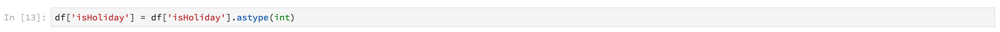
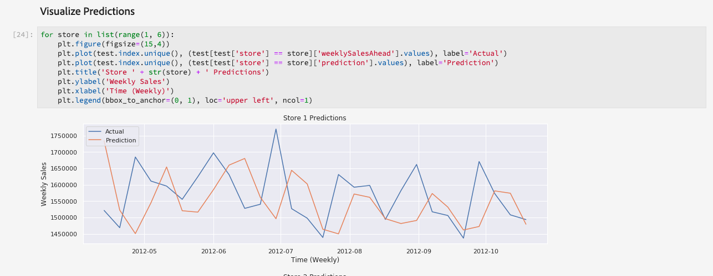

# Anleitung zum Data Science Workspace

Dieses Dokument bietet eine exemplarische Anleitung für den Adobe Experience Platform Data Science Workspace. Insbesondere werden wir über den allgemeinen Arbeitsablauf, den ein Datenwissenschaftler durchlaufen würde, hinausgehen, um ein Problem mit maschinellem Lernen zu lösen.

## Voraussetzungen

- Ein registriertes Adobe ID-Konto
   - Das Adobe ID-Konto muss einer Organisation mit Zugriff auf die Adobe Experience Platform und den Data Science Workspace hinzugefügt worden sein.

## Motivation des Datenwissenschaftlers

Ein Einzelhändler steht vor vielen Herausforderungen, um auf dem aktuellen Markt wettbewerbsfähig zu bleiben. Eines der Hauptanliegen des Einzelhändlers ist es, über die optimale Preisgestaltung seiner Produkte zu entscheiden und die Verkaufsentwicklung vorherzusagen. Mit einem präzisen Prognosemodell wäre der Einzelhändler in der Lage, das Verhältnis zwischen der Nachfrage- und der Preispolitik zu ermitteln und optimierte Preisentscheidungen zu treffen, um Verkäufe und Umsatz zu maximieren.

## Lösung von Datenwissenschaftlern

Die Lösung eines Datenwissenschaftlers besteht darin, den Reichtum historischer Daten zu nutzen, auf die ein Einzelhändler Zugriff hat, zukünftige Trends vorherzusagen und Preisentscheidungen zu optimieren. Wir werden frühere Verkaufsdaten verwenden, um unser maschinelles Lernmodell auszubilden und das Modell zur Vorhersage künftiger Verkaufstrends zu verwenden. Damit kann der Einzelhändler Einblicke erhalten, die ihm bei Preisänderungen helfen.

In diesem Überblick gehen wir über die Schritte hinaus, die ein Datenwissenschaftler ausführen würde, um einen Datensatz zu erstellen und ein Modell zu erstellen, das die wöchentlichen Verkäufe vorhersagt. Wir werden die folgenden Abschnitte im Beispiel für Einzelhandelsverkäufe im Adobe Experience Platform Data Science Workspace durchgehen:

- [Einrichten](#setup)
- [Daten untersuchen](#exploring-data)
- [Funktionstechnik](#feature-engineering)
- [Schulung und Überprüfung](#training-and-verification)

### Notebooks im Arbeitsbereich der Datenwissenschaften

Zunächst möchten wir ein JupyterLab-Notebook erstellen, um das &quot;Retail Sales&quot;-Musterheft zu öffnen. Die Schritte des Datenwissenschaftlers im Notebook werden uns ein Verständnis eines typischen Arbeitsablaufs verschaffen.

Klicken Sie in der Benutzeroberfläche von Adobe Experience Platform auf die Registerkarte Data Science im oberen Menü, um zum Data Science Workspace zu gelangen. Klicken Sie auf dieser Seite auf die Registerkarte JupyterLab, um den JupyterLab-Starter zu öffnen. Sie sollten eine ähnliche Seite sehen.


In unserem Tutorial verwenden wir Python 3 im Jupyter-Notebook, um zu zeigen, wie man auf die Daten zugreifen und sie untersuchen kann. Auf der Startseite stehen Ihnen Beispielnotizen zur Verfügung. Wir werden die Stichprobe &quot;Einzelhandel&quot; für Python 3 verwenden.


### Einrichten {#setup}

Mit dem geöffneten Retail Sales Notebook laden wir als Erstes die für unseren Workflow erforderlichen Bibliotheken. In der folgenden Liste wird kurz beschrieben, wofür die einzelnen Anwendungen verwendet werden:
- **numpy** - eine wissenschaftliche Computing-Bibliothek, die Unterstützung für große, multidimensionale Arrays und Matrizen bietet
- **Pandas** - Bibliothek, die Datenstrukturen und -vorgänge für die Datenverarbeitung und Analyse Angebot
- **matplotlib.pyplot** - Plotting-Bibliothek, die beim Plotting eine MATLAB-ähnliche Erfahrung bereitstellt
- **seaborn** - Visualisierungsbibliothek für Daten auf hoher Ebene basierend auf matplotlib
- **sklearn** - Bibliothek für maschinelles Lernen mit Classification-, Regression-, Support-Vektor- und Cluster-Algorithmen
- **Warnungen** - Bibliothek, die Warnmeldungen steuert

### Daten untersuchen {#exploring-data}

#### Daten laden

Nachdem die Bibliotheken geladen wurden, können wir Beginn mit den Daten arbeiten. Der folgende Python-Code verwendet die `DataFrame` Datenstruktur von Pandas und die [Funktion read_csv()](https://pandas.pydata.org/pandas-docs/stable/generated/pandas.read_csv.html#pandas.read_csv) , um das auf Github gehostete CSV in das Pandas DataFrame zu lesen:


Die DataFrame-Datenstruktur von Pandas ist eine zweidimensionale beschriftete Datenstruktur. Um die Dimensionen unserer Daten schnell zu sehen, können wir sie verwenden `df.shape`. Dadurch wird ein Tupel zurückgegeben, das die Dimensionalität des DataFrame darstellt:


Schließlich können wir einen Blick darauf werfen, wie unsere Daten aussehen. Wir können die ersten `df.head(n)` Zeilen des DataFrame `n` zur Ansicht verwenden:


#### Statistische Zusammenfassung

Wir können Pythons Pandas-Bibliothek nutzen, um den Datentyp jedes Attributs zu erhalten. Die Ausgabe des folgenden Aufrufs gibt uns Informationen über die Anzahl der Einträge und den Datentyp für jede der Spalten:

```PYTHON
df.info()
```


Diese Informationen sind nützlich, da wir durch Kenntnis des Datentyps für jede Spalte wissen können, wie die Daten zu behandeln sind.

Schauen wir uns nun die statistische Zusammenfassung an. Nur die numerischen Datentypen werden angezeigt `date`, `storeType`und `isHoliday` nicht ausgegeben:

```PYTHON
df.describe()
```


Damit können wir sehen, dass für jedes Merkmal 6435 Instanzen vorhanden sind. Darüber hinaus werden statistische Daten wie Mittelwert, Standardabweichung (std), Min., Max. und Interquartilien angegeben. Dies gibt uns Informationen über die Abweichung für die Daten. Im nächsten Abschnitt werden wir über Visualisierung gehen, die mit diesen Informationen zusammenarbeitet, um uns ein vollständiges Verständnis unserer Daten zu verschaffen.

Wenn wir uns die Mindest- und Höchstwerte ansehen, `store`können wir feststellen, dass 45 verschiedene Datenspeicher vorhanden sind. Es gibt auch `storeTypes` welche unterscheiden, was ein Laden ist. Wir können die Verteilung sehen, `storeTypes` indem wir Folgendes tun:


Das bedeutet, dass 22 Läden von `storeType A` , 17 sind `storeType B`und 6 sind `storeType C`.

#### Visualisieren von Daten

Jetzt, da wir unsere Datenrahmenwerte kennen, möchten wir dies durch Visualisierungen ergänzen, um die Dinge klarer zu gestalten und Muster leichter zu identifizieren. Diese Diagramme sind auch nützlich, wenn Ergebnisse an eine Audience übermittelt werden.

#### Einheitliche Diagramme

Univariate-Diagramme sind Diagramme einer einzelnen Variablen. Ein gängiges univariatives Diagramm, das zur Visualisierung Ihrer Daten verwendet wird, sind Box- und Whiskerplotten.

Mit unserem Retail-Datensatz von vorher können wir die Box und Whisker-Plot für jeden der 45 Läden und ihre wöchentlichen Verkäufe generieren. Der Plot wird mithilfe der `seaborn.boxplot` Funktion generiert.


Eine Box- und Whisker-Plot wird verwendet, um die Verteilung der Daten anzuzeigen. Die äußeren Linien des Grundstücks zeigen den oberen und unteren Quartil, während der Rahmen den interquartilen Bereich umfasst. Die Linie im Feld markiert den Median. Alle Datenpunkte, die mehr als das 1,5-fache des oberen oder unteren Quartil betragen, werden als Kreis markiert. Diese Punkte werden als Ausreißer betrachtet.

Als Nächstes können wir die wöchentlichen Verkäufe mit der Zeit zeichnen. Wir zeigen nur die Ausgabe des ersten Ladens. Der Code im Notebook erzeugt 6 Parzellen, die 6 der 45 Stores in unserem Datensatz entsprechen.


Mit diesem Diagramm können wir die wöchentlichen Verkäufe über einen Zeitraum von 2 Jahren vergleichen. Mit der Zeit lassen sich Verkaufsspitzen und Talmuster leicht erkennen.

#### Multivarianz-Diagramme

Multivarianz-Diagramme werden verwendet, um die Interaktion zwischen Variablen anzuzeigen. Mit der Visualisierung können Datenwissenschaftler sehen, ob Korrelationen oder Muster zwischen den Variablen bestehen. Ein häufig verwendetes Multivarianz-Diagramm ist eine Korrelationsmatrix. Bei einer Korrelationsmatrix werden Abhängigkeiten zwischen mehreren Variablen mit dem Korrelationskoeffizienten quantifiziert.

Mit demselben für den Handel bestimmten Datensatz können wir die Korrelationsmatrix generieren.


Beachten Sie die Diagonale der Diagonalen in der Mitte. Dies zeigt, dass eine Variable beim Vergleich mit sich selbst eine vollständige positive Korrelation aufweist. Starke positive Korrelation wird eine Größenordnung näher an 1 liegen, während schwache Korrelationen näher an 0 liegen werden. Negative Korrelation wird mit einem negativen Koeffizienten angezeigt, der einen umgekehrten Trend zeigt.

### Funktionstechnik {#feature-engineering}

In diesem Abschnitt werden wir Änderungen an unserem Retail-Datensatz vornehmen. Wir führen die folgenden Vorgänge durch:

- Hinzufügen von Wochen- und Jahresspalten
- storeType in eine Indikatorvariable konvertieren
- isHoliday in eine numerische Variable konvertieren
- prognostizieren Sie wöchentlichVerkäufe der nächsten Woche

#### Spalten Hinzufügen Woche und Jahr

Das aktuelle Datumsformat (`2010-02-05`) lässt sich kaum unterscheiden, dass die Daten jede Woche gültig sind. Aus diesem Grund werden wir das Datum in die Woche und das Jahr umrechnen.


Nun sind die Woche und das Datum wie folgt:


#### storeType in Indikatorvariable konvertieren

Als Nächstes konvertieren wir die Spalte storeType in Spalten, die die einzelnen Spalten darstellen `storeType`. Es gibt 3 Store-Typen (`A`, `B`, `C`), aus denen wir 3 neue Spalten erstellen. Der jeweils eingestellte Wert ist ein boolescher Wert, bei dem je nach dem, was der Wert `storeType` war, und `0` für die anderen beiden Spalten &quot;1&quot;festgelegt wird.


Die aktuelle `storeType` Spalte wird entfernt.

#### isHoliday in numerischen Typ konvertieren

Die nächste Änderung besteht darin, den `isHoliday` booleschen in eine numerische Darstellung zu ändern.




#### Prognostizieren Sie wöchentlichVerkäufe der nächsten Woche

Jetzt möchten wir jedem unserer Datensätze vorige und künftige wöchentliche Verkäufe hinzufügen. Wir tun dies, indem wir unsere `weeklySales`ausgleichen. Zusätzlich berechnen wir den `weeklySales` Unterschied. Dies geschieht durch Subtraktion `weeklySales` des Vorwochenberichts `weeklySales`.


Da wir die `weeklySales` Daten 45 Datensätze vorwärts und 45 Datensätze rückwärts vergleichen, um neue Spalten zu erstellen, haben die ersten und letzten 45 Datenpunkte NaN-Werte. Wir können diese Punkte aus unserem Datensatz entfernen, indem wir die `df.dropna()` Funktion verwenden, die alle Zeilen mit NaN-Werten entfernt.


Eine Zusammenfassung des Datensatzes nach unseren Änderungen ist unten dargestellt:


### Schulung und Überprüfung {#training-and-verification}

Nun ist es an der Zeit, einige Datenmodelle zu erstellen und auszuwählen, welches Modell die beste Leistung für die Vorhersage künftiger Verkäufe ist. Wir werden die folgenden 5 Algorithmen auswerten:

- Lineare Regression
- Entscheidungsstruktur
- Random Forest
- Verlaufsverstärkung
- K Nachbarn

#### Datensatz in Untergruppen für Schulung und Tests aufteilen

Wir brauchen eine Möglichkeit zu wissen, wie genau unser Modell Werte vorhersagen kann. Diese Bewertung kann durchgeführt werden, indem ein Teil des Datensatzes als Validierung und der Rest als Schulungsdaten zugewiesen wird. Da `weeklySalesAhead` die tatsächlichen zukünftigen Werte von `weeklySales`sind, können wir dies verwenden, um zu bewerten, wie genau das Modell bei der Vorhersage des Werts ist. Die Aufteilung erfolgt unten:


Jetzt haben wir die Modelle vorbereitet `X_train` und `y_train` die Modelle vorbereitet `X_test` und werden später bewertet `y_test` werden.

#### Spot-Check-Algorithmen

In diesem Abschnitt erklären wir alle Algorithmen in ein Array namens `model`. Als Nächstes durchlaufen wir dieses Array und geben für jeden Algorithmus unsere Schulungsdaten ein, mit `model.fit()` denen ein Modell erstellt wird `mdl`. Mithilfe dieses Modells werden wir `weeklySalesAhead` mit unseren `X_test` Daten vorhersagen.


Für die Bewertung nehmen wir die mittlere prozentuale Differenz zwischen den prognostizierten Werten `weeklySalesAhead` und den tatsächlichen Werten in den `y_test` Daten. Da wir den Unterschied zwischen unserer Prognose und dem tatsächlichen reduzieren wollen, ist der Regressor für die Verlaufsverstärkung das leistungsstärkste Modell.

#### Prognosen visualisieren

Schließlich werden wir unser Prognosemodell mit den tatsächlichen wöchentlichen Verkaufswerten visualisieren. Die blaue Linie stellt die tatsächlichen Zahlen dar, während das Grün unsere Prognose mit der Verlaufsverstärkung darstellt. Der folgende Code generiert 6 Grundstücke, die 6 der 45 Läden in unserem Datensatz darstellen. Es `Store 1` wird nur hier gezeigt:



<!--TODO UI Flow> -->

## Zusammenfassung

Mit dieser Übersicht haben wir den Arbeitsablauf durchlaufen, den ein Datenwissenschaftler durchlaufen würde, um ein Einzelhandelsproblem zu lösen. Im Einzelnen haben wir die folgenden Schritte unternommen, um eine Lösung zu finden, die zukünftige wöchentliche Verkäufe vorhersagt.

- [Einrichten](#setup)
- [Daten untersuchen](#exploring-data)
- [Funktionstechnik](#feature-engineering)
- [Schulung und Überprüfung](#training-and-verification)