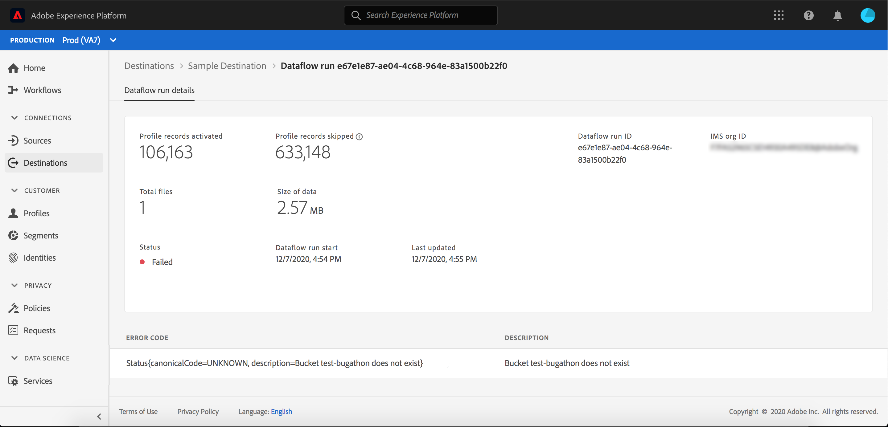

# Überwachen von Datenflüssen auf Ziele in der Benutzeroberfläche

Mit Zielen können Sie Ihre Daten von Adobe Experience Platform an unzählige externe Partner aktivieren. Dieses Lernprogramm enthält Anweisungen dazu, wie Sie mithilfe der Benutzeroberfläche &quot;Experience Platform&quot;Datenflüsse für Ihre Ziele überwachen können.

## Erste Schritte

Dieses Tutorial setzt ein Grundverständnis der folgenden Komponenten von Adobe Experience Platform voraus:

- [Ziele](../../destinations/home.md): Ziele sind vorgefertigte Integrationen mit häufig verwendeten Anwendungen, die die nahtlose Aktivierung von Daten von Platform für Cross-Kanal-Marketing-Kampagnen, E-Mail-Kampagnen, gezielte Werbung und viele andere Anwendungsfälle ermöglichen.
- [Sandboxen](../../sandboxes/home.md):  [!DNL Experience Platform] bietet virtuelle Sandboxes, die eine einzelne  [!DNL Platform] Instanz in separate virtuelle Umgebung unterteilen, um Anwendungen für digitale Erlebnisse zu entwickeln und weiterzuentwickeln.

## Überwachen von Datenflüssen

Navigieren Sie im Arbeitsbereich **[!UICONTROL Ziele]** der Plattform-Benutzeroberfläche zur Registerkarte **[!UICONTROL Durchsuchen]** und wählen Sie den Namen des Ziels aus, das Sie Ansicht haben möchten.

Eine Liste der vorhandenen Datenflüsse wird angezeigt. Auf dieser Seite finden Sie eine Liste von anzeigbaren Datenflüssen, einschließlich Informationen über ihr Ziel, ihren Benutzernamen, die Anzahl der Datenflüsse und ihren Status.

Weitere Informationen zu Status finden Sie in der folgenden Tabelle:

| Status | Beschreibung |
| ------ | ----------- |
| Aktiviert | Der Status `Enabled` gibt an, dass ein Datendurchlauf aktiv ist und Daten gemäß dem Zeitplan einbezieht, der sie bereitgestellt wurde. |
| Deaktiviert | Der Status `Disabled` gibt an, dass ein Datennachweis inaktiv ist und keine Daten einnimmt. |
| Verarbeitung | Der Status `Processing` gibt an, dass ein Datendurchlauf noch nicht aktiv ist. Dieser Status tritt oft unmittelbar nach der Erstellung eines neuen Datenflusses auf. |
| Fehler | Der Status `Error` gibt an, dass die Aktivierung eines Datenflusses unterbrochen wurde. |

## [!UICONTROL Datenaflow-Ausführung]

Die Registerkarte [!UICONTROL Datenaflow-Ausführung] enthält Metrikdaten zu Ihren Datenaflow-Aufrufen zu Stapelzielen. Es wird eine Liste der einzelnen Vorgänge und der zugehörigen Metriken sowie die folgenden Summen für Profil-Datensätze angezeigt:

- **[!UICONTROL Profil-Datensätze aktiviert]**: Die Gesamtanzahl der Profil-Datensätze, die zur Aktivierung erstellt oder aktualisiert wurden.
- **[!UICONTROL Profil-Datensätze übersprungen]**: Die Gesamtanzahl der Profil-Datensätze, die aufgrund von Profil-Ausstiegen oder fehlenden Attributen für die Aktivierung übersprungen werden.

>[!NOTE]
>
>Dataflow-Ausläufe werden basierend auf der Häufigkeit des Planvorgangs des Zieldatafloms generiert. Für jede auf ein Segment angewendete Zusammenführungsrichtlinie wird ein separater Datendurchlauf ausgeführt.

Um die Details eines bestimmten Datenflusses Ansicht, wählen Sie die Ausführungszeit des Beginns aus der Liste aus. Die Detailseite für einen Datenfluss enthält weitere Informationen, wie z. B. die Größe der verarbeiteten Daten und eine Liste der Fehler, die bei der Fehlerdiagnose aufgetreten sind.

