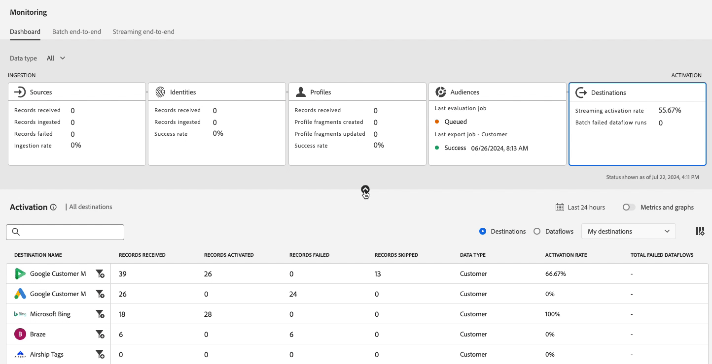

# Überwachen von Datenflüssen für Ziele in der Benutzeroberfläche

Verwenden Sie die verschiedenen Ziele im Experience Platform-Katalog, um Ihre Daten von Experience Platform für unzählige externe Partner zu aktivieren. Experience Platform erleichtert die Verfolgung des Datenflusses zu Ihren Zielen, indem es für Transparenz bei Datenflüssen sorgt.

Das Überwachungs-Dashboard bietet eine visuelle Darstellung des Journey eines Datenflusses, einschließlich des Ziels, für das die Daten aktiviert werden, des Datentyps, den Sie anzeigen, der exportierten Daten pro Datenflussausführung und vieles mehr.

Dieses Tutorial enthält Anweisungen dazu, wie Sie Datenflüsse entweder direkt im Arbeitsbereich „Ziele“ überwachen oder das Überwachungs-Dashboard verwenden können, um Datenflüsse für Ihre Ziele mithilfe der Experience Platform-Benutzeroberfläche zu überwachen.

## Erste Schritte {#getting-started}

Dieses Handbuch setzt ein Verständnis der folgenden Komponenten von Adobe Experience Platform voraus:

- [Datenflüsse](../home.md): Datenflüsse sind eine Darstellung von Datenvorgängen, die Daten über Experience Platform verschieben. Datenflüsse werden über verschiedene Dienste hinweg konfiguriert und helfen beim Verschieben von Daten aus Quell-Connectoren in Zieldatensätze, in [!DNL Identity] und [!DNL Profile] sowie in [!DNL Destinations].
   - [Datenflussausführungen](../../sources/notifications.md): Datenflussausführungen sind die wiederkehrenden geplanten Aufträge, die auf der Häufigkeitskonfiguration ausgewählter Datenflüsse basieren.
- [Ziele](../../destinations/home.md): Ziele sind vorgefertigte Integrationen mit häufig verwendeten Programmen, die die nahtlose Aktivierung von Daten aus Experience Platform für kanalübergreifende Marketing-Kampagnen, E-Mail-Kampagnen, zielgruppengerechte Werbung und viele andere Anwendungsfälle ermöglichen.
- [Sandboxes](../../sandboxes/home.md): [!DNL Experience Platform] bietet virtuelle Sandboxes, die eine einzelne [!DNL Experience Platform]-Instanz in separate virtuelle Umgebungen unterteilen, damit Sie Programme für digitale Erlebnisse entwickeln können.

## Überwachen von Datenflüssen im Arbeitsbereich Ziele {#monitor-dataflows-in-the-destinations-workspace}

Navigieren Sie im **[!UICONTROL Destinations]** Arbeitsbereich in der Experience Platform-Benutzeroberfläche zur Registerkarte **[!UICONTROL Browse]** und wählen Sie den Namen eines Ziels aus, das Sie anzeigen möchten.

Eine Liste der vorhandenen Datenflüsse wird angezeigt. Auf dieser Seite finden Sie eine Liste der sichtbaren Datenflüsse, einschließlich Informationen zu ihrem Ziel, Benutzernamen, der Anzahl der Datenflüsse und Status.

In der folgenden Tabelle finden Sie weitere Informationen zu Status:

| Status | Beschreibung |
| ------ | ----------- |
| Aktiviert | Der `Enabled` gibt an, dass ein Datenfluss aktiv ist und Daten entsprechend dem bereitgestellten Zeitplan exportiert. |
| Deaktiviert | Der `Disabled` gibt an, dass ein Datenfluss inaktiv ist und keine Daten exportiert. |
| Verarbeitung läuft | Der `Processing` zeigt an, dass ein Datenfluss noch nicht aktiv ist. Dieser Status tritt häufig unmittelbar nach der Erstellung eines neuen Datenflusses auf. |
| Fehler | Der `Error` zeigt an, dass der Aktivierungsprozess eines Datenflusses unterbrochen wurde. |

### Datenflussausführungen für Streaming-Ziele {#dataflow-runs-for-streaming-destinations}

>[!CONTEXTUALHELP]
>id="platform_monitoring_dataflow_run_details_activation_streaming"
>title="Details zur Datenflussausführung"
>abstract="Die Details zur Ausführung des Ziel-Datenflusses enthalten Informationen zum Aktivierungsstatus einer Zielgruppe und Metriken, die aus dem Echtzeit-Kundenprofil abgerufen wurden, um eindeutige Identitäten zu generieren. Weitere Informationen finden Sie im Handbuch zu Metrikdefinitionen."

>[!CONTEXTUALHELP]
>id="platform_monitoring_profiles_received_streaming"
>title="Empfangene Profile"
>abstract="Die Gesamtzahl der im Datenfluss empfangenen Profile. Dieser Wert wird alle 60 Minuten aktualisiert."

>[!CONTEXTUALHELP]
>id="platform_destinations_dataflow_identitiesactivated_streaming"
>title="Aktivierte Identitäten"
>abstract="Die Anzahl der individuellen Profilidentitäten, die für das ausgewählte Ziel erfolgreich aktiviert wurden. Diese Metrik enthält Identitäten, die aus exportierten Zielgruppen erstellt, aktualisiert und entfernt werden."

>[!CONTEXTUALHELP]
>id="platform_destinations_dataflow_identitiesexcluded_streaming"
>title="Ausgeschlossene Identitäten"
>abstract="Die Anzahl individueller Profileinträge, die aufgrund fehlender Attribute und Einverständnisverletzungen von der Aktivierung für das ausgewählte Ziel ausgeschlossen sind."

>[!CONTEXTUALHELP]
>id="platform_destinations_dataflow_identitiesfailed_streaming"
>title="Fehlgeschlagene Identitäten"
>abstract="Die Anzahl individueller Profilidentitäten, deren Aktivierung für das ausgewählte Ziel fehlgeschlagen ist. Genauere Informationen dazu finden Sie in der Fehlerdiagnose."

Für Streaming-Ziele bietet die Registerkarte [!UICONTROL Dataflow runs] eine stündliche Aktualisierung der Metrikdaten in Ihren Datenflussausführungen. Die bekanntesten Statistiken sind Identitäten.

Identitäten stellen die verschiedenen Facetten eines Profils dar. Wenn beispielsweise ein Profil sowohl eine Telefonnummer als auch eine E-Mail-Adresse enthält, hat dieses Profil zwei Identitäten.

Eine Liste einzelner Ausführungen und ihrer jeweiligen Metriken wird zusammen mit den folgenden Summen für Identitäten angezeigt:

- **[!UICONTROL Identities activated]**: Die Gesamtzahl der für das ausgewählte Ziel erfolgreich aktivierten Profilidentitäten. Diese Metrik enthält Identitäten, die aus exportierten Zielgruppen erstellt, aktualisiert und entfernt werden.
- **[!UICONTROL Identities excluded]**: Die Gesamtzahl der Profilidentitäten, die aufgrund fehlender Attribute und Einverständnisverletzungen bei der Aktivierung übersprungen werden.
- **[!UICONTROL Identities failed]**: Die Gesamtzahl der Profilidentitäten, die für das Ziel aufgrund von Fehlern nicht aktiviert sind.

Jede einzelne Datenflussausführung zeigt die folgenden Details:

- **[!UICONTROL Dataflow run start]**: Der Zeitpunkt, zu dem der Datenfluss gestartet wurde. Bei Streaming-Datenflussausführungen erfasst Experience Platform Metriken in Form stündlicher Metriken, die auf dem Beginn der Datenflussausführung basieren. Das bedeutet, dass für Streaming-Datenflussausführungen, wenn eine Datenflussausführung z. B. um 10 Uhr :30PM hat, die Metrik die Startzeit in der Benutzeroberfläche :00 23 Uhr anzeigt.
- **[!UICONTROL Processing time]**: Die Zeit, die für die Verarbeitung der Datenflussausführung benötigt wurde.
   - Bei **[!UICONTROL completed]** Ausführungen zeigt die Metrik Verarbeitungszeit immer eine Stunde an.
   - Bei Datenflussausführungen, die sich noch im **[!UICONTROL processing]** befinden, bleibt das Fenster zur Erfassung aller Metriken länger als eine Stunde geöffnet, um alle Metriken zu verarbeiten, die der Datenflussausführung entsprechen. Beispielsweise kann eine Datenflussausführung, die um 9 Uhr :30 begann, eine Stunde und dreißig Minuten lang in einem Verarbeitungsstatus bleiben, um alle Metriken zu erfassen und zu verarbeiten. Die Dauer der Verarbeitungszeit wird direkt durch die weiteren Zustellversuche infolge der fehlgeschlagenen Antwort des Ziels beeinflusst. Sobald das Verarbeitungsfenster geschlossen ist und der Status der Datenflussausführung auf &quot;**&quot; aktualisiert**, wird die angezeigte Verarbeitungszeit auf eine Stunde geändert.
- **[!UICONTROL Profiles received]**: Die Gesamtzahl der im Datenfluss empfangenen Profile.
- **[!UICONTROL Identities activated]**: Die Gesamtzahl der Profilidentitäten, die im Rahmen der Datenflussausführung erfolgreich für das ausgewählte Ziel aktiviert wurden. Diese Metrik enthält Identitäten, die aus exportierten Zielgruppen erstellt, aktualisiert und entfernt werden.
- **[!UICONTROL Identities excluded]**: Die Gesamtzahl der Profilidentitäten, die aufgrund fehlender Attribute und Einverständnisverletzungen von der Aktivierung ausgeschlossen sind.
- **[!UICONTROL Identities failed]** Die Gesamtzahl der Profilidentitäten, die aufgrund von Fehlern nicht für das Ziel aktiviert wurden.

  >[!IMPORTANT]
  >
  > Ab März 2025 führt Adobe eine Aktualisierung ein, um die Berichtsgenauigkeit für Streaming-Ziele zu erhöhen. Durch diese Verbesserung wird eine bessere Abstimmung zwischen den Berichten in Experience Platform und den Zielplattformen sichergestellt.
  >
  > Vor diesem Update umfasste **[!UICONTROL Identities failed]** alle Aktivierungsversuche. Nach diesem Update wird nur der letzte Aktivierungsversuch in die Gesamtanzahl einbezogen.
  > 
  > Diese Verbesserung gilt für alle Streaming-Ziele.
  > Nach dieser Verbesserung kann bei Benutzenden von Streaming-Zielen ein erwarteter Rückgang der **[!UICONTROL Identities failed]** auftreten.

- **[!UICONTROL Activation rate]**: Der Prozentsatz der empfangenen Identitäten, die erfolgreich aktiviert wurden. Die folgende Formel zeigt, wie dieser Wert berechnet wird:
  
- **[!UICONTROL Status]**: Gibt den Status des Datenflusses an: entweder [!UICONTROL Completed] oder [!UICONTROL Processing]. [!UICONTROL Completed] bedeutet, dass alle Identitäten für die entsprechende Datenflussausführung innerhalb des Zeitraums von einer Stunde exportiert wurden. [!UICONTROL Processing] bedeutet, dass die Datenflussausführung noch nicht abgeschlossen ist.

Um die Details einer bestimmten Datenflussausführung anzuzeigen, wählen Sie die Startzeit der Ausführung aus der Liste aus.

Die Detailseite für eine Datenflussausführung enthält zusätzliche Informationen wie die Anzahl der empfangenen Profile, die Anzahl der aktivierten Identitäten, die Anzahl der fehlgeschlagenen Identitäten und die Anzahl der ausgeschlossenen Identitäten.

Auf der Detailseite wird auch eine Liste der fehlgeschlagenen Identitäten und der ausgeschlossenen Identitäten angezeigt. Es werden Informationen sowohl für die fehlgeschlagenen als auch für die ausgeschlossenen Identitäten angezeigt, einschließlich Fehler-Code, Anzahl der Identitäten und Beschreibung. Standardmäßig werden in der Liste die fehlgeschlagenen Identitäten angezeigt. Um übersprungene Identitäten anzuzeigen, wählen Sie den Umschalter **[!UICONTROL Identities excluded]** aus.

#### Überwachung der Datenflussausführung auf Zielgruppenebene für Streaming-Ziele {#audience-level-dataflow-runs-for-streaming-destinations}

Sie können für jede Zielgruppe, die Teil des Datenflusses ist, Informationen zu den aktivierten, ausgeschlossenen oder fehlgeschlagenen Identitäten anzeigen, die auf Zielgruppenebene aufgeschlüsselt sind.

Die Überwachung auf Zielgruppenebene für Streaming-Ziele ist nur für bestimmte Ziele verfügbar. Eine Liste [&#x200B; unterstützten Ziele finden Sie &#x200B;](#audience-level-view) Abschnitt „Zielgruppenansicht .

>[!NOTE]
>
>Die **[!UICONTROL Profiles received]** auf der Registerkarte **[!UICONTROL Audiences]** stimmt möglicherweise nicht immer mit der Anzahl der Profile überein, die für die Datenflussausführung empfangen wurden. Dies liegt daran, dass ein bestimmtes Profil Teil von mehr als einer Zielgruppe sein kann, die in der Datenflussausführung aktiviert wird.

### Datenflussausführungen für Batch-Ziele {#dataflow-runs-for-batch-destinations}

>[!CONTEXTUALHELP]
>id="platform_monitoring_dataflow_run_details_activation"
>title="Details zur Datenflussausführung"
>abstract="Die Details zur Ausführung des Ziel-Datenflusses enthalten Informationen zum Aktivierungsstatus einer Zielgruppe und Metriken, die aus dem Echtzeit-Kundenprofil abgerufen wurden, um eindeutige Identitäten zu generieren. Weitere Informationen finden Sie im Handbuch zu Metrikdefinitionen."
>additional-url="https://experienceleague.adobe.com/docs/experience-platform/dataflows/ui/monitor-destinations.html?lang=de#dataflow-runs-for-streaming-destinations" text="Datenflussausführungen für Streaming-Ziele"

>[!CONTEXTUALHELP]
>id="platform_monitoring_profiles_received_batch"
>title="Empfangene Profile"
>abstract="Die Gesamtzahl der im Datenfluss empfangenen Profile. Dieser Wert wird alle 60 Minuten aktualisiert."

>[!CONTEXTUALHELP]
>id="platform_destinations_dataflow_identitiesactivated_batch"
>title="Aktivierte Identitäten"
>abstract="Die Anzahl der individuellen Profilidentitäten, die für das ausgewählte Ziel erfolgreich aktiviert wurden. Diese Metrik enthält Identitäten, die aus exportierten Zielgruppen erstellt, aktualisiert und entfernt werden."

>[!CONTEXTUALHELP]
>id="platform_destinations_dataflow_identitiesexcluded_batch"
>title="Ausgeschlossene Identitäten"
>abstract="Die Anzahl individueller Profileinträge, die aufgrund fehlender Attribute und Einverständnisverletzungen von der Aktivierung für das ausgewählte Ziel ausgeschlossen sind."

Für Batch-Ziele enthält die Registerkarte [!UICONTROL Dataflow runs] Metrikdaten zu Ihren Datenflussausführungen. Eine Liste einzelner Ausführungen und ihrer jeweiligen Metriken wird zusammen mit den folgenden Summen für Identitäten angezeigt:

- **[!UICONTROL Identities activated]**: Die Gesamtzahl der für das ausgewählte Ziel erfolgreich aktivierten Profilidentitäten. Diese Metrik enthält Identitäten, die aus exportierten Zielgruppen erstellt, aktualisiert und entfernt werden.
- **[!UICONTROL Identities excluded]**: Die Anzahl individueller Profilidentitäten, die aufgrund fehlender Attribute und Einverständnisverletzungen von der Aktivierung für das ausgewählte Ziel ausgeschlossen sind.

Jede einzelne Datenflussausführung zeigt die folgenden Details:

- **[!UICONTROL Dataflow run start]**: Der Zeitpunkt, zu dem der Datenfluss gestartet wurde.
- **[!UICONTROL Audience]**: Der Name der Zielgruppe, die mit jeder Datenflussausführung verknüpft ist.
- **[!UICONTROL Processing time]**: Die Zeit, die für die Verarbeitung der Datenflussausführung benötigt wurde.
- **[!UICONTROL Profiles received]**: Die Gesamtzahl der im Datenfluss empfangenen Profile. Dieser Wert wird alle 60 Minuten aktualisiert.
- **[!UICONTROL Identities activated]**: Die Gesamtzahl der Profilidentitäten, die im Rahmen der Datenflussausführung erfolgreich für das ausgewählte Ziel aktiviert wurden. Diese Metrik enthält Identitäten, die aus exportierten Zielgruppen erstellt, aktualisiert und entfernt werden.
- **[!UICONTROL Identities excluded]**: Die Gesamtzahl der Profilidentitäten, die aufgrund fehlender Attribute und Einverständnisverletzungen von der Aktivierung ausgeschlossen sind.
- **[!UICONTROL Status]**: Stellt den Status dar, in dem sich der Datenfluss befindet. Dies kann einer von drei Status sein: [!UICONTROL Success], [!UICONTROL Failed] und [!UICONTROL Processing]. [!UICONTROL Success] bedeutet, dass der Datenfluss aktiv ist und Daten gemäß dem angegebenen Zeitplan exportiert. [!UICONTROL Failed] bedeutet, dass die Aktivierung von Daten aufgrund von Fehlern ausgesetzt wurde. [!UICONTROL Processing] bedeutet, dass der Datenfluss noch nicht aktiv ist und im Allgemeinen auftritt, wenn ein neuer Datenfluss erstellt wird.

Um Details zu einer bestimmten Datenflussausführung anzuzeigen, wählen Sie die Startzeit der Ausführung aus der Liste aus.

>[!NOTE]
>
>Datenflussausführungen werden basierend auf der Zeitplanhäufigkeit des Ziel-Datenflusses generiert. Für jede auf eine Zielgruppe angewendete [Zusammenführungsrichtlinie](../../profile/merge-policies/overview.md) wird ein separater Datenfluss ausgeführt.

Die Detailseite für einen Datenfluss zeigt zusätzlich zu den in der Liste Datenflüsse angezeigten Details spezifischere Informationen zum Datenfluss an:

- **[!UICONTROL Size of data]**: Die Größe des Datenflusses, der exportiert wird.
- **[!UICONTROL Total files]**: Die Gesamtzahl der im Datenfluss exportierten Dateien.
- **[!UICONTROL Last updated]**: Die Zeit, zu der der Datenfluss zuletzt aktualisiert wurde.

Auf der Detailseite wird auch eine Liste der fehlgeschlagenen Identitäten und der ausgeschlossenen Identitäten angezeigt. Es werden Informationen sowohl für die fehlgeschlagenen als auch für die ausgeschlossenen Identitäten angezeigt, einschließlich des Fehlercodes und der Beschreibung. Standardmäßig werden in der Liste die fehlgeschlagenen Identitäten angezeigt. Um ausgeschlossene Identitäten anzuzeigen, klicken Sie auf den Umschalter **[!UICONTROL Identities excluded]** .

### Monitoring-Ansicht {#view-in-monitoring}

Sie können auch im Monitoring-Dashboard umfangreiche Informationen zu einem bestimmten Datenfluss und dessen Ausführung anzeigen. So zeigen Sie Informationen zu einem Datenfluss im Monitoring-Dashboard an:

1. Navigieren Sie zur Registerkarte **[!UICONTROL Connections]** > **[!UICONTROL Destinations]** > **[!UICONTROL Browse]** .
2. Navigieren Sie zu dem Datenfluss, den Sie überprüfen möchten.
3. Klicken Sie auf das Symbol mit den Auslassungspunkten und  **[!UICONTROL View in monitoring]**.

>[!SUCCESS]
>
>Sie können jetzt Informationen zum Datenfluss und den zugehörigen Datenflussausführungen im Monitoring-Dashboard anzeigen. Lesen Sie den folgenden Abschnitt für weitere Informationen.

## Dashboard „Ziele überwachen“ {#monitoring-destinations-dashboard}

>[!NOTE]
>
>Die Zielüberwachungsfunktion wird derzeit für alle Ziele in Experience Platform unterstützt *mit Ausnahme* [Adobe Target](/help/destinations/catalog/personalization/adobe-target-connection.md)- und [Custom Personalization](/help/destinations/catalog/personalization/custom-personalization.md)-Ziele.

>[!CONTEXTUALHELP]
>id="platform_monitoring_activation"
>title="Aktivierung"
>abstract="Die Zielaktivierungsansicht enthält Informationen zum Aktivierungsstatus einer Zielgruppe und Metriken, die aus dem Echtzeit-Kundenprofil abgerufen wurden, um eindeutige Identitäten zu generieren."

Um auf das [!UICONTROL Monitoring]-Dashboard zuzugreifen, wählen Sie **[!UICONTROL Monitoring]** () in der linken Navigationsleiste aus. Wählen Sie auf der Seite [!UICONTROL Monitoring] die Option [!UICONTROL Destinations] aus. Das [!UICONTROL Monitoring]-Dashboard enthält Metriken und Informationen zu den Zielausführungsvorgängen.

Verwenden Sie das [!UICONTROL Destinations]-Dashboard, um sich einen Überblick über den Zustand Ihrer Aktivierungsflüsse zu verschaffen. Sie erhalten zunächst Einblicke auf aggregierter Ebene für alle Batch- und Streaming-Ziele und detailliert Aufschlüsselung in detaillierte Ansichten für Datenflüsse, Datenflussausführungen und aktivierte Zielgruppen, um Ihre Aktivierungsdaten eingehend zu betrachten. Die Bildschirme im [!UICONTROL Monitoring]-Dashboard bieten anhand von Metriken und Fehlerbeschreibungen verwertbare Einblicke, um Ihnen bei der Fehlerbehebung bei Problemen zu helfen, die in Ihren Aktivierungsszenarien auftreten können.

Sie können die angezeigten Informationen nach Datentyp filtern - Kunden, Konten (nur für Adobe Real-Time CDP B2B edition), Interessenten und Kontoanreicherung. Weitere Informationen zu diesen Optionen finden Sie im Handbuch [Überwachungs-Dashboard](/help/dataflows/ui/monitor.md#monitoring-dashboard-overview).

In der Mitte des Dashboards befindet sich das Bedienfeld [!UICONTROL Activation] mit Metriken und Diagrammen, die Daten zur Aktivierungsrate der Daten, die an Streaming-Ziele exportiert werden, sowie zu den fehlgeschlagenen Batch-Datenflussausführungen zu Batch-Zielen anzeigen.

Standardmäßig enthalten die angezeigten Daten die Aktivierungsinformationen der letzten 24 Stunden. Wählen Sie **[!UICONTROL Last 24 hours]** aus, um den Zeitrahmen der angezeigten Datensätze anzupassen. Zu den verfügbaren Optionen gehören **[!UICONTROL Last 24 hours]**, **[!UICONTROL Last 7 days]** und **[!UICONTROL Last 30 days]**. Alternativ können Sie die Daten auch im Popup-Fenster des Kalenders auswählen, das angezeigt wird. Nachdem Sie Datumsangaben ausgewählt haben, klicken Sie auf **[!UICONTROL Apply]** , um den Zeitrahmen der angezeigten Informationen anzupassen.

>[!NOTE]
>
>Der folgende Screenshot zeigt die Aktivierungsrate und die Batch-Datenflussausführungen für die letzten 30 Tage anstelle der letzten 24 Stunden. Sie können den Zeitrahmen anpassen, indem Sie **[!UICONTROL Last 30 days]** auswählen.

Verwenden Sie das Pfeilsymbol (), um die Karten am oberen Bildschirmrand zu erweitern oder zu schließen, die je nach Zieltyp (Streaming oder Batch) auf einen Blick Informationen zu den Aktivierungsdetails anzeigen:

- **[!UICONTROL Streaming activation rate]**: Stellt den Prozentsatz der empfangenen Identitäten dar, die entweder erfolgreich aktiviert oder übersprungen wurden. Die Formel zur Berechnung dieses Prozentsatzes wird weiter oben auf dieser Seite im Abschnitt [Datenflussausführungen für Streaming-Ziele](#dataflow-runs-for-streaming-destinations) beschrieben.
- **[!UICONTROL Batch failed dataflow runs]**: Gibt die Anzahl der fehlgeschlagenen Datenflussausführungen im ausgewählten Zeitintervall an.

Das **[!UICONTROL Activation]** Diagramm wird standardmäßig angezeigt und Sie können es deaktivieren, um die Liste der Ziele unten zu erweitern. Wählen Sie den Umschalter **[!UICONTROL Metrics and graphs]** aus, um die Diagramme zu deaktivieren.

Das Bedienfeld **[!UICONTROL Activation]** zeigt eine Liste von Zielen an, die mindestens ein vorhandenes Konto enthalten. Diese Liste enthält auch Informationen zu den empfangenen Profilen, aktivierten Identitäten, fehlgeschlagenen Identitäten, ausgeschlossenen Identitäten, der Aktivierungsrate, insgesamt fehlgeschlagenen Datenflüssen und dem Datum der letzten Aktualisierung für diese Ziele. Nicht alle Metriken sind für alle Zieltypen verfügbar. In der folgenden Tabelle sind die Metriken und Informationen aufgeführt, die pro Zieltyp verfügbar sind.

| Metrik | Typ des Ziels |
|--------------------------------------|-----------------------|
| **[!UICONTROL Records received]** | Streaming und Batch |
| **[!UICONTROL Records activated]** | Streaming und Batch |
| **[!UICONTROL Records failed]** | Streaming |
| **[!UICONTROL Records skipped]** | Streaming und Batch |
| **[!UICONTROL Data type]** | Streaming und Batch |
| **[!UICONTROL Activation rate]** | Streaming |
| **[!UICONTROL Total failed dataflows]** | Batch |
| **[!UICONTROL Last updated]** | Streaming und Batch |

{style="table-layout:auto"}

Sie können Ihre Liste der Ziele auch so filtern, dass nur die ausgewählte Zielkategorie angezeigt wird. Wählen Sie das Dropdown-Menü **[!UICONTROL My destinations]** und dann die [Zielkategorie](/help/destinations/destination-types.md#categories), nach der Sie filtern möchten.

Darüber hinaus können Sie ein Ziel in die Suchleiste eingeben, um es auf ein einzelnes Ziel zu isolieren. Wenn Sie die Datenflüsse des Ziels anzeigen möchten, können Sie den Filter  daneben auswählen, um eine Liste seiner aktiven Datenflüsse anzuzeigen.

Wenn Sie alle vorhandenen Datenflüsse über alle Ziele hinweg anzeigen möchten, wählen Sie **[!UICONTROL Dataflows]** aus.

Es wird eine Liste der Datenflüsse angezeigt, sortiert nach der letzten Ausführung des Datenflusses. Sie können zusätzliche Details zu einem bestimmten Datenfluss anzeigen, indem Sie das Ziel suchen, das Sie überwachen möchten, und den Filter  daneben auswählen. Anschließend wählen Sie dann den Filter  neben dem Datenfluss aus, über den Sie weitere Informationen erhalten möchten.

Nachdem Sie einen Datenfluss zur weiteren Überprüfung ausgewählt haben, enthält die Seite mit den Datenflussdetails einen Umschalter, mit dem Sie die aktivierten Daten im Datenfluss sehen können, aufgeschlüsselt nach Datenflussausführungen oder Zielgruppen.

### Datenflussausführungsansicht {#dataflow-runs-view}

Wenn **[!UICONTROL Dataflow runs]** ausgewählt ist, wird eine Liste der Datenflussausführungen für den ausgewählten Datenfluss und weitere Informationen zu jeder Ausführung angezeigt.

>[!INFO]
>
>Bei Datenflüssen zu Streaming-Zielen wird eine Datenflussausführung in stündliche Fenster unterteilt. Jedes stündliche Fenster generiert eine entsprechende Datenflussausführungs-ID.
>
>Für Datenflüsse zu Batch-Zielen wird für jede Zielgruppe eine entsprechende Datenflussausführung generiert, die auf der geplanten Häufigkeit der Zielgruppenaktivierung basiert. Wenn Sie beispielsweise eine tägliche geplante Aktivierung für fünf Zielgruppen im selben Ziel-Datenfluss einrichten, werden täglich fünf separate Datenflussausführungen generiert.

Verwenden Sie den Umschalter **[!UICONTROL Show failures only]** , um nur die fehlgeschlagenen Ausführungen für einen Datenfluss anzuzeigen.

### Ansicht auf Zielgruppenebene {#segment-level-view}

Bei Auswahl von **[!UICONTROL Audiences]** wird eine Liste der Zielgruppen angezeigt, die für den ausgewählten Datenfluss innerhalb des ausgewählten Zeitraums aktiviert wurden. Dieser Bildschirm enthält Informationen auf Zielgruppenebene zu den aktivierten, ausgeschlossenen Datensätzen sowie den Status und die Uhrzeit der letzten Datenflussausführung. Durch die Überprüfung der Metriken für ausgeschlossene und aktivierte Datensätze können Sie überprüfen, ob eine Zielgruppe erfolgreich aktiviert wurde oder nicht.

Sie aktivieren beispielsweise eine Zielgruppe mit dem Namen „Mitglieder des Treueprogramms in Kalifornien“ für ein Amazon S3-Ziel „Mitglieder des Treueprogramms Kalifornien im Dezember“. Nehmen wir an, es gibt 100 Profile in der ausgewählten Zielgruppe, aber nur 80 von 100 Datensätzen enthalten Attribute der Treue-ID und Sie haben die Zuordnungsregeln für den Export nach Bedarf `loyalty.id`. In diesem Fall werden auf der Zielgruppenebene 80 Datensätze aktiviert und 20 Datensätze ausgeschlossen.

>[!IMPORTANT]
>
>Beachten Sie die aktuellen Einschränkungen in Bezug auf Metriken auf Zielgruppenebene:
>
>- Die Ansicht auf Zielgruppenebene ist derzeit für die unten aufgeführten Ziele verfügbar. Der Rollout ist für weitere Streaming-Ziele geplant.
>
>   - [[!DNL (API) Oracle Eloqua] -Verbindung](../../destinations/catalog/email-marketing/oracle-eloqua-api.md)
>   - [[!DNL (V2) Marketo Engage]](../../destinations/catalog/adobe/marketo-engage.md)
>   - [[!DNL Airship Attributes]](../../destinations/catalog/mobile-engagement/airship-attributes.md)
>   - [[!DNL Airship Tags]](../../destinations/catalog/mobile-engagement/airship-tags.md)
>   - [[!DNL Amazon Kinesis]](../../destinations/catalog/cloud-storage/amazon-kinesis.md)
>   - [[!DNL Azure Event Hubs]](../../destinations/catalog/cloud-storage/azure-event-hubs.md)
>   - [[!DNL Google Customer Match + Display & Video 360]](../../destinations/catalog/advertising/google-customer-match-dv360.md)
>   - [[!DNL HTTP API]](../../destinations/catalog/streaming/http-destination.md)
>   - [[!DNL HubSpot]](../../destinations/catalog/crm/hubspot.md)
>   - [[!DNL Magnite: Real-time]](../../destinations/catalog/advertising/magnite-streaming.md)
>   - [[!DNL Marketo Engage]](../../destinations/catalog/adobe/marketo-engage.md)
>   - [[!DNL Marketo Engage Person Sync]](../../destinations/catalog/adobe/marketo-engage-person-sync.md)
>   - [[!DNL Microsoft Bing]](../../destinations/catalog/advertising/bing.md)
>   - [[!DNL Microsoft Dynamics 365]](../../destinations/catalog/crm/microsoft-dynamics-365.md)
>   - [[!DNL Moengage]](../../destinations/catalog/mobile-engagement/moengage.md)
>   - [[!DNL Outreach]](../../destinations/catalog/crm/outreach.md)
>   - [[!DNL Pega CDH Realtime Audience (V1)]](../../destinations/catalog/personalization/pega.md)
>   - [[!DNL Pega CDH Realtime Audience (V2)]](../../destinations/catalog/personalization/pega-v2.md)
>   - [[!DNL PubMatic Connect]](../../destinations/catalog/advertising/pubmatic.md)
>   - [[!DNL PubMatic Connect (Custom Audience ID Mapping)]](../../destinations/catalog/advertising/pubmatic.md)
>   - [[!DNL Qualtrics Automations]](../../destinations/catalog/survey/qualtrics-automations.md)
>   - [[!DNL RainFocus Attendee Profiles]](../../destinations/catalog/marketing-automation/rainfocus.md)
>   - [[!DNL Salesforce Marketing Cloud] (API)](../../destinations/catalog/email-marketing/salesforce-marketing-cloud.md)
>   - [[!DNL SAP Commerce]](../../destinations/catalog/ecommerce/sap-commerce.md)
>   - [[!DNL The Trade Desk]](../../destinations/catalog/advertising/tradedesk.md)
>   - [[!DNL Snowflake]](../../destinations/catalog/cloud-storage/snowflake.md)
>   - [[!DNL Yahoo DataX]](../../destinations/catalog/advertising/datax.md)
>   - [[!DNL Zendesk]](../../destinations/catalog/crm/zendesk.md)
>   - Batch-Ziele (dateibasiert)
> 
>- Für Batch-Ziele werden Metriken auf Zielgruppenebene derzeit nur für erfolgreiche Datenflussausführungen aufgezeichnet. Sie werden nicht für fehlgeschlagene Datenflussdurchgänge und ausgeschlossene Datensätze aufgezeichnet. Bei Datenflussausführungen zu Streaming-Zielen werden Metriken für aktivierte und ausgeschlossene Datensätze erfasst und angezeigt.

In der Ansicht auf Zielgruppenebene werden die Metriken über mehrere Datenflussausführungen innerhalb des ausgewählten Zeitraums hinweg aggregiert. Wenn mehrere Datenflussausführungen vorhanden sind, können Sie eine Drilldown-Liste auf Zielgruppenebene durchführen, um die Aufschlüsselung für jede Datenflussausführung anzuzeigen, gefiltert nach der ausgewählten Zielgruppe.
Verwenden Sie die Filterschaltfläche , um für jede Audience im Datenfluss eine Aufschlüsselung in die Ansicht mit den Datenflussausführungen durchzuführen.

### Seite mit Datenflussausführungen {#dataflow-runs-page}

Auf der Seite mit den Datenflussausführungen werden Informationen zu den Datenflussausführungen angezeigt, einschließlich der Startzeit des Datenflusses, der Verarbeitungszeit, der empfangenen Datensätze, der aktivierten, der ausgeschlossenen Datensätze, der fehlgeschlagenen Datensätze, der Aktivierungsrate und des Status.

Wenn Sie in der Ansicht auf Zielgruppenebene einen Drilldown zur Seite [&#x200B; Datenflussausführungen durchführen](#segment-level-view) haben Sie die Möglichkeit, die Datenflussausführungen anhand der folgenden Optionen zu filtern:

- **[!UICONTROL Dataflow runs with failed records]**: Für die ausgewählte Zielgruppe listet diese Option alle Datenflussausführungen auf, die bei der Aktivierung fehlgeschlagen sind. Informationen dazu, warum Datensätze in einer bestimmten Datenflussausführung fehlgeschlagen sind, finden Sie auf der [Datenflussausführungs-Detailseite](#dataflow-run-details-page) für diese Datenflussausführung.
- **[!UICONTROL Dataflow runs with excluded records]**: Für die ausgewählte Zielgruppe listet diese Option alle Datenflussausführungen auf, bei denen einige Datensätze nicht vollständig aktiviert waren und einige Profile übersprungen wurden. Informationen dazu, warum Datensätze in einer bestimmten Datenflussausführung übersprungen wurden, finden Sie auf der [Datenflussausführungs-Detailseite](#dataflow-run-details-page) für diese Datenflussausführung.
- **[!UICONTROL Dataflow runs with activated records]**: Für die ausgewählte Zielgruppe listet diese Option alle Datenflussausführungen auf, bei denen Datensätze erfolgreich aktiviert wurden.

Um weitere Details zu einer bestimmten Datenflussausführung anzuzeigen, wählen Sie den Filter  neben der Datenflusslaufzeit aus, um die Detailseite für die Datenflussausführung anzuzeigen.

### Seite mit den Datenflussausführungs-Details {#dataflow-run-details-page}

Die Seite mit den Datenflussausführungs-Details zeigt zusätzlich zu den Details, die in der Liste der Datenflussausführungen angezeigt werden, spezifischere Informationen zum Datenfluss an:

- **[!UICONTROL Dataflow run ID]**: Die ID des Datenflusses.
- **[!UICONTROL IMS org ID]**: Die Organisation, zu der der Datenfluss gehört.
- **[!UICONTROL Last updated]**: Die Zeit, zu der der Datenfluss zuletzt aktualisiert wurde.

Auf der Detailseite gibt es auch einen Umschalter zum Wechseln zwischen Datenflussausführungsfehlern und Audiences. Diese Option ist nur für Datenflussausführungen in Batch-Zielen und für das Streaming-Ziel [Google Customer Match DV 360](/help/destinations/catalog/advertising/google-customer-match-dv360.md) verfügbar.

Die Ansicht Datenflussausführungsfehler zeigt eine Liste von fehlgeschlagenen Datensätzen und übersprungenen Datensätzen an. Es werden Informationen zu den fehlgeschlagenen und übersprungenen Datensätzen angezeigt, einschließlich Fehlercode, Identitätsanzahl und Beschreibung. Standardmäßig werden in der Liste die fehlgeschlagenen Datensätze angezeigt. Um übersprungene Datensätze anzuzeigen, wählen Sie den Umschalter **[!UICONTROL Records skipped]** aus.

Bei Auswahl von **[!UICONTROL Audiences]** wird eine Liste der Zielgruppen angezeigt, die in der ausgewählten Datenflussausführung aktiviert wurden. Dieser Bildschirm enthält Informationen auf Zielgruppenebene zu den aktivierten, ausgeschlossenen Datensätzen sowie den Status und die Uhrzeit der letzten Datenflussausführung.

## Nächste Schritte {#next-steps}

Durch Befolgen dieses Handbuchs wissen Sie jetzt, wie Sie Datenflüsse für Batch- und Streaming-Ziele überwachen können, einschließlich aller relevanten Informationen wie Verarbeitungszeit, Aktivierungsrate und Status. Weitere Informationen zu Datenflüssen in Experience Platform finden Sie unter [Datenflüsse - Übersicht](../home.md). Weitere Informationen zu Zielen finden Sie unter [Ziele - Übersicht](../../destinations/home.md).