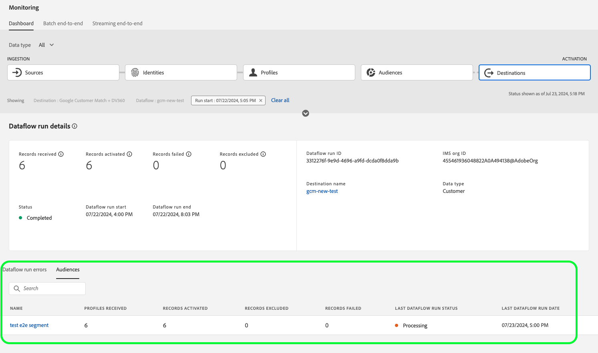

# Überwachen von Datenflüssen auf Ziele in der Benutzeroberfläche

Mit Zielen können Sie Ihre Daten von Adobe Experience Platform für unzählige externe Partner aktivieren. Platform erleichtert das Tracking des Datenflusses zu Ihren Zielen, indem Datenflüsse für Transparenz sorgen.

Das Monitoring-Dashboard bietet eine visuelle Darstellung des Journey eines Datenflusses, einschließlich des Ziels, für das die Daten aktiviert werden. In diesem Tutorial erfahren Sie, wie Sie Datenflüsse entweder direkt im Arbeitsbereich &quot;Ziele&quot;überwachen oder das Monitoring-Dashboard verwenden können, um Datenflüsse für Ihre Ziele mithilfe der Experience Platform-Benutzeroberfläche zu überwachen.

## Erste Schritte {#getting-started}

Dieses Handbuch setzt ein Verständnis der folgenden Komponenten von Adobe Experience Platform voraus:

- [Datenflüsse](../home.md): Datenflüsse sind eine Darstellung von Datenvorgängen, die Daten über Platform verschieben. Datenflüsse werden über verschiedene Dienste hinweg konfiguriert und helfen beim Verschieben von Daten aus Quell-Connectoren in Zieldatensätze, in [!DNL Identity] und [!DNL Profile] sowie in [!DNL Destinations].
   - [Datenfluss-Abläufe](../../sources/notifications.md): Datenfluss-Ausführungen sind die wiederkehrenden geplanten Aufträge, die auf der Frequenzkonfiguration ausgewählter Datenflüsse basieren.
- [Ziele](../../destinations/home.md): Ziele sind vordefinierte Integrationen mit häufig verwendeten Anwendungen, die die nahtlose Aktivierung von Daten aus Platform für kanalübergreifende Marketing-Kampagnen, E-Mail-Kampagnen, zielgruppengerechte Werbung und viele andere Anwendungsfälle ermöglichen.
- [Sandboxes](../../sandboxes/home.md): [!DNL Experience Platform] bietet virtuelle Sandboxes, die eine einzelne [!DNL Platform]-Instanz in separate virtuelle Umgebungen unterteilen, damit Sie Programme für digitale Erlebnisse entwickeln können.

## Überwachen von Datenflüssen im Arbeitsbereich &quot;Ziele&quot; {#monitor-dataflows-in-the-destinations-workspace}

Im **[!UICONTROL Ziele]** Navigieren Sie in der Platform-Benutzeroberfläche zum **[!UICONTROL Durchsuchen]** und wählen Sie den Namen eines Ziels aus, das Sie anzeigen möchten.

Eine Liste der vorhandenen Datenflüsse wird angezeigt. Auf dieser Seite finden Sie eine Liste sichtbarer Datenflüsse, einschließlich Informationen zu Ziel, Benutzername, Anzahl der Datenflüsse und Status.

Weitere Informationen zu Status finden Sie in der folgenden Tabelle:

| Status | Beschreibung |
| ------ | ----------- |
| Aktiviert | Die `Enabled` Der Status gibt an, dass ein Datenfluss aktiv ist und Daten gemäß dem Zeitplan exportiert, der ihm bereitgestellt wurde. |
| Deaktiviert | Die `Disabled` Der Status gibt an, dass ein Datenfluss inaktiv ist und keine Daten exportiert. |
| In Bearbeitung | Die `Processing` Status gibt an, dass ein Datenfluss noch nicht aktiv ist. Dieser Status tritt oft unmittelbar nach der Erstellung eines neuen Datenflusses auf. |
| Fehler | Die `Error` Status gibt an, dass der Aktivierungsprozess eines Datenflusses unterbrochen wurde. |

### Datenfluss-Ausführungen für Streaming-Ziele {#dataflow-runs-for-streaming-destinations}

>[!CONTEXTUALHELP]
>id="platform_monitoring_dataflow_run_details_activation_streaming"
>title="Datenfluss-Ausführungsdetails"
>abstract="Die Ausführungsdetails des Ziel-Datenflusses enthalten Informationen zum Aktivierungsstatus des Segments und zu den Metriken, die aus dem Echtzeit-Kundenprofil abgerufen wurden, um eindeutige Identitäten zu generieren. Weitere Informationen finden Sie im Handbuch Metrikdefinitionen ."

>[!CONTEXTUALHELP]
>id="platform_monitoring_profiles_received_streaming"
>title="Vorgenommene Profile"
>abstract="Die Gesamtzahl der im Datenfluss empfangenen Profile. Dieser Wert wird alle 60 Minuten aktualisiert."

>[!CONTEXTUALHELP]
>id="platform_destinations_dataflow_identitiesactivated_streaming"
>title="Aktivierte Identitäten"
>abstract="Die Anzahl der einzelnen Profilidentitäten, die erfolgreich für das ausgewählte Ziel aktiviert wurden. Diese Metrik enthält Identitäten, die aus exportierten Segmenten erstellt, aktualisiert und entfernt werden."

>[!CONTEXTUALHELP]
>id="platform_destinations_dataflow_identitiesexcluded_streaming"
>title="Ausgeschlossene Identitäten"
>abstract="Die Anzahl der einzelnen Profildatensätze, die aufgrund fehlender Attribute und Zustimmungsverletzungen von der Aktivierung für das ausgewählte Ziel ausgeschlossen sind."

>[!CONTEXTUALHELP]
>id="platform_destinations_dataflow_identitiesfailed_streaming"
>title="Identitäten fehlgeschlagen"
>abstract="Die Anzahl der individuellen Profilidentitäten, die für das ausgewählte Ziel fehlgeschlagen sind. Weitere Informationen finden Sie unter Fehlerdiagnose ."

Bei Streaming-Zielen muss die Variable [!UICONTROL Datenfluss-Abläufe] -Tab bietet eine stündliche Aktualisierung für Metrikdaten zu Ihren Datenfluss-Läufen. Die auffälligsten gekennzeichneten Statistiken sind für Identitäten.

Identitäten stellen die verschiedenen Facetten eines Profils dar. Wenn beispielsweise ein Profil sowohl eine Telefonnummer als auch eine E-Mail-Adresse enthält, hat dieses Profil zwei Identitäten.

Es wird eine Liste einzelner Ausführungen und der jeweiligen Metriken mit den folgenden Gesamtwerten für Identitäten angezeigt:

- **[!UICONTROL Aktivierte Identitäten]**: Die Gesamtzahl der erfolgreich für das ausgewählte Ziel aktivierten Profilidentitäten. Diese Metrik enthält Identitäten, die aus exportierten Segmenten erstellt, aktualisiert und entfernt werden.
- **[!UICONTROL Ausgeschlossene Identitäten]**: Die Gesamtzahl der Profilidentitäten, die zur Aktivierung aufgrund fehlender Attribute und Zustimmungsverstoßes übersprungen werden.
- **[!UICONTROL Identitäten fehlgeschlagen]**: Die Gesamtzahl der Profilidentitäten, die aufgrund von Fehlern nicht für das Ziel aktiviert werden.

Jeder einzelne Datenfluss zeigt die folgenden Details an:

- **[!UICONTROL Start des Datenflusses]**: Die Zeit, zu der der Datenfluss gestartet wurde. Für Streaming-Datenfluss-Ausführungen erfasst Experience Platform Metriken basierend auf dem Start des Datenflusses in Form von stündlichen Metriken. Wenn beim Ausführen des Streaming-Datenflusses ein Datenfluss gestartet wird, z. B. um 22:30 Uhr, zeigt die Metrik die Startzeit in der Benutzeroberfläche als 22:00 Uhr an.
- **[!UICONTROL Verarbeitungszeit]**: Die Zeit, die für die Verarbeitung des Datenflusses benötigt wurde.
   - Für **[!UICONTROL completed]** ausgeführt wird, zeigt die Verarbeitungszeitmetrik immer eine Stunde an.
   - Für Datenfluss-Läufe, die sich noch in einer **[!UICONTROL Verarbeitung]** state festgelegt ist, bleibt das Fenster zur Erfassung aller Metriken länger als eine Stunde geöffnet, um alle Metriken zu verarbeiten, die dem Datenfluss entsprechen. Beispielsweise kann ein Datenfluss, der um 9:30 Uhr gestartet wurde, eine Stunde und dreißig Minuten lang im Verarbeitungsstatus bleiben, um alle Metriken zu erfassen und zu verarbeiten. Sobald das Verarbeitungsfenster geschlossen wird und der Status des Datenflusses aktualisiert wird auf **completed**, wird die angezeigte Verarbeitungszeit auf eine Stunde geändert.
- **[!UICONTROL Vorgenommene Profile]**: Die Gesamtzahl der im Datenfluss empfangenen Profile.
- **[!UICONTROL Aktivierte Identitäten]**: Die Gesamtzahl der Profil-Identitäten, die erfolgreich für das ausgewählte Ziel im Rahmen der Datenfluss-Ausführung aktiviert wurden. Diese Metrik enthält Identitäten, die aus exportierten Segmenten erstellt, aktualisiert und entfernt werden.
- **[!UICONTROL Ausgeschlossene Identitäten]**: Die Gesamtzahl der Profilidentitäten, die aufgrund fehlender Attribute und Zustimmungsverletzungen von der Aktivierung ausgeschlossen sind.
- **[!UICONTROL Identitäten fehlgeschlagen]** Die Gesamtzahl der Profilidentitäten, die aufgrund von Fehlern nicht für das Ziel aktiviert werden.
- **[!UICONTROL Aktivierungsrate]**: Der Prozentsatz der empfangenen Identitäten, die erfolgreich aktiviert oder übersprungen wurden. Die folgende Formel zeigt, wie dieser Wert berechnet wird:
   
- **[!UICONTROL Status]**: Stellt den Status dar, in dem sich der Datenfluss befindet: entweder [!UICONTROL Abgeschlossen] oder [!UICONTROL Verarbeitung]. [!UICONTROL Abgeschlossen] bedeutet, dass alle Identitäten für den entsprechenden Datenfluss innerhalb des Zeitraums von einer Stunde exportiert wurden. [!UICONTROL Verarbeitung] bedeutet, dass die Ausführung des Datenflusses noch nicht abgeschlossen ist.

Um die Details eines bestimmten Datenfluss-Laufs anzuzeigen, wählen Sie die Startzeit der Ausführung aus der Liste aus.

Die Detailseite für einen Datenfluss-Lauf enthält zusätzliche Informationen wie die Anzahl der empfangenen Profile, die Anzahl der aktivierten Identitäten, die Anzahl der fehlgeschlagenen Identitäten und die Anzahl der ausgeschlossenen Identitäten.

Auf der Detailseite wird auch eine Liste mit fehlgeschlagenen Identitäten und ausgeschlossenen Identitäten angezeigt. Es werden Informationen für die fehlgeschlagenen und ausgeschlossenen Identitäten angezeigt, einschließlich Fehlercode, Identitätsanzahl und Beschreibung. Standardmäßig werden in der Liste die fehlgeschlagenen Identitäten angezeigt. Um übersprungene Identitäten anzuzeigen, wählen Sie die **[!UICONTROL Ausgeschlossene Identitäten]** umschalten.

### Datenfluss-Ausführung für Batch-Ziele {#dataflow-runs-for-batch-destinations}

>[!CONTEXTUALHELP]
>id="platform_monitoring_dataflow_run_details_activation"
>title="Datenfluss-Ausführungsdetails"
>abstract="Die Ausführungsdetails des Ziel-Datenflusses enthalten Informationen zum Aktivierungsstatus des Segments und zu den Metriken, die aus dem Echtzeit-Kundenprofil abgerufen wurden, um eindeutige Identitäten zu generieren. Weitere Informationen finden Sie im Handbuch Metrikdefinitionen ."
>additional-url="https://experienceleague.adobe.com/docs/experience-platform/dataflows/ui/monitor-destinations.html#dataflow-runs-for-streaming-destinations" text="Datenfluss-Ausführungen für Streaming-Ziele"

>[!CONTEXTUALHELP]
>id="platform_monitoring_profiles_received_batch"
>title="Vorgenommene Profile"
>abstract="Die Gesamtzahl der im Datenfluss empfangenen Profile. Dieser Wert wird alle 60 Minuten aktualisiert."

>[!CONTEXTUALHELP]
>id="platform_destinations_dataflow_identitiesactivated_batch"
>title="Aktivierte Identitäten"
>abstract="Die Anzahl der einzelnen Profilidentitäten, die erfolgreich für das ausgewählte Ziel aktiviert wurden. Diese Metrik enthält Identitäten, die aus exportierten Segmenten erstellt, aktualisiert und entfernt werden."

>[!CONTEXTUALHELP]
>id="platform_destinations_dataflow_identitiesexcluded_batch"
>title="Ausgeschlossene Identitäten"
>abstract="Die Anzahl der einzelnen Profildatensätze, die aufgrund fehlender Attribute und Zustimmungsverletzungen von der Aktivierung für das ausgewählte Ziel ausgeschlossen sind."

Bei Batch-Zielen muss die Variable [!UICONTROL Datenfluss-Abläufe] -Tab enthält Metrikdaten zu Ihren Datenfluss-Läufen. Es wird eine Liste einzelner Ausführungen und der jeweiligen Metriken mit den folgenden Gesamtwerten für Identitäten angezeigt:

- **[!UICONTROL Aktivierte Identitäten]**: Die Gesamtzahl der erfolgreich für das ausgewählte Ziel aktivierten Profilidentitäten. Diese Metrik enthält Identitäten, die aus exportierten Segmenten erstellt, aktualisiert und entfernt werden.
- **[!UICONTROL Ausgeschlossene Identitäten]**: Die Anzahl der einzelnen Profilidentitäten, die aufgrund fehlender Attribute und Zustimmungsverletzungen von der Aktivierung für das ausgewählte Ziel ausgeschlossen sind.

Jeder einzelne Datenfluss zeigt die folgenden Details an:

- **[!UICONTROL Start des Datenflusses]**: Die Zeit, zu der der Datenfluss gestartet wurde.
- **[!UICONTROL Segment]**: Der Name des Segments, das mit jedem Datenfluss verknüpft ist.
- **[!UICONTROL Verarbeitungszeit]**: Die Zeit, die für die Verarbeitung des Datenflusses benötigt wurde.
- **[!UICONTROL Vorgenommene Profile]**: Die Gesamtzahl der im Datenfluss empfangenen Profile. Dieser Wert wird alle 60 Minuten aktualisiert.
- **[!UICONTROL Aktivierte Identitäten]**: Die Gesamtzahl der Profil-Identitäten, die erfolgreich für das ausgewählte Ziel im Rahmen der Datenfluss-Ausführung aktiviert wurden. Diese Metrik enthält Identitäten, die aus exportierten Segmenten erstellt, aktualisiert und entfernt werden.
- **[!UICONTROL Ausgeschlossene Identitäten]**: Die Gesamtzahl der Profilidentitäten, die aufgrund fehlender Attribute und Zustimmungsverletzungen von der Aktivierung ausgeschlossen sind.
- **[!UICONTROL Status]**: Stellt den Status dar, in dem sich der Datenfluss befindet. Dabei kann es sich um einen von drei Status handeln: [!UICONTROL Erfolg], [!UICONTROL Fehlgeschlagen]und [!UICONTROL Verarbeitung]. [!UICONTROL Erfolg] bedeutet, dass der Datenfluss aktiv ist und Daten gemäß dem bereitgestellten Zeitplan exportiert. [!UICONTROL Fehlgeschlagen] bedeutet, dass die Aktivierung der Daten aufgrund von Fehlern ausgesetzt wurde. [!UICONTROL Verarbeitung] bedeutet, dass der Datenfluss noch nicht aktiv ist und im Allgemeinen beim Erstellen eines neuen Datenflusses auftritt.

Um Details zu einem bestimmten Datenfluss-Lauf anzuzeigen, wählen Sie die Startzeit der Ausführung aus der Liste aus.

>[!NOTE]
>
>Datenflüsse werden basierend auf der Zeitplanfrequenz des Zieldatenflusses generiert. Für jede [Zusammenführungsrichtlinie](../../profile/merge-policies/overview.md) auf ein Segment angewendet.

Auf der Detailseite für einen Datenfluss werden neben den Details, die in der Liste der Datenflüsse angezeigt werden, spezifischere Informationen zum Datenfluss angezeigt:

- **[!UICONTROL Datengröße]**: Die Größe des Datenflusses, der exportiert wird.
- **[!UICONTROL Dateien insgesamt]**: Die Gesamtzahl der im Datenfluss exportierten Dateien.
- **[!UICONTROL Letzte Aktualisierung]**: Die Zeit, zu der der Datenfluss zuletzt aktualisiert wurde.

Auf der Detailseite wird auch eine Liste mit fehlgeschlagenen Identitäten und ausgeschlossenen Identitäten angezeigt. Es werden Informationen für die fehlgeschlagenen und ausgeschlossenen Identitäten angezeigt, einschließlich Fehlercode und Beschreibung. Standardmäßig werden in der Liste die fehlgeschlagenen Identitäten angezeigt. Um ausgeschlossene Identitäten anzuzeigen, wählen Sie die **[!UICONTROL Ausgeschlossene Identitäten]** umschalten.

## Dashboard &quot;Ziele überwachen&quot; {#monitoring-destinations-dashboard}

>[!NOTE]
>
>- Die Funktion zur Zielüberwachung wird derzeit für alle Ziele in Experience Platform unterstützt *Ausnahme* die [Adobe Target](/help/destinations/catalog/personalization/adobe-target-connection.md) und [Benutzerdefinierte Personalisierung](/help/destinations/catalog/personalization/custom-personalization.md) Ziele.
>- Für [Amazon Kinesis](/help/destinations/catalog/cloud-storage/amazon-kinesis.md), [Azure Event Hubs](/help/destinations/catalog/cloud-storage/azure-event-hubs.md)und [HTTP-API](/help/destinations/catalog/streaming/http-destination.md) Ziele, ausgeschlossene Identitäten werden derzeit nicht angezeigt.

>[!CONTEXTUALHELP]
>id="platform_monitoring_activation"
>title="Activation"
>abstract="Die Zielaktivierungsansicht enthält Informationen zum Aktivierungsstatus des Segments und Metriken, die aus dem Echtzeit-Kundenprofil abgerufen wurden, um eindeutige Identitäten zu generieren."

So greifen Sie auf die [!UICONTROL Überwachung] Dashboard, auswählen **[!UICONTROL Überwachung]** () in der linken Navigation. Einmal im [!UICONTROL Überwachung] Seite, wählen Sie [!UICONTROL Ziele]. Die [!UICONTROL Überwachung] Dashboard enthält Metriken und Informationen zu den ausgeführten Zielaufträgen.

Verwenden Sie die [!UICONTROL Ziele] Dashboard , um einen Überblick über den Zustand Ihrer Aktivierungsflüsse zu erhalten. Rufen Sie zunächst Einblicke in eine aggregierte Ebene für alle Batch- und Streaming-Ziele ab und führen Sie dann einen Drilldown in detaillierte Ansichten für Datenflüsse, Datenflüsse und aktivierte Segmente durch, um Ihre Aktivierungsdaten eingehend zu untersuchen. Die Bildschirme im [!UICONTROL Überwachung] Dashboard bietet praktische Einblicke über Metriken und Fehlerbeschreibungen, mit denen Sie Probleme beheben können, die in Ihren Aktivierungsszenarien auftreten können.

Im Mittelpunkt des Dashboards steht die [!UICONTROL Aktivierung] -Bereich, der Metriken und Diagramme enthält, die Daten zur Aktivierungsrate der Daten anzeigen, die an Streaming-Ziele exportiert werden, sowie über den fehlgeschlagenen Batch-Datenfluss, der an Batch-Ziele ausgeführt wird.

Standardmäßig enthalten die angezeigten Daten die Aktivierungsinformationen der letzten 24 Stunden. Auswählen **[!UICONTROL Letzte 24 Stunden]** , um den Zeitrahmen der angezeigten Datensätze anzupassen. Verfügbare Optionen umfassen **[!UICONTROL Letzte 24 Stunden]**, **[!UICONTROL Letzte 7 Tage]** und **[!UICONTROL Letzte 30 Tage]**. Alternativ können Sie die Daten im angezeigten Kalender-Popup-Fenster auswählen. Nachdem Sie die Daten ausgewählt haben, wählen Sie **[!UICONTROL Anwenden]** , um den Zeitrahmen der angezeigten Informationen anzupassen.

>[!NOTE]
>
>Der folgende Screenshot zeigt die Aktivierungsrate und den Batch-Datenfluss für die letzten 30 Tage anstelle der letzten 24 Stunden. Sie können den Zeitrahmen anpassen, indem Sie **[!UICONTROL Letzte 30 Tage]**.

Verwenden Sie das Pfeilsymbol (), um die Karten oben im Bildschirm zu erweitern oder zu schließen, die einen Überblick über die Aktivierungsdetails basierend auf dem Zieltyp - Streaming oder Batch anzeigen:

- **[!UICONTROL Streaming-Aktivierungsrate]**: Stellt den Prozentsatz der empfangenen Identitäten dar, die entweder erfolgreich aktiviert oder übersprungen wurden. Die zur Berechnung dieses Prozentsatzes verwendete Formel wird weiter oben auf dieser Seite im Abschnitt [Datenfluss-Ausführungen für Streaming-Ziele](#dataflow-runs-for-streaming-destinations) Abschnitt.
- **[!UICONTROL Batch-fehlgeschlagene Datenfluss-Ausführungen]**: Stellt die Anzahl der fehlgeschlagenen Datenfluss-Ausführungen im ausgewählten Zeitintervall dar.

Die **[!UICONTROL Aktivierung]** -Diagramm wird standardmäßig angezeigt und Sie können es deaktivieren, um die Liste der Ziele unten zu erweitern. Wählen Sie die **[!UICONTROL Metriken und Diagramme]** Umschalten, um die Diagramme zu deaktivieren.

Die **[!UICONTROL Aktivierung]** zeigt eine Liste von Zielen an, die mindestens ein vorhandenes Konto enthalten. Diese Liste enthält auch Informationen zu den empfangenen Profilen, aktivierten Identitäten, fehlgeschlagenen Identitäten, ausgeschlossenen Identitäten, Aktivierungsrate, insgesamt fehlgeschlagenen Datenflüssen und dem letzten aktualisierten Datum für diese Ziele. Nicht alle Metriken sind für alle Zieltypen verfügbar. Die nachstehende Tabelle zeigt, welche Metriken pro Zieltyp, Streaming oder Batch verfügbar sind.

| Metrik | Zieltyp |
---------|----------|
| **[!UICONTROL Vorgenommene Profile]** | Streaming und Batch |
| **[!UICONTROL Aktivierte Identitäten]** | Streaming und Batch |
| **[!UICONTROL Identitäten fehlgeschlagen]** | Streaming |
| **[!UICONTROL Ausgeschlossene Identitäten]** | Streaming und Batch |
| **[!UICONTROL Aktivierungsrate]** | Streaming |
| **[!UICONTROL Gesamtzahl fehlgeschlagener Datenflüsse]** | Batch |
| **[!UICONTROL Zuletzt aktualisiert]** | Streaming und Batch |

Sie können Ihre Zielliste auch so filtern, dass nur die ausgewählte Zielkategorie angezeigt wird. Wählen Sie die **[!UICONTROL Meine Ziele]** und wählen Sie die [Zielkategorie](/help/destinations/destination-types.md#categories) , nach dem Sie filtern möchten.

Darüber hinaus können Sie ein Ziel in die Suchleiste eingeben, um es zu einem einzelnen Ziel zu isolieren. Wenn Sie die Datenflüsse des Ziels anzeigen möchten, können Sie den Filter auswählen  daneben, um eine Liste der aktiven Datenflüsse anzuzeigen.

Wenn Sie alle vorhandenen Datenflüsse über alle Ziele hinweg anzeigen möchten, wählen Sie **[!UICONTROL Datenflüsse]**.

Es wird eine Liste mit Datenflüssen angezeigt, die nach der letzten Ausführung des Datenflusses sortiert sind. Sie können zusätzliche Details für einen bestimmten Datenfluss anzeigen, indem Sie das Ziel, das Sie überwachen möchten, suchen und den Filter auswählen  daneben und anschließend den Filter auswählen  neben dem Datenfluss weitere Informationen.

Nachdem Sie einen Datenfluss für eine weitere Überprüfung ausgewählt haben, enthält die Seite mit den Datenflug-Details einen Umschalter, mit dem Sie die aktivierten Daten im Datenfluss anzeigen können, aufgeschlüsselt nach Datenflüssen oder Segmenten.

### Datenfluss-Ausführungsansicht {#dataflow-runs-view}

Wann **[!UICONTROL Datenfluss-Abläufe]** ausgewählt ist, können Sie eine Liste der Datenflug-Ausführungen für den ausgewählten Datenfluss sowie weitere Informationen zu den einzelnen Ausführungen anzeigen.

>[!INFO]
>
>Bei Datenflüssen an Streaming-Ziele wird ein Datenfluss in stündliche Fenster unterteilt. Jedes stündliche Fenster generiert eine entsprechende Datenfluss-ID.
>
>Für Datenflüsse an Batch-Ziele wird für jedes Segment ein entsprechender Datenfluss generiert, der auf der geplanten Häufigkeit der Segmentaktivierung basiert. Wenn Sie beispielsweise eine tägliche planmäßige Aktivierung für fünf Segmente im selben Ziel-Datenfluss einrichten, werden täglich fünf separate Datenfluss-Läufe generiert.

Verwenden Sie die **[!UICONTROL Nur Fehler anzeigen]** umschalten, um nur die fehlgeschlagenen Ausführungen für einen Datenfluss anzuzeigen.

### Ansicht auf Segmentebene {#segment-level-view}

Wann **[!UICONTROL Segmente]** ausgewählt ist, wird eine Liste der Segmente angezeigt, die innerhalb des ausgewählten Zeitraums für den ausgewählten Datenfluss aktiviert wurden. Dieser Bildschirm enthält Informationen auf Segmentebene über die aktivierten Identitäten, die ausgeschlossenen Identitäten sowie den Status und die Uhrzeit der letzten Ausführung des Datenflusses. Durch Überprüfen der Metriken auf ausgeschlossene und aktivierte Identitäten können Sie überprüfen, ob ein Segment erfolgreich aktiviert wurde oder nicht.

Sie aktivieren beispielsweise ein Segment namens &quot;Loyalitätsmitglieder in Kalifornien&quot;für ein Amazon S3-Ziel &quot;Mitglieder des Treueprogramms, Kalifornien, Dezember&quot;. Angenommen, das ausgewählte Segment enthält 100 Profile, aber nur 80 von 100 Profilen enthalten Loyalitäts-ID-Attribute. Sie haben die Export-Zuordnungsregeln als `loyalty.id` ist erforderlich. In diesem Fall werden auf Segmentebene 80 Identitäten aktiviert und 20 Identitäten ausgeschlossen.

>[!IMPORTANT]
>
>Beachten Sie die aktuellen Einschränkungen im Zusammenhang mit Metriken auf Segmentebene:
>- Die Ansicht auf Segmentebene ist derzeit nur für Batch-Ziele verfügbar.
>- Metriken auf Segmentebene werden derzeit nur für erfolgreiche Datenfluss-Ausführungen aufgezeichnet. Sie werden nicht für fehlgeschlagene Datenfluss-Ausführungen und ausgeschlossene Datensätze aufgezeichnet.

In der Ansicht auf Segmentebene werden die Metriken über mehrere Datenfluss-Ausführungen innerhalb des ausgewählten Zeitraums aggregiert. Wenn mehrere Datenfluss-Ausführungen vorhanden sind, können Sie einen Drilldown aus der Segmentebene durchführen, um die Aufschlüsselung für jede Datenfluss-Ausführung anzuzeigen, gefiltert nach dem ausgewählten Segment.
Verwenden der Filterschaltfläche  , um einen Drilldown in die Datenfluss-Ausführungsansicht für jedes Segment im Datenfluss durchzuführen.

### Seite mit Datenfluss-Ausführungen {#dataflow-runs-page}

Auf der Seite &quot;Datenfluss-Ausführung&quot;werden Informationen zu Ihren Datenfluss-Ausführungen angezeigt, einschließlich Startzeit des Datenflusses, Verarbeitungszeit, empfangene Profile, aktivierte Identitäten, ausgeschlossene Identitäten, fehlgeschlagene Identitäten, Aktivierungsrate und Status.

Wenn Sie einen Drilldown in die Seite mit den Datenflüssen durchführen, wählen Sie die [Ansicht auf Segmentebene](#segment-level-view)haben Sie die Möglichkeit, den Datenfluss nach folgenden Optionen zu filtern:

- **[!UICONTROL Datenfluss wird mit fehlgeschlagenen Identitäten ausgeführt]**: Für das ausgewählte Segment listet diese Option alle Datenfluss-Ausführungen auf, die bei der Aktivierung fehlgeschlagen sind. Informationen dazu, warum Identitäten in einem bestimmten Datenfluss fehlschlugen, finden Sie unter [Seite mit Datenfluss-Ausführungsdetails](#dataflow-run-details-page) für diesen Datenfluss.
- **[!UICONTROL Datenfluss wird mit übersprungenen Identitäten ausgeführt]**: Für das ausgewählte Segment listet diese Option alle Datenfluss-Läufe auf, bei denen einige Identitäten nicht vollständig aktiviert und einige Profile übersprungen wurden. Informationen dazu, warum Identitäten in einem bestimmten Datenfluss übersprungen wurden, finden Sie unter [Seite mit Datenfluss-Ausführungsdetails](#dataflow-run-details-page) für diesen Datenfluss.
- **[!UICONTROL Datenfluss wird mit aktivierten Identitäten ausgeführt]**: Für das ausgewählte Segment listet diese Option alle Datenfluss-Ausführungen mit Identitäten auf, die erfolgreich aktiviert wurden.

Um weitere Details zu einem bestimmten Datenfluss-Lauf anzuzeigen, wählen Sie den Filter aus  neben der Startzeit des Datenflusses, um die Seite mit den Ausführungsdetails des Datenflusses anzuzeigen.

### Seite mit Datenfluss-Ausführungsdetails {#dataflow-run-details-page}

Auf der Seite mit den Ausführungsdetails des Datenflusses werden zusätzlich zu den Details, die in der Liste der Datenflüsse angezeigt werden, spezifischere Informationen zum Datenfluss angezeigt:

- **[!UICONTROL Dataflow-run-ID]**: Die Kennung des Datenflusses.
- **[!UICONTROL Kennung der IMS-Organisation]**: Die IMS-Organisation, zu der der Datenfluss gehört.
- **[!UICONTROL Letzte Aktualisierung]**: Die Zeit, zu der der Datenfluss zuletzt aktualisiert wurde.

Auf der Detailseite können Sie auch zwischen Datenfluss-Ausführungsfehlern und Segmenten wechseln. Diese Option ist nur für Datenfluss-Ausführungen in Batch-Zielen verfügbar.

Die Ansicht &quot;Fehler bei Datenfluss-Ausführung&quot;zeigt eine Liste der Identitäten an, die fehlgeschlagen sind, und Identitäten, die ausgeschlossen wurden. Es werden Informationen für die fehlgeschlagenen und ausgeschlossenen Identitäten angezeigt, einschließlich Fehlercode, Identitätsanzahl und Beschreibung. Standardmäßig werden in der Liste die fehlgeschlagenen Identitäten angezeigt. Um übersprungene Identitäten anzuzeigen, wählen Sie die **[!UICONTROL Ausgeschlossene Identitäten]** umschalten.

Wann **[!UICONTROL Segmente]** ausgewählt ist, wird eine Liste der Segmente angezeigt, die im ausgewählten Datenfluss aktiviert wurden. Dieser Bildschirm enthält Informationen auf Segmentebene über die aktivierten Identitäten, die ausgeschlossenen Identitäten sowie den Status und die Uhrzeit der letzten Ausführung des Datenflusses.

## Nächste Schritte {#next-steps}

In diesem Handbuch erfahren Sie jetzt, wie Sie Datenflüsse für Batch- und Streaming-Ziele überwachen können, einschließlich aller relevanten Informationen wie Verarbeitungszeit, Aktivierungsrate und Status. Weitere Informationen zu Datenflüssen in Platform finden Sie im Abschnitt [Datenflüsse - Übersicht](../home.md). Weitere Informationen zu Zielen finden Sie im Abschnitt [Ziele - Übersicht](../../destinations/home.md).