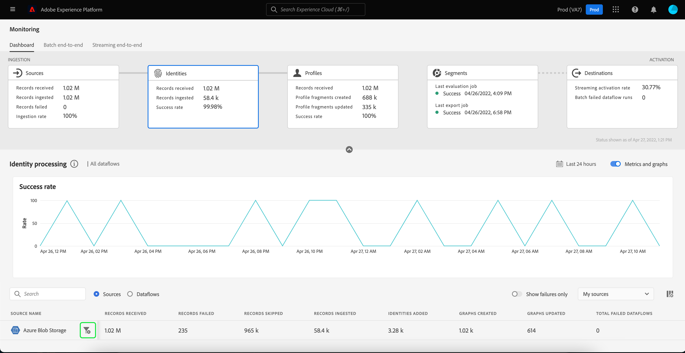

# Überwachen von Datenflüssen auf Identitäten in der Benutzeroberfläche

Der Adobe Experience Platform Identity Service hilft Ihnen, sich einen besseren Überblick über Ihre Kunden und deren Verhalten zu verschaffen, indem Identitäten geräte- und systemübergreifend zusammengeführt werden. So können Sie in Echtzeit für eindrucksvolle und persönliche digitale Erlebnisse sorgen.

Das Monitoring-Dashboard bietet eine visuelle Darstellung der Datenaktivität innerhalb von Identitäten, einschließlich des Status der Identitäten Ihrer Daten. In diesem Tutorial erfahren Sie, wie Sie mithilfe des Monitoring-Dashboards mithilfe der Experience Platform-Benutzeroberfläche die Identitäten Ihrer Daten überwachen können. So können Sie den Status der Identitätsverarbeitung verfolgen.

## Erste Schritte {#getting-started}

- [Datenflüsse](../home.md): Datenflüsse sind eine Darstellung von Datenvorgängen, die Daten über Platform verschieben. Datenflüsse werden über verschiedene Dienste hinweg konfiguriert und helfen beim Verschieben von Daten aus Quell-Connectoren in Zieldatensätze, in [!DNL Identity] und [!DNL Profile] sowie in [!DNL Destinations].
   - [Datenfluss-Abläufe](../../sources/notifications.md): Datenfluss-Ausführungen sind die wiederkehrenden geplanten Aufträge, die auf der Frequenzkonfiguration ausgewählter Datenflüsse basieren.
- [Identity Service](../../identity-service/home.md): Verschaffen Sie sich einen besseren Überblick über einzelne Kunden und deren Verhalten, indem Sie Identitäten geräte- und systemübergreifend verknüpfen.
- [Sandboxes](../../sandboxes/home.md): [!DNL Experience Platform] bietet virtuelle Sandboxes, die eine einzelne [!DNL Platform]-Instanz in separate virtuelle Umgebungen unterteilen, damit Sie Programme für digitale Erlebnisse entwickeln können.

## Identitäten-Dashboard überwachen {#identity-metrics}

>[!CONTEXTUALHELP]
>id="platform_monitoring_identity_processing"
>title="Identitätsverarbeitung"
>abstract="Die Ansicht zur Identitätsverarbeitung enthält Informationen zu den Datensätzen, die für den Identity-Dienst erfasst werden, einschließlich der Anzahl der hinzugefügten Identitäten, der erstellten Diagramme und der aktualisierten Diagramme. Weitere Informationen zu Metriken und Diagrammen finden Sie im Handbuch zur Metrikdefinition ."
>text="Learn more in documentation"

>[!CONTEXTUALHELP]
>id="platform_monitoring_dataflow_run_details_identity"
>title="Datenfluss-Ausführungsdetails"
>abstract="Auf der Seite mit den Ausführungsdetails für den Datenfluss werden weitere Informationen zum Start Ihres Identitäts-Datenflusses angezeigt, einschließlich der Organisations-ID und der Ausführungskennung des Datenflusses."

So greifen Sie auf die **[!UICONTROL Identitäten]** Dashboard, auswählen **[!UICONTROL Überwachung]** in der linken Navigation. Einmal im **[!UICONTROL Überwachung]** Seite, wählen Sie die **[!UICONTROL Identitäten]** Karte.

Im Hauptmenü **[!UICONTROL Identitäten]** Dashboard, die **[!UICONTROL Identitäten]** enthält Informationen zur Gesamtzahl der empfangenen Datensätze, zur Anzahl der aufgenommenen Datensätze sowie zur Erfolgsrate der Datensatzaufnahme.

Das Dashboard selbst enthält Metriken zur Identitätsverarbeitung. Standardmäßig zeigt das Dashboard Details zur Identitätsverarbeitung für die Quellen Ihres Unternehmens in den letzten 24 Stunden an.

Die [!UICONTROL Identitätsverarbeitung] Seite enthält Informationen zu Datensätzen, die in [!DNL Identity Service], einschließlich der Anzahl hinzugefügter Identitäten, erstellter Diagramme und aktualisierter Diagramme.

Für diese Dashboard-Ansicht stehen die folgenden Metriken zur Verfügung:

| Identitätsmetriken | Beschreibung |
| ---------------- | ----------- |
| **[!UICONTROL Erhaltene Aufzeichnungen]** | Die Anzahl der vom Data Lake empfangenen Datensätze. |
| **[!UICONTROL Fehlgeschlagene Datensätze]** | Die Anzahl der Datensätze, die aufgrund von Fehlern in den Daten nicht in Platform erfasst wurden. |
| **[!UICONTROL Übersprungene Datensätze]** | Die Anzahl der Datensätze, die erfasst wurden, jedoch nicht in [!DNL Identity Service] weil in der Datensatzzeile nur eine Kennung vorhanden war. |
| **[!UICONTROL Aufgenommene Datensätze]** | Anzahl der erfassten Datensätze in [!DNL Identity Service]. |
| **[!UICONTROL Hinzugefügte Identitäten]** | Die Anzahl neuer Kennungen, die zu [!DNL Identity Service]. |
| **[!UICONTROL Erstellte Diagramme]** | Die Anzahl neuer Identitätsdiagramme, die in erstellt wurden. [!DNL Identity Service]. |
| **[!UICONTROL Diagramme aktualisiert]** | Die Anzahl vorhandener Identitätsdiagramme, die mit neuen Edges aktualisiert wurden. |
| **[!UICONTROL Gesamtzahl fehlgeschlagener Datenflüsse]** | Die Anzahl der fehlgeschlagenen Datenflüsse. |

Sie können das Filtersymbol auswählen  neben dem Quellnamen, um Informationen zur Identitätsverarbeitung für die Datenflüsse der ausgewählten Quelle anzuzeigen.

Alternativ können Sie **[!UICONTROL Datenflüsse]** auf den Umschalter klicken, um Details zur Identitätsverarbeitung für die Datenflüsse Ihrer Organisation in den letzten 24 Stunden anzuzeigen.

Für diese Dashboard-Ansicht stehen die folgenden Metriken zur Verfügung:

| Metrik | Beschreibung |
| -------| ----------- |
| **[!UICONTROL Dataflow]** | Der Name des Datenflusses. |
| **[!UICONTROL Datensatz]** | Der Name des Datensatzes, in den der Datenfluss eingefügt wird. |
| **[!UICONTROL Name der Quelle]** | Der Name der Quelle, zu der der Datenfluss gehört. |
| **[!UICONTROL Erhaltene Aufzeichnungen]** | Die Anzahl der vom Data Lake empfangenen Datensätze. |
| **[!UICONTROL Fehlgeschlagene Datensätze]** | Die Anzahl der Datensätze, die aufgrund von Fehlern in den Daten nicht in Platform erfasst wurden. |
| **[!UICONTROL Übersprungene Datensätze]** | Die Anzahl der Datensätze, die erfasst wurden, jedoch nicht in [!DNL Identity Service] weil in der Datensatzzeile nur eine Kennung vorhanden war. |
| **[!UICONTROL Aufgenommene Datensätze]** | Anzahl der erfassten Datensätze in [!DNL Identity Service]. |
| **[!UICONTROL Datensätze insgesamt]** | Die Gesamtzahl aller Datensätze, einschließlich fehlgeschlagener Datensätze, übersprungener Datensätze, hinzugefügter Identitäten und duplizierter Datensätze. |
| **[!UICONTROL Hinzugefügte Identitäten]** | Die Anzahl neuer Kennungen, die zu [!DNL Identity Service]. |
| **[!UICONTROL Erstellte Diagramme]** | Die Anzahl neuer Identitätsdiagramme, die in erstellt wurden. [!DNL Identity Service]. |
| **[!UICONTROL Diagramme aktualisiert]** | Die Anzahl vorhandener Identitätsdiagramme, die mit neuen Edges aktualisiert wurden. |
| **[!UICONTROL Gesamtzahl fehlgeschlagener Datenflüsse]** | Die Anzahl der fehlgeschlagenen Datenflüsse. |

Filtersymbol auswählen  neben der Startzeit des Datenflusses, um weitere Informationen zu Ihrer [!DNL Identity] dataflow ausführen.

Die [!UICONTROL Datenfluss-Ausführungsdetails] Seite zeigt weitere Informationen zu Ihrer [!DNL Identity] dataflow-Ausführung, einschließlich der Organisations-ID und der Datenfluss-Start-ID. Auf dieser Seite werden auch der entsprechende Fehlercode und die entsprechende Fehlermeldung angezeigt, die von [!DNL Identity Service], falls im Aufnahmeprozess Fehler auftreten sollten.

Für diese Dashboard-Ansicht stehen die folgenden Metriken zur Verfügung:

| Metrik | Beschreibung |
| -------| ----------- |
| **[!UICONTROL Erhaltene Aufzeichnungen]** | Die Anzahl der vom Data Lake empfangenen Datensätze. |
| **[!UICONTROL Fehlgeschlagene Datensätze]** | Die Anzahl der Datensätze, die aufgrund von Fehlern in den Daten nicht in Platform erfasst wurden. |
| **[!UICONTROL Übersprungene Datensätze]** | Die Anzahl der Datensätze, die erfasst wurden, jedoch nicht in [!DNL Identity Service] weil in der Datensatzzeile nur eine Kennung vorhanden war. |
| **[!UICONTROL Aufgenommene Datensätze]** | Anzahl der erfassten Datensätze in [!DNL Identity Service]. |
| **[!UICONTROL Hinzugefügte Identitäten]** | Die Anzahl neuer Kennungen, die zu [!DNL Identity Service]. |
| **[!UICONTROL Erstellte Diagramme]** | Die Anzahl neuer Identitätsdiagramme, die in erstellt wurden. [!DNL Identity Service]. |
| **[!UICONTROL Diagramme aktualisiert]** | Die Anzahl vorhandener Identitätsdiagramme, die mit neuen Edges aktualisiert wurden. |
| **[!UICONTROL Status]** | Definiert den Gesamtstatus eines Datenflusses. Mögliche Statuswerte sind: <ul><li>`Success`: Gibt an, dass ein Datenfluss aktiv ist und Daten gemäß dem festgelegten Zeitplan erfasst.</li><li>`Failed`: Gibt an, dass der Aktivierungsprozess eines Datenflusses aufgrund von Fehlern unterbrochen wurde. </li><li>`Processing`: Gibt an, dass der Datenfluss noch nicht aktiv ist. Dieser Status tritt oft unmittelbar nach der Erstellung eines neuen Datenflusses auf.</li></ul> |
| **[!UICONTROL Start des Datenflusses]** | Datum und Uhrzeit der Ausführung des Datenflusses. |
| **[!UICONTROL Zuletzt aktualisiert]** | Datum und Uhrzeit der letzten Aktualisierung des Datenflusses. |
| **[!UICONTROL Fehlerzusammenfassung]** | Wenn die Ausführung des Datenflusses fehlgeschlagen ist, werden ein Fehlercode und eine Zusammenfassung des Fehlers beim Ausführen des Datenflusses angezeigt. |
| **[!UICONTROL Dataflow-run-ID]** | Die Kennung des Datenflusses. |
| **[!UICONTROL Kennung der IMS-Organisation]** | Die Organisations-ID, zu der der Datenfluss gehört. |

Darüber hinaus können Sie die Umschaltfläche auswählen, um die fehlgeschlagenen oder übersprungenen Datensätze anzuzeigen. Der Abschnitt &quot;Fehler&quot;enthält Details zum Fehlercode und zur Anzahl der fehlgeschlagenen oder ausgeschlossenen Datensätze.
