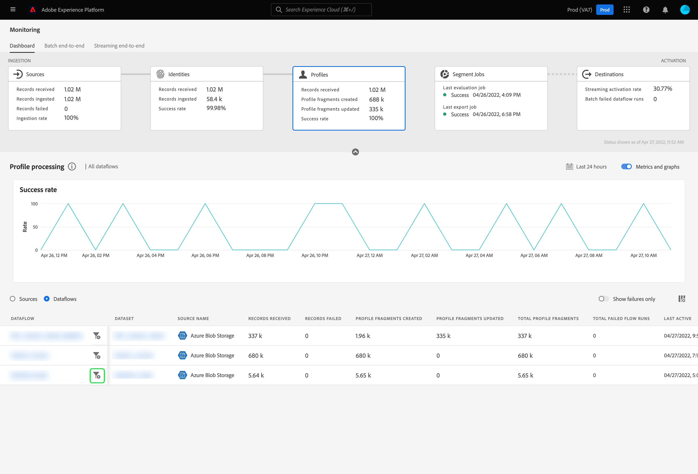

# Überwachen von Datenflüssen auf Profile in der Benutzeroberfläche

Mit dem Echtzeit-Kundenprofil können Sie eine ganzheitliche Sicht auf jeden einzelnen Kunden anzeigen, indem Sie Daten aus mehreren Kanälen, einschließlich Online-, Offline-, CRM- und Drittanbieter-Kanälen, kombinieren. Mit dem Profil können Sie Ihre Kundendaten in einer einheitlichen Ansicht zusammenfassen, die eine umsetzbare, mit Zeitstempel versehene Übersicht über jede Kundeninteraktion bietet.

Das Monitoring-Dashboard bietet eine visuelle Darstellung der Datenaktivität innerhalb des Profils, einschließlich des Status Ihrer Datenprofile. In diesem Tutorial erfahren Sie, wie Sie mithilfe des Monitoring-Dashboards die Profile Ihrer Daten mithilfe der Experience Platform-Benutzeroberfläche überwachen können. So können Sie den Status der Profilverarbeitung verfolgen.

## Erste Schritte {#getting-started}

Dieses Handbuch setzt ein Verständnis der folgenden Komponenten von Adobe Experience Platform voraus:

- [Datenflüsse](../home.md): Datenflüsse sind eine Darstellung von Datenvorgängen, die Daten über Platform verschieben. Datenflüsse werden über verschiedene Dienste hinweg konfiguriert und helfen beim Verschieben von Daten aus Quell-Connectoren in Zieldatensätze, in [!DNL Identity] und [!DNL Profile] sowie in [!DNL Destinations].
   - [Datenfluss-Ausführungen](../../sources/notifications.md): Datenfluss-Ausführungen sind die wiederkehrenden geplanten Aufträge, die auf der Frequenzkonfiguration ausgewählter Datenflüsse basieren.
- [Echtzeit-Kundenprofil](../../profile/home.md): Bietet ein einheitliches Echtzeit-Kundenprofil, das auf aggregierten Daten aus verschiedenen Quellen basiert.
- [Sandboxes](../../sandboxes/home.md): [!DNL Experience Platform] bietet virtuelle Sandboxes, die eine einzelne [!DNL Platform]-Instanz in separate virtuelle Umgebungen unterteilen, damit Sie Programme für digitale Erlebnisse entwickeln können.

## Überwachen des Profil-Dashboards {#profile-metrics}

>[!CONTEXTUALHELP]
>id="platform_monitoring_profile_processing"
>title="Profilverarbeitung"
>abstract="Die Profilverarbeitungs-Ansicht enthält Informationen zu den in den Profildienst aufgenommenen Datensätzen, einschließlich der Anzahl der erstellten und aktualisierten Profilfragmente sowie der Gesamtzahl der Profilfragmente."
>text="Learn more in documentation"

>[!CONTEXTUALHELP]
>id="platform_monitoring_dataflow_run_details_profile"
>title="Details zur Datenflussausführung"
>abstract="Auf der Seite mit den Datenflussausführungs-Details werden weitere Informationen zur Ausführung des Profil-Datenflusses angezeigt, einschließlich der Organisations-ID und der Datenflussausführungs-ID."

Um auf das Dashboard **[!UICONTROL Profile]** zuzugreifen, wählen Sie im linken Navigationsbereich die Option **[!UICONTROL Überwachung]** aus. Wählen Sie auf der Seite **[!UICONTROL Überwachung]** die Karte **[!UICONTROL Profile]** aus.

Im Hauptdashboard **[!UICONTROL Profile]** enthält die Karte **[!UICONTROL Profile]** Informationen zur Gesamtzahl der empfangenen Datensätze, zur Anzahl der erstellten und aktualisierten Profilfragmente sowie zur Erfolgsrate der erstellten und aktualisierten Profilfragmente.

Das Dashboard selbst enthält Metriken zur Profilverarbeitung. Standardmäßig zeigt das Dashboard Details zur Profilverarbeitung für die Quellen Ihres Unternehmens in den letzten 24 Stunden an.

Die Seite [!UICONTROL Profilverarbeitung] enthält Informationen zu in [!DNL Profile] erfassten Datensätzen, einschließlich der Anzahl der erstellten Profilfragmente, der aktualisierten Profilfragmente und der Gesamtzahl der Profilfragmente.

Für diese Dashboard-Ansicht stehen die folgenden Metriken zur Verfügung:

| Metrik | Beschreibung |
| -------| ----------- |
| **[!UICONTROL Source name]** | Der Name der Quelle. |
| **[!UICONTROL empfangene Datensätze]** | Die Anzahl der vom Data Lake empfangenen Datensätze. |
| **[!UICONTROL Datensätze fehlgeschlagen]** | Die Anzahl der Datensätze, die aufgrund von Fehlern erfasst, aber nicht in [!DNL Profile] aufgenommen wurden. |
| **[!UICONTROL Erstellte Profilfragmente]** | Die Anzahl der neu hinzugefügten [!DNL Profile] Fragmente. |
| **[!UICONTROL Profilfragmente aktualisiert]** | Die Anzahl der vorhandenen [!DNL Profile] Fragmente wurde aktualisiert. |
| **[!UICONTROL Gesamte Profilfragmente]** | Die Gesamtzahl der in [!DNL Profile] geschriebenen Datensätze, einschließlich aller vorhandenen [!DNL Profile] Fragmente, die aktualisiert wurden, und neuer [!DNL Profile] Fragmente. |
| **[!UICONTROL Gesamtzahl fehlgeschlagener Datenflüsse]** | Die Anzahl der fehlgeschlagenen Datenflüsse. |

Sie können das Filtersymbol  neben dem Quellnamen auswählen, um Informationen zur Profilverarbeitung für die Datenflüsse der ausgewählten Quelle anzuzeigen.

Alternativ können Sie **[!UICONTROL Datenflüsse]** auf dem Umschalter auswählen, um Details zur Profilverarbeitung für die Datenflüsse Ihrer Organisation in den letzten 24 Stunden anzuzeigen.

Für diese Dashboard-Ansicht stehen die folgenden Metriken zur Verfügung:

| Metrik | Beschreibung |
| -------| ----------- |
| **[!UICONTROL Dataflow]** | Der Name des Datenflusses. |
| **[!UICONTROL Datensatz]** | Der Name des Datensatzes, in den der Datenfluss eingefügt wird. |
| **[!UICONTROL Source name]** | Der Name der Quelle, zu der der Datenfluss gehört. |
| **[!UICONTROL empfangene Datensätze**] | Die Anzahl der vom Data Lake empfangenen Datensätze. |
| **[!UICONTROL Datensätze fehlgeschlagen]** | Die Anzahl der Datensätze, die aufgrund von Fehlern erfasst, aber nicht in [!DNL Profile] aufgenommen wurden. |
| **[!UICONTROL Erstellte Profilfragmente]** | Die Anzahl der neu hinzugefügten [!DNL Profile] Fragmente. |
| **[!UICONTROL Profilfragmente aktualisiert]** | Die Anzahl der vorhandenen [!DNL Profile] Fragmente wurde aktualisiert. |
| **[!UICONTROL Gesamte Profilfragmente]** | Die Gesamtzahl der in [!DNL Profile] geschriebenen Datensätze, einschließlich aller vorhandenen [!DNL Profile] Fragmente, die aktualisiert wurden, und neuer [!DNL Profile] Fragmente. |
| **[!UICONTROL Gesamtanzahl fehlgeschlagener Durchläufe]** | Die Anzahl der fehlgeschlagenen Datenflüsse. |
| **[!UICONTROL Letzte aktive]** | Der Zeitstempel, mit dem der Datenfluss zuletzt ausgeführt wurde. |

Wählen Sie das Filtersymbol  neben der Startzeit des Datenflusses aus, um weitere Informationen zum Start des Datenflusses [!DNL Profile] anzuzeigen.

Auf der Seite [!UICONTROL Datenfluss-Ausführungsdetails] werden weitere Informationen zu Ihrem [!DNL Profile]-Datenfluss angezeigt, einschließlich der Organisations-ID und der Kennung des Datenflusses. Auf dieser Seite werden auch der entsprechende Fehlercode und die Fehlermeldung angezeigt, die von [!DNL Profile] bereitgestellt werden, sollte es im Aufnahmeprozess zu Fehlern kommen.

Für diese Dashboard-Ansicht stehen die folgenden Metriken zur Verfügung:

| Metrik | Beschreibung |
| -------| ----------- |
| **[!UICONTROL empfangene Datensätze]** | Die Anzahl der vom Data Lake empfangenen Datensätze. |
| **[!UICONTROL Datensätze fehlgeschlagen]** | Die Anzahl der Datensätze, die aufgrund von Fehlern erfasst, aber nicht in [!DNL Profile] aufgenommen wurden. |
| **[!UICONTROL Erstellte Profilfragmente]** | Die Anzahl der neu hinzugefügten [!DNL Profile] Fragmente. |
| **[!UICONTROL Profilfragmente aktualisiert]** | Die Anzahl der vorhandenen [!DNL Profile] Fragmente wurde aktualisiert. |
| **[!UICONTROL Status]** | Definiert den Gesamtstatus eines Datenflusses. Mögliche Statuswerte sind: <ul><li>`Success`: Gibt an, dass ein Datenfluss aktiv ist und Daten gemäß dem Zeitplan erfasst, den er bereitgestellt hat.</li><li>`Failed`: Gibt an, dass die Aktivierung eines Datenflusses aufgrund von Fehlern unterbrochen wurde. </li><li>`Processing`: Gibt an, dass der Datenfluss noch nicht aktiv ist. Dieser Status tritt oft unmittelbar nach der Erstellung eines neuen Datenflusses auf.</li></ul> |
| **[!UICONTROL Start des Datenflusses]** | Datum und Uhrzeit der Ausführung des Datenflusses. |
| **[!UICONTROL Zuletzt aktualisiert]** | Datum und Uhrzeit der letzten Aktualisierung des Datenflusses. |
| **[!UICONTROL Fehlerzusammenfassung]** | Wenn die Ausführung des Datenflusses fehlgeschlagen ist, werden ein Fehlercode und eine Zusammenfassung des Fehlers beim Ausführen des Datenflusses angezeigt. |
| **[!UICONTROL Dataflow run ID]** | Die Kennung des Datenflusses. |
| **[!UICONTROL IMS-Organisations-ID]** | Die Organisations-ID, zu der der Datenfluss gehört. |

Darüber hinaus können Sie die Umschaltfläche auswählen, um die fehlgeschlagenen oder übersprungenen Datensätze anzuzeigen. Der Abschnitt &quot;Fehler&quot;enthält Details zum Fehlercode und zur Anzahl der fehlgeschlagenen oder ausgeschlossenen Datensätze.
