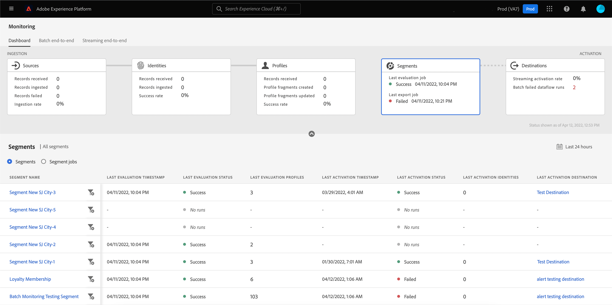
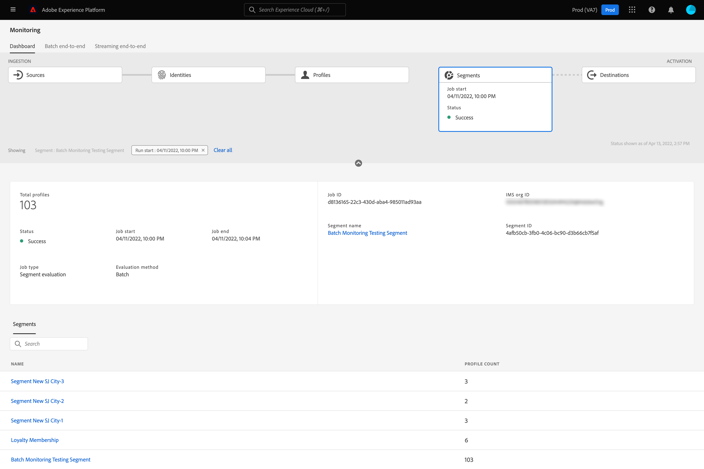

# Überwachen von Datenflüssen für Segmente in der Benutzeroberfläche

Mit dem Segmentation Service können Sie Segmente und Zielgruppen aus Ihren Echtzeit-Kundenprofildaten in Adobe Experience Platform erstellen. Platform bietet Datenflüsse zur transparenten Verfolgung dieses Datenflusses von Quellen zu Zielen.

Das Monitoring-Dashboard bietet eine visuelle Darstellung der Datenaktivität innerhalb eines Segments, einschließlich des Status der Segmentierung Ihrer Daten. In diesem Tutorial erfahren Sie, wie Sie mit dem Monitoring-Dashboard die Segmentierung Ihrer Daten mithilfe der Experience Platform-Benutzeroberfläche überwachen können. So können Sie den Status von Segmentaktivierungs-, Auswertungs- und Exportvorgängen verfolgen.

## Erste Schritte {#getting-started}

Dieses Handbuch setzt ein Verständnis der folgenden Komponenten von Adobe Experience Platform voraus:

- [Datenflüsse](../home.md): Datenflüsse sind eine Darstellung von Datenvorgängen, die Daten über Platform verschieben. Datenflüsse werden über verschiedene Dienste hinweg konfiguriert und helfen beim Verschieben von Daten aus Quell-Connectoren in Zieldatensätze, in [!DNL Identity] und [!DNL Profile] sowie in [!DNL Destinations].
   - [Datenfluss-Abläufe](../../sources/notifications.md): Datenfluss-Ausführungen sind die wiederkehrenden geplanten Aufträge, die auf der Frequenzkonfiguration ausgewählter Datenflüsse basieren.
- [Segmentierung](../../segmentation/home.md): Mit der Segmentierung können Sie aus Ihren Echtzeit-Kundenprofildaten Segmente und Zielgruppen erstellen.
   - [Aktivierungsaufträge](../../destinations/ui/activation-overview.md): Ein Aktivierungsauftrag wird verwendet, um Ihr Segment für ein bestimmtes Ziel zu aktivieren.
   - [Evaluierungsaufträge](../../segmentation/tutorials/evaluate-a-segment.md#evaluate-a-segment): Ein Auswertungsauftrag ist ein asynchroner Prozess, der ausgeführt wird und ein Zielgruppensegment erstellt, das auf dem angegebenen Segment basiert.
   - [Exportaufträge](../../segmentation/api/export-jobs.md): Ein Exportauftrag ist ein asynchroner Vorgang, der verwendet wird, um Zielgruppensegmentmitglieder in Datensätzen zu erhalten.
- [Sandboxes](../../sandboxes/home.md): [!DNL Experience Platform] bietet virtuelle Sandboxes, die eine einzelne [!DNL Platform]-Instanz in separate virtuelle Umgebungen unterteilen, damit Sie Programme für digitale Erlebnisse entwickeln können.

## Segmente-Dashboard überwachen {#monitoring-segments-dashboard}

>[!CONTEXTUALHELP]
>id="platform_monitoring_segments"
>title="Segmente"
>abstract="Die Segmentansicht enthält Informationen zu allen Segmenten Ihrer IMS-Organisation mit weiteren Informationen zu deren Aktivierungs- und Auswertungsaufträgen."

So greifen Sie auf die **[!UICONTROL Segmente]** Dashboard, auswählen **[!UICONTROL Überwachung]** in der linken Navigation. Einmal im **[!UICONTROL Überwachung]** Seite, wählen Sie die **[!UICONTROL Segmente]** Karte.

Im Hauptmenü **[!UICONTROL Segmente]** Dashboard, die **[!UICONTROL Segmente]** -Karte den Status und das Datum des letzten Bewertungsauftrags sowie den letzten Exportauftrag anzeigt.

Das Dashboard selbst enthält Metriken für Segmente und Segmentaufträge. Standardmäßig zeigt das Dashboard die Segmentmetriken für die letzten 24 Stunden an. Weitere Informationen zur Ansicht der Segmentaufträge finden Sie in der [Überwachen von Segmentaufträgen](#monitoring-segment-jobs-dashboard) Abschnitt.

>[!IMPORTANT]
>
>Derzeit werden nur Segmente aktiviert, für die [Batch-Ziele (dateibasiert)](../../destinations/destination-types.md#file-based) werden für das Dashboard der Überwachungssegmente unterstützt.

Für diese Dashboard-Ansicht stehen die folgenden Metriken zur Verfügung:

| Metrik | Beschreibung |
| ------ | ----------- |
| **[!UICONTROL Segmentname]** | Der Name des Segments. |
| **[!UICONTROL Letzter Bewertungszeitstempel]** | Datum und Uhrzeit der letzten Ausführung des Auswertungsauftrags des Segments. |
| **[!UICONTROL Letzter Bewertungsstatus]** | Der Status des letzten Auswertungsauftrags des Segments. Mögliche Werte sind **[!UICONTROL Erfolg]**, **[!UICONTROL Keine Ausführungen]** und **[!UICONTROL Fehlgeschlagen]**. |
| **[!UICONTROL Letzte Testprofile]** | Die Anzahl der Profile, die im letzten Auswertungsauftrag des Segments ausgewertet wurden. |
| **[!UICONTROL Letzter Aktivierungszeitstempel]** | Datum und Uhrzeit, zu der der letzte Aktivierungsauftrag des Segments ausgeführt wurde. |
| **[!UICONTROL Letzter Aktivierungsstatus]** | Der Status des letzten Aktivierungsauftrags des Segments. Mögliche Werte sind **[!UICONTROL Erfolg]**, **[!UICONTROL Keine Ausführungen]** und **[!UICONTROL Fehlgeschlagen]**. |
| **[!UICONTROL Letzte Aktivierungsidentitäten]** | Die Anzahl der Identitäten, die im letzten Aktivierungsauftrag des Segments aktiviert wurden. |
| **[!UICONTROL Letztes Aktivierungsziel]** | Der Name des Ziels, für das der letzte Aktivierungsauftrag des Segments aktiviert wurde. |

Sie können die Ergebnisse nach einem bestimmten Segment filtern und die zugehörigen Segmentaufträge anzeigen, indem Sie das Filtersymbol (). Die Segmentaufträge werden in chronologischer Reihenfolge sortiert, wobei die neuesten Segmentaufträge zuerst angezeigt werden.

Das gefilterte Segment-Dashboard wird angezeigt. Die **[!UICONTROL Segmente]** -Karte den Status und das Datum des letzten Evaluierungsauftrags und des letzten Aktivierungsauftrags anzeigt.

Das Dashboard selbst zeigt die Zeit und den Status der letzten Evaluierungs- und Aktivierungsaufträge, ein Diagramm mit der Profilanzahl der Segmentauswertung und Metriken für die ausgeführten Segmentaufträge an. Standardmäßig zeigt das Dashboard Metriken für Segmentaufträge für die letzten 24 Stunden an.

Für diese Dashboard-Ansicht stehen die folgenden Metriken zur Verfügung:

| Metrik | Beschreibung |
| ------ | ----------- |
| **[!UICONTROL Auftragsstart]** | Datum und Uhrzeit des Starts des Segmentauftrags. |
| **[!UICONTROL Typ]** | Gibt den Typ des Segmentauftrags an. Die beiden unterstützten Auftragstypen sind **Aktivierung** und **Evaluierung** Aufträge. |
| **[!UICONTROL Auftrag abgeschlossen]** | Datum und Uhrzeit des Abschlusses des Segmentauftrags. |
| **[!UICONTROL Verarbeitungszeit]** | Die Zeit, die der Abschluss des Segmentauftrags dauerte. |
| **[!UICONTROL Auftragsstatus]** | Der Status des Segmentauftrags. Zu den unterstützten Werten gehören **[!UICONTROL Erfolg]**, **[!UICONTROL In Bearbeitung]** und **[!UICONTROL Fehlgeschlagen]**. |
| **[!UICONTROL Anzahl der Profile]** | Die Anzahl der Profile, die der Segmentauftrag auswertet. Jeder Benutzer sollte über ein eindeutiges Profil verfügen. |
| **[!UICONTROL Identitätsanzahl]** | Die Anzahl der Identitäten, die der Segmentauftrag aktiviert. Jedes Profil kann mehrere Identitäten aufweisen. Beispielsweise könnte ein Profil eine E-Mail-, Telefonnummer- und Treuenummer als Identitäten haben. |
| **[!UICONTROL Zielname]** | Der Name des Ziels, für das der Segmentauftrag aktiviert wird. |

Sie können einen bestimmten Segmentauftrag weiter filtern und dessen Details anzeigen, indem Sie das Filtersymbol (). Es gibt zwei verschiedene Arten von Segmentaufträgen, die gefiltert werden können: Aktivierungsaufträge und Auswertungsaufträge.

### Details zum Aktivierungsauftrag {#activation-job-details}

Auf der Seite mit den Ausführungsdetails des Aktivierungsauftrags werden Informationen zu den Metriken der Ausführung, Datenflussfehlern und Segmenten angezeigt, die sich auf den Segmentauftrag beziehen. Ein Aktivierungsauftrag wird verwendet, um Ihr Segment für ein bestimmtes Ziel zu aktivieren. Standardmäßig werden auf der Detailseite die Ausführungsfehler des Datenflusses angezeigt.

Für diese Dashboard-Ansicht stehen die folgenden Metriken zur Verfügung:

| Metrik | Beschreibung |
| ------ | ----------- |
| **[!UICONTROL Vorgenommene Profile]** | Die Gesamtzahl der im Aktivierungsfluss empfangenen Profile. |
| **[!UICONTROL Aktivierte Identitäten]** | Die Gesamtzahl der Identitäten, die erfolgreich für das Ziel aktiviert wurden, basierend auf den empfangenen Profilen. |
| **[!UICONTROL Ausgeschlossene Identitäten]** | Die Gesamtzahl der Identitäten, die von der Aktivierung für das Ziel ausgeschlossen wurden, basierend auf den empfangenen Profilen. Diese Identitäten können aufgrund fehlender Attribute oder Zustimmungsverletzungen ausgeschlossen werden. |
| **[!UICONTROL Datengröße]** | Die Größe des zu aktivierenden Datenflusses. |
| **[!UICONTROL Dateien insgesamt]** | Die Gesamtzahl der im Datenfluss aktivierten Dateien. |
| **[!UICONTROL Status]** | Der aktuelle Status des Aktivierungsauftrags. |
| **[!UICONTROL Start des Datenflusses]** | Datum und Uhrzeit des Starts des Aktivierungsauftrags. |
| **[!UICONTROL Dataflow-Ausführungsende]** | Datum und Uhrzeit des Endes des Aktivierungsauftrags. |
| **[!UICONTROL Dataflow-run-ID]** | Die ID des aktuellen Aktivierungsauftrags. |
| **[!UICONTROL Kennung der IMS-Organisation]** | Die Kennung der IMS-Organisation, zu der der Aktivierungsauftrag gehört. |
| **[!UICONTROL Zielname]** | Der Name des Ziels, für das die Daten aktiviert werden. |

Unter den Metriken wird ein Umschalter angezeigt, um zwischen den Ausführungsfehlern des Datenflusses und den Segmenten auszuwählen.

Wählen Sie im Abschnitt &quot;Fehler bei Datenfluss-Ausführung&quot;den Umschalter aus, um die Felder mit den fehlgeschlagenen Identitäten oder den ausgeschlossenen Identitäten anzuzeigen. Der Abschnitt &quot;Fehler&quot;enthält Details zum Fehlercode und zur Anzahl der fehlgeschlagenen oder ausgeschlossenen Identitäten.

Im Abschnitt &quot;Segmente&quot;wird eine Liste der Segmente angezeigt, die im Rahmen des Aktivierungsauftrags aktiviert wurden. Verwenden Sie die Suchleiste, um die Liste der Segmente nach Namen zu filtern.

Für den Segmentabschnitt stehen die folgenden Metriken zur Verfügung:

| Metrik | Beschreibung |
| ------ | ----------- |
| **[!UICONTROL Name]** | Der Name des aktivierten Segments. |
| **[!UICONTROL Aktivierte Identitäten]** | Die Gesamtzahl der Identitäten, die erfolgreich für das Ziel aktiviert wurden, basierend auf den empfangenen Profilen. |
| **[!UICONTROL Ausgeschlossene Identitäten]** | Die Gesamtzahl der Identitäten, die von der Aktivierung für das Ziel ausgeschlossen wurden, basierend auf den empfangenen Profilen. Diese Identitäten können aufgrund fehlender Attribute oder Zustimmungsverletzungen ausgeschlossen werden. |
| **[!UICONTROL Ausführungsstatus des letzten Datenflusses]** | Der Status des letzten Aktivierungsauftrags, der für dieses Segment ausgeführt wurde. |
| **[!UICONTROL Letztes Datenfluss-Ausführungsdatum]** | Datum und Uhrzeit des letzten Aktivierungsauftrags, der für dieses Segment ausgeführt wurde. |

### Details zum Testauftrag {#evaluation-job-details}

Auf der Seite mit den Ausführungsdetails für Bewertungsaufträge werden Informationen zu den Metriken und Segmenten der Ausführung angezeigt, die mit dem Segmentauftrag zusammenhängen. Ein Auswertungsauftrag ist ein asynchroner Prozess, der ein Zielgruppensegment basierend auf dem angegebenen Segment erstellt. Weitere Informationen zu Auswertungsaufträgen finden Sie im Tutorial zu [Segmentbewertung](../../segmentation/tutorials/evaluate-a-segment.md#evaluate-a-segment).

Für diese Dashboard-Ansicht stehen die folgenden Metriken zur Verfügung:

| Metrik | Beschreibung |
| ------ | ----------- |
| **[!UICONTROL Profile insgesamt]** | Die Gesamtzahl der Profile, die ausgewertet werden. |
| **[!UICONTROL Status]** | Der Status des Bewertungsauftrags. Mögliche Status für den Bewertungsauftrag sind **[!UICONTROL Erfolg]** und **[!UICONTROL Fehlgeschlagen]**. |
| **[!UICONTROL Auftragsstart]** | Datum und Uhrzeit des Beginns des Auswertungsauftrags. |
| **[!UICONTROL Auftragsende]** | Datum und Uhrzeit des Endes des Auswertungsauftrags. |
| **[!UICONTROL Auftragstyp]** | Der Typ des Segmentauftrags. In diesem Fall handelt es sich immer um einen Segmentbewertungsauftrag. |
| **[!UICONTROL Testtyp]** | Die Art der durchgeführten Bewertung. Dies kann entweder **[!UICONTROL Batch]** oder **[!UICONTROL Streaming]**. |
| **[!UICONTROL Auftrags-ID]** | Die ID des Auswertungsauftrags. |
| **[!UICONTROL Kennung der IMS-Organisation]** | Die Kennung der IMS-Organisation, zu der der Auswertungsauftrag gehört. |
| **[!UICONTROL Segmentname]** | Der Name des Segments, das ausgewertet wird. |
| **[!UICONTROL Segment-ID]** | Die ID des Segments, das ausgewertet wird. |

Im Abschnitt &quot;Segmente&quot;wird eine Liste der Segmente angezeigt, die im Rahmen des Auswertungsauftrags ausgewertet werden. Mithilfe der Suchleiste können Sie die Segmentliste nach Namen filtern.

>[!IMPORTANT]
>
>Diese Dashboard-Ansicht unterstützt derzeit bis zu 800 Segmentmetriken.

Für den Segmentabschnitt stehen die folgenden Metriken zur Verfügung:

| Metrik | Beschreibung |
| ------ | ----------- |
| **[!UICONTROL Name]** | Der Name des Segments, das ausgewertet wird. |
| **[!UICONTROL Anzahl der Profile]** | Die Anzahl der Profile, die ausgewertet werden. |

## Dashboard für Segmentaufträge überwachen {#monitoring-segment-jobs-dashboard}

>[!CONTEXTUALHELP]
>id="platform_monitoring_segment_jobs"
>title="Segmentaufträge"
>abstract="Die Ansicht &quot;Segmentaufträge&quot;enthält Informationen zu den Evaluierungs- und Exportvorgängen für alle Ihre Segmente."

So greifen Sie auf die **[!UICONTROL Segmentaufträge]** Dashboard, auswählen **[!UICONTROL Überwachung]** () in der linken Navigation. Einmal im [!UICONTROL Überwachung] Seite, wählen Sie **[!UICONTROL Segmentaufträge]**. Die [!UICONTROL Überwachung] Dashboard enthält Metriken und Informationen zu den Segmentbewertungs- und Exportvorgängen.

>[!NOTE]
>
>Nur **Segmentauswertungsaufträge** werden für die Segmentüberwachung unterstützt. Segmentexportaufträge unterstützen nur die Überwachung auf Unternehmensebene.

Verwenden Sie die [!UICONTROL Segmentaufträge] Dashboard , um zu verstehen, ob die Profilbewertung und der Export rechtzeitig und ohne Ausnahmen erfolgen, sodass die nachgelagerten Dienste für die Zielaktivierung über die neuesten ausgewerteten Profildaten verfügen können.

Die folgenden Metriken sind für Segmentaufträge verfügbar:

| Metrik | Beschreibung |
---------|----------|
| **[!UICONTROL Segmentauftrag]** | Gibt den Namen des Segmentauftrags an. |
| **[!UICONTROL Typ]** | Gibt den Typ des Segmentauftrags - Export oder Auswertung an. Beachten Sie, dass der Segmentauftrag in beiden Fällen ausgewertet oder exportiert wird. **all** Segmente, die zu einer Organisation gehören. Weiterführende Informationen zu Exportaufträgen finden Sie im Handbuch im [Endpunkt der Exportaufträge](../../segmentation/api/export-jobs.md). Weitere Informationen zu Auswertungsaufträgen finden Sie im Tutorial zu [Segmentbewertung](../../segmentation/tutorials/evaluate-a-segment.md#evaluate-a-segment). |
| **[!UICONTROL Auftragsstart]** | Datum und Uhrzeit des Starts des Segmentauftrags. |
| **[!UICONTROL Auftragsende]** | Datum und Uhrzeit des Abschlusses des Segmentauftrags. |
| **[!UICONTROL Status]** | Der Status des abgeschlossenen Auftrags. Mögliche Status für den Segmentauftrag sind &quot;Erfolg&quot;oder &quot;Fehlgeschlagen&quot;. |