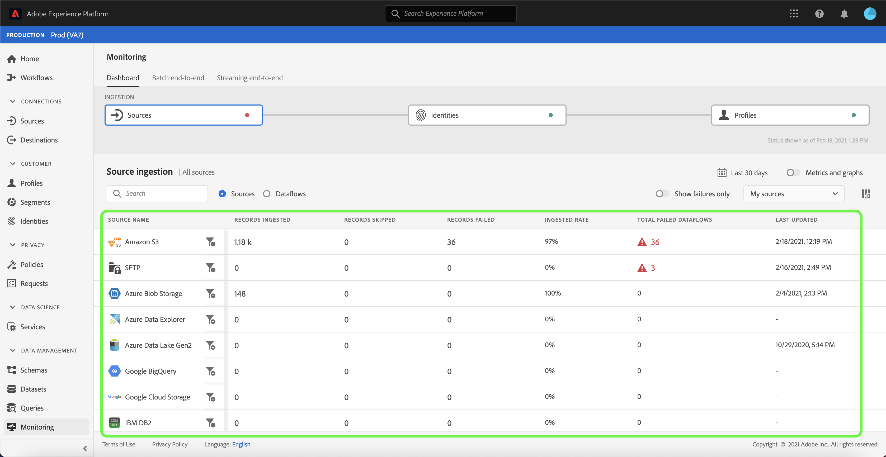
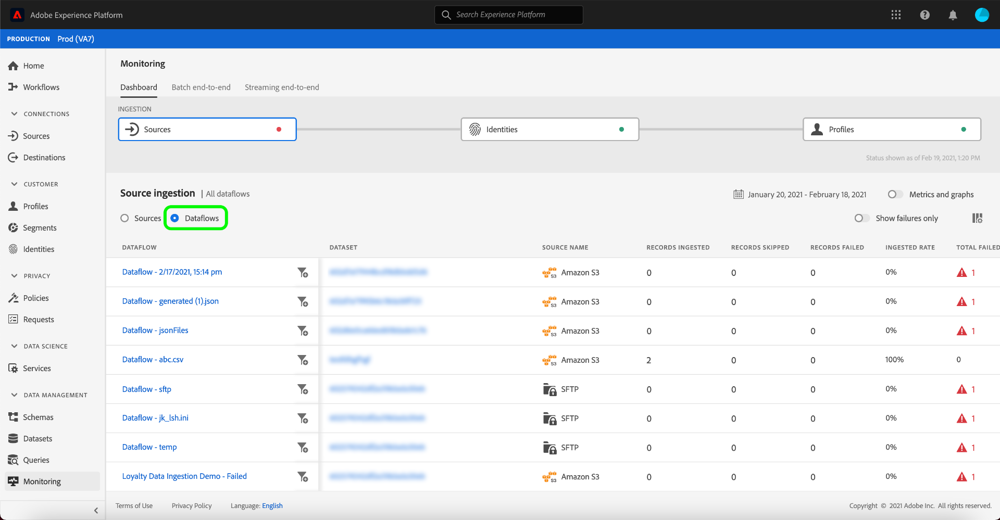
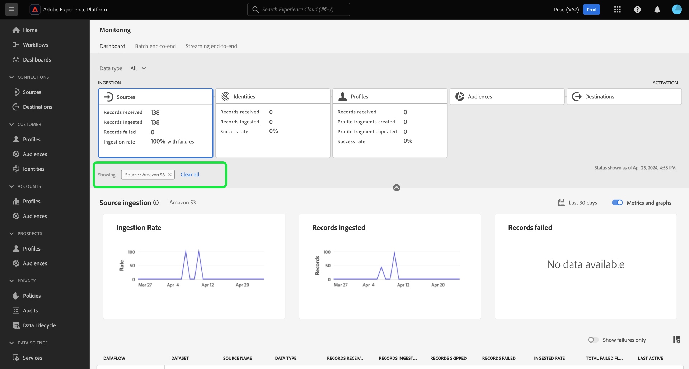

# Überwachen von Datenflüssen für Quellen in der Benutzeroberfläche

>[!IMPORTANT]
>
>Streaming-Quellen, z. B. die [HTTP-API-Quelle](../../sources/connectors/streaming/http.md) werden derzeit nicht vom Monitoring-Dashboard unterstützt. Derzeit können Sie das Dashboard nur zur Überwachung der Batch-Quellen verwenden.

In Adobe Experience Platform werden Daten aus zahlreichen Quellen aufgenommen, analysiert und für eine Vielzahl an Zielen aktiviert. Platform erleichtert das Tracking dieses potenziell nicht-linearen Datenflusses durch Transparenz.

Das Monitoring-Dashboard bietet eine visuelle Darstellung des Journey eines Datenflusses. Sie können eine aggregierte Überwachungsansicht verwenden und von der Quellebene zu einem Datenfluss und einem Datenfluss vertikal navigieren, sodass Sie die entsprechenden Metriken anzeigen können, die zum Erfolg oder Misserfolg eines Datenflusses beitragen. Sie können auch die dienstübergreifende Überwachungskapazität des Monitoring-Dashboards verwenden, um die Journey eines Datenflusses von einer Quelle aus zu überwachen. [!DNL Identity Service]und [!DNL Profile].

In diesem Tutorial werden Schritte zur Überwachung Ihres Datenflusses beschrieben, wobei sowohl eine aggregierte Überwachungsansicht als auch eine dienstübergreifende Überwachung verwendet werden.

## Erste Schritte {#getting-started}

Dieses Tutorial setzt ein Grundverständnis der folgenden Komponenten von Adobe Experience Platform voraus:

* [Datenflüsse](../home.md): Datenflüsse sind eine Darstellung von Datenvorgängen, die Daten über Platform verschieben. Datenflüsse werden über verschiedene Dienste hinweg konfiguriert und helfen beim Verschieben von Daten aus Quell-Connectoren in Zieldatensätze, in [!DNL Identity] und [!DNL Profile] sowie in [!DNL Destinations].
   * [Datenfluss-Abläufe](../../sources/notifications.md): Datenflüsse sind die wiederkehrenden geplanten Aufträge, die auf der Frequenzkonfiguration ausgewählter Datenflüsse basieren.
* [Quellen](../../sources/home.md): Experience Platform ermöglicht die Aufnahme von Daten aus verschiedenen Quellen und bietet Ihnen die Möglichkeit, die eingehenden Daten mithilfe von Platform-Services zu strukturieren, zu kennzeichnen und anzureichern.
* [Identity Service](../../identity-service/home.md): Verschaffen Sie sich einen besseren Überblick über einzelne Kundinnen und Kunden und deren Verhalten, indem Sie Identitäten geräte- und systemübergreifend verknüpfen.
* [Echtzeit-Kundenprofil](../../profile/home.md): Bietet ein einheitliches Echtzeit-Kundenprofil, das auf aggregierten Daten aus verschiedenen Quellen basiert.
* [Sandboxes](../../sandboxes/home.md): Experience Platform bietet virtuelle Sandboxes, die eine einzelne Platform-Instanz in separate virtuelle Umgebungen unterteilen, damit Sie Programme für digitale Erlebnisse entwickeln und weiterentwickeln können.

## Aggregierte Monitoring-Ansicht {#aggregated-monitoring-view}

>[!CONTEXTUALHELP]
>id="platform_monitoring_source_ingestion"
>title="Quellaufnahme"
>abstract="Die Quellaufnahmen-Ansicht enthält Informationen zum Status der Datenaktivität und zu Metriken im Data-Lake-Dienst, einschließlich der aufgenommenen und fehlgeschlagenen Datensätze. Weitere Informationen zu Metriken und Diagrammen finden Sie im Handbuch zur Metrikdefinition."
>text="Learn more in documentation"

>[!CONTEXTUALHELP]
>id="platform_monitoring_dataflow_run_details_ingestion"
>title="Datenflussausführungs-Details"
>abstract="Die Quellverarbeitung enthält Informationen zum Status der Datenaktivität und zu Metriken im Data-Lake-Dienst, einschließlich der aufgenommenen und fehlgeschlagenen Datensätze. Weitere Informationen zu Metriken und Diagrammen finden Sie im Handbuch zur Metrikdefinition."
>text="Learn more in documentation"

Im [Platform-Benutzeroberfläche](https://platform.adobe.com)auswählen **[!UICONTROL Überwachung]** über die linke Navigationsleiste auf [!UICONTROL Überwachung] Dashboard. Die [!UICONTROL Überwachung] Das Dashboard enthält Metriken und Informationen zu allen Datenflüssen von Quellen, einschließlich Einblicken in den Zustand des Daten-Traffics von einer Quelle zu [!DNL Identity Service]und [!DNL Profile].

In der Mitte des Dashboards befindet sich der [!UICONTROL Quellaufnahme] -Bereich, der Metriken und Diagramme enthält, die Daten zu erfassten Datensätzen und fehlgeschlagenen Datensätzen anzeigen.

Standardmäßig enthalten die angezeigten Daten die Aufnahmeraten der letzten 24 Stunden. Auswählen **[!UICONTROL Letzte 24 Stunden]** , um den Zeitrahmen der angezeigten Datensätze anzupassen.

Es wird ein Kalender-Popup-Fenster mit Optionen für alternative Erfassungszeitrahmen angezeigt. Auswählen **[!UICONTROL Letzte 30 Tage]** und wählen Sie **[!UICONTROL Anwenden]**

Die Diagramme sind standardmäßig aktiviert und Sie können sie deaktivieren, um die Liste der unten aufgeführten Quellen zu erweitern. Wählen Sie die **[!UICONTROL Metriken und Diagramme]** Umschalten, um die Diagramme zu deaktivieren.

| Quellaufnahme | Beschreibung |
| ---------------- | ----------- |
| [!UICONTROL Aufgenommene Einträge] | Die Gesamtzahl der erfassten Datensätze. |
| [!UICONTROL Fehlgeschlagene Einträge] | Die Gesamtzahl der Datensätze, die aufgrund von Fehlern in den Daten nicht erfasst wurden. |
| [!UICONTROL Gesamtzahl fehlgeschlagener Datenflüsse] | Die Gesamtzahl der Datenflüsse mit einer `failed` -Status. |

In der Liste der Quellerfassung werden alle Quellen angezeigt, die mindestens ein vorhandenes Konto enthalten. Die Liste enthält außerdem Informationen zur Erfassungsrate jeder Quelle, zur Anzahl fehlgeschlagener Datensätze und zur Gesamtzahl fehlgeschlagener Datenflüsse basierend auf dem von Ihnen angewendeten Zeitraum.

Um die Sortierung durch die Liste der Quellen vorzunehmen, wählen Sie **[!UICONTROL Meine Quellen]** und wählen Sie dann Ihre gewünschte Kategorie aus dem Dropdown-Menü aus. Um sich beispielsweise auf Cloud-Speicher zu konzentrieren, wählen Sie  **[!UICONTROL Cloud-Speicher]**

Um alle vorhandenen Datenflüsse über alle Quellen hinweg anzuzeigen, wählen Sie **[!UICONTROL Datenflüsse]**.

Alternativ können Sie eine Quelle in die Suchleiste eingeben, um eine einzelne Quelle zu isolieren. Nachdem Sie die Quelle identifiziert haben, wählen Sie das Filtersymbol aus.  daneben, um eine Liste der aktiven Datenflüsse anzuzeigen.

Eine Liste der Datenflüsse wird angezeigt. Um die Liste einzuschränken und sich auf fehlgeschlagene Datenflüsse zu konzentrieren, wählen Sie **[!UICONTROL Nur Fehler anzeigen]**.

Suchen Sie den zu überwachenden Datenfluss und wählen Sie dann das Filtersymbol aus  um weitere Informationen zum Ausführungsstatus anzuzeigen.

Auf der Seite &quot;Datenfluss-Ausführung&quot;werden Informationen zum Startdatum des Datenflusses, zur Datengröße, zum Status und zur Verarbeitungsdauer angezeigt. Filtersymbol auswählen  neben der Startzeit des Datenflusses, um die Ausführungsdetails des Datenflusses anzuzeigen.

Die [!UICONTROL Datenfluss-Ausführungsdetails] -Seite enthält Informationen zu den Metadaten des Datenflusses, zum Status der partiellen Erfassung und zur Fehlerzusammenfassung. Die Fehlerzusammenfassung enthält den spezifischen Fehler der obersten Ebene, der anzeigt, in welchem Schritt beim Aufnahmevorgang ein Fehler aufgetreten ist.

Scrollen Sie nach unten, um genauere Informationen zum aufgetretenen Fehler anzuzeigen.

Die [!UICONTROL Fehler bei Datenfluss-Ausführung] zeigt den spezifischen Fehler- und Fehlercode an, der zum Erfassungsfehler des Datenflusses führte. In diesem Szenario trat ein Fehler bei der Zuordnungsumwandlung auf, der dazu führte, dass 24 Datensätze fehlschlugen.

Auswählen **[!UICONTROL Dateien]** für weitere Informationen.

Die [!UICONTROL Dateien] enthält Informationen zum Namen und Pfad der Datei.

Um den Fehler detaillierter darzustellen, wählen Sie **[!UICONTROL Vorschau der Fehlerdiagnose]**.

Die [!UICONTROL Fehlerdiagnose - Vorschau] wird ein Fenster mit einer Vorschau von bis zu 100 Fehlern im Datenfluss angezeigt. Sie können **[!UICONTROL Herunterladen]** um einen curl -Befehl abzurufen, mit dem Sie dann die Fehlerdiagnose herunterladen können.

Wenn Sie fertig sind, wählen Sie **[!UICONTROL Schließen]** aus

Sie können das Breadcrumb-System oben in der Kopfzeile verwenden, um zurück zum [!UICONTROL Überwachung] Dashboard. Auswählen **[!UICONTROL Start ausführen: 14.02.2021, 21.47 Uhr]** , um zur vorherigen Seite zurückzukehren, und wählen Sie dann **[!UICONTROL Datenfluss: Demo zur Erfassung von Treuedaten - Fehlgeschlagen]** , um zur Dataflows-Seite zurückzukehren.

## Nächste Schritte {#next-steps}

Durch Befolgen dieses Tutorials haben Sie den Datenfluss der Aufnahme von der Quellebene mithilfe der Variablen **[!UICONTROL Überwachung]** Dashboard. Sie haben auch erfolgreich Fehler identifiziert, die zum Fehlschlagen von Datenflüssen während des Aufnahmevorgangs beigetragen haben. Weiterführende Informationen finden Sie in folgenden Dokumenten:

* [Identitäten in Datenflüssen überwachen](./monitor-identities.md)
* [Profile in Datenflüssen überwachen](./monitor-profiles.md)
