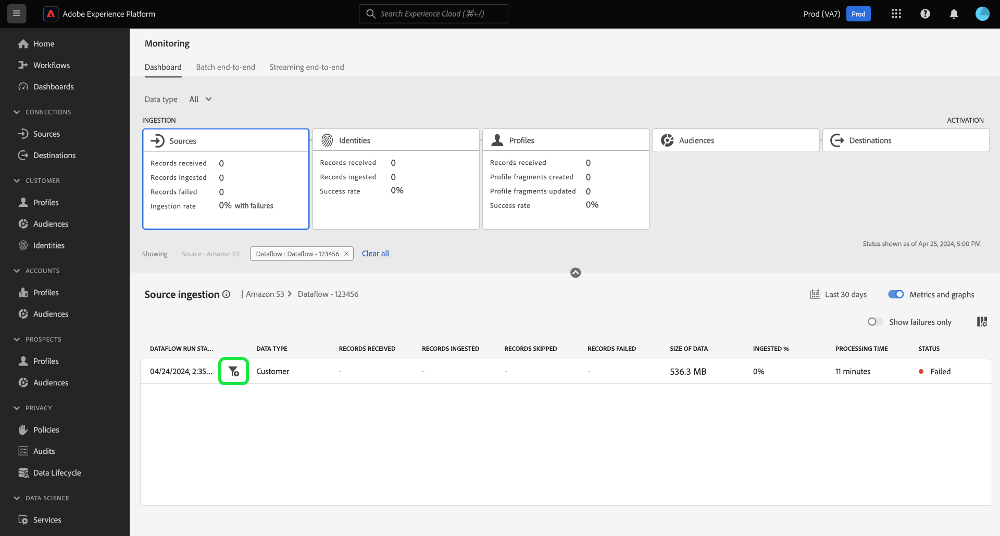

# Überwachen von Datenflüssen für Quellen in der Benutzeroberfläche

>[!IMPORTANT]
>
>Streaming-Quellen, z. B. die [HTTP-API-Quelle](../../sources/connectors/streaming/http.md) werden derzeit nicht vom Monitoring-Dashboard unterstützt. Derzeit können Sie das Dashboard nur zur Überwachung der Batch-Quellen verwenden.

In diesem Dokument erfahren Sie, wie Sie mit dem Monitoring-Dashboard die Datenflüsse Ihrer Quellen in der Experience Platform-Benutzeroberfläche überwachen können.

## Erste Schritte {#get-started}

Dieses Tutorial setzt ein Grundverständnis der folgenden Komponenten von Adobe Experience Platform voraus:

* [Datenflüsse](../home.md): Datenflüsse sind eine Darstellung von Datenvorgängen, die Daten über Platform verschieben. Datenflüsse werden über verschiedene Dienste hinweg konfiguriert und helfen beim Verschieben von Daten aus Quell-Connectoren in Zieldatensätze, in [!DNL Identity] und [!DNL Profile] sowie in [!DNL Destinations].
   * [Datenfluss-Abläufe](../../sources/notifications.md): Datenflüsse sind die wiederkehrenden geplanten Aufträge, die auf der Frequenzkonfiguration ausgewählter Datenflüsse basieren.
* [Quellen](../../sources/home.md): Experience Platform ermöglicht die Aufnahme von Daten aus verschiedenen Quellen und bietet Ihnen die Möglichkeit, die eingehenden Daten mithilfe von Platform-Services zu strukturieren, zu kennzeichnen und anzureichern.
* [Identity Service](../../identity-service/home.md): Verschaffen Sie sich einen besseren Überblick über einzelne Kundinnen und Kunden und deren Verhalten, indem Sie Identitäten geräte- und systemübergreifend verknüpfen.
* [Echtzeit-Kundenprofil](../../profile/home.md): Bietet ein einheitliches Echtzeit-Kundenprofil, das auf aggregierten Daten aus verschiedenen Quellen basiert.
* [Sandboxes](../../sandboxes/home.md): Experience Platform bietet virtuelle Sandboxes, die eine einzelne Platform-Instanz in separate virtuelle Umgebungen unterteilen, damit Sie Programme für digitale Erlebnisse entwickeln und weiterentwickeln können.

## Überwachen der Quelldaten mithilfe des Monitoring-Dashboards

>[!CONTEXTUALHELP]
>id="platform_monitoring_source_ingestion"
>title="Quellaufnahme"
>abstract="Die Quellaufnahmen-Ansicht enthält Informationen zum Status der Datenaktivität und zu Metriken im Data-Lake-Dienst, einschließlich der aufgenommenen und fehlgeschlagenen Datensätze. Weitere Informationen zu Metriken und Diagrammen finden Sie im Handbuch zur Metrikdefinition."
>text="Learn more in documentation"

>[!CONTEXTUALHELP]
>id="platform_monitoring_dataflow_run_details_ingestion"
>title="Datenflussausführungs-Details"
>abstract="Die Quellverarbeitung enthält Informationen zum Status der Datenaktivität und zu Metriken im Data-Lake-Dienst, einschließlich der aufgenommenen und fehlgeschlagenen Datensätze. Weitere Informationen zu Metriken und Diagrammen finden Sie im Handbuch zur Metrikdefinition."
>text="Learn more in documentation"

<!-- In the [Platform UI](https://platform.adobe.com), select **[!UICONTROL Monitoring]** from the left navigation to access the [!UICONTROL Monitoring] dashboard. The [!UICONTROL Monitoring] dashboard contains metrics and information on all sources dataflows, including insights into the health of data traffic from a source to [!DNL Identity Service], and to [!DNL Profile].

At the center of the dashboard is the [!UICONTROL Source ingestion] panel, which contains metrics and graphs that display data on records ingested and records failed. -->

Wählen Sie im Monitoring-Dashboard die Option [!UICONTROL Quellen] aus der Hauptüberschrift, um Ihr Dashboard mit einer Anzeige der Datenflussrate Ihrer Quellen zu aktualisieren.

Die [!UICONTROL Aufnahmerate] -Diagramm zeigt Ihre Datenerfassungsrate basierend auf Ihrem konfigurierten Zeitrahmen an. Standardmäßig zeigt das Monitoring-Dashboard die Aufnahmerate der letzten 24 Stunden an. Anweisungen zum Konfigurieren des Zeitrahmens finden Sie im Handbuch unter [Konfigurieren des Überwachungszeitrahmens](monitor.md#configure-monitoring-time-frame).

Das Diagramm ist standardmäßig für die Anzeige aktiviert. Um das Diagramm auszublenden, wählen Sie **[!UICONTROL Metriken und Diagramme]** , um das Diagramm zu deaktivieren und auszublenden.

Im unteren Teil des Dashboards wird eine Tabelle mit dem aktuellen Metrikbericht für alle vorhandenen Datenflüsse aus Quellen angezeigt.

| Metriken | Beschreibung |
| --- | --- |
| Empfangene Einträge | Die Gesamtzahl der aus der Quelle empfangenen Datensätze. |
| Aufgenommene Einträge | Die Gesamtzahl der Datensätze, die in den Data Lake aufgenommen wurden. |
| Übersprungene Datensätze | Die Gesamtzahl der übersprungenen Datensätze. |
| Fehlgeschlagene Einträge | Die Gesamtzahl der Datensätze, die aufgrund von Fehlern nicht erfasst werden konnten. |
| Aufnahmerate | Der Prozentsatz der erfassten Datensätze basierend auf der Gesamtzahl der empfangenen Datensätze. |
| Gesamtzahl fehlgeschlagener Datenflüsse | Die Gesamtzahl der fehlgeschlagenen Datenflüsse. |

{style="table-layout:auto"}

Sie können Ihre Daten mithilfe der oben in der Metriktabelle bereitgestellten Optionen weiter filtern:

| Filteroptionen | Beschreibung |
| --- | --- |
| Durchsuchen | Verwenden Sie die Suchleiste, um Ihre Ansicht nach einem Quelltyp zu filtern. |
| Quellen | Auswählen **[!UICONTROL Quellen]** , um Ihre Ansicht zu filtern und Metrikdaten nach Quelltyp anzuzeigen. Dies ist die Standardanzeige, die das Monitoring-Dashboard verwendet. |
| Datenflüsse | Auswählen **[!UICONTROL Datenflüsse]** , um Ihre Ansicht zu filtern und Metrikdaten pro Datenfluss anzuzeigen. |
| Nur Fehler anzeigen | Auswählen **[!UICONTROL Nur Fehler anzeigen]** , um Ihre Ansicht zu filtern und nur Datenflüsse anzuzeigen, die zu Erfassungsfehlern geführt haben. |
| Meine Quellen | Sie können Ihre Ansicht weiter filtern, indem Sie [!UICONTROL Meine Quellen] Dropdown-Menü. Filtern Sie Ihre Ansicht mithilfe des Dropdown-Menüs nach Kategorie. Alternativ können Sie **[!UICONTROL Alle Quellen]** , um Metriken für alle Quellen oder Quellen anzuzeigen, oder wählen Sie **[!UICONTROL Meine Quellen]** , um nur die Quellen anzuzeigen, mit denen Sie ein entsprechendes Konto haben. |

{style="table-layout:auto"}

Um die in einem bestimmten Datenfluss erfassten Daten zu überwachen, wählen Sie das Filtersymbol aus.  neben einer Quelle.

Die Tabelle &quot;Metriken&quot;wird auf eine Tabelle aktiver Datenflüsse aktualisiert, die der von Ihnen ausgewählten Quelle entsprechen. Während dieses Schritts können Sie zusätzliche Informationen zu Ihren Datenflüssen anzeigen, einschließlich des zugehörigen Datensatzes und Datentyps, sowie einen Zeitstempel, der angibt, wann sie zuletzt aktiv waren.

Um einen Datenfluss weiter zu untersuchen, wählen Sie das Filtersymbol aus.  neben einem Datenfluss.

Als Nächstes gelangen Sie zu einer Schnittstelle, die alle Datenfluss-Ausführungsiterationen des ausgewählten Datenflusses auflistet.

Datenfluss-Ausführungen stellen eine Instanz der Ausführung des Datenflusses dar. Wenn beispielsweise ein Datenfluss für 9:00 Uhr, 10:00 Uhr und 11:00 Uhr geplant ist, haben Sie drei Instanzen eines Durchlaufs. Flussläufe sind spezifisch für Ihre jeweilige Organisation.

Um Metriken einer bestimmten Datenfluss-Ausführungswiederholt zu werden, wählen Sie das Filtersymbol aus.  neben Ihrem Datenfluss.

Verwenden Sie die Seite mit Details zur Ausführung des Datenflusses , um Metriken und Informationen zur ausgewählten Ausführungswiederholt anzuzeigen.

| Datenflussausführungs-Details | Beschreibung |
| --- | --- |
| Aufgenommene Einträge | Die Gesamtzahl der Datensätze, die aus der Ausführung des Datenflusses erfasst wurden. |
| Fehlgeschlagene Einträge | Die Gesamtzahl der Datensätze, die aufgrund von Fehlern in der Ausführung des Datenflusses nicht erfasst wurden. |
| Dateien insgesamt | Die Gesamtzahl der Dateien im Datenfluss-Lauf. |
| Datengröße | Die Gesamtgröße der Daten, die im Datenfluss enthalten sind. |
| Dataflow-run-ID | Die ID der Dataflow-Run-Iteration |
| Organisations-ID | Die ID der Organisation, in der der Datenfluss erstellt wurde. |
| Status | Der Status des Datenflusses. |
| Start des Datenflusses | Ein Zeitstempel, der angibt, wann der Datenfluss gestartet wurde. |
| Dataflow-Ausführungsende | Ein Zeitstempel, der angibt, wann die Ausführung des Datenflusses beendet wurde. |
| Datensatz | Der Datensatz, der zum Erstellen des Datenflusses verwendet wird. |
| Datentyp | Der Typ der Daten, die sich im Datenfluss befanden. |
| Partielle Erfassung | Partielle Batch-Erfassung ist die Möglichkeit, Daten mit Fehlern bis zu einem bestimmten konfigurierbaren Schwellenwert zu erfassen. Mit dieser Funktion können Sie alle Ihre präzisen Daten erfolgreich in Experience Platform erfassen, während all Ihre falschen Daten separat mit Informationen darüber gestapelt werden, warum sie ungültig sind. Sie können die partielle Erfassung während des Erstellungsprozesses des Datenflusses aktivieren. |
| Fehlerdiagnose | Die Fehlerdiagnose weist die Quelle an, eine Fehlerdiagnose zu erstellen, die Sie später bei der Überwachung der Datensatzaktivität und des Datenflussstatus referenzieren können. Sie können die Fehlerdiagnose während des Erstellungsprozesses des Datenflusses aktivieren. |
| Fehlerzusammenfassung | Bei einer fehlgeschlagenen Ausführung des Datenflusses zeigt die Fehlerzusammenfassung einen Fehlercode und eine Beschreibung an, um zusammenzufassen, warum die Ausführung fehlgeschlagen ist. |

{style="table-layout:auto"}

Wenn Ihre Datenflug-Ausführung Fehler meldet, können Sie mit der Funktion [!UICONTROL Fehler bei Datenfluss-Ausführung] -Schnittstelle.

Verwenden Sie die [!UICONTROL Fehlgeschlagene Datensätze] , um Metriken zu Datensätzen anzuzeigen, die nicht aufgrund von Fehlern erfasst wurden. Um einen umfassenden Fehlerbericht anzuzeigen, wählen Sie **[!UICONTROL Vorschau der Fehlerdiagnose]**. Um eine Kopie Ihrer Fehlerdiagnose und des Dateimanifests herunterzuladen, wählen Sie **[!UICONTROL Herunterladen]** und kopieren Sie dann den Beispiel-API-Aufruf, der mit der [!DNL Data Access] API.

>[!NOTE]
>
>Sie können die Fehlerdiagnose nur verwenden, wenn die Funktion während der Erstellung der Quellverbindung aktiviert wurde.

## Nächste Schritte {#next-steps}

Durch Befolgen dieses Tutorials haben Sie den Datenfluss der Aufnahme von der Quellebene mithilfe der Variablen **[!UICONTROL Überwachung]** Dashboard. Sie haben auch erfolgreich Fehler identifiziert, die zum Fehlschlagen von Datenflüssen während des Aufnahmevorgangs beigetragen haben. Weiterführende Informationen finden Sie in folgenden Dokumenten:

* [Identitätsdaten überwachen](./monitor-identities.md).
* [Profildaten überwachen](./monitor-profiles.md).
