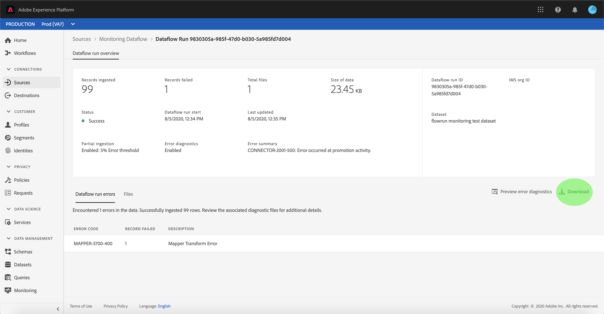

# Überwachen von Datenflüssen auf Quellen in der Benutzeroberfläche

Die Source Connectors in Adobe Experience Platform bieten die Möglichkeit, extern beschaffte Daten planmäßig zu erfassen. Dieses Lernprogramm enthält Schritte zum Anzeigen vorhandener Datenflüsse aus dem Arbeitsbereich [!UICONTROL Quellen].

## Erste Schritte

Dieses Tutorial setzt ein Grundverständnis der folgenden Komponenten von Adobe Experience Platform voraus:

- [Quellen](../../sources/home.md):  [!DNL Experience Platform] ermöglicht die Erfassung von Daten aus verschiedenen Quellen und bietet Ihnen gleichzeitig die Möglichkeit, eingehende Daten mithilfe von  [!DNL Platform] Diensten zu strukturieren, zu beschriften und zu verbessern.
- [Sandboxen](../../sandboxes/home.md):  [!DNL Experience Platform] bietet virtuelle Sandboxes, die eine einzelne  [!DNL Platform] Instanz in separate virtuelle Umgebung unterteilen, um Anwendungen für digitale Erlebnisse zu entwickeln und weiterzuentwickeln.

## Überwachen von Datenflüssen

Melden Sie sich bei der Benutzeroberfläche [Experience Platform](https://platform.adobe.com) an und wählen Sie dann **[!UICONTROL Quellen]** aus der linken Navigation, um auf den Arbeitsbereich [!UICONTROL Quellen] zuzugreifen. Wählen Sie **[!UICONTROL Datenflüsse]** aus der oberen Kopfzeile zur Ansicht vorhandener Datenflüsse.

Eine Liste der vorhandenen Datenflüsse wird angezeigt. Auf dieser Seite finden Sie eine Liste mit anzeigbaren Datenflüssen, einschließlich Informationen zu Quelle, Benutzername, Anzahl der Datenflüsse und Status.

Weitere Informationen zu Status finden Sie in der folgenden Tabelle:

| Status | Beschreibung |
| ------ | ----------- |
| Aktiviert | Der Status `Enabled` gibt an, dass ein Datendurchlauf aktiv ist und Daten gemäß dem Zeitplan einbezieht, der sie bereitgestellt wurde. |
| Deaktiviert | Der Status `Disabled` gibt an, dass ein Datennachweis inaktiv ist und keine Daten einnimmt. |
| Verarbeitung | Der Status `Processing` gibt an, dass ein Datendurchlauf noch nicht aktiv ist. Dieser Status tritt oft unmittelbar nach der Erstellung eines neuen Datenflusses auf. |
| Fehler | Der Status `Error` gibt an, dass die Aktivierung eines Datenflusses unterbrochen wurde. |

Wählen Sie das Trichtersymbol oben links, das sortiert werden soll.

Das Sortierfeld wird angezeigt. Wählen Sie im Bildlaufmenü die Quelle aus, auf die Sie zugreifen möchten, und wählen Sie dann in der Liste auf der rechten Seite den Datendurchlauf aus. Sie können auch die Schaltfläche mit den Auslassungspunkten (`...`) auswählen, um mehr verfügbare Optionen für den ausgewählten Datendurchlauf anzuzeigen.

Die Aktivität **[!UICONTROL Dataflow]** enthält Angaben zur Anzahl der erfassten Datensätze und zu fehlgeschlagenen Datensätzen sowie Informationen zum Datenaflow-Status und zur Verarbeitungszeit. Wählen Sie das Kalendersymbol oberhalb des Datenflusses aus, um den Zeitraum Ihrer Erfassungsdatensätze anzupassen.

Der Kalender ermöglicht die Ansicht der verschiedenen Zeitrahmen für erfasste Datensätze. Sie können eine der beiden voreingestellten Optionen &quot;[!UICONTROL Letzte 7 Tage]&quot;oder &quot;[!UICONTROL Letzte 30 Tage]&quot;auswählen. Alternativ können Sie einen benutzerdefinierten Zeitraum mithilfe des Kalenders festlegen. Wählen Sie den gewünschten Zeitraum aus und wählen Sie **[!UICONTROL Anwenden]**, um fortzufahren.

Standardmäßig zeigt die **[!UICONTROL Dataflow-Aktivität]** das Bedienfeld **[!UICONTROL Eigenschaften]** an, das mit dem Datenfeed verknüpft ist. Wählen Sie den Fluss aus, der von der Liste ausgeführt wird, um die zugehörigen Metadaten einschließlich Informationen zur eindeutigen Ausführen-ID anzuzeigen.

Wählen Sie **[!UICONTROL Beginn für Datenflug-Ausführung]** aus, um auf **[!UICONTROL Übersicht für Datenflüsse]** zuzugreifen.

Die **[!UICONTROL Übersicht über den Datenfluss]** zeigt Informationen zum Datendurchlauf einschließlich Metadaten, des Teilaufzeichnungsstatus und des zugewiesenen Fehlerschwellenwerts an. Die obere Kopfzeile enthält auch eine Fehlerzusammenfassung. Die **[!UICONTROL Fehlerzusammenfassung]** enthält den spezifischen Fehler der obersten Ebene, der anzeigt, in welchem Schritt der Erfassungsvorgang einen Fehler auftrat.

In der folgenden Tabelle finden Sie Fehler, die in der **[!UICONTROL Fehlerzusammenfassung]** angezeigt werden können.

| Fehler | Beschreibung |
| ---------- | ----------- |
| `CONNECTOR-1001-500` | Beim Kopieren von Daten aus einer Quelle ist ein Fehler aufgetreten. |
| `CONNECTOR-2001-500` | Während der Verarbeitung kopierter Daten zu [!DNL Platform] ist ein Fehler aufgetreten. Dieser Fehler kann bei der Analyse, Validierung oder Transformation auftreten. |

Die untere Hälfte des Bildschirms enthält Informationen zu **[!UICONTROL Dataflow-Ausführungsfehlern]**. Von hier aus können Sie auch die erfassten Dateien Ansicht, die Fehlerdiagnose für Vorschau und Download durchführen oder das Dateimanifest herunterladen.

Im Abschnitt **[!UICONTROL Datenflussausführungsfehler]** werden der Fehlercode, die Anzahl der fehlgeschlagenen Datensätze und Informationen zur Beschreibung des Fehlers angezeigt.

Wählen Sie **[!UICONTROL Fehlerdiagnose bei Vorschau]** aus, um weitere Informationen zum Erfassungsfehler anzuzeigen.

Das Bedienfeld **[!UICONTROL Fehlerdiagnose-Vorschau]** wird angezeigt. In diesem Bildschirm werden spezifische Informationen zum Erfassungsfehler angezeigt, einschließlich Dateiname, Fehlercode, Name der Spalte, in der der Fehler aufgetreten ist, und Beschreibung des Fehlers.

Dieser Abschnitt enthält auch eine Vorschau der Spalte, die den Fehler enthält.

>[!IMPORTANT]
>
>Um die Vorschau **[!UICONTROL Fehlerdiagnose]** zu aktivieren, müssen Sie **[!UICONTROL Partielle Erfassung]** und **[!UICONTROL Fehlerdiagnose]** beim Konfigurieren eines Datenflusses aktivieren. Dadurch kann das System alle während der Ausführung erfassten Datensätze überprüfen.

Nach der Vorschau der Fehler können Sie **[!UICONTROL Download]** aus dem Bereich **[!UICONTROL Datendurchlauf - Übersicht]** auswählen, um auf die vollständige Fehlerdiagnose zuzugreifen und das Dateimanifest herunterzuladen. Weitere Informationen finden Sie in den Dokumenten [Fehlerdiagnose](../../ingestion/batch-ingestion/partial.md#retrieve-errors) und [Herunterladen von Metadaten](../../ingestion/batch-ingestion/partial.md#download-metadata).

Weitere Informationen zum Überwachen von Datenflüssen und zur Erfassung finden Sie im Lernprogramm zu [Überwachen von Streaming-Datenflüssen](../../ingestion/quality/monitor-data-ingestion.md).

## Nächste Schritte

In diesem Lernprogramm haben Sie erfolgreich auf vorhandene Konten und Datenflüsse aus dem Arbeitsbereich **[!UICONTROL Quellen]** zugegriffen. Eingangsdaten können nun von nachgeschalteten [!DNL Platform]-Diensten wie [!DNL Real-time Customer Profile] und [!DNL Data Science Workspace] verwendet werden. Weitere Informationen finden Sie in den folgenden Dokumenten:

- [Übersicht über das Echtzeit-Kundenprofil](../../profile/home.md)
- [Übersicht über den Data Science Workspace](../../data-science-workspace/home.md)
