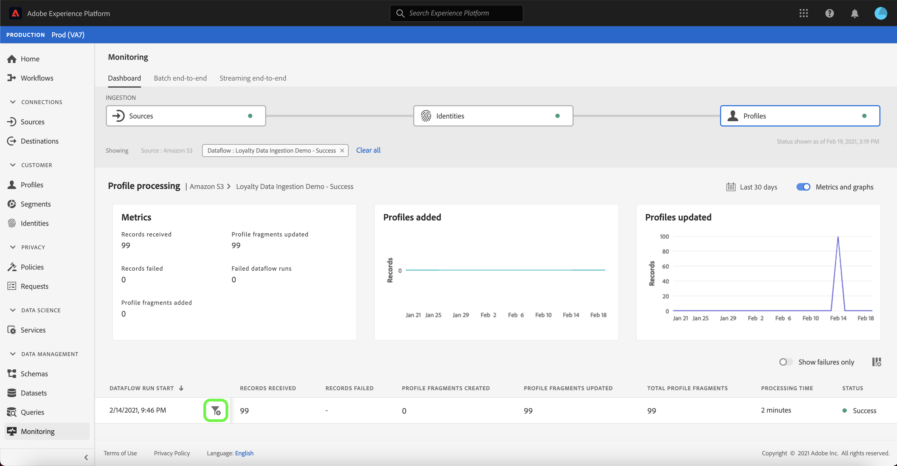
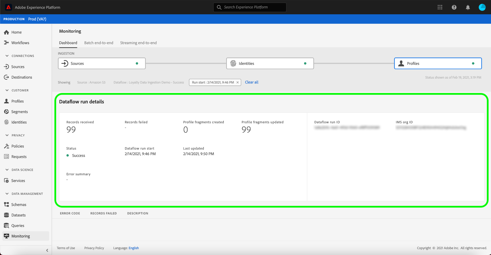

# Überwachen von Datenflüssen auf Quellen in der Benutzeroberfläche

>[!IMPORTANT]
>
>Streaming-Quellen, z. B. die [HTTP-API-Quelle](../../sources/connectors/streaming/http.md) werden derzeit nicht vom Monitoring-Dashboard unterstützt. Derzeit können Sie das Dashboard nur zur Überwachung der Batch-Quellen verwenden.

In Adobe Experience Platform werden Daten aus zahlreichen Quellen aufgenommen, analysiert und für eine Vielzahl an Zielen aktiviert. Plattform erleichtert das Tracking dieses potenziell nicht-linearen Datenflusses durch Transparenz.

Das Monitoring-Dashboard bietet eine visuelle Darstellung des Journey eines Datenflusses. Sie können eine aggregierte Überwachungsansicht verwenden und von der Quellebene zu einem Datenfluss und einem Datenfluss vertikal navigieren, sodass Sie die entsprechenden Metriken anzeigen können, die zum Erfolg oder Misserfolg eines Datenflusses beitragen. Sie können auch die dienstübergreifende Überwachungskapazität des Monitoring-Dashboards verwenden, um die Journey eines Datenflusses von einer Quelle aus zu überwachen. [!DNL Identity Service]und [!DNL Profile].

In diesem Tutorial werden Schritte zur Überwachung Ihres Datenflusses beschrieben, wobei sowohl eine aggregierte Überwachungsansicht als auch eine dienstübergreifende Überwachung verwendet werden.

## Erste Schritte {#getting-started}

Dieses Tutorial setzt ein Grundverständnis der folgenden Komponenten von Adobe Experience Platform voraus:

* [Datenflüsse](../home.md): Datenflüsse sind eine Darstellung von Datenvorgängen, die Daten über Platform verschieben. Datenflüsse werden über verschiedene Dienste hinweg konfiguriert und helfen beim Verschieben von Daten aus Quell-Connectoren in Zieldatensätze, in [!DNL Identity] und [!DNL Profile] sowie in [!DNL Destinations].
   * [Datenfluss-Abläufe](../../sources/notifications.md): Datenfluss-Ausführungen sind die wiederkehrenden geplanten Aufträge, die auf der Frequenzkonfiguration ausgewählter Datenflüsse basieren.
* [Quellen](../../sources/home.md): Experience Platform ermöglicht die Erfassung von Daten aus verschiedenen Quellen und bietet Ihnen gleichzeitig die Möglichkeit, eingehende Daten mithilfe von Platform-Diensten zu strukturieren, zu beschriften und zu erweitern.
* [Identity Service](../../identity-service/home.md): Sorgt für eine bessere Darstellung einzelner Kunden und deren Verhalten, indem Identitäten zwischen Geräten und Systemen überbrückt werden.
* [Echtzeit-Kundenprofil](../../profile/home.md): Bietet ein einheitliches Echtzeit-Kundenprofil, das auf aggregierten Daten aus verschiedenen Quellen basiert.
* [Sandboxes](../../sandboxes/home.md): Experience Platform bietet virtuelle Sandboxes, die eine einzelne Platform-Instanz in separate virtuelle Umgebungen unterteilen, damit Sie Anwendungen für digitale Erlebnisse entwickeln und weiterentwickeln können.

## Aggregierte Monitoring-Ansicht {#aggregated-monitoring-view}

>[!CONTEXTUALHELP]
>id="platform_monitoring_source_ingestion"
>title="Quellaufnahme"
>abstract="Die Ansicht Quellaufnahme enthält Informationen zum Status der Datenaktivität und zu Metriken im Data Lake-Dienst, einschließlich aufgenommenen Datensätzen und fehlgeschlagenen Datensätzen. Weitere Informationen zu Metriken und Diagrammen finden Sie im Handbuch zur Metrikdefinition ."
>text="Learn more in documentation"

>[!CONTEXTUALHELP]
>id="platform_monitoring_dataflow_run_details_ingestion"
>title="Datenfluss-Ausführungsdetails"
>abstract="Die Quellverarbeitung enthält Informationen zum Status der Datenaktivität und zu Metriken im Data Lake-Dienst, einschließlich aufgenommenen Datensätzen und fehlgeschlagenen Datensätzen. Weitere Informationen zu Metriken und Diagrammen finden Sie im Handbuch zur Metrikdefinition ."
>text="Learn more in documentation"

Im [Platform-Benutzeroberfläche](https://platform.adobe.com)auswählen **[!UICONTROL Überwachung]** über die linke Navigationsleiste auf [!UICONTROL Überwachung] Dashboard. Die [!UICONTROL Überwachung] Das Dashboard enthält Metriken und Informationen zu allen Datenflüssen von Quellen, einschließlich Einblicken in den Zustand des Daten-Traffics von einer Quelle zu [!DNL Identity Service]und [!DNL Profile].

Im Mittelpunkt des Dashboards steht die [!UICONTROL Quellaufnahme] -Bereich, der Metriken und Diagramme enthält, die Daten zu erfassten Datensätzen und fehlgeschlagenen Datensätzen anzeigen.

Standardmäßig enthalten die angezeigten Daten die Aufnahmeraten der letzten 24 Stunden. Auswählen **[!UICONTROL Letzte 24 Stunden]** , um den Zeitrahmen der angezeigten Datensätze anzupassen.

Es wird ein Kalender-Popup-Fenster mit Optionen für alternative Erfassungszeitrahmen angezeigt. Auswählen **[!UICONTROL Letzte 30 Tage]** und wählen Sie **[!UICONTROL Anwenden]**

Die Diagramme sind standardmäßig aktiviert und Sie können sie deaktivieren, um die Liste der unten aufgeführten Quellen zu erweitern. Wählen Sie die **[!UICONTROL Metriken und Diagramme]** Umschalten, um die Diagramme zu deaktivieren.

| Quellaufnahme | Beschreibung |
| ---------------- | ----------- |
| [!UICONTROL Aufgenommene Datensätze ] | Die Gesamtzahl der erfassten Datensätze. |
| [!UICONTROL Fehlgeschlagene Datensätze] | Die Gesamtzahl der Datensätze, die aufgrund von Fehlern in den Daten nicht erfasst wurden. |
| [!UICONTROL Gesamtzahl fehlgeschlagener Datenflüsse] | Die Gesamtzahl der Datenflüsse mit einer `failed` Status. |

In der Liste der Quellerfassung werden alle Quellen angezeigt, die mindestens ein vorhandenes Konto enthalten. Die Liste enthält außerdem Informationen zur Erfassungsrate jeder Quelle, zur Anzahl fehlgeschlagener Datensätze und zur Gesamtzahl fehlgeschlagener Datenflüsse basierend auf dem von Ihnen angewendeten Zeitraum.

Um die Sortierung durch die Liste der Quellen vorzunehmen, wählen Sie **[!UICONTROL Meine Quellen]** und wählen Sie dann Ihre gewünschte Kategorie aus dem Dropdown-Menü aus. Um sich beispielsweise auf Cloud-Speicher zu konzentrieren, wählen Sie  **[!UICONTROL Cloud-Speicher]**

Um alle vorhandenen Datenflüsse aus allen Quellen anzuzeigen, wählen Sie **[!UICONTROL Datenflüsse]**.

Alternativ können Sie eine Quelle in die Suchleiste eingeben, um eine einzelne Quelle zu isolieren. Nachdem Sie die Quelle identifiziert haben, wählen Sie das Filtersymbol aus.  daneben, um eine Liste der aktiven Datenflüsse anzuzeigen.

Eine Liste der Datenflüsse wird angezeigt. Um die Liste einzuschränken und sich auf fehlgeschlagene Datenflüsse zu konzentrieren, wählen Sie **[!UICONTROL Nur Fehler anzeigen]**.

Suchen Sie den zu überwachenden Datenfluss und wählen Sie dann das Filtersymbol aus.  um weitere Informationen zum Ausführungsstatus anzuzeigen.

Auf der Seite &quot;Datenfluss-Ausführung&quot;werden Informationen zum Startdatum des Datenflusses, zur Datengröße, zum Status und zur Verarbeitungsdauer angezeigt. Filtersymbol auswählen  neben der Startzeit des Datenflusses, um die Ausführungsdetails des Datenflusses anzuzeigen.

Die [!UICONTROL Datenfluss-Ausführungsdetails] -Seite enthält Informationen zu den Metadaten des Datenflusses, zum Status der partiellen Erfassung und zur Fehlerzusammenfassung. Die Fehlerzusammenfassung enthält den spezifischen Fehler der obersten Ebene, der anzeigt, in welchem Schritt beim Aufnahmevorgang ein Fehler aufgetreten ist.

Scrollen Sie nach unten, um genauere Informationen zum aufgetretenen Fehler anzuzeigen.

Die [!UICONTROL Fehler bei Datenfluss-Ausführung] zeigt den spezifischen Fehler- und Fehlercode an, der zum Erfassungsfehler des Datenflusses führte. In diesem Szenario trat ein Fehler bei der Zuordnungsumwandlung auf, der dazu führte, dass 24 Datensätze fehlschlugen.

Auswählen **[!UICONTROL Dateien]** für weitere Informationen.

Die [!UICONTROL Dateien] enthält Informationen zum Namen und Pfad der Datei.

Um den Fehler detaillierter darzustellen, wählen Sie **[!UICONTROL Vorschau der Fehlerdiagnose]**.

Die [!UICONTROL Fehlerdiagnose - Vorschau] wird ein Fenster mit einer Vorschau von bis zu 100 Fehlern im Datenfluss angezeigt. Sie können **[!UICONTROL Download]** um einen curl -Befehl abzurufen, mit dem Sie dann die Fehlerdiagnose herunterladen können.

Wenn Sie fertig sind, wählen Sie **[!UICONTROL Schließen]**

Sie können das Breadcrumb-System oben in der Kopfzeile verwenden, um zurück zum [!UICONTROL Überwachung] Dashboard. Auswählen **[!UICONTROL Start ausführen: 14.02.2021, 21.47 Uhr]** , um zur vorherigen Seite zurückzukehren, und wählen Sie dann **[!UICONTROL Datenfluss: Demo zur Erfassung von Loyalitätsdaten - Fehlgeschlagen]** , um zur Dataflows-Seite zurückzukehren.

## Dienstübergreifende Überwachung {#cross-service-monitoring}

Der obere Teil des Dashboards enthält eine Darstellung des Aufnahmeflusses von der Quellebene bis [!DNL Identity Service]und [!DNL Profile]. Jede Zelle enthält eine Punktmarke, die das Vorhandensein von Fehlern anzeigt, die in dieser Aufnahmephase aufgetreten sind. Ein grüner Punkt bedeutet eine fehlerfreie Aufnahme, während ein roter Punkt bedeutet, dass in dieser bestimmten Aufnahmephase ein Fehler aufgetreten ist.

Suchen Sie auf der Seite &quot;Datenflüsse&quot;einen erfolgreichen Datenfluss und wählen Sie das Filtersymbol aus.  daneben, um die Ausführungsinformationen des Datenflusses anzuzeigen.

Die [!UICONTROL Quellaufnahme] -Seite enthält Informationen, die die erfolgreiche Erfassung Ihres Datenflusses bestätigen. Von hier aus können Sie die Überwachung der Journey Ihres Datenflusses von der Quellebene bis [!DNL Identity Service]und dann [!DNL Profile].

Auswählen **[!UICONTROL Identitäten]** , um die Aufnahme in der [!UICONTROL Identitäten] Bühne.

### [!DNL Identity] Metriken {#identity-metrics}

>[!CONTEXTUALHELP]
>id="platform_monitoring_identity_processing"
>title="Identitätsverarbeitung"
>abstract="Die Ansicht zur Identitätsverarbeitung enthält Informationen zu den Datensätzen, die für den Identity-Dienst erfasst werden, einschließlich der Anzahl der hinzugefügten Identitäten, der erstellten Diagramme und der aktualisierten Diagramme. Weitere Informationen zu Metriken und Diagrammen finden Sie im Handbuch zur Metrikdefinition ."
>text="Learn more in documentation"

>[!CONTEXTUALHELP]
>id="platform_monitoring_dataflow_run_details_identity"
>title="Datenfluss-Ausführungsdetails"
>abstract="Auf der Seite mit den Ausführungsdetails des Datenflusses werden weitere Informationen zu Ihrem Identity-Datenfluss-Lauf angezeigt, einschließlich der IMS-Organisations-ID und der Kennung des Datenflusses."

Die [!UICONTROL Identitätsverarbeitung] Seite enthält Informationen zu Datensätzen, die in [!DNL Identity Service], einschließlich der Anzahl hinzugefügter Identitäten, erstellter Diagramme und aktualisierter Diagramme.

Filtersymbol auswählen  neben der Startzeit des Datenflusses, um weitere Informationen zu Ihrer [!DNL Identity] dataflow ausführen.

| Identitätsmetriken | Beschreibung |
| ---------------- | ----------- |
| [!UICONTROL Erhaltene Aufzeichnungen] | Anzahl der von [!DNL Data Lake]. |
| [!UICONTROL Fehlgeschlagene Datensätze] | Die Anzahl der Datensätze, die aufgrund von Fehlern in den Daten nicht in Platform erfasst wurden. |
| [!UICONTROL Übersprungene Datensätze] | Die Anzahl der Datensätze, die erfasst wurden, jedoch nicht in [!DNL Identity Service] weil in der Datensatzzeile nur eine Kennung vorhanden war. |
| [!UICONTROL Aufgenommene Datensätze] | Anzahl der erfassten Datensätze in [!DNL Identity Service]. |
| [!UICONTROL Datensätze insgesamt] | die Gesamtzahl aller Datensätze, einschließlich fehlgeschlagener Datensätze, übersprungener Datensätze, [!DNL Identities] hinzugefügt und duplizierte Datensätze. |
| [!UICONTROL Hinzugefügte Identitäten] | Die Anzahl neuer Kennungen, die zu [!DNL Identity Service]. |
| [!UICONTROL Erstellte Diagramme] | Die Anzahl neuer Identitätsdiagramme, die in erstellt wurden. [!DNL Identity Service]. |
| [!UICONTROL Diagramme aktualisiert] | Die Anzahl vorhandener Identitätsdiagramme, die mit neuen Edges aktualisiert wurden. |
| [!UICONTROL Fehlgeschlagene Datenfluss-Ausführungen] | Die Anzahl der fehlgeschlagenen Datenflüsse. |
| [!UICONTROL Verarbeitungszeit] | Der Zeitstempel vom Beginn der Aufnahme bis zum Abschluss. |
| [!UICONTROL Status] | Definiert den Gesamtstatus eines Datenflusses. Mögliche Statuswerte sind: <ul><li>`Success`: Gibt an, dass ein Datenfluss aktiv ist und Daten gemäß dem festgelegten Zeitplan erfasst.</li><li>`Failed`: Gibt an, dass der Aktivierungsprozess eines Datenflusses aufgrund von Fehlern unterbrochen wurde. </li><li>`Processing`: Gibt an, dass der Datenfluss noch nicht aktiv ist. Dieser Status tritt oft unmittelbar nach der Erstellung eines neuen Datenflusses auf.</li></ul> |

Die [!UICONTROL Datenfluss-Ausführungsdetails] Seite zeigt weitere Informationen zu Ihrer [!DNL Identity] dataflow-Ausführung, einschließlich der Kennung der IMS-Organisation und der Ausführungskennung des Datenflusses. Auf dieser Seite werden auch der entsprechende Fehlercode und die entsprechende Fehlermeldung angezeigt, die von [!DNL Identity Service], falls im Aufnahmeprozess Fehler auftreten sollten.

Auswählen **[!UICONTROL Start ausführen: 14.02.2021, 21.47 Uhr]** , um zur vorherigen Seite zurückzukehren.

Aus dem [!UICONTROL Identitätsverarbeitung] Seite, wählen Sie **[!UICONTROL Profile]** um den Status der Datensatzaufnahme im [!UICONTROL Profile] Bühne.

### [!DNL Profile] Metriken {#profile-metrics}

>[!CONTEXTUALHELP]
>id="platform_monitoring_profile_processing"
>title="Profilverarbeitung"
>abstract="Die Ansicht Profilverarbeitung enthält Informationen zu den Datensätzen, die für den Profil-Dienst erfasst werden, einschließlich der Anzahl der erstellten Profilfragmente, der aktualisierten Profilfragmente und der Gesamtzahl der Profilfragmente."
>text="Learn more in documentation"

>[!CONTEXTUALHELP]
>id="platform_monitoring_dataflow_run_details_profile"
>title="Datenfluss-Ausführungsdetails"
>abstract="Auf der Seite mit den Ausführungsdetails des Datenflusses werden weitere Informationen zu Ihrem Profil-Datenfluss angezeigt, einschließlich der IMS-Organisations-ID und der Kennung des Datenflusses."

Die [!UICONTROL Profilverarbeitung] Seite enthält Informationen zu Datensätzen, die in [!DNL Profile], einschließlich der Anzahl der erstellten Profilfragmente, der aktualisierten Profilfragmente und der Gesamtzahl der Profilfragmente.

Filtersymbol auswählen  neben der Startzeit des Datenflusses, um weitere Informationen zu Ihrer [!DNL Profile] dataflow ausführen.

| Profilmetriken | Beschreibung |
| --------------- | ----------- |
| [!UICONTROL Erhaltene Aufzeichnungen] | Anzahl der von [!DNL Data Lake]. |
| [!UICONTROL Fehlgeschlagene Datensätze ] | Die Anzahl der Datensätze, die erfasst wurden, jedoch nicht in [!DNL Profile] aufgrund von Fehlern. |
| [!UICONTROL Profilfragmente hinzugefügt] | Die Zahl der neuen Nettoempfänger [!DNL Profile] Fragmente hinzugefügt. |
| [!UICONTROL Profilfragmente aktualisiert] | Die Anzahl der vorhandenen [!DNL Profile] Fragmente aktualisiert |
| [!UICONTROL Profilfragmente insgesamt] | Die Gesamtzahl der in [!DNL Profile], einschließlich aller vorhandenen [!DNL Profile] Fragmente aktualisiert und neu [!DNL Profile] erstellte Fragmente. |
| [!UICONTROL Fehlgeschlagene Datenfluss-Ausführungen] | Die Anzahl der fehlgeschlagenen Datenflüsse. |
| [!UICONTROL Verarbeitungszeit] | Der Zeitstempel vom Beginn der Aufnahme bis zum Abschluss. |
| [!UICONTROL Status] | Definiert den Gesamtstatus eines Datenflusses. Mögliche Statuswerte sind: <ul><li>`Success`: Gibt an, dass ein Datenfluss aktiv ist und Daten gemäß dem festgelegten Zeitplan erfasst.</li><li>`Failed`: Gibt an, dass der Aktivierungsprozess eines Datenflusses aufgrund von Fehlern unterbrochen wurde. </li><li>`Processing`: Gibt an, dass der Datenfluss noch nicht aktiv ist. Dieser Status tritt oft unmittelbar nach der Erstellung eines neuen Datenflusses auf.</li></ul> |

Die [!UICONTROL Datenfluss-Ausführungsdetails] Seite zeigt weitere Informationen zu Ihrer [!DNL Profile] dataflow-Ausführung, einschließlich der Kennung der IMS-Organisation und der Ausführungskennung des Datenflusses. Auf dieser Seite werden auch der entsprechende Fehlercode und die entsprechende Fehlermeldung angezeigt, die von [!DNL Profile], falls im Aufnahmeprozess Fehler auftreten sollten.

## Nächste Schritte {#next-steps}

Durch Befolgen dieses Tutorials haben Sie den Datenfluss der Aufnahme erfolgreich von der Quellebene bis hin zu [!DNL Identity Service]und [!DNL Profile], wobei **[!UICONTROL Überwachung]** Dashboard. Sie haben auch erfolgreich Fehler identifiziert, die zum Fehlschlagen von Datenflüssen während des Aufnahmevorgangs beigetragen haben. Weitere Informationen finden Sie in den folgenden Dokumenten:

* [Übersicht über das Echtzeit-Kundenprofil](../../profile/home.md)
* [Data Science Workspace – Übersicht](../../data-science-workspace/home.md)
