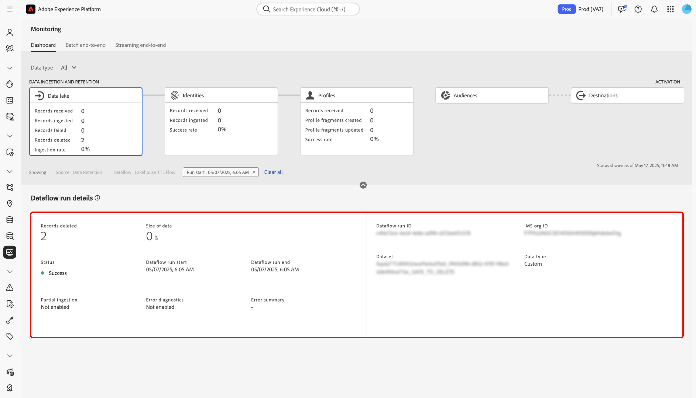

# Überwachen von Datenflüssen auf Quellen in der Benutzeroberfläche

In Adobe Experience Platform werden Daten aus einer Vielzahl von Quellen erfasst, innerhalb der Experience Platform analysiert und zu einer Vielzahl von Zielen aktiviert. Plattform erleichtert die Verfolgung dieses potenziell nicht-linearen Datenflusses durch Transparenz mit Datenflüssen.

Das Dashboard zur Überwachung bietet eine visuelle Darstellung der Journey eines Datenflusses. Sie können eine aggregierte Überwachungs-Ansicht verwenden und von der Quellebene zu einem Datendurchlauf und zu einem Datendurchlauf vertikal navigieren, sodass Sie die entsprechenden Metriken, die zum Erfolg oder Misserfolg eines Datenverlusts beitragen, Ansicht haben können. Sie können auch die dienstübergreifende Überwachungskapazität des überwachenden Dashboards verwenden, um die Journey eines Datenflusses von einer Quelle bis zu [!DNL Identity Service] und bis [!DNL Profile] zu überwachen.

In diesem Lernprogramm werden Schritte zur Überwachung Ihres Datenflusses beschrieben, wobei sowohl die aggregierte Ansicht der Überwachung als auch die dienstübergreifende Überwachung verwendet werden.

## Erste Schritte

Dieses Tutorial setzt ein Grundverständnis der folgenden Komponenten von Adobe Experience Platform voraus:

* [Datenflüsse](../home.md): Datenflüsse sind eine Darstellung von Datenaufträgen, die Daten über die Plattform verschieben. Datenflüsse werden über verschiedene Dienste konfiguriert und unterstützen Sie dabei, Daten von Quellschnittstellen zu Zielgruppen-Datensätzen, zu [!DNL Identity] und [!DNL Profile] und zu [!DNL Destinations] zu verschieben.
   * [Dataflow wird ausgeführt](../../sources/notifications.md): Dataflow-Ausführung sind die wiederkehrenden geplanten Aufträge, die auf der Frequenzkonfiguration der ausgewählten Datenflüsse basieren.
* [Quellen](../../sources/home.md): Experience Platform ermöglicht die Erfassung von Daten aus verschiedenen Quellen und bietet Ihnen gleichzeitig die Möglichkeit, eingehende Daten mithilfe von Plattformdiensten zu strukturieren, zu kennzeichnen und zu verbessern.
* [Identity Service](../../identity-service/home.md): Sorgt für eine bessere Darstellung einzelner Kunden und deren Verhalten, indem Identitäten zwischen Geräten und Systemen überbrückt werden.
* [Echtzeit-Kundenprofil](../../profile/home.md): Bietet ein einheitliches Echtzeit-Kundenprofil, das auf aggregierten Daten aus verschiedenen Quellen basiert.
* [Sandboxes](../../sandboxes/home.md): Experience Platform bietet virtuelle Sandboxes, die eine einzelne Platform-Instanz in separate virtuelle Umgebungen unterteilen, damit Sie Anwendungen für digitale Erlebnisse entwickeln und weiterentwickeln können.

## Aggregierte Ansicht der Überwachung

Wählen Sie in der [Platform UI](https://platform.adobe.com) in der linken Navigation **[!UICONTROL Monitoring]** aus, um auf das [!UICONTROL Monitoring]-Dashboard zuzugreifen. Das [!UICONTROL Monitoring]-Dashboard enthält Metriken und Informationen zu allen Datenströmen, einschließlich Einblicke in den Datenverkehr von einer Quelle zu [!DNL Identity Service] und zu [!DNL Profile].

Im Mittelpunkt des Dashboards steht das Bedienfeld [!UICONTROL Quellaufnahme], das Metriken und Diagramme enthält, die Daten zu erfassten Datensätzen und fehlgeschlagenen Datensätzen anzeigen.

Standardmäßig enthalten die angezeigten Daten die Erfassungsraten der letzten 24 Stunden. Wählen Sie **[!UICONTROL Letzte 24 Stunden]**, um den Zeitrahmen der angezeigten Datensätze anzupassen.

Ein Kalenderpopup-Fenster wird angezeigt, in dem Sie Optionen für alternative Einstiegszeitrahmen finden. Wählen Sie **[!UICONTROL Letzte 30 Tage]** und dann **[!UICONTROL Anwenden]**

Die Diagramme sind standardmäßig aktiviert und Sie können sie deaktivieren, um die Liste der unten aufgeführten Quellen zu erweitern. Aktivieren Sie die Umschalttaste **[!UICONTROL Metrisch und Graphen]**, um die Graphen zu deaktivieren.

| Quellaufnahme | Beschreibung |
| ---------------- | ----------- |
| [!UICONTROL Aufgenommene Datensätze  ] | Die Gesamtzahl der erfassten Datensätze. |
| [!UICONTROL Datensätze fehlgeschlagen] | Die Gesamtzahl der Datensätze, die nicht aufgrund von Fehlern in den Daten erfasst wurden. |
| [!UICONTROL Insgesamt fehlgeschlagene Datenflüsse] | Die Gesamtzahl der Datenflüsse mit einem `failed`-Status. |

Die Quellaufnahmenliste zeigt alle Quellen an, die mindestens ein vorhandenes Konto enthalten. Die Liste enthält auch Informationen zur Aufnahmerate jeder Quelle, zur Anzahl fehlgeschlagener Datensätze und zur Gesamtzahl fehlgeschlagener Datenflüsse basierend auf dem von Ihnen angewendeten Zeitrahmen.

Um durch die Liste der Quellen zu sortieren, wählen Sie **[!UICONTROL Meine Quellen]** aus und wählen Sie dann im Dropdown-Menü die gewünschte Kategorie aus. Um sich beispielsweise auf Cloud-Speicher zu konzentrieren, wählen Sie **[!UICONTROL Cloud-Speicher]**

Um alle vorhandenen Datenflüsse über alle Quellen hinweg anzuzeigen, wählen Sie **[!UICONTROL Datenflüsse]**.

Alternativ können Sie eine Quelle in die Suchleiste eingeben, um eine einzelne Quelle zu isolieren. Nachdem Sie Ihre Quelle identifiziert haben, wählen Sie das Filtersymbol  daneben, um eine Liste der aktiven Datenflüsse anzuzeigen.

Eine Liste der Datenflüsse wird angezeigt. Um die Liste einzuschränken und sich auf Datenflüsse mit Fehlern zu konzentrieren, wählen Sie **[!UICONTROL Nur Fehler anzeigen]**.

Suchen Sie den Datenfleck, den Sie überwachen möchten, und wählen Sie dann das Filtersymbol  daneben, um weitere Informationen zum Laufstatus anzuzeigen.

Auf der Seite &quot;Datenfluss&quot;werden Informationen zum Startdatum des Datenflusses, zur Datengröße, zum Status sowie zur Verarbeitungszeit angezeigt. Wählen Sie das Filtersymbol  neben der Startzeit des Datenflusses, um die Details des Datenflusses anzuzeigen.

Die Seite [!UICONTROL Datenaflow-Ausführdetails] zeigt Informationen zu den Metadaten des Datenflusses, zum teilweisen Erfassungsstatus und zur Fehlerzusammenfassung an. Die Fehlerzusammenfassung enthält den spezifischen Fehler der obersten Ebene, der anzeigt, in welchem Schritt beim Import ein Fehler aufgetreten ist.

Scrollen Sie nach unten, um genauere Informationen zum Fehler zu erhalten.

Das Fenster [!UICONTROL Datenaflow-Ausführungsfehler] zeigt den spezifischen Fehler- und Fehlercode an, der zu einem Importfehler des Datenflusses geführt hat. In diesem Szenario trat ein Fehler bei der Zuordnertransformation auf, der zum Ausfall von 24 Datensätzen führte.

Wählen Sie **[!UICONTROL Dateien]**, um weitere Informationen zu erhalten.

Das Bedienfeld [!UICONTROL Dateien] enthält Informationen zum Dateinamen und -pfad.

Um den Fehler detaillierter darzustellen, wählen Sie **[!UICONTROL Fehlerdiagnose in der Vorschau anzeigen]**.

Das Fenster [!UICONTROL Fehlerdiagnose-Vorschau] wird angezeigt und zeigt eine Vorschau von bis zu 100 Fehlern im Datenaflow an. Sie können **[!UICONTROL Download]** auswählen, um einen curl-Befehl abzurufen, mit dem Sie die Fehlerdiagnose herunterladen können.

Wenn Sie fertig sind, wählen Sie **[!UICONTROL Schließen]**

Sie können das Breadcrumb-System oben verwenden, um zum [!UICONTROL Monitoring]-Dashboard zurückzukehren. Wählen Sie **[!UICONTROL Start ausführen: 14.02.2021, 21:47 PM]**, um zur vorherigen Seite zurückzukehren, und wählen Sie dann **[!UICONTROL Datenfluss: Demo zur Einbindung von Treuhanddaten - fehlgeschlagen, um zur Dataflows-Seite zurückzukehren.]**

## Dienstübergreifende Überwachung

Der obere Teil des Dashboards enthält eine Darstellung des Erfassungsflusses von der Quellebene zu [!DNL Identity Service] und zu [!DNL Profile]. Jede Zelle enthält eine Punktmarke, die das Vorhandensein von Fehlern anzeigt, die in dieser Phase der Erfassung aufgetreten sind. Ein grüner Punkt bedeutet eine fehlerfreie Erfassung, während ein roter Punkt bedeutet, dass in dieser bestimmten Phase der Aufnahme ein Fehler aufgetreten ist.

Suchen Sie auf der Seite &quot;Datenflüsse&quot;einen erfolgreichen Datenaflow und wählen Sie das Filtersymbol  daneben aus, um die Informationen zum Datenaflow-Ausführen anzuzeigen.

Die Seite [!UICONTROL Quellaufnahme] enthält Informationen, die die erfolgreiche Erfassung Ihres Datenflusses bestätigen. Von hier aus können Sie die Reise Ihres Datenflusses von der Quellebene zu [!DNL Identity Service] und dann zu [!DNL Profile] überwachen.

Wählen Sie **[!UICONTROL Identitäten]**, um die Erfassung in der Bühne [!UICONTROL Identitäten] anzuzeigen.

### [!DNL Identity] Metriken

Die Seite [!UICONTROL Identity processing] enthält Informationen zu Datensätzen, die bei [!DNL Identity Service] erfasst werden, einschließlich der Anzahl hinzugefügter Identitäten, erstellter Diagramme und aktualisierter Diagramme.

Wählen Sie das Filtersymbol  neben der Dataflow-Laufzeit-Startzeit, um weitere Informationen zu Ihrem [!DNL Identity]-Datenaflow-Run anzuzeigen.

| Kennzahlen | Beschreibung |
| ---------------- | ----------- |
| [!UICONTROL Eingeschlossene Datensätze] | Die Anzahl der von [!DNL Data Lake] empfangenen Datensätze. |
| [!UICONTROL Datensätze fehlgeschlagen] | Die Anzahl der Datensätze, die aufgrund von Fehlern in den Daten nicht in die Plattform aufgenommen wurden. |
| [!UICONTROL Übersprungene Datensätze] | Die Anzahl der Datensätze, die erfasst wurden, aber nicht in [!DNL Identity Service], da es nur einen Bezeichner in der Datensatzzeile gab. |
| [!UICONTROL Aufgenommene Datensätze] | Die Anzahl der Datensätze, die in [!DNL Identity Service] erfasst werden. |
| [!UICONTROL Datensätze insgesamt] | Die Gesamtzahl aller Datensätze, einschließlich fehlgeschlagener Datensätze, übersprungener Datensätze, [!DNL Identities] hinzugefügter und duplizierter Datensätze. |
| [!UICONTROL Hinzugefügte Identitäten] | Die Anzahl der neuen Netto-Bezeichner, die [!DNL Identity Service] hinzugefügt wurden. |
| [!UICONTROL Erstellte Diagramme] | Die Anzahl der neuen Netto-Identitätsdiagramme, die in [!DNL Identity Service] erstellt wurden. |
| [!UICONTROL Aktualisierte Diagramme] | Die Anzahl der vorhandenen Identitätsdiagramme wurde durch neue Kanten aktualisiert. |
| [!UICONTROL Fehler beim Ausführen des Datenflusses] | Die Anzahl der ausgeführten Datenflüsse, die fehlgeschlagen sind. |
| [!UICONTROL Verarbeitungszeit] | Der Zeitstempel vom Beginn der Erfassung bis zum Abschluss. |
| [!UICONTROL Status] | Definiert den Gesamtstatus eines Datenflusses. Mögliche Statuswerte sind: <ul><li>`Success`: Gibt an, dass ein Datenaflow aktiv ist und Daten gemäß dem angegebenen Zeitplan erfasst.</li><li>`Failed`: Gibt an, dass der Aktivierungsprozess eines Datenflusses aufgrund von Fehlern unterbrochen wurde. </li><li>`Processing`: Gibt an, dass der Datenaflow noch nicht aktiv ist. Dieser Status tritt häufig unmittelbar nach dem Erstellen eines neuen Datenflusses auf.</li></ul> |

Auf der Seite [!UICONTROL Datenaflow-Ausführdetails] werden weitere Informationen zu Ihrem [!DNL Identity]-Datenaflow-Run angezeigt, einschließlich der IMS-Organisations-ID und der Datenaflow-Run-ID. Auf dieser Seite wird auch der entsprechende Fehlercode und die entsprechende Fehlermeldung angezeigt, die von [!DNL Identity Service] bereitgestellt werden, falls beim Import Fehler auftreten.

Wählen Sie **[!UICONTROL Start ausführen: 14.02.2021, 21:47 PM]**, um zur vorherigen Seite zurückzukehren.

Wählen Sie auf der Seite [!UICONTROL Identitätsverarbeitung] **[!UICONTROL Profile]** aus, um den Status der Datensatzerfassung in der Bühne [!UICONTROL Profile] anzuzeigen.

### [!DNL Profile] Metriken

Die Seite [!UICONTROL Profilverarbeitung] enthält Informationen zu Datensätzen, die bei [!DNL Profile] erfasst werden, einschließlich der Anzahl der erstellten Profilfragmente, der aktualisierten Profilfragmente und der Gesamtzahl der Profilfragmente.

Wählen Sie das Filtersymbol  neben der Dataflow-Laufzeit-Startzeit, um weitere Informationen zu Ihrem [!DNL Profile]-Datenaflow-Run anzuzeigen.

| Profilmetriken | Beschreibung |
| --------------- | ----------- |
| [!UICONTROL Eingeschlossene Datensätze] | Die Anzahl der von [!DNL Data Lake] empfangenen Datensätze. |
| [!UICONTROL Datensätze fehlgeschlagen  ] | Die Anzahl der Datensätze, die aufgrund von Fehlern erfasst wurden, jedoch nicht in [!DNL Profile]. |
| [!UICONTROL Profilfragmente hinzugefügt] | Die Anzahl der hinzugefügten Netto-Fragmente [!DNL Profile]. |
| [!UICONTROL Profilfragmente aktualisiert] | Die Anzahl der vorhandenen [!DNL Profile]-Fragmente wurde aktualisiert |
| [!UICONTROL Profilfragmente insgesamt] | Die Gesamtzahl der Datensätze, die in [!DNL Profile] geschrieben wurden, einschließlich aller vorhandenen [!DNL Profile]-Fragmente aktualisiert und neuer [!DNL Profile]-Fragmente erstellt. |
| [!UICONTROL Fehler beim Ausführen des Datenflusses] | Die Anzahl der ausgeführten Datenflüsse, die fehlgeschlagen sind. |
| [!UICONTROL Verarbeitungszeit] | Der Zeitstempel vom Beginn der Erfassung bis zum Abschluss. |
| [!UICONTROL Status] | Definiert den Gesamtstatus eines Datenflusses. Mögliche Statuswerte sind: <ul><li>`Success`: Gibt an, dass ein Datenaflow aktiv ist und Daten gemäß dem angegebenen Zeitplan erfasst.</li><li>`Failed`: Gibt an, dass der Aktivierungsprozess eines Datenflusses aufgrund von Fehlern unterbrochen wurde. </li><li>`Processing`: Gibt an, dass der Datenaflow noch nicht aktiv ist. Dieser Status tritt häufig unmittelbar nach dem Erstellen eines neuen Datenflusses auf.</li></ul> |

Auf der Seite [!UICONTROL Datenaflow-Ausführdetails] werden weitere Informationen zu Ihrem [!DNL Profile]-Datenaflow-Run angezeigt, einschließlich der IMS-Organisations-ID und der Datenaflow-Run-ID. Auf dieser Seite wird auch der entsprechende Fehlercode und die entsprechende Fehlermeldung angezeigt, die von [!DNL Profile] bereitgestellt werden, falls beim Import Fehler auftreten.

## Nächste Schritte

Durch Befolgen dieses Tutorials haben Sie den Importdataflow erfolgreich von der Quellebene zu [!DNL Identity Service] und [!DNL Profile] mithilfe des **[!UICONTROL Monitoring]**-Dashboards überwacht. Sie haben auch erfolgreich Fehler identifiziert, die während des Erfassungsvorgangs zum Fehlschlagen von Datenflüssen beigetragen haben. Weitere Informationen finden Sie in den folgenden Dokumenten:

* [Übersicht über das Echtzeit-Kundenprofil](../../profile/home.md)
* [Übersicht über den Data Science Workspace](../../data-science-workspace/home.md)
