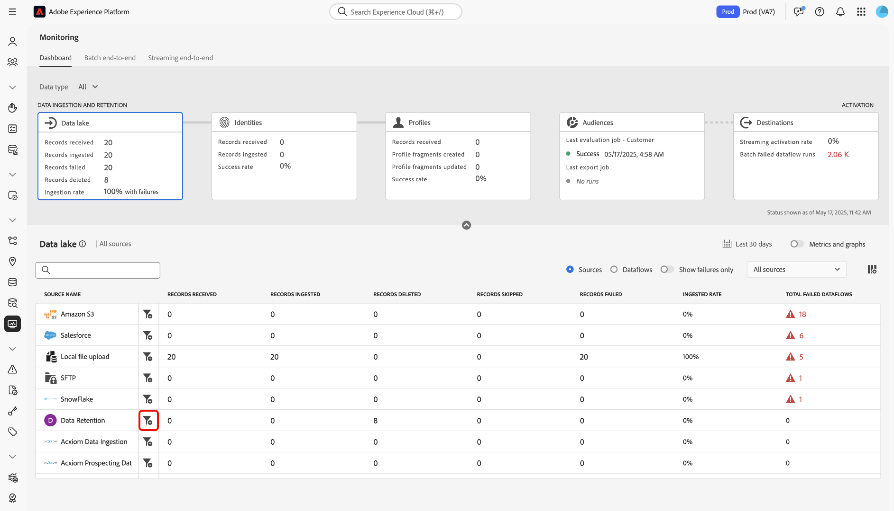

# Überwachen von Datenflüssen für Quellen in der Benutzeroberfläche

>[!IMPORTANT]
>
>Streaming-Quellen wie die [HTTP-API-Quelle](../../sources/connectors/streaming/http.md) werden derzeit nicht vom Überwachungs-Dashboard unterstützt. Derzeit können Sie das Dashboard nur zur Überwachung von Batch-Quellen verwenden.

Lesen Sie dieses Dokument, um zu erfahren, wie Sie mit dem Monitoring-Dashboard Ihre Quelldatenflüsse in der Experience Platform-Benutzeroberfläche überwachen können.

## Erste Schritte {#get-started}

Dieses Tutorial setzt ein Grundverständnis der folgenden Komponenten von Adobe Experience Platform voraus:

* [Datenflüsse](../home.md): Datenflüsse sind eine Darstellung von Datenvorgängen, die Daten über Experience Platform verschieben. Datenflüsse werden über verschiedene Dienste hinweg konfiguriert und helfen beim Verschieben von Daten aus Quell-Connectoren in Zieldatensätze, in [!DNL Identity] und [!DNL Profile] sowie in [!DNL Destinations].
   * [Datenflussausführungen](../../sources/notifications.md): Datenflussausführungen sind die wiederkehrenden geplanten Aufträge, die auf der Häufigkeitskonfiguration ausgewählter Datenflüsse basieren.
* [Quellen](../../sources/home.md): Experience Platform ermöglicht die Aufnahme von Daten aus verschiedenen Quellen und bietet Ihnen die Möglichkeit, die eingehenden Daten mithilfe von Experience Platform-Services zu strukturieren, zu kennzeichnen und anzureichern.
* [Identity Service](../../identity-service/home.md): Verschaffen Sie sich einen besseren Überblick über einzelne Kundinnen und Kunden und deren Verhalten, indem Sie Identitäten geräte- und systemübergreifend verknüpfen.
* [Echtzeit-Kundenprofil](../../profile/home.md): Bietet ein einheitliches Echtzeit-Kundenprofil, das auf aggregierten Daten aus verschiedenen Quellen basiert.
* [Sandboxes](../../sandboxes/home.md): Experience Platform bietet virtuelle Sandboxes, die eine einzelne Experience Platform-Instanz in separate virtuelle Umgebungen unterteilen, damit Sie Programme für digitale Erlebnisse besser entwickeln und weiterentwickeln können.

## Überwachen der Quelldaten mithilfe des Monitoring-Dashboards

>[!CONTEXTUALHELP]
>id="platform_monitoring_source_ingestion"
>title="Quellaufnahme"
>abstract="Die Quellaufnahmen-Ansicht enthält Informationen zum Status der Datenaktivität und zu Metriken im Data-Lake-Dienst, einschließlich der aufgenommenen und fehlgeschlagenen Datensätze. Weitere Informationen zu Metriken und Diagrammen finden Sie im Handbuch zur Metrikdefinition."
>text="Learn more in documentation"

>[!CONTEXTUALHELP]
>id="platform_monitoring_dataflow_run_details_ingestion"
>title="Details zur Datenflussausführung"
>abstract="Die Quellverarbeitung enthält Informationen zum Status der Datenaktivität und zu Metriken im Data-Lake-Dienst, einschließlich der aufgenommenen und fehlgeschlagenen Datensätze. Weitere Informationen zu Metriken und Diagrammen finden Sie im Handbuch zur Metrikdefinition."
>text="Learn more in documentation"

<!-- In the [Experience Platform UI](https://platform.adobe.com), select **[!UICONTROL Monitoring]** from the left navigation to access the [!UICONTROL Monitoring] dashboard. The [!UICONTROL Monitoring] dashboard contains metrics and information on all sources dataflows, including insights into the health of data traffic from a source to [!DNL Identity Service], and to [!DNL Profile].

At the center of the dashboard is the [!UICONTROL Source ingestion] panel, which contains metrics and graphs that display data on records ingested and records failed. -->

Wählen Sie im Monitoring-Dashboard [!UICONTROL Quellen] aus der Hauptkopfzeile aus, um Ihr Dashboard mit einer Anzeige der Datenfluss-Aufnahmerate Ihrer Quellen zu aktualisieren.

Das Diagramm [!UICONTROL Aufnahmerate] zeigt Ihre Datenaufnahmerate basierend auf Ihrem konfigurierten Zeitrahmen an. Standardmäßig zeigt das Überwachungs-Dashboard die Aufnahmerate der letzten 24 Stunden an. Anweisungen zum Konfigurieren Ihres Zeitrahmens finden Sie im Handbuch unter [Konfigurieren des Zeitrahmens für die Überwachung](monitor.md#configure-monitoring-time-frame).

Das Diagramm ist standardmäßig für die Anzeige aktiviert. Um das Diagramm auszublenden, wählen Sie **[!UICONTROL Metriken und Diagramme]** aus, um den Umschalter zu deaktivieren und das Diagramm auszublenden.

Im unteren Teil des Dashboards wird eine Tabelle angezeigt, die den aktuellen Metrikbericht für alle vorhandenen Datenflüsse der Quellen umreißt.

| Metriken | Beschreibung |
| --- | --- |
| Empfangene Einträge | Die Gesamtzahl der von einer bestimmten Quelle empfangenen Datensätze. |
| Aufgenommene Einträge | Die Gesamtzahl der in den Data Lake aufgenommenen Datensätze. |
| Übersprungene Einträge | Die Gesamtzahl der übersprungenen Datensätze. Ein übersprungener Datensatz bezieht sich auf Felder, die übersprungen wurden, weil sie für die Aufnahme nicht erforderlich waren. Wenn Sie beispielsweise einen Quelldatenfluss mit aktivierter partieller Aufnahme erstellen, können Sie einen akzeptablen Schwellenwert für die Fehlerrate konfigurieren. Während des Aufnahmevorgangs überspringt die Aufnahme Datensätze von Feldern, die nicht erforderlich sind, z. B. Identitätsfelder, solange sie sich innerhalb des Fehlerschwellenwerts befinden. |
| Fehlgeschlagene Einträge | Die Gesamtzahl der Datensätze, die aufgrund von Fehlern nicht aufgenommen werden konnten. |
| Aufgenommene Rate | Der Prozentsatz der aufgenommenen Datensätze auf der Basis der Gesamtzahl der empfangenen Datensätze. |
| Insgesamt fehlgeschlagene Datenflüsse | Die Gesamtzahl der fehlgeschlagenen Datenflüsse. |

{style="table-layout:auto"}

Sie können Ihre Daten mithilfe der Optionen weiter filtern, die oben in der Tabelle Metriken bereitgestellt werden:

| Filteroptionen | Beschreibung |
| --- | --- |
| Durchsuchen | Verwenden Sie die Suchleiste, um Ihre Ansicht nach einem einzelnen Quelltyp zu filtern. |
| Quellen | Wählen Sie **[!UICONTROL Quellen]** aus, um Ihre Ansicht zu filtern und Metrikdaten nach Quelltyp anzuzeigen. Dies ist die Standardanzeige, die vom Monitoring-Dashboard verwendet wird. |
| Datenflüsse | Wählen Sie **[!UICONTROL Datenflüsse]** aus, um Ihre Ansicht zu filtern und Metrikdaten pro Datenfluss anzuzeigen. |
| Nur Fehlschläge zeigen | Wählen Sie **[!UICONTROL Nur Fehler anzeigen]** aus, um Ihre Ansicht zu filtern und nur Datenflüsse anzuzeigen, die Aufnahmefehler gemeldet haben. |
| Meine Quellen | Sie können Ihre Ansicht mithilfe des Dropdown-Menüs [!UICONTROL Meine Quellen] weiter filtern. Verwenden Sie das Dropdown-Menü, um Ihre Ansicht nach Kategorie zu filtern. Alternativ können Sie auf **[!UICONTROL Alle Quellen]** klicken, um Metriken zu allen - oder -Quellen anzuzeigen, oder auf **[!UICONTROL Meine Quellen]** klicken, um nur die Quellen anzuzeigen, für die Sie über ein entsprechendes -Konto verfügen. |

{style="table-layout:auto"}

Um die Daten zu überwachen, die in einen bestimmten Datenfluss aufgenommen werden, wählen Sie das Filtersymbol ( einer Quelle aus.

Die Tabelle Metriken wird in eine Tabelle mit aktiven Datenflüssen aktualisiert, die der ausgewählten Quelle entsprechen. In diesem Schritt können Sie zusätzliche Informationen zu Ihren Datenflüssen anzeigen, einschließlich des entsprechenden Datensatzes und Datentyps sowie eines Zeitstempels, der angibt, wann sie zuletzt aktiv waren.

Um einen Datenfluss weiter zu untersuchen, wählen Sie das Filtersymbol ( einem Datenfluss aus.

Als Nächstes gelangen Sie zu einer Schnittstelle, die alle Iterationen der Datenflussausführung des ausgewählten Datenflusses auflistet.

Datenflussausführungen stellen eine Instanz der Datenflussausführung dar. Wenn ein Datenfluss beispielsweise so geplant ist, dass er stündlich um 9:00 Uhr, 10:00 Uhr und 11:00 Uhr ausgeführt wird, gibt es drei Instanzen eines Flussdurchgangs. Flussausführungen sind spezifisch für Ihre bestimmte Organisation.

Um Metriken einer bestimmten Iteration der Datenflussausführung zu überprüfen, wählen Sie das Filtersymbol  neben Ihrem Datenfluss aus.

Auf der Seite mit den Datenflussausführungs-Details können Sie Metriken und Informationen der ausgewählten Iteration anzeigen.

| Details zur Datenflussausführung | Beschreibung |
| --- | --- |
| Aufgenommene Einträge | Die Gesamtzahl der Datensätze, die aus der Datenflussausführung aufgenommen wurden. |
| Fehlgeschlagene Einträge | Die Gesamtzahl der Datensätze, die aufgrund von Fehlern in der Datenflussausführung nicht aufgenommen wurden. |
| Gesamtzahl der Dateien | Die Gesamtzahl der Dateien in der Datenflussausführung. |
| Datengröße | Die Gesamtgröße der in der Datenflussausführung enthaltenen Daten. |
| ID der Datenflussausführung | Die ID der Iteration der Datenflussausführung. |
| Organisations-ID | Die ID der Organisation, in der der Datenfluss erstellt wurde. |
| Status | Der Status der Datenflussausführung. |
| Anfang der Datenflussausführung | Ein Zeitstempel, der angibt, wann die Datenflussausführung gestartet wurde. |
| Ende der Datenflussausführung | Ein Zeitstempel, der angibt, wann die Datenflussausführung beendet wurde. |
| Datensatz | Der zum Erstellen des Datenflusses verwendete Datensatz. |
| Datentyp | Der Typ der Daten, die sich im Datenfluss befanden. |
| Teilweise Aufnahme | Die partielle Batch-Aufnahme bietet die Möglichkeit, Daten mit Fehlern bis zu einem bestimmten konfigurierbaren Schwellenwert aufzunehmen. Mit dieser Funktion können Sie alle Ihre korrekten Daten erfolgreich in Experience Platform aufnehmen, während alle Ihre falschen Daten separat mit Informationen darüber, warum sie ungültig sind, in Batches erfasst werden. Sie können die partielle Aufnahme während des Erstellungsprozesses eines Datenflusses aktivieren. |
| Fehlerdiagnose | Fehlerdiagnose weist die Quelle an, Fehlerdiagnosen zu erstellen, auf die Sie später bei der Überwachung Ihrer Datensatzaktivität und des Datenflussstatus verweisen können. Sie können die Fehlerdiagnose während des Erstellungsprozesses eines Datenflusses aktivieren. |
| Fehlerzusammenfassung | Bei einer fehlgeschlagenen Datenflussausführung zeigt die Fehlerzusammenfassung einen Fehlercode und eine Beschreibung an, um zusammenzufassen, warum die Iteration der Ausführung fehlgeschlagen ist. |

{style="table-layout:auto"}

Wenn bei der Datenflussausführung Fehler auftreten, können Sie über die Benutzeroberfläche „Datenflussausführungsfehler[!UICONTROL  einen Bildlauf nach unten ].

Verwenden Sie den Abschnitt [!UICONTROL Fehlgeschlagene Datensätze] um Metriken zu Datensätzen anzuzeigen, die aufgrund von Fehlern nicht aufgenommen wurden. Um einen umfassenden Fehlerbericht anzuzeigen, wählen Sie **[!UICONTROL Fehlerdiagnose in der Vorschau anzeigen]**. Um eine Kopie Ihrer Fehlerdiagnose und Ihres Dateimanifests herunterzuladen, wählen Sie **[!UICONTROL Herunterladen]** und kopieren Sie dann den Beispiel-API-Aufruf, der mit der [!DNL Data Access]-API verwendet werden soll.

>[!NOTE]
>
>Sie können die Fehlerdiagnose nur verwenden, wenn die Funktion während des Erstellungsprozesses der Quellverbindung aktiviert wurde.

## Nächste Schritte {#next-steps}

In diesem Tutorial haben Sie mithilfe des Dashboards **[!UICONTROL Überwachung“ den Datenfluss der Aufnahme von der]** aus überwacht. Sie haben auch erfolgreich Fehler identifiziert, die zum Scheitern von Datenflüssen während des Aufnahmevorgangs beigetragen haben. Weiterführende Informationen finden Sie in folgenden Dokumenten:

* [Identitätsdaten überwachen](./monitor-identities.md).
* [Überwachen von ](./monitor-profiles.md).
