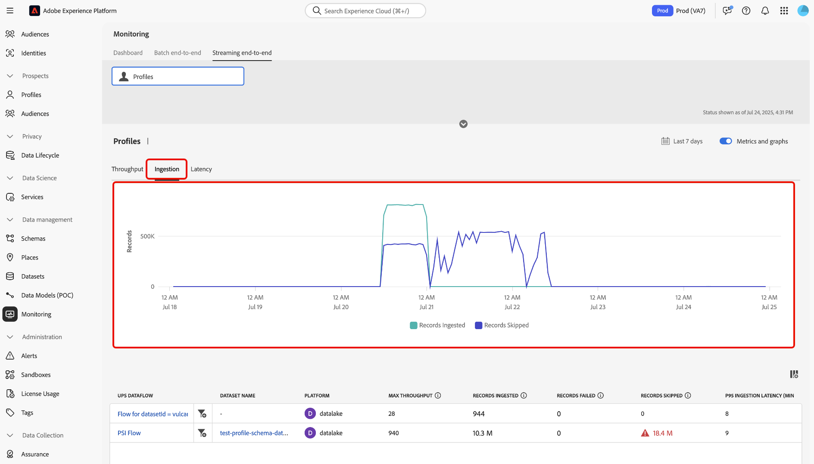

# Überwachen der Aufnahme von Streaming-Profilen

Sie können das Überwachungs-Dashboard in der Adobe Experience Platform-Benutzeroberfläche verwenden, um die Aufnahme von Streaming-Profilen in Echtzeit in Ihrem Unternehmen zu überwachen. Verwenden Sie diese Funktion, um auf eine größere Transparenz in Durchsatz- und Datenqualitätsmetriken im Zusammenhang mit Ihren Streaming-Daten zuzugreifen. Verwenden Sie diese Funktion außerdem für proaktive Warnhinweise und den Abruf umsetzbarer Einblicke, um potenzielle Kapazitätsverletzungen und Probleme bei der Datenaufnahme zu identifizieren.

Lesen Sie das folgende Handbuch, um zu erfahren, wie Sie mit dem Monitoring-Dashboard Raten und Metriken für Streaming-Profilaufnahmevorgänge in Ihrer Organisation verfolgen können.

## Erste Schritte

Dieses Handbuch setzt ein Verständnis der folgenden Komponenten von Experience Platform voraus:

* [Datenflüsse](../home.md): Datenflüsse stellen Datenaufträge dar, die Informationen über Experience Platform übertragen. Sie werden in verschiedenen -Services konfiguriert, um das Verschieben von Daten von Quell-Connectoren in Zieldatensätze sowie zu Identity Service, Echtzeit-Kundenprofil und Zielen zu erleichtern.
* [Echtzeit-Kundenprofil](../../profile/home.md): Das Echtzeit-Kundenprofil kombiniert Daten aus verschiedenen Quellen - Online-, Offline-, CRM- und Drittanbieter-Daten - in einer zentralen, verwertbaren Ansicht jedes Kunden, was konsistente und personalisierte Erlebnisse über alle Kontaktpunkte hinweg ermöglicht.
* [Streaming-Aufnahme](../../ingestion/streaming-ingestion/overview.md): Die Streaming-Aufnahme für Experience Platform bietet Benutzenden eine Methode, um Daten von Client- und Server-seitigen Geräten in Echtzeit an Experience Platform zu senden. Mit Experience Platform können Sie koordinierte, konsistente und relevante Erlebnisse bereitstellen, indem Sie ein Echtzeit-Kundenprofil für jeden einzelnen Ihrer Kunden generieren. .
* [Kapazitäten](../../landing/license-usage-and-guardrails/capacity.md): In Experience Platform teilen Ihnen die Kapazitäten mit, ob Ihr Unternehmen eine Ihrer Leitplanken überschritten hat, und erhalten Informationen zur Behebung dieser Probleme.

>[!NOTE]
>
>Die Streaming-Durchsatzkapazität unterstützt bis zu 1500 eingehende Ereignisse pro Sekunde. Sie können zusätzliche Streaming-Segmentierung erwerben, um bis zu maximal 13.500 zusätzliche eingehende Ereignisse pro Sekunde zu &#x200B;. Weitere Informationen finden Sie in den Produktbeschreibungen zu den Paketen [Real-Time CDP B2C Edition - Prime und Ultimate](https://helpx.adobe.com/de/legal/product-descriptions/real-time-customer-data-platform-b2c-edition-prime-and-ultimate-packages.html).

## Überwachen von Metriken für die Aufnahme von Streaming-Profilen {#streaming-profile-metrics}

>[!CONTEXTUALHELP]
>id="platform_monitoring_streaming_profile"
>title="Überwachen der Aufnahme von Streaming-Profilen"
>abstract="Das Monitoring-Dashboard für Streaming-Profile zeigt Informationen über den Durchsatz und die Aufnahmeraten an. Verwenden Sie dieses Dashboard, um die Datenverarbeitungsmetriken anzuzeigen, zu verstehen und zu analysieren. Ihrer Streaming-Profile in Experience Platform."
>text="Learn more in documentation"

>[!CONTEXTUALHELP]
>id="platform_monitoring_streaming_profile_request_throughput"
>title="Anfragedurchsatz"
>abstract="Diese Metrik stellt die Anzahl der in das Aufnahmesystem eingehenden Ereignisse pro Sekunde dar."
>text="Learn more in documentation"

>[!CONTEXTUALHELP]
>id="platform_monitoring_streaming_profile_processing_throughput"
>title="Verarbeitungsdurchsatz"
>abstract="Diese Metrik stellt die Anzahl der erfolgreich vom System aufgenommenen Ereignisse pro Sekunde dar."
>text="Learn more in documentation"

>[!CONTEXTUALHELP]
>id="platform_monitoring_streaming_profile_p95_ingestion_latency"
>title="P95-Aufnahmelatenz"
>abstract="Diese Metrik misst die Latenz im 95. Perzentil von dem Zeitpunkt an, an dem ein Ereignis in Experience Platform eintrifft, bis zu dem Zeitpunkt, an dem es erfolgreich in den Profilspeicher aufgenommen wird."
>text="Learn more in documentation"

>[!CONTEXTUALHELP]
>id="platform_monitoring_streaming_profile_max_throughput"
>title="Maximaler Durchsatz"
>abstract="Diese Metrik stellt die maximale Anzahl der eingehenden Ereignisse pro Sekunde dar, die in die Streaming-Profile aufgenommen werden."
>text="Learn more in documentation"

>[!CONTEXTUALHELP]
>id="platform_monitoring_streaming_profile_records_ingested"
>title="Aufgenommene Einträge"
>abstract="Diese Metrik stellt die Gesamtanzahl der Einträge dar, die innerhalb eines konfigurierten Zeitfensters in den Profilspeicher aufgenommen werden."
>text="Learn more in documentation"

>[!CONTEXTUALHELP]
>id="platform_monitoring_streaming_profile_records_failed"
>title="Fehlgeschlagene Einträge"
>abstract="Diese Metrik stellt die Gesamtanzahl der Einträge dar, die innerhalb eines konfigurierten Zeitfensters aufgrund von Fehlern nicht in den Profilspeicher aufgenommen wurden."
>text="Learn more in documentation"

>[!CONTEXTUALHELP]
>id="platform_monitoring_streaming_profile_records_skipped"
>title="Übersprungene Einträge"
>abstract="Diese Metrik stellt die Gesamtanzahl der Einträge dar, die innerhalb eines konfigurierten Zeitfensters aufgrund von Konfigurations- oder Kapazitätsverstößen verworfen wurden."
>text="Learn more in documentation"

>[!CONTEXTUALHELP]
>id="platform_monitoring_streaming_profile_error_details"
>title="Fehlerdetails"
>abstract="Diese Metrik stellt die Anzahl der aufgrund von Fehlern fehlgeschlagenen Ereignisse dar."
>text="Learn more in documentation"

Verwenden Sie die Tabelle Metriken für spezifische Informationen zu Ihren Datenflüssen. Einzelheiten zu den einzelnen Spalten finden Sie in der folgenden Tabelle.

| Metrik | Beschreibung | Dimensionen | Messhäufigkeit |
| --- | --- | --- | --- |
| Anfragedurchsatz | Diese Metrik stellt die Anzahl der in das Aufnahmesystem eingehenden Ereignisse pro Sekunde dar. | Sandbox/Datenfluss | Echtzeitüberwachung mit einer Datenaktualisierung alle 60 Sekunden. |
| Verarbeitungsdurchsatz | Diese Metrik stellt die Anzahl der erfolgreich vom System aufgenommenen Ereignisse pro Sekunde dar. | Sandbox/Datenfluss | Echtzeitüberwachung mit einer Datenaktualisierung alle 60 Sekunden. |
| Maximaler Durchsatz | Diese Metrik stellt die maximale Anzahl eingehender Anfragen pro Sekunde dar, die in die Streaming-Profilaufnahme eintreten | <ul><li>Sandbox/Datenfluss</li><li>Datenflussausführung</li></ul> |  |
| Aufgenommene Einträge | Diese Metrik stellt die Gesamtanzahl der Einträge dar, die innerhalb eines konfigurierten Zeitfensters in den Profilspeicher aufgenommen werden. | <ul><li>Sandbox/Datenfluss</li><li>Datenflussausführung</li></ul> | <ul><li>Sandbox/Datenfluss: Echtzeit-Überwachung mit einer Datenaktualisierung alle 60 Sekunden.</li><li>Datenflussausführung: in 15 Minuten gruppiert.</li></ul> |
| Fehlgeschlagene Einträge | Diese Metrik stellt die Gesamtanzahl der Einträge dar, die innerhalb eines konfigurierten Zeitfensters aufgrund von Fehlern nicht in den Profilspeicher aufgenommen wurden. | <ul><li>Sandbox/Datenfluss</li><li>Datenflussausführung</li></ul> | <ul><li>Sandbox/Datenfluss: Echtzeit-Überwachung mit einer Datenaktualisierung alle 60 Sekunden.</li><li>Datenflussausführung: in 15 Minuten gruppiert.</li></ul> |
| Übersprungene Einträge | Diese Metrik stellt die Gesamtanzahl der Einträge dar, die innerhalb eines konfigurierten Zeitfensters aufgrund von Konfigurations- oder Kapazitätsverstößen verworfen wurden. | <ul><li>Sandbox/Datenfluss</li><li>Datenflussausführung</li></ul> | <ul><li>Sandbox/Datenfluss: Echtzeit-Überwachung mit einer Datenaktualisierung alle 60 Sekunden.</li><li>Datenflussausführung: in 15 Minuten gruppiert.</li></ul> |
| Fehlerdetails | Diese Metrik stellt die Anzahl der aufgrund von Fehlern fehlgeschlagenen Ereignisse dar. | Datenflussausführung | In einem stündlichen Fenster gruppiert. |

{style="table-layout:auto"}

## Verwenden des Überwachungs-Dashboards für die Aufnahme von Streaming-Profilen

Um auf das Überwachungs-Dashboard für die Aufnahme von Streaming-Profilen zuzugreifen, gehen Sie zur Benutzeroberfläche von Experience Platform, wählen Sie **[!UICONTROL Monitoring]** in der linken Navigationsleiste aus und klicken Sie dann auf **[!UICONTROL Streaming end-to-end]**.

Die Karte mit den *[!UICONTROL Profile]* Metriken finden Sie in der oberen Kopfzeile des Dashboards. In dieser Anzeige können Sie Informationen zu den aufgenommenen, fehlgeschlagenen und übersprungenen Datensätzen sowie Informationen zum aktuellen Status des Anfragedurchsatzes anzeigen.

Verwenden Sie als Nächstes die -Benutzeroberfläche, um detaillierte Informationen zu Ihren Metriken zur Aufnahme von Streaming-Profilen anzuzeigen. Verwenden Sie die Kalenderfunktion, um zwischen verschiedenen Zeitrahmen umzuschalten. Sie können aus den folgenden vorkonfigurierten Zeitfenstern auswählen:

* [!UICONTROL Last 6 hours]
* [!UICONTROL Last 12 hours]
* [!UICONTROL Last 24 hours]
* [!UICONTROL Last 7 days]
* [!UICONTROL Last 30 days]

Alternativ können Sie Ihren eigenen Zeitrahmen manuell mithilfe des Kalenders konfigurieren.

Im Monitoring-Dashboard können Sie zwei verschiedene Metrikkategorien für die Streaming-Profilaufnahme verwenden: [!UICONTROL Throughput] und [!UICONTROL Ingestion].

>[!BEGINTABS]

>[!TAB Durchsatz]

Wählen Sie **[!UICONTROL Throughput]** aus, um Informationen zur Datenmenge anzuzeigen, die Experience Platform in einem konfigurierten Zeitraum verarbeitet. Beziehen Sie sich auf diese Metrik, um die Effizienz und Kapazität Ihres Systems zu bewerten.

* **[Kapazität](../../landing/license-usage-and-guardrails/capacity.md)**: Die maximale Datenmenge, die Ihre Sandbox unter definierten Bedingungen verarbeiten kann.
* **Anfragedurchsatz**: Die Rate, mit der Ereignisse vom Aufnahmesystem empfangen werden, gemessen in Ereignissen pro Sekunde.
* **Verarbeitungsdurchsatz**: Die Rate, mit der das System eingehende Ereignis-Payloads erfolgreich aufnimmt und verarbeitet, gemessen in Ereignissen pro Sekunde.

>[!TAB Aufnahme]

**Aufnahme**: Wählen Sie **[!UICONTROL Ingestion]** aus, um Informationen zu den Aufnahmevorgängen in Ihrer Sandbox anzuzeigen. Diese Aufnahmevorgänge werden in drei verschiedenen Metriken gemessen.

* **Aufgenommene Datensätze**: Die Gesamtzahl der in einem bestimmten Zeitraum erstellten Datensätze. Diese Metrik stellt erfolgreiche Datenaufnahmeprozesse in Ihrer Sandbox dar.
* **Übersprungene Datensätze**: Die Gesamtzahl der Datensätze, die aufgrund von Fehlern nicht aufgenommen wurden.
* **Übersprungene Datensätze**: Die Gesamtzahl der Datensätze, die aufgrund von Verstößen gegen Kapazitätsbeschränkungen gelöscht wurden.

>[!ENDTABS]

### Verwenden der Tabelle Datenflussmetriken

In der Datenfluss-Tabelle sind alle Streaming-Aufnahme-Aktivitäten mit den entsprechenden Metriken für das Echtzeit-Kundenprofil aufgeführt. Jeder Datenfluss wird mit dem zugehörigen Datensatz aufgelistet.

Wenn Sie sich den Beschränkungen der Kapazität auf Sandbox-Ebene nähern, können Sie in der Spalte [!UICONTROL Max throughput] alle vorhandenen Datenflüsse identifizieren, die zu Ihren Verbrauchsraten beitragen. Weitere Informationen zu Best [ für die Datenflussverwaltung finden ](#best-practices) im Abschnitt „Best Practices“.

Um die Daten zu überwachen, die in einen bestimmten Datenfluss aufgenommen werden, wählen Sie das Filtersymbol  neben dem Datenflussnamen aus.

Verwenden Sie als Nächstes die Schnittstelle Datenflussmetriken , um die spezifische Flussausführung auszuwählen, die Sie überprüfen möchten. Wählen Sie das Filtersymbol  neben einer Flusslaufiteration aus, um die Metriken anzuzeigen, die für die ausgewählte Flussausführung spezifisch sind.

Datenflussausführungen stellen eine Instanz der Datenflussausführung dar. Wenn ein Datenfluss beispielsweise so geplant ist, dass er stündlich um 9 :00, :00 Uhr und :00 Uhr morgens ausgeführt wird, gibt es drei Instanzen eines Flussdurchgangs. Flussausführungen sind spezifisch für Ihre bestimmte Organisation.

Auf der Seite mit den Datenflussausführungs-Details können Sie Metriken und Informationen der ausgewählten Iteration anzeigen.

## Best Practices für die Datenflussverwaltung {#best-practices}

Im folgenden Abschnitt finden Sie Informationen darüber, wie Sie Ihre Datenflüsse am besten verwalten und Ihre Datennutzung auf Experience Platform optimieren können.

### Auswerten und Optimieren von Streaming-Aufnahme-Datenflüssen

Um eine effiziente Streaming-Aufnahme sicherzustellen, überprüfen und passen Sie Ihre Datenflüsse und Verarbeitungsstrategien an:

* **Aktuelle Nutzung bewerten**: Ermitteln Sie, welche Datenflüsse und Datensätze am meisten zum Durchsatz beitragen.
* **Wertvolle Daten priorisieren**: Möglicherweise sind nicht alle Daten erforderlich. Schließen Sie Daten aus, die Ihre Anwendungsfälle nicht unterstützen, um den Speicher zu reduzieren und die Effizienz zu verbessern.
* **Optimieren des Verarbeitungsmodus**: Stellen Sie fest, ob einige Daten von der Streaming- zur Batch-Aufnahme verschoben werden können. Reservieren Sie das Streaming für Anwendungsfälle, die eine niedrige Latenz erfordern, z. B. die Echtzeit-Segmentierung.

### Planen der Kapazität und des saisonalen Verkehrs

Wenn Ihr aktuelles Limit von **1.500 Ereignissen pro Sekunde** nicht ausreicht, sollten Sie Ihre Datenstrategie optimieren oder Ihre Lizenzkapazität erhöhen:

* **Datensatz- und Sandbox-Nutzung analysieren**: Überprüfen Sie sowohl aktuelle als auch historische Daten, um zu verstehen, wie sich Traffic und Interaktion auf den Durchsatz der Streaming-Segmentierung auswirken.
* **Saisonabhängigkeit berücksichtigen**: Ermitteln Sie Spitzenzeiten im Traffic, die durch wiederkehrende Marketing-Kampagnen oder branchenspezifische Zyklen bedingt sind.
* **Künftige Nachfrage vorhersagen** Schätzen Sie das bevorstehende Traffic- und Interaktionsvolumen auf der Grundlage früherer saisonaler Trends, geplanter Kampagnen oder wichtiger Ereignisse.

| Faktor | Was es ist | Auswirkungen auf Anwendungsfälle | Best Practices |
| --- | --- | --- | --- |
| Konvertierung von Batch zu Streaming | Batch-Workloads, die in Streaming konvertiert werden, können den Durchsatz erheblich erhöhen und sich auf die Leistung und Ressourcenzuweisung auswirken. Beispielsweise die Durchführung einer Massenaktualisierung von Profilen nach einem Ereignis ohne Ratenbeschränkungen. | Streaming-Strategien sind für Batch-Anwendungsfälle unnötig, wenn eine Verarbeitung mit geringer Latenz nicht erforderlich ist. | Bewerten Sie die Anforderungen an Anwendungsfälle. Für das Batch-Outbound-Marketing sollten Sie [Batch-Aufnahme](../../ingestion/batch-ingestion/overview.md) anstelle von Streaming verwenden, um die Datenaufnahme effizienter zu verwalten. |
| Unnötige Datenaufnahme | Die Aufnahme von Daten, die nicht für die Personalisierung erforderlich sind, erhöht den Durchsatz, ohne einen Mehrwert zu erzielen, und verschwendet Ressourcen. Beispielsweise wird der gesamte Analytics-Traffic unabhängig von der Relevanz in Profile aufgenommen. | Übermäßige Mengen nicht relevanter Daten verursachen Rauschen, wodurch die Identifizierung wirkungsvoller Datenpunkte erschwert wird. Außerdem kann es beim Definieren und Verwalten von Audiences und Profilen zu Reibungen kommen. | Nehmen Sie nur Daten auf, die für Ihre Anwendungsfälle erforderlich sind. Stellen Sie sicher, dass Sie unnötige Daten herausfiltern.<ul><li>**Adobe Analytics**: Verwenden Sie [Filterung auf Zeilenebene](../../sources/tutorials/ui/create/adobe-applications/analytics.md#filtering-for-real-time-customer-profile) um die Datenaufnahme zu optimieren.</li><li>**Quellen**: Verwenden Sie die [[!DNL Flow Service] API zum Filtern von Daten auf Zeilenebene](../../sources/tutorials/api/filter.md) für unterstützte Quellen wie [!DNL Snowflake] und [!DNL Google BigQuery].</li></li>**Edge-Datenstrom**: Konfigurieren Sie [dynamische ](../../datastreams/configure-dynamic-datastream.md)), um Traffic aus WebSDK auf Zeilenebene zu filtern.</li></ul> |

{style="table-layout:auto"}

### Häufig gestellte Fragen {#faq}

In diesem Abschnitt finden Sie Antworten auf häufig gestellte Fragen zur Überwachung der Aufnahme von Streaming-Profilen.

#### Warum sehen meine Metriken zwischen den Dashboards „Kapazität“ und „Überwachung“ für den Anforderungsdurchsatz unterschiedlich aus?

+++Antwort

Das [!UICONTROL Monitoring]-Dashboard zeigt Echtzeitmetriken für die Aufnahme und Verarbeitung an. Diese Zahlen sind exakte Metriken, die zum Zeitpunkt der Aktivität erfasst wurden. Umgekehrt verwendet das [!UICONTROL Capacity]-Dashboard einen Glättungsmechanismus für die Berechnung der Durchsatzkapazität. Dieser Mechanismus trägt dazu bei, kurzlebige Spitzen zu reduzieren, die davon ausgehen, dass sie sofort als Verstöße eingestuft werden, und stellt sicher, dass sich Kapazitätswarnungen auf nachhaltige Trends und nicht auf vorübergehende Bursts konzentrieren.

Aufgrund des Glättungsmechanismus kann Folgendes auftreten:

* Kleine Spitzen in [!UICONTROL Monitoring], die nicht in [!UICONTROL Capacity] erscheinen.
* Etwas niedrigere Werte in [!UICONTROL Capacity] im Vergleich zu [!UICONTROL Monitoring] zur gleichen Zeit.

Die beiden Dashboards sind präzise, jedoch für verschiedene Zwecke konzipiert.

* [!UICONTROL Monitoring]: Detaillierte operative Sichtbarkeit für jeden einzelnen Moment.
* [!UICONTROL Capacity]: Strategische Ansicht zur Identifizierung von Nutzungs- und Verletzungsmustern.

+++

## Nächste Schritte {#next-steps}

In diesem Tutorial haben Sie gelernt, wie Sie Aufnahmen von Streaming-Profilen in Ihrer Organisation überwachen. In den folgenden Dokumenten finden Sie zusätzliche Informationen zur Überwachung von Daten für das Echtzeit-Kundenprofil.

* [Verwenden des Überwachungs-Dashboards](./monitor.md).
* [Überwachen von ](./monitor-profiles.md).
