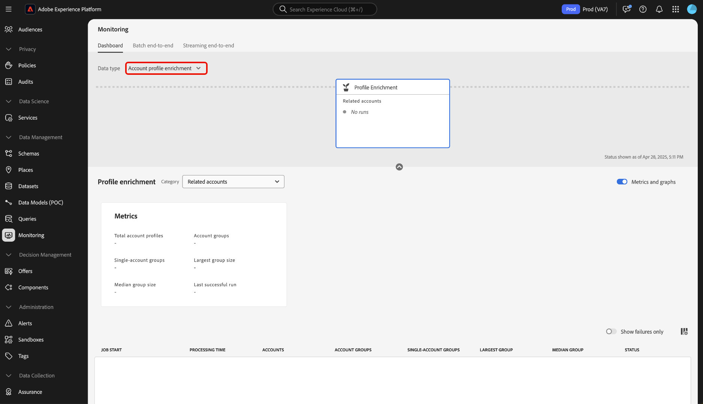
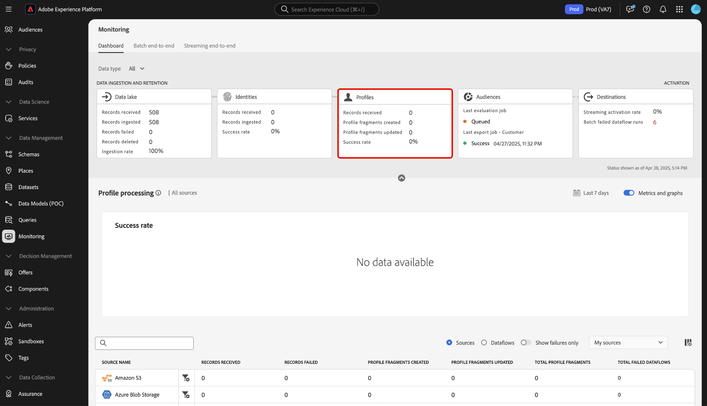

# Monitoring-Dashboard - Übersicht

Verwenden Sie das Überwachungs-Dashboard in der Adobe Experience Platform-Benutzeroberfläche, um das Journey Ihrer Daten von der Aufnahme bis zur Aktivierung anzuzeigen. Mit dem Überwachungs-Dashboard können Sie:

* Überwachen Sie das Journey Ihrer Daten aus Quellen, Identity Service, Echtzeit-Kundenprofil, Zielgruppen und schließlich in Zielen.
* Zeigen Sie je nach Phase, in der sich Ihre Daten befinden, unterschiedliche Metriken und Status an.
* Filtern Sie Ihre Datenüberwachungsansicht nach Datentyp.

Das Monitoring-Dashboard unterstützt die Ansicht mehrerer verschiedener Datentypen:

* **Kunde und Konto**: Kundendaten beziehen sich auf die in [Real-Time Customer Data Platform](../../rtcdp/home.md) verwendeten Daten, während sich Kontodaten auf [Kontoprofildaten](../../rtcdp/accounts/account-profile-overview.md) beziehen, auf die zugegriffen werden kann, wenn [Real-Time CDP, B2B edition](../../rtcdp/b2b-overview.md) abonniert wurde. Wenn Ihre Real-Time CDP-Lizenz Real-Time CDP, B2B edition nicht enthält, können Sie das Monitoring-Dashboard nur zur Überwachung von Kundendaten verwenden.
* **Interessent**: [Interessentenprofile](../../profile/ui/prospect-profile.md) dienen zur Darstellung von Personen, die noch nicht mit Ihrem Unternehmen interagiert haben, die Sie jedoch erreichen möchten. Mit Interessentenprofilen können Sie Ihre Kundenprofile mit Attributen von vertrauenswürdigen Drittanbieterpartnern ergänzen. Sie müssen über eine Lizenz für Real-Time CDP (App Service), Adobe Experience Platform Activation, Real-Time CDP, Real-Time CDP Prime, Real-Time CDP Ultimate verfügen, um den Datentyp des potenziellen Kunden anzeigen zu können.
* **Kontoprofil-Anreicherung**: Mit Kontoprofilen können Sie Kontoinformationen aus mehreren Quellen vereinheitlichen. Sie müssen über eine Lizenz für Real-Time CDP, B2B edition verfügen, um die Daten zur Kontoprofilanreicherung überwachen zu können.

Lesen Sie dieses Dokument, um zu erfahren, wie Sie mit dem Monitoring-Dashboard das Journey Ihrer Daten über verschiedene Experience Platform-Services hinweg überwachen können.

## Erste Schritte

Dieses Dokument setzt ein Verständnis der folgenden Komponenten von Experience Platform voraus:

* [Datenflüsse](../home.md): Datenflüsse sind Darstellungen von Datenvorgängen, die Daten über Experience Platform verschieben. Sie können den Arbeitsbereich „Quellen“ verwenden, um Datenflüsse zu erstellen, die Daten aus einer bestimmten Quelle in Experience Platform aufnehmen.
* [Quellen](../../sources/home.md): Verwenden Sie Quellen in Experience Platform, um Daten aus einer Adobe-Anwendung oder einer Datenquelle eines Drittanbieters aufzunehmen.
* [Identity Service](../../identity-service/home.md): Verschaffen Sie sich einen besseren Überblick über einzelne Kundinnen und Kunden und deren Verhalten, indem Sie Identitäten geräte- und systemübergreifend verknüpfen.
* [Echtzeit-Kundenprofil](../../profile/home.md): Bietet ein einheitliches Echtzeit-Kundenprofil, das auf aggregierten Daten aus verschiedenen Quellen basiert.
* [Segmentierung](../../segmentation/home.md): Verwenden Sie den Segmentierungs-Service, um Segmente und Zielgruppen aus Ihren Echtzeit-Kundenprofildaten zu erstellen.
* [Ziele](../../destinations/home.md): Ziele sind vorgefertigte Integrationen mit häufig verwendeten Programmen, die die nahtlose Aktivierung von Daten aus Experience Platform für kanalübergreifende Marketing-Kampagnen, E-Mail-Kampagnen, zielgruppengerechte Werbung und viele andere Anwendungsfälle ermöglichen.

## Handbuch zum Monitoring-Dashboard

Wählen Sie in der Benutzeroberfläche von Experience Platform **[!UICONTROL Überwachung]** unter [!UICONTROL Datenverwaltung] im linken Navigationsbereich aus.

Wählen Sie **[!UICONTROL Datentyp]** aus und wählen Sie dann im Dropdown-Menü den Datentyp aus, den Sie anzeigen möchten. Datentypen werden von Experience-Datenmodell (XDM)-Schemaklassen definiert, um sicherzustellen, dass ihre Daten bei der Aufnahme in Experience Platform einem Standardformat entsprechen. Weitere Informationen finden Sie in der folgenden Dokumentation:

* [Datentyp des B2B-Kontos](../../rtcdp/b2b-tutorial.md)
* [Datentyp des Interessenten](../../rtcdp/partner-data/prospecting.md)

Sie können Ihre Ansicht anhand der folgenden Datentypen filtern:

>[!BEGINTABS]

>[!TAB Alle]

Wählen Sie **[!UICONTROL Alle]** aus, um Ihr Dashboard zu aktualisieren und Metriken zu allen Daten anzuzeigen, die im Laufe eines bestimmten Zeitraums in Experience Platform aufgenommen wurden.

>[!TAB Kunde &amp; Konto]

Wählen Sie **[!UICONTROL Kunde und Konto]** aus, um Ihr Dashboard zu aktualisieren und Metriken zu Kunden- und Kontodaten anzuzeigen, die im Laufe eines bestimmten Zeitraums in Experience Platform aufgenommen wurden.

>[!TAB Anreicherung von Kontoprofilen]

Wählen Sie **[!UICONTROL Kontoprofilanreicherung]** aus, um Ihr Dashboard zu aktualisieren und Metriken zu Profilanreicherungsdaten anzuzeigen. **Hinweis**: Sie können die Metriken zur Anreicherung von Account-Profilen nur anzeigen, wenn Sie berechtigt sind, B2B[Daten ](../../rtcdp/b2b-tutorial.md).

>[!ENDTABS]

Verwenden Sie die obere Kopfzeile des Dashboards für ein dienstübergreifendes Monitoring. Sie können Ihre Metriken- und Diagrammansicht filtern, indem Sie die Funktionskarte Ihrer Wahl in der Kopfzeile der Datenkategorie auswählen.

>[!BEGINTABS]

>[!TAB Data Lake]

Wählen Sie **[!UICONTROL Data Lake]** aus, um Metriken zu Ihrer Data-Lake-Aufnahmerate anzuzeigen. Weitere Informationen finden Sie im Handbuch [Überwachen der Data-Lake](monitor-sources.md)Aufnahme“.

>[!TAB Identitäten]

Wählen Sie **[!UICONTROL Identitäten]** aus, um die Verarbeitungserfolgsrate Ihrer Identitätsdaten anzuzeigen. Weitere Informationen finden Sie im Handbuch [Überwachen von Identitätsdaten](monitor-identities.md) .

>[!TAB Profile]

Wählen Sie **[!UICONTROL Profile]** aus, um die Erfolgsrate der Verarbeitung Ihrer Profildaten anzuzeigen. Weitere Informationen finden Sie im Handbuch [Überwachen ](monitor-profiles.md) Profildaten“.

>[!TAB Zielgruppen]

Wählen Sie **[!UICONTROL Zielgruppen]** aus, um Metriken zu Ihren Zielgruppen und Segmentierungsaufträgen anzuzeigen. Weitere Informationen finden Sie im Handbuch [Überwachen ](monitor-audiences.md) Zielgruppendaten“.

>[!TAB Ziele]

Wählen Sie **[!UICONTROL Ziele]** aus, um Metriken zu Ihrer [!UICONTROL Streaming-Aktivierungsrate] und [!UICONTROL fehlgeschlagenen Batch-Datenflussausführungen] anzuzeigen. Weitere Informationen finden Sie im Handbuch [Überwachen von ](monitor-destinations.md)&quot;.

>[!ENDTABS]

### Zeitrahmen für die Überwachung konfigurieren {#configure-monitoring-time-frame}

Standardmäßig zeigt das Überwachungs-Dashboard Metriken zu den Daten an, die innerhalb der letzten 24 Stunden aufgenommen wurden. Um den Zeitrahmen zu aktualisieren, wählen Sie **[!UICONTROL Letzte 24 Stunden]**.

Im angezeigten Dialogfeld können Sie einen neuen Zeitrahmen für Ihre Datenüberwachungsansicht konfigurieren. Sie haben die Möglichkeit, einen benutzerdefinierten Zeitrahmen zu erstellen oder aus der Liste der vorkonfigurierten Optionen auszuwählen:

* [!UICONTROL Letzte 24 Stunden]
* [!UICONTROL Letzte 7 Tage]
* [!UICONTROL Letzte 30 Tage]

Wenn Sie fertig sind, wählen Sie **[!UICONTROL Anwenden]** aus.

## Nächste Schritte

Durch Lesen dieses Dokuments können Sie sich jetzt in der Benutzeroberfläche durch das Überwachungs-Dashboard navigieren. Informationen zum Überwachen von Daten für einen bestimmten Experience Platform-Service finden Sie in der folgenden Dokumentation:

* [Überwachen der Data Lake-Aufnahme](monitor-sources.md).
* [Identitätsdaten überwachen](monitor-identities.md).
* [Überwachen von ](monitor-profiles.md).
* [Zielgruppendaten überwachen](monitor-audiences.md).
* [Zieldaten überwachen](monitor-destinations.md).

<!-- >[!TAB Prospect]

Select **[!UICONTROL Prospect]** to update your dashboard and display metrics on prospecting data that has been ingested to Experience Platform over the course of a given period. **Note**: You can only view prospect data type activities if you are [entitled to prospect data](../../rtcdp/partner-data/prospecting.md). -->