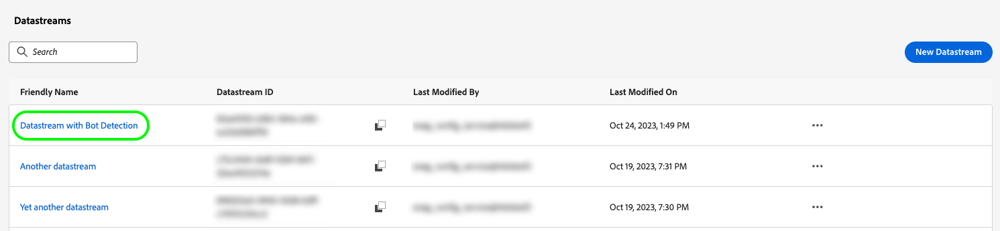
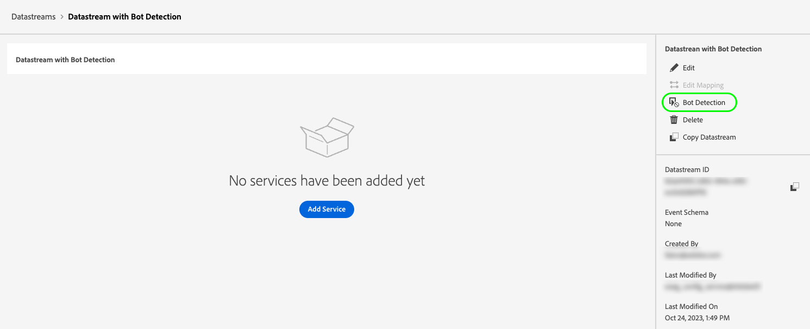
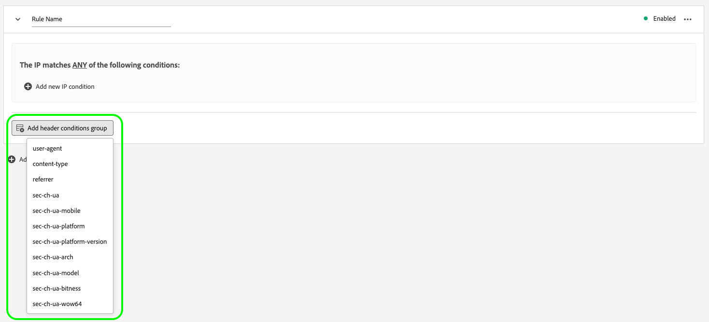
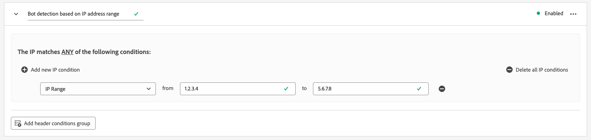

# Konfigurieren der Bot-Erkennung für Datenströme

Nicht-menschlicher Traffic von automatisierten Programmen, Web-Scraptern, Spinnen und Scannern mit Skripten kann es schwierig machen, Ereignisse von menschlichen Besuchern zu identifizieren. Dieser Traffic kann sich negativ auf wichtige Geschäftsmetriken auswirken und zu falschen Traffic-Berichten führen.

Mit der Bot-Erkennung können Sie Ereignisse identifizieren, die von [Web SDK](/help/collection/js/js-overview.md), [Mobile SDK](https://developer.adobe.com/client-sdks/home/) und [[!DNL Edge Network API]](https://developer.adobe.com/data-collection-apis/docs/api/) von bekannten Spiders und Bots generiert wurden.

>[!NOTE]
>
>Verwenden Sie die [!DNL Bot Detection Service], um nicht menschlichen (Bot-)Traffic aus Ihren -Daten zu identifizieren und zu filtern. Dadurch wird das Rauschen in den erfassten Datensätzen reduziert und sichergestellt, dass Ihre Analysen und Berichte echte Benutzerinteraktionen widerspiegeln.

Durch das Konfigurieren der Bot-Erkennung für Ihre Datenströme können Sie bestimmte IP-Adressen, IP-Bereiche und Anfrage-Header identifizieren, die als Bot-Ereignisse klassifiziert werden sollen. Auf diese Weise lassen sich Benutzeraktivitäten auf Ihrer Site oder in Mobile Apps genauer messen.

Wenn eine Anfrage an die Edge Network mit einer der Regeln zur Bot-Erkennung übereinstimmt, wird das XDM-Schema mit einem Bot-Score aktualisiert (immer auf 1 gesetzt), wie unten dargestellt:

```json
{
  "botDetection": {
    "score": 1
  }
}
```

Diese Bot-Bewertung hilft den Lösungen, die die Anfrage erhalten, Bot-Traffic korrekt zu identifizieren.

>[!IMPORTANT]
>
>Die Bot-Erkennung löscht keine Bot-Anfragen. Es wird nur das XDM-Schema mit der Bot-Bewertung aktualisiert und das Ereignis an den [Datenstrom-Service](configure.md) weitergeleitet, den Sie konfiguriert haben.
>
>Adobe-Lösungen können die Bewertung von Bots auf unterschiedliche Weise verarbeiten. Beispielsweise verwendet Adobe Analytics einen eigenen [Bot-Filterdienst](https://experienceleague.adobe.com/docs/analytics/admin/admin-tools/manage-report-suites/edit-report-suite/report-suite-general/bot-removal/bot-rules.html) und verwendet nicht den von der Edge Network festgelegten Wert. Die beiden Services verwenden dieselbe [IAB-Bot-Liste](https://www.iab.com/guidelines/iab-abc-international-spiders-bots-list/) sodass die Bot-Bewertung identisch ist.

## Technische Überlegungen {#technical-considerations}

Bevor Sie die Bot-Erkennung in Ihren Datenströmen aktivieren, sollten Sie einige wichtige Punkte beachten, um genaue Ergebnisse und eine reibungslose Implementierung sicherzustellen:

* Die Bot-Erkennung gilt nur für nicht authentifizierte Anfragen, die an `edge.adobedc.net` gesendet werden.
* Authentifizierte Anfragen, die an `server.adobedc.net` gesendet werden, werden nicht für Bot-Traffic ausgewertet, da authentifizierter Traffic als vertrauenswürdig betrachtet wird.
* Es kann bis zu 15 Minuten dauern, bis sich Bot-Erkennungsregeln nach ihrer Erstellung in Edge Network ausbreiten.

## Voraussetzungen {#prerequisites}

Damit die Bot-Erkennung in Ihrem Datenstrom funktioniert, müssen Sie die **[[!UICONTROL [Bot Detection Information]]](../xdm/field-groups/event/bot-detection-information.md)** Feldergruppe zu Ihrem Schema hinzufügen. Informationen zum Hinzufügen von Feldergruppen zu einem Schema finden Sie [&#128279;](../xdm/ui/resources/schemas.md#add-field-groups) der Dokumentation zum XDM-Schema .

## Konfigurieren der Bot-Erkennung für Datenströme {#configure}

Sie können die Bot-Erkennung konfigurieren, nachdem Sie eine Datenstromkonfiguration erstellt haben. Weitere Informationen finden Sie in der Dokumentation [Erstellen und Konfigurieren eines Datenstroms](configure.md) und befolgen Sie dann die folgenden Anweisungen, um Ihrem Datenstrom Funktionen zur Bot-Erkennung hinzuzufügen.

Gehen Sie zur Liste Datenströme und wählen Sie den Datenstrom aus, dem Sie die Bot-Erkennung hinzufügen möchten.



Wählen Sie auf der Seite mit den Datenstromdetails die Option **[!UICONTROL Bot Detection]** in der rechten Leiste aus.



Die Seite **[!UICONTROL Bot Detection Rules]** wird angezeigt.


Auf der Seite Regeln für die Bot-Erkennung können Sie die Bot-Erkennung mithilfe der folgenden Funktionen konfigurieren:

* Verwenden der [IAB/ABC International Spiders and Bots List](https://www.iab.com/guidelines/iab-abc-international-spiders-bots-list/).
* Erstellen eigener Regeln zur Bot-Erkennung.

### Verwenden der IAB/ABC International Spiders and Bots List {#iab-list}

Die [IAB/ABC International Spiders and Bots List](https://www.iab.com/guidelines/iab-abc-international-spiders-bots-list/) ist eine Drittanbieter-Liste von Internet-Spiders und -Bots nach Industriestandard. In dieser Liste können Sie automatisierten Traffic, z. B. Suchmaschinen-Crawlers, Überwachungs-Tools und anderen nicht menschlichen Traffic, identifizieren, den Sie möglicherweise nicht in Ihre Analytics-Zählungen einbeziehen möchten.

So konfigurieren Sie Ihren Datenstrom für die Verwendung der IAB/ABC International Spiders and Bots List:

1. Schalten Sie die Option **[!UICONTROL Use IAB/ABC International Spiders and Bots List for bot detection on this datastream]** ein.
2. Wählen Sie **[!UICONTROL Save]** aus, um die Einstellungen für die Bot-Erkennung auf Ihren Datenstrom anzuwenden.


### Erstellen von Bot-Erkennungsregeln {#rules}

Zusätzlich zur Verwendung der [IAB/ABC International Spiders and Bots List](https://www.iab.com/guidelines/iab-abc-international-spiders-bots-list/) können Sie für jeden Datenstrom eigene Regeln zur Bot-Erkennung definieren.

Sie können Regeln für die Bot-Erkennung basierend auf **IP-** und **IP-Adressbereichen** erstellen.

Wenn Sie detailliertere Regeln zur Bot-Erkennung benötigen, können Sie die IP-Bedingungen mit den Bedingungen im Anfrage-Header kombinieren. Regeln zur Bot-Erkennung können die folgenden Kopfzeilen verwenden:

| HTTP-Header | Beschreibung |
| --- | --- |
| `user-agent` | Eine Kopfzeile, mit der Server und Netzwerk-Peers die Anwendung, das Betriebssystem, den Anbieter und/oder die Version des anfragenden Benutzeragenten identifizieren können. |
| `content-type` | Gibt den ursprünglichen Medientyp der Ressource an (vor jeder zum Senden angewendeten Inhaltscodierung). |
| `referer` | Gibt die Adresse der Web-Seite an, von der die Ressource angefordert wurde. |
| `sec-ch-ua` | Stellt die Marke und die Hauptversion für jede Marke bereit, die mit dem Browser verbunden ist, und zwar in einer durch Kommas getrennten Liste. |
| `sec-ch-ua-mobile` | Gibt an, ob sich der Browser auf einem Mobilgerät befindet. Sie kann auch von einem Desktop-Browser verwendet werden, um eine Präferenz für ein mobiles Benutzererlebnis anzugeben. |
| `sec-ch-ua-platform` | Stellt die Plattform oder das Betriebssystem bereit, auf dem der Benutzeragent ausgeführt wird. Beispiel: „Windows“ oder &quot;Android&quot;. |
| `sec-ch-ua-platform-version` | Stellt die Version des Betriebssystems bereit, auf dem der Benutzeragent ausgeführt wird. |
| `sec-ch-ua-arch` | Stellt die zugrunde liegende CPU-Architektur des Benutzeragenten bereit, z. B. ARM oder x86. |
| `sec-ch-ua-model` | Gibt das Gerätemodell an, auf dem der Browser ausgeführt wird. |
| `sec-ch-ua-bitness` | Stellt die „Bitness“ der zugrunde liegenden CPU-Architektur des Benutzeragenten bereit. Dies ist die Größe in Bit einer Ganzzahl oder Speicheradresse - typischerweise 64 oder 32 Bit. |
| `sec-ch-ua-wow64` | Zeigt an, ob eine Benutzeragentenbinärdatei unter 64-Bit-Windows im 32-Bit-Modus ausgeführt wird. |

Gehen Sie wie folgt vor, um eine Regel zur Bot-Erkennung zu erstellen:

1. Wählen Sie **[!UICONTROL Add New Rule]** aus.

   

2. Geben Sie einen Namen für die Regel im Feld **[!UICONTROL Rule Name]** ein.

   

3. Wählen Sie **[!UICONTROL Add new IP condition]** aus, um eine neue IP-basierte Regel hinzuzufügen. Sie können die Regel nach IP-Adresse oder IP-Adressbereich definieren.

   

   

   >[!TIP]
   >
   >The IP conditions are based on a logical `OR` operation. A request is marked as originating from a bot if it matches any of the IP conditions that you defined.

4. If you want to add header conditions to your rule, select **[!UICONTROL Add header conditions group]**, and then select the headers which you want the rule to use.

   

   Then, add the conditions to be used for the selected header.

   

5. After configuring the desired bot detection rules, select **[!UICONTROL Save]** to have the rules applied to your datastream.

   


## Bot detection rule examples {#examples}

To help you get started with bot detection, you can use the examples detailed below to create bot detection rules.

### Bot detection based on one IP address {#one-ip}

To mark all requests originating from a specific IP address as bot traffic, create a new bot detection rule which evaluates a single IP address, as shown in the image below.


### Bot detection based on two IP addresses {#two-ip}

To mark all requests originating from either of two specific IP addresses as bot traffic, create a new bot detection rule which evaluates two IP addresses, as shown in the image below.


### Bot detection based on a range of IP addresses {#range}

To mark all requests originating from any IP address in a specific range as bot traffic, create a new bot detection rule which evaluates an entire IP address range, as shown in the image below.



### Bot detection based on an IP address and a request header {#ip-header}

To mark all requests originating from a specific IP address and containing a specific request header as bot traffic, create a new bot detection rule as shown in the image below.

This rule checks if the request originates from a specific IP address and if the `referer` request header starts with `www.adobe.com`.


### Bot detection based on multiple conditions {#multiple-conditions}

You can create bot detection rules based on:

* **Mehrere unterschiedliche Bedingungen**: Verschiedene Bedingungen werden als logischer `AND`-Vorgang ausgewertet, d. h. die Bedingungen müssen gleichzeitig erfüllt sein, damit die Anfrage als von einem Bot stammend identifiziert werden kann.
* **Mehrere Bedingungen desselben Typs**: Bedingungen desselben Typs werden als logischer `OR`-Vorgang ausgewertet, d. h. wenn eine der Bedingungen erfüllt ist, wird die Anfrage als von einem Bot stammend identifiziert.

Die in der folgenden Abbildung dargestellte Regel identifiziert eine Bot-Ursprungs-Anfrage, wenn die folgenden Bedingungen erfüllt sind:

Die Anfrage stammt von einer der beiden IP-Adressen, die `referer`-Kopfzeile beginnt mit `www.adobe.com` und die `sec-ch-ua-mobile`-Kopfzeile identifiziert die Anfrage als von einem Desktop-Browser stammend.


