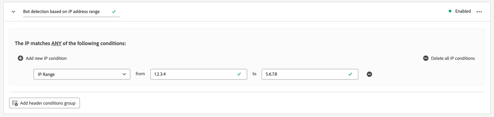

# Konfigurieren der Bot-Erkennung für Datenspeicher

Traffic, der von unmenschlichen Entitäten stammt, wie z. B. automatisierten Programmen, Webcrapers, Spider, Skriptscannern, kann es erschweren, Ereignisse von Besuchern zu identifizieren. Dieser Traffic-Typ kann sich negativ auf wichtige Geschäftsmetriken auswirken und zu falschen Traffic-Berichten führen.

Mit der Bot-Erkennung können Sie Ereignisse identifizieren, die von der [Web SDK](../web-sdk/home.md), [Mobile SDK](https://developer.adobe.com/client-sdks/home/) und [[!DNL Server API]](../server-api/overview.md) als von bekannten Spiders und Bots generiert wurde.

Durch die Konfiguration der Bot-Erkennung für Ihre Datenspeicher können Sie bestimmte IP-Adressen, IP-Bereiche und Anforderungsheader identifizieren, die Sie als Bot-Ereignisse klassifizieren möchten.

Die Identifizierung des Bot-Traffics kann Ihnen eine präzisere Messung der Benutzeraktivität auf Ihrer Site oder in Ihrer mobilen Anwendung ermöglichen.

Wenn eine Anfrage an das Edge Network mit einer der Bot-Erkennungsregeln übereinstimmt, wird das XDM-Schema mit einer Bot-Auswertung aktualisiert (immer auf 1 gesetzt), wie unten dargestellt.

```json
{
  "botDetection": {
    "score": 1
  }
}
```

Diese Bot-Bewertung hilft den Lösungen, die die Anfrage erhalten, den Bot-Traffic korrekt zu identifizieren.

>[!IMPORTANT]
>
>Bei der Bot-Erkennung werden keine Bot-Anforderungen entfernt. Es aktualisiert nur das XDM-Schema mit dem Bot-Scoring und leitet das Ereignis an die [Datastream-Dienst](configure.md) die Sie konfiguriert haben.
>
>Adobe-Lösungen können Bot-Scoring auf unterschiedliche Weise handhaben. Adobe Analytics verwendet beispielsweise eine eigene [Bot-Filterdienst](https://experienceleague.adobe.com/docs/analytics/admin/admin-tools/manage-report-suites/edit-report-suite/report-suite-general/bot-removal/bot-rules.html) und verwendet nicht den vom Edge Network festgelegten Wert. Die beiden Dienste verwenden dasselbe [IAB-Bot-Liste](https://www.iab.com/guidelines/iab-abc-international-spiders-bots-list/), sodass die Bot-Bewertung identisch ist.

Es kann bis zu 15 Minuten dauern, bis Bot-Erkennungsregeln nach der Erstellung über das Edge Network übertragen werden.

## Voraussetzungen {#prerequisites}

Damit die Bot-Erkennung auf Ihrem Datastream funktioniert, müssen Sie die **[!UICONTROL Informationen zur Bot-Erkennung]** Feldergruppe in Ihr Schema ein. Siehe [XDM-Schema](../xdm/ui/resources/schemas.md#add-field-groups) Dokumentation , um zu erfahren, wie Sie einem Schema Feldergruppen hinzufügen.

## Konfigurieren der Bot-Erkennung für Datenspeicher {#configure}

Sie können die Bot-Erkennung konfigurieren, nachdem Sie eine Datastream-Konfiguration erstellt haben. Weitere Informationen finden Sie in der Dokumentation [Erstellen und Konfigurieren eines Datenspeichers](configure.md)folgen Sie dann den unten stehenden Anweisungen, um Ihrem Datastream Bot-Erkennungsfunktionen hinzuzufügen.

Gehen Sie zur Liste der Datenspeicher und wählen Sie den Datastream aus, dem Sie die Bot-Erkennung hinzufügen möchten.


Wählen Sie auf der Seite mit den Datenspeicherdetails die **[!UICONTROL Bot-Erkennung]** in der rechten Leiste.


Die **[!UICONTROL Regeln zur Bot-Erkennung]** angezeigt.


Auf der Seite &quot;Bot-Erkennungsregeln&quot;können Sie die Bot-Erkennung mithilfe der folgenden Funktionen konfigurieren:

* Verwenden der [!DNL [IAB/ABC International Spiders and Bots List]](https://www.iab.com/guidelines/iab-abc-international-spiders-bots-list/).
* Erstellen eigener Bot-Erkennungsregeln

### Verwenden der IAB/ABC International Spiders and Bots List {#iab-list}

Die [IAB/ABC International Spiders and Bots List](https://www.iab.com/guidelines/iab-abc-international-spiders-bots-list/) ist eine branchenübliche Drittanbieter-Liste von Internet-Spiders und Bots, mit der Sie automatisierten Traffic identifizieren können, z. B. Suchmaschinen-Crawler, Überwachungswerkzeuge und anderen nicht menschlichen Traffic, den Sie möglicherweise nicht in Ihren Analytics-Zählungen anzeigen möchten.

So konfigurieren Sie Ihren Datenspeicher für die Verwendung der [!DNL IAB/ABC International Spiders and Bots List], um die **[!UICONTROL Verwenden der IAB/ABC International Spiders and Bots List zur Bot-Erkennung für diesen Datastream]** und wählen Sie dann Speichern aus, um die Bot-Erkennungseinstellungen auf Ihren Datastream anzuwenden.


### Erstellen von Bot-Erkennungsregeln {#rules}

Zusätzlich zur Verwendung der [IAB/ABC International Spiders and Bots List](https://www.iab.com/guidelines/iab-abc-international-spiders-bots-list/)können Sie für jeden Datastream eigene Bot-Erkennungsregeln definieren.

Sie können Bot-Erkennungsregeln erstellen, die auf **IP-Adressen** und **IP-Adressbereiche**.

Wenn Sie detailliertere Bot-Erkennungsregeln benötigen, können Sie die IP-Bedingungen mit den Anforderungen-Header-Bedingungen kombinieren. Bot-Erkennungsregeln können die folgenden Kopfzeilen verwenden:

| HTTP-Header | Beschreibung |
| --- | --- |
| `user-agent` | Ein Header, der es Servern und Netzwerkpartnern ermöglicht, die Anwendung, das Betriebssystem, den Anbieter und/oder die Version des anfragenden Benutzeragenten zu identifizieren. |
| `content-type` | Gibt den ursprünglichen Medientyp der Ressource an (vor einer für den Versand angewendeten Inhaltskodierung). |
| `referer` | Gibt die Adresse der Webseite an, von der die Ressource angefordert wurde. |
| `sec-ch-ua` | Stellt die Marke und die signifikante Version für jede mit dem Browser verknüpfte Marke in einer kommagetrennten Liste bereit. |
| `sec-ch-ua-mobile` | Gibt an, ob sich der Browser auf einem Mobilgerät befindet. Es kann auch von einem Desktop-Browser verwendet werden, um eine Voreinstellung für ein mobiles Benutzererlebnis anzugeben. |
| `sec-ch-ua-platform` | Stellt die Plattform oder das Betriebssystem bereit, auf der der Benutzeragent ausgeführt wird. Beispiel: &quot;Windows&quot;oder &quot;Android&quot;. |
| `sec-ch-ua-platform-version` | Stellt die Version des Betriebssystems bereit, auf dem der Benutzeragent ausgeführt wird. |
| `sec-ch-ua-arch` | Stellt die zugrunde liegende CPU-Architektur des Benutzeragenten bereit, z. B. ARM oder x86. |
| `sec-ch-ua-model` | Gibt das Gerätemodell an, auf dem der Browser ausgeführt wird. |
| `sec-ch-ua-bitness` | Stellt die &quot;Bitness&quot;der zugrunde liegenden CPU-Architektur des Benutzeragenten bereit. Dies ist die Größe in Bits einer Integer- oder Speicheradresse, normalerweise 64 oder 32 Bit. |
| `sec-ch-ua-wow64` | Gibt an, ob eine Benutzeragenten-Binärdatei im 32-Bit-Modus unter 64-Bit Windows ausgeführt wird. |

Gehen Sie wie folgt vor, um eine Bot-Erkennungsregel zu erstellen:

1. Auswählen **[!UICONTROL Neue Regel hinzufügen]**.

   

2. Geben Sie einen Namen für die Regel im **[!UICONTROL Regelname]** -Feld.

   

3. Auswählen **[!UICONTROL Neue IP-Bedingung hinzufügen]** , um eine neue IP-basierte Regel hinzuzufügen. Sie können die Regel nach IP-Adresse oder IP-Adressbereich definieren.

   

   

   >[!TIP]
   >
   >Die IP-Bedingungen basieren auf einem logischen `OR` Vorgang. Eine Anfrage wird als von einem Bot kommend markiert, wenn eine der von Ihnen definierten IP-Bedingungen erfüllt ist.

4. Wenn Sie der Regel Kopfzeilenbedingungen hinzufügen möchten, wählen Sie **[!UICONTROL Gruppe mit Kopfzeilenbedingungen hinzufügen]** und wählen Sie dann die Kopfzeilen aus, die die Regel verwenden soll.

   

   Fügen Sie dann die für die ausgewählte Kopfzeile zu verwendenden Bedingungen hinzu.

   

5. Nachdem Sie die gewünschten Bot-Erkennungsregeln konfiguriert haben, wählen Sie **[!UICONTROL Speichern]** , damit die Regeln auf Ihren Datastream angewendet werden.

   


## Beispiele für Bot-Erkennungsregeln {#examples}

Um Ihnen bei den ersten Schritten mit der Bot-Erkennung zu helfen, können Sie die unten beschriebenen Beispiele verwenden, um Bot-Erkennungsregeln zu erstellen.

### Bot-Erkennung basierend auf einer IP-Adresse {#one-ip}

Um alle Anforderungen einer bestimmten IP-Adresse als Bot-Traffic zu markieren, erstellen Sie eine neue Bot-Erkennungsregel, die eine einzelne IP-Adresse auswertet, wie in der Abbildung unten dargestellt.


### Bot-Erkennung basierend auf zwei IP-Adressen {#two-ip}

Um alle Anforderungen von einer der beiden IP-Adressen als Bot-Traffic zu markieren, erstellen Sie eine neue Bot-Erkennungsregel, die zwei IP-Adressen auswertet, wie in der Abbildung unten dargestellt.


### Bot-Erkennung basierend auf einer Reihe von IP-Adressen {#range}

Um alle Anforderungen aus einer beliebigen IP-Adresse in einem bestimmten Bereich als Bot-Traffic zu markieren, erstellen Sie eine neue Bot-Erkennungsregel, die einen gesamten IP-Adressbereich auswertet, wie in der Abbildung unten dargestellt.



### Bot-Erkennung basierend auf einer IP-Adresse und einem Anfrage-Header {#ip-header}

Um alle Anforderungen, die von einer bestimmten IP-Adresse stammen und einen bestimmten Anforderungsheader enthalten, als Bot-Traffic zu markieren, erstellen Sie eine neue Bot-Erkennungsregel, wie in der Abbildung unten dargestellt.

Diese Regel prüft, ob die Anfrage von einer bestimmten IP-Adresse stammt und ob die `referer` Anfrage-Kopfzeile beginnt mit `www.adobe.com`.


### Bot-Erkennung basierend auf mehreren Bedingungen {#multiple-conditions}

Sie können Bot-Erkennungsregeln erstellen, die auf Folgendem basieren:

* **Verschiedene Bedingungen**: Verschiedene Bedingungen werden als logisch ausgewertet `AND` -Vorgang, d. h. die Bedingungen müssen gleichzeitig erfüllt sein, damit der Antrag als von einem Bot stammt identifiziert werden kann.
* **Mehrere Bedingungen desselben Typs**: Bedingungen desselben Typs werden als logisch ausgewertet `OR` -Vorgang, d. h. wenn eine der Bedingungen erfüllt ist, wird die Anfrage als von einem Bot stammt identifiziert.

Die in der folgenden Abbildung dargestellte Regel identifiziert eine Bot-Origin-Anfrage, wenn die folgenden Bedingungen erfüllt sind:

Die Anfrage stammt von einer der beiden IP-Adressen, der `referer` -Kopfzeile beginnt mit `www.adobe.com`und die `sec-ch-ua-mobile` -Kopfzeile identifiziert die Anforderung als von einem Desktop-Browser stammt.


