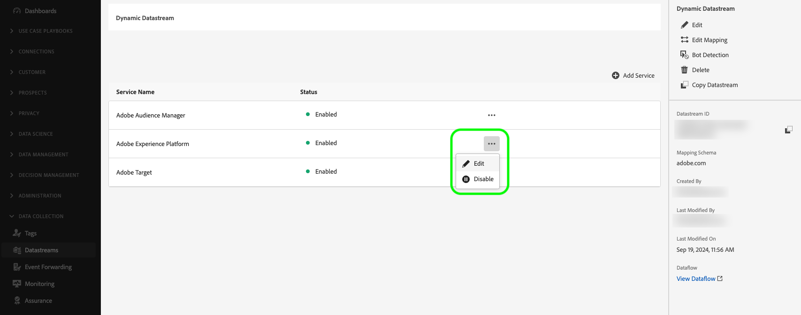
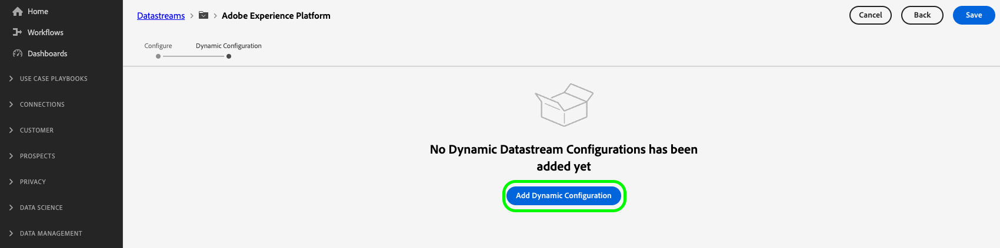
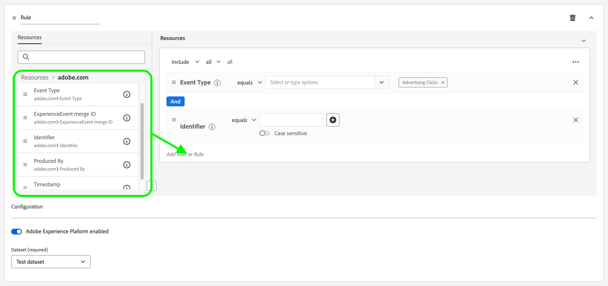

# Erstellen dynamischer Datenstromkonfigurationen

Standardmäßig sendet der [!DNL Adobe Experience Platform Edge Network] alle Ereignisse, die einen Datenstrom erreichen, an alle [!DNL Experience Cloud] ([), ](/help/datastreams/configure.md#add-services) Sie für Ihre Datenströme aktiviert haben. Je nach Anwendungsfall ist dies möglicherweise nicht immer der ideale Workflow.

Dynamische Datenstromkonfigurationen adressieren dies durch einen Satz von Regeln, die Sie für jeden für Ihren Datenstrom aktivierten Service definieren. Diese steuern, welche [!DNL Experience Cloud] Lösung die einzelnen Datentypen erhält.

## Voraussetzungen {#prerequisites}

Um eine dynamische Konfiguration für Ihren Datenstrom zu erstellen, müssen Sie zwei Bedingungen erfüllen:

* Es muss *mindestens* Datenstrom erstellt worden sein, mit dem Sie arbeiten können. Detaillierte Informationen finden Sie in der Dokumentation [ Erstellen ](/help/datastreams/configure.md) Datenstroms .
* Ihrem Datenstrom muss *mindestens* ein [!DNL Experience Cloud]-Service hinzugefügt werden. Detaillierte Informationen finden Sie in der Dokumentation [ Hinzufügen eines ](/help/datastreams/configure.md#add-services) zu einem Datenstrom .

Nachdem Sie einen Datenstrom erstellt und ihm einen Experience Cloud-Service hinzugefügt haben, können Sie [eine dynamische Konfiguration erstellen](#create-dynamic-configuration).

## Leitlinien {#guardrails}

Dynamische Datenstromkonfigurationen weisen bestimmte Beschränkungen und Leistungsbeschränkungen auf, um eine optimale Systemleistung und Datenverarbeitungseffizienz sicherzustellen. Die folgenden Leitplanken gelten für die Konfiguration dynamischer Datenstromregeln:

| Leitplanke | Limit | Art des Limits |
|---------|------------|------|
| Maximale Anzahl dynamischer Datenstromkonfigurationen pro Datenstrom für Experience Platform-Services | 5 | Leistungs-Schutzmaßnahme |
| Maximale Anzahl dynamischer Datenstromkonfigurationen pro Datenstrom für die Ereignisweiterleitung | 5 | Leistungs-Schutzmaßnahme |
| Maximale Anzahl dynamischer Datenstromkonfigurationen pro Datenstrom für [!DNL Adobe Analytics] | 5 | Leistungs-Schutzmaßnahme |
| Maximale Anzahl dynamischer Datenstromkonfigurationen pro Datenstrom für [!DNL Adobe Target] | 5 | Leistungs-Schutzmaßnahme |
| Maximale Anzahl dynamischer Datenstromkonfigurationen pro Datenstrom für [!DNL Adobe Audience Manager] | 5 | Leistungs-Schutzmaßnahme |
| Maximale Anzahl von Bedingungen (Prädikate), die in einer einzigen Regel kombiniert werden können | 100 | Leistungs-Schutzmaßnahme |
| Maximal zulässige Zeit für die Auswertung aller dynamischen Datenstromkonfigurationen pro Datenstrom vor Ablauf der Zeit | 25 ms | Vom System erzwungene Leitplanken |

## Überschreibungen der dynamischen Datenstromkonfigurationen im Vergleich zur Datenstromkonfiguration {#dynamic-versus-overrides}

Dynamische Datenstromkonfigurationen und [Überschreibungen der Datenstromkonfiguration](/help/datastreams/overrides.md) schließen sich gegenseitig aus.

Sie können keine dynamischen Datenstromkonfigurationen zusammen mit Überschreibungen der Datenstromkonfiguration verwenden. Sie müssen entweder das eine oder das andere wählen.

Wenn Sie beide aktivieren, haben Konfigurationsüberschreibungen Vorrang und das System ignoriert die Konfigurationsregeln für dynamische Datenstroms.

## Erstellen einer dynamischen Datenstromkonfiguration {#create-dynamic-configuration}

Nachdem Sie [einen Datenstrom erstellt](configure.md) und [einen Service hinzugefügt](configure.md#add-services) haben, führen Sie die folgenden Schritte aus, um eine dynamische Konfiguration zum Service hinzuzufügen.

1. Gehen Sie zur Seite **[!UICONTROL Data Collection]** > **[!UICONTROL Datastreams]** und wählen Sie den von Ihnen erstellten Datenstrom aus.

   

1. Wählen Sie die Option **[!UICONTROL Edit]** für den Service aus, für den Sie eine dynamische Konfiguration definieren möchten.

   

1. Wählen Sie auf der **[!UICONTROL Configure]** Seite **[!UICONTROL Save and Edit Dynamic Configuration]** aus.

   

1. Wählen Sie **[!UICONTROL Add Dynamic Configuration]** aus.

   

1. Ziehen Sie die Elemente, mit denen Sie Ihre Regel erstellen möchten, aus dem **[!UICONTROL Resources]** auf die rechte Seite des Fensters. Sie können mehrere Ressourcen kombinieren, um komplexe Regeln zu erstellen.

   Verwenden Sie die Optionen jeder Ressource, z. B. **[!UICONTROL equals]**, **[!UICONTROL does not equal]**, **[!UICONTROL exists]** und mehr, um Ihre Regeln zu optimieren.

   

1. Aktivieren oder deaktivieren Sie im Abschnitt **[!UICONTROL Configuration]** die Services für jede Regel, je nachdem, ob Sie die Daten an die einzelnen Services senden möchten. Wenn Sie einen Service deaktivieren, wird das Routing deaktiviert und *keine Daten* werden an den nachgelagerten Service gesendet.

   

1. Wenn Sie mit der Konfiguration Ihrer Regeln fertig sind, wählen Sie **[!UICONTROL Save]** aus.

## Überlegungen zur Regelpriorität {#rule-priority}

Für jede Konfiguration eines dynamischen Datenstroms können Sie mehrere Regeln definieren. Wenn Ihre Daten jedoch den Bedingungen mehrerer Regeln entsprechen, wird nur die erste übereinstimmende Regel in der Liste berücksichtigt und alle anderen übereinstimmenden Regeln werden ignoriert.

Achten Sie zum Erzielen des gewünschten Daten-Routing-Verhaltens auf die Reihenfolge, in der Sie die Regeln anordnen.

Um die Regelreihenfolge zu konfigurieren, können Sie die Regelfenster in die gewünschte Reihenfolge ziehen.

## Eignungskriterien für Regeln {#eligibility-criteria}

Dynamische Datenstromkonfigurationen müssen bestimmte Eignungskriterien erfüllen, um eine hohe Leistung, Wartbarkeit und Klarheit zu gewährleisten. Im Folgenden finden Sie die wichtigsten Anforderungen und Best Practices für die Definition von Regeln.

### Unterstützte Datentypen {#supported-data-types}

Regeln für die dynamische Datenstromkonfiguration arbeiten mit bestimmten Datentypen, um eine optimale Leistung und ein zuverlässiges Daten-Routing sicherzustellen. Wenn Sie verstehen, welche Datentypen unterstützt werden, können Sie effektive Regeln erstellen, mit denen Ihre Daten effizient verarbeitet werden.

| Datentyp | Status | Anmerkungen |
|-----------|--------|-------|
| Zeichenfolge | Zugelassen | – |
| Zahl (Integer, Long, Short, Byte) | Zugelassen | – |
| Aufzählung | Zugelassen | – |
| Boolesch | Zugelassen | – |
| Datum | Zugelassen | – |
| Array | Nicht zulässig | Auf Arrays basierende Regeln werden nicht unterstützt, da sie die Leistung beeinträchtigen können. |
| Zuordnung | Nicht zulässig | Regeln, die auf Zuordnungen basieren, werden nicht unterstützt, da sie die Leistung beeinträchtigen können. |

### Unterstützte Operatoren {#supported-operators}

Regeln können je nach Datentyp die folgenden Operatoren verwenden:

| Datentyp | Unterstützte Operatoren |
|-----------|-------------------|
| **String** | `equals`, `starts with`, `ends with`, `contains`, `exists`, `does not equal`, `does not start with`, `does not end with`, `does not contain`, `does not exist` |
| **number (long, integer, short, byte)** | `equals`, `does not equal`, `greater than`, `less than`, `greater than or equal to`, `less than or equal to`, `exists`, `does not exist` |
| **Boolesch** | `equals true/false`, `does not equal true/false` |
| **enum** | `equals`, `does not equal`, `exists`, `does not exist` |
| **Datum** | `today`, `yesterday`, `this month`, `this year`, `custom date`, `in last`, `from`, `during`, `within`, `before`, `after`, `rolling range`, `in next`, `exists`, `does not exist` |
| **Logisch** | `INCLUDE`, `ANY/ALL` (entspricht [!DNL AND]/[!DNL OR]) |

>[!NOTE]
>
>Der **[!UICONTROL EXCLUDE]** Operator wird nicht direkt unterstützt, aber Sie können eine äquivalente Logik erreichen, indem Sie **[!UICONTROL INCLUDE]** mit negierten Vergleichsoperatoren verwenden (z. B. „ist nicht gleich„).

### Regelstruktur {#rule-structure}

Beim Erstellen von Regeln für dynamische Datenstromkonfigurationen ist es wichtig, die strukturellen Anforderungen zu verstehen, die eine optimale Leistung und Systemkompatibilität sicherstellen. Die Regelstruktur wirkt sich direkt darauf aus, wie effizient Ihre Daten verarbeitet und durch das System weitergeleitet werden.

**Nur flache Ausdrücke verwenden**. Sie müssen Regeln als flache logische Ausdrücke definieren. Verschachtelte logische Ausdrücke (bei Verwendung von Containern oder mehreren Ebenen von [!DNL AND]/[!DNL OR]) werden nicht unterstützt. Wenn Sie komplexe Logik benötigen, unterteilen Sie sie in mehrere einfache Regeln.

Betrachten Sie beispielsweise die folgende komplexe Regel.

Sie können diese Regel in die folgenden einfacheren Regeln unterteilen:

**Vermeiden Sie komplexe Regeln**. Einfachere Vorschriften gewährleisten eine schnellere Bewertung und bessere Wartungsfreundlichkeit.

### Best Practices {#best-practices}

Die Befolgung der Best Practices beim Erstellen dynamischer Datenstromkonfigurationsregeln stellt eine optimale Leistung, Systemzuverlässigkeit und verwaltbare Konfigurationen sicher. Diese Richtlinien helfen Ihnen, häufige Fehler zu vermeiden und effiziente Regeln zu erstellen, die nahtlos mit der Architektur der Plattform zusammenarbeiten.

* **Halten Sie Regeln einfach und flach.** Wenn Sie eine komplexe Logik ausdrücken müssen, verwenden Sie mehrere Regeln anstelle von Verschachtelungen.
* **Verwenden Sie nur [unterstützte Datentypen](#supported-data-types) und [Operatoren](#supported-operators).**
* **Testen Sie Ihre Regeln auf Leistung.** Zu komplexe oder nicht unterstützte Regeln können dazu führen, dass das System sie ablehnt, oder die Systemleistung beeinträchtigen.

