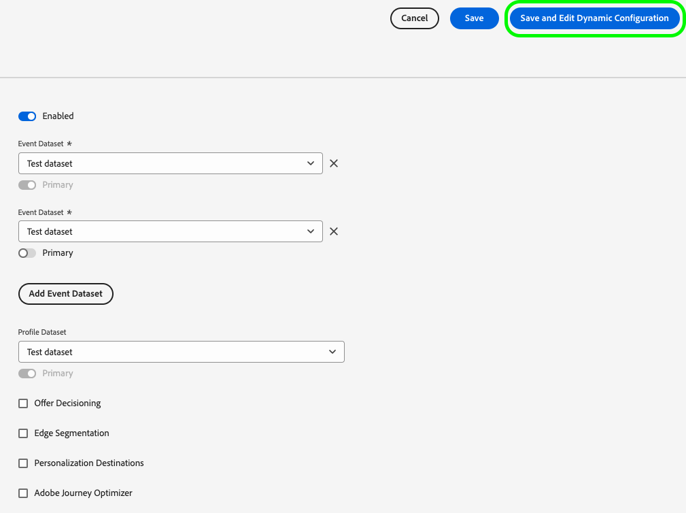

# Erstellen dynamischer Datenstromkonfigurationen

>[!AVAILABILITY]
>
>* Die Option zum Definieren dynamischer Datenstromkonfigurationen ist derzeit in Beta verfügbar und steht einer begrenzten Anzahl von Kunden zur Verfügung. Wenden Sie sich an Ihren Adobe-Support-Mitarbeiter, um Zugriff auf diese Funktion zu erhalten. Dokumentation und Funktionalitäten können sich ändern.

Standardmäßig sendet das Experience Platform-Edge Network alle Ereignisse, die einen Datenstrom erreichen, an alle Experience Cloud-[Services](configure.md#add-services) die Sie für Ihre Datenströme aktiviert haben. Je nach Anwendungsfall ist dies möglicherweise nicht immer der ideale Workflow für Sie.

Dynamische Datenstromkonfigurationen decken dieses Problem durch benutzerkonfigurierbare Regelsätze ab, die Sie für jeden für Ihren Datenstrom aktivierten Service definieren. Diese bestimmen, welche Experience Cloud-Lösung die einzelnen Datentypen erhalten soll.

## Voraussetzungen {#prerequisites}

Um eine dynamische Konfiguration für Ihren Datenstrom zu erstellen, müssen Sie zwei Bedingungen erfüllen:

* Es muss *mindestens* Datenstrom erstellt worden sein, mit dem Sie arbeiten können. Detaillierte Informationen finden Sie in der Dokumentation [ Erstellen ](configure.md) Datenstroms .
* Es muss *mindestens* Experience Cloud-Service zu Ihrem Datenstrom hinzugefügt werden. Detaillierte Informationen finden Sie in der Dokumentation [ Hinzufügen eines ](configure.md#add-services) zu einem Datenstrom .

Nachdem Sie einen Datenstrom erstellt und ihm einen Experience Cloud-Service hinzugefügt haben, können Sie [eine dynamische Konfiguration erstellen](#create-dynamic-configuration).

## Überschreibungen der dynamischen Datenstromkonfigurationen im Vergleich zur Datenstromkonfiguration {#dynamic-versus-overrides}

Dynamische Datenstromkonfigurationen und [Überschreibungen der Datenstromkonfiguration](overrides.md) schließen sich gegenseitig aus.

Das bedeutet, dass Sie keine dynamischen Datenstromkonfigurationen zusammen mit Überschreibungen der Datenstromkonfiguration verwenden können. Sie müssen entweder das eine oder das andere wählen.

Wenn Sie sowohl Überschreibungen der dynamischen Datenstromkonfigurationen als auch der Datenstromkonfiguration aktivieren, haben die Überschreibungen der Konfiguration Vorrang und die Regeln für die dynamische Datenstromkonfiguration werden ignoriert.

## Erstellen einer dynamischen Datenstromkonfiguration {#create-dynamic-configuration}

Nachdem Sie [einen Datenstrom erstellt](configure.md) und [einen Service hinzugefügt](configure.md#add-services) haben, führen Sie die folgenden Schritte aus, um eine dynamische Konfiguration zum Service hinzuzufügen.

1. Gehen Sie zur **[!UICONTROL Datenerfassung]** > **[!UICONTROL Datenströme]** und wählen Sie den von Ihnen erstellten Datenstrom aus.

   

1. Wählen Sie die **[!UICONTROL Bearbeiten]** für den Service aus, für den Sie eine dynamische Konfiguration definieren möchten.

   

1. Wählen Sie auf der **[!UICONTROL Konfigurieren]** die Option **[!UICONTROL Dynamische Konfiguration speichern und bearbeiten]** aus.

   

1. Wählen **[!UICONTROL Dynamische Konfiguration hinzufügen]** aus.

   

1. Ziehen Sie die Elemente **[!UICONTROL mit denen Sie Ihre Regel erstellen möchten, aus dem Bedienfeld]** Ressourcen“ auf die rechte Seite des Fensters. Sie können mehrere Ressourcen kombinieren, um komplexe Regeln zu erstellen.

   Verwenden Sie die Optionen jeder Ressource, z **[!UICONTROL B. „gleich]**, **[!UICONTROL nicht gleich]**, **[!UICONTROL vorhanden]** und mehr, um Ihre Regeln zu optimieren.

   

1. Schalten **[!UICONTROL im Abschnitt]** die Services ein, die Sie für jede Regel aktivieren oder deaktivieren möchten, je nachdem, ob Sie möchten, dass die Daten an jeden Service gesendet werden. Wenn Sie den Umschalter deaktivieren, wird das Service-Routing deaktiviert und *keine Daten* werden an den Upstream-Service gesendet.

   

1. Wenn Sie die Konfiguration Ihrer Regeln abgeschlossen haben, klicken Sie auf **[!UICONTROL Speichern]**.

## Überlegungen zur Regelpriorität {#considerations}

Für jede Konfiguration eines dynamischen Datenstroms können Sie mehrere Regeln definieren. Wenn Ihre Daten jedoch den Bedingungen mehrerer Regeln entsprechen, wird nur die erste übereinstimmende Regel in der Liste berücksichtigt und alle anderen übereinstimmenden Regeln werden ignoriert.

Achten Sie zum Erzielen des gewünschten Daten-Routing-Verhaltens auf die Reihenfolge, in der Sie die Regeln anordnen.

Um die Regelreihenfolge zu konfigurieren, können Sie die Regelfenster in die gewünschte Reihenfolge ziehen.

